# 保持冷静，黑掉盒子——蹩脚

> 原文：<https://www.freecodecamp.org/news/keep-calm-and-hack-the-box-lame/>

黑客盒子(HTB)是一个在线平台，让你测试你的渗透测试技能。它包含几个不断更新的挑战。有些是模拟真实世界的场景，有些更倾向于 CTF 风格的挑战。

**注**。*只允许报道退役的 HTB 机器。*


Lame 是 Hack The Box 上发布的第一台机器，面向初学者，只需要一次攻击就可以获得 root 访问权限。

我们将使用以下工具将盒子典当在一个 [Kali Linux 盒子](https://www.kali.org/)上

*   [nmap](https://nmap.org/)
*   [zenmap](https://nmap.org/zenmap/)
*   [searchsploit](https://www.exploit-db.com/searchsploit)
*   [metasploit](https://www.metasploit.com/)

## 步骤 1 -扫描网络

开发一台机器的第一步是做一些扫描和侦察。

这是最重要的部分之一，因为它将决定你以后可以尝试利用什么。在这个阶段花更多的时间来获取尽可能多的信息总是更好的。

我将使用 Nmap(网络映射器)。Nmap 是一个用于网络发现和安全审计的免费开源工具。它使用原始 IP 数据包来确定网络上有哪些主机可用、这些主机提供什么服务、它们运行什么操作系统、使用什么类型的包过滤/防火墙以及许多其他特征。

这个工具有许多命令可以用来扫描网络。如果你想了解更多，你可以看看文档[这里](https://tools.kali.org/information-gathering/nmap)

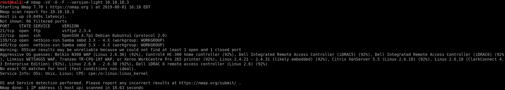

我使用以下命令来获得我们正在扫描的内容的基本概念

```
nmap -sV -O -F --version-light 10.10.10.3
```

**-sV:** 探测开放端口以确定服务/版本信息

**-O:** 启用操作系统检测

**-F:** 快速模式-扫描比默认扫描更少的端口

**-版本-光:**限于最可能的探针(强度 2)

**10 . 10 . 10 . 3:**Lame box 的 IP 地址

您也可以使用 Zenmap，它是官方的 nmap 安全扫描器 GUI。这是一个多平台、免费和开源的应用程序，旨在使 Nmap 易于初学者使用，同时为有经验的 Nmap 用户提供高级功能。

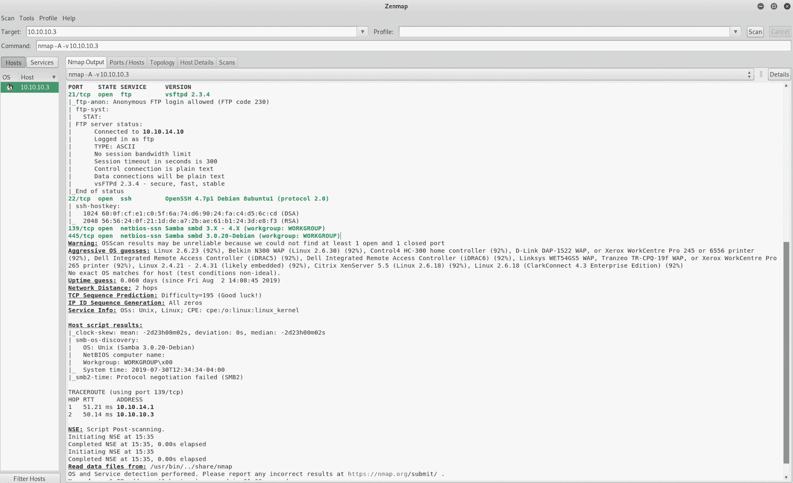

我使用一组不同的命令来执行密集扫描

```
nmap -A -v 10.10.10.3
```

**-A:** 启用操作系统检测、版本检测、脚本扫描和跟踪路由

**-v:** 增加详细级别

**10 . 10 . 10 . 3:**Lame box 的 IP 地址

如果您发现结果有点令人不知所措，您可以转到**端口/主机**选项卡，只获得开放的端口

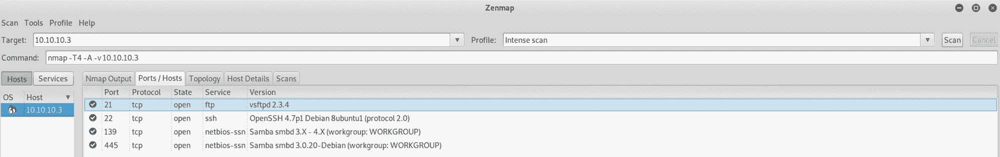

我们可以看到有 4 个开放的端口:

**端口 21** 。文件传输协议(FTP)控制(命令)

**端口 22** 。安全外壳(SSH)、安全登录、文件传输(scp、sftp)和端口转发

**139 号口**。NetBIOS 会话服务

**端口 445** 。Microsoft-DS(目录服务)SMB 文件共享

让我们看看我们能从第一个端口得到什么

## 步骤 2 -易受攻击的 FTP

我们将使用 Searchsploit 来检查 vsftpd 2.3.4 上是否有任何已知的漏洞。Searchsploit 是一个利用数据库的命令行搜索工具

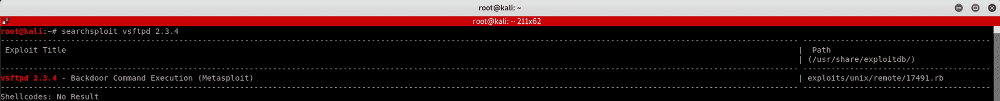

我使用以下命令

```
searchsploit vsftpd 2.3.4
```

现在我们知道了存在一个漏洞——后门命令执行——让我们尝试利用它

我们将使用 Metasploit。这是一个渗透测试框架，使黑客攻击变得简单。这是许多攻击者和防御者的必备工具


[https://www.metasploit.com/](https://www.metasploit.com/)

我在 Kali 上启动 Metasploit 框架，并寻找应该用来启动漏洞利用的命令

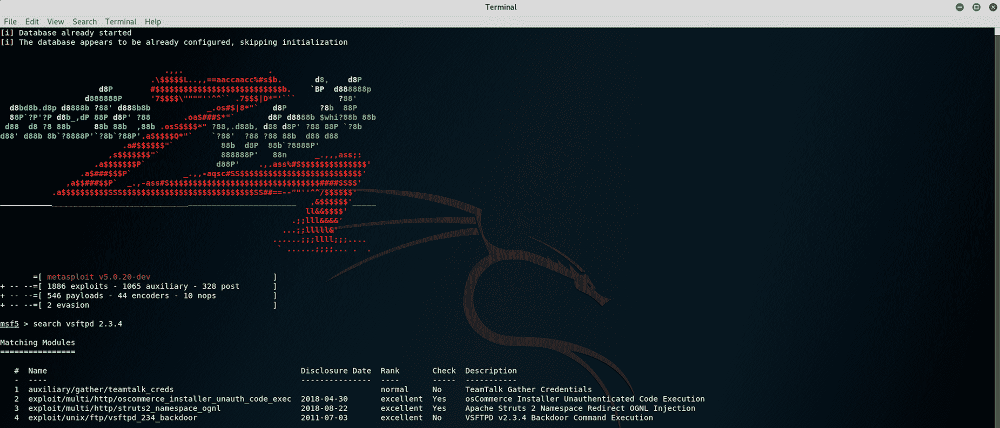

我使用该命令查找所有可用的有效负载

```
search vsftpd 2.3.4
```

我们可以看到有几种不同的利用方式，但我们感兴趣的是第 4 种

```
exploit/unix/ftp/vsftpd_234_backdoor
```

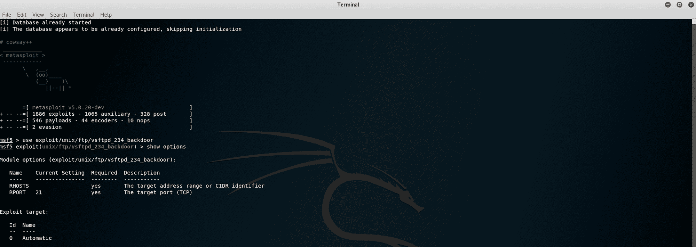

我使用以下命令来利用漏洞

```
use exploit/unix/ftp/vsftpd_234_backdoor
```

这将启动漏洞利用。我使用这个命令来显示可用的选项

```
show options
```

您可以看到远程主机(RHOSTS)尚未设置。我将设置远程主机和目标，因为运行该漏洞需要这两条信息

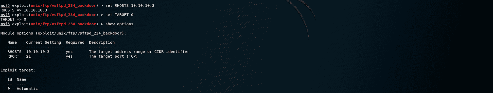

我使用以下命令来设置使用 HTB Lame box 的 IP 地址的远程主机

```
set RHOSTS 10.10.10.3
```

然后，当我检查选项时，我将目标设置为 0

```
set TARGET 0
```

我们现在可以运行这个漏洞了

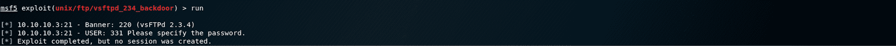

不幸的是，我们可以看到，即使利用完成，没有会话被创建。此漏洞已被修补，如本文所述，在对利用的描述中。

> 该模块利用了添加到 SFTPD 下载档案中的恶意后门。根据现有的最新信息，这个后门在 2011 年 6 月 30 日到 2011 年 7 月 1 日之间被引入 vsftpd-2.3.4.tar.gz 档案馆。这个后门在 2011 年 7 月 3 日被移除。

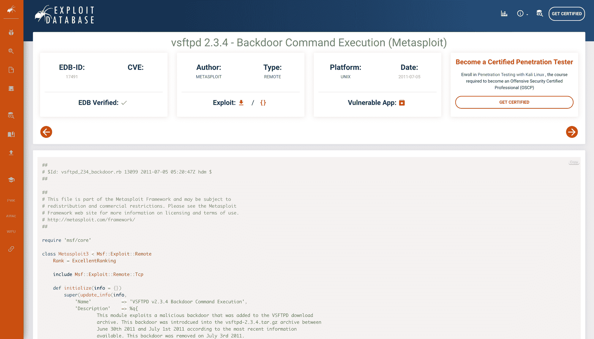

[https://www.exploit-db.com/exploits/17491](https://www.exploit-db.com/exploits/17491)

漏洞数据库是一个公共漏洞和相应易受攻击软件的通用漏洞和暴露(CVE)兼容档案，开发供渗透测试人员和漏洞研究人员使用。其目的是提供通过直接提交、邮件列表以及其他公共来源收集的最全面的漏洞收集，并将其呈现在一个免费可用且易于导航的数据库中。漏洞数据库是漏洞和概念验证的存储库，而不是咨询，这使得它成为那些需要立即采取行动的数据的人的宝贵资源

我们需要找到另一种方法。让我们看看另一个港口！

## 步骤 3 -脆弱的桑巴

如果你还记得第一步——扫描网络，我们发现端口 445——Samba smbd 3 . 0 . 20——Debian 是打开的。让我们看看能否找到该特定版本的漏洞

如果你想了解更多关于桑巴的知识，请点击这里。但是对于该机器来说，并不需要深入了解 Samba。

我们回到 Searchsploit 去检查

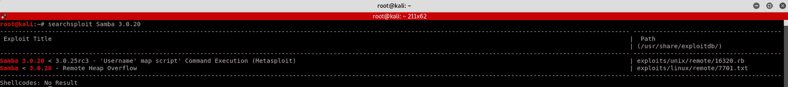

我使用以下命令

```
searchsploit Samba 3.0.20
```

我们可以看到，我们可以使用 Metasploit 启动一个“用户名”地图脚本命令执行。我们试试吧！

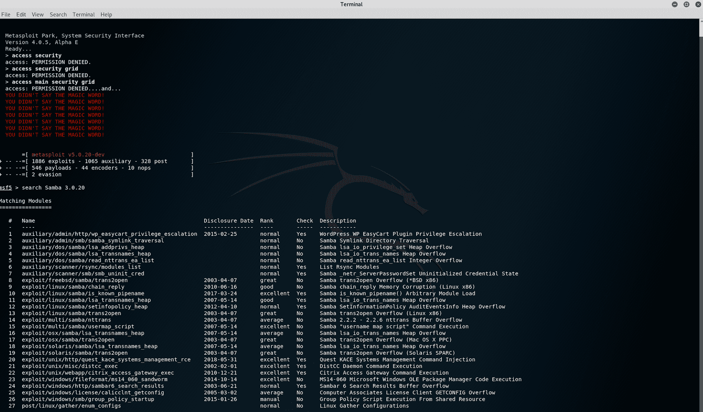

回到 Metasploit 并检查我们应该用来启动漏洞利用的命令。我使用以下命令

```
search Samba 3.0.20
```

我们可以看到有几种不同的利用方式，但我们感兴趣的是第 15 种

```
exploit/multi/samba/usermap_script
```

您也可以在漏洞数据库网站上找到它

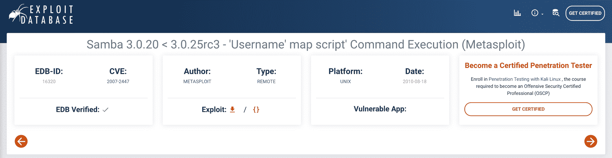

https://www.exploit-db.com/exploits/16320

漏洞利用的描述

> 当使用非默认的“用户名映射脚本”配置选项时，此模块利用了 Samba 版本 3.0.20 到 3.0.25rc3 中的命令执行漏洞。通过指定包含外壳元字符的用户名，攻击者可以执行任意命令。利用此漏洞无需认证，因为此选项用于在认证之前映射用户名！

回到我使用命令的 Metasploit

```
use exploit/multi/samba/usermap_script
```

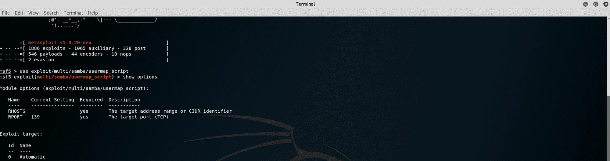

这将启动漏洞利用。我使用以下命令来显示可用的选项

```
show options
```

您可以看到远程主机(RHOSTS)尚未设置。

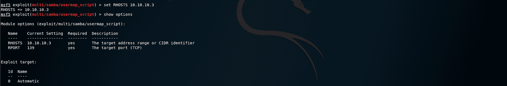

我使用以下命令来设置使用 HTB Lame box 的 IP 地址的远程主机

```
set RHOSTS 10.10.10.3
```

我们现在可以运行这个漏洞了


答对了。我们打开了一个命令外壳。看看我们能找到什么:)

## 步骤 4 -查找 user.txt 标志

我们现在可以寻找第一个标志 user.txt

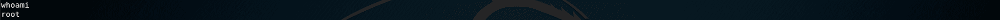

我使用以下命令来检查我在那台机器上是谁

```
whoami
```

我们有机器的超级用户权限。我们有动力了！让我们开始浏览文件夹

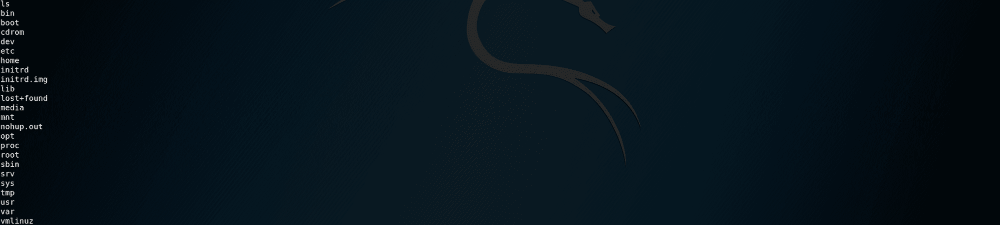

我使用以下命令列出所有文件/文件夹

```
ls
```

让我们转到 **home** 文件夹，看看我们能找到什么

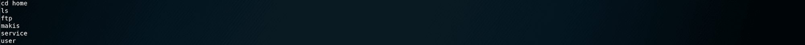

我使用以下命令切换到主目录，然后列出所有文件/文件夹

```
cd home
```

我们在这里没有太多的信息，让我们更具体地使用命令

```
ls -la
```

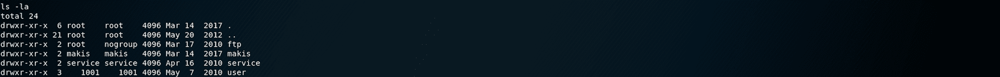

我们可以看到有一个文件夹叫做 makis。让我们看看里面有什么！

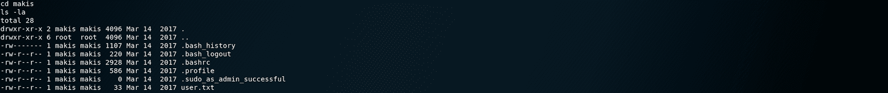

我们找到了 user.txt 文件！为了读取文件的内容，我使用了以下命令

```
cat user.txt
```

现在我们有了用户标志，让我们找到根标志！

## 步骤 5 -查找 root.txt 标志

让我们回到根目录。我使用命令

```
cd ~
```


要检查您的位置，您可以使用以下命令

```
pwd
```

这里我们看到我们处于 **/root** 级别，如果我们列出文件/文件夹，我们会找到 root.txt 文件！

为了读取文件的内容，我使用了以下命令

```
cat root.txt
```

恭喜你。你找到了两面旗子！

* * *

请随时评论、提问或与朋友分享:)

你可以在这里看到更多我的文章

你可以在推特上关注我，也可以在 T2 的 LinkedIn 上关注我

别忘了# **GetSecure** ，# **BeSecure** ，# **StaySecure** ！

* * *

**本系列其他文章**

*   [保持冷静，黑掉盒子——遗产](https://www.freecodecamp.org/news/keep-calm-and-hack-the-box-legacy/)
*   保持冷静，黑掉盒子
*   [保持冷静，黑盒子——哔](https://www.freecodecamp.org/news/keep-calm-and-hack-the-box-beep/)

