# 保持冷静，黑掉盒子——Mirai 未来组合

> 原文：<https://www.freecodecamp.org/news/keep-calm-and-hack-the-box-mirai/>

黑客盒子(HTB)是一个在线平台，让你测试你的渗透测试技能。

它包含许多不断更新的挑战。有些是模拟真实世界的场景，有些更倾向于 CTF 风格的挑战。

********注****:********只允许对退役的 HTB 机器进行补录。*T13***

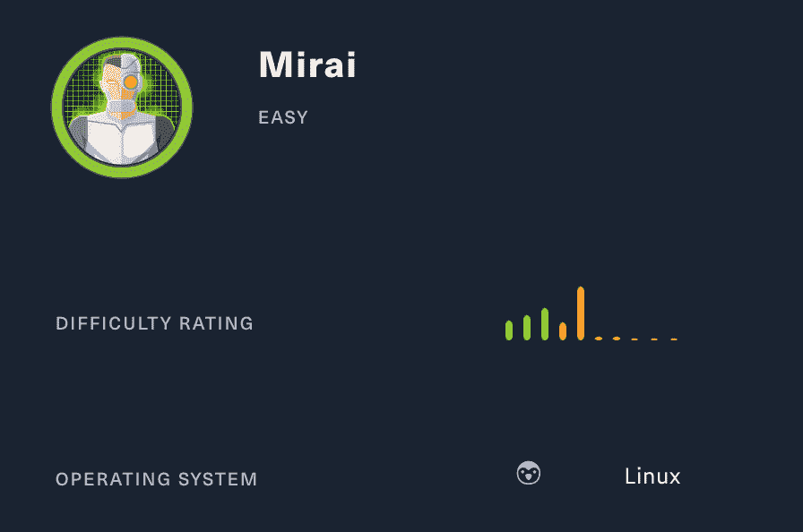

Mirai 未来组合是一个很好的例子，说明了不当配置的物联网设备如何导致 2016 年最大的攻击载体之一。物联网设备正被僵尸网络积极利用，并被攻击者用于长期持续。

我们将使用以下工具将机器典当到一个 [Kali Linux 机器](https://www.kali.org/)上:

*   nmap
*   gobuster
*   水母体
*   Linux 命令

让我们开始吧。

## ******第一步——侦察******

开发一台机器的第一步是做一些扫描和侦察。

这是最重要的部分之一，因为它将决定你以后可以尝试利用什么。在这个阶段花更多的时间来获取尽可能多的信息总是更好的。

### **端口扫描**

我会用********Nmap********(网络映射器)。Nmap 是一个用于网络发现和安全审计的免费开源工具。

它使用原始 IP 数据包来确定网络上有哪些主机可用、这些主机提供什么服务、它们运行什么操作系统、使用什么类型的包过滤/防火墙以及许多其他特征。

这个工具有许多命令可以用来扫描网络。如果你想了解更多，你可以看一下文档[这里](https://tools.kali.org/information-gathering/nmap)。


我使用以下命令来执行密集扫描:

```
nmap -A -v 10.10.10.48
```

********`-A`:********启用操作系统检测、版本检测、脚本扫描和跟踪路由

********`-v`:********增加详细程度

**`10.10.10.48`******:********IP 为 Mirai 未来组合盒

如果你觉得这个结果有点令人难以置信，你可以试试这个:

```
nmap 10.10.10.48
```

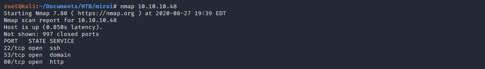

我们可以看到有 3 个开放的端口:

********端口**** 22**** 。安全外壳(SSH)、安全登录、文件传输(scp、sftp)和端口转发

**端口 53** 。域名系统(DNS)

********端口**** 80**** 。超文本传输协议(HTTP)。这是一个 IIS 服务器。

## **目录扫描**

我用 **Gobuster** 。Gobuster 是一个用 Go 编写的目录扫描器。你可以在这里找到关于工具[的更多信息。](https://tools.kali.org/web-applications/gobuster)

Gobuster 使用位于********/usr/share/word lists********目录中的 Kali 上的单词表。我用的是来自 ****dirb**** 和 ****dirbuster**** 的词表，但是你可以从****sec lists****[这里](https://github.com/danielmiessler/SecLists)下载更多词表。


我对 dirb common.txt 单词表使用以下命令:

```
gobuster dir -u 10.10.10.48 -w /usr/share/wordlists/dirb/common.txt
```

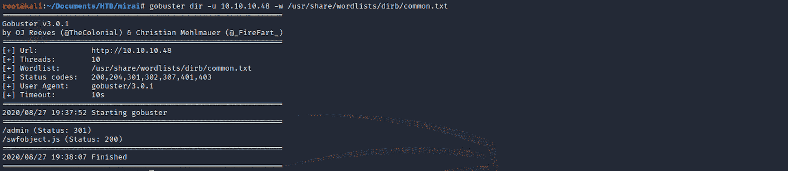

我能看见一些有趣的文件夹。我用不同的单词表做了另一个目录扫描。

```
gobuster dir -u 10.10.10.48 -w /usr/share/worldlists/dirbuster/directory-list-lowercase-2.3-medium.txt
```

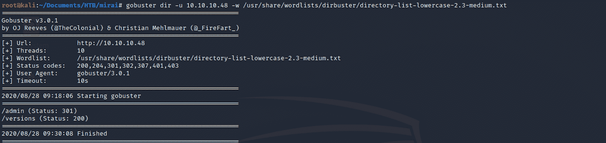

管理文件夹肯定是我要访问的文件夹！

## **步骤 2 -访问网页**

在侦察阶段，我决定从 80 端口开始。我得到一张白纸。

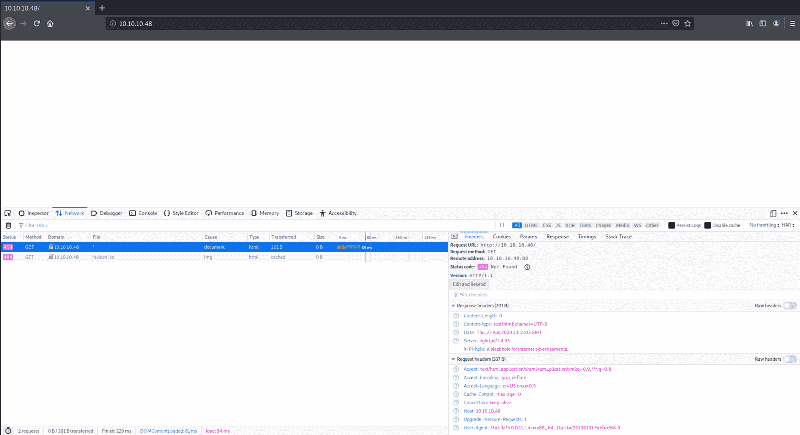

从侦察阶段开始，我找到了 **/admin** 文件夹，里面有 **Gobuster** 。我导航到这个端点:

```
10.10.10.48/admin
```

我来到一个管理仪表板上。


> **Pi-hole** 是一个 Linux 网络级广告和互联网跟踪器拦截应用程序，它充当 DNS sinkhole 和可选的 DHCP 服务器，旨在用于私有网络。
> 
> Pi-hole 有能力屏蔽传统网站广告以及非常规场所的广告，如智能电视和移动操作系统广告——维基百科

你可以在这里阅读更多[或者在](https://en.wikipedia.org/wiki/Pi-hole)[官网](https://pi-hole.net/)了解更多。

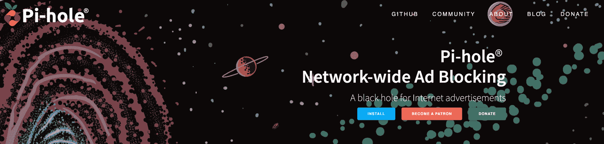

我点击左侧边栏上的**登录**按钮，出现了一个登录屏幕。在互联网上快速搜索，我可以假设目标是一台树莓 Pi 机器，并且很可能运行 [Raspbian](https://en.wikipedia.org/wiki/Raspberry_Pi_OS) (树莓 Pi 的操作系统)。

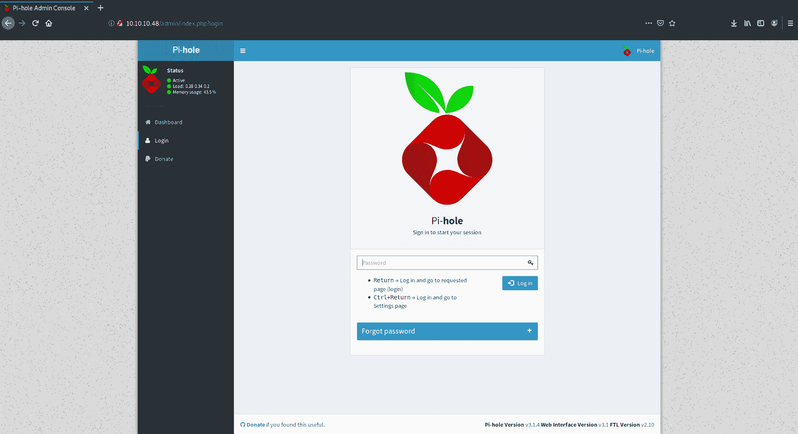

我还发现默认用户名应该是“pi”，密码应该是“raspberry”。我在这个登录屏幕上尝试了默认密码，但似乎不起作用。我们需要找到另一种方法。

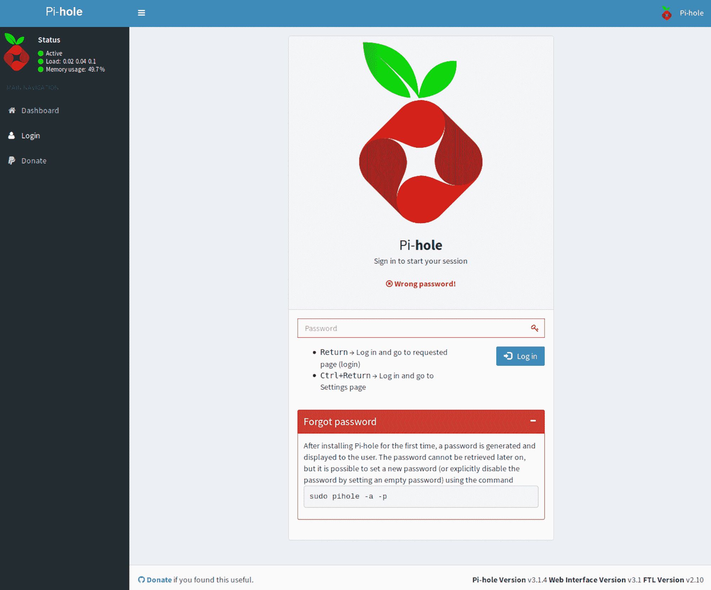

## **步骤 3 -通过 SSH 连接到 Pi-hole**

在侦察阶段，我们发现 22 号端口是开放的。

我使用 **Medusa** 来检查默认凭证是否适用于 ssh。Medusa 是一个快速、并行和模块化的登录强力工具。你可以在这个工具的这里找到更多信息[。](https://en.kali.tools/?p=200)

```
medusa -h 10.10.10.48 -u pi -p raspberry -M ssh
```

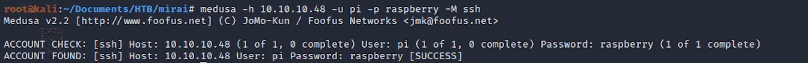

现在让我们使用 SSH 和以下命令进行连接，因为我们刚刚验证了密码是有效的:

```
ssh pi@10.10.10.48
```

要使用 SSH 连接，您需要用户名和主机 IP 地址。在我们的例子中，用户名是“pi ”, IP 地址是“10.10.10.48”。密码是“覆盆子”。

我得到一个会话:

```
pi@raspberrypi
```

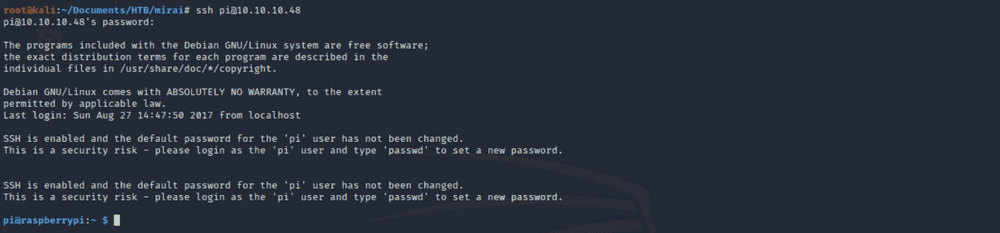

作为用户登录后，我可以使用 **id** 或 **groups** 命令来验证该用户是否属于 sudo 组:

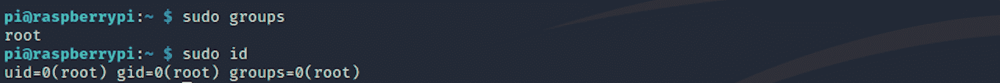

用户属于组 **root** 。

## **第四步- ****寻找 user.txt 标志******

我使用以下命令列出了所有文件/文件夹:

```
ls -la
```

我随后将 ********移至桌面**** 与****

```
cd Desktop
```

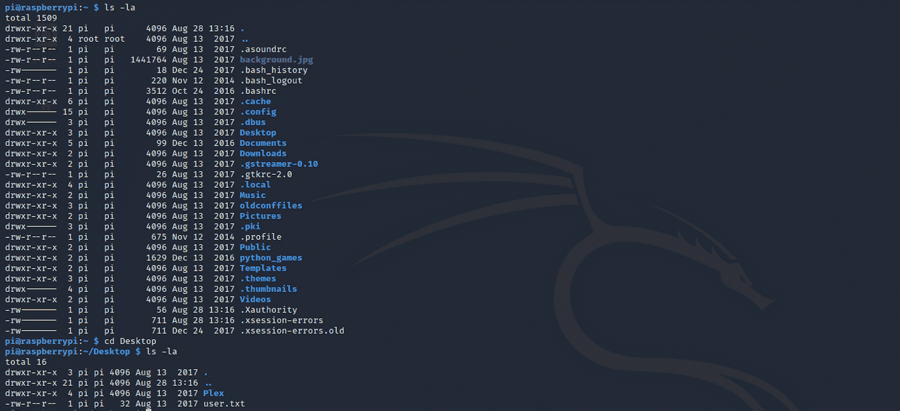

我找到了用户标志！我可以检查文件的内容

```
cat user.txt
```

## **第五步- ****寻找根. txt 旗******

现在让我们找到根旗。我导航到 **/** 文件夹。您可以使用命令检查您的位置

```
pwd
```

这给了我们打印工作目录。然后我移动到 **/root** 文件夹，但是访问被拒绝。

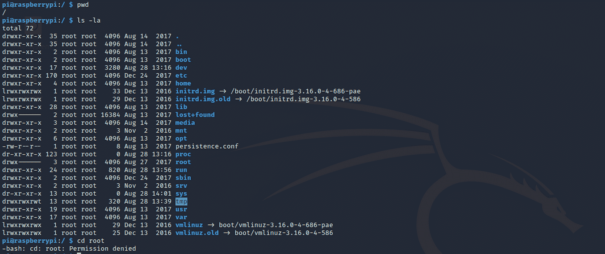

我需要更改为根用户才能访问该文件夹。我使用命令

```
sudo -l
```

了解我可以在 localhost 上运行哪个命令。

root 用户拥有无限的特权，可以在系统上运行任何命令，我们知道用户 pi 是 root 组的一部分。

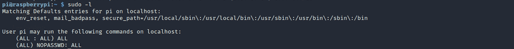

我使用命令

```
sudo su
```

sudo 命令允许你以另一个用户的身份运行程序。默认情况下，root 用户。**苏**表示切换用户。

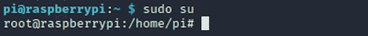

我现在可以导航到**根**文件夹。我找到了 root.txt 文件，并用

```
cat root.txt
```

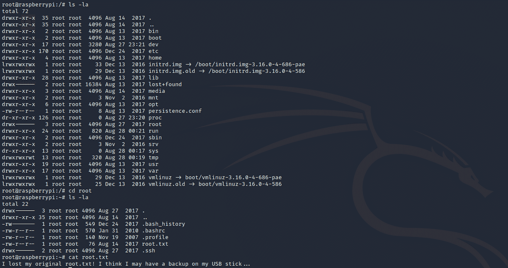

不幸的是，留给我们的不是旗子，而是一条信息。

```
I lost my original root.txt! I think I may have a backup on my USB stick...
```

我现在需要用命令找到 usb 的位置

```
lsblk
```

列出 USB 块存储设备。我看到在**/媒体**文件夹里有一个**u 盘**:

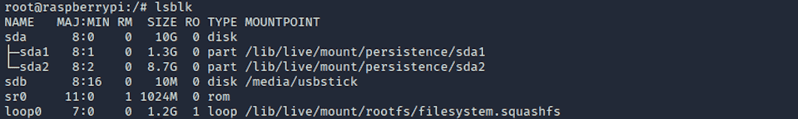

我导航到这个文件夹，找到了另一条来自一个叫做 **James** 的用户的消息。

```
Damnit! Sorry man I accidentally deleted your files off the USB stick.
Do you know if there is any way to get them back?

-James
```

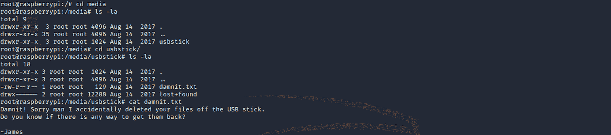

当我们列出所有的存储设备时，我们看到 usbstick 位于 **sdb** ，它在 **/dev/sdb/** 下。更多信息[在这里](https://help.ubuntu.com/lts/installation-guide/armhf/apcs04.html)关于磁盘和分区。

如果我们使用以下命令:

```
cat /dev/sdb
```

我们会有一个很长的输出，里面有很多奇怪的字符。在这个输入的末尾，你应该会找到**根**标志。

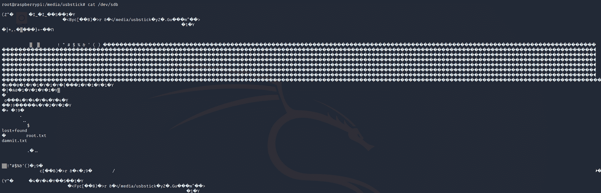

查看二进制文件或数据文件中的文本的一种更优雅的方式是使用命令 **strings** 。这个命令提取这些称为“字符串”的文本。

```
strings /dev/sdb
```

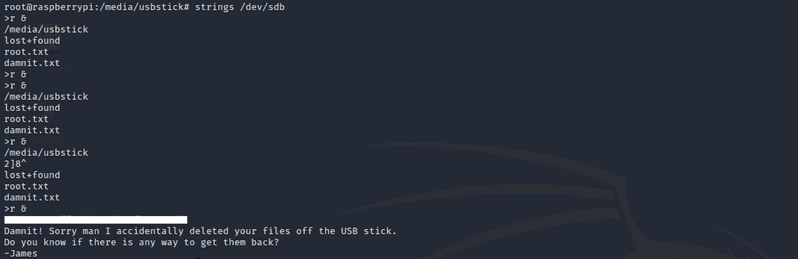

恭喜你。你找到了两面旗。

## **补救**

*   你可以在这里阅读更多关于 Mirai 未来组合 DDoS 僵尸网络攻击的信息
*   不要使用默认/通用密码
*   不需要时，禁用对设备的远程访问

请随时评论、提问或与朋友分享:)

更多文章可以从 ****保持冷静黑盒子**** [这里](https://www.freecodecamp.org/news/search/?query=keep%20calm%20and%20hack%20the%20box)看到。

你可以在 Twitter 上关注我，也可以在 T2 的 LinkedIn 上关注我。

还有别忘了#********GetSecure********，#********be secure********&#********StaySecure********！

