# 保持冷静，破解盒子——瓦伦丁

> 原文：<https://www.freecodecamp.org/news/keep-calm-and-hack-the-box-valentine/>

黑客盒子(HTB)是一个在线平台，让你测试你的渗透测试技能。

它包含几个不断更新的挑战。有些是模拟真实世界的场景，有些更倾向于 CTF 风格的挑战。

*************************【*************************

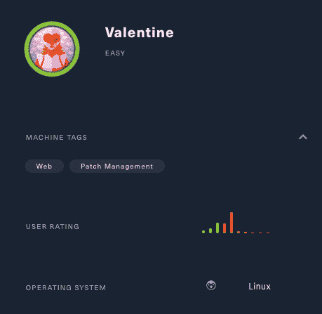

Valentine 是一个简单的机器，它专注于对全球系统产生毁灭性影响的 Heartbleed 漏洞。

我们将使用以下工具典当箱子:

*   Nmap
*   Nmap 脚本引擎
*   Gobuster
*   Searchsploit
*   xxd
*   OpenSSL
*   嘘
*   tmux

我们开始吧！

## **************************************************************步骤 1 -侦察**************************************************************

开发一台机器的第一步是做一些扫描和侦察。

这是最重要的部分之一，因为它将决定你以后可以尝试利用什么。在这个阶段花更多的时间来获取尽可能多的信息总是更好的。

### ******************************端口扫描******************************

我会用****************************************************************Nmap********************Nmap 是一个用于网络发现和安全审计的免费开源工具。********************************************

它使用原始 IP 数据包来确定网络上有哪些主机可用、这些主机提供什么服务、它们运行什么操作系统、使用什么类型的包过滤/防火墙以及许多其他特征。

这个工具有许多命令可以用来扫描网络。如果你想了解更多，你可以看一下文档[这里](https://tools.kali.org/information-gathering/nmap)。

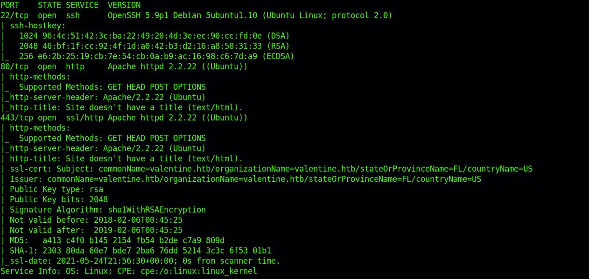

我使用以下命令来执行密集扫描:

```
nmap -A -v 10.129.1.190
```


****************-A:****************启用 OS 检测、版本检测、脚本扫描和 traceroute

****************-v:****************增加详细程度

********10 . 129 . 1********************:****************为情人盒 IP

我们可以看到有 3 个开放的端口:

*   ****************端口********22********。安全外壳(SSH)、安全登录、文件传输(scp、sftp)和端口转发。
*   ****************端口********80********。超文本传输协议(HTTP)。
*   ****************端口**************443**。超文本传输协议安全(HTTPS)。

我还决定使用以下命令对照 Nmap 漏洞数据库检查主机名:

```
nmap --script vuln 10.129.1.190
```


Nmap 脚本引擎(NSE)是 Nmap 最强大、最灵活的功能之一。它允许用户编写(和共享)简单的脚本(使用 [Lua 编程语言](http://lua.org/))来自动化各种各样的网络任务。你可以在这里找到更多关于[的信息。](https://nmap.org/book/man-nse.html)

您可以在以下位置找到脚本:

```
/usr/share/nmap/scripts
```

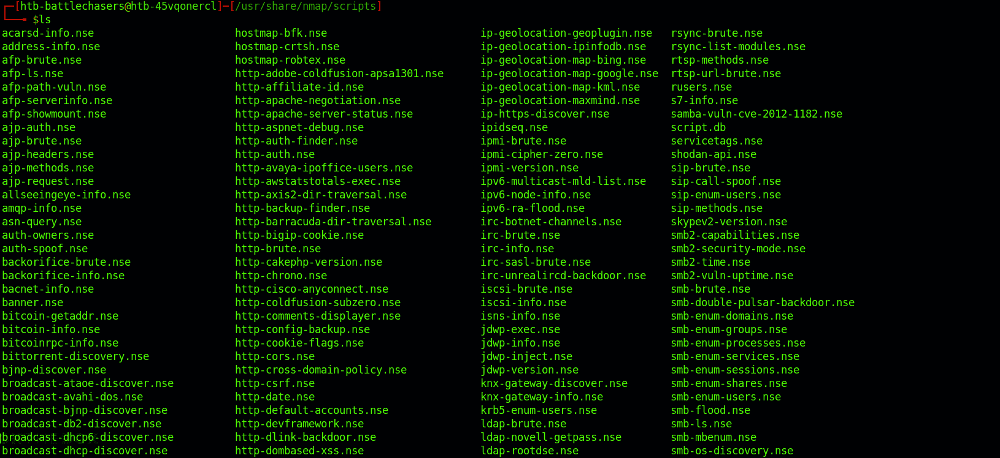

您还可以使用 **grep** 命令来查找特定的脚本。更多关于命令[的信息在这里](https://man7.org/linux/man-pages/man1/grep.1.html)。


我查看了调查结果，发现这个盒子容易受到 ssl-heartbleed 的攻击:


信息部分为我们提供了几个链接来了解更多关于该漏洞的信息。第一个链接重定向到 **MITRE 常见漏洞和暴露**数据库**** 。

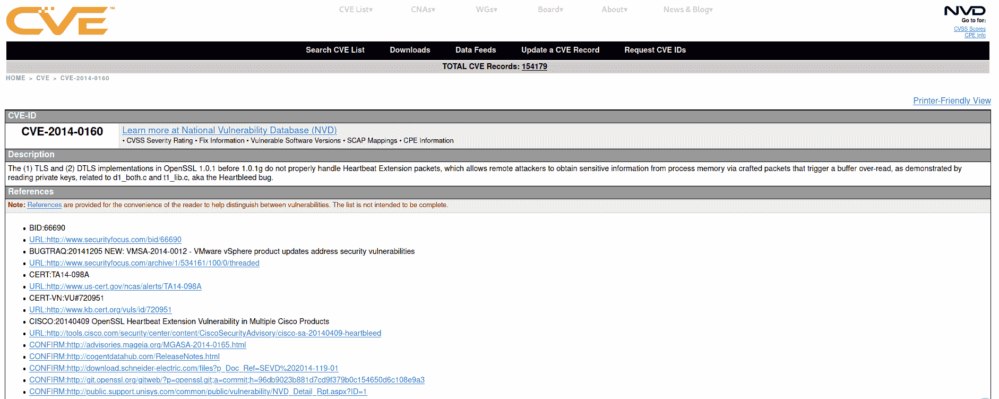

https://cve.mitre.org/cgi-bin/cvename.cgi?name=cve-2014-0160

CVE 计划对公开披露的网络安全漏洞进行识别、定义和分类。

还有另一个重定向到 OpenSSL 安全公告的链接。

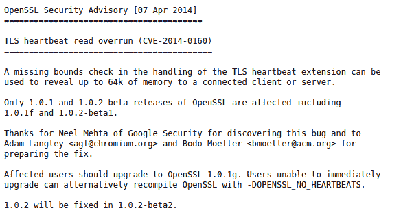

https://www.openssl.org/news/secadv/20140407.txt

## **************第二步********–****************心脏出血**************漏洞是什么？****

**Heartbleed** 是 OpenSSL 库中的一个安全漏洞。2012 年推出，2014 年 4 月公开披露。

> Heartbleed 漏洞允许互联网上的任何人读取受 OpenSSL 软件易受攻击版本保护的系统内存。这使得攻击者能够窃听通信，直接从服务和用户窃取数据，并冒充服务和用户。Heartbleed.com

你可以在这个专门的网站[这里](https://heartbleed.com/)了解更多关于 Heartbleed 的信息。

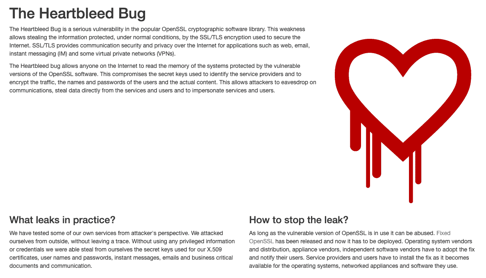

https://heartbleed.com/

xkcd 也有一个很棒的网络漫画


https://xkcd.com/1354/

## **************步************3******–**W******EB********P********


https://en.wikipedia.org/wiki/Heartbleed

在侦察阶段，我决定从 80 端口开始。我得到了一个有图片的页面。我认得右边的 Heartbleed 标志。


我看源代码。没什么有趣的。

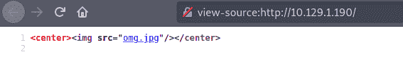

我决定运行**。Gobuster 是一个用 Go 编写的目录扫描器。你可以在这里找到关于工具[的更多信息。](https://tools.kali.org/web-applications/gobuster)**

**Gobuster 使用了 HTB 鹦鹉盒子上的单词列表，它们位于********************************/usr/share/****************wfuzz/word list/****************目录下。我用的是**大的**。txt**** "和"**megabast . txt**"词表，不过你可以从****************sec lists****************[这里下载更多词表](https://github.com/danielmiessler/SecLists)。**

我对 **big.txt** 单词表使用这个命令:

```
gobuster dir -u 10.129.1.190 -w /usr/share/wfuzz/wordlist/general/big.txt -x php,html,txt
```

我也关注。php，。txt 和。带有 ****-x**** 标志的 html 文件(扩展名)。

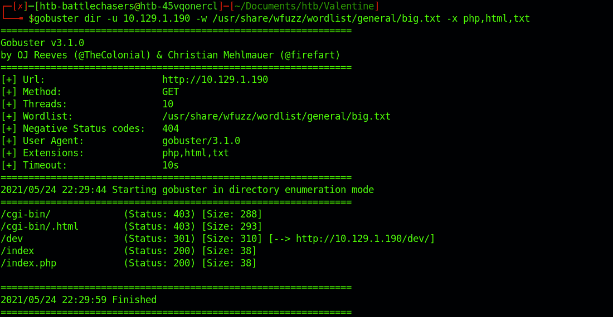

然后我对 **megabeast.txt** 单词列表使用这个命令:

```
gobuster dir -u 10.129.1.190 -w /usr/share/wfuzz/wordlist/general/megabeast.txt -x php,html,txt
```

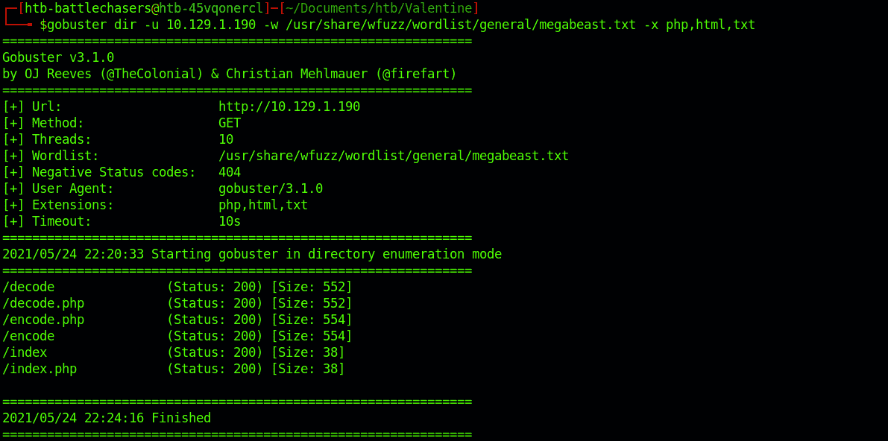

这表明需要选择正确的单词表或运行至少两个不同的单词表，以确保获取尽可能多的信息。

有几个伟大的发现。我首先检查****/**dev**/**文件夹。**

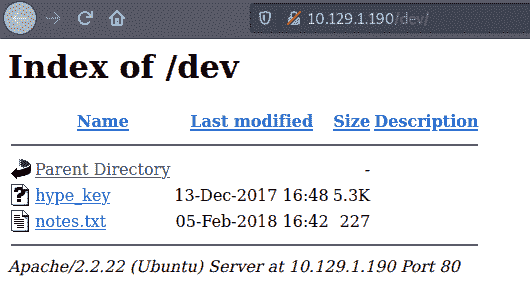

有两个文件。我检查 **hype_key** 文件的内容。好像是十六进制数值。

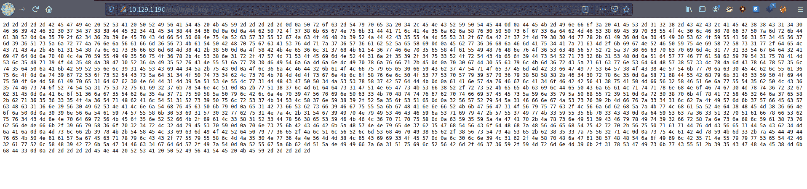

另一个文件 **notes.txt** 是一个待办事项列表。

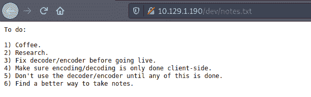

我还在 **/decode** 上找到一个解码器。


和一个编码器在 **/encode** 上。

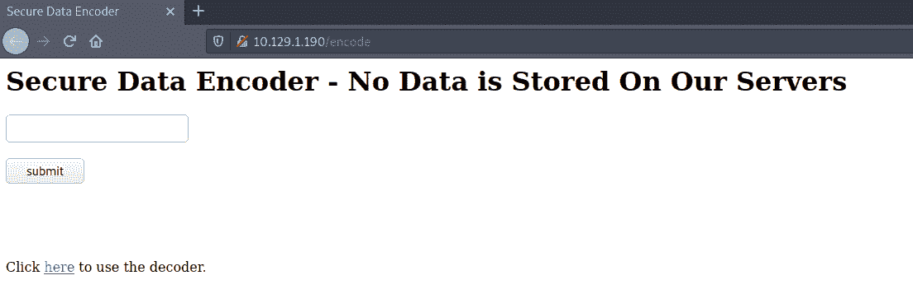

## **************步************4******–**解密密钥******

我回到我的终端，将 **hype_key** 的内容复制/粘贴到一个文件中。


我对内容进行了分类，以确保我正确地复制了所有内容:

```
cat hype.key
```

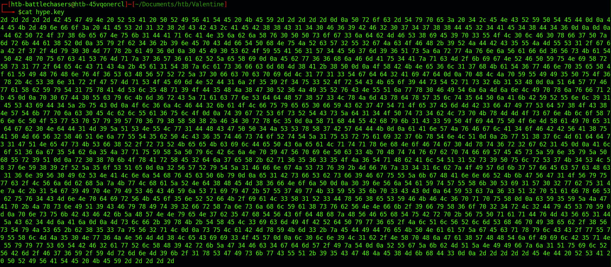

我使用终端解码密钥，更具体地说是 **xxd** 。更多关于这个命令的信息[在这里](https://www.tutorialspoint.com/unix_commands/xxd.htm)。我使用组合 **-r -p** 来读取不带行号信息和特定列布局的普通十六进制转储。

我使用命令:

```
cat hype.key | xxd -r -p
```

输出是一个**加密的** **RSA 密钥**。RSA 密钥是基于 RSA 算法的私钥。在建立 SSL/TLS 会话期间，私钥用于身份验证和对称密钥交换。

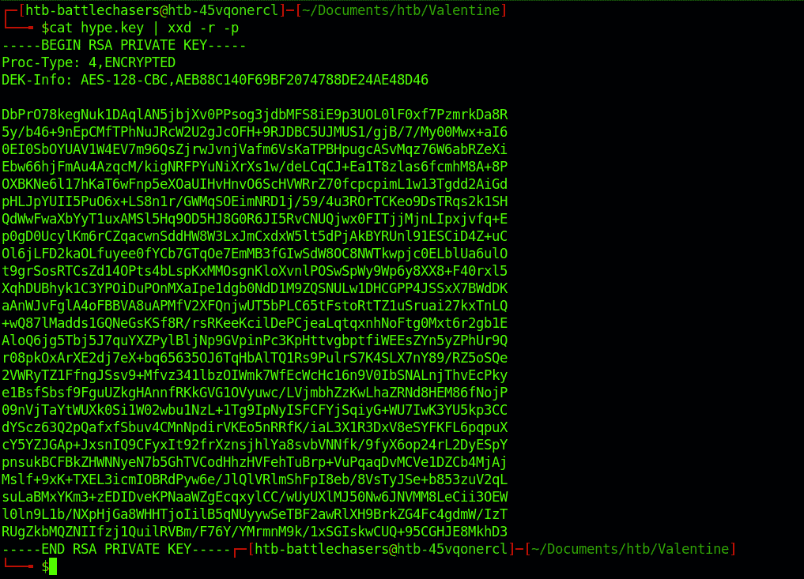

我将输出捕获到一个新文件中， **hype_key.rsa** ，其中包含:

```
cat hype.key | xxd -r -p > hype_key.rsa
```

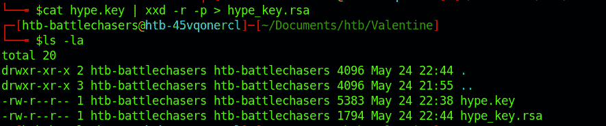

但是如果没有密码，这把钥匙就没什么用了。看看能不能找到！

## **************步************5******–**找到漏洞利用******

从 Nmap 和网页上的侦察阶段来看，我们确实发现该机器易受攻击或者与 Heartbleed 有链接。

我使用********************************Searchsploit********************************来检查是否有已知的漏洞利用。Searchsploit 是一个用于[漏洞数据库](https://www.exploit-db.com/)的命令行搜索工具。

我使用以下命令:

```
searchsploit heartbleed
```

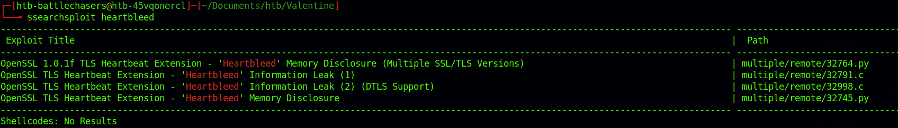

有几个结果。我要第一个。我通过以下方式获得了漏洞利用的更多详细信息:

```
searchsploit -x 32764.py
```

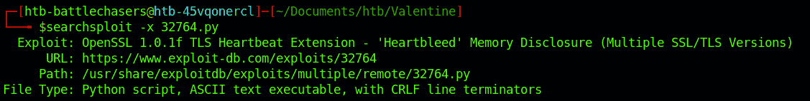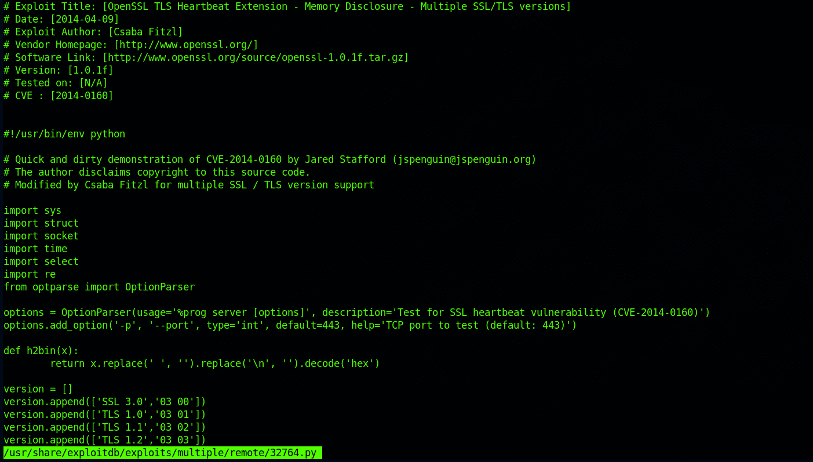

您还可以查看********************************漏洞利用数据库********************************来查找相同的漏洞利用，如果您不习惯在终端上阅读文档的话。

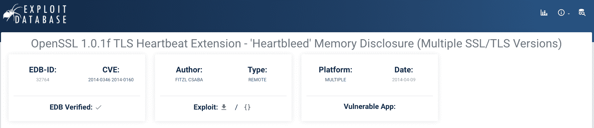

https://www.exploit-db.com/exploits/32764

我通过以下方式获得更多信息:

```
searchsploit -p 32764.py
```

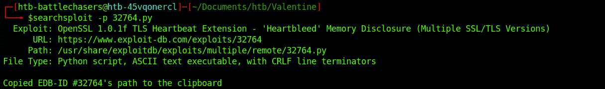

我能看到它在 HTB 鹦鹉盒子上的位置。我将文件复制到我的 **Valentine** 文件夹中:

```
cp /usr/share/exploitdb/exploits/multiple/remote/32764.py .
```

我检查它是否已经被复制到这个文件夹中:

```
ls -la
```

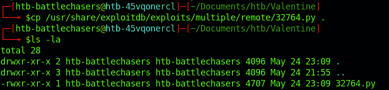

我将该文件重命名为 **heartbleed.py** ，并使用:

```
mv 32764.py heartbleed.py
```

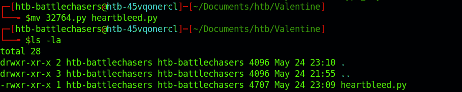

然后，我用以下命令开始利用漏洞:

```
python2 heartbleed.py 10.129.1.190
```

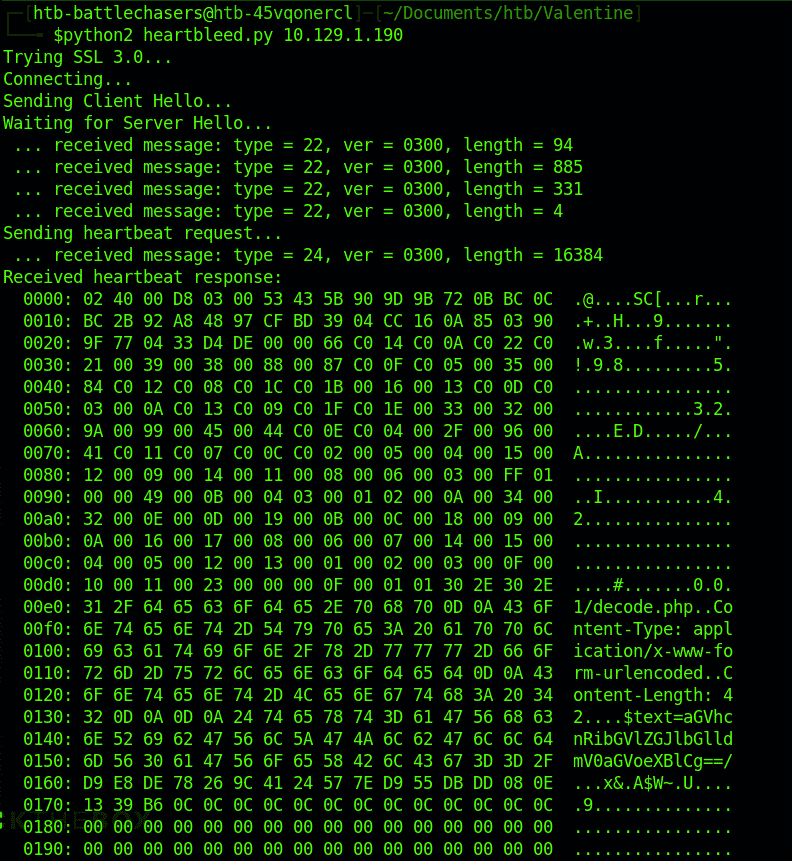

有很多信息，但是滚动它并看右边，我可以看到一个有趣的字符串:

```
$text=aGVhcnRibGVlZGJlbGlldmV0aGVoeXBlCg==
```

这是**底座 64** 。让我们试试之前在 **/decode** 上找到的解码器。

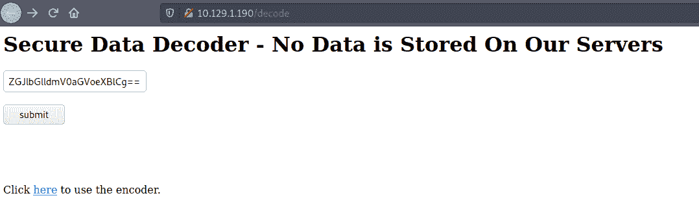

我提交了字符串并得到了一个密码！

```
heartbleedbelievethehype
```

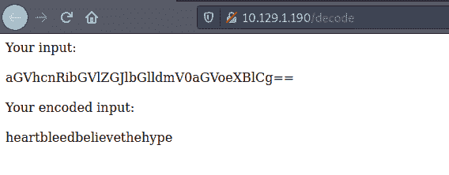

您也可以在您的终端上使用以下命令对其进行解码。

```
echo aGVhcnRibGVlZGJlbGlldmV0aGVoeXBlCg== | base64 --decode
```


我尝试使用 RSA 密钥上新发现的密码:

```
openssl rsa -in hype_key.rsa -out hype_key_decrypted.rsa
```

当系统提示我输入密码时，我会这样做。

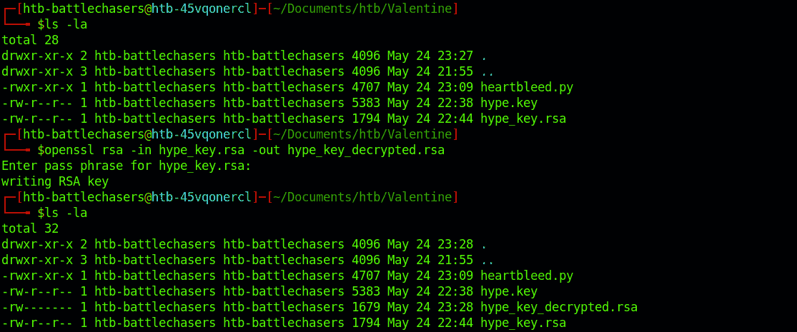

从侦察阶段，我们发现了一个开放的港口 22。让我们对着机器嘘嘘。我对用户名做了一个有根据的猜测，并决定使用**炒作**，因为我在 **/dev** 文件夹的关键字上找到了这个名字

我使用以下命令 SSH 到机器:

```
ssh -i hype_key_decrypted.rsa hype@10.129.1.190
```

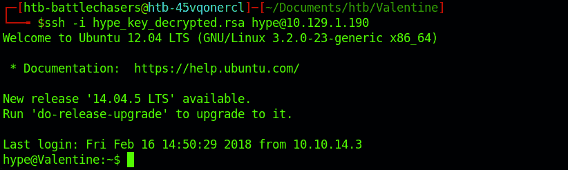

而我现在是在作为用户**炒作**。

## ******步**** 6 ****-寻找 user.txt 标志******

我开始向上导航到/ ****home**** 目录。

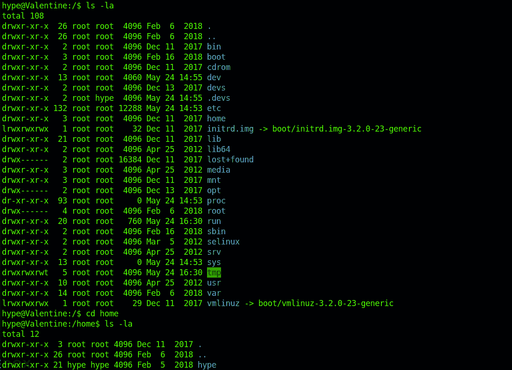

我继续进入/ **炒作**目录。

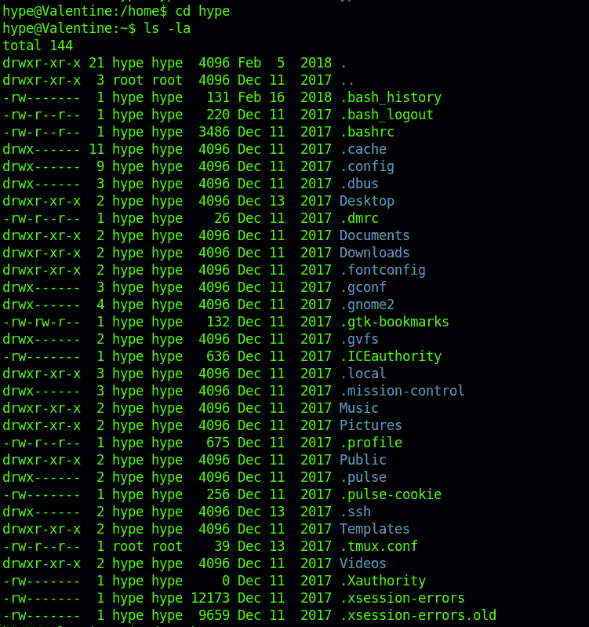

我找到了用户标志！我可以使用以下命令检查文件的内容:

```
cat user.txt
```


## **************步************7************-********望********************为根. txt**************************

我导航回到 ****/**** 文件夹。我无法访问/ ****根目录**** 目录。

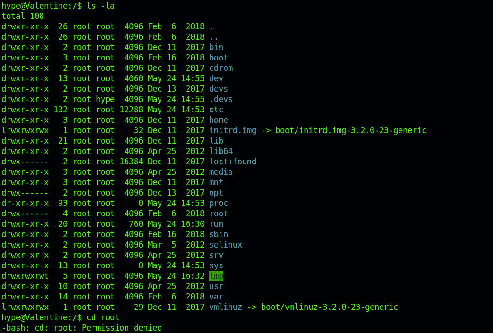

我决定回到 hype 的目录，我看到了**。bash_history** 文件不是零字节文件。

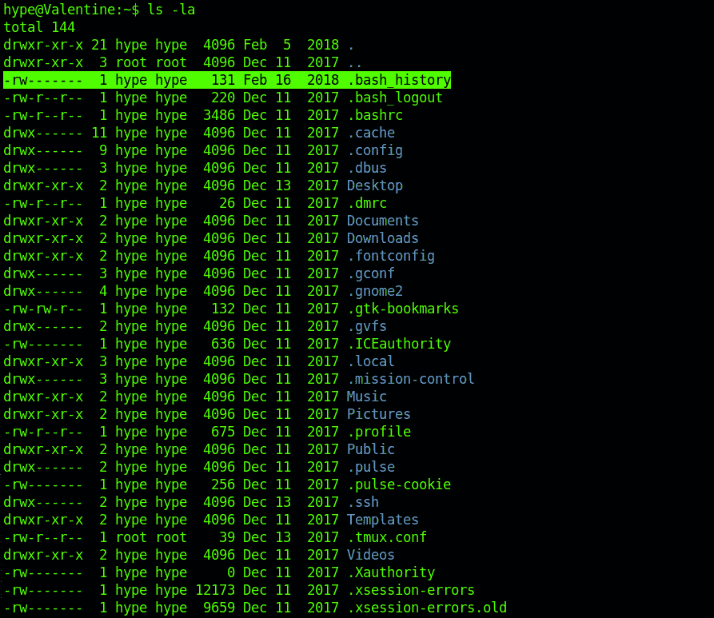

我把它的内容概括为:

```
cat .bash_history
```

bash shell 将您运行的命令的历史存储在用户帐户的历史文件中，该文件位于~/。默认为 bash_history。

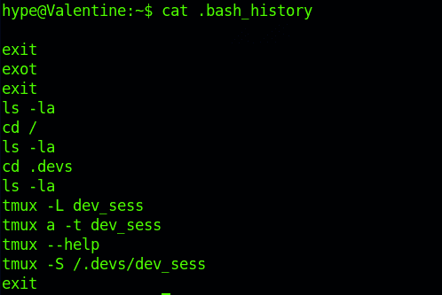

我可以看到一些带有 **tmux** 的命令。

> tmux 是一个开源的终端多路复用器，用于类 Unix 操作系统。它允许在一个窗口中同时访问多个终端会话。这对于同时运行多个命令行程序非常有用。它还可以用来将进程从它们的控制终端上分离，允许远程会话在不可见的情况下保持活动状态。-维基百科

更多信息[点击这里](https://github.com/tmux/tmux/wiki)。

我运行 **ps** ，可以看到 **tmux** 会话已经作为根用户运行:

```
ps aux | grep tmux
```


我使用完全 root 权限运行命令来连接到会话。

```
tmux -S /.devs/dev_sess
```


我现在是 root 了！


我可以导航到 ****************根****************目录。我找到 root.txt 文件，并使用以下命令检查其内容:

```
cat root.txt
```

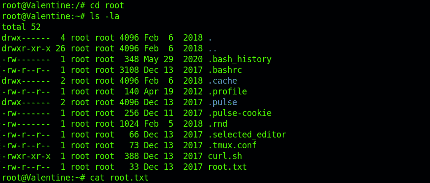

恭喜你。你找到了两面旗。

## **************补救**************

*   升级至 OpenSSL 的最新版本
*   替换 web 服务器上的所有密钥和证书以降低安全漏洞的风险，并撤销旧的密钥和证书
*   将最低特权原则应用于您的所有系统和服务

请随时提问或与您的朋友分享:)

更多文章可以从********************************保持冷静，劈箱子********************************[这里](https://www.freecodecamp.org/news/search/?query=keep%20calm%20and%20hack%20the%20box)。

你可以在 Twitter 上关注我，也可以在 T2 的 LinkedIn 上关注我。

并不要忘记# **********************# ********************************【******************************************************

