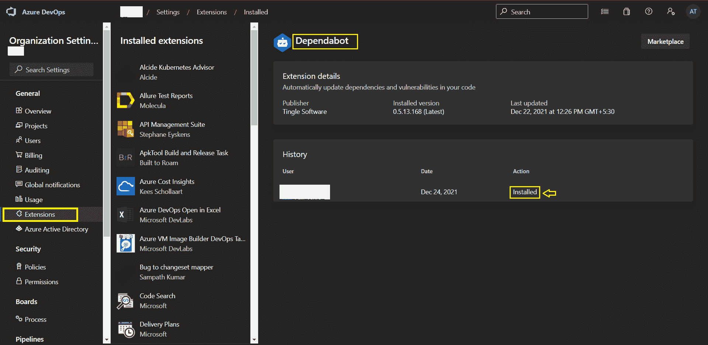
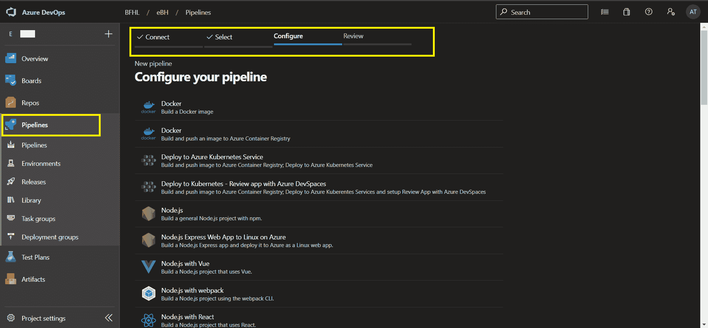
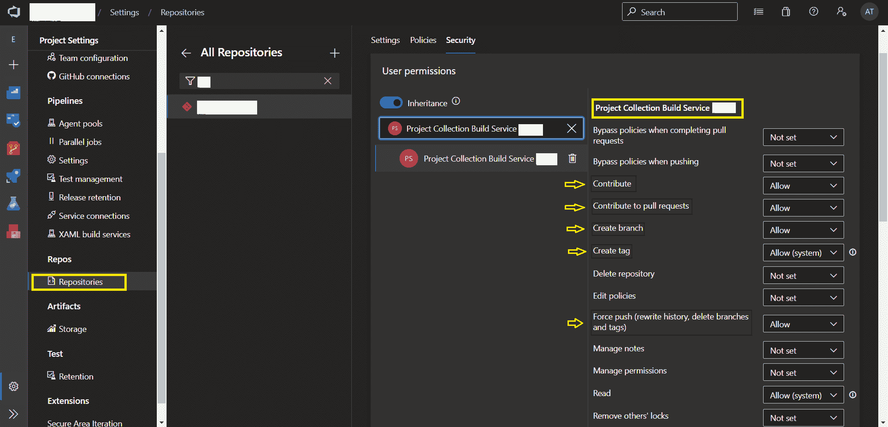

# 如何在 Azure DevOps 上保持您的包依赖关系最新

> 原文：<https://www.freecodecamp.org/news/keep-package-dependencies-up-to-date-on-azure-devops/>

作为一名开发人员，您多久会看到一个包含过期包的存储库？

新的软件包更新通常包括新功能、性能改进和安全修复。但是，跟踪项目中所有过时的依赖关系可能会非常无聊和耗时，尤其是当您有很多这样的依赖关系时。

所以为了做这种家务，我尝试了依赖机器人。

## 依赖机器人如何工作

Dependabot 检查项目的依赖文件。例如，它会搜索您的`package.json`或`pom.xml`文件，并检查任何过时或不安全的依赖项。如果找到任何请求，它会打开单独的拉请求来更新每个请求。

这个工具是与 GitHub 原生集成的。但最近，我不得不为一个运行在 Azure DevOps 中的项目解决更新依赖关系的问题。所以我决定找一个变通办法，把 Dependabot 和 Azure Pipelines 集成起来。在这篇博文中，我将分享我的解决方案。

如果你去 [Azure DevOps 扩展市场](https://marketplace.visualstudio.com/azuredevops)搜索“Dependabot”，你会发现 Tingle 软件的一个[扩展](https://marketplace.visualstudio.com/items?itemName=tingle-software.dependabot)。使用这个扩展，我们可以轻松地将 Dependabot 与 Azure DevOps 中的 repos 集成在一起。

您可以在 Azure DevOps 的“组织设置”中检查您是否有此扩展。如果没有，请确保在继续之前安装了它。



Installed Extensions - Azure DevOps

## 如何创建 Azure 管道

现在让我们从为 azure 管道创建一个新的`YAML`文件开始:

```
trigger: none

stages:
  - stage: CheckDependencies
    displayName: 'Check Dependencies'
    jobs:
      - job: Dependabot
        displayName: 'Run Dependabot'
        pool:
          vmImage: 'ubuntu-latest'
        steps:
          - task: dependabot@1
            displayName: 'Run Dependabot'
            inputs:
              packageManager: 'npm'
              targetBranch: 'develop'
              openPullRequestsLimit: 10 
```

在任务参数中，我指定了三个参数:

1.  **packageManager** :指定检查依赖升级的包的类型。例子:`nuget`、`maven`、`gradle`、`npm`等等。
2.  **targetBranch** :可选参数，定义创建拉式请求时所指向的分支。如果没有指定，Dependabot 将选择存储库的`default`分支。
3.  openPullRequestsLimit :这也是一个可选参数，指定任何时候打开的拉请求的最大数量。默认情况下，它一次打开 5 个请求。

您可以通过扩展支持的所有任务参数来调整您的实现。现在只需用新的 azure 管道配置这个 YAML 文件，然后就可以运行它了。



Pipeline Configuration - Azure DevOps

下一步是授予您的存储库的`Project Collection Build Service`访问权限，以便 Dependabot 可以创建对项目存储库的 pull 请求。

为此，请转到您的项目设置。在这里，您单击存储库并搜索您集成了管道的 repo。

选择之后，点击 security 选项卡并搜索**项目集合构建服务**。您必须允许以下用户访问它:

*   捐助
*   参与拉动式请求
*   创建分支
*   创建标签
*   强制推送



Access to raise PR in Repo

有了这个，您就完全可以运行管道了。一旦这样做了，您将开始在您的存储库中接收带有更新包的 pull 请求。


PR raised by Dependabot

## 如何安排管道

到目前为止，您必须手动触发管道运行。要使其自动运行，您可以为管道配置计划。这将触发您的管道根据计划启动。

使用以下语法并将其添加到您的`YAML`文件的最顶端:

```
schedules:
- cron: string
  displayName: string
  branches:
    include: [ string ]
  always: boolean 
```

分支机构**s’**参数指定调度应用于哪些分支机构。

`always`参数指定是“总是”运行管道，还是仅在自上次成功调度运行以来有任何源代码更改的情况下运行管道。默认值为 false。

对于这种情况，您将它的值设置为 **true** ，因为 dependent bot 更新独立于任何代码更改。

cron 计划的时区是 UTC，cron 语法如下:

```
mm HH DD MM DW
 \  \  \  \  \__ Days of week
  \  \  \  \____ Months
   \  \  \______ Days
    \  \________ Hours
     \__________ Minutes 
```

因此，如果您想在 UTC 时间每周周日下午 12 点运行您的管道，您需要编写- `cron: "0 12 * * 0"`(更新 cron 以满足您的需求)。

添加时间表后，最终的`YAML`应该是这样的:

```
schedules:
  - cron: "0 12 * * 0"
    displayName: Weekly Dependency Updates
    branches:
      include:
      - develop
    always: true

trigger: none

stages:
  - stage: CheckDependencies
    displayName: 'Check Dependencies'
    jobs:
      - job: Dependabot
        displayName: 'Run Dependabot'
        pool:
          vmImage: 'ubuntu-latest'
        steps:
          - task: dependabot@1
            displayName: 'Run Dependabot'
            inputs:
              packageManager: 'npm'
              targetBranch: 'develop'
              openPullRequestsLimit: 10 
```

该管道为您做了以下工作:

它每周运行一次(在本例中为 UTC 时间周日下午 12 点),并查找任何过时或不安全的依赖项。如果找到任何请求，它将打开拉请求来单独更新每个请求。

希望这将帮助你在 Azure DevOps 中保持你的项目依赖关系最新！

## 包扎

就这样，我们到了文章的结尾。如果您想进一步讨论任何技术话题，或者您有任何问题、建议或反馈，我的 DMs 随时欢迎您:

*   [推特](https://twitter.com/apoorv__tyagi)
*   [LinkedIn](https://www.linkedin.com/in/apoorvtyagi/)
*   [GitHub](https://github.com/apoorvtyagi)
*   [博客](https://apoorvtyagi.tech/)

快乐学习！💻 😄