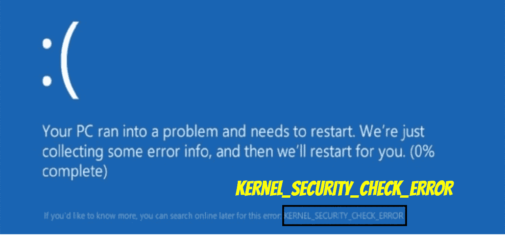
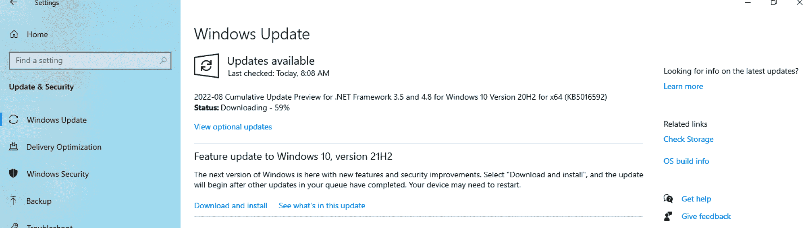
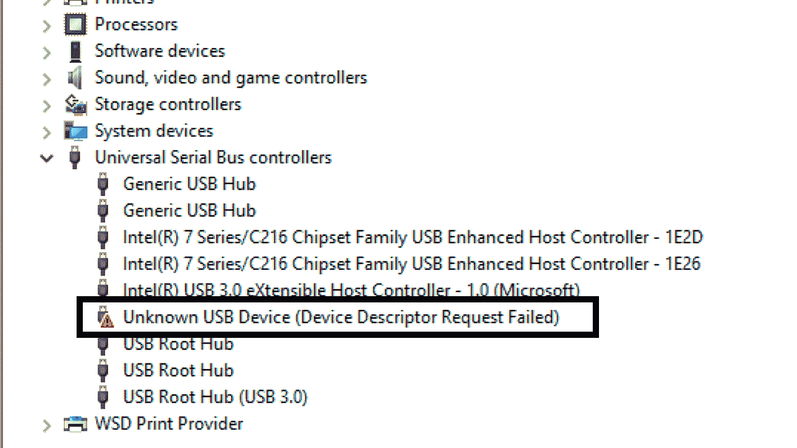
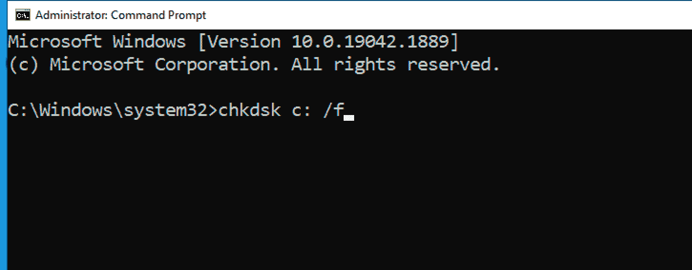
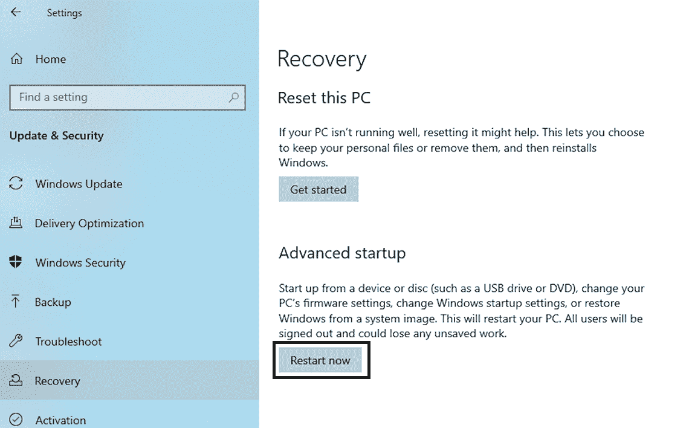

# 内核安全检查失败——如何在 Windows 10 中重启内核

> 原文：<https://www.freecodecamp.org/news/kernel-security-check-failure-how-to-restart-the-kernel-in-windows-10/>

我是一名多年的专业软件工程师，我可以证明，没有什么事情比得到令人恐惧的 BSOD(蓝屏死亡)更糟糕了。尤其是当你要在凌晨 2 点写一段令人费解的代码，以满足迫在眉睫的最后期限时。

这只是我作为一名软件工程师的观点，但是让我们面对它——现在使用电脑对大多数专业人士来说是绝对必要的。

关键是死亡的蓝屏几乎在任何情况下都像世界象棋锦标赛棋盘上的鸽子一样受欢迎。

### 你会学到什么

在本文中，我们将研究 BDOS 的一个特别致命的原因，可怕的“内核安全检查失败”问题。我们还将看到，如果您面临这个令人讨厌的问题，您将如何解决这个问题。

## BSOD 的常见原因

出现“内核安全检查失败”问题的常见原因是系统文件损坏、硬件故障或驱动程序过时。

### 损坏的系统文件

恶意软件最有可能导致系统文件损坏。“恶意软件”的术语是“恶意软件”的缩写。这是一个被故意设计成当你在电脑上工作时会造成干扰的软件。

你可能听说过病毒、特洛伊木马病毒、蠕虫、间谍软件、勒索软件等术语。这些都是恶意软件的例子。

### 有缺陷的硬件

故障 RAM(内存)或损坏的硬盘驱动器可能是问题的原因。

### 过时的驱动程序

在这个“内核安全检查失败”问题的所有可能原因中，最可能的原因是过时的驱动程序。

过时的驱动程序问题可能是从旧版本的 Windows 升级到 Windows 10 时出现的。相关驱动程序可能在旧版本的 Windows 上运行良好，但可能与 Windows 10 不兼容。

## 什么是死亡蓝屏？

通常，您会在 Windows 启动期间意识到“内核安全检查失败”问题。这是 Windows 执行检查过程的地方。如果在此过程中，Windows 检测到任何关键数据结构损坏，将引发 Kernel_Security_check_failure 错误。

正如你在下面的截图中看到的，关于这个错误的细节很少。幸运的是，该消息确实包含一个停止代码(用黄色突出显示),以帮助确定为什么会出现可怕的 BSOD。

## 如何修复内核安全检查失败错误

幸运的是，有许多潜在的修复方法可以解决“内核安全检查失败”的问题。

要解决问题，您可以通过调查过程来查明问题的原因。一旦您了解了问题的原因，您就知道应该应用哪个修复程序了。

但是，快速修复(本文提供的可能修复列表中的第一项)可能就像将您的系统升级到最新版本的 Windows 10 一样简单。

您可以在下面看到本文中讨论的修复列表。后续部分包含列表中每个潜在修复的逐步说明。

*   更新至最新发布的 Windows 10 版本
*   更新需要更新的驱动程序
*   检查病毒
*   调查可能损坏的 Windows 文件系统
*   测试禁用防病毒软件是否可以解决问题
*   调查 RAM 可能存在的问题
*   调查可能的硬盘驱动器问题
*   测试禁用防病毒软件是否可以解决问题
*   在安全模式下启动电脑

### 更新至最新发布的 Windows 10 版本

这可能是解决问题最简单的方法。要将 Windows 10 更新到最新版本，您可以采取以下步骤:

*   单击 Windows key + I 调用设置应用程序。
*   单击“更新和安全”板块。
*   单击“检查更新”按钮(屏幕上将显示有关下载和安装进度的状态信息)

*   更新完成后，检查 BSOD 是否仍然出现。

### 更新需要更新的驱动程序

检查有问题的驱动程序的一个简单方法是使用设备管理器。

要调用设备管理器，请按 Windows 键+ X。在将向您显示的对话框中，将显示一个树形结构。

如果您展开树状结构中的所有节点，应该可以清楚地看到哪些驱动程序需要更新，您会在代表需要更新的驱动程序的节点旁边看到一个黄色背景的感叹号。

要更新驱动程序，只需右键单击代表相关驱动程序(需要更新)的节点，然后单击“更新驱动程序”上下文菜单项。

然后你会看到两个选项:你可以选择 Windows 10 自动搜索驱动程序的选项，或者你可以选择手动选项，在你的电脑上搜索可能已经存在的相关新驱动程序文件。

下一步是允许驱动程序安装更新完成。

然后，您可以通过检查设备管理器中包含黄色背景感叹号的节点，继续检查其他有问题的驱动程序。如果您找到更多，您可以更新这些驱动程序，直到所有有问题的驱动程序都被适当地更新。

然后你只需要重启你的电脑，这样新驱动程序产生的改变就完成了。希望这能消除你的 BSOD 问题。

如果问题仍然存在，您必须继续调查…

### **检查病毒**

您必须确保在您的电脑上安装了最新的 Windows 更新，并使用防病毒软件来检查病毒。

如果发现一个或多个病毒，请采取必要的措施从您的计算机中删除病毒。

### 调查可能损坏的 Windows 文件系统

您可以使用系统文件检查器(SFC)工具来修复损坏的系统文件。以下是运行系统文件检查工具时可以遵循的步骤。

*   在桌面上，使用 Windows + R 键打开“运行”框
*   在“运行”框中，键入“cmd ”,然后按 ctrl+shift+enter 以管理权限启动命令提示符。
*   在“用户帐户控制”ss (UAC)提示符下单击“是”按钮
*   在命令提示符窗口中键入“SFC /scannow ”,然后按“Enter”键。

系统文件检查工具将检查 Windows 系统文件的完整性，并在需要时执行适当的修复操作。

该过程完成后，重新启动计算机。

### 测试禁用防病毒软件是否可以解决问题

防病毒软件即使是出于好意，也可能会无意中阻止无害的服务和应用程序正确运行。

这种方法会告诉您(可以说)您的防病毒软件可能是问题的原因，但请注意，不建议您在没有适当防病毒软件保护的情况下运行计算机。

要暂时禁用您的防病毒软件，您只需调用任务管理器窗口。您可以通过按键盘上的 ctrl+shift+escape 来完成此操作。

如果任务管理器以压缩模式加载，请单击“更多详细信息”选项。然后选择“任务管理器”窗口顶部的“启动”标签。

找到代表您的防病毒应用程序的名称，然后单击相关的列表项。

然后单击任务管理器窗口右上角的禁用按钮。

最后，重新启动计算机，看看 BSOD 是否仍然出现。

请再次记住，即使这解决了问题，你也不应该在没有杀毒软件的情况下运行你的电脑。所以你可能需要寻找其他保护措施。

### 调查 RAM 可能存在的问题

要确定 RAM(内存)问题，您可以调用内置的 Windows 10 扫描仪。为此，请单击任务栏中的搜索放大镜图标或按 Windows 键。

在搜索文本框中键入“内存诊断”，然后运行搜索结果中显示的第一个选项。

在弹出的对话框中，选择“立即重启并检查问题(推荐)”选项，开始诊断过程。

在引导过程中，内存诊断过程将尝试识别与 RAM 相关的可能错误和问题。如果发现问题，将会向您报告。

### 调查可能的硬盘驱动器问题

您可以使用“检查磁盘”工具扫描硬盘，查找任何不一致和错误。

要运行检查磁盘工具，请确保您使用管理员帐户登录 windows。然后按照以下步骤操作:

*   在桌面上，单击 Windows 键+ R 启动“运行”框。
*   在“运行”框中，键入“cmd ”,然后按 ctrl+shift+enter 以管理员身份运行命令提示符。
*   在“用户帐户控制”(UAC)提示上单击“是”按钮。
*   键入“chkdsk c: /f”并按回车键

“/f”选项将尝试修复任何发现的错误

您还可以在这个命令中包含“/r”选项和“/x”选项。“/r”选项将定位坏扇区并恢复任何可读信息，而“/x”选项将在实用程序开始扫描之前强制卸载(将要检查的)磁盘驱动器。

### 在安全模式下启动电脑

您可以在安全模式下启动电脑，这样 Windows 10 启动时只需最少的文件和驱动程序。要在安全模式下启动 Windows 10，您可以按照以下步骤操作:

*   按 Windows 键+ I 调用设置应用程序。
*   在“更新和安全”标题下，选择“恢复”选项卡。
*   在右窗格的“高级启动”标题下，按“立即重新启动”按钮。

*   电脑重启到“选择一个选项**画面后，选择故障排除>高级选项>启动设置>重启。**

**电脑重启后，您会看到一个选项列表。选择“4”或按“F4”在安全模式下启动电脑。或者如果您需要使用互联网，您可以选择**5**或按**F5**进行安全模式联网。**********

******如果问题不是在安全模式下发生的，这意味着默认设置和基本设备驱动程序不是导致问题的原因。******

******假设问题不是在安全模式下出现的，您现在知道问题一定是由在正常模式下运行的附加驱动程序或应用程序引起的。******

******使用排除过程，您现在可以专注于相关的附加驱动程序和应用程序。您可以从最近安装的应用程序开始，按照从最近安装到最近安装的顺序，系统地卸载每个相关的应用程序。******

******每次卸载时，您都可以测试问题。这将有望查明导致问题的应用程序或程序。然后你可以卸载相关的软件，希望能解决这个问题。******

## ******结论******

******总之，内核安全检查失败的问题会带来巨大的不便。但是希望本文提供的步骤能够帮助您解决这个问题。******