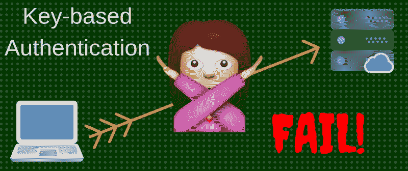

# ssh-copy-id 之后基于密钥的身份验证不起作用时该怎么办

> 原文：<https://www.freecodecamp.org/news/key-based-authentication-not-working-after-ssh-copy-id-abef7f401d23/>

作者阿里特·阿玛纳

# ssh-copy-id 之后基于密钥的身份验证不起作用时该怎么办

我最近在 Vultr 上提供了一个 Ubuntu 虚拟私有服务器(VPS)。我自己偏爱 CentOS，但是我正在做的任务推荐了 Ubuntu。

要设置从我的笔记本电脑到服务器的基于密钥的身份验证，

*   我在 Mac 上使用命令:`ssh-keygen -t rsa -b 4096`生成了一个新的 SSH 密钥对(名为“ubuntu”)
*   然后我使用`ssh-copy-id`工具将我的公钥复制到我的 Vultr VPS: `ssh-copy-id -i .ssh/ubuntu aritdev@123.456.789.000`上的`authorized_keys`文件中

正如我所料，该工具要求我的 VPS 密码，以完成公钥传输。当一切完成后，我试图登录到我的 VPS。

它应该让我不需要密码就能通过:

`ssh -i .ssh/ubuntu aritdev@123.456.789.000`

但是我一直被提示输入密码。？

*   我在 VPS 上检查了我的`authorized_keys`文件，以确保我的公钥被正确复制。检查。？？
*   我确保该文件只对我自己是可读写的，对其他人是不可读写的。检查。？？
*   我确保在`/etc/ssh/sshd_config` : `PubkeyAuthentication yes`和`AuthorizedKeysFile .ssh/authorized_keys`中启用了以下选项。检查。？？

尽管如此，当我从笔记本电脑登录时，系统还是不断提示我输入密码。

在 StackOverflow 上呆了几分钟后，我了解了加密的主目录，这在某些环境中是默认的，包括 Ubuntu。

在首次登录成功之前，加密的主目录不会被解密。但是，我的`authorized_keys`文件存储在我的主目录中。

因此，我的第一次连接尝试将需要密码。后续的连接不需要密码就能成功，因为 SSH 服务将能够读取我的解密主目录中的`authorized_keys`文件。

为了解决这个问题，我在我的主目录之外创建了一个以我的用户名`aritdev`命名的目录(我选择了`/etc/`，并给了我自己完全的权限，但是给了其他人读-执行权限。接下来，我把我的`authorized_keys`文件移到了`/etc/aritdev/`。然后，我更新了`/etc/ssh/sshd_config`中的`AuthorizedKeysFile`参数:

`AuthorizedKeysFile /etc/%u/authorized_keys`

最后，我重启了 SSH 服务。为了测试，我注销了我的 VPS，然后尝试重新登录。嘣-成功了！？？

您遇到过哪些与服务器认证相关的问题？你是怎么解决的？请在下面分享！？？