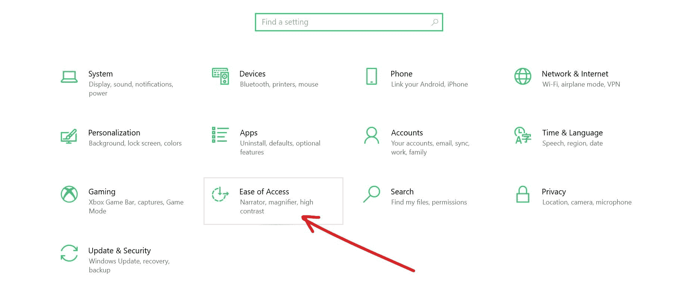
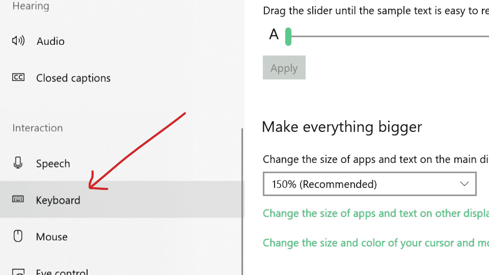
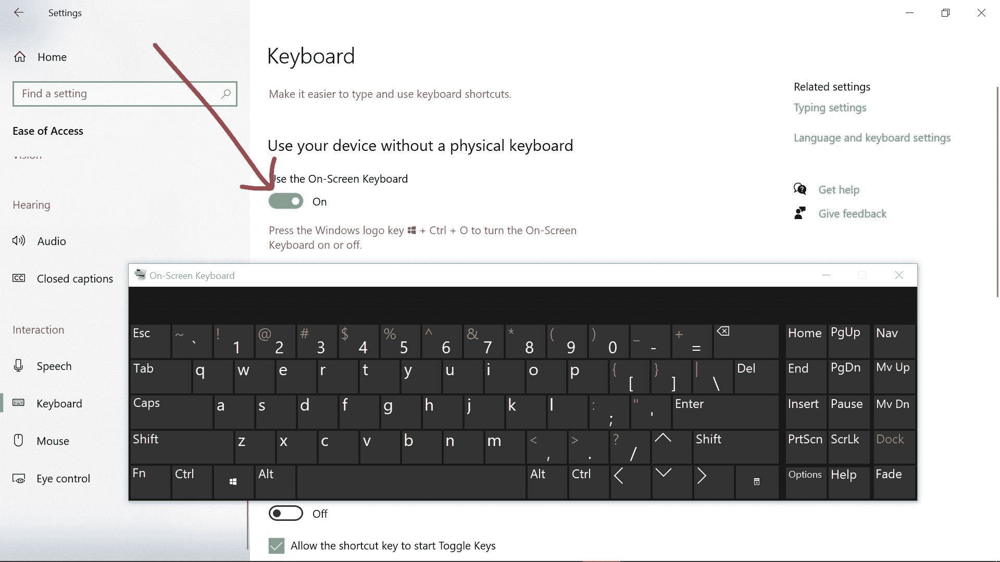
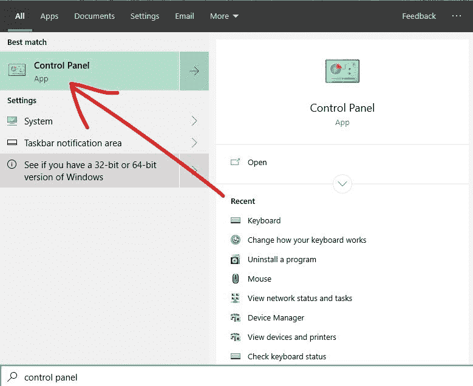
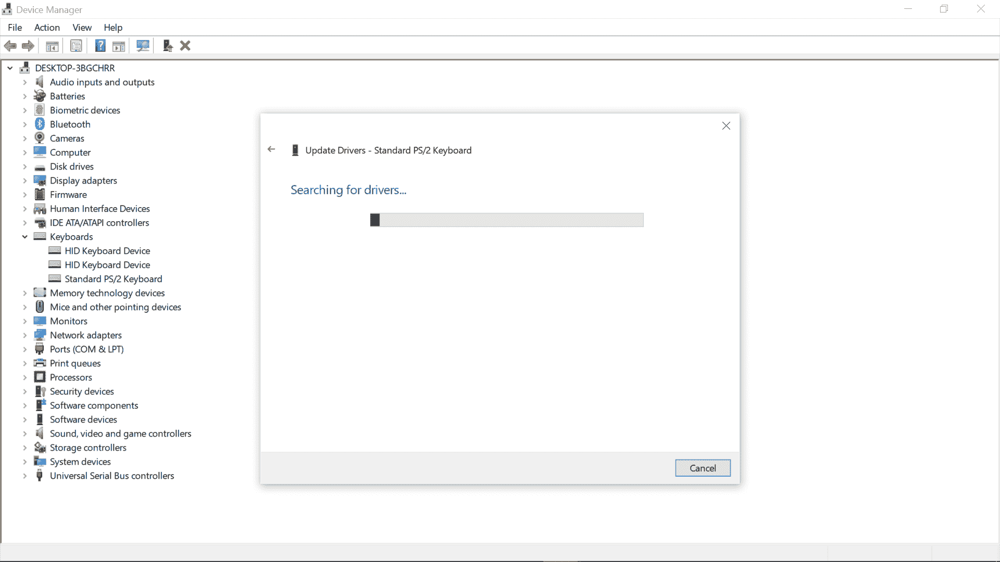

# 键盘不工作？如何修复 Windows 10 键盘不打字的问题

> 原文：<https://www.freecodecamp.org/news/keyboard-not-working-how-to-fix-windows-10-keyboard-not-typing-problem/>

你有没有坐下来写代码或浏览互联网，却发现你的键盘坏了？

当您的键盘无法工作时，可能是因为:

*   物理损伤
*   泥土
*   过滤键
*   过时或损坏的驱动程序
*   电池电量低(如果您使用外置键盘)。

您可以检查键盘插入的 USB 端口，并确定它已正确连接，以使它再次工作。你也可以清洁你的键盘。但是这些快速解决方案可能仍然不能解决问题。

如果你一直按键盘上的键，但屏幕上什么也没有显示，那你就来对地方了。因为在本指南中，我将向你展示 3 种方法来解决这个问题。

请注意，如果您的外置或内置键盘出现问题，您需要打开屏幕键盘，使用本指南中提供的解决方案来解决问题。

### 如何打开屏幕键盘

转到“设置”并选择“轻松访问”。

在交互下，选择键盘。

打开“使用屏幕键盘”。

## 如何通过关闭过滤键来修复键盘不工作的问题

过滤键帮助不能同时按下两个按钮的人运行只能通过这种方式访问的功能。但有时，这可能会导致您的键盘停止工作。

**要关闭过滤键，请遵循以下步骤:**

**步骤 1** :点击开始，搜索“控制面板”，然后回车打开第一个搜索结果——总是控制面板。

第二步:确保你是按类别而不是小图标或大图标来浏览，然后选择“方便访问”。

**第三步**:点击“改变键盘工作方式”链接。

**第四步**:取消勾选“打开过滤键”复选框。

**第五步**:点击“应用”，然后点击“确定”。

## 如何通过禁用快速启动来修复键盘无法输入的问题

快速启动是一个让 Windows 10 电脑快速启动的选项。

如果你使用的是外接键盘，快速启动功能可能是它不起作用的原因。

* *遵循以下建议禁用快速启动功能。
* *
第一步:点击开始，搜索“控制面板”。点击控制面板搜索结果或点击键盘上的`ENTER`。

第二步:确保你是按类别观看，然后选择“硬件和声音”。

**第三步**:选择电源选项。

**步骤 4** :点击“选择电源按钮的功能”链接。

**第五步**:点击“更改当前不可用的设置”链接。

**第六步**:取消勾选“开启快速启动”，点击“保存更改”按钮。

## 如何通过更新键盘驱动程序来解决键盘不工作的问题

过时或损坏的驱动程序可能是您的键盘无法工作的原因。

**您可以按照下面解释的步骤更新您的键盘驱动程序:
**
**步骤 1** :右键单击开始并选择设备管理器。

**第二步**:展开键盘。

**第三步**:右键点击受影响的键盘，选择更新驱动。

**步骤 4** :选择自动搜索更新的驱动软件。

您的计算机现在将在 internet 上搜索最新的驱动程序并进行安装。

我希望本文中讨论的解决方案能帮助您修复键盘。

感谢您的阅读。