# 如何使用 App Runner 将 Kotlin 微服务部署到 AWS

> 原文：<https://www.freecodecamp.org/news/kotlin-aws-app-runner/>

大家好。在这个循序渐进的教程中，我将向您展示如何使用 Docker 和 AWS App Runner 部署 Kotlin 微服务。

我们将一起学习:

*   AWS App Runner 到底是什么？
*   如何在本地机器上配置 AWS 命令行界面
*   如何将 Docker 图像推送到亚马逊弹性容器注册中心(ECR)
*   最后，如何使用 AWS App Runner 部署我们的容器化应用程序

我知道，这听起来工作量很大。但是我相信你会发现有了上面的技术，事情会变得多么简单。

## 先决条件

在我们开始之前，确保您已经在本地机器上安装了 **Docker** 。我们需要将我们的应用程序容器化。

如果你没有 Docker，那么官方的 [Docker 文档](https://docs.docker.com/engine/install/)会在几分钟内帮你设置好。

## AWS App Runner 到底是什么？

首先，让我们花点时间了解一下 **AWS App Runner** 到底是什么。

简而言之，它是一个完全托管的服务，允许您轻松构建和部署容器化的 web 应用程序和 API。

它负责很多事情，比如流量负载平衡或伸缩，这有助于像你我这样的开发人员专注于代码。

在创建演示或概念验证时，AWS App Runner 通常是一个很好的选择，但对于没有专门人员从事基础设施工作的小型团队来说，它也是值得考虑的。

## 如何创建简单的 Kotlin 微服务

话虽如此，让我们用 Kotlin 和 Ktor 准备一个简单的 REST API。

如果您对 Ktor 实现不感兴趣，那么您可以简单地克隆[这个 GitHub 存储库](https://github.com/codersee-blog/ktor-app-runner-skeleton)并进入*如何构建 Docker 映像*步骤。

如果您使用的是 IntelliJ IDEA Ultimate Edition，那么您可以使用该应用程序创建 Ktor 项目。否则，您可以使用 [Ktor 项目生成器](https://start.ktor.io/)工具并将项目下载到您的本地机器。

无论您的选择如何，请确保导入以下插件:

*   内容协商
*   kotlinx .序列化
*   按指定路线发送

### 如何配置序列化

导入项目后，创建`Serialization.kt`文件并将`application/json`内容类型注册到 ContentNegotiation 特性:

```
fun Application.configureSerialization() {
    install(ContentNegotiation) {
        json()
    }
}
```

简而言之，通过这个代码片段，我们将能够将 Kotlin 对象序列化为 JSON(并将 JSON 反序列化为对象)。

### 如何创建 DTO

现在让我们像这样实现一个`MessageDto`数据类:

```
@Serializable
data class MessageDto(val message: String)
```

基本上，我们将使用这个泛型类为我们的 API 消费者提供消息。

### 如何公开端点

下一步，让我们创建一个`Routing.kt`文件并公开一个新的端点:

```
fun Application.configureRouting() {
    routing {
        helloWorldRoute()
    }
}

fun Routing.helloWorldRoute() {
    route("/hello") {
        get {
            call.respond(HttpStatusCode.OK, MessageDto("Hello World!"))
        }
    }
}
```

正如你所看到的，我们的应用程序会用一个 **200 OK** 状态码来响应对`/hello`路径的每个`GET`请求。

### 如何配置应用程序

现在，让我们将`Application.kt`文件中的所有内容结合起来:

```
fun main() {
    embeddedServer(Netty, port = 8080, host = "0.0.0.0") {
        configureRouting()
        configureSerialization()
    }.start(wait = true)
}
```

如你所见，我们的 Kotlin 微服务将是一个运行在`localhost:8080`上的 **Netty 嵌入式服务器**。

我强烈建议您运行应用程序，并验证一切都正常工作:

```
GET localhost:8080/hello

Status: 200 OK
Response Body: 
{
    "message": "Hello World!"
}
```

### 如何实现 Dockerfile

最后，让我们将`Dockerfile`添加到我们项目的根目录中:

```
FROM openjdk:8-jdk
EXPOSE 8080:8080
RUN mkdir /app
COPY ./build/install/com.codersee.ktor-app-runner/ /app/
WORKDIR /app/bin
CMD ["./com.codersee.ktor-app-runner"]
```

确保为`COPY`和`CMD`命令指定的目录与`settings.gradle.kts`文件中`rootProject.name`的值相匹配。如果项目的名称是`xyz`，那么这些命令应该反映出:

```
...
COPY ./build/install/xyz/ /app/
...
CMD ["./xyz"]
```

## 如何建立码头工人形象

此时，我们已经拥有了构建我们的 **Docker 映像**所需的一切，稍后我们将使用它来部署 **AWS App Runner** 。

### 运行 Gradle 命令

作为第一步，让我们用 Gradle Wrapper 运行`installDist`命令:

```
./gradlew installDist
```

上面的命令负责组装分发内容并将其安装在当前机器上。虽然这听起来很难，但它将简单地在`./build/install/{project-name}/`目录中创建必要的文件。

### 建立 Docker 形象

下一步，让我们构建一个 Docker 映像:

```
 docker build -t ktor-aws-runner . 
```

如您所见，我们用`-t`选项(T2 的一个快捷方式)将我们想要的图像命名为`ktor-aws-runner`。

### 验证 Docker 配置

最后，让我们运行我们的容器，以确保我们的 Kotlin 微服务正常工作:

```
docker run -p 8080:8080 ktor-aws-runner
```

作为一个解释，`-p`标志(`--port`)负责向主机`8080`端口发布容器的`8080`端口。

完成后，几秒钟后我们应该会在日志中看到以下消息:

```
Application started in 0.078 seconds
```

类似地，我们可以执行 GET 请求来检查公开的端点是否正确响应。

## 如何创建和配置 AWS 用户

完成所有这些工作后，我们终于可以开始使用 AWS 了。但是在我们能够推送 Docker 映像之前，我们需要确保我们已经在本地机器上安装了 **AWS CLI** 。

我们可以使用下面的命令轻松做到这一点:

```
 aws --version

 # Result:
 aws-cli/2.5.3 Python/3.9.11 Windows/10 exe/AMD64 prompt/off
```

上述结果表明一切都设置正确。然而，如果我们想安装或更新 CLI，那么 AWS 会在他们的官方文档中提供一篇非常好的文章。

此外，我们必须能够从我们的计算机访问 AWS 云，这就是我们在这一步要设置的。

为了设置访问权限，让我们登录到 **AWS 管理控制台**并导航到 **IAM 控制台**的**用户**功能。我们可以通过顶部的搜索栏轻松做到这一点:

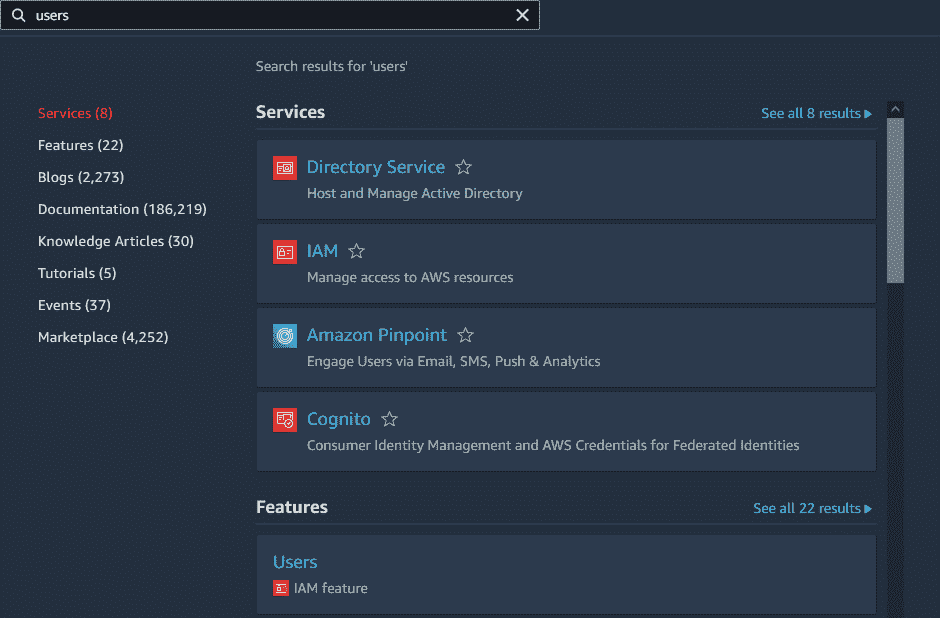

在下一页，让我们单击**添加用户**按钮:

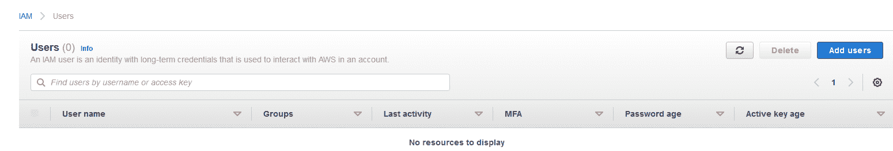

然后，我们将指定首选的**用户名**以及**访问密钥**–**程序化访问**凭证类型:

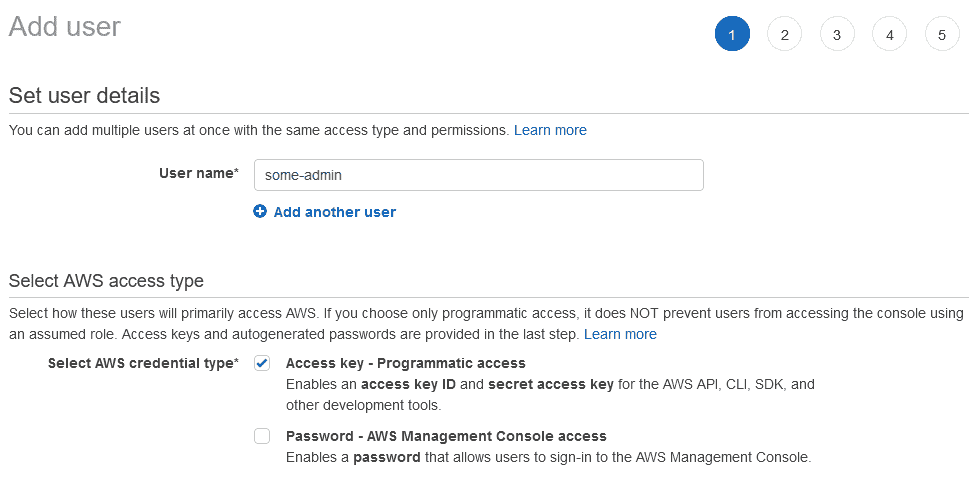

通过这些设置，我们将能够使用访问密钥和密码的组合来访问 AWS。

完成后，让我们点击下一个按钮。在这个页面上，我们必须为我们的用户选择组。出于本教程的目的，让我们使用下面可见的按钮创建一个新的:

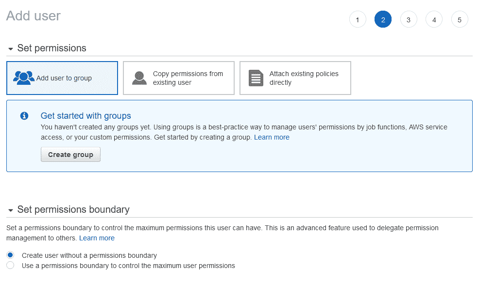

接下来，让我们在模态中指定一个**组名**(在我的例子中为`admin-group`)并选择**管理员访问**:

为简单起见，我们将使用 AdministratorAccess。但是在现实生活中，我们应该始终坚持最小特权原则。

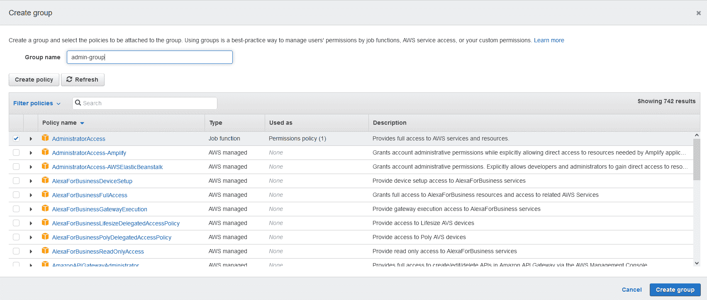

创建组后，让我们再次点击下一个按钮:

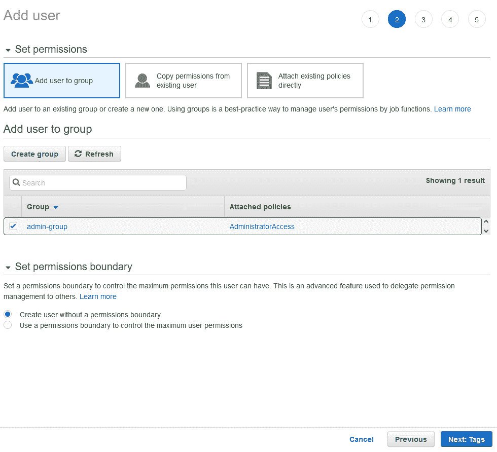

在下一页，我们可以选择添加**定制标签**作为键值对。

但是我们今天不需要它们，所以让我们跳过这一页:

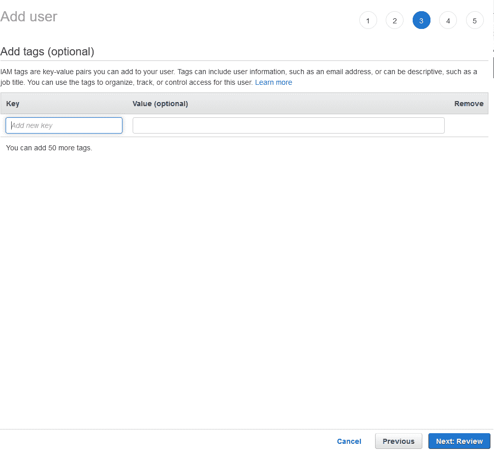

最后，我们将被重定向到**审查**页面，在这里我们可以验证之前的步骤:

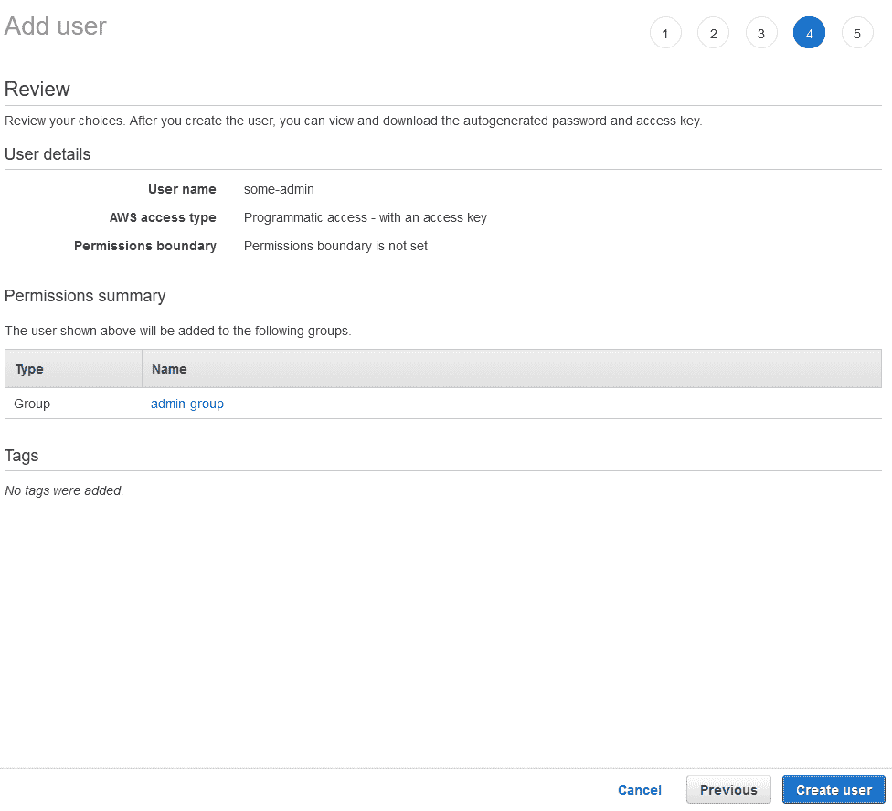

如您所见，一切看起来都很好，所以让我们点击**创建用户**:

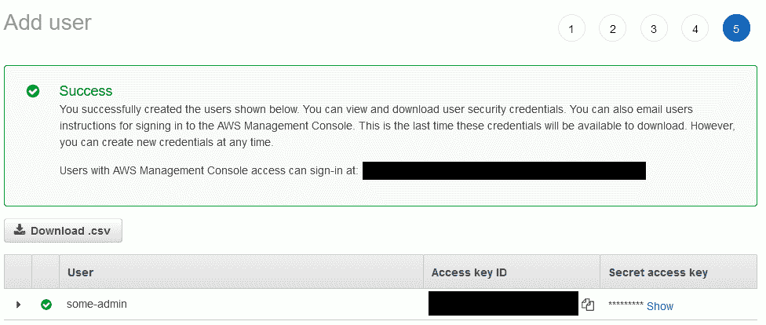

用户创建成功，所以我们终于可以导入我们的访问密钥和秘密密钥了。

请记住，访问和秘密密钥是高度机密的数据，您绝不能与任何人共享！

让我们点击**下载。csv** 按钮并获取文件。我个人把它命名为`some_user_credentials.csv`，但是你可以随意选择任何你喜欢的名字(并且记住它:)。

接下来，我们导航到下载目录并运行以下命令:

```
 aws configure import --csv file://some_user_credentials.csv

 # Result:
 Successfully imported 1 profile(s)
```

根据上面的消息，我们可以预期一切都设置正确。此外，我们可以验证在`.aws`目录中创建了一个名为`credentials`的新文件。

如果您使用的是 Windows，那么您的路径将是`C:\Users\[your_user_name]\.aws`:

```
[some-admin]
aws_access_key_id = [your access key id] 
aws_secret_access_key = [your secret] 
```

## 如何将 Docker 图像推送到 ECR

此时，我们的 CLI 已经准备好了，所以我们可以学习如何将本地 Docker 映像推送到**弹性容器注册表**。

首先，让我们回到**管理控制台**，在搜索栏中键入**容器注册表**:

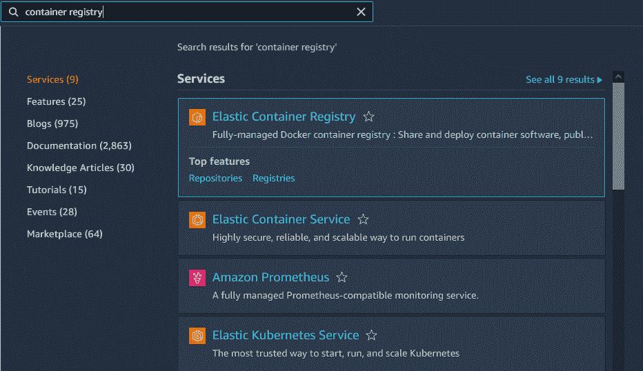

让我们点击**弹性容器注册中心**和下一页上的**创建存储库**按钮。在下一页，让我们选择一个私有存储库并为其指定一个名称:

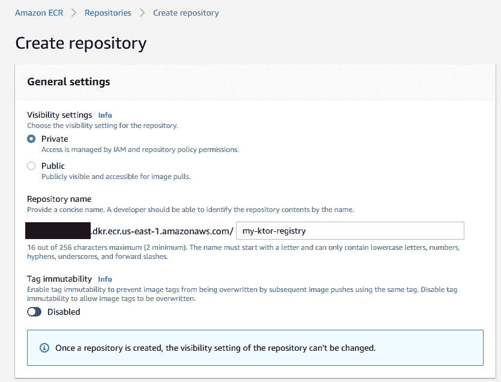

对于其余设置，让我们保留默认值，如下所示:

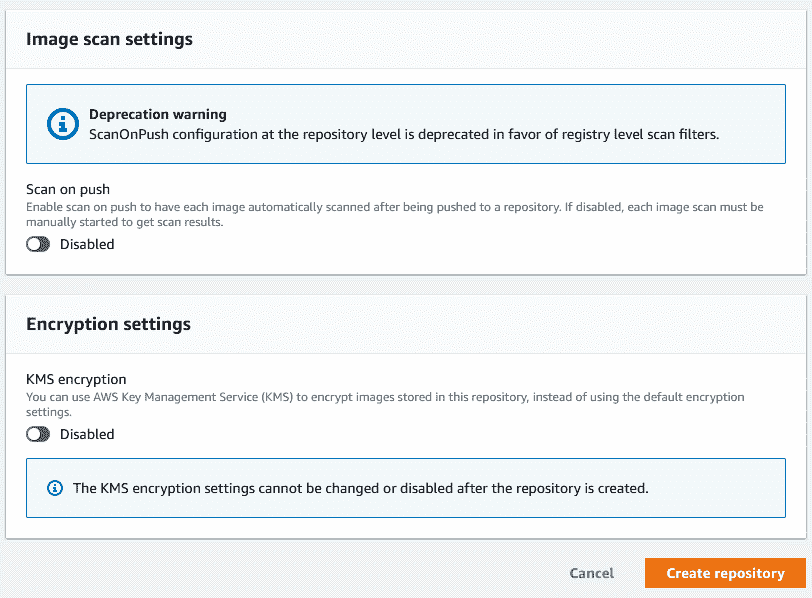

最后，让我们点击**创建存储库**按钮。

之后，我们将被重定向到私有存储库列表，该列表现在包含我们新创建的存储库:

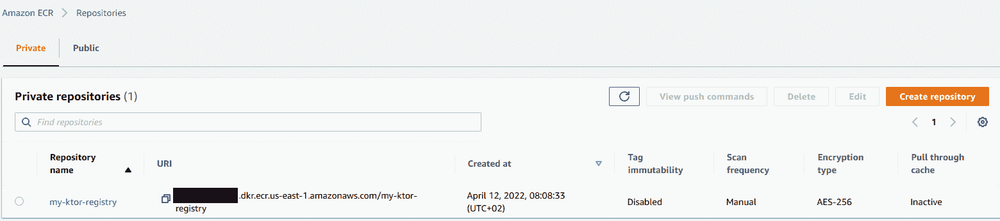

让我们复制 URI 并在本地机器上的终端中指定以下命令:

```
docker tag ktor-aws-runner:latest [your_registry_uri]:latest

# Example: docker tag ktor-aws-runner:latest 111111111111.dkr.ecr.us-east-1.amazonaws.com/my-ktor-registry:latest
```

我们为什么需要它？嗯，基本上，当使用 Docker **时，我们需要用注册主机和端口**标记图像(如果需要的话)，以便将它们推送到任何私有存储库。

完成之后，让我们向 Amazon ECR 注册中心进行认证:

```
aws ecr get-login-password --profile some-admin --region us-east-1 | docker login --username AWS --password-stdin [your registry URI]

# Result:
Login Succeeded
```

之后，我们可以运行`git push`命令将图像推送到 ECR:

```
docker push [your_tagged_image] 

# Example: docker push 111111111111.dkr.ecr.us-east-1.amazonaws.com/my-ktor-registry:latest
```

根据您的连接，这可能需要一些时间，但最终，我们应该会在我们的存储库中看到更新列表:

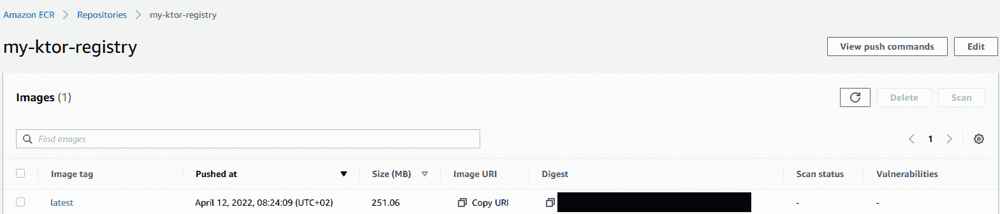

## 如何将应用程序部署到 AWS App Runner

现在，我们拥有了与世界分享 Kotlin 微服务所需的一切:)

让我们回到管理控制台，搜索 app runner:

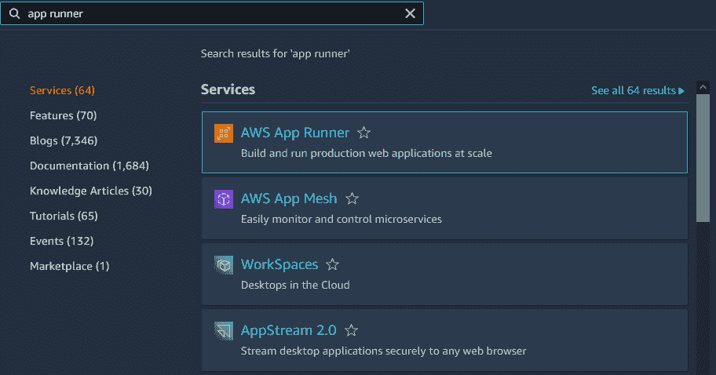

在下一页，让我们点击**创建服务**按钮。

对于源配置，让我们选择**容器注册中心**和**亚马逊 ECR** :

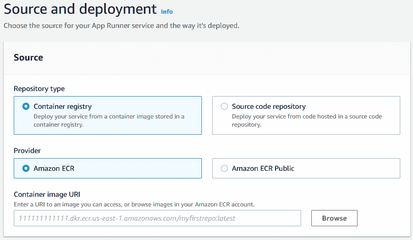

您可能已经注意到，AWS App Runner 可以直接从源代码库中部署服务。如果您对这样的配置感兴趣，请通过电子邮件与我联系(联系[at]codersee[dot]com)。

接下来，让我们点击浏览并选择**先前创建的图像**:

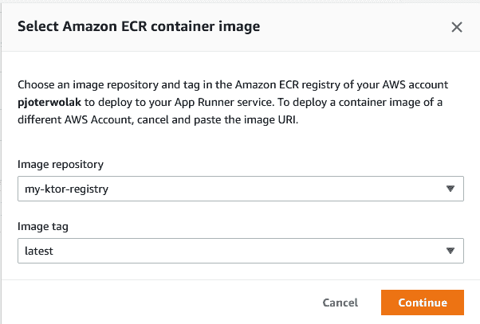

让我们单击继续，对于部署设置，让我们选择**手动**和**创建新服务角色:**

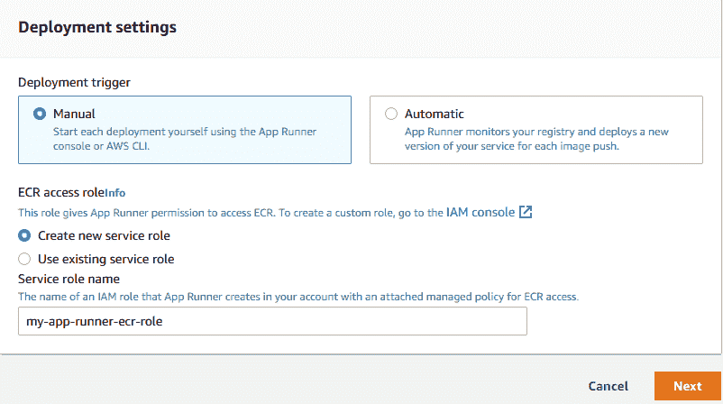

角色名称在本教程中并不重要，所以我们可以指定任何值。

下一步，让我们单击下一步，在下一页上，让我们提供一个**服务名**以及 **CPU** 、**内存**和**端口**信息:

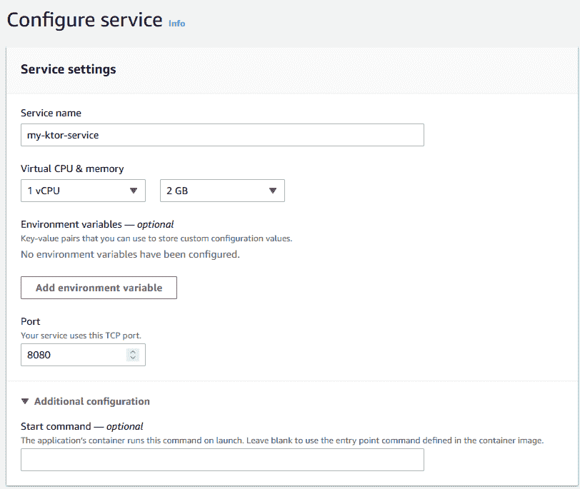

Image presents Service name, cpu, memory, environment variables, port and additional configuration settings

如您所见，我们已经选择了最小的可用组合(这也是我建议您做的)。

如果我们想指定一些额外的环境变量或自定义启动命令，那么这个页面允许我们这样做。但是我们不需要任何环境变量，我们已经在 Docker 映像中添加了一个 start 命令，所以让它保持原样。

在自动缩放页面上，选择**自定义配置**:

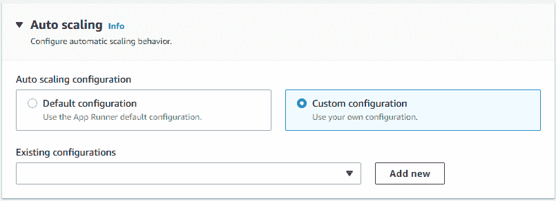

接下来，让我们创建一个名为**我的配置**的新配置:

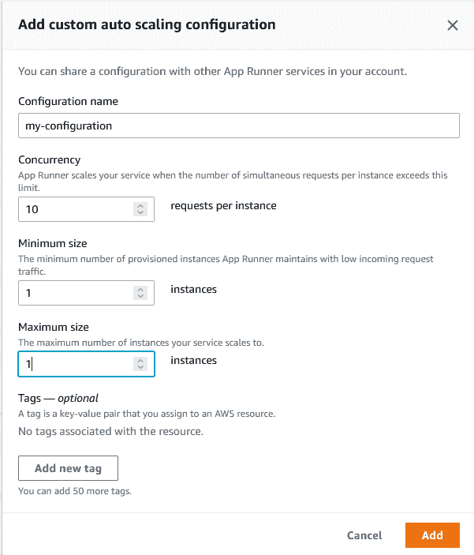

正如我在开始时提到的，AWS App Runner 处理了大量开箱即用的东西。其中之一是自动缩放。虽然这是一个很棒的特性，但是我们必须根据自己的喜好来限制它，并且永远记住更多的资源意味着更高的成本。

如上所述，这个示例配置**不会扩展我们的 Kotlin 微服务**。但是，如果我们增加最大大小，那么每当并发请求数增加 10 时，就会创建一个新的实例。

让我们添加上面的配置，并保留其余项目的默认值。单击“Next”后，我们将看到包含部署摘要的“Review”页面。

在此页面上，让我们点击`Create and Deploy`按钮，这将启动部署过程:

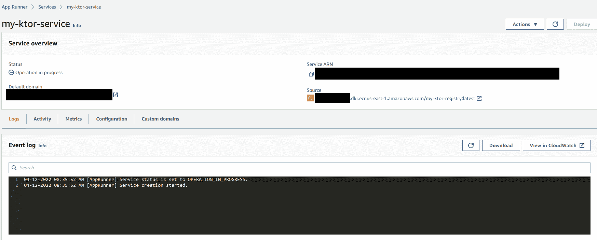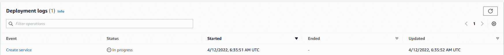

同样，这个过程可能需要几分钟。完成后，状态将从`Operation in progress`变为`Running`，我们将能够测试我们的 Ktor REST API。

就像前面一样，让我们测试一下`GET /hello`端点。但是这一次，作为我们微服务的主机名，我们需要使用来自`Default domain`的值:

```
#Example: 

GET https://aaaaaaaaaa.us-east-1.awsapprunner.com/hello

Status: 200 OK
Response Body: 
{
    "message": "Hello World!"
}
```

## 🛑重要通知

请记得**删除我们今天**创建的所有资源，这样就不会向你收费了。

学习 AWS Cloud 时，我们很容易忘记我们创造的所有东西，在某些时候，您可能会超出您的免费配额。因此，删除所有这些内容是一个很好的做法。

## 摘要

关于如何使用 AWS App Runner 将 Kotlin 微服务部署到 AWS Cloud 的教程到此结束。我真的希望在遵循本指南之后，您能够轻松地将您的应用程序部署到 Amazon Cloud。

如果你喜欢这份材料，那么你可能想看看我的其他文章。在我的博客上，我涵盖了大量与科特林、Ktor 和 Spring Boot 相关的话题。

如果你想问我任何事情，请打电话给我。