# 如何开始构建您的 Android 应用程序:创建模型、UI 和 XML 布局

> 原文：<https://www.freecodecamp.org/news/kriptofolio-app-series-part-2/>

#### Kriptofolio app series - Part 2

那么，你实际上如何开始构建一个新的应用程序呢？你的第一步应该是什么？如果你认为我们只需要启动 Android Studio，直接跳到代码，那就再想想吧。这正是我建议不要做的事，因为它弊大于利。但是尽快开始编写第一行代码是如此诱人。

相反，我建议专注于制定一个明智的 UI 模型计划。请记住，每一个好的新应用项目都应该以此为起点。使用这种方法，你不会浪费很多时间，并且能够从一开始就构建高质量的产品。

因此，在系列的这一部分，我将展示“Kriptofolio”(以前的“我的加密硬币”)应用程序模型，并讨论如何创建它们。此外，我们将建立所有的用户界面布局。这些布局将成为我们明确指出编码内容的坚实基础。最后，我们将把我们的应用程序本地化为不同的语言，并学习如何处理从右向左书写的语言。

### 系列内容

*   [简介:2018–2019 年打造现代 Android 应用的路线图](https://www.freecodecamp.org/news/kriptofolio-app-series)
*   [第一部分:固体原理介绍](https://www.freecodecamp.org/news/kriptofolio-app-series-part-1)
*   第 2 部分:如何开始构建您的 Android 应用程序:创建模型、UI 和 XML 布局(您在这里)
*   第 3 部分:关于架构的一切:探索不同的架构模式以及如何在你的应用中使用它们
*   [第四部分:如何用 Dagger 2](https://www.freecodecamp.org/news/kriptofolio-app-series-part-4) 在你的应用中实现依赖注入
*   [第 5 部分:使用 refuge、OkHttp、Gson、Glide 和协程处理 RESTful Web 服务](https://www.freecodecamp.org/news/kriptofolio-app-series-part-5)

### 实体模型

有多种方法可以创建您的项目模型。最简单的一个就是拿一支铅笔和一张纸，开始在上面画画。最棒的是，这种方式不需要你付出任何代价，而且你可以立即开始。哦，我差点忘了，你还应该给自己买个橡皮擦，因为没有撤销功能。？

如果你像我一样，觉得你需要更多的功能，那么考虑使用特殊的软件来创建详细的模型。我更喜欢使用软件而不是铅笔和纸，即使这需要你投资购买它和你的时间来学习如何使用它。

市场上有各种软件可供选择。你必须自己调查哪一个最适合你的需求。对于我所有的项目样机，现在我正在使用桌面应用程序的 [Balsamiq](https://balsamiq.com/) 样机。Balsamiq 是一款快速、有效且非常易于使用的线框软件。由于我对它相当满意，我推荐它用于创建 Android 应用程序，所以请随意尝试。


我通过创建经过深思熟虑的非常详细的模型开始了我的加密硬币应用程序项目。我对自己说，如果我以一种非常细致的方式创造一切，那么我就会避免错误。我也不会浪费时间在开发过程中突然改变功能。如果你在创建好的模型上花了很多努力，那么，再加上一点点想象力，你就能看到和感受到最终的产品。

我的目标是在模型中定义一切，就像它应该出现在最终产品中一样。为此，我尽量不匆忙，而是花尽可能多的时间。以下是我的加密硬币应用程序的最终模型:

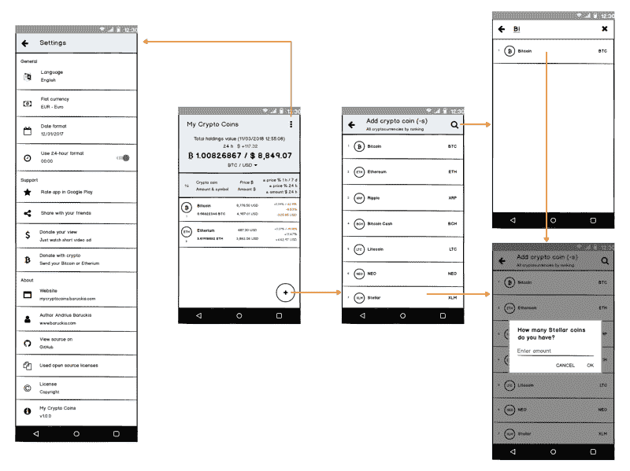

Mockup of My Crypto Coins app made with Balsamiq Mockups software

### 库存设计—材料

另一个要说的重要事情是应用程序的视觉设计。在本文撰写之时，[材质设计](https://en.wikipedia.org/wiki/Material_Design)是 Google 为所有 Android 应用推荐的库存视觉设计。你猜怎么着——股票设计不会出错。

对于我的加密硬币应用程序，我们将使用材料设计。该应用程序遵循详细的在线指南中定义的最佳实践。

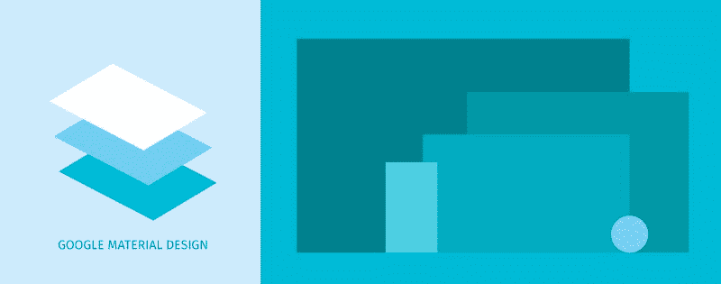

[Material.io/guidelines](https://material.io/guidelines)—正式的材料设计现场规范文件，这将是我们对该项目的设计指南。

### 布局

现在，当我们已经准备好应用程序的线框时，是时候构建真正的 UI 了。同样，我们可以直接写代码，但是为什么要着急呢？相反，我建议集中精力构建所有的 XML 布局。我在这里的建议是，你在 XML 中管理的越多，你需要写的代码就越少。

Android 团队通过向 XML 布局添加新功能，不断改进您构建 UI 的方式。有时候，写几行代码来达到想要的效果是很诱人的。但是最好更深入地研究一下这个主题，看看是否有可能不使用代码。记住:更少的代码使你的项目看起来更整洁。对于其他开发人员来说，它也更容易理解，更容易维护。

最后，当你创建了所有的 XML 布局后，你会觉得你的应用程序已经完成了。您将能够启动它，并了解最终用户的感受。它在显示一些假数据，什么都不做，这没关系。现在你有最后的机会来做一些重大的改变。

如果你正在为别人开发一个应用程序，这是展示它的好时机。也许你会被要求在最后一刻做出一些令人惊讶的改变。这样，您将避免为永远不会使用的功能编写代码。很多人没有足够的想象力，他们需要先看到和触摸来决定这是否是他们想要的。所以不要把你的布局留到工作流程的最后一步。

对于这个应用程序，我将使用所有现代 Android 应用程序中常见的各种组件:

*   CoordinatorLayout —一个超级强大的框架布局，其主要吸引力在于能够协调其中视图的动画和过渡。
*   [AppBarLayout](https://developer.android.com/reference/android/support/design/widget/AppBarLayout) —一个垂直的 LinearLayout，实现了 material design 的 app bar 概念的许多特性，即滚动手势。
*   [工具栏](https://developer.android.com/reference/android/support/v7/widget/Toolbar) —在应用程序布局中使用的动作栏的概括。
*   [CollapsingToolbarLayout](https://developer.android.com/reference/android/support/design/widget/CollapsingToolbarLayout)—实现折叠应用程序栏的工具栏包装器。它旨在用作 AppBarLayout 的直接子级。
*   [ConstraintLayout](https://developer.android.com/reference/android/support/constraint/ConstraintLayout) —一个视图组，允许您以灵活的方式定位和调整小部件的大小。想象一个服用类固醇的相对人。
*   [SwipeRefreshLayout](https://developer.android.com/reference/android/support/v4/widget/SwipeRefreshLayout) —允许完全实现滑动刷新用户界面模式的小部件。它检测垂直滑动，显示一个独特的进度条，并在你的应用程序中触发回调方法。
*   [浮动操作按钮](https://developer.android.com/reference/android/support/design/widget/FloatingActionButton) —一个圆形按钮，触发应用程序 UI 中的主要操作。

对于主屏幕，我们将使用所有这些组件的组合来创建良好的用户界面/UX。用户可以展开和折叠布局的顶部，以找到他们所有加密货币投资组合的总价值。他们可以检查过去 24 小时内的任何价值变化，并更改选定的法定货币。

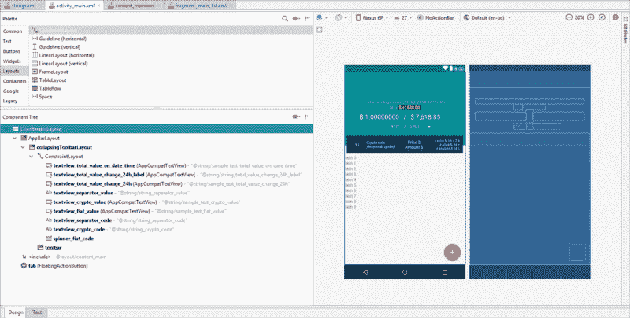

Main screen layout creation

当然除了这九个还有其他成分。掌握整个组件面板以了解在任何特定情况下使用哪个组件面板是非常重要的。随着移动趋势的不断变化，调色板也将不断扩展。

我不会谈论每一个组件，但我的建议是自己调查一下。对我来说，理解它们的最好方法是尝试手动构建 XML 布局，而不是使用 Android Studio 中的自动拖放工具。

### 样式、颜色、尺寸、字符串、图标

乍一看，本节标题中提到的事情似乎并不重要。然而，如果你想让它变得现代和独特，我要求你在任何应用程序中创建它们时付出努力。记住这个博客文章系列是如何建立一个现代的 Android 应用程序！不管它有多错误，人们通常会首先根据它的外观来判断你的应用程序，而不是它的功能。

所以这是一个从一开始就赢得新用户喜爱的绝佳机会。这些是我的建议:

*   在构建 XML 布局文件时，您应该认识到在哪里重复了视图的一些公共属性。将它们定义为单独的 XML 样式。这样，您将拥有更短的 XML 布局文件。您可以从一个单独的地方控制所有的应用程序样式。想象一下它会给你带来什么好处。例如，您可以允许用户选择应用程序皮肤(亮、暗等。).
*   在一个单独的文件中定义所有的应用程序颜色，并享受通过立即改变它们来试验外观的能力。有时候，同样的产品可以被赋予新的生命，通过简单地用新的颜色更新来吸引用户。有很多网站可以帮你选择好看的颜色，但我最喜欢的是[MaterialPalette.com](https://www.materialpalette.com/)，所以看看吧。
*   在单独的文件中定义您的应用程序维度。这将允许您调整您的应用程序，使其在不同大小的屏幕上看起来更好。
*   你所有的字符串都不应该硬编码，如果你忘记了，Android Studio 会通知你。不要忽视这一点。当你的字符串被分开时，最好的部分是你可以把你的应用翻译成不同的语言。
*   当你的应用程序使用图标时，总是倾向于 XML 矢量可绘制格式。这是新推荐的标准，也是避免任何像素化的聪明方法。要从社区中找到许多专业制作的材料设计风格图标，请查看[MaterialDesignIcons.com](https://materialdesignicons.com/)。我用这个网站为我的加密硬币应用程序获取图标。

### RecyclerView

我的加密硬币应用程序的主屏幕将由用户持有的加密货币列表组成。出于这个目的，RecyclerView 小部件是最合适的。它是一个小部件，基于大型数据集(或频繁更改的数据)显示滚动的元素列表。

由于其优点，RecyclerView 是创建任何列表屏幕的推荐组件。它是更简单的 ListView 组件的更高级、更灵活的版本。我们稍后也会谈到它。在这一部分，我们只是创建布局。我们没有专注于编码。

为了直观地看到我们的应用程序，我们必须通过编写一些代码来实现 RecyclerView。以下是实施 RecyclerView 的步骤:

#### 1.添加 RecyclerView 组件。

我们的`MainActivity`布局是`activity_main.xml`。这个布局包括`content_main.xml`布局，这是一个片段。这个`MainActivityListFragment`布局膨胀了`fragment_main_list.xml`。所以您应该在这里添加 RecyclerView 组件。

```
...
<android.support.v7.widget.RecyclerView
    android:id="@+id/recyclerview_fragment_main_list"
    android:layout_width="match_parent"
    android:layout_height="wrap_content"
    android:background="@color/colorForMainListBackground"
    android:clipToPadding="false"
    android:paddingBottom="72dp"
    android:paddingTop="5dp"
    android:scrollbarStyle="outsideOverlay"
    android:scrollbars="vertical" />
...
```

如你所见，我们配置了 RecyclerView，在底部留了一些填充空间。我们这样做是为了避免用 FloatingActionButton 覆盖最后一个列表项。此外，我们打开垂直滚动条，使其可用。

#### 2.创建 RecyclerView 行布局。

出于初始目的，我们将只为每一行设置项目名称。我们简化的布局应该是这样的。

```
<android.support.v7.widget.CardView xmlns:android="http://schemas.android.com/apk/res/android"
    xmlns:app="http://schemas.android.com/apk/res-auto"
    xmlns:tools="http://schemas.android.com/tools"
    android:layout_width="match_parent"
    android:layout_height="wrap_content"
    android:layout_marginBottom="@dimen/main_cardview_list_item_outer_top_bottom_margin"
    android:layout_marginEnd="@dimen/main_cardview_list_item_outer_start_end_margin"
    android:layout_marginStart="@dimen/main_cardview_list_item_outer_start_end_margin"
    android:layout_marginTop="@dimen/main_cardview_list_item_outer_top_bottom_margin"
    android:foreground="?android:attr/selectableItemBackground"
    android:clickable="true"
    android:focusable="true"
    app:cardBackgroundColor="@color/colorForMainListItemBackground">

    <android.support.constraint.ConstraintLayout
        android:layout_width="match_parent"
        android:layout_height="wrap_content"
        android:padding="@dimen/main_cardview_list_item_inner_margin">
        ...
        <android.support.v7.widget.AppCompatTextView
            android:id="@+id/item_name"
            style="@style/MainListItemPrimeText"
            android:layout_marginEnd="@dimen/main_cardview_list_item_text_between_margin"
            android:layout_marginStart="@dimen/main_cardview_list_item_inner_margin"
            app:layout_constraintBottom_toTopOf="@+id/item_amount_symbol"
            app:layout_constraintEnd_toStartOf="@+id/guideline1_percent"
            app:layout_constraintStart_toEndOf="@+id/item_image_icon"
            app:layout_constraintTop_toTopOf="parent"
            app:layout_constraintVertical_chainStyle="spread"
            tools:text="@string/sample_text_item_name" />
        ...
    </android.support.constraint.ConstraintLayout>

</android.support.v7.widget.CardView>
```

#### 3.创建数据适配器类。

我们的适配器现在将接受字符串数据。稍后，我们将需要创建一个单独的类数据模型。我们将需要传递比一个字符串更多的信息。

```
class MainRecyclerViewAdapter(val dataList: ArrayList<String>) : RecyclerView.Adapter<MainRecyclerViewAdapter.CustomViewHolder>() {

    override fun onCreateViewHolder(parent: ViewGroup, viewType: Int): CustomViewHolder {
        val v = LayoutInflater.from(parent.context).inflate(R.layout.fragment_main_list_item, parent, false)
        return CustomViewHolder(v)
    }

    override fun onBindViewHolder(holder: CustomViewHolder, position: Int) {
        holder.txtName?.text = dataList[position]
    }

    override fun getItemCount(): Int {
        return dataList.size
    }

    inner class CustomViewHolder(itemView: View) : RecyclerView.ViewHolder(itemView) {

        val txtName = itemView.findViewById<TextView>(R.id.item_name)
    }
}
```

#### 4.将 RecyclerView 连接到自定义适配器。

```
class MainActivityListFragment : Fragment() {

    private lateinit var recyclerView: RecyclerView
    private lateinit var recyclerAdapter: MainRecyclerViewAdapter

    override fun onCreateView(inflater: LayoutInflater, container: ViewGroup?,
                              savedInstanceState: Bundle?): View? {
        val v: View = inflater.inflate(R.layout.fragment_main_list, container, false)

        recyclerView = v.findViewById(R.id.recyclerview_fragment_main_list)

        return v
    }

    override fun onActivityCreated(savedInstanceState: Bundle?) {

        super.onActivityCreated(savedInstanceState)

        setupList()
    }

    private fun setupList() {

        val data = ArrayList<String>()
        data.add("Bitcoin")
        data.add("Etherium")
        data.add("Ripple")
        data.add("Bitcoin Cash")
        data.add("Litecoin")
        data.add("NEO")
        data.add("Stellar")
        data.add("EOS")
        data.add("Cardano")
        data.add("Stellar")
        data.add("IOTA")
        data.add("Dash")
        data.add("Monero")
        data.add("TRON")
        data.add("NEM")
        data.add("ICON")
        data.add("Bitcoin Gold")
        data.add("Zcash")
        data.add("Verge")

        recyclerView.layoutManager = LinearLayoutManager(activity)
        recyclerAdapter = MainRecyclerViewAdapter(data)
        recyclerView.adapter = recyclerAdapter
    }
}
```

搞定了。现在我们的主屏幕看起来像这样:

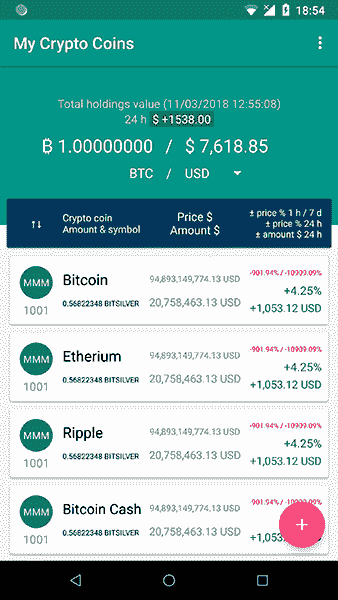

Main screen

### 列表视图

在这个项目中，我们将在屏幕上使用 ListView，您可以在其中添加您已经持有的加密硬币。由于它的缺点，近年来几乎不再使用了。

所以，我想现在你们中的很多人都在想，为什么我决定在我的加密硬币应用程序中使用它，而我们可以用 RecyclerView 轻松地创建相同的功能。

但是，请记住，这个项目首先是为了培训目的而创建的。我认为深入了解 ListView 及其工作原理是有益的。任何开发人员都可能在遗留代码中遇到 ListView，最好知道如何使用它。此外，我们将创建的列表非常简单，ListView 的技术限制不会给我们带来任何问题。

让我们遵循实现 ListView 所需的非常相似的步骤:

#### 1.添加 ListView 组件。

首先要做的是给`AddSearchActivity`添加一个 ListView。打开活动布局文件`activity_add_search.xml`，你会看到里面有`content_add_search.xml`。我们将在那里添加 ListView 组件。

```
...
<ListView
    android:id="@+id/listview_activity_add_search"
    android:layout_width="match_parent"
    android:layout_height="wrap_content"
    android:scrollbars="vertical" />
...
```

#### 2.创建 ListView 行布局。

和以前一样，只是出于初始目的，我们将只为每一行设置项目名称。下面是简化的布局:

```
<android.support.constraint.ConstraintLayout xmlns:android="http://schemas.android.com/apk/res/android"
    xmlns:app="http://schemas.android.com/apk/res-auto"
    xmlns:tools="http://schemas.android.com/tools"
    android:layout_width="match_parent"
    android:layout_height="match_parent"
    android:padding="@dimen/add_search_list_item_inner_margin">
    ...
    <android.support.v7.widget.AppCompatTextView
        android:id="@+id/item_name"
        style="@style/AddSearchListItemPrimeText"
        android:layout_marginEnd="@dimen/add_search_list_item_text_between_margin_2x"
        android:layout_marginStart="@dimen/add_search_list_item_text_between_margin"
        app:layout_constraintBottom_toBottomOf="parent"
        app:layout_constraintEnd_toStartOf="@+id/item_symbol"
        app:layout_constraintStart_toEndOf="@+id/item_image_icon"
        app:layout_constraintTop_toTopOf="parent"
        tools:text="@string/sample_text_item_name" />
    ...
</android.support.constraint.ConstraintLayout>
```

#### 3.创建数据适配器类。

像 RecyclerView 一样，我们的 ListView 适配器现在将只接受字符串数据来获取项目名称并将其显示在屏幕上。稍后我们将使用一个单独的类数据模型。对于这一部分，我们想要构建一个非常简单的列表，只显示加密货币标题。我们可以使用默认的 ArrayAdapter，而不是创建自定义适配器。

```
class AddSearchListAdapter(context: Context, private val dataSource: ArrayList<String>) : BaseAdapter() {

    private val inflater: LayoutInflater = context.getSystemService(Context.LAYOUT_INFLATER_SERVICE) as LayoutInflater

    override fun getView(position: Int, convertView: View?, parent: ViewGroup?): View {
        val view: View
        val holder: CustomViewHolder

        if (convertView == null) {

            view = inflater.inflate(R.layout.activity_add_search_list_item, parent, false)

            holder = CustomViewHolder()
            holder.nameTextView = view.findViewById(R.id.item_name)

            view.tag = holder

        } else {

            view = convertView
            holder = convertView.tag as CustomViewHolder
        }

        val nameTextView = holder.nameTextView

        nameTextView.text = getItem(position) as String

        return view
    }

    override fun getItem(position: Int): Any {
        return dataSource[position]
    }

    override fun getItemId(position: Int): Long {
        return position.toLong();
    }

    override fun getCount(): Int {
        return dataSource.size
    }

    inner class CustomViewHolder {
        lateinit var nameTextView: AppCompatTextView
    }

}
```

正如你在适配器代码中看到的，通过创建`CustomViewHolder`对象，我使用了视图持有者模式。它存储列表行视图引用。调用`findViewById()`方法只发生几次。它可以让我们的列表滚动更加流畅和高效。

ListView 不要求我们使用 ViewHolder 模式。RecyclerView 的适配器默认为我们提供了这种保护，因为它迫使我们使用它。

#### 4.将 ListView 连接到自定义适配器。

使用默认的 ArrayAdapter，它可能看起来像`val adapter = ArrayAdapter(this, android.R.layout.simple_list_item_1, data)`。这就是 ListView 组件的美妙之处。如果您愿意，您可以非常快速地创建一个简单的列表，而无需构建自己的适配器或行布局(跳过步骤 2 和 3)。

```
class AddSearchActivity : AppCompatActivity() {

    private lateinit var listView: ListView

    override fun onCreate(savedInstanceState: Bundle?) {
        super.onCreate(savedInstanceState)
        setContentView(R.layout.activity_add_search)
        setSupportActionBar(toolbar2)
        supportActionBar?.setDisplayHomeAsUpEnabled(true)

        val data = ArrayList<String>()
        data.add("Bitcoin")
        data.add("Etherium")
        data.add("Ripple")
        data.add("Bitcoin Cash")
        data.add("Litecoin")
        data.add("NEO")
        data.add("Stellar")
        data.add("EOS")
        data.add("Cardano")
        data.add("Stellar")
        data.add("IOTA")
        data.add("Dash")
        data.add("Monero")
        data.add("TRON")
        data.add("NEM")
        data.add("ICON")
        data.add("Bitcoin Gold")
        data.add("Zcash")
        data.add("Verge")

        val adapter = AddSearchListAdapter(this, data)

        listView = findViewById(R.id.listview_activity_add_search)
        listView.adapter = adapter

    }
    ...
}
```

ListView 安装程序已准备就绪！

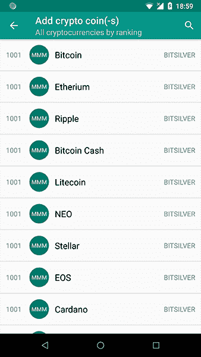

Add crypto coin(-s) screen

### 搜索视图

在列出所有加密货币的同一个屏幕中，我们还需要添加 SearchView。对于任何想要通过键入名称来找到特定加密货币的用户来说，搜索将是一项有用的功能。对于这一部分，我们不会建立完整的功能，而只是实现其视觉部分。按照以下步骤将 SearchView 添加到项目中:

#### 1.用 XML 声明可搜索的配置。

可搜索的配置文件应该添加到名为 xml 的 res 目录中。在这里，您可以为 SearchView 组件指定属性，这些属性定义了组件的行为方式。

```
<searchable
    xmlns:android="http://schemas.android.com/apk/res/android"
    android:label="@string/app_name"
    android:hint="@string/search_hint">
</searchable>
```

#### 2.创建将成为我们可搜索活动的新活动。

我们将创建扩展`AppCompatActivity()`的新空白活动。我们将其命名为`AddSearchActivity`。

#### 3.指定 Android 清单文件中新创建的活动可搜索。

```
<manifest xmlns:android="http://schemas.android.com/apk/res/android"
    package="com.baruckis.mycryptocoins">

    <application
        android:allowBackup="true"
        android:icon="@mipmap/ic_launcher"
        android:label="@string/app_name"
        android:roundIcon="@mipmap/ic_launcher_round"
        android:supportsRtl="true"
        android:theme="@style/AppTheme">
        ...
        <activity
            android:name=".AddSearchList.AddSearchActivity"
            android:launchMode="singleTop"
            android:parentActivityName=".MainList.MainActivity"
            android:theme="@style/AppTheme.NoActionBar">
            <intent-filter>
                <action android:name="android.intent.action.SEARCH" />
            </intent-filter>
            <meta-data
                android:name="android.app.searchable"
                android:resource="@xml/searchable" />
        </activity>
        ...
    </application>

</manifest>
```

我们将让 Android 系统处理搜索过程。这就是为什么我们在`AddSearchActivity`的 activity 元素中添加了意图动作搜索和元数据。元数据的名称和资源链接到位于 res/xml 文件夹中的可搜索配置文件。

#### 4.创建搜索菜单。

在 res/menu 文件夹中，我们将创建一个菜单资源文件。

```
<menu xmlns:android="http://schemas.android.com/apk/res/android"
    xmlns:app="http://schemas.android.com/apk/res-auto">
    <item
        android:id="@+id/search"
        android:icon="@drawable/ic_search"
        android:title="@string/action_search"
        app:actionViewClass="android.support.v7.widget.SearchView"
        app:showAsAction="ifRoom|collapseActionView" />
</menu>
```

#### 5.向活动添加搜索菜单。

我们将添加 Android 搜索小部件作为菜单操作视图。

```
class AddSearchActivity : AppCompatActivity() {
    ...
    override fun onCreateOptionsMenu(menu: Menu?): Boolean {

        menuInflater.inflate(R.menu.menu_search, menu)

        val searchManager = getSystemService(Context.SEARCH_SERVICE) as SearchManager
        val searchView = menu?.findItem(R.id.search)?.actionView as SearchView
        searchView.setSearchableInfo(searchManager.getSearchableInfo(componentName))
        searchView.maxWidth = Integer.MAX_VALUE

        return true
    }
}
```

现在，SearchView 被添加到活动中。搜索功能仍然不起作用。但是我们已经按照我们对这一部分的要求实现了它。

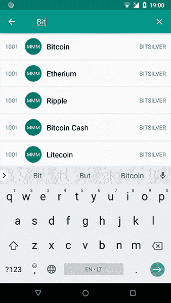

Add crypto coin(-s) screen — search functionality

### 设置

如果你想创建一个现代的 Android 应用程序，我建议你包括一个设置屏幕，并为用户提供应用程序设置的访问权限。在你的应用程序中包含设置可以让你的用户控制你的应用程序的一些功能，这让他们更开心。他们现在可以控制应用程序的行为。因此，我们也将为我的加密硬币应用程序创建一个设置屏幕。

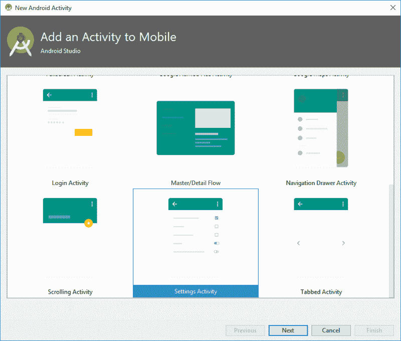

New Settings Activity from gallery template

你可以用 Android Studio 模板创建一个设置屏幕，它会生成你需要的所有代码。默认情况下，在写这篇博文时，设置活动是用首选项标题生成的。这不是我们想要的这样一个小应用程序，我们计划一开始只有很少的设置。

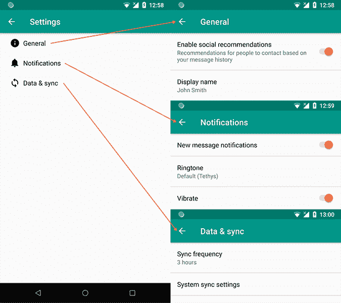

Default settings template with preference headers

因此，我们将手动构建一切。设置屏幕采用类似 XML 的布局设计。让我们一步一步地为这篇博文创建视觉部分:

#### 1.创建首选项屏幕 XML 文件。

我们将创建首选项屏幕 XML 文件，该文件应该放在 res/xml 目录中。

```
<PreferenceScreen xmlns:android="http://schemas.android.com/apk/res/android"
    xmlns:tools="http://schemas.android.com/tools">
    <PreferenceCategory android:title="@string/pref_general_category_title">
        <ListPreference
            android:defaultValue="@string/pref_default_language_value"
            android:entries="@array/pref_language_list_entries"
            android:entryValues="@array/pref_language_list_values"
            android:icon="@drawable/ic_translate"
            android:key="language_list"
            android:summary="@string/pref_default_language_entry"
            android:title="@string/pref_language_title"
            tools:summary="@string/pref_default_language_entry" />

        <ListPreference
            android:defaultValue="@string/pref_default_fiat_currency_value"
            android:entries="@array/pref_fiat_currency_list_entries"
            android:entryValues="@array/pref_fiat_currency_list_values"
            android:icon="@drawable/ic_cash"
            android:key="fiat_currency_list"
            android:summary="@string/pref_default_fiat_currency_entry"
            android:title="@string/pref_fiat_currency_title"
            tools:summary="@string/pref_default_fiat_currency_entry" />

        <ListPreference
            android:defaultValue="@string/pref_default_date_format_value"
            android:entries="@array/pref_date_format_list_entries"
            android:entryValues="@array/pref_date_format_list_values"
            android:icon="@drawable/ic_date_range"
            android:key="date_format_list"
            android:summary="@string/pref_default_date_format_entry"
            android:title="@string/pref_date_format_title"
            tools:summary="@string/pref_default_date_format_entry" />

        <SwitchPreference
            android:defaultValue="true"
            android:icon="@drawable/ic_calendar_clock"
            android:key="24h_switch"
            android:summary="@string/pref_24h_switch_summary"
            android:title="@string/pref_24h_switch_title" />

    </PreferenceCategory>

    <PreferenceCategory android:title="@string/pref_support_category_title">

        <Preference
            android:icon="@drawable/ic_star"
            android:title="@string/pref_rate_app_title" />

        <Preference
            android:icon="@drawable/ic_share"
            android:title="@string/pref_share_app_title" />

        <Preference
            android:icon="@drawable/ic_attach_money"
            android:summary="@string/pref_donate_view_summary"
            android:title="@string/pref_donate_view_title" />

        <Preference
            android:icon="@drawable/ic_currency_btc"
            android:summary="@string/pref_donate_crypto_summary"
            android:title="@string/pref_donate_crypto_title" />

    </PreferenceCategory>

    <PreferenceCategory android:title="@string/pref_support_about_title">

        <Preference
            android:icon="@drawable/ic_web"
            android:summary="@string/pref_website_summary"
            android:title="@string/pref_website_title" />

        <Preference
            android:icon="@drawable/ic_human_greeting"
            android:summary="@string/pref_author_summary"
            android:title="@string/pref_author_title" />

        <Preference
            android:icon="@drawable/ic_github_circle"
            android:summary="@string/pref_source_summary"
            android:title="@string/pref_source_title" />

        <Preference
            android:icon="@drawable/ic_file_multiple"
            android:title="@string/pref_open_source_title" />

        <Preference
            android:icon="@drawable/ic_copyright"
            android:summary="@string/pref_license_summary"
            android:title="@string/pref_license_title" />

        <Preference
            android:icon="@drawable/ic_info_outline"
            android:summary="@string/pref_app_summary"
            android:title="@string/pref_app_title" />

    </PreferenceCategory>

</PreferenceScreen>
```

#### 2.创建首选项片段。

然后我们应该创建一个简单的空白片段— `SettingsFragment`，它应该扩展`PreferenceFragment()`。这个片段将从我们创建的 XML 资源中创建首选项。将来，这个片段将包含扩展 XML 设置所需的所有方法。当设置改变时，它还会提供回调。

```
class SettingsFragment : PreferenceFragment() {

    override fun onCreate(savedInstanceState: Bundle?) {
        super.onCreate(savedInstanceState)

        addPreferencesFromResource(R.xml.pref_main);
    }
}
```

#### 3.创建首选项活动。

准备好设置片段后，让我们创建新的活动— `AppCompatPreferenceActivity`，它扩展了`PreferenceActivity()`。该类提供了跨所有设备和版本的兼容性。

```
abstract class AppCompatPreferenceActivity : PreferenceActivity() {

    override fun onCreate(savedInstanceState: Bundle?) {
        delegate.installViewFactory()
        delegate.onCreate(savedInstanceState)
        super.onCreate(savedInstanceState)
    }

    override fun onPostCreate(savedInstanceState: Bundle?) {
        super.onPostCreate(savedInstanceState)
        delegate.onPostCreate(savedInstanceState)
    }

    val supportActionBar: ActionBar?
        get() = delegate.supportActionBar

    fun setSupportActionBar(toolbar: Toolbar?) {
        delegate.setSupportActionBar(toolbar)
    }

    override fun getMenuInflater(): MenuInflater {
        return delegate.menuInflater
    }

    override fun setContentView(@LayoutRes layoutResID: Int) {
        delegate.setContentView(layoutResID)
    }

    override fun setContentView(view: View) {
        delegate.setContentView(view)
    }

    override fun setContentView(view: View, params: ViewGroup.LayoutParams) {
        delegate.setContentView(view, params)
    }

    override fun addContentView(view: View, params: ViewGroup.LayoutParams) {
        delegate.addContentView(view, params)
    }

    override fun onPostResume() {
        super.onPostResume()
        delegate.onPostResume()
    }

    override fun onTitleChanged(title: CharSequence, color: Int) {
        super.onTitleChanged(title, color)
        delegate.setTitle(title)
    }

    override fun onConfigurationChanged(newConfig: Configuration) {
        super.onConfigurationChanged(newConfig)
        delegate.onConfigurationChanged(newConfig)
    }

    override fun onStop() {
        super.onStop()
        delegate.onStop()
    }

    override fun onDestroy() {
        super.onDestroy()
        delegate.onDestroy()
    }

    override fun invalidateOptionsMenu() {
        delegate.invalidateOptionsMenu()
    }

    private val delegate: AppCompatDelegate by lazy {
        AppCompatDelegate.create(this, null)
    }
}
```

#### 4.创建设置活动。

```
class SettingsActivity : AppCompatPreferenceActivity() {

    override fun onCreate(savedInstanceState: Bundle?) {
        super.onCreate(savedInstanceState)
        setupActionBar()

        fragmentManager.beginTransaction().replace(android.R.id.content, SettingsFragment()).commit()
    }

    private fun setupActionBar() {
        supportActionBar?.setDisplayHomeAsUpEnabled(true)
    }

    override fun onMenuItemSelected(featureId: Int, item: MenuItem): Boolean {
        val id = item.itemId
        if (id == android.R.id.home) {
            if (!super.onMenuItemSelected(featureId, item)) {
                NavUtils.navigateUpFromSameTask(this)
            }
            return true
        }
        return super.onMenuItemSelected(featureId, item)
    }
}
```

#### 5.将设置项目添加到主菜单。

```
<menu xmlns:android="http://schemas.android.com/apk/res/android"
    xmlns:app="http://schemas.android.com/apk/res-auto"
    xmlns:tools="http://schemas.android.com/tools"
    tools:context="com.baruckis.mycryptocoins.MainList.MainActivity">
    <item
        android:id="@+id/action_settings"
        android:orderInCategory="100"
        android:title="@string/action_settings"
        app:showAsAction="never" />
</menu>
```

#### 6.从溢出菜单中选择设置时，启动新创建的设置活动。

```
class MainActivity : AppCompatActivity() {
    ...
    override fun onCreateOptionsMenu(menu: Menu): Boolean {
        // Inflate the menu; this adds items to the action bar if it is present.
        menuInflater.inflate(R.menu.menu_main, menu)
        return true
    }

    override fun onOptionsItemSelected(item: MenuItem): Boolean {
        return when (item.itemId) {
            R.id.action_settings -> {
                startActivity(Intent(this@MainActivity, SettingsActivity::class.java));
                return true
            }
            else -> super.onOptionsItemSelected(item)
        }
    }
}
```

#### 7.在 Android 清单文件中指定新创建的设置活动。

```
<manifest xmlns:android="http://schemas.android.com/apk/res/android"
    package="com.baruckis.mycryptocoins">

    <application
        android:allowBackup="true"
        android:icon="@mipmap/ic_launcher"
        android:label="@string/app_name"
        android:roundIcon="@mipmap/ic_launcher_round"
        android:supportsRtl="true"
        android:theme="@style/AppTheme">
        ...
        <activity
            android:name=".Settings.SettingsActivity"
            android:label="@string/title_activity_settings"
            android:parentActivityName=".MainList.MainActivity">
            <meta-data
                android:name="android.support.PARENT_ACTIVITY"
                android:value="com.baruckis.mycryptocoins.MainList.MainActivity" />
        </activity>
    </application>

</manifest>
```

恭喜你，你终于可以从工具栏的菜单项启动设置了。

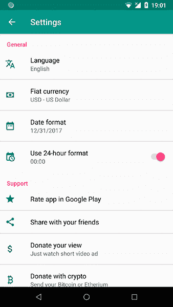

Settings screen

### 使用第三方库 Gmail 风格翻转圆形按钮-查看

好吧，关于使用第三方库有各种各样的观点——由开发平台的原始供应商之外的开发人员创建的代码。一些人避免使用它们，因为永远不清楚它们将被支持多久以及有多好。同时，其他人使用它们，因为它们可以加速开发过程。

您使用它们的决定应该取决于您的具体情况。您应该自己调查一下这个库，并确定它是否足够灵活，能够满足您的所有需求。

对于我的加密硬币应用程序，有一种情况，我想创建一个圆形图像视图。此图像应在圆形中显示特定的加密货币图标。但是如果图标不存在，那么我想展示加密货币代码的前三个字母。

除此之外，我希望能够通过点击它们来选择图像。选择应该呈现为一个简短的翻转视图动画。

我描述的所有这些 UX 并不是我发明的。你可以在 Gmail 应用程序上找到类似的行为，它看起来真的很好。


Gmail app flip circle view animation

但是我们如何创造它呢？事实上，圆形图像视图甚至不是你可以在 Android Studio 组件面板中找到的默认组件。

你可以努力尝试自己创造一切，但这可能会浪费时间和精力。相反，您可以选择实现许多专门为此创建的开源库中的一个。

为了满足我的 UI/UX 需求，我在 GitHub 上找到了一个库。经过一番调查后，我认为它确实是专业制作的。它很容易实现，并且支持时间足够长，可以尝试一下。因此，要开始使用它，我们将遵循这些简单的步骤:

#### 1.添加依赖关系。

将库导入到项目中。

```
dependencies {
  implementation 'eu.davidea:flipview:1.1.3'
}
```

#### 2.使用它。

使用 Android 的常用和自定义应用程序属性配置 FlipView。那不是很容易吗？

```
<android.support.v7.widget.CardView xmlns:android="http://schemas.android.com/apk/res/android"
    xmlns:app="http://schemas.android.com/apk/res-auto"
    ...
        <eu.davidea.flipview.FlipView
            android:id="@+id/item_image_icon"
            style="@style/FlipView"
            android:clickable="true"
            android:focusable="true"
            app:layout_constraintBottom_toTopOf="@+id/item_ranking"
            app:layout_constraintStart_toStartOf="parent"
            app:layout_constraintTop_toTopOf="parent" />
    ...
</android.support.v7.widget.CardView>
```

所以不要多此一举。总是考虑先使用一些库来更快地交付结果。如果你的项目变得混乱，不能怪旧的库，而是你的代码结构有多好。如果你的项目足够模块化，就不会有问题。但是那是一个单独的话题，我将在以后的博客文章中谈论项目架构。


Flip View used inside main screen list

### RTL 支持的本地化

当我决定创建这个应用程序时，我给自己设定了一个目标，不仅要创建一个默认的英语用户界面，还要从开发开始就将它翻译成我的母语立陶宛语。

这个目标引导我学习 Android 中本地化。我发现增加对多种语言的支持非常容易。正如我之前提到的，首先您需要将所有的字符串分离到 strings.xml 文件中。然后，您可以在 Android Studio 中启动翻译编辑器工具。这将允许您添加新的语言支持。

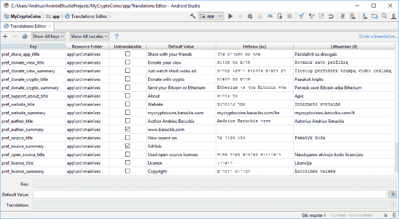

你会看到界面非常直观。现在您需要将 strings.xml 文件中的每个字符串翻译成一种新的语言。IDE 将在单独的目录中生成一个新文件。比如立陶宛语，就是`values-lt/strings.xml`。就是这样！？

如果您将 Android 设备系统语言切换到您刚刚翻译的语言，然后运行您的应用程序，所有 UI 将自动更新为您的翻译。此外，对于我的加密硬币应用程序，稍后我计划添加在运行时切换语言的能力。这就是为什么你会注意到设置屏幕内的语言切换器。

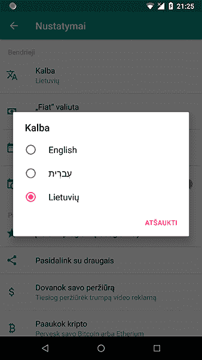

Settings screen — language Lithuanian

将你的应用翻译成不同的语言一定会扩大你的受众。为什么不更进一步，增加对一些从右向左书写的特殊语言(RTL)的支持，比如阿拉伯语、希伯来语或波斯语。

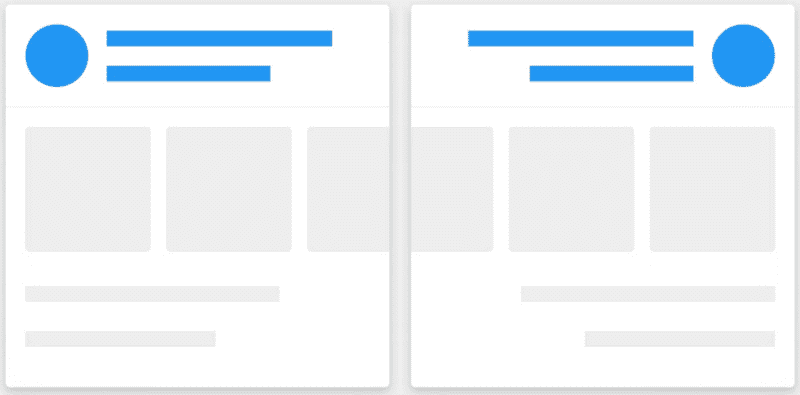

其实要加上 RTL 的支持一点也不难。只需将支持属性添加到您的清单文件中:

```
<manifest xmlns:android="http://schemas.android.com/apk/res/android"
    package="com.baruckis.mycryptocoins">

    <application
        android:allowBackup="true"
        android:icon="@mipmap/ic_launcher"
        android:label="@string/app_name"
        android:roundIcon="@mipmap/ic_launcher_round"
        android:supportsRtl="true"
        android:theme="@style/AppTheme">
        ...
    </application>

</manifest>
```

恭喜你，你的应用程序现在支持 RTL。然而，你不能盲目地相信一切都会马上正常工作。你应该亲自检查一下它的支撑情况。为此，请选择一种 RTL 语言作为您的主要设备语言。

给 RTL 的一些建议:

*   在你的所有布局中，你需要用`Start`和`End`替换所有的`Left`和`Right`布局属性。例如`android:paddingLeft`应该换成`android:paddingStart`。
*   如果你对 RTL 没有特别的可画性，也许你想用一个特别的`autoMirrored`属性来镜像你当前的可画性。

```
<vector xmlns:android="http://schemas.android.com/apk/res/android"
    android:width="24dp"
    android:height="24dp"
    android:autoMirrored="true"
    android:tint="@color/colorForPreferenceIcon"
    android:viewportHeight="24.0"
    android:viewportWidth="24.0">
    <path
        android:fillColor="#FF000000"
        android:pathData="M1.5,4V5.5C1.5,9.65 3.71,13.28 7,15.3V20H22V18C22,15.34 16.67,14 14,14C14,14 13.83,14 13.75,14C9,14 5,10 5,5.5V4M14,4A4,4 0 0,0 10,8A4,4 0 0,0 14,12A4,4 0 0,0 18,8A4,4 0 0,0 14,4Z" />
</vector>
```

*   如果在某些地方你需要 LTR 而不是 RTL，你也可以这样做。例如，要将任何布局强制到 LTR，只需将`android:layoutDirection="ltr"`添加到视图中。如果您需要在文本视图中强制文本方向，请使用`android:textDirection="ltr"`。

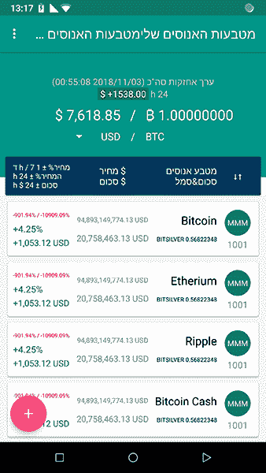

顺便说一下，在使用翻译编辑器时，有一个非常有用的功能可以订购专业的翻译服务。即使我个人对希伯来语一无所知，我仍然为自己设定了一个目标，为我的 Crypto Coins 项目添加对它的支持，作为 RTL 语言的一个例子。所以这个功能看起来是一个很好的尝试。只需点击几下鼠标，我就可以直接从 IDE 中成功地将英语翻译成希伯来语。


Order a translation service

### 最后的想法

在本系列的第二部分中，我们用一些基于详细模型的初始代码创建了所有的 UI 布局。我不想在每个话题上讲太多细节，以免让你困惑。我的目标是告诉你如何看到一个更大的画面，如何先关注小细节，然后避免代价高昂的错误。

如果你发现有些东西没有被很好地覆盖，把它作为你自己研究的起点。网络上总是有很多好的资源可供学习。？

### 贮藏室ˌ仓库

您可以在这里找到为此部分创建的所有 XML 布局和代码:

#### [在 GitHub 上查看源代码](https://github.com/baruckis/Kriptofolio/tree/Part-2)

* * *

***aěIū！感谢阅读！我最初于 2018 年 5 月 14 日为我的个人博客 www.baruckis.com[发表了这篇文章。](https://www.baruckis.com/android/kriptofolio-app-series-part-2/)***