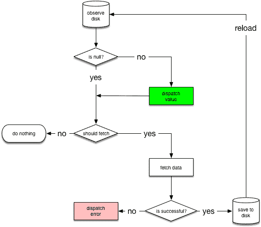

# 如何使用 reform、OkHttp、Gson、Glide 和 Coroutines 处理 RESTful web 服务

> 原文：<https://www.freecodecamp.org/news/kriptofolio-app-series-part-5/>

#### Kriptofolio app series — Part 5

如今，几乎每个 Android 应用程序都连接到互联网来获取/发送数据。你肯定应该学习如何处理 RESTful Web 服务，因为它们的正确实现是创建现代应用程序的核心知识。

这部分会很复杂。我们将一次组合多个库来获得一个工作结果。我不打算谈论处理互联网请求的原生 Android 方式，因为在现实世界中没有人使用它。每一个好的应用程序都不会试图重新发明轮子，而是使用最流行的第三方库来解决常见问题。重建这些制作精良的库必须提供的功能太复杂了。

### 系列内容

*   [简介:2018–2019 年打造现代 Android 应用的路线图](https://www.freecodecamp.org/news/kriptofolio-app-series)
*   [第一部分:固体原理介绍](https://www.freecodecamp.org/news/kriptofolio-app-series-part-1)
*   第 2 部分:如何开始构建你的 Android 应用:创建模型、UI 和 XML 布局
*   第 3 部分:关于架构的一切:探索不同的架构模式以及如何在你的应用中使用它们
*   [第四部分:如何用 Dagger 2](https://www.freecodecamp.org/news/kriptofolio-app-series-part-4) 在你的应用中实现依赖注入
*   第 5 部分:使用 reform、OkHttp、Gson、Glide 和 Coroutines(你在这里)处理 RESTful Web 服务

### 什么是改装，OkHttp 和 Gson？

翻新是一个用于 Java 和 Android 的 REST 客户端。在我看来，这个库是最重要的，因为它将完成主要的工作。它使得通过基于 REST 的 web 服务检索和上传 JSON(或其他结构化数据)变得相对容易。

在改型中，您可以配置哪个转换器用于数据序列化。通常，要在 JSON 中序列化和反序列化对象，需要使用一个开源的 Java 库——Gson。此外，如果需要，您可以添加定制的转换器来处理 XML 或其他协议。

为了使 HTTP 请求翻新使用 OkHttp 库。OkHttp 是一个纯 HTTP/SPDY 客户端，负责任何底层网络操作、缓存、请求和响应操作。相比之下，翻新是构建在 OkHttp 之上的高级 REST 抽象。改型与 OkHttp 强耦合，并大量使用它。

现在你知道了所有的东西都是紧密相关的，我们将同时使用这三个库。我们的第一个目标是从互联网上获得所有加密货币列表。在调用服务器时，我们将使用一个特殊的 OkHttp 拦截器类进行 CoinMarketCap API 认证。我们将获得一个 JSON 数据结果，然后使用 Gson 库转换它。

### 改装 2 的快速设置只是为了先试一试

当我学习新东西时，我喜欢尽快在实践中尝试。我们将在改型 2 中应用类似的方法，让您更快更好地理解它。现在不要担心代码质量或任何编程原则或优化——我们将只编写一些代码来使 Retrofit 2 在我们的项目中工作，并讨论它的作用。

按照以下步骤在我的加密硬币应用程序项目上设置翻新 2:

#### **首先，为应用程序授予互联网权限**

我们将在可通过互联网访问的服务器上执行 HTTP 请求。通过将这些行添加到您的清单文件来授予此权限:

```
<manifest xmlns:android="http://schemas.android.com/apk/res/android"
    package="com.baruckis.mycryptocoins">

    <uses-permission android:name="android.permission.INTERNET" />
    ...
</manifest>
```

#### 然后你应该添加库依赖关系

找到最新的[改装版本](https://square.github.io/retrofit/)。此外，您应该知道，翻新不附带集成的 JSON 转换器。因为我们将获得 JSON 格式的响应，所以我们也需要在依赖项中手动包含转换器。我们将使用最新的谷歌 JSON 转换器 [Gson 版本](https://github.com/google/gson)。让我们将这几行添加到您的 gradle 文件中:

```
// 3rd party
// HTTP client - Retrofit with OkHttp
implementation "com.squareup.retrofit2:retrofit:$versions.retrofit"
// JSON converter Gson for JSON to Java object mapping
implementation "com.squareup.retrofit2:converter-gson:$versions.retrofit"
```

正如您从我的评论中注意到的，OkHttp 依赖项已经与 Retrofit 2 依赖项一起发布了。为了方便起见，Versions 只是一个单独的 gradle 文件:

```
def versions = [:]

versions.retrofit = "2.4.0"

ext.versions = versions
```

#### **接下来设置改装界面**

这是一个声明我们的请求及其类型的接口。这里我们定义客户端的 API。

```
/**
 * REST API access points.
 */
interface ApiService {

    // The @GET annotation tells retrofit that this request is a get type request.
    // The string value tells retrofit that the path of this request is
    // baseUrl + v1/cryptocurrency/listings/latest + query parameter.
    @GET("v1/cryptocurrency/listings/latest")
    // Annotation @Query is used to define query parameter for request. Finally the request url will
    // look like that https://sandbox-api.coinmarketcap.com/v1/cryptocurrency/listings/latest?convert=EUR.
    fun getAllCryptocurrencies(@Query("convert") currency: String): Call<CryptocurrenciesLatest>
    // The return type for this function is Call with its type CryptocurrenciesLatest.
}
```

#### **并设置数据类别**

数据类是 POJOs(普通的旧 Java 对象),代表我们将要进行的 API 调用的响应。

```
/**
 * Data class to handle the response from the server.
 */
data class CryptocurrenciesLatest(
        val status: Status,
        val data: List<Data>
) {

    data class Data(
            val id: Int,
            val name: String,
            val symbol: String,
            val slug: String,
            // The annotation to a model property lets you pass the serialized and deserialized
            // name as a string. This is useful if you don't want your model class and the JSON
            // to have identical naming.
            @SerializedName("circulating_supply")
            val circulatingSupply: Double,
            @SerializedName("total_supply")
            val totalSupply: Double,
            @SerializedName("max_supply")
            val maxSupply: Double,
            @SerializedName("date_added")
            val dateAdded: String,
            @SerializedName("num_market_pairs")
            val numMarketPairs: Int,
            @SerializedName("cmc_rank")
            val cmcRank: Int,
            @SerializedName("last_updated")
            val lastUpdated: String,
            val quote: Quote
    ) {

        data class Quote(
                // For additional option during deserialization you can specify value or alternative
                // values. Gson will check the JSON for all names we specify and try to find one to
                // map it to the annotated property.
                @SerializedName(value = "USD", alternate = ["AUD", "BRL", "CAD", "CHF", "CLP",
                    "CNY", "CZK", "DKK", "EUR", "GBP", "HKD", "HUF", "IDR", "ILS", "INR", "JPY",
                    "KRW", "MXN", "MYR", "NOK", "NZD", "PHP", "PKR", "PLN", "RUB", "SEK", "SGD",
                    "THB", "TRY", "TWD", "ZAR"])
                val currency: Currency
        ) {

            data class Currency(
                    val price: Double,
                    @SerializedName("volume_24h")
                    val volume24h: Double,
                    @SerializedName("percent_change_1h")
                    val percentChange1h: Double,
                    @SerializedName("percent_change_24h")
                    val percentChange24h: Double,
                    @SerializedName("percent_change_7d")
                    val percentChange7d: Double,
                    @SerializedName("market_cap")
                    val marketCap: Double,
                    @SerializedName("last_updated")
                    val lastUpdated: String
            )
        }
    }

    data class Status(
            val timestamp: String,
            @SerializedName("error_code")
            val errorCode: Int,
            @SerializedName("error_message")
            val errorMessage: String,
            val elapsed: Int,
            @SerializedName("credit_count")
            val creditCount: Int
    )
}
```

#### **创建一个特殊的拦截器类，用于在调用服务器时进行身份验证**

对于任何需要身份验证才能获得成功响应的 API 来说，情况都是如此。拦截器是定制请求的一种强有力的方式。我们将截取实际的请求并添加单独的请求头，这将使用由[coin market cap Professional API 开发人员门户](https://pro.coinmarketcap.com)提供的 API 键来验证调用。要得到你的，你需要在那里登记。

```
/**
 * Interceptor used to intercept the actual request and
 * to supply your API Key in REST API calls via a custom header.
 */
class AuthenticationInterceptor : Interceptor {

    override fun intercept(chain: Interceptor.Chain): Response {

        val newRequest = chain.request().newBuilder()
                // TODO: Use your API Key provided by CoinMarketCap Professional API Developer Portal.
                .addHeader("X-CMC_PRO_API_KEY", "CMC_PRO_API_KEY")
                .build()

        return chain.proceed(newRequest)
    }
}
```

#### **最后，将此代码添加到我们的活动中，查看改造工作**

我想尽快弄脏你的手，所以我把所有东西都放在一个地方。这不是正确的方法，但这是最快的方法，因为这样可以快速看到视觉效果。

```
class AddSearchActivity : AppCompatActivity(), Injectable {

    private lateinit var listView: ListView
    private lateinit var listAdapter: AddSearchListAdapter

    ...

    override fun onCreate(savedInstanceState: Bundle?) {
        super.onCreate(savedInstanceState)

        ...

        // Later we will setup Retrofit correctly, but for now we do all in one place just for quick start.
        setupRetrofitTemporarily()
    }

    ...

    private fun setupRetrofitTemporarily() {

        // We need to prepare a custom OkHttp client because need to use our custom call interceptor.
        // to be able to authenticate our requests.
        val builder = OkHttpClient.Builder()
        // We add the interceptor to OkHttpClient.
        // It will add authentication headers to every call we make.
        builder.interceptors().add(AuthenticationInterceptor())
        val client = builder.build()

        val api = Retrofit.Builder() // Create retrofit builder.
                .baseUrl("https://sandbox-api.coinmarketcap.com/") // Base url for the api has to end with a slash.
                .addConverterFactory(GsonConverterFactory.create()) // Use GSON converter for JSON to POJO object mapping.
                .client(client) // Here we set the custom OkHttp client we just created.
                .build().create(ApiService::class.java) // We create an API using the interface we defined.

        val adapterData: MutableList<Cryptocurrency> = ArrayList<Cryptocurrency>()

        val currentFiatCurrencyCode = "EUR"

        // Let's make asynchronous network request to get all latest cryptocurrencies from the server.
        // For query parameter we pass "EUR" as we want to get prices in euros.
        val call = api.getAllCryptocurrencies("EUR")
        val result = call.enqueue(object : Callback<CryptocurrenciesLatest> {

            // You will always get a response even if something wrong went from the server.
            override fun onFailure(call: Call<CryptocurrenciesLatest>, t: Throwable) {

                Snackbar.make(findViewById(android.R.id.content),
                        // Throwable will let us find the error if the call failed.
                        "Call failed! " + t.localizedMessage,
                        Snackbar.LENGTH_INDEFINITE).show()
            }

            override fun onResponse(call: Call<CryptocurrenciesLatest>, response: Response<CryptocurrenciesLatest>) {

                // Check if the response is successful, which means the request was successfully
                // received, understood, accepted and returned code in range [200..300).
                if (response.isSuccessful) {

                    // If everything is OK, let the user know that.
                    Toast.makeText(this@AddSearchActivity, "Call OK.", Toast.LENGTH_LONG).show();

                    // Than quickly map server response data to the ListView adapter.
                    val cryptocurrenciesLatest: CryptocurrenciesLatest? = response.body()
                    cryptocurrenciesLatest!!.data.forEach {
                        val cryptocurrency = Cryptocurrency(it.name, it.cmcRank.toShort(),
                                0.0, it.symbol, currentFiatCurrencyCode, it.quote.currency.price,
                                0.0, it.quote.currency.percentChange1h,
                                it.quote.currency.percentChange7d, it.quote.currency.percentChange24h,
                                0.0)
                        adapterData.add(cryptocurrency)
                    }

                    listView.visibility = View.VISIBLE
                    listAdapter.setData(adapterData)

                }
                // Else if the response is unsuccessful it will be defined by some special HTTP
                // error code, which we can show for the user.
                else Snackbar.make(findViewById(android.R.id.content),
                        "Call error with HTTP status code " + response.code() + "!",
                        Snackbar.LENGTH_INDEFINITE).show()

            }

        })

    }

   ...
}
```

你可以在这里探索代码[。请记住，这只是一个初始的简化实现版本，以便您更好地理解这个想法。](https://github.com/baruckis/Kriptofolio/tree/4d7946705b8c4dc2db3775bcc000d2918f8f1b73)

### 带 OkHttp 3 和 Gson 的改装 2 的最终正确设置

好了，在一个快速的实验之后，是时候把这个改进实现带到下一个层次了。我们已经成功地获得了数据，但并不正确。我们错过了加载、错误和成功等状态。我们的代码是混合的，没有分离关注点。将所有代码都写在一个活动或一个片段中是一个常见的错误。我们的 activity 类是基于 UI 的，应该只包含处理 UI 和操作系统交互的逻辑。

实际上，在这个快速设置之后，我做了很多工作，做了很多改变。没有必要把所有修改过的代码都放在文章中。更好的是，你应该在这里浏览最后的第 5 部分代码报告。我已经很好地注释了所有的内容，我的代码应该清晰易懂。但是我要谈谈我做过的最重要的事情，以及我为什么要做这些事情。

改进的第一步是开始使用依赖注入。记得在[上一部分](https://www.freecodecamp.org/news/kriptofolio-app-series-part-4)中，我们已经在项目中正确地实现了 Dagger 2。所以我用它来改装。

```
/**
 * AppModule will provide app-wide dependencies for a part of the application.
 * It should initialize objects used across our application, such as Room database, Retrofit, Shared Preference, etc.
 */
@Module(includes = [ViewModelsModule::class])
class AppModule() {
    ...

    @Provides
    @Singleton
    fun provideHttpClient(): OkHttpClient {
        // We need to prepare a custom OkHttp client because need to use our custom call interceptor.
        // to be able to authenticate our requests.
        val builder = OkHttpClient.Builder()
        // We add the interceptor to OkHttpClient.
        // It will add authentication headers to every call we make.
        builder.interceptors().add(AuthenticationInterceptor())

        // Configure this client not to retry when a connectivity problem is encountered.
        builder.retryOnConnectionFailure(false)

        // Log requests and responses.
        // Add logging as the last interceptor, because this will also log the information which
        // you added or manipulated with previous interceptors to your request.
        builder.interceptors().add(HttpLoggingInterceptor().apply {
            // For production environment to enhance apps performance we will be skipping any
            // logging operation. We will show logs just for debug builds.
            level = if (BuildConfig.DEBUG) HttpLoggingInterceptor.Level.BODY else HttpLoggingInterceptor.Level.NONE
        })
        return builder.build()
    }

    @Provides
    @Singleton
    fun provideApiService(httpClient: OkHttpClient): ApiService {
        return Retrofit.Builder() // Create retrofit builder.
                .baseUrl(API_SERVICE_BASE_URL) // Base url for the api has to end with a slash.
                .addConverterFactory(GsonConverterFactory.create()) // Use GSON converter for JSON to POJO object mapping.
                .addCallAdapterFactory(LiveDataCallAdapterFactory())
                .client(httpClient) // Here we set the custom OkHttp client we just created.
                .build().create(ApiService::class.java) // We create an API using the interface we defined.
    }

    ...
}
```

现在，正如你所看到的，改型从活动类中分离出来。它将只初始化一次，并在应用程序范围内使用。

正如您可能已经注意到的，在创建改造构建器实例时，我们使用`addCallAdapterFactory`添加了一个特殊的改造调用适配器。默认情况下，retrieval 返回一个`Call<T>`，但是对于我们的项目，我们要求它返回一个`LiveData<T>`类型。为了做到这一点，我们需要通过使用`LiveDataCallAdapterFactory`来添加`LiveDataCallAdapter`。

```
/**
 * A Retrofit adapter that converts the Call into a LiveData of ApiResponse.
 * @param <R>
</R> */
class LiveDataCallAdapter<R>(private val responseType: Type) :
        CallAdapter<R, LiveData<ApiResponse<R>>> {

    override fun responseType() = responseType

    override fun adapt(call: Call<R>): LiveData<ApiResponse<R>> {
        return object : LiveData<ApiResponse<R>>() {
            private var started = AtomicBoolean(false)
            override fun onActive() {
                super.onActive()
                if (started.compareAndSet(false, true)) {
                    call.enqueue(object : Callback<R> {
                        override fun onResponse(call: Call<R>, response: Response<R>) {
                            postValue(ApiResponse.create(response))
                        }

                        override fun onFailure(call: Call<R>, throwable: Throwable) {
                            postValue(ApiResponse.create(throwable))
                        }
                    })
                }
            }
        }
    }
}
```

```
class LiveDataCallAdapterFactory : CallAdapter.Factory() {
    override fun get(
            returnType: Type,
            annotations: Array<Annotation>,
            retrofit: Retrofit
    ): CallAdapter<*, *>? {
        if (CallAdapter.Factory.getRawType(returnType) != LiveData::class.java) {
            return null
        }
        val observableType = CallAdapter.Factory.getParameterUpperBound(0, returnType as ParameterizedType)
        val rawObservableType = CallAdapter.Factory.getRawType(observableType)
        if (rawObservableType != ApiResponse::class.java) {
            throw IllegalArgumentException("type must be a resource")
        }
        if (observableType !is ParameterizedType) {
            throw IllegalArgumentException("resource must be parameterized")
        }
        val bodyType = CallAdapter.Factory.getParameterUpperBound(0, observableType)
        return LiveDataCallAdapter<Any>(bodyType)
    }
}
```

现在我们将从在`ApiService`接口中定义的改进服务方法中获取`LiveData<T>`而不是`Call<T>`作为返回类型。

另一个重要的步骤是开始使用存储库模式。我在 [Part 3](https://www.freecodecamp.org/news/kriptofolio-app-series-part-3) 里已经讲过了。查看我们的 MVVM 建筑方案，记住它去了哪里。


如图所示，存储库是数据的独立层。这是我们获取或发送数据的单一联系来源。当我们使用存储库时，我们遵循关注点分离原则。我们可以有不同的数据源(比如在我们的例子中，来自 SQLite 数据库的持久数据和来自 web 服务的数据)，但是对于所有应用程序数据来说，存储库总是唯一的真实来源。

我们将使用 Repository，而不是直接与我们的改进实现进行通信。对于每一种实体，我们将有一个单独的存储库。

```
/**
 * The class for managing multiple data sources.
 */
@Singleton
class CryptocurrencyRepository @Inject constructor(
        private val context: Context,
        private val appExecutors: AppExecutors,
        private val myCryptocurrencyDao: MyCryptocurrencyDao,
        private val cryptocurrencyDao: CryptocurrencyDao,
        private val api: ApiService,
        private val sharedPreferences: SharedPreferences
) {

    // Just a simple helper variable to store selected fiat currency code during app lifecycle.
    // It is needed for main screen currency spinner. We set it to be same as in shared preferences.
    var selectedFiatCurrencyCode: String = getCurrentFiatCurrencyCode()

    ...

    // The Resource wrapping of LiveData is useful to update the UI based upon the state.
    fun getAllCryptocurrencyLiveDataResourceList(fiatCurrencyCode: String, shouldFetch: Boolean = false, callDelay: Long = 0): LiveData<Resource<List<Cryptocurrency>>> {
        return object : NetworkBoundResource<List<Cryptocurrency>, CoinMarketCap<List<CryptocurrencyLatest>>>(appExecutors) {

            // Here we save the data fetched from web-service.
            override fun saveCallResult(item: CoinMarketCap<List<CryptocurrencyLatest>>) {

                val list = getCryptocurrencyListFromResponse(fiatCurrencyCode, item.data, item.status?.timestamp)

                cryptocurrencyDao.reloadCryptocurrencyList(list)
                myCryptocurrencyDao.reloadMyCryptocurrencyList(list)
            }

            // Returns boolean indicating if to fetch data from web or not, true means fetch the data from web.
            override fun shouldFetch(data: List<Cryptocurrency>?): Boolean {
                return data == null || shouldFetch
            }

            override fun fetchDelayMillis(): Long {
                return callDelay
            }

            // Contains the logic to get data from the Room database.
            override fun loadFromDb(): LiveData<List<Cryptocurrency>> {

                return Transformations.switchMap(cryptocurrencyDao.getAllCryptocurrencyLiveDataList()) { data ->
                    if (data.isEmpty()) {
                        AbsentLiveData.create()
                    } else {
                        cryptocurrencyDao.getAllCryptocurrencyLiveDataList()
                    }
                }
            }

            // Contains the logic to get data from web-service using Retrofit.
            override fun createCall(): LiveData<ApiResponse<CoinMarketCap<List<CryptocurrencyLatest>>>> = api.getAllCryptocurrencies(fiatCurrencyCode)

        }.asLiveData()
    }

    ...

    fun getCurrentFiatCurrencyCode(): String {
        return sharedPreferences.getString(context.resources.getString(R.string.pref_fiat_currency_key), context.resources.getString(R.string.pref_default_fiat_currency_value))
                ?: context.resources.getString(R.string.pref_default_fiat_currency_value)
    }

    ...

    private fun getCryptocurrencyListFromResponse(fiatCurrencyCode: String, responseList: List<CryptocurrencyLatest>?, timestamp: Date?): ArrayList<Cryptocurrency> {

        val cryptocurrencyList: MutableList<Cryptocurrency> = ArrayList()

        responseList?.forEach {
            val cryptocurrency = Cryptocurrency(it.id, it.name, it.cmcRank.toShort(),
                    it.symbol, fiatCurrencyCode, it.quote.currency.price,
                    it.quote.currency.percentChange1h,
                    it.quote.currency.percentChange7d, it.quote.currency.percentChange24h, timestamp)
            cryptocurrencyList.add(cryptocurrency)
        }

        return cryptocurrencyList as ArrayList<Cryptocurrency>
    }

}
```

正如您在`CryptocurrencyRepository`类代码中注意到的，我使用了`NetworkBoundResource`抽象类。它是什么，我们为什么需要它？

是一个很小但非常重要的助手类，它允许我们维护本地数据库和 web 服务之间的同步。我们的目标是构建一个现代化的应用程序，即使我们的设备离线，它也能顺利工作。同样，在这个类的帮助下，我们将能够为用户可视化地呈现不同的网络状态，如错误或负载。

`NetworkBoundResource`从观察资源的数据库开始。第一次从数据库加载条目时，它会检查结果是否足够好，可以进行调度，或者是否应该从网络上重新获取。请注意，这两种情况可能同时发生，因为您可能希望在从网络更新数据时显示缓存的数据。

如果网络调用成功完成，它将响应保存到数据库中，并重新初始化流。如果网络请求失败，`NetworkBoundResource`直接调度失败。

```
/**
 * A generic class that can provide a resource backed by both the sqlite database and the network.
 *
 *
 * You can read more about it in the [Architecture
 * Guide](https://developer.android.com/arch).
 * @param <ResultType> - Type for the Resource data.
 * @param <RequestType> - Type for the API response.
</RequestType></ResultType> */

// It defines two type parameters, ResultType and RequestType,
// because the data type returned from the API might not match the data type used locally.
abstract class NetworkBoundResource<ResultType, RequestType>
@MainThread constructor(private val appExecutors: AppExecutors) {

    // The final result LiveData.
    private val result = MediatorLiveData<Resource<ResultType>>()

    init {
        // Send loading state to UI.
        result.value = Resource.loading(null)
        @Suppress("LeakingThis")
        val dbSource = loadFromDb()
        result.addSource(dbSource) { data ->
            result.removeSource(dbSource)
            if (shouldFetch(data)) {
                fetchFromNetwork(dbSource)
            } else {
                result.addSource(dbSource) { newData ->
                    setValue(Resource.successDb(newData))
                }
            }
        }
    }

    @MainThread
    private fun setValue(newValue: Resource<ResultType>) {
        if (result.value != newValue) {
            result.value = newValue
        }
    }

    // Fetch the data from network and persist into DB and then send it back to UI.
    private fun fetchFromNetwork(dbSource: LiveData<ResultType>) {
        val apiResponse = createCall()
        // We re-attach dbSource as a new source, it will dispatch its latest value quickly.
        result.addSource(dbSource) { newData ->
            setValue(Resource.loading(newData))
        }

        // Create inner function as we want to delay it.
        fun fetch() {
            result.addSource(apiResponse) { response ->
                result.removeSource(apiResponse)
                result.removeSource(dbSource)
                when (response) {
                    is ApiSuccessResponse -> {
                        appExecutors.diskIO().execute {
                            saveCallResult(processResponse(response))
                            appExecutors.mainThread().execute {
                                // We specially request a new live data,
                                // otherwise we will get immediately last cached value,
                                // which may not be updated with latest results received from network.
                                result.addSource(loadFromDb()) { newData ->
                                    setValue(Resource.successNetwork(newData))
                                }
                            }
                        }
                    }
                    is ApiEmptyResponse -> {
                        appExecutors.mainThread().execute {
                            // reload from disk whatever we had
                            result.addSource(loadFromDb()) { newData ->
                                setValue(Resource.successDb(newData))
                            }
                        }
                    }
                    is ApiErrorResponse -> {
                        onFetchFailed()
                        result.addSource(dbSource) { newData ->
                            setValue(Resource.error(response.errorMessage, newData))
                        }
                    }
                }
            }
        }

        // Add delay before call if needed.
        val delay = fetchDelayMillis()
        if (delay > 0) {
            Handler().postDelayed({ fetch() }, delay)
        } else fetch()

    }

    // Called when the fetch fails. The child class may want to reset components
    // like rate limiter.
    protected open fun onFetchFailed() {}

    // Returns a LiveData object that represents the resource that's implemented
    // in the base class.
    fun asLiveData() = result as LiveData<Resource<ResultType>>

    @WorkerThread
    protected open fun processResponse(response: ApiSuccessResponse<RequestType>) = response.body

    // Called to save the result of the API response into the database.
    @WorkerThread
    protected abstract fun saveCallResult(item: RequestType)

    // Called with the data in the database to decide whether to fetch
    // potentially updated data from the network.
    @MainThread
    protected abstract fun shouldFetch(data: ResultType?): Boolean

    // Make a call to the server after some delay for better user experience.
    protected open fun fetchDelayMillis(): Long = 0

    // Called to get the cached data from the database.
    @MainThread
    protected abstract fun loadFromDb(): LiveData<ResultType>

    // Called to create the API call.
    @MainThread
    protected abstract fun createCall(): LiveData<ApiResponse<RequestType>>
}
```

在幕后，`NetworkBoundResource`类是通过使用 MediatorLiveData 及其一次观察多个 LiveData 源的能力实现的。这里我们有两个实时数据源:数据库和网络呼叫响应。这两个 LiveData 都封装在一个 MediatorLiveData 中，由`NetworkBoundResource`公开。



NetworkBoundResource

让我们仔细看看`NetworkBoundResource`将如何在我们的应用程序中工作。想象用户将启动应用程序并点击右下角的浮动操作按钮。该应用程序将启动添加加密硬币屏幕。现在我们可以分析一下`NetworkBoundResource`在里面的用法了。

如果应用程序是新安装的，并且是第一次启动，那么本地数据库中不会存储任何数据。因为没有要显示的数据，所以将显示一个加载进度条 UI。与此同时，该应用程序将通过 web 服务向服务器发出请求调用，以获取所有加密货币列表。

如果响应不成功，那么将显示错误消息 UI，并且可以通过按下按钮来重试呼叫。当请求调用最终成功时，响应数据将被保存到本地 SQLite 数据库中。

如果我们下次回到同一个屏幕，应用程序将从数据库加载数据，而不是再次调用互联网。但是用户可以通过实现拉取刷新功能来请求新的数据更新。当网络通话进行时，将显示旧的数据信息。这一切都是在`NetworkBoundResource`的帮助下完成的。

在我们的知识库和`LiveDataCallAdapter`中使用的另一个类是`ApiResponse`，所有的“魔法”都在这里发生。实际上，`ApiResponse`只是围绕`Retrofit2.Response`类的一个简单的通用包装器，它将每个响应转换成 LiveData 的一个实例。

```
/**
 * Common class used by API responses. ApiResponse is a simple wrapper around the Retrofit2.Call
 * class that convert responses to instances of LiveData.
 * @param <CoinMarketCapType> the type of the response object
</T> */
@Suppress("unused") // T is used in extending classes
sealed class ApiResponse<CoinMarketCapType> {
    companion object {
        fun <CoinMarketCapType> create(error: Throwable): ApiErrorResponse<CoinMarketCapType> {
            return ApiErrorResponse(error.message ?: "Unknown error.")
        }

        fun <CoinMarketCapType> create(response: Response<CoinMarketCapType>): ApiResponse<CoinMarketCapType> {
            return if (response.isSuccessful) {
                val body = response.body()
                if (body == null || response.code() == 204) {
                    ApiEmptyResponse()
                } else {
                    ApiSuccessResponse(body = body)
                }
            } else {

                // Convert error response to JSON object.
                val gson = Gson()
                val type = object : TypeToken<CoinMarketCap<CoinMarketCapType>>() {}.type
                val errorResponse: CoinMarketCap<CoinMarketCapType> = gson.fromJson(response.errorBody()!!.charStream(), type)

                val msg = errorResponse.status?.errorMessage ?: errorResponse.message
                val errorMsg = if (msg.isNullOrEmpty()) {
                    response.message()
                } else {
                    msg
                }
                ApiErrorResponse(errorMsg ?: "Unknown error.")
            }
        }
    }
}

/**
 * Separate class for HTTP 204 resposes so that we can make ApiSuccessResponse's body non-null.
 */
class ApiEmptyResponse<CoinMarketCapType> : ApiResponse<CoinMarketCapType>()

data class ApiSuccessResponse<CoinMarketCapType>(val body: CoinMarketCapType) : ApiResponse<CoinMarketCapType>()

data class ApiErrorResponse<CoinMarketCapType>(val errorMessage: String) : ApiResponse<CoinMarketCapType>()
```

在这个包装器类中，如果我们的响应有错误，我们使用 Gson 库将错误转换成 JSON 对象。但是，如果响应是成功的，那么将使用用于 JSON 到 POJO 对象映射的 Gson 转换器。我们已经在创建带有匕首`AppModule`函数`provideApiService`内部的`GsonConverterFactory`的改造构建器实例时添加了它。

### 用于图像加载的滑动

[什么是滑翔](https://github.com/huyn/glide)？从文档中:

> Glide 是一个用于 Android 的快速高效的开源媒体管理和图像加载框架，它将媒体解码、内存和磁盘缓存以及资源池封装到一个简单易用的界面中。

> Glide 的主要目的是尽可能平滑快速地滚动任何类型的图像列表，但它对于几乎任何需要获取、调整和显示远程图像的情况都很有效。

听起来像是一个复杂的库，它提供了许多有用的特性，这些特性是你不想自己开发的。在我的 Crypto Coins 应用程序中，我们有几个列表屏幕，我们需要在这些屏幕上显示多个加密货币徽标——从互联网上一次拍摄的图片——并仍然确保用户的流畅滚动体验。所以这个库完全符合我们的需求。此外，这个库在 Android 开发者中非常受欢迎。

在我的加密硬币应用程序项目上设置 Glide 的步骤:

#### **声明依赖关系**

获得最新的[滑翔版本](https://bumptech.github.io/glide)。同样，versions 是项目的一个单独的文件`versions.gradle`。

```
// Glide
implementation "com.github.bumptech.glide:glide:$versions.glide"
kapt "com.github.bumptech.glide:compiler:$versions.glide"
// Glide's OkHttp3 integration.
implementation "com.github.bumptech.glide:okhttp3-integration:$versions.glide"+"@aar"
```

因为我们希望在我们的项目中使用网络库 OkHttp 进行所有网络操作，所以我们需要为它包含特定的 Glide 集成，而不是默认的。此外，由于 Glide 将执行一个网络请求来通过互联网加载图像，我们需要在我们的`AndroidManifest.xml`文件中包含许可`INTERNET`——但是我们已经在改造设置中这样做了。

#### **创建 AppGlideModule**

我们将使用的 Glide v4 为应用程序提供了一个生成的 API。它将使用一个注释处理器来生成一个 API，允许应用程序扩展 Glide 的 API，并包含集成库提供的组件。对于任何访问生成的 Glide API 的应用程序，我们都需要包含一个适当注释的`AppGlideModule`实现。生成的 API 只能有一个实现，每个应用程序只能有一个`AppGlideModule`。

让我们在您的应用程序项目中创建一个扩展`AppGlideModule`的类:

```
/**
 * Glide v4 uses an annotation processor to generate an API that allows applications to access all
 * options in RequestBuilder, RequestOptions and any included integration libraries in a single
 * fluent API.
 *
 * The generated API serves two purposes:
 * Integration libraries can extend Glide’s API with custom options.
 * Applications can extend Glide’s API by adding methods that bundle commonly used options.
 *
 * Although both of these tasks can be accomplished by hand by writing custom subclasses of
 * RequestOptions, doing so is challenging and produces a less fluent API.
 */
@GlideModule
class AppGlideModule : AppGlideModule()
```

即使我们的应用程序没有改变任何额外的设置或者实现`AppGlideModule`中的任何方法，我们仍然需要它的实现来使用 Glide。对于要生成的 API，您不需要实现`AppGlideModule`中的任何方法。只要它扩展了`AppGlideModule`并且用`@GlideModule`进行了注释，就可以将该类留空。

#### **使用 Glide 生成的 API**

当使用`AppGlideModule`时，应用程序可以通过使用`GlideApp.with()`启动所有加载来使用 API。这是一段代码，展示了我如何使用 Glide 在添加加密硬币屏幕的所有加密货币列表中加载和显示加密货币徽标。

```
class AddSearchListAdapter(val context: Context, private val cryptocurrencyClickCallback: ((Cryptocurrency) -> Unit)?) : BaseAdapter() {

    ...

    override fun getView(position: Int, convertView: View?, parent: ViewGroup?): View {
        ...

        val itemBinding: ActivityAddSearchListItemBinding

        ...

        // We make an Uri of image that we need to load. Every image unique name is its id.
        val imageUri = Uri.parse(CRYPTOCURRENCY_IMAGE_URL).buildUpon()
                .appendPath(CRYPTOCURRENCY_IMAGE_SIZE_PX)
                .appendPath(cryptocurrency.id.toString() + CRYPTOCURRENCY_IMAGE_FILE)
                .build()

        // Glide generated API from AppGlideModule.
        GlideApp
                // We need to provide context to make a call.
                .with(itemBinding.root)
                // Here you specify which image should be loaded by providing Uri.
                .load(imageUri)
                // The way you combine and execute multiple transformations.
                // WhiteBackground is our own implemented custom transformation.
                // CircleCrop is default transformation that Glide ships with.
                .transform(MultiTransformation(WhiteBackground(), CircleCrop()))
                // The target ImageView your image is supposed to get displayed in.
                .into(itemBinding.itemImageIcon.imageview_front)

        ...

        return itemBinding.root
    }

    ...

}
```

如你所见，你可以只用几行代码就开始使用 Glide，让它为你做所有困难的工作。这很简单。

### 科特林·科特雷普

在构建这个应用程序时，我们将面临一些情况，我们将运行耗时的任务，如向数据库写入数据或从中读取数据，从网络上获取数据等。所有这些常见任务的完成时间都超过了 Android 框架主线程所允许的时间。

主线程是处理所有 UI 更新的单个线程。开发人员被要求不要阻止它，以避免应用程序冻结，甚至崩溃的应用程序没有响应的对话框。Kotlin coroutines 将通过引入主线程安全来解决这个问题。这是我们想为我的加密硬币应用程序添加的最后一个缺失的部分。

协程是 Kotlin 的一个特性，它将长时间运行的任务(如数据库或网络访问)的异步回调转换成顺序代码。有了协程，您可以使用同步风格编写异步代码，这种代码传统上是使用回调模式编写的。函数的返回值将提供异步调用的结果。顺序编写的代码通常更容易阅读，甚至可以使用异常等语言特性。

因此，我们将在这个应用程序中的任何地方使用协程，我们需要等待一个长时间运行的任务的结果，然后继续执行。让我们来看一个 ViewModel 的具体实现，我们将重试从服务器获取主屏幕上显示的加密货币的最新数据。

首先将协程添加到项目中:

```
// Coroutines support libraries for Kotlin.

// Dependencies for coroutines.
implementation "org.jetbrains.kotlinx:kotlinx-coroutines-core:$versions.coroutines"

// Dependency is for the special UI context that can be passed to coroutine builders that use
// the main thread dispatcher to dispatch events on the main thread.
implementation "org.jetbrains.kotlinx:kotlinx-coroutines-android:$versions.coroutines"
```

然后，我们将创建抽象类，它将成为任何视图模型的基类，这些视图模型需要具有公共功能，例如我们的示例中的协程:

```
abstract class BaseViewModel : ViewModel() {

    // In Kotlin, all coroutines run inside a CoroutineScope.
    // A scope controls the lifetime of coroutines through its job.
    private val viewModelJob = Job()
    // Since uiScope has a default dispatcher of Dispatchers.Main, this coroutine will be launched
    // in the main thread.
    val uiScope = CoroutineScope(Dispatchers.Main + viewModelJob)

    // onCleared is called when the ViewModel is no longer used and will be destroyed.
    // This typically happens when the user navigates away from the Activity or Fragment that was
    // using the ViewModel.
    override fun onCleared() {
        super.onCleared()
        // When you cancel the job of a scope, it cancels all coroutines started in that scope.
        // It's important to cancel any coroutines that are no longer required to avoid unnecessary
        // work and memory leaks.
        viewModelJob.cancel()
    }
}
```

这里我们创建了特定的协程作用域，它将通过作业控制协程的生命周期。正如您所看到的，scope 允许您指定一个默认的调度程序来控制哪个线程运行一个协程。当不再使用 ViewModel 时，我们取消`viewModelJob`，这样由`uiScope`启动的每个协程也将被取消。

最后，实现重试功能:

```
/**
 * The ViewModel class is designed to store and manage UI-related data in a lifecycle conscious way.
 * The ViewModel class allows data to survive configuration changes such as screen rotations.
 */

// ViewModel will require a CryptocurrencyRepository so we add @Inject code into ViewModel constructor.
class MainViewModel @Inject constructor(val context: Context, val cryptocurrencyRepository: CryptocurrencyRepository) : BaseViewModel() {

    ...

    val mediatorLiveDataMyCryptocurrencyResourceList = MediatorLiveData<Resource<List<MyCryptocurrency>>>()
    private var liveDataMyCryptocurrencyResourceList: LiveData<Resource<List<MyCryptocurrency>>>
    private val liveDataMyCryptocurrencyList: LiveData<List<MyCryptocurrency>>

    ...

    // This is additional helper variable to deal correctly with currency spinner and preference.
    // It is kept inside viewmodel not to be lost because of fragment/activity recreation.
    var newSelectedFiatCurrencyCode: String? = null

    // Helper variable to store state of swipe refresh layout.
    var isSwipeRefreshing: Boolean = false

    init {
        ...

        // Set a resource value for a list of cryptocurrencies that user owns.
        liveDataMyCryptocurrencyResourceList = cryptocurrencyRepository.getMyCryptocurrencyLiveDataResourceList(cryptocurrencyRepository.getCurrentFiatCurrencyCode())

        // Declare additional variable to be able to reload data on demand.
        mediatorLiveDataMyCryptocurrencyResourceList.addSource(liveDataMyCryptocurrencyResourceList) {
            mediatorLiveDataMyCryptocurrencyResourceList.value = it
        }

        ...
    }

   ...

    /**
     * On retry we need to run sequential code. First we need to get owned crypto coins ids from
     * local database, wait for response and only after it use these ids to make a call with
     * retrofit to get updated owned crypto values. This can be done using Kotlin Coroutines.
     */
    fun retry(newFiatCurrencyCode: String? = null) {

        // Here we store new selected currency as additional variable or reset it.
        // Later if call to server is unsuccessful we will reuse it for retry functionality.
        newSelectedFiatCurrencyCode = newFiatCurrencyCode

        // Launch a coroutine in uiScope.
        uiScope.launch {
            // Make a call to the server after some delay for better user experience.
            updateMyCryptocurrencyList(newFiatCurrencyCode, SERVER_CALL_DELAY_MILLISECONDS)
        }
    }

    // Refresh the data from local database.
    fun refreshMyCryptocurrencyResourceList() {
        refreshMyCryptocurrencyResourceList(cryptocurrencyRepository.getMyCryptocurrencyLiveDataResourceList(cryptocurrencyRepository.getCurrentFiatCurrencyCode()))
    }

    // To implement a manual refresh without modifying your existing LiveData logic.
    private fun refreshMyCryptocurrencyResourceList(liveData: LiveData<Resource<List<MyCryptocurrency>>>) {
        mediatorLiveDataMyCryptocurrencyResourceList.removeSource(liveDataMyCryptocurrencyResourceList)
        liveDataMyCryptocurrencyResourceList = liveData
        mediatorLiveDataMyCryptocurrencyResourceList.addSource(liveDataMyCryptocurrencyResourceList)
        { mediatorLiveDataMyCryptocurrencyResourceList.value = it }
    }

    private suspend fun updateMyCryptocurrencyList(newFiatCurrencyCode: String? = null, callDelay: Long = 0) {

        val fiatCurrencyCode: String = newFiatCurrencyCode
                ?: cryptocurrencyRepository.getCurrentFiatCurrencyCode()

        isSwipeRefreshing = true

        // The function withContext is a suspend function. The withContext immediately shifts
        // execution of the block into different thread inside the block, and back when it
        // completes. IO dispatcher is suitable for execution the network requests in IO thread.
        val myCryptocurrencyIds = withContext(Dispatchers.IO) {
            // Suspend until getMyCryptocurrencyIds() returns a result.
            cryptocurrencyRepository.getMyCryptocurrencyIds()
        }

        // Here we come back to main worker thread. As soon as myCryptocurrencyIds has a result
        // and main looper is available, coroutine resumes on main thread, and
        // [getMyCryptocurrencyLiveDataResourceList] is called.
        // We wait for background operations to complete, without blocking the original thread.
        refreshMyCryptocurrencyResourceList(
                cryptocurrencyRepository.getMyCryptocurrencyLiveDataResourceList
                (fiatCurrencyCode, true, myCryptocurrencyIds, callDelay))
    }

    ...
}
```

这里我们为协程调用一个标有特殊 Kotlin 关键字`suspend`的函数。这意味着函数暂停执行，直到结果准备好，然后从结果停止的地方继续执行。当它被挂起等待结果时，它会释放正在运行的线程。

同样，在一个挂起函数中，我们可以调用另一个挂起函数。如你所见，我们通过调用在不同线程上执行的标记为`withContext`的新挂起函数来实现这一点。

所有这些代码的想法是，我们可以将多个调用组合起来，形成好看的顺序代码。首先，我们请求从本地数据库获取我们拥有的加密货币的 id，并等待响应。只有在我们得到它之后，我们才使用响应 id 进行新的调用，以获得那些更新的加密货币值。这是我们的重试功能。

### 我们成功了！最终想法、存储库、应用和演示

祝贺你，如果你能坚持到最后，我很高兴。创建这个应用程序的所有最重要的点已经涵盖。这一部分做了很多新的东西，其中很多是本文没有涉及的，但是我在每个地方都很好地注释了我的代码，所以你不应该迷失在其中。在 GitHub 上查看第 5 部分的最终代码:

[在 GitHub 上查看源代码](https://github.com/baruckis/Kriptofolio/tree/Part-5)。

对我个人来说，最大的挑战不是学习新技术，不是开发应用程序，而是写所有这些文章。事实上，我很高兴自己完成了这次挑战。与教别人相比，学习和发展是容易的，但那是你能更好地理解主题的地方。如果你正在寻找学习新事物的最好方法，我的建议是立即开始自己创造一些东西。我保证你会很快学到很多东西。

所有这些文章都基于 1.0.0 版本的“Kriptofolio”(之前的“我的加密硬币”)应用程序，你可以在这里下载一个单独的 APK 文件[。但如果你直接从商店安装并评价最新的应用程序版本，我会非常高兴:](https://github.com/baruckis/Kriptofolio/releases)

#### [在 Google Play 上获取](https://play.google.com/store/apps/details?id=com.baruckis.kriptofolio)

也请随时访问这个简单的演示网站，我为这个项目:

#### [Kriptofolio.app](https://kriptofolio.app)


* * *

***aěIū！感谢阅读！我最初于 2019 年 5 月 11 日为我的个人博客 www.baruckis.com[发表了这篇文章。](https://www.baruckis.com/android/kriptofolio-app-series-part-5/)***