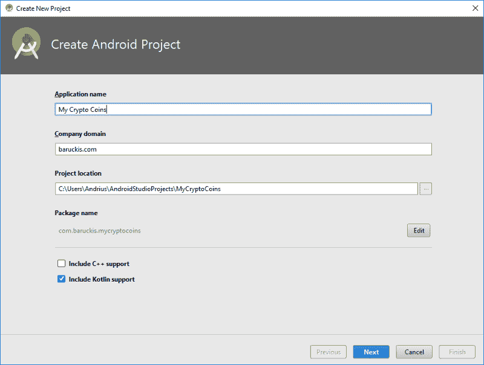
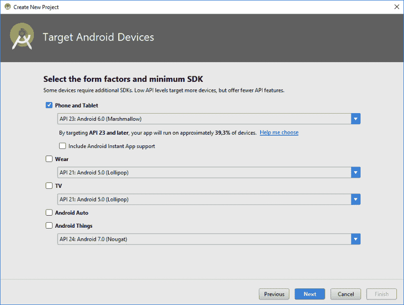
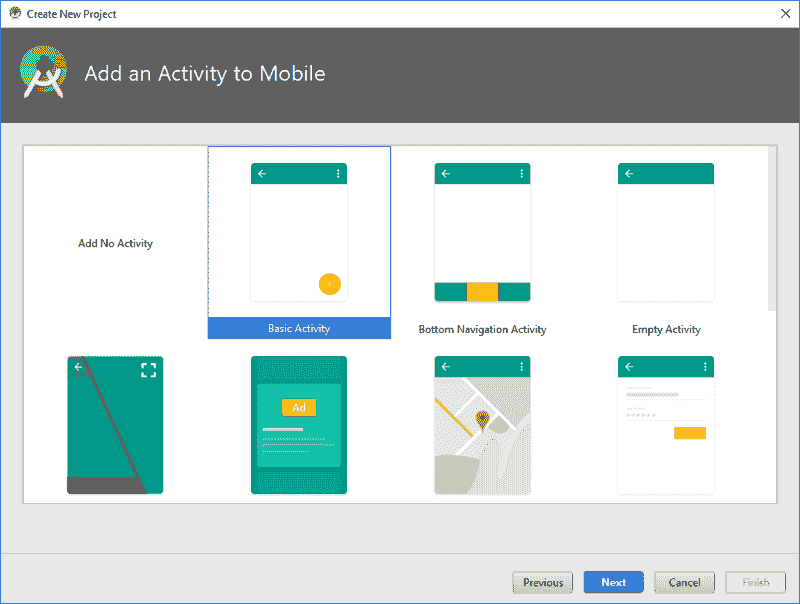
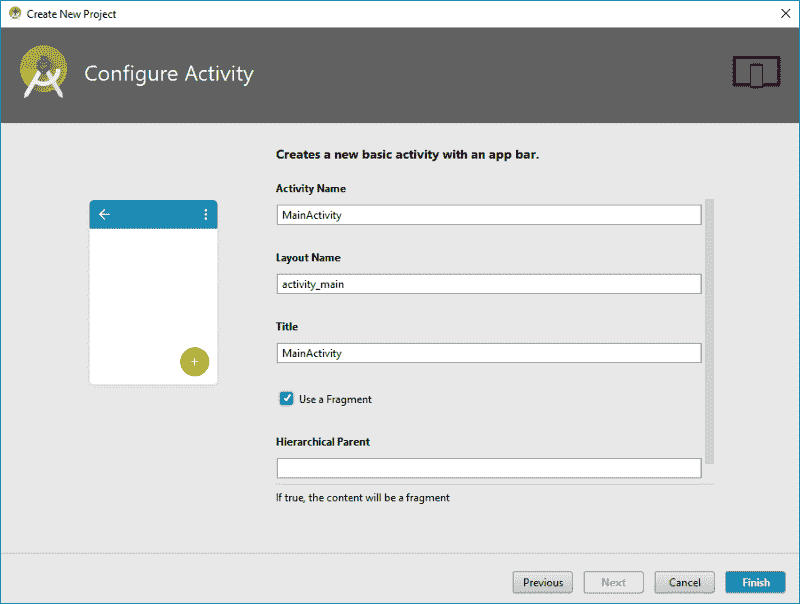

# 2018–2019 年打造现代 Android 应用的路线图

> 原文：<https://www.freecodecamp.org/news/kriptofolio-app-series/>

#### Kriptofolio 应用程序系列—简介

欢迎来到这一系列的博客文章，在这里我将创建一个现代的 Android 应用程序。我将在 2018-2019 年使用可用的最佳工具和实践。我这样做是因为我想涵盖 Android 世界中所有最热门的话题，并通过教你来获取其中的知识。

如果你遵循这个系列，你将学习如何从头开始开发应用程序。本系列的每篇博文都将涵盖我想谈论的一些特定的开发主题。我会努力做到最好，打造一个质量好的 app，讲解开发过程。这个系列的第一篇博文是我们将要做的项目的路线图。

### 系列内容

*   简介:2018–2019 年打造现代 Android 应用的路线图(你在这里)
*   [第一部分:固体原理介绍](https://www.freecodecamp.org/news/kriptofolio-app-series-part-1)
*   第 2 部分:如何开始构建你的 Android 应用:创建模型、UI 和 XML 布局
*   第 3 部分:关于架构的一切:探索不同的架构模式以及如何在你的应用中使用它们
*   [第四部分:如何用 Dagger 2](https://www.freecodecamp.org/news/kriptofolio-app-series-part-4) 在你的应用中实现依赖注入
*   [第 5 部分:使用 refuge、OkHttp、Gson、Glide 和协程处理 RESTful Web 服务](https://www.freecodecamp.org/news/kriptofolio-app-series-part-5)

### 应用程序:“Kriptofolio”(以前的“我的加密硬币”)的想法

起初很难想出一个展示所有 Android 开发趋势的计划，但最终，我找到了一个我喜欢的。这与我的巨大兴趣领域——区块链和加密货币有关。我决定创建一个应用程序，它将包含你的加密货币投资组合，并让你知道它们转换成法定货币的价值。

对用户来说，重要的是这个应用程序将确保 100%的信任。它不需要任何登录/注册过程。它不会通过向服务器发送数据来收集用户的数据。我想没有人会愿意在网上分享自己的财富信息。

用户提供的关于加密货币投资的数据将只存储在本地数据库中，该数据库保存在安卓设备中。然而，为了知道投资组合转换成法定货币的价值，该应用程序将使用互联网来获取最新的转换率。

因此，正如你所看到的培训目的，这个应用程序的想法是伟大的。尝试不同的方法来处理数据在技术上具有挑战性。这是构建现代应用程序最重要的技能之一。钱这个话题对于人来说是如此敏感。为了确保更多的信任，我将通过创建这个博客帖子系列来公开开发这个应用程序，并提供项目代码，这样每个人都可以看到没有什么可隐藏的。

### 我们要用什么？

首先，要创建这个应用程序，我们需要了解当前时刻各种加密货币的价格。这些数据将从互联网上提供，因为它是不断变化的。

#### 数据 API:

[CoinMarketCap](https://coinmarketcap.com/) —了解加密货币市场概况的最受欢迎的网站之一。这个网站提供免费的 [API](https://coinmarketcap.com/api) ，任何人都可以使用，它非常适合作为数据服务提供商的我们。

接下来，我列出了我在 Android 世界中最重要的趋势，适合这个项目并应该在其中使用的东西。

#### 编程语言:

kot Lin——Android 上的一种官方语言。它富有表现力，简洁有力。最重要的是，它可以与现有的 Android 语言和运行时互操作。

这种新语言的引入是 2017 年 Android 最热门的话题之一。我们的应用程序需要写在里面。我在我过去的博文“[让我们通过构建 Android 计算器应用](https://medium.com/mindorks/learn-kotlin-android-calculator-app-b86b275cc27c)来学习 Kotlin”中也谈到了 Kotlin 及其特性。

#### 集成开发环境(IDE):

Android Studio—Android 的官方 IDE。它为在各种类型的 Android 设备上构建应用程序提供了最快的工具。开发本地应用程序没有更好的选择。毫无疑问，这是我们对 IDE 的主要选择。

#### 项目建设管理系统:

Gradle 是一个基于 Groovy 和 Kotlin 的高级通用构建管理系统。它支持自动下载和配置依赖项或其他库。它是 Google 推荐的构建系统。它很好地集成在 Android Studio 中，所以我们将使用它。

#### 建筑:

Android 架构组件(Android Architecture Components)——帮助您设计健壮、可测试和可维护的应用程序的库集合。

[模型-视图-视图模型(MVVM)](https://en.wikipedia.org/wiki/Model%E2%80%93view%E2%80%93viewmodel) —一种架构模式。其概念是将数据表示逻辑从业务逻辑中分离出来，方法是将它移动到一个特定的类中，以便进行清楚的区分。Android 团队将这种模式作为默认选择。此外，它是对 [MVC](https://en.wikipedia.org/wiki/Model%E2%80%93view%E2%80%93controller) 和流行的 [MVP](https://en.wikipedia.org/wiki/Model%E2%80%93view%E2%80%93presenter) 模式的一种替代。

我将在本系列中分别讨论这种模式选择、其他架构选项以及如何组织好我们的代码。如果我们想要构建一个易于维护的可靠项目，这是必不可少的。

协同程序(Coroutines)—一种并发设计模式，你可以在 Android 上使用它来简化异步执行的代码。

#### 数据持久性:

[SQLite 数据库](https://developer.android.com/training/data-storage/sqlite) —它是一个开源的 SQL 数据库，将数据永久存储到设备上的文本文件中。Android 带有内置的 SQLite 数据库实现。SQLite 支持所有关系数据库特性。

[共享首选项](https://developer.android.com/reference/android/content/SharedPreferences) —来自 Android SDK 的 API，用于存储和检索应用程序首选项。SharedPreferences 仅仅是持久存储的数据值集。它允许您以键值对的形式保存和检索数据。

#### 图书馆:

[*Android Jetpack*](https://developer.android.com/jetpack)*组件:*

[AppCompat](https://developer.android.com/topic/libraries/support-library/packages#v7-appcompat) —这是一组支持库，可用于使新版本开发的应用程序与旧版本兼容。

[Android KTX](https://developer.android.com/kotlin/ktx) —一套用于 Android 应用开发的 Kotlin 扩展。Android KTX 的目标是通过利用语言的特性，如扩展函数/属性、lambdas、命名参数和参数默认值，使使用 Kotlin 的 Android 开发更加简洁、愉快和习惯。

[数据绑定](https://developer.android.com/topic/libraries/data-binding) —是一个支持库，它允许您使用声明性格式而不是编程方式将布局中的 UI 组件绑定到应用程序中的数据源。

[生命周期](https://developer.android.com/topic/libraries/architecture/lifecycle) —用于管理您的活动和片段生命周期。

LiveData 是一个可观察的数据持有者类，旨在帮助解决常见的 Android 生命周期挑战，并使应用程序更易于维护和测试。

[Room](https://developer.android.com/topic/libraries/architecture/room) —它在 SQLite 上提供了一个抽象层，允许轻松访问数据库，同时充分利用 SQLite 的强大功能。

视图模型(ViewModel)—旨在以生命周期意识的方式存储和管理 UI 相关数据。ViewModel 类允许数据在配置更改(如屏幕旋转)后仍然存在。

*其他:*

[ConstraintLayout](https://developer.android.com/reference/android/support/constraint/ConstraintLayout) —用于构建灵活高效的布局。布局编辑器使用约束来确定 UI 元素在布局中的位置。约束表示与另一个视图、父布局或不可见指引线的连接或对齐。

[CardView](https://developer.android.com/reference/android/support/v7/widget/CardView)——以卡片方式表示信息的元素，其投影(仰角)和拐角半径在整个平台上看起来是一致的。

[recycle view](https://developer.android.com/reference/android/support/v7/widget/RecyclerView)—一个灵活高效的 ListView 版本。它是一个用于渲染大型视图数据集的容器，可以非常有效地回收和滚动。

*第三方:*

这是一个完全静态的编译时依赖注入框架，适用于 Java 和 Android。

[改型 2](https://square.github.io/retrofit) —一个开源的类型安全的 HTTP 客户端，适用于 Android 和 Java。通过改进，我们可以像 API 文档一样，通过一个简单的、富有表现力的接口轻松地构建 HTTP 连接。

OkHttp —一个开源的现代、快速、高效的 Http 客户端，支持 HTTP/2 和 SPDY。

Gson —一个开源的 Java 库，用于在 JSON 中序列化和反序列化 Java 对象。

Glide —一个快速高效的 Android 图像加载库，专注于平滑滚动。Glide 提供了一个易于使用的 API，一个高性能和可扩展的资源解码管道和自动资源池。

### 配置新项目

我们将从头开始创建这个项目。因此，我将启动 Android Studio，创建一个新项目，命名为“我的加密硬币”，并选择“基本活动”。在这一点上，没有什么特别需要讨论的。我们的目标是通过添加额外功能(例如即时应用程序支持)来重新开始，避免我们头脑中的任何复杂性。我们可以在开发过程中添加任何东西。

首先，让我们包括 Kotlin 语言支持和目标 [API 23: Android 6.0(棉花糖)](https://en.wikipedia.org/wiki/Android_Marshmallow)。

为什么我的目标不是更低或更高的 API？让我们面对现实吧。削减对一些老设备的支持，不用担心开发过程中的任何兼容性问题，这很好。此外，我很自豪地拥有一台旧的 [Nexus 7 (2013)平板电脑](https://en.wikipedia.org/wiki/Nexus_7_(2013))，它运行的是 Android 6.0.1。我希望在上面测试我的应用程序。？所以对于这个影响我最小 SDK 选择的单个项目。

正如你已经注意到的，我将要求 IDE 添加自动生成的基本活动，包括片段支持和一个浮动的动作按钮。我觉得所有对我们项目有用的东西。

**In Android Studio from v3.0 Kotlin plugin is already built-in, just select checkbox to add support.**

**Select minimum targeted SDK based on business needs.**

**Choose basic activity which will generate useful code for a start.**

**Select the checkbox to have content placed into the fragment.**

GitHub —最流行的基于 web 的版本控制托管服务之一。这是一个开源项目，当然，我会使用它。

本系列的所有博客文章都将提交为单独的分支，并作为最新源代码版本的主分支。这里有一个指向资源库的链接。

#### [在 GitHub 上查看源代码](https://github.com/baruckis/Kriptofolio)

一开始就是这样。如果你有任何问题，建议，评论，请随时在评论中提出。现在让我们一起学习吧！接下来是第二部分…？

* * *

***aěIū！感谢阅读！我最初于 2018 年 2 月 12 日为我的博客【www.baruckis.com发表了这篇文章。***