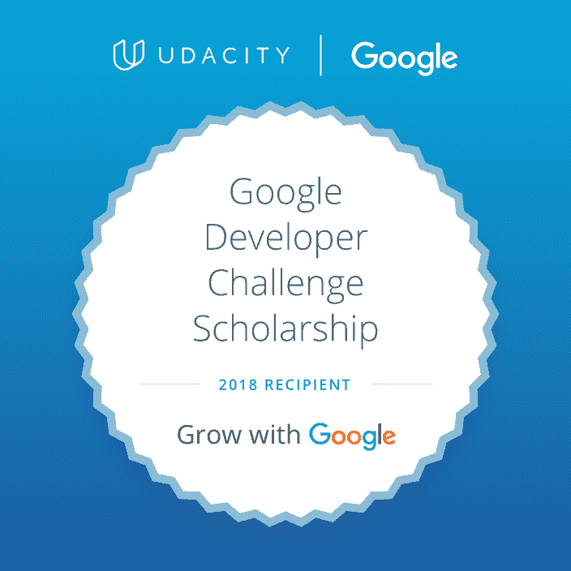

# 我是如何得到我的第一份开发工作的——多么疯狂的旅程

> 原文：<https://www.freecodecamp.org/news/landing-my-first-development-job-what-a-crazy-journey/>

你没看错标题！一家公司给了我一个发展职位，经过一番谈判，我接受了他们非常慷慨的提议！

我非常震惊、兴奋、开心，而且(如果我 100%诚实的话)害怕——尽管是以一种好的方式。我仍然不相信这真的发生了，但是开始生产代码的工作让我欣喜若狂。

很多人让我把我的旅程浓缩成一篇文章，分享并帮助他人。所以，系好安全带，因为我们开始了。

* * *

## 入门指南

我一直对计算机、技术等感兴趣。像许多同龄人一样，我通过创建一个 [GeoCities](https://en.wikipedia.org/wiki/Yahoo!_GeoCities) 网站，以及后来用一些基本的 CSS 个性化我的 MySpace 页面，开始了我的开发生涯。

我当时并不知道，但这是发展，一个粗糙的版本，但仍然是发展。那时，我不知道人们会为这种工作付钱或者我可能会坚持下去。所以，我上了大学，获得了一个与技术无关的学位——心理学。不是一个无用的学位，而是一个我最终从未投入专业使用的学位。

## 找到我的使命

快进到 2016 年的夏天，我发现自己在工作之外有大量的空闲时间。我一直想自学编码/编程，现在决定是时候了——不能再拖延了。网上有大量免费且可访问的资源来教我如何编程，这是投入其中的最佳时机。

我从搜索资源开始，偶然发现了 Codecademy。我通过将整个问题、答案和结果复制到一个笔记本上来做手写笔记。我把一切都写了下来，以为我会需要它。我不时地回到这些笔记上来复习。回顾过去，将我当时认为困难的事情与我现在认为困难的事情进行比较，也是一件有趣的事情。？

一个朋友向我介绍了 [freeCodeCamp](https://freecodecamp.org) ，因为他知道我在自学，并告诉我这个平台是为像我这样的人搭建的。我本打算去看看，也许去上一两节课，然后去睡觉。那天晚上，我完成了整个 HTML 部分！我被迷住了。

我学到的越多，我的问题就越多。我感受到了这种寻找这些问题答案的冲动。所以我继续完成课程和项目。在 freeCodeCamp 的课程被修改之前，我完成了两个项目。

我在寻找任何借口去学习和做项目。当我站在任何一条线上等待什么的时候，我会拿出我的手机，而不是看社交媒体，我开始阅读网络开发文章或观看与开发相关的视频。

与以前“盲目消费”支配我的时间相比，我觉得这是我看待停机时间方式的一个重大转变。如果你喜欢社交媒体或有趣的动物视频，我不是说你没头脑，我只是说这种消费通常不需要你参与。这是你可以在 auto pilot 上进行的消费类型，坦率地说，我仍然不时地这样做。)

在那段时间里，我辗转于各种不同的来源，就像一个在糖果店的孩子。有一次，我有一个文件夹，里面有大约 300 个链接，指向我计划研究的材料。我现在知道，找到一种资源并坚持下去，远比从一种资源希望到另一种资源要好得多。

晚上，当我的妻子和女儿睡着的时候，我正在做这些事情。我熬夜到凌晨 12:30，有时晚至凌晨 2:00，然后不得不在早上 6:00 起床做我正常的工作。起初，当这些话题不那么令人精神紧张时，这并不是一个问题。但是当我开始学习 JavaScript，学习网络、服务器、可访问性等基础知识时，我注意到它越晚，就越难让我的大脑保持活跃。

不用说，这个套路只维持了几个月就不得不改了。

我不想停止项目/学习，但我需要改变我的时间表，以利于我的福祉。就在那时，我决定走向工作日光谱的另一端。

我开始在早上 4:00 起床，而不是熬夜，在去健身房之前学习和做项目，然后开始我的一天。我必须说，这是我旅程中的一个关键时刻，因为我开始记住更多我正在学习的信息，并最终帮助我推进更多的项目/材料。

同时，这也是我开始购买所有我能找到的关于 web 开发的资源(主要是 Udemy 课程和书籍)的时候。我可以告诉你，这不是一个明智的(或财务稳健的)选择。如果你找到了一个你喜欢的资源，并且你正在从中学习，那么坚持使用这个资源，直到它耗尽。你最不想做的事情就是像我一样，每次找到一个新资源就跳到这个新资源上。

## 与谷歌和 Udacity 奖学金一起成长

The image that came with my acceptance e-mail

2018 年 1 月，我申请并获得了 Udacity 前端纳米学位项目的奖学金。这不仅是一次帮助我实现目标的绝佳机会，也是一次令人谦卑的经历。

我带着 HTML、CSS 的基础知识和一小部分香草味的 JavaScript 进入这个程序。在这个课程中，我了解了 [jQuery](https://jquery.com/) 、[函数式编程](https://en.wikipedia.org/wiki/Functional_programming)、[面向对象编程](https://en.wikipedia.org/wiki/Object-oriented_programming) (OOP)、[测试驱动开发](https://en.wikipedia.org/wiki/Test-driven_development) (TDD)、[可访问性](https://en.wikipedia.org/wiki/Accessibility)、服务器、 [API 的](https://en.wikipedia.org/wiki/Application_programming_interface)、基本网络、 [React](https://reactjs.org/) 、 [AJAX](https://en.wikipedia.org/wiki/Ajax_%28programming%29) ，以及许多我以前没有接触过的 web 开发的方方面面。

老实说，这并不总是容易或有趣的，有几次我认真考虑过退学。我觉得我永远也学不会这些概念，而且我已经不知所措了。

我很高兴我没有放弃，因为没有人通过放弃来实现他们的目标——这是我向:D 承诺的第一句也是唯一一句陈词滥调

我有机会构建了许多令人敬畏的项目，如[纸牌匹配游戏](https://github.com/JS-goose/card-matching-game)、[街机游戏副本](https://github.com/JS-goose/frontend-nanodegree-arcade-game)、[餐馆评论应用](https://github.com/JS-goose/mws-restaurant-stage-1)和[街区地图应用](https://github.com/JS-goose/neighborhood-map-react)。除了项目之外，我还在课程中结识了许多优秀的人，并获得了与其他开发人员合作的宝贵经验。

如果没有这门课，我可以真诚地说，我不会有今天。在这 9 个月的课程中，我获得了许多宝贵的经验和教训。

## 求职...敦敦敦敦。

Photo by [Sven Mieke](https://unsplash.com/@sxoxm?utm_source=unsplash&utm_medium=referral&utm_content=creditCopyText) on [Unsplash](https://unsplash.com/search/photos/job-search?utm_source=unsplash&utm_medium=referral&utm_content=creditCopyText)

此时，我已经勤奋地工作了大约两年(有时也会偷懒)。我并不觉得自己已经准备好了，但一位成为我导师的朋友告诉我，我永远都不会准备好。他说我应该申请，如果我得到面试，然后让他们告诉我，我还没有准备好，如果是这样的话，但不要把自己从一个机会中排除。

因此，带着巨大的恐惧、焦虑和怀疑，我决定开始申请工作。

起初，我只申请符合大多数条件的工作。我现在可以告诉你，这不是做这件事的方法，然而，当时我很害怕有人真的会打电话给我面试。后来，我开始申请任何我感兴趣的工作。高级开发人员-当然，我申请了。具有反应技能的前端忍者-是的，也提交了一份申请。有 SQL 经验的 API 开发者-哦耶！我也申请了那个。我这样做是因为你永远不知道你的申请会有什么结果。也许你没有得到那个高级职位，但是也许他们非常喜欢你和你的个性，所以他们邀请你去面试他们的初级职位。)

这正是我申请了大约 3 个月后发生的事情。我接到了第一次面试的电话！我既高兴又害怕。现在压力真的来了。

我读了一些文章，温习了我的面试技巧，读了一些书，让我的妻子就一些话题对我进行了测试，并且尝试过我认为会在面试中出现的不同场景。我还为面试官准备了一些问题，因为我想知道在这家公司工作是什么感觉。

最终，我做了不该做的事；我说服自己这是一份完美的工作，我想要它。我想要它胜过我记忆中想要的任何东西。我把它建成我必须拥有的东西。

面试的日子到了，说我紧张是一种轻描淡写的说法。我汗流浃背。我回答了所有的问题，轮到我时，我问了我准备好的问题。面试结束后，我离开时觉得面试进行得很顺利。

最终，我没有得到这个职位，我被击垮了。我觉得一切都像它应该发生的那样，但出于某种原因，星星并没有对齐。我一点也不知道这将是我采访中的一个常见模式。

我决定不让这些失望定义或摧毁我的信心。我开始更加努力地工作，学习更多，用我感到的失望来激发我的激情。我会尽我所能确保其中一次面试以全职工作结束。

以下是一些关于我求职的衡量标准:

*   跨所有平台提交的申请: **271**
*   申请后公司任何形式的联系: **28**
*   电话面试: **7**
*   亲自面试: **8**
*   工作邀请: **3** (一份是有(小)可能性的全职合同，一份是兼职的自由职业者，最后我得到了一份全职工作
*   表达兴趣后不理我的公司:**多得数不过来**

如果你正在求职，无论在哪个领域，不要让数字让你气馁！是的，这是令人沮丧的，是的，这可能是令人畏惧的，是的，填写一份申请，从来没有听到任何回应，这很糟糕，但不要放弃！你能做到的！我就是证据！

## 我对你求职的建议

这绝不是一份详尽的建议/技巧清单，但以下是我在求职过程中得到的一些建议:

*   养成厚脸皮——必须的！公司会让你失望
*   申请你感兴趣的任何东西
*   即使你不符合所有的要求，也要申请(这就是我所做的，也是我如何获得第一份开发人员工作的)
*   花时间完善你的简历
*   公司拒绝你并不意味着你是个失败者
*   向公司展示你可以通过在教程之外构建项目来完成这项工作
*   如果你需要帮助，请寻求帮助(这对我来说很难学)
*   在所有主要平台上申请工作，但不要忘记像 GitHub jobs 这样的平台也存在
*   确保你照顾好自己——充足的睡眠、锻炼、健康饮食(这对整体健康很重要！)
*   不要害怕休息
*   不要拿你自己、你的求职、你的处境或者你的技能和别人比较
*   如果你花了 3 个月或 3 年(像我一样)记住，这不是一场比赛
*   好好努力，好好学习，永不放弃！

* * *

一如既往，我只希望你一切顺利。如果你需要建议或帮助，我很乐意尽我所能。在 [Twitter](https://twitter.com/jj_goose) 或 [LinkedIn](https://www.linkedin.com/in/jj-goose/) 上与我联系。我总是乐于助人，而且我喜欢认识新朋友！

我还经营着一个个人博客，在那里我写一些关于网络开发的文章。当你在那里的时候，考虑注册我的时事通讯，我每月发送一次，里面有来自网络上的文章和重大发现。

祝您有美好的一天，编码愉快！