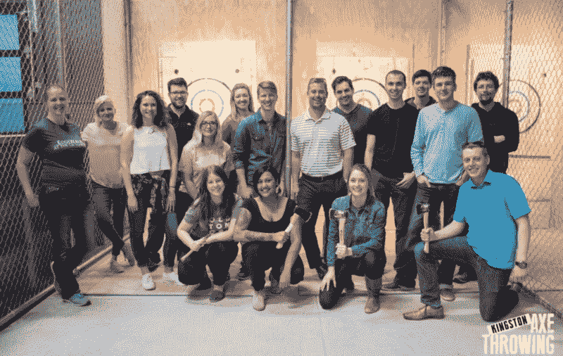
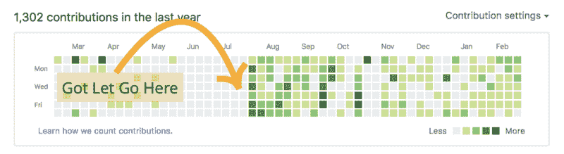

# 获得我的第一份全栈网络开发工作

> 原文：<https://www.freecodecamp.org/news/landing-my-first-full-stack-web-developer-job-9f98afff1dea/>

罗伯特·库珀

# 获得我的第一份全栈网络开发工作

这是我获得第一份工作**全栈 web 开发人员**的步骤的故事。我认为分享这些开发者之旅是有价值的，可以帮助其他人了解他们如何也能作为一名 web 开发人员找到他们的第一份工作。我自己从别人如何获得开发人员职位的故事中获得了灵感。它给了我自己应该做什么的想法。

#### 为什么是 Web 开发？

高中毕业后，我决定在大学学习工程学，因为我擅长数学和科学。我在高中时学过几门编程课程。我喜欢他们，并一度考虑在大学攻读计算机科学学位。但是我说服自己不要这样做，因为我不认为我在计算机方面做了足够的工作，能够在这样的程序中取得成功。

我并不特别喜欢我的大学教育经历(正如我在这里写的)。但我确实完成了整个项目，并最终获得了工程学位。

在我大学学习的最后一年之前，我完成了一个非常无聊的合作实习。我开始寻找毕业后工程职业的替代品。因为我喜欢大学里学的编程课程，所以我决定尝试学习网络开发。我对与顶尖科技公司(如 Google、Twitter、Shopify 等)相关的“有趣”和“非传统”的工作场所非常感兴趣。

I took this photo at the Google office in Toronto, Canada. Their offices blew me away with the number of office perks that are available to employees.

#### 焦点转移

在我工程学位的最后两年里，我做了一些有助于我毕业后从事网络开发工作的事情。实际上，我考虑过不完成最后一年的学业，但因为终点线在望，我决定完成学业。以下是我采取的主要行动的时间表:

【2016 年 1 月

我开始上一些 [**在线 web 开发课程**](https://teamtreehouse.com) ，网上不缺这方面的资源。我为自己建了一个网站，然后决定为别人建网站，这样我可以得到更多的练习。

【2016 年 4 月

我最终参加了一个政府项目，该项目资助学生自己创业。我在一个夏天开始了自己的网络开发业务，总共有 5 个客户。我学到了很多关于网络开发的知识，以及如何经营一个小企业。我在用 *WordPress* 和 *Shopify* 建立网站。

My business was called “Quark Designs”. The business name was inspired by the elementary particles called [“quarks”](https://en.wikipedia.org/wiki/Quark), which is a physics-related thing.

【2016 年 9 月

在大学的最后一年，我经历了很多事情。我关闭了我的网络开发业务，选择在一家商业咨询公司做开发人员。我负责客户网站的开发。我使用了和我自己做生意时一样的平台来建立网站( *WordPress* 和 *Shopify* )。

我申请参加了一个大型学生办的技术会议的组委会。我最后得到了**技术总监**的职位。我负责和另一名学生开发者一起建立会议网站。网站是用基本的 *HTML* 、 *CSS* 和 *JavaScript* 构建的

我还加入了我大学的工程学会 IT 团队。我开始着手一个项目，这个项目使用了比我以前做过的任何项目都多得多的 *JavaScript* 。团队动力不是很好。但在这个过程中，我学到了很多与他人合作的知识。当我从事任何合作项目时，我都会带着这些经验教训。

此外，我还自愿担任两个当地组织举办的多个研讨会的导师。这些组织提供研讨会，教社区成员如何学习编码。从九月开始的一年中，我在大约六个车间做志愿者。指导不仅给了我帮助他人的机会。这也给了我对我所拥有的网络开发知识的信心，同时也进一步强化了网络开发的概念。

【2016 年 12 月

虽然不一定与开发人员有关，但我成为了一个年轻的专业网络组织 的主席。这帮助我在社区中建立了很多联系，也让我在与陌生人交谈时更加自在。我从这次经历中学到的一些技能在求职面试中帮助了我。

One of the many local networking events I attended.

【2017 年 4 月

我**毕业于**大学，获得机械工程学位。然后我转到了 T2，在我 9 月份开始工作的同一家商业咨询公司做全职工作。

【2017 年 7 月

我被解雇了。我没有被告知这个令人失望的决定的任何理由，因为我总是想从我的错误中学习。然而，这最终对我有好处，因为我所做的开发工作并不是我最终想要做的。我在做简单的 *WordPress* 和 *Shopify* 网站，这对我这个开发者来说没有挑战。我真正想做的是创建解决特定客户需求的独特的 web 应用程序。

被放开也点燃了我心中的一把火。全职工作时，我没有把学习放在首位。因此，我并没有把自己定位为一名开发人员，致力于使用灵活的技术栈解决有趣的问题。我被解雇后的那个星期，我加倍努力学习。我开始做很多兼职项目。我在写博客文章，阅读/观看教程，参加开发者聚会。我还开始给开发人员小组做关于 web 开发技术的讲座。

You can see that my Github contributions spiked shortly after the end of my full-time job.I was working away on lots of open source side projects.

#### 求职

寻找一份我真正想要的 web 开发人员的工作从 2017 年 8 月持续到 2017 年 12 月( **5 个月**)。我申请了许多位于大城市的不同的网站开发公司。我想搬到一个更大的城市，因为我想成为一个更有活力的技术社区的一部分。我也相信在大城市有更多的职业发展机会。

我不确定我最终寄出了多少份申请，但我最终得到了 **5 次面试**。我有一次面试非常顺利。该公司的人力资源人员让我相信我得到了这份工作，但后来发生了一些事情，我被告知该公司进入了“招聘冻结”

这糟透了，因为我已经告诉一群人，看起来我可能会为这家公司工作。这次经历教会了我在以后的面试中保持沉默。在收到正式工作邀请和签署一些官方文件之前，我保留了发表任何声明的权利。

我参加了另一个在阿姆斯特丹的工作面试。我真的很兴奋，因为我去年夏天去过这个城市，非常喜欢它。不幸的是，我搞砸了编码挑战，我在这里描述了

#### 工作机会

我做了很多涉及 React 的兼职项目，因为这是很多职位发布要求的一部分。我申请的一家公司给了我一个编码挑战，让我用 React 构建一个小的登录和用户仪表板应用程序。我有大约一周的时间来完成挑战，我全力以赴。我每天花**6-8 个小时在挑战**上，并让我的一个朋友做代码审查，他建议改进我的应用程序。

在提交了我对编码挑战的解决方案后，我被邀请参加一个对公司一些团队成员的视频采访。我认为我的面试更像是一次谈话，因为这实际上是我在谈论我过去的经历。这也是他们团队了解我的个性和兴趣的一个机会。这次经历让我感觉很好，但我也很难判断我的面试结果。面试是在一个星期二进行的，我在星期五的最后一天收到了一份工作邀请，是在 [Osedea](https://osedea.com/en) 的一个全栈 web 开发人员的职位。当然，我接受了这个提议

Full Stack Web Developer baby!

我已经在我的新工作岗位上呆了一个多月了，我对现在的工作再满意不过了。通过参与使用 React、React Native 和 Laravel 的项目，我学到了很多东西。公司鼓励每个人花时间去**了解最新的技术**趋势。我每天都接触到一堆新东西，作为一名网络开发人员，我**正以极快的速度成长。**

我希望这篇文章有助于激励一些人从事 web 开发职业。它也可能提供一些关于如何最好地获得一份网络开发工作的想法。如需更多细节或建议，请随时联系我们！

如果你觉得这篇文章很有趣，并且对前端开发感兴趣，可以考虑在 [**Twitter**](https://twitter.com/RobertCooper_RC) 、 [**Github**](https://github.com/robertcoopercode) 或 [**LinkedIn**](https://www.linkedin.com/in/robert-cooper/) 上关注我。