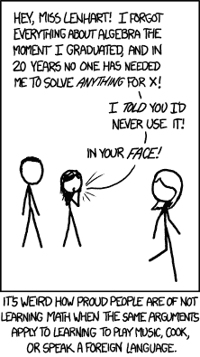

# 大学代数-通过这个 7 小时的免费课程学习大学数学的先决条件

> 原文：<https://www.freecodecamp.org/news/learn-algebra-to-improve-your-programming-skills/>

在大多数计算机程序中，代数概念随处可见。程序通常包括多项式、因式分解、不等式等等。

你经常会在代码中看到大量的其他代数概念:

*   程序包含变量。
*   程序计算包含这些变量的表达式。
*   使用抽象规则可以简化和转换代码。
*   程序包含函数，函数可以用其他函数来定义。

大多数程序员应该对代数有所了解。这就是为什么我们在 freeCodeCamp.org YouTube 频道上发布了一个完整的大学代数课程。

这门课程是由在教堂山北卡罗来纳大学任教的琳达·格林博士创建的。她有多年教本科生代数的经验。她将大学代数基础浓缩到这门 7 小时的课程中。

以下是您将在本课程中学到的所有代数概念:

*   指数规则
*   使用指数规则简化
*   简化部首
*   因子分解
*   保理-附加示例
*   理性表达式
*   解二次方程
*   有理方程
*   解根式方程
*   绝对值方程
*   区间符号
*   绝对值不等式
*   复合线性不等式
*   多项式和有理不等式
*   距离公式
*   中点公式
*   圆:图形和方程式
*   线条:图形和方程式
*   平行线和垂直线
*   功能
*   工具包功能
*   函数的变换
*   二次函数导论
*   图形二次函数
*   二次函数的标准型和顶点型
*   顶点公式的证明
*   多项式
*   指数函数
*   指数函数应用
*   指数函数解释
*   复利
*   对数:简介
*   对数函数及其图形
*   组合对数和指数
*   日志规则
*   使用对数求解指数方程
*   求解对数方程
*   双倍时间和半衰期
*   线性方程组
*   距离、速率和时间问题
*   混合问题
*   有理函数和图
*   组合功能
*   功能组成
*   反函数

If you forgot Algebra, this is the perfect time to relearn it. ([Source: xkcd](https://xkcd.com/1050/))

此外，我们建议你拿出一些纸和一支铅笔，做笔记——就像你回到教室时一样。

这种手动记笔记的过程将帮助你更好地理解和记住这些概念，因为格林博士动作很快，在短时间内涵盖了很多主题。

在 freeCodeCamp.org YouTube 频道观看[全程(7 小时观看)。](https://youtu.be/LwCRRUa8yTU)