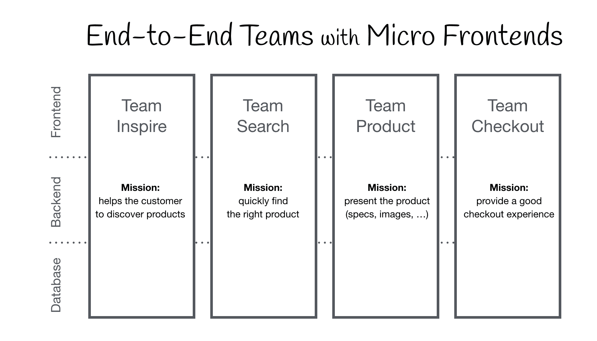

# 了解有关微前端的所有信息

> 原文：<https://www.freecodecamp.org/news/learn-all-about-micro-frontends/>

微前端让你可以构建一个网站或 web 应用程序，作为你可以单独创建和工作的功能的组合。

我们刚刚在 freeCodeCamp.org YouTube 频道上发布了一门课程，教你所有关于微前端的知识。

杰克·赫灵顿创立了这门课程。杰克做过首席工程师，是一名优秀的教师。

在本课程中，Jack 将带您从刚刚起步，到了解异步加载、错误处理、共享状态、跨平台微前端、如何一起路由多个应用程序，甚至如何测试微前端代码。

Diagram from https://micro-frontends.org

以下是本课程涵盖的部分:

*   微前端演示
*   为什么是微前端？
*   为什么是模块联盟？
*   异步加载
*   错误处理
*   服务器设置
*   共享功能
*   术语
*   服务器购物车设置
*   共享状态
*   共享 JWT
*   共享购物车
*   国家共享备选方案
*   完成购物车
*   跨平台微前端
*   微前端路由
*   单元测试
*   端到端测试
*   下一步是什么？

观看以下或 freeCodeCamp.org YouTube 频道的完整课程(2 小时观看)。

[https://www.youtube.com/embed/lKKsjpH09dU?feature=oembed](https://www.youtube.com/embed/lKKsjpH09dU?feature=oembed)