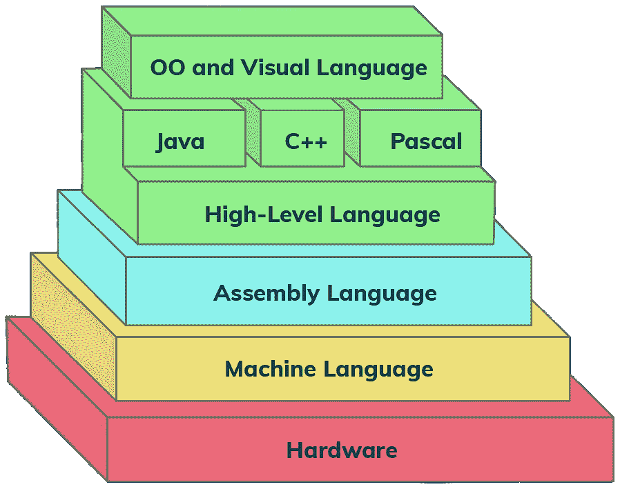

# 用 ARM 学习汇编语言编程

> 原文：<https://www.freecodecamp.org/news/learn-assembly-language-programming-with-arm/>

汇编语言是计算机或其他可编程设备的低级编程语言，最接近于机器语言。它通常特定于特定的计算机体系结构，因此有多种类型的汇编语言。ARM 是一种越来越流行的汇编语言。

我们刚刚在 freeCodeCamp.org YouTube 频道上发布了一个完整的课程，教你用 ARM 进行汇编语言编程的基础知识。

Scott Cosentino 教授这门关于 ARM 汇编编程的课程。Scott 是一位受欢迎的技术讲师和作者。

Hierarchy of Programming Languages

据估计，超过 2000 亿台设备包含 ARM 芯片，这使得 ARM 语言非常值得理解。通过理解 ARM 汇编语言，程序员可以在较低的级别工作，允许他们编写以高效的方式与硬件交互的代码。

本课程结束时，您将对 ARM 处理器以及汇编编程有一个基本的了解。您将能够使用处理器中的各种指令编写基本的 ARM 汇编程序。

以下是您将在本课程中学到的内容:

*   ARM 仿真和程序结构的基础
*   寄存器、堆栈和存储器寻址模式的基础知识
*   算术和逻辑运算符的概念
*   分支、循环和子程序分支的主要概念
*   与简单硬件设备交互的方式

观看以下全部课程或在 freeCodeCamp.org YouTube 频道观看(2.5 小时)。

[https://www.youtube.com/embed/gfmRrPjnEw4?feature=oembed](https://www.youtube.com/embed/gfmRrPjnEw4?feature=oembed)