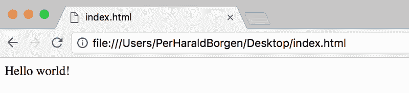

# 学习 Vue:一个 3 分钟的交互式 Vue JS 教程

> 原文：<https://www.freecodecamp.org/news/learn-basic-vue-js-crash-course-guide-vue-tutorial-e3da361c635/>

Vue.js 是一个用于构建用户界面的 JavaScript 库。去年，它开始在 web 开发人员中变得非常流行。它是轻量级的，相对容易学习，而且功能强大。

在 Medium 告诉你阅读这篇文章的三分钟内，你就可以开始构建基本的 Vue 应用了。对于每一部分，我还包括了一个交互式的 Scrimba 截屏，在这里你可以观看我解释概念和自己摆弄代码。

让我们开始吧。

### 模板语法和数据

Vue.js 的核心是一个简单的模板语法，如下所示:

```
<div id="myApp">  
    {{ message }}  
</div> 
```

将它与下面的 JavaScript 代码片段结合起来:

```
var myApp = new Vue({  
   el: '#myApp',  
   data: {  
       message: 'Hello world!'  
   }  
}) 
```

这将导致*你好世界！*被渲染在页面上。



`el: #myApp`部分告诉 Vue 使用 id 为 *myApp 的 DOM 元素来呈现应用程序。*`data`对象是放置您想要在应用程序中使用的数据的地方。我们在这里只添加了一个键，`message`，我们在我们的 HTML 中是这样引用它的:`{{ message }}`。

Vue 负责将`data`对象链接到 DOM，因此如果数据发生变化，页面也会随之更新。

这被称为声明性呈现。你只需简单地指定*你想更新什么*，Vue 会负责*如何更新*。

您可以通过以下操作更改数据罐:

```
myApp.message = 'Some new value'; 
```

以下是解释这一确切概念的截屏:

### 指令

您需要学习的下一个概念是指令。指令是以`v-`为前缀的 HTML 属性，这表明它们对呈现的 DOM 应用反应行为。

假设我们只想在条件为真的情况下呈现某样东西，如果条件为假，就隐藏它。那我们就用`v-if`。

在 HTML 中，它看起来像这样。

```
<div id="app">  
    <p v-if="seen">Now you see me</p>  
</div> 
```

和一些 JavaScript:

```
var app = new Vue({  
    el: '#app',  
    data: {  
        seen: true  
    }  
}) 
```

如果`data`中的`seen`为**真，这将导致渲染出*现在你看我*段。**要隐藏段落，您可以将`seen`设置为 **false，**如下:

`app.seen = false;`

这里有一个解释相同概念的截屏:

还有许多其他的指令，像`v-for`、`v-on,`、`v-model`。

### 处理用户输入

你需要学习的另一个核心指令是`v-on`。它会将一个事件监听器连接到 DOM 元素，以便您可以处理用户输入。您可以在冒号后指定事件的类型。所以`v-on:click`会监听点击。

```
<div id="app">  
    <button v-on:click="myClickHandler">Click me!</button>  
</div> 
```

`myClickHandler`是指`methods`对象中同名的键。不用说，这是放置应用程序方法的对象。你想要多少方法都可以。

```
var app = new Vue({  
    el: '#app',  
    methods: {  
        myClickHandler: function () {  
            console.log('button clicked!');  
        }  
    }  
}) 
```

这将导致点击的*按钮在点击按钮时被记录到控制台。*

以下是解释这一概念的截屏:

### 把这一切联系在一起

现在让我们创建一个例子，其中我们同时使用了`data`和`methods`，将我们到目前为止所学的内容结合起来。

```
<div id="app">  
    <p>{{ message }}</p>  
    <button v-on:click="changeMessage">Click me!</button>  
</div> 
```

还有 JavaScript:

```
var app = new Vue({  
    el: '#app',  
    data: {  
        message: 'Start message'  
    },  
    methods: {  
        changeMessage: function () {  
            this.message = 'The message has changed!'  
        }  
    }  
}) 
```

最初，它会在页面上显示出*开始消息*，然而点击后它会显示*该消息已经改为*。

`this`关键字指的是 Vue 实例，我们称之为`app`。我们的数据就是在这个实例上存在的，所以我们可以通过`this.message`引用`message`的数据。

请看这段解释这一概念的视频。

到那时，你应该知道足够多的 Vue.js 来开始创建简单的应用程序。

在下一个教程中，您将学习如何创建 Vue 组件。所以，如果你喜欢这篇文章，一定要关注这篇文章。