# 通过建立一个登录页面网站，在 30 分钟内学习 Bootstrap 4

> 原文：<https://www.freecodecamp.org/news/learn-bootstrap-4-in-30-minute-by-building-a-landing-page-website-guide-for-beginners-f64e03833f33/>

作者:SaidHayani@

# 通过建立一个登录页面网站，在 30 分钟内学习 Bootstrap 4

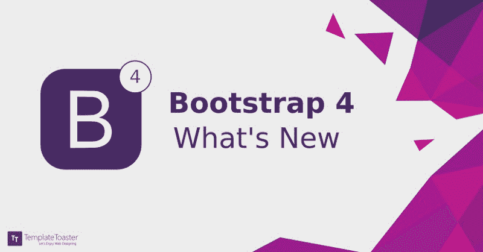

from [templatetoaster](https://blog.templatetoaster.com/bootstrap-4/)

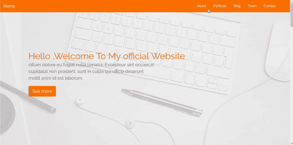

### 初学者指南

> “Bootstrap 是一个免费的开源前端库，用于设计网站和 web 应用程序。它包含基于 HTML 和 CSS 的设计模板，从排版、表单、按钮、导航和其他界面组件，以及 JavaScript 扩展。与许多其他 web 框架不同，Bootstrap 只关注前端开发。”— [维基百科](https://en.wikipedia.org/wiki/Bootstrap_(front-end_framework)

> [大家好，在我们开始学习 Bootstrap 4 之前，请查看我的整个班级，在这里您将了解 Bootstrap 的新功能以及如何使用它们来构建更好的用户体验](https://skl.sh/2NbSAYj)。

Bootstrap 有许多版本，最新版本是版本 4。在本文中，我们将使用 Bootstrap 4 构建一个网站。

### 先决条件

在开始之前，为了学习和使用 Bootstrap 框架，您必须了解一些技能:

*   HTML 基础
*   CSS 的基础知识
*   和一些基本的 JQuery

### 目录

我们将在构建网站时涵盖以下主题:

*   [下载并安装引导程序 4](https://www.freecodecamp.org/news/learn-bootstrap-4-in-30-minute-by-building-a-landing-page-website-guide-for-beginners-f64e03833f33/#downloading-and-installing-bootstrap-4)
*   [Bootstrap 4 的新特性](https://www.freecodecamp.org/news/learn-bootstrap-4-in-30-minute-by-building-a-landing-page-website-guide-for-beginners-f64e03833f33/#the-new-features-of-bootstrap-4)
*   [自举网格系统](https://www.freecodecamp.org/news/learn-bootstrap-4-in-30-minute-by-building-a-landing-page-website-guide-for-beginners-f64e03833f33/#bootstrap-grid-system)
*   [导航条](https://www.freecodecamp.org/news/learn-bootstrap-4-in-30-minute-by-building-a-landing-page-website-guide-for-beginners-f64e03833f33/#navbar)
*   [表头](https://www.freecodecamp.org/news/learn-bootstrap-4-in-30-minute-by-building-a-landing-page-website-guide-for-beginners-f64e03833f33/#header)
*   [按钮](https://www.freecodecamp.org/news/learn-bootstrap-4-in-30-minute-by-building-a-landing-page-website-guide-for-beginners-f64e03833f33/#buttons)
*   [关于章节](https://www.freecodecamp.org/news/learn-bootstrap-4-in-30-minute-by-building-a-landing-page-website-guide-for-beginners-f64e03833f33/#about-section)
*   [投资组合部分](https://www.freecodecamp.org/news/learn-bootstrap-4-in-30-minute-by-building-a-landing-page-website-guide-for-beginners-f64e03833f33/#portfolio-section)
*   [博客版块](https://www.freecodecamp.org/news/learn-bootstrap-4-in-30-minute-by-building-a-landing-page-website-guide-for-beginners-f64e03833f33/#blog-section)
*   [卡片](https://www.freecodecamp.org/news/learn-bootstrap-4-in-30-minute-by-building-a-landing-page-website-guide-for-beginners-f64e03833f33/#cards)
*   [团队部分](https://www.freecodecamp.org/news/learn-bootstrap-4-in-30-minute-by-building-a-landing-page-website-guide-for-beginners-f64e03833f33/#team-section)
*   [联系方式](https://www.freecodecamp.org/news/learn-bootstrap-4-in-30-minute-by-building-a-landing-page-website-guide-for-beginners-f64e03833f33/#contact-form)
*   [Fonts](https://www.freecodecamp.org/news/learn-bootstrap-4-in-30-minute-by-building-a-landing-page-website-guide-for-beginners-f64e03833f33/#fonts)
*   [滚动效果](https://www.freecodecamp.org/news/learn-bootstrap-4-in-30-minute-by-building-a-landing-page-website-guide-for-beginners-f64e03833f33/#scroll-effect)
*   [总结和结论](https://www.freecodecamp.org/news/learn-bootstrap-4-in-30-minute-by-building-a-landing-page-website-guide-for-beginners-f64e03833f33/#wrap-up-and-conclusion)

### 下载并安装 Bootstrap 4

有三种方法可以为您的项目安装和包含 Bootstrap 4:

1.  使用 npm

您可以通过运行此命令`npm install bootstrap`来安装 Bootstrap 4

2.使用内容交付网络(CDN)

通过在项目中的头标记之间包含此链接:

```
<link rel="stylesheet" href="https://maxcdn.bootstrapcdn.com/bootstrap/4.0.0/css/bootstrap.min.css" integrity="sha384-Gn5384xqQ1aoWXA+058RXPxPg6fy4IWvTNh0E263XmFcJlSAwiGgFAW/dAiS6JXm" crossorigin="anonymous">
```

3.下载 [Bootstrap 4](http://getbootstrap.com/) 库并在本地使用。

我们项目的结构应该是这样的:

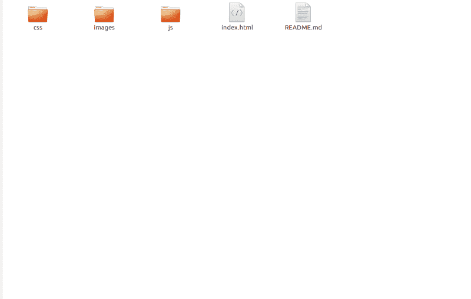

### Bootstrap 4 的新功能

Bootstrap 4 有什么新功能？Bootstrap 3 和 Bootstrap 4 有什么不同？

Bootstrap 4 现在提供了一些上一版本中没有的令人惊叹的功能:

*   Bootstrap 4 是使用 Flexbox Grid 编写的，而 Bootstrap 3 是使用 float 方法编写的。
    如果你是 Flexbox 的新用户，请查看[本教程](https://scrimba.com/p/pL65cJ/canLGCw)。
*   引导程序 4 使用`rem` CSS 单元，而引导程序 3 使用`px`。
    [看看这两个单位有什么不同。](https://zellwk.com/blog/media-query-units/)
*   面板、缩略图和井已被完全丢弃。
    你可以在这里阅读更多关于 Bootstrap 4 [的全球变化和移除特性的详细信息。](http://getbootstrap.com/docs/4.0/migration/#global-changes)

这里不要太深入细节，让我们继续一些其他重要的事情。

### 自举网格系统

Bootstrap Grid 系统帮助您创建自己的布局，轻松构建一个响应迅速的网站。类名没有任何变化，除了在 Bootstrap 4 中不再存在的`.xs`类。

网格分为 12 列，因此您的布局将以此为基础。

要使用网格系统，你必须在主*分区*中添加一个`.row`类。

```
col-lg-2 // class used for large devices like laptops
col-md-2 // class used for medium devices like tablets
col-sm-2// class used for small devices like mobile phones
```

### 导航条

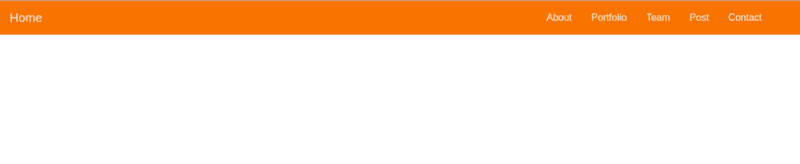

navbar 包装在 Bootstrap 4 中非常酷。当涉及到构建一个响应式导航条时，这是非常有用的。

为了得到它，我们将把`navbar`类添加到我们的`**index.html**`文件中:

```
<!-- navbar -->  
 <nav class="navbar navbar-expand-lg fixed-top ">  
 <a class="navbar-brand" href="#">Home</a>
<button class="navbar-toggler" type="button" data-toggle="collapse" data-target="#navbarSupportedContent" aria-controls="navbarSupportedContent" aria-expanded="false" aria-label="Toggle navigation">  
 <span class="navbar-toggler-icon"></span>
</button>
<div class="collapse navbar-collapse " id="navbarSupportedContent">     <ul class="navbar-nav mr-4">
 <li class="nav-item">
     <a class="nav-link" data-value="about" href="#">About</a>        </li>  
<li class="nav-item">
    <a class="nav-link " data-value="portfolio"href="#">Portfolio</a>    
 </li>
 <li class="nav-item"> 
    <a class="nav-link " data-value="blog" href="#">Blog</a>         </li>   
<li class="nav-item">  
   <a class="nav-link " data-value="team" href="#">         Team</a>       </li>  
<li class="nav-item"> 
 <a class="nav-link " data-value="contact" href="#">Contact</a>       </li> 
</ul> 
</div></nav>
```

[https://codesandbox.io/embed/38nnqwl8n6?fontsize=14](https://codesandbox.io/embed/38nnqwl8n6?fontsize=14)

创建并包含一个`**main.css**`文件，以便您可以自定义 CSS 样式。

将它放在您的`**index.html**`文件的`head`标签中:

```
<link rel="stylesheet" type="text/css" href="css/main.css">
```

让我们给导航栏添加一些颜色:

```
.navbar{ background:#F97300;}

.nav-link , .navbar-brand{ color: #f4f4f4; cursor: pointer;}

.nav-link{ margin-right: 1em !important;}

.nav-link:hover{ background: #f4f4f4; color: #f97300; }

.navbar-collapse{ justify-content: flex-end;}

.navbar-toggler{  background:#fff !important;}
```

新的引导网格是用 Flexbox 系统构建的，因此为了对齐，您必须使用 Flexbox 属性。例如，要将导航栏菜单放在右边，我们需要添加一个`justify-content`属性，并将其设置为`flex-end`。

```
.navbar-collapse{
 justify-content: flex-end;
}
```

将`.fixed-top`类添加到 navbar，给它一个固定的位置。

要使导航条背景颜色变亮，添加`.bg-light`。对于深色背景，添加`.bg-dark`，对于浅蓝色背景，添加
`.bg-primary`。

这应该是这样的:

```
.bg-dark{
background-color:#343a40!important
}
.bg-primary{
background-color:#007bff!important
}
```

### 页眉

```
<header class="header">

</header>
```

让我们试着为标题创建一个布局。

这里，我们想确保标题占据窗口的高度，所以我们将使用一点点`JQuery`代码。

首先，创建一个名为`**main.js**`的文件，并将其包含在`**index.html**` 文件中的结束`body`标签之前:

```
<script type="text/javascript" src='js/main.js'></script>
```

在`main.js` 文件中插入 JQuery *:* 的这一小段代码

```
$(document).ready(function(){
 $('.header').height($(window).height());

})
```

如果我们在标题上设置一个漂亮的背景图片，那会很酷:

```
/*header style*/
.header{
 background-image: url('../images/headerback.jpg');
 background-attachment: fixed;
 background-size: cover;
 background-position: center;
}
```

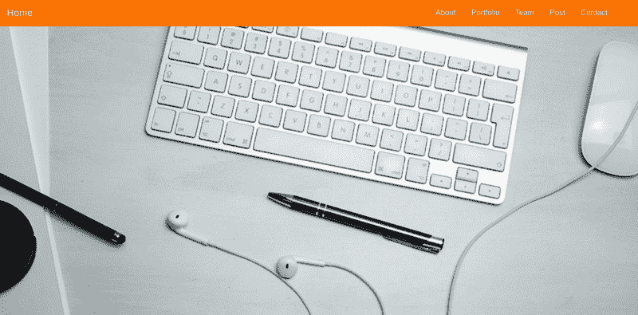

让我们添加一个覆盖，使标题看起来更专业一点:

将此添加到您的`**index.html**`文件中:

```
<header class="header">
  <div class="overlay"></div>
</header>
```

然后，将它添加到您的`**main.css**`文件中:

```
.overlay{
 position: absolute;
 min-height: 100%;
 min-width: 100%;
 left: 0;
 top: 0;
 background: rgba(244, 244, 244, 0.79);
}
```

现在我们必须在标题中添加一个描述。

为了总结我们的描述，我们首先要创建一个`div`并给它一个类`.container`。

`.container`是一个引导类，它将帮助你包装你的内容并使你的布局更具响应性:

```
<header class="header">
  <div class="overlay"></div>
   <div class="container">

   </div>

</header>
```

然后，添加另一个包含描述的`div`。

```
<div class="description ">
   <h1>    Hello ,Welcome To My official Website
    <p>    cillum dolore eu fugiat nulla pariatur. Excepteur sint occaecat cupidatat non    proident, sunt in culpa qui officia deserunt mollit anim id est laborum.
</p>   
 <button class="btn btn-outline-secondary btn-lg">See more</button>   </h1>  
</div>
```

我们将赋予它一个类`.description`并添加`.text-center`类以确保内容被放置在页面的中央。

#### 小跟班

将类`.btn btn-outline-secondary`添加到`button`元素中。还有许多其他的按钮引导类。

查看一些示例:

[**CodePen Embed —自举按钮 4**](https://codepen.io/Saidalmaghribi/embed/oEWgbw)
[*按钮按钮主按钮默认按钮危险按钮信息按钮警告按钮暗按钮成功按钮…* codepen.io](https://codepen.io/Saidalmaghribi/embed/oEWgbw)

下面是`.description`在`**main.css**`文件中的样式:

```
.description{
    position: absolute;
    top: 30%;
    margin: auto;
    padding: 2em;

}
.description h1{
 color:#F97300 ;
}
.description p{
 color:#666;
 font-size: 20px;
 width: 50%;
 line-height: 1.5;
}
.description button{
 border:1px  solid #F97300;
 background:#F97300;
 color:#fff;
}
```

完成所有这些后，我们的标题将如下所示:

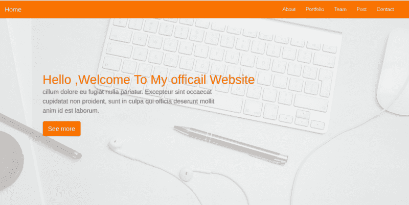

酷不是:)。

### 关于部分

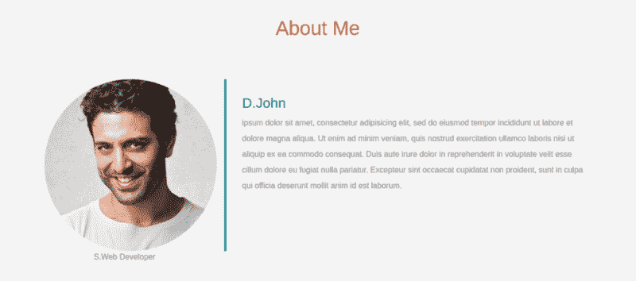

在这一节中，我们将使用一些引导网格来将这一节分成两部分。

要启动我们的网格，我们必须将`.row` 类分配给父`div`。

```
<div class="row"></div>
```

第一部分将在左边，并将包含一张图片，第二部分将在右边，并包含一个描述。

每个`div`将占据 6 列——这意味着该部分的一半。请记住，一个网格分为 12 列。

在第一个`div` 左侧:

```
<div class="row"> 
 // left side
<div class="col-lg-4 col-md-4 col-sm-12">
    
    <span class="text-justify">S.Web Developer</span>
 </div>

</div>
```

在右侧添加 HTML 元素后，代码的结构将如下所示:

```
<div class="row">
   <div class="col-lg-4 col-md-4 col-sm-12">
    
    <span class="text-justify">S.Web Developer</span>
   </div>
   <div class="col-lg-8 col-md-8 col-sm-12 desc">

    <h3>D.John</h3>
    <p>
       ipsum dolor sit amet, consectetur adipisicing elit, sed do eiusmod
     tempor incididunt ut labore et dolore magna aliqua. Ut enim ad minim veniam,
     quis nostrud exercitation ullamco laboris nisi ut aliquip ex ea commodo
     consequat. Duis aute irure dolor in reprehenderit in voluptate velit esse
     cillum dolore eu fugiat nulla pariatur. Excepteur sint occaecat cupidatat non
     proident, sunt in culpa qui officia deserunt mollit anim id est laborum.
    </p>
   </div>
  </div>
```

我是这样设计的:

```
.about{
 margin: 4em 0;
 padding: 1em;
 position: relative;
}
.about h1{
 color:#F97300;
 margin: 2em;
}
.about img{
 height: 100%;
    width: 100%;
    border-radius: 50%
}
.about span{
 display: block;
 color: #888;
 position: absolute;
 left: 115px;
}
.about .desc{
 padding: 2em;
 border-left:4px solid #10828C;
}
.about .desc h3{
 color: #10828C;
}
.about .desc p{
 line-height:2;
 color:#888;
}
```

### 投资组合部分

现在，让我们移动到下一个位，使一个组合部分，将包含一个画廊。

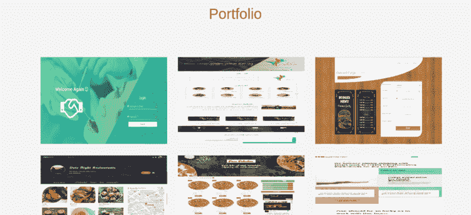

投资组合部分的 HTML 代码结构如下所示:

```
<!-- portfolio -->
<div class="portfolio">
     <h1 class="text-center">Portfolio</h1>
 <div class="container">
  <div class="row">
   <div class="col-lg-4 col-md-4 col-sm-12">
    
   </div>
   <div class="col-lg-4 col-md-4 col-sm-12">
    
   </div>
   <div class="col-lg-4 col-md-4 col-sm-12">
    
   </div>

<div class="col-lg-4 col-md-4 col-sm-12">
    
   </div>
   <div class="col-lg-4 col-md-4 col-sm-12">
    
   </div>
   <div class="col-lg-4 col-md-4 col-sm-12">
    
   </div>

<div class="col-lg-4 col-md-4 col-sm-12">
    
   </div>
   <div class="col-lg-4 col-md-4 col-sm-12">
    
   </div>
   <div class="col-lg-4 col-md-4 col-sm-12">
    
   </div>
  </div>
 </div>
</div>
```

将`.img-fluid`添加到每个图像中，使其具有响应性。

我们图库中的每个项目将占据 4 列(记住，`col-md-4`用于中型设备，`col-lg-4`用于大型设备)。那就等于 33.33333% 在台式机、大平板这样的大型设备上，一个小型设备(像 iPhone、移动设备)上的 12 列会占满 100%的容器。

让我们为我们的图库添加一些样式:

```
/*Portfolio*/
.portfolio{
 margin: 4em 0;
    position: relative; 
}
.portfolio h1{
 color:#F97300;
 margin: 2em; 
}
.portfolio img{
  height: 15rem;
  width: 100%;
  margin: 1em;

}
```

### **博客版块**


#### 卡片

Bootstrap 4 中的卡片让博客设计变得更加容易。卡片适用于文章和文章。

为了创建一张卡片，我们使用类`.card` 并将其分配给一个 *div* 元素，

卡类包含许多功能:

*   `.card-header`:定义卡片表头
*   `.card-body` : 为卡体
*   `.card-title`:卡片的标题
*   `card-footer` : 定义卡片的页脚。
*   `.card-image`:卡片的图像

所以，我们网站的 HTML 应该是这样的:

```
<!-- Posts section -->
<div class="blog">
 <div class="container">
 <h1 class="text-center">Blog</h1>
  <div class="row">
   <div class="col-md-4 col-lg-4 col-sm-12">
    <div class="card">
     <div class="card-img">
      
     </div>

     <div class="card-body">
     <h4 class="card-title">Post Title</h4>
      <p class="card-text">

       proident, sunt in culpa qui officia deserunt mollit anim id est laborum.
      </p>
     </div>
     <div class="card-footer">
      <a href="" class="card-link">Read more</a>
     </div>
    </div>
   </div>
   <div class="col-md-4 col-lg-4 col-sm-12">
    <div class="card">
     <div class="card-img">
      
     </div>

     <div class="card-body">
        <h4 class="card-title">Post Title</h4>
      <p class="card-text">

       proident, sunt in culpa qui officia deserunt mollit anim id est laborum.
      </p>
     </div>
     <div class="card-footer">
      <a href="" class="card-link">Read more</a>
     </div>
    </div>
   </div>
   <div class="col-md-4 col-lg-4 col-sm-12">
    <div class="card">
     <div class="card-img">
      
     </div>

     <div class="card-body">
     <h4 class="card-title">Post Title</h4>
      <p class="card-text">

       proident, sunt in culpa qui officia deserunt mollit anim id est laborum.
      </p>
     </div>
     <div class="card-footer">
      <a href="" class="card-link">Read more</a>
     </div>
    </div>
   </div>
  </div>
 </div>
</div>
```

我们需要给卡片添加一些 CSS 样式:

```
.blog{
 margin: 4em 0;
 position: relative; 
}
.blog h1{
 color:#F97300;
 margin: 2em; 
}
.blog .card{
 box-shadow: 0 0 20px #ccc;
}
.blog .card img{
 width: 100%;
 height: 12em;
}
.blog .card-title{
 color:#F97300;

}
.blog .card-body{
 padding: 1em;
}
```

将博客部分添加到我们的网站后，设计看起来应该是这样的:

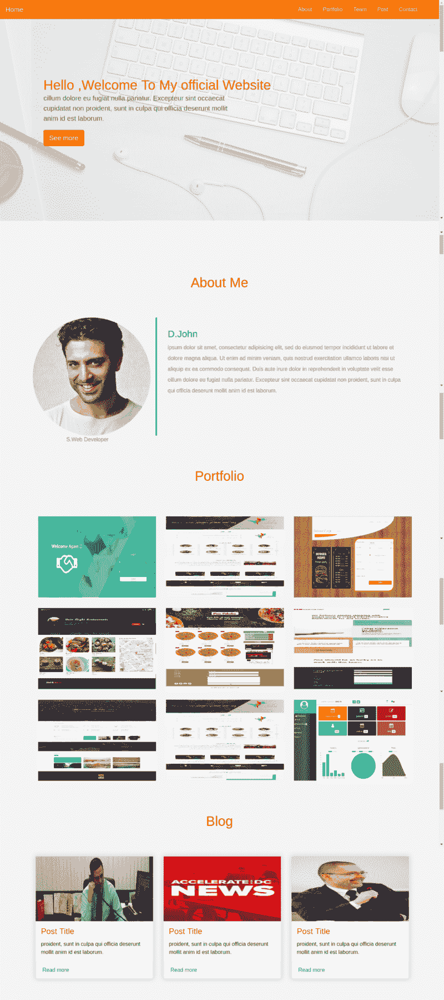

很酷不是吗？？

### **团队部分**

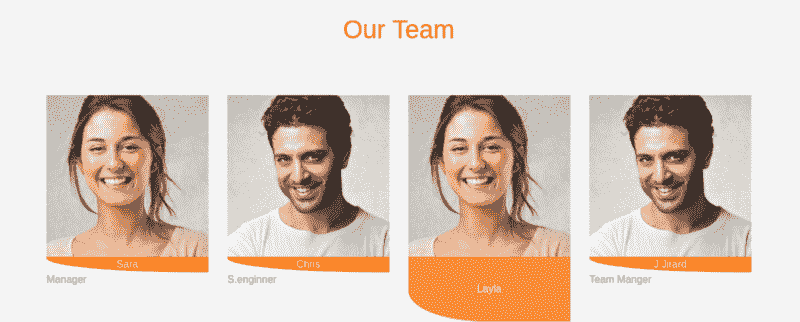

在这一节中，我们将使用网格系统来均匀分布图像之间的空间。每个图像占据容器的 3 列(`**.col-md-3**`)——相当于总空间的 25%。

我们的 HTML 结构:

```
<!-- Team section -->
<div class="team">
 <div class="container">
    <h1 class="text-center">Our Team</h1>
  <div class="row">
   <div class="col-lg-3 col-md-3 col-sm-12 item">
    
    <div class="des">
      Sara
     </div>
    <span class="text-muted">Manager</span>
   </div>
   <div class="col-lg-3 col-md-3 col-sm-12 item">
    
    <div class="des">
       Chris
     </div>
    <span class="text-muted">S.enginner</span>
   </div>
   <div class="col-lg-3 col-md-3 col-sm-12 item">
    
    <div class="des">
      Layla 
     </div>
    <span class="text-muted">Front End Developer</span>
   </div>
   <div class="col-lg-3 col-md-3 col-sm-12 item">
    
     <div class="des">
      J.Jirard
     </div>
    <span class="text-muted">Team Manger</span>
   </div>
  </div>
 </div>
</div>
```

让我们添加一些风格:

```
.team{
 margin: 4em 0;
 position: relative;  
}
.team h1{
 color:#F97300;
 margin: 2em; 
}
.team .item{
 position: relative;
}
.team .des{
 background: #F97300;
 color: #fff;
 text-align: center;
 border-bottom-left-radius: 93%;
 transition:.3s ease-in-out;

}
```

使用动画在悬停时给图像添加一个覆盖层会很好吗？。

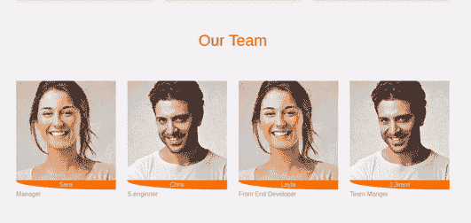

为了产生这种效果，将下面的样式添加到`**main.css**`文件中:

```
.team .item:hover .des{
 height: 100%;
 background:#f973007d;
 position: absolute;
 width: 89%;
 padding: 5em;
 top: 0;
 border-bottom-left-radius: 0;
}
```

超级爽！？

### 联系方式


联系方式是最后一个要添加的部分，那么我们就完成了？。

联系表单部分将包含一个表单，访问者可以通过它发送电子邮件或给出反馈。我们将使用一些引导类来使设计美观和响应。

和 Bootstrap 3 一样，Bootstrap 4 也为输入字段使用了`.form-control`类，但是增加了一些新功能——比如从`.input-group-addon` (已弃用)切换到`**.input-group-prepend**` (使用图标作为标签)。

更多信息参见 [Bootstrap 4 文档](https://getbootstrap.com/docs/4.0/migration/#input-groups)。在我们的联系表单中，我们将把每个输入放在一个具有类`.form-group`的`div`之间。

`**index.html**`文件现在看起来像这样:

```
<!-- Contact form -->
<div class="contact-form">
 <div class="container">
  <form>
   <div class="row">
    <div class="col-lg-4 col-md-4 col-sm-12">
      <h1>Get in Touch</h1> 
    </div>
    <div class="col-lg-8 col-md-8 col-sm-12 right">
       <div class="form-group">
         <input type="text" class="form-control form-control-lg" placeholder="Your Name" name="">
       </div>
       <div class="form-group">
         <input type="email" class="form-control form-control-lg" placeholder="YourEmail@email.com" name="email">
       </div>
       <div class="form-group">
         <textarea class="form-control form-control-lg">

         </textarea>
       </div>
       <input type="submit" class="btn btn-secondary btn-block" value="Send" name="">
    </div>
   </div>
  </form>
 </div>
</div>
```

联系人部分的样式:

**main.css**

```
.contact-form{
 margin: 6em 0;
 position: relative;  
}

.contact-form h1{
 padding:2em 1px;
 color: #F97300; 
}
.contact-form .right{
 max-width: 600px;
}
.contact-form .right .btn-secondary{
 background:  #F97300;
 color: #fff;
 border:0;
}
.contact-form .right .form-control::placeholder{
 color: #888;
 font-size: 16px;
}
```

#### 字体

我认为默认字体很难看，所以我们将使用谷歌字体 API，我们将选择 **Raleway** ，这是一种很好的字体，适合我们的模板。

将此链接添加到您的`**main.css**`文件中:

```
@import url('https://fonts.googleapis.com/css?family=Raleway');
```

并将全局样式设置为 HTML 和标题标签:

```
html,h1,h2,h3,h4,h5,h6,a{
 font-family: "Raleway";
}
```

#### **滚动效果**


最后缺少的是滚动效果。这里，我们必须使用一些 JQuery。如果您不熟悉 worry️，只需将此代码添加到您的`**main.js**` 文件中:

```
$(".navbar a").click(function(){
  $("body,html").animate({
   scrollTop:$("#" + $(this).data('value')).offset().top
  },1000)

 })
```

并为每个导航栏链接添加一个`data-value`属性:

```
<li class="nav-item">
         <a class="nav-link" data-value="about" href="#">About</a>
       </li>
       <li class="nav-item">
         <a class="nav-link " data-value="portfolio" href="#">Portfolio</a>
       </li>
       <li class="nav-item">
         <a class="nav-link " data-value="blog" href="#">Blog</a>
       </li>
       <li class="nav-item">
         <a class="nav-link " data-value="team" href="#">
         Team</a>
       </li>
       <li class="nav-item">
         <a class="nav-link " data-value="contact" href="#">Contact</a>
       </li>
```

为每个部分设置一个`id`属性。

**注意**:为了滚动工作，`id`必须与导航栏链接中的`data-value`属性相同；

```
<div class="about" id="about"></div>
```

### 总结和结论

Bootstrap 4 是构建 web 应用程序的绝佳选择。它提供了高质量的 UI 元素，并且易于定制、集成和使用。它也将帮助你在你的网站中包含响应性，从而为你的用户提供优质的用户体验。

你会在 [GitHub](https://github.com/hayanisaid/bootstrap4-website) 上找到该项目的文件。

> 如果你需要一些引导主题和模板，你可以看看 [BootstrapBay](https://bootstrapbay.sjv.io/DV1q2) ，他们有一些很棒的产品

查看我的 Bootstrap 类，了解 Bootstrap 4:

[**Bootstrap 4 速成班:基础进阶|说 Hayani | Skillshare**](https://skl.sh/2LaD1ym)
[*在这个班里你将学习 Bootstrap 4 版本，CSS 框架构建灵活的模板和…* skl.sh](https://skl.sh/2LaD1ym)