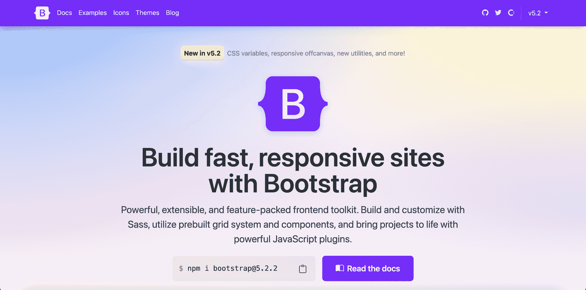
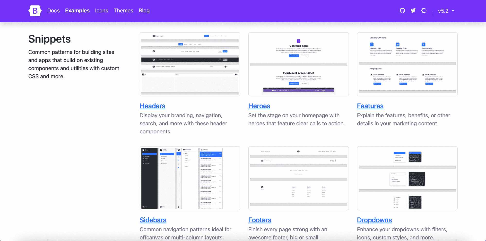
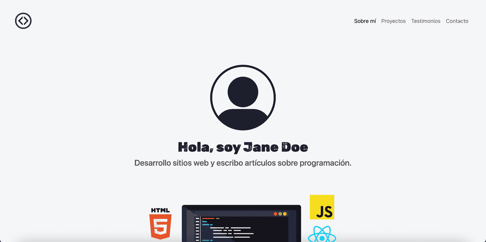
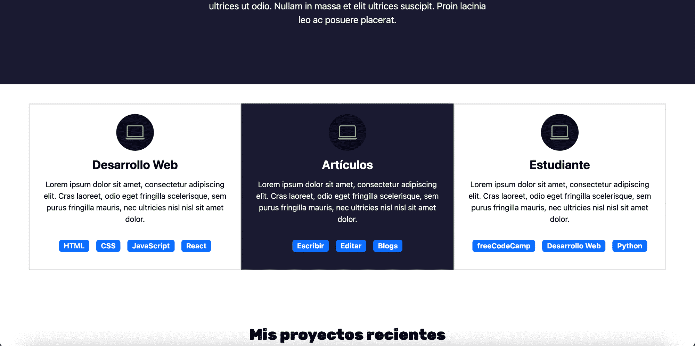
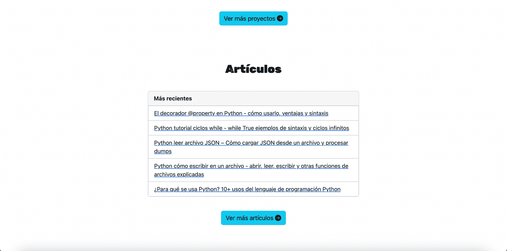
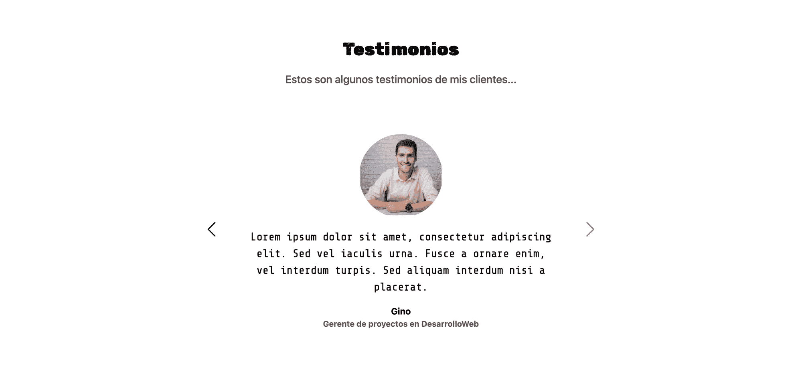
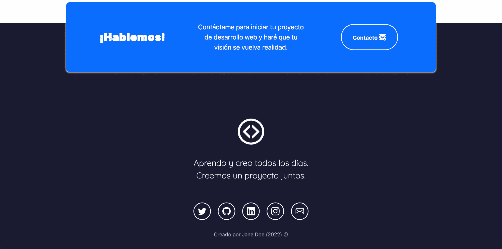
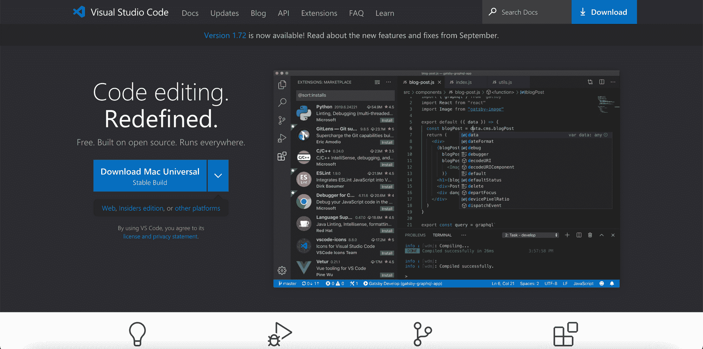
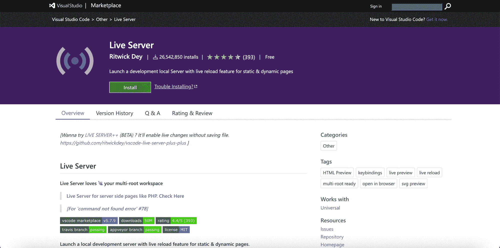
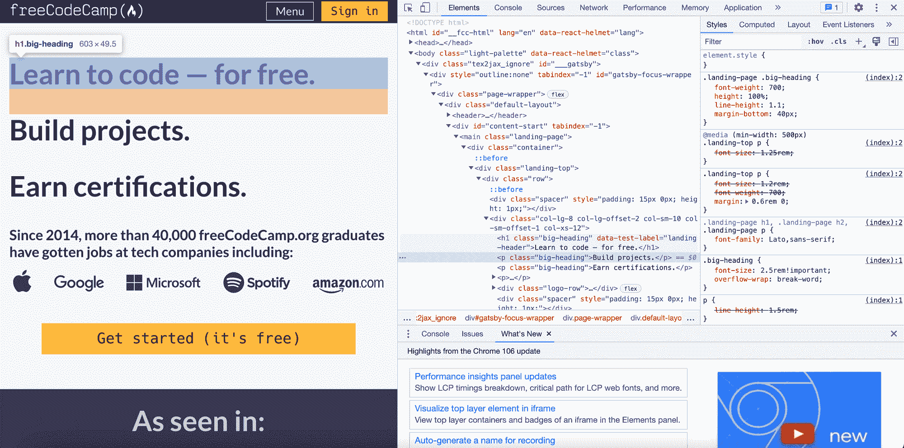

# 通过建立作品集网站学习西班牙语 Bootstrap 5——初学者 Bootstrap 课程

> 原文：<https://www.freecodecamp.org/news/learn-bootstrap-5-in-spanish-by-building-a-portfolio-website-bootstrap-course-for-beginners/>

欢迎光临！如果你说西班牙语，你想练习你的 HTML 和 CSS 技能，用 Bootstrap 5 创建响应网站，并建立你的作品集网站，那么这个课程是为你准备的。

在本文中，您将会看到对响应式 web 开发和 Bootstrap 5 的简要介绍。如果你的目标是成为一名前端 web 开发人员，你还会学到为什么要学习它们。

然后，你会在 freeCodeCamp 西班牙语 YouTube 频道上找到一个 5 小时的 Bootstrap 5 课程。在本课程中，您可以学习西班牙语的基础知识，并使用引导组件、图标和网格逐步构建您的投资组合网站。

如果你有说西班牙语的朋友，欢迎你把这篇文章的 西班牙语版 ********[分享给他们。](https://www.freecodecamp.org/espanol/news/aprende-bootstrap-5-en-espanol-creando-tu-portafolio-personal-curso-de-bootstrap-desde-cero)********

**💡提示:**要参加这个课程，你应该先有 HTML 和 CSS 的知识。如果你需要复习这些话题，我邀请你在[西班牙语 YouTube 频道](https://www.youtube.com/freecodecampespanol)上参加我们的全部课程。

我们开始吧！✨

## 🔹什么是自举？

我们先来介绍一下 Bootstrap。官方引导文档将其定义为:

> 强大、可扩展、功能丰富的前端工具包。

Bootstrap 5 - Official Website

让我们更仔细地看看这个定义的主要关键词:

*   bootstrap**功能强大**，因为它有许多特性，包括预定义的 CSS 类，你可以将它们应用到你的 HTML 元素中，以立即分配样式。使用 Bootstrap，您还可以使用强大的 JavaScript 插件来创建元素，如传送带、模态、工具提示等等。
*   Bootstrap 是**可扩展的**,因为您可以扩展或定制 Bootstrap 附带的预定义 CSS 类来满足您的需求。如果你需要改变颜色，你可以使用定制的 CSS 选择器、id 和类来实现。您还可以定制支持某些引导组件的 JavaScript 代码。
*   Bootstrap 用于**前端** web 开发，因为这一领域的 web 开发侧重于设计和开发用户界面，即用户可以直接看到并与之交互的网站部分。

**💡提示:**基本上，Bootstrap 为您提供了开发具有预定义组件、图标和样式的响应式网站所需的所有工具。

Examples of Bootstrap Components ([source](https://getbootstrap.com/docs/5.2/examples/))

## 🔶创建开发人员组合的重要性

开发你的作品集网站对于展示你的知识、技能和你在学习过程中参与的项目非常重要。

想想看...

证明你的知识和技能的最好方法是什么？

答案是:**创建真实世界的项目。**

这正是雇主所寻找的——能够学习新技术并将其应用于新场景的开发人员。

创建一个项目是一个很好的方式来展示你有合适的技能和动力去做一名 web 开发人员。

太好了。现在你知道为什么创建你的开发者作品集是重要的，所以让我们看看你将要创建的作品集网站。🔅

## 🔸课程项目

这是我们将在课程中构建的作品集网站项目的主要结构:

### 英雄部分和关于我的部分

此部分将有一个导航栏和一个个人资料图像。导航条会有反应。汉堡图标将显示在小设备上(而不是导航条上),文本将自动隐藏。

### **体验部分**

这一部分将包括三个不同的知识领域和徽章，以突出特定的技能。这一部分将有反应，它将有一个悬停效果，以增加互动性。

### **项目部**

这一部分将包括到 GitHub 库和项目实时版本的链接。我们将使用引导网格创建此部分，因此它将完全响应，并且您将学习使用网格断点。

### **文章章节**

文章或博客帖子的列表。这些将是引导卡和列表组。每篇文章将由一个链接表示，该链接将在一个新的选项卡上打开。

### **感言部分**

客户证明旋转木马。这将是一个引导转盘组件，具有三个证明和控制器，以移动到转盘中的上一个或下一个项目。

### **联系我部分和页脚**

这一部分将有链接到社会媒体简介，它将显示网站的版权。社交媒体链接将是定制的引导图标。

### **幕后**

我们将与以下各方合作:

*   引导网格使网站适应不同尺寸的设备。
*   引导组件，包括按钮、转盘、响应导航栏、响应图像、卡片、列表组等等。
*   引导图标，用于添加社交媒体资料的链接(Twitter、GitHub、LinkedIn 和 Instagram)。
*   语义 HTML 标签，如`<header>`、`<section>`和`<footer>`。
*   媒体查询使 HTML 元素适应不同大小和方向的设备。
*   CSS 选择器
*   谷歌字体
*   更多！

你将通过建立这个项目练习许多不同的技能，当你完成它时，你将有一个完全响应的专业组合来展示你的技能。

听起来很棒，对吧？

💡**提示:**在创建网站的基本结构后，您可以使用您独特的个人资料图像、技能和项目对其进行定制。

## 🔹开发工具

我们将使用开发人员在日常工作中使用的多种工具。

### [Visual Studio 代码](https://code.visualstudio.com/)

由微软创建的强大而流行的代码编辑器。可以从其官网免费下载安装。

Visual Studio Code - Official Website

### [Visual Studio 代码的 Live 服务器扩展](https://marketplace.visualstudio.com/items?itemName=ritwickdey.LiveServer)

一个非常有用的扩展，当我们更改 HTML 或 CSS 文件时，它可以通过刷新浏览器来帮助我们提高工作效率。

Live Server - Documentation in the Extensions Marketplace

### [Chrome 开发者工具](https://developer.chrome.com/docs/devtools/)

谷歌 Chrome 浏览器内置的一套开发者工具。它们非常有助于测试网站的响应性，选择 HTML 结构中的元素，以及预览 HTML 和 CSS 文件中的更改。

Chrome Developer Tools - freeCodeCamp

💡**提示:**我们将在课程中下载并安装所有必要的工具，您将逐步学习如何使用它们。

## 🔸YouTube 上的课程

太棒了。现在你对 Bootstrap 5 有了更多的了解，知道了创建专业作品集的重要性。你也看到了你将在课程中学到的东西。

如果你准备好了，我们邀请你开始参加 YouTube 频道的课程:

[https://www.youtube.com/embed/QCw0L6FupQ0?feature=oembed](https://www.youtube.com/embed/QCw0L6FupQ0?feature=oembed)

💻在这个链接中，你可以访问 [live 项目](https://estefaniacn.github.io/portafolio-adaptable-bootstrap/)(西班牙语)，练习如何使用 Chrome 开发者工具。

由********estefan ia cassingena navone********创建的✍️球场(Twitter: [@EstefaniaCassN](https://twitter.com/EstefaniaCassN) ，YouTube: [用 Estefania](https://youtube.com/codingwithestefania) 编码)。

我真的希望你喜欢这个课程，并发现它有助于创建你的开发者作品集。

也欢迎您继续学习我们的 ****************西班牙语****************课程:

[https://www.youtube.com/embed/XqFR2lqBYPs?feature=oembed](https://www.youtube.com/embed/XqFR2lqBYPs?feature=oembed)

[https://www.youtube.com/embed/ivdTnPl1ND0?feature=oembed](https://www.youtube.com/embed/ivdTnPl1ND0?feature=oembed)

[https://www.youtube.com/embed/DLikpfc64cA?feature=oembed](https://www.youtube.com/embed/DLikpfc64cA?feature=oembed)

[https://www.youtube.com/embed/6Jfk8ic3KVk?feature=oembed](https://www.youtube.com/embed/6Jfk8ic3KVk?feature=oembed)

[https://www.youtube.com/embed/1hpc70_OoAg?feature=oembed](https://www.youtube.com/embed/1hpc70_OoAg?feature=oembed)