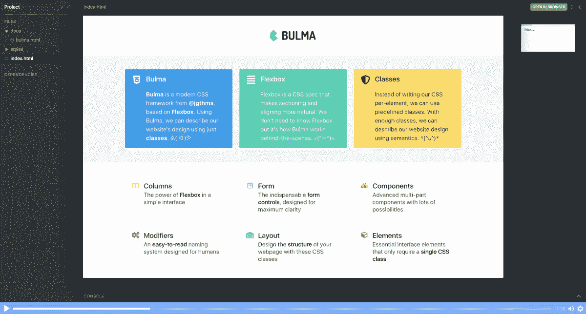
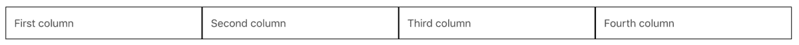
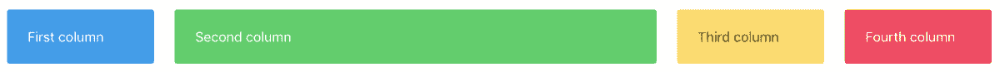
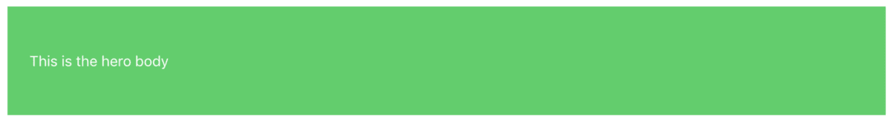
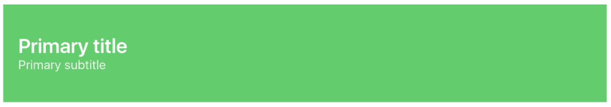
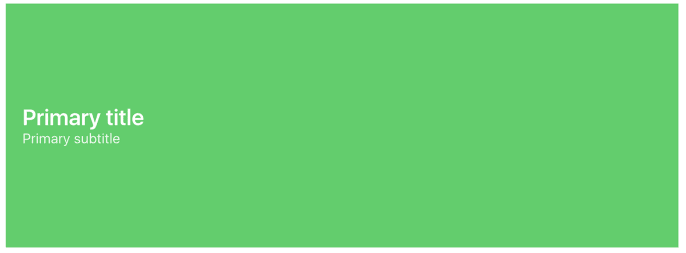

# 5 分钟学会布尔玛 CSS 初学者教程

> 原文：<https://www.freecodecamp.org/news/learn-bulma-in-5-minutes-ec5188c53e83/>

布尔玛是一个简单、优雅、现代的 CSS 框架，比起 Bootstrap，很多开发人员更喜欢它。我个人认为布尔玛默认有一个更好的设计，它也感觉更轻。

在本教程中，我将给你一个超级快速的图书馆介绍。

我们还创建了一个免费的布尔玛课程。点击此处查看！



*[*You can* here *to get to the course.*](https://scrimba.com/g/gbulma?utm_source=freecodecamp.org&utm_medium=referral&utm_campaign=gbulma_5_minute_article)*

### 设置

设置布尔玛超级简单，你可以用几种不同的方式来完成，无论你喜欢 [NPM](https://www.npmjs.com/package/bulma) ，直接从文档下载[，还是使用](https://bulma.io/) [CDN](https://cdnjs.cloudflare.com/ajax/libs/bulma/0.6.2/css/bulma.min.css) 。我们将从 HTML 文件中链接到一个 CDN，如下所示:

```
<link rel="stylesheet" href="https://cdnjs.cloudflare.com/ajax/libs/bulma/0.6.2/css/bulma.min.css"> 
```

这将使我们能够进入布尔玛的课堂。这实际上就是布尔玛的全部——一个类的集合。

### 修饰语

关于布尔玛你应该学习的第一件事是修改器类。这些允许你为几乎所有的布尔玛元素设置不同的风格。都是以`is-*`或者`has-*`开头，然后你把`*`换成你想要的风格。

为了正确理解这个概念，让我们从按钮开始。

### 小跟班

为了把一个普通的按钮变成布尔玛按钮，我们简单地给它一个`button`类。

```
<button class="button">Click here</button> 
```

这导致了以下样式:


如你所见，默认情况下，它有一个漂亮的平面设计。为了改变样式，我们将使用布尔玛修改器。让我们从把按钮做得更大、绿色、圆角开始:

```
<button class="button **is-large is-success is-rounded**">Click here</button> 
```

这个结果是一个好看的按钮:


您还可以使用修饰符来控制按钮的状态。例如，让我们添加类`is-focused`，它在它周围添加一个边框:


最后，让我们也使用一个`has-*`修饰符。这些通常控制元素内部的内容。在我们的例子中，文本。再加上`has-text-weight-bold`吧。

结果如下:


我建议您尝试一下各种类的组合，以便理解这个系统有多灵活。组合几乎是无穷无尽的。查看文档中的[按钮部分](https://bulma.io/documentation/elements/button/)了解更多信息。

### 列

任何 CSS 框架的核心都是它们如何解决列的问题，因为这几乎与你将要构建的每个网站都相关。布尔玛是基于 Flexbox 的，所以创建列非常简单。让我们创建一个包含四列的行。

```
<div class="columns">  
  <div class="column">First column</div>
  <div class="column">Second column</div>
  <div class="column">Third column</div>
  <div class="column">Fourth column</div>
</div> 
```

首先，我们用一个类`columns`创建一个容器`<div>`，然后我们给每个孩子一个类`column`。它会导致以下结果:



我还在柱子周围添加了边框，让它们看起来更明显。

请注意，您可以添加任意多的列。Flexbox 负责在它们之间平均分配空间。

为了给列着色，我们可以用一个`<p>`标签替换列中的文本，并给它一个`notification`类和一个`is-*`修饰符。像这样举个例子:

第一列

让我们使用`is-info`、`is-success`、`is-warning`和`is-danger`修饰符来做这件事，结果如下:


`notification`类实际上是为了提醒用户一些事情，因为它允许你使用`is-*`修改器用一种颜色填充背景。在这里，它可以很好地分离列。

我们也可以很容易地控制一列的宽度。让我们将`is-half`修改器添加到绿色栏中。

```
<div class="column is-half"> 
```

这导致第二列现在占据一半的宽度，而其他三列各占据剩余一半的三分之一。



以下是可用于控制列宽的选项:

*   `is-three-quarters`
*   `is-two-thirds`
*   `is-half`
*   `is-one-third`
*   `is-one-quarter`
*   `is-four-fifths`
*   `is-three-fifths`
*   `is-two-fifths`
*   `is-one-fifth`

### 海罗（人名）；英雄（电影名）

最后，让我们也学习如何在布尔玛创造一个英雄。我们将使用语义`<section>`，并给它一个类`hero`和`is-info`，给它一些颜色。我们还需要用类`hero-body`添加一个`<div>`孩子。

```
<section class="hero is-success"> 
```



为了让这个英雄做一些有意义的事情，我们将在主体中添加一个容器元素，并添加一个标题和副标题。

```
<div class="container">
  <h1 class="title">Primary title</h1>
  <h2 class="subtitle">Primary subtitle</h2>
</div> 
```



现在开始好看了！如果我们希望它更大，我们可以简单地在`<section>`标签上添加`is-medium`。

```
<section class="hero is-info is-medium">  ...</section> 
```



就是这样！

你现在已经对布尔玛的工作方式有了基本的了解。最棒的是，这个库的其余部分就像你到目前为止看到的概念一样直观和简单。所以，如果你理解了这一点，你就会毫不费力地理解它的其余部分。

如果你想了解更多，一定要查看 Scrimba 上的[免费布尔玛课程！](https://scrimba.com/g/gbulma?utm_source=freecodecamp.org&utm_medium=referral&utm_campaign=gbulma_5_minute_article)

* * *

感谢阅读！我的名字叫 Per Borgen，我是最简单的学习编码方法——Scrimba 的联合创始人。如果你想学习建立专业水平的现代网站，你应该看看我们的[响应式网页设计训练营](https://scrimba.com/g/gresponsive?utm_source=freecodecamp.org&utm_medium=referral&utm_campaign=gbulma_5_minute_article)。


[Click here to get to the advanced bootcamp.](https://scrimba.com/g/gresponsive?utm_source=freecodecamp.org&utm_medium=referral&utm_campaign=gbulma_5_minute_article)