# 通过构建 TODO APP 学习 JavaScript 中的 CRUD 操作

> 原文：<https://www.freecodecamp.org/news/learn-crud-operations-in-javascript-by-building-todo-app/>

今天我们将通过制作一个 to do 应用程序来学习如何用 JavaScript 进行 CRUD 操作。我们开始吧🔥

这是我们今天制作的应用程序:

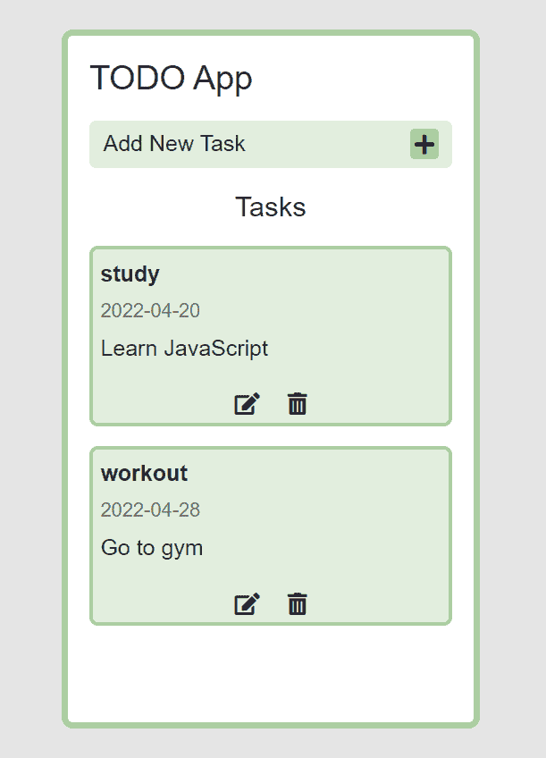

*   [实时预览](https://crud-application-al9am9v2v-joyshaheb.vercel.app/)
*   [GitHub 库](https://github.com/JoyShaheb/CRUD-Application)

## 如果你喜欢，你也可以在 YouTube 上观看这个教程🎥

[https://www.youtube.com/embed/fL9cts8ykbU?feature=oembed](https://www.youtube.com/embed/fL9cts8ykbU?feature=oembed)

# 目录

*   什么是 CRUD？
*   理解 CRUD 原则
*   如何使用 CRUD 操作制作待办 App

## 什么是 CRUD？


CRUD 代表-

*   c:创建
*   r:阅读
*   u:更新
*   删除

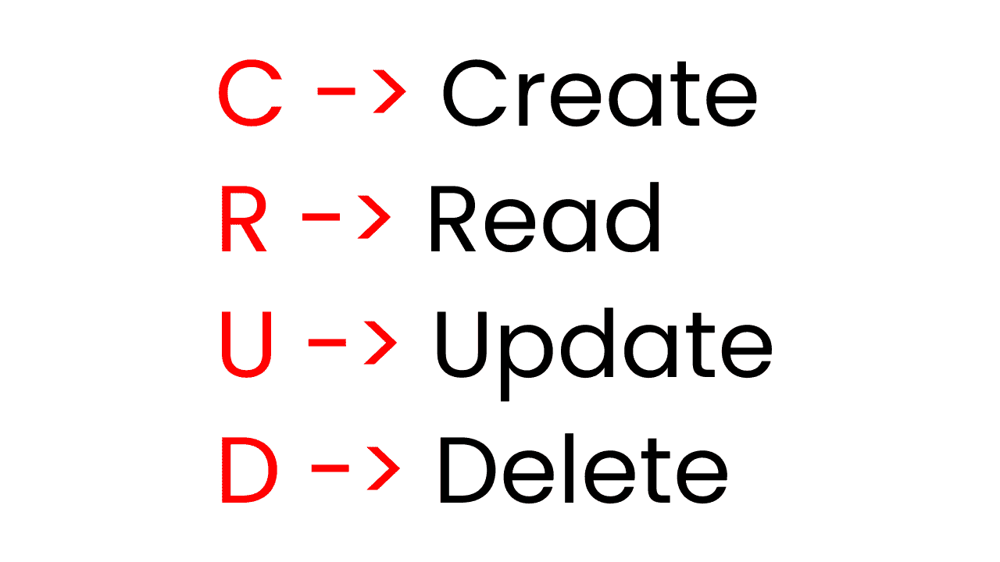

CRUD 是一种允许您创建数据、读取数据、编辑数据和删除数据的机制。在我们的例子中，我们将创建一个 Todo 应用程序，因此我们将有 4 个选项来创建任务、读取任务、更新任务或删除任务。

## 理解 CRUD 原则

在开始教程之前，首先，让我们了解 CRUD 原理。为此，让我们创建一个非常非常简单的社交媒体应用程序。

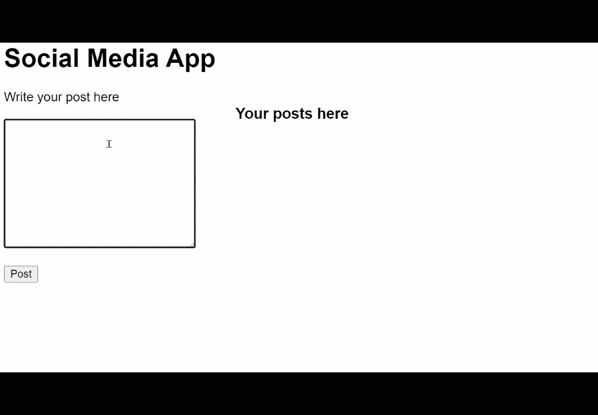

## 设置

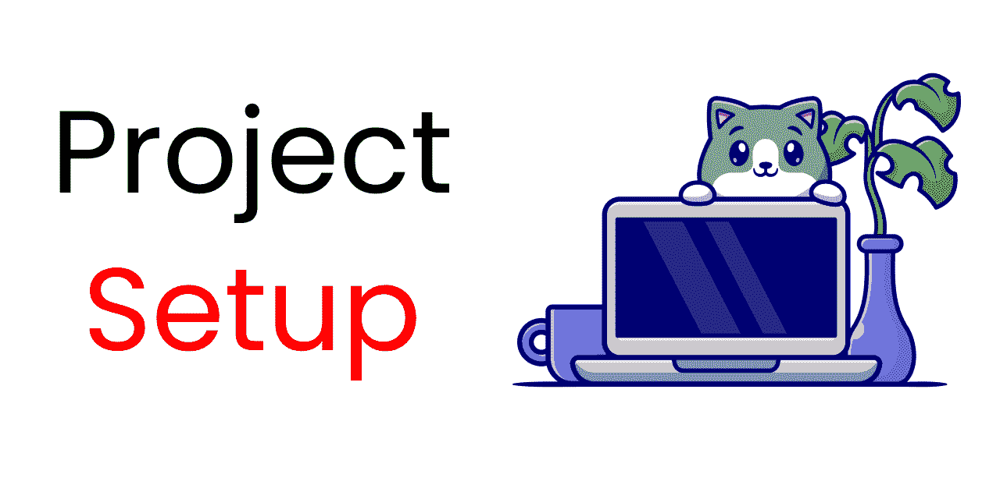

对于这个项目，我们将遵循以下步骤:

*   创建 3 个名为 index.html、style.css 和 main.js 的文件
*   将 JavaScript 和 CSS 文件链接到 index.html
*   启动您的实时服务器

### 超文本标记语言

在 body 标签中，创建一个类名为`.container`的 div。在那里，我们将有两个部分，`.left`和`.right`👇

```
<body>
  <h1>Social Media App</h1>
  <div class="container">

    <div class="left"></div>
    <div class="right"></div>

  </div>
</body> 
```

在左侧，我们将创建我们的帖子。在右侧，我们可以查看、更新和删除我们的帖子。现在，在。左 div 标签👇

```
<div class="left">
  <form id="form">
    <label for="post"> Write your post here</label>
    <br><br>
    <textarea name="post" id="input" cols="30" rows="10"></textarea>
    <br> <br>
    <div id="msg"></div>
    <button type="submit">Post</button>
  </form>
</div> 
```

在 HTML 中编写这段代码，这样我们就可以在右侧显示我们的帖子👇

```
<div class="right">
  <h3>Your posts here</h3>
  <div id="posts"></div>
</div> 
```

接下来，我们将在 head 标签中插入字体非常棒的 CDN，以便在我们的项目中使用它的字体👇

```
<link rel="stylesheet" href="https://cdnjs.cloudflare.com/ajax/libs/font-awesome/5.15.4/css/all.min.css" /> 
```

现在，我们将制作一些带有删除和编辑图标的示例帖子。在 id 为#posts 的 div 中编写以下代码:👇

```
<div id="posts">
  <div>
    <p>Hello world post 1</p>
    <span class="options">
      <i class="fas fa-edit"></i>
      <i class="fas fa-trash-alt"></i>
    </span>
  </div>

  <div >
    <p>Hello world post 2</p>
    <span class="options">
      <i class="fas fa-edit"></i>
      <i class="fas fa-trash-alt"></i>
    </span>
  </div>
</div> 
```

到目前为止，结果如下:

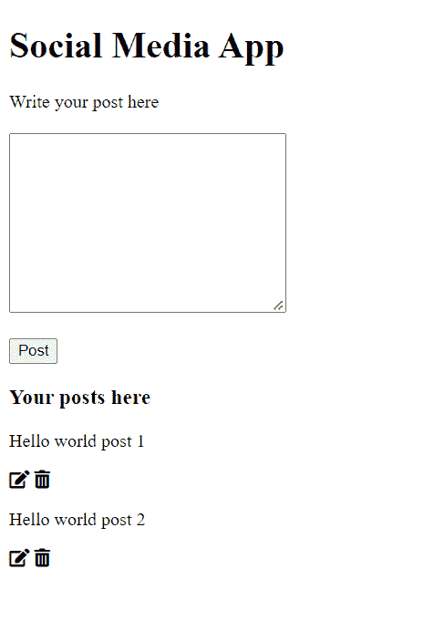

### 半铸钢ˌ钢性铸铁(Cast Semi-Steel)

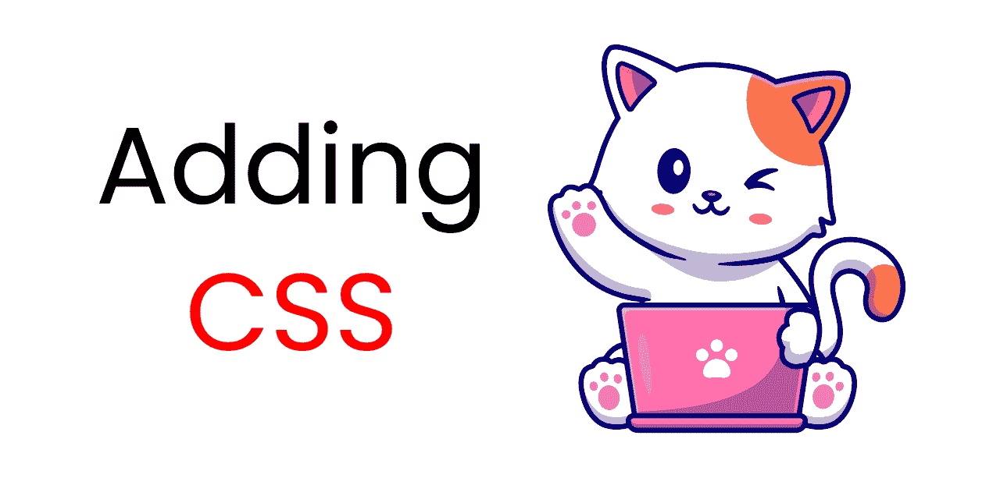

让我们保持简单。在样式表中编写这些样式:👇

```
body {
  font-family: sans-serif;
  margin: 0 50px;
}

.container {
  display: flex;
  gap: 50px;
}

#posts {
  width: 400px;
}

i {
  cursor: pointer;
} 
```

现在，为 post div 和 option 图标编写以下样式:👇

```
#posts div {
  display: flex;
  align-items: center;
  justify-content: space-between;
}

.options {
  display: flex;
  gap: 25px;
}

#msg {
  color: red;
} 
```

到目前为止的结果如下:👇

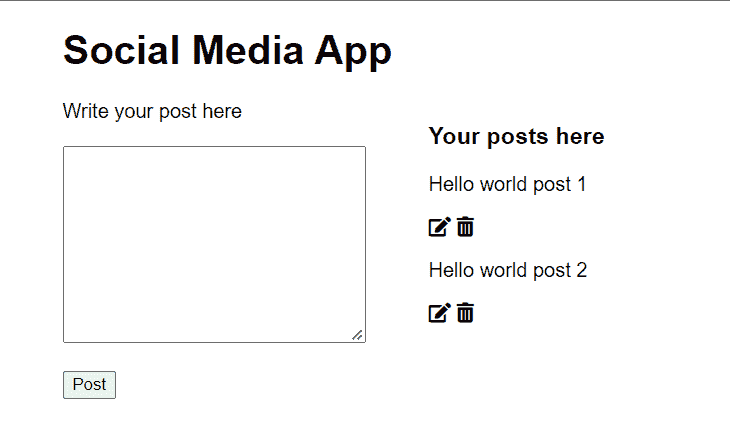

### JavaScript 部分

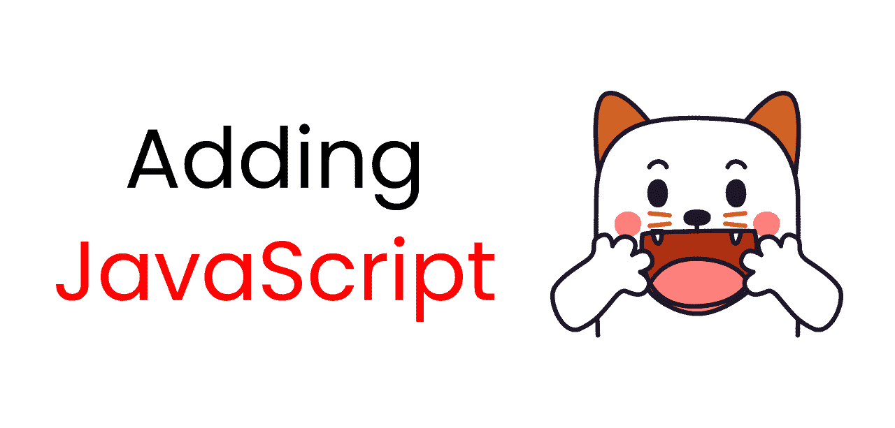

根据这个流程图，我们将继续进行这个项目。别担心，一路上我会解释一切的。👇

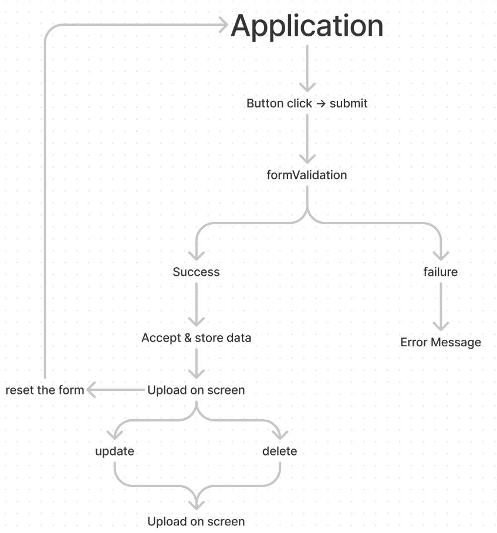

#### 表单验证

首先，让我们以 JavaScript 中 HTML 的所有 ID 选择器为目标。像这样:👇

```
let form = document.getElementById("form");
let input = document.getElementById("input");
let msg = document.getElementById("msg");
let posts = document.getElementById("posts"); 
```

然后，为表单构建一个提交事件监听器，这样它就可以阻止我们的应用程序的默认行为。同时，我们将创建一个名为`formValidation`的函数。👇

```
form.addEventListener("submit", (e) => {
  e.preventDefault();
  console.log("button clicked");

  formValidation();
});

let formValidation = () => {}; 
```

现在，我们将在我们的`formValidation`函数中创建一个 if else 语句。这将有助于我们防止用户提交空白输入字段。👇

```
let formValidation = () => {
  if (input.value === "") {
    msg.innerHTML = "Post cannot be blank";
    console.log("failure");
  } else {
    console.log("successs");
    msg.innerHTML = "";
  }
}; 
```

以下是目前为止的结果:👇

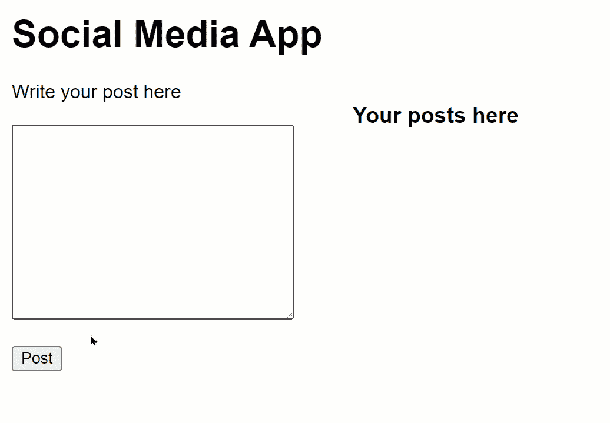

如您所见，如果用户试图提交空白表单，也会显示一条消息。

#### 如何从输入字段接受数据

无论我们从输入字段获得什么数据，我们都将它们存储在一个对象中。让我们创建一个名为`data`的对象。并且，创建一个名为`acceptData`的函数:👇

```
let data = {};

let acceptData = () => {}; 
```

主要思想是，使用函数，我们从输入中收集数据，并将它们存储在名为`data`的对象中。现在让我们完成构建我们的`acceptData`函数。

```
let acceptData = () => {
  data["text"] = input.value;
  console.log(data);
}; 
```

此外，当用户单击提交按钮时，我们需要使用`acceptData`函数。为此，我们将在我们的`formValidation`函数的 else 语句中触发这个函数。👇

```
let formValidation = () => {
  if (input.value === "") {
    // Other codes are here
  } else {
    // Other codes are here
    acceptData();
  }
}; 
```

当我们输入数据并提交表单时，在控制台上我们可以看到一个保存用户输入值的对象。像这样:👇

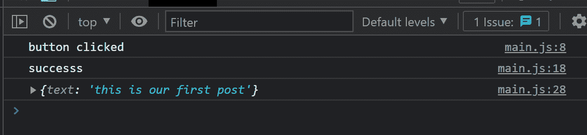

#### 如何使用 JavaScript 模板文字创建帖子

为了在右侧发布输入数据，我们需要创建一个 div 元素，并将其附加到 posts div 中。首先，让我们创建一个函数，并编写以下代码行:👇

```
let createPost = () => {
  posts.innerHTML += ``;
}; 
```

反斜线是模板文字。它将成为我们的模板。这里，我们需要 3 样东西:一个父 div、输入本身和带有编辑和删除图标的选项 div。让我们完成我们的功能👇

```
let createPost = () => {
  posts.innerHTML += `
  <div>
    <p>${data.text}</p>
    <span class="options">
      <i onClick="editPost(this)" class="fas fa-edit"></i>
      <i onClick="deletePost(this)" class="fas fa-trash-alt"></i>
    </span>
  </div>
  `;
  input.value = "";
}; 
```

在我们的`acceptdata`函数中，我们将触发我们的`createPost`函数。像这样:👇

```
let acceptData = () => {
  // Other codes are here

  createPost();
}; 
```

目前的结果是:👇


到目前为止，好家伙，我们几乎完成了项目 1。


#### 如何删除帖子

为了删除一篇文章，首先，让我们在 javascript 文件中创建一个函数:

```
let deletePost = (e) => {}; 
```

接下来，我们使用 onClick 属性在所有删除图标中触发这个`deletePost`函数。您将在 HTML 和模板文本上写下这些行。👇

```
<i onClick="deletePost(this)" class="fas fa-trash-alt"></i> 
```

`this`关键字将引用触发事件的元素。在我们的例子中，`this`指的是删除按钮。

仔细看，删除按钮的父项是 span with class name 选项。span 的父级是 div。所以，我们写了两次`parentElement`,这样我们就可以从删除图标跳转到 div 并直接指向它来删除它。

让我们完成我们的功能。👇

```
let deletePost = (e) => {
  e.parentElement.parentElement.remove();
}; 
```

目前的结果是:👇

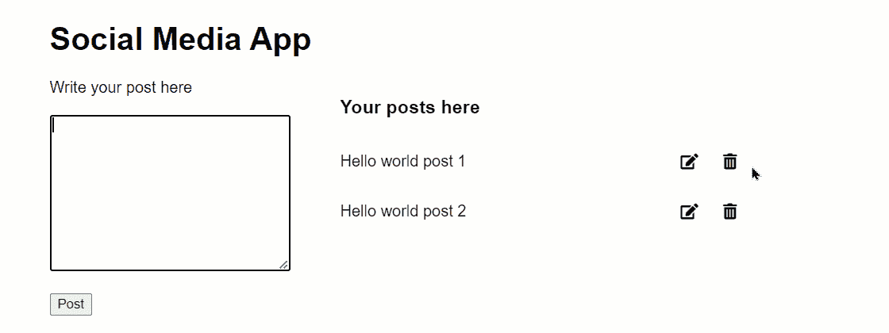

#### 如何编辑帖子

为了编辑一篇文章，首先，让我们在 JavaScript 文件中创建一个函数:

```
let editPost = (e) => {}; 
```

接下来，我们使用 onClick 属性在所有编辑图标中触发这个`editPost`函数。您将在 HTML 和模板文本上写下这些行。👇

```
<i onClick="editPost(this)" class="fas fa-edit"></i> 
```

`this`关键字将引用触发事件的元素。在我们的例子中，`this`指的是编辑按钮。

仔细看，编辑按钮的父项是 span with class name 选项。span 的父级是 div。所以，我们写了两次`parentElement`,这样我们就可以从编辑图标跳到 div，并直接指向它来删除它。

然后，无论文章中有什么数据，我们都将其放回输入字段进行编辑。

让我们完成我们的功能。👇

```
let editPost = (e) => {
  input.value = e.parentElement.previousElementSibling.innerHTML;
  e.parentElement.parentElement.remove();
}; 
```

目前的结果是:👇

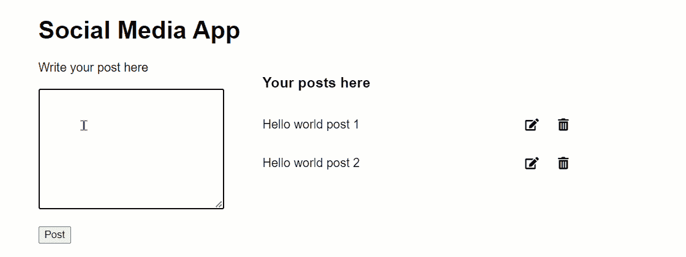

## 休息一下！


祝贺大家完成项目 1。现在，稍微休息一下！

# 如何使用 CRUD 操作制作待办 App


让我们开始做项目 2，这是一个待办事项 App。

## 项目设置

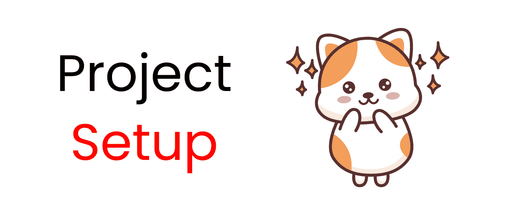

对于这个项目，我们将遵循以下步骤:

*   创建 3 个名为 index.html、style.css 和 main.js 的文件
*   将 JavaScript 和 CSS 文件链接到 index.html
*   启动我们的实时服务器

### 超文本标记语言

在 HTML 文件中编写以下起始代码:👇

```
<div class="app">
  <h4 class="mb-3">TODO App</h4>

  <div id="addNew" data-bs-toggle="modal" data-bs-target="#form">
    <span>Add New Task</span>
    <i class="fas fa-plus"></i>
  </div>
</div> 
```

id 为`addNew`的 div 是打开模态的按钮。跨度将显示在按钮上。`i`是来自 font-awesome 的图标。

我们将使用 bootstrap 来创建我们的模型。我们将使用该模式来添加新任务。为此，在 head 标签中添加引导 CDN 链接。👇

```
<link
  href="https://cdn.jsdelivr.net/npm/bootstrap@5.1.3/dist/css/bootstrap.min.css"
  rel="stylesheet"
  integrity="sha384-1BmE4kWBq78iYhFldvKuhfTAU6auU8tT94WrHftjDbrCEXSU1oBoqyl2QvZ6jIW3"
  crossorigin="anonymous"
/>

<script
  src="https://cdn.jsdelivr.net/npm/bootstrap@5.1.3/dist/js/bootstrap.bundle.min.js"
  integrity="sha384-ka7Sk0Gln4gmtz2MlQnikT1wXgYsOg+OMhuP+IlRH9sENBO0LRn5q+8nbTov4+1p"
  crossorigin="anonymous"
></script> 
```

为了查看创建的任务，我们将使用一个 id 为 tasks 的 div，在这个 div 中使用 classname app。👇

```
<h5 class="text-center my-3">Tasks</h5>

<div id="tasks"></div> 
```

在 head 标签中插入 font-awesome CDN，以便在我们的项目中使用字体👇

```
<link rel="stylesheet" href="https://cdnjs.cloudflare.com/ajax/libs/font-awesome/5.15.4/css/all.min.css" /> 
```

复制并粘贴下面来自引导模式的代码。它带有一个带有 3 个输入字段和一个提交按钮的表单。如果你愿意，你可以在搜索栏中写下“模态”来搜索 Bootstrap 的网站。

```
<!-- Modal -->
<form
  class="modal fade"
  id="form"
  tabindex="-1"
  aria-labelledby="exampleModalLabel"
  aria-hidden="true"
>
  <div class="modal-dialog">
    <div class="modal-content">
      <div class="modal-header">
        <h5 class="modal-title" id="exampleModalLabel">Add New Task</h5>
        <button
          type="button"
          class="btn-close"
          data-bs-dismiss="modal"
          aria-label="Close"
        ></button>
      </div>
      <div class="modal-body">
        <p>Task Title</p>
        <input type="text" class="form-control" name="" id="textInput" />
        <div id="msg"></div>
        <br />
        <p>Due Date</p>
        <input type="date" class="form-control" name="" id="dateInput" />
        <br />
        <p>Description</p>
        <textarea
          name=""
          class="form-control"
          id="textarea"
          cols="30"
          rows="5"
        ></textarea>
      </div>
      <div class="modal-footer">
        <button type="button" class="btn btn-secondary" data-bs-dismiss="modal">
          Close
        </button>
        <button type="submit" id="add" class="btn btn-primary">Add</button>
      </div>
    </div>
  </div>
</form> 
```

目前的结果是:👇

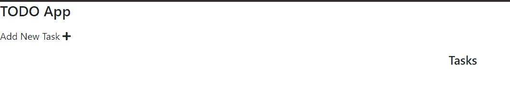

我们已经完成了 HTML 文件的设置。让我们开始 CSS。

### 半铸钢ˌ钢性铸铁(Cast Semi-Steel)

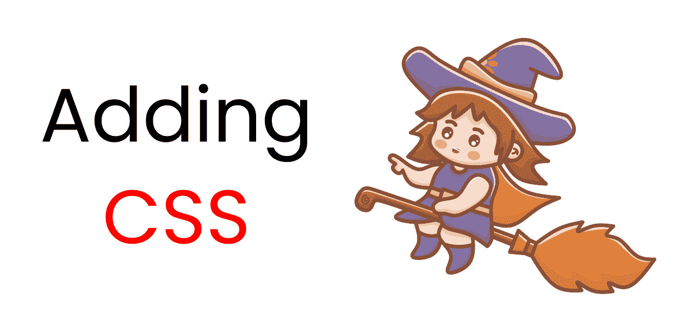

在主体中添加这些样式，这样我们就可以将应用程序放在屏幕的正中央。

```
body {
  font-family: sans-serif;
  margin: 0 50px;
  background-color: #e5e5e5;
  overflow: hidden;
  display: flex;
  justify-content: center;
  align-items: center;
  height: 100vh;
} 
```

让我们用 classname 应用程序来设计 div 的样式。👇

```
.app {
  background-color: #fff;
  width: 300px;
  height: 500px;
  border: 5px solid #abcea1;
  border-radius: 8px;
  padding: 15px;
} 
```

目前的结果是:👇

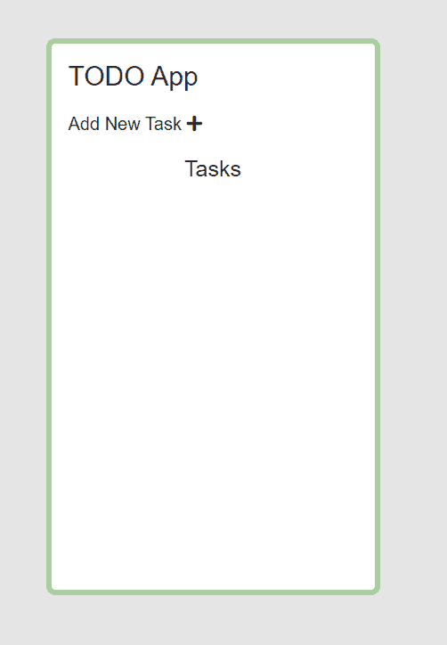

现在，让我们用 id `addNew`来设计按钮的样式。👇

```
#addNew {
  display: flex;
  justify-content: space-between;
  align-items: center;
  background-color: rgba(171, 206, 161, 0.35);
  padding: 5px 10px;
  border-radius: 5px;
  cursor: pointer;
}
.fa-plus {
  background-color: #abcea1;
  padding: 3px;
  border-radius: 3px;
} 
```

目前的结果是:👇

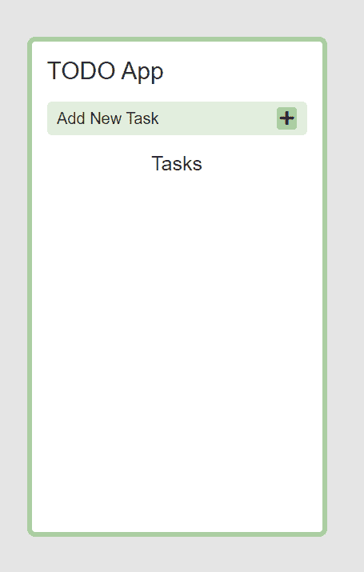

如果你点击按钮，模态弹出如下:👇

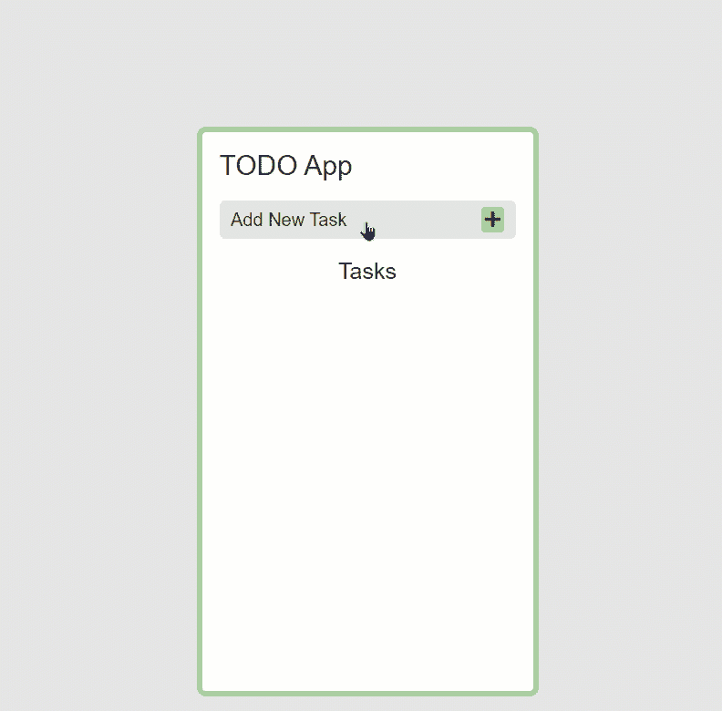

### 添加 JS

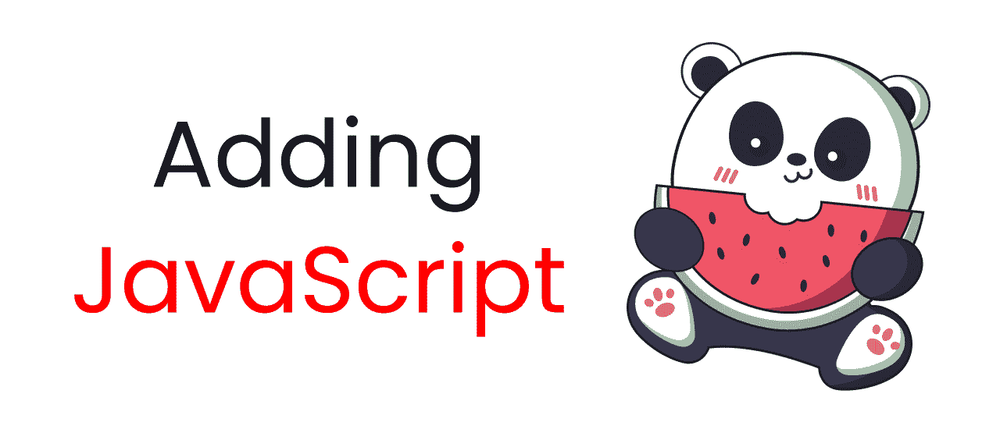

在 JavaScript 文件中，首先，从 HTML 中选择我们需要使用的所有选择器。👇

```
let form = document.getElementById("form");
let textInput = document.getElementById("textInput");
let dateInput = document.getElementById("dateInput");
let textarea = document.getElementById("textarea");
let msg = document.getElementById("msg");
let tasks = document.getElementById("tasks");
let add = document.getElementById("add"); 
```

#### 表单验证

我们不能让用户提交空白输入字段。因此，我们需要验证输入字段。👇

```
form.addEventListener("submit", (e) => {
  e.preventDefault();
  formValidation();
});

let formValidation = () => {
  if (textInput.value === "") {
    console.log("failure");
    msg.innerHTML = "Task cannot be blank";
  } else {
    console.log("success");
    msg.innerHTML = "";
  }
}; 
```

另外，在 CSS 中添加这一行:

```
#msg {
  color: red;
} 
```

目前的结果是:👇

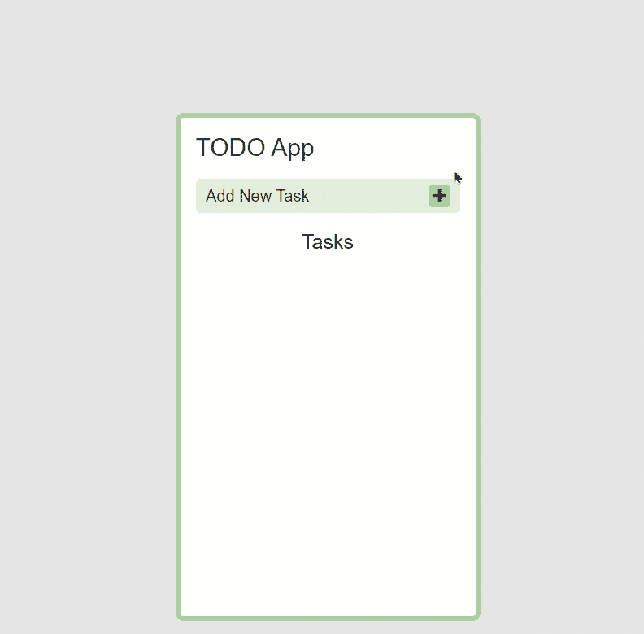

如您所见，验证正在进行。JavaScript 代码不允许用户提交空白输入字段，否则您会看到一条错误消息。

#### 如何收集数据和使用本地存储

无论用户写什么输入，我们都需要收集它们并存储在本地存储器中。

首先，我们使用名为`acceptData`的函数和名为`data`的数组从输入字段收集数据。然后，我们将它们推入本地存储，如下所示:👇

```
let data = [];

let acceptData = () => {
  data.push({
    text: textInput.value,
    date: dateInput.value,
    description: textarea.value,
  });

  localStorage.setItem("data", JSON.stringify(data));

  console.log(data);
}; 
```

还要注意，除非您在表单验证的 else 语句中调用函数`acceptData`,否则这永远不会起作用。跟随这里:👇

```
let formValidation = () => {

  // Other codes are here
   else {

    // Other codes are here

    acceptData();
  }
}; 
```

你可能已经注意到模态不会自动关闭。要解决这个问题，在表单验证的 else 语句中编写这个小函数:👇

```
let formValidation = () => {

  // Other codes are here
   else {

    // Other codes are here

    acceptData();
    add.setAttribute("data-bs-dismiss", "modal");
    add.click();

    (() => {
      add.setAttribute("data-bs-dismiss", "");
    })();
  }
}; 
```

如果你打开 Chrome 开发工具，进入应用程序并打开本地存储。你可以看到这样的结果:👇

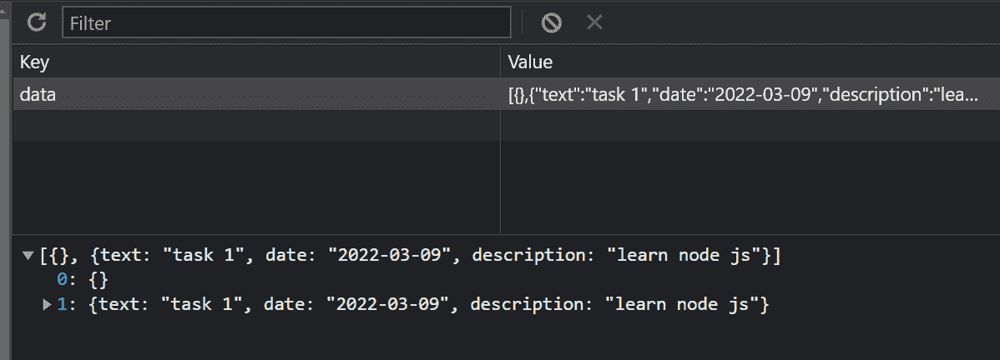

#### 如何创建新任务

为了创建一个新的任务，我们需要创建一个函数，使用模板文本创建 HTML 元素，并使用一个映射将从用户那里收集的数据放入模板中。跟随这里:👇

```
let createTasks = () => {
  tasks.innerHTML = "";
  data.map((x, y) => {
    return (tasks.innerHTML += `
    <div id=${y}>
          <span class="fw-bold">${x.text}</span>
          <span class="small text-secondary">${x.date}</span>
          <p>${x.description}</p>

          <span class="options">
            <i onClick= "editTask(this)" data-bs-toggle="modal" data-bs-target="#form" class="fas fa-edit"></i>
            <i onClick ="deleteTask(this);createTasks()" class="fas fa-trash-alt"></i>
          </span>
        </div>
    `);
  });

  resetForm();
}; 
```

还要注意，除非您在`acceptData`函数中调用它，否则该函数永远不会运行，如下所示:👇

```
let acceptData = () => {
  // Other codes are here

  createTasks();
}; 
```

一旦我们完成了从用户那里收集和接受数据，我们需要清除输入字段。为此，我们创建了一个名为`resetForm`的函数。跟随:👇

```
let resetForm = () => {
  textInput.value = "";
  dateInput.value = "";
  textarea.value = "";
}; 
```

目前的结果是:👇

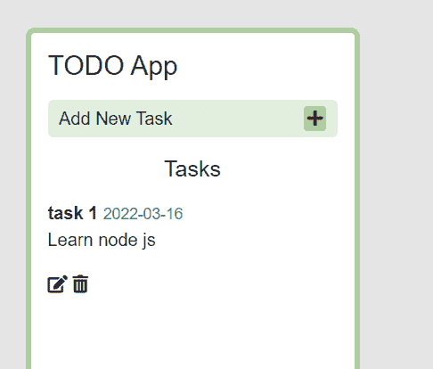

如你所见，这张卡没有款式。让我们添加一些样式:👇

```
#tasks {
  display: grid;
  grid-template-columns: 1fr;
  gap: 14px;
}

#tasks div {
  border: 3px solid #abcea1;
  background-color: #e2eede;
  border-radius: 6px;
  padding: 5px;
  display: grid;
  gap: 4px;
} 
```

用以下代码设计编辑和删除按钮的样式:👇

```
#tasks div .options {
  justify-self: center;
  display: flex;
  gap: 20px;
}

#tasks div .options i {
  cursor: pointer;
} 
```

目前的结果是:👇

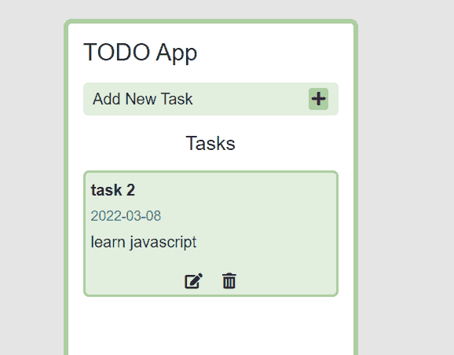

#### 功能来删除任务

仔细看这里，我在函数里面加了 3 行代码。

*   第一行将从屏幕上删除 html lemon，
*   第二行将从数据数组中删除目标任务，
*   第三行将使用新数据更新本地存储。

```
let deleteTask = (e) => {
  e.parentElement.parentElement.remove();

  data.splice(e.parentElement.parentElement.id, 1);

  localStorage.setItem("data", JSON.stringify(data));

  console.log(data);
}; 
```

现在创建一个虚拟任务并尝试删除它。到目前为止，结果如下:👇

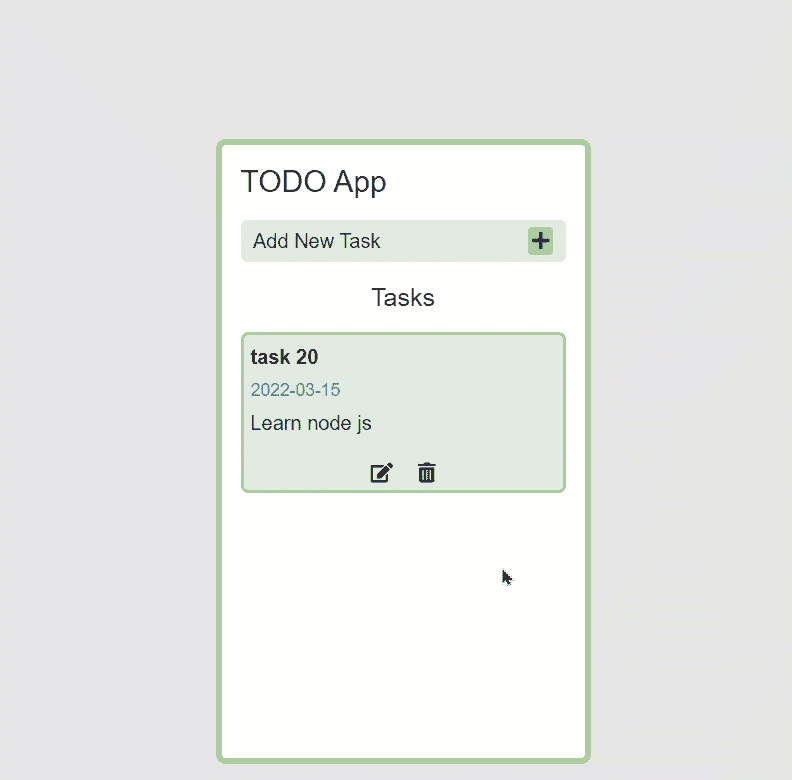

#### 编辑任务的功能

仔细看这里，我在函数里面加了 5 行代码。

*   第 1 行是我们选择编辑的任务
*   第 2、3 和 4 行是我们选择编辑的任务的值[任务、日期、描述]
*   第 5 行运行删除函数，从本地存储、HTML 元素和数据数组中删除选中的数据。

```
let editTask = (e) => {
  let selectedTask = e.parentElement.parentElement;

  textInput.value = selectedTask.children[0].innerHTML;
  dateInput.value = selectedTask.children[1].innerHTML;
  textarea.value = selectedTask.children[2].innerHTML;

  deleteTask(e);
}; 
```

现在，尝试创建一个虚拟任务并编辑它。目前的结果是:👇

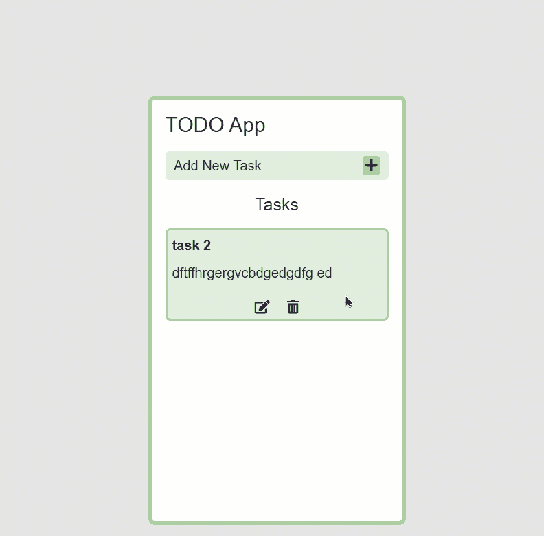

#### 如何从本地存储中获取数据

如果你刷新页面，你会发现所有的数据都不见了。为了解决这个问题，我们运行 IIFE(立即调用函数表达式)从本地存储中检索数据。跟随:👇

```
(() => {
  data = JSON.parse(localStorage.getItem("data")) || [];
  console.log(data);
  createTasks();
})(); 
```

现在，即使刷新页面，数据也会显示出来。

## 结论


祝贺您成功完成本教程。您已经学习了如何使用 CRUD 操作创建 todo 列表应用程序。现在，您可以使用本教程创建自己的 CRUD 应用程序。

这是你一直读到最后的奖章。❤️

## 建议和批评是高度赞赏❤️


*   [LinkedIn/ JoyShaheb](https://www.linkedin.com/in/joyshaheb/)
*   [YouTube / JoyShaheb](https://www.youtube.com/c/joyshaheb)
*   [推特/ JoyShaheb](https://twitter.com/JoyShaheb)
*   [Instagram / JoyShaheb](https://www.instagram.com/joyshaheb/)