# 每一个 CSS 背景属性用代码示例说明和解释🎖️

> 原文：<https://www.freecodecamp.org/news/learn-css-background-properties/>

今天我们将学习每一个 CSS **背景**属性和每一个可能的**值**。我们还将学习**的简写**。我们走吧！🏅

# 目录

*   [所有属性](#all-properties)
*   [背景图像](#background-image)
*   [背景尺寸](#background-size)
*   [背景——重复](#background-repeat)
*   [背景位置](#background-position)
*   [背景-起源](#background-origin)
*   [背景剪辑](#background-clip)
*   [背景-附件](#background-attachment)
*   [背景色](#background-color)
*   [短指针](#short-hand)
*   [结论](#conclusion)

如果你喜欢，你也可以在 YouTube 上观看这个教程:

[https://www.youtube.com/embed/hwJKjsZUPjY?feature=oembed](https://www.youtube.com/embed/hwJKjsZUPjY?feature=oembed)

# 所有属性

这是我们今天要讨论的所有属性的列表。末尾的红色文字是**的速记**。

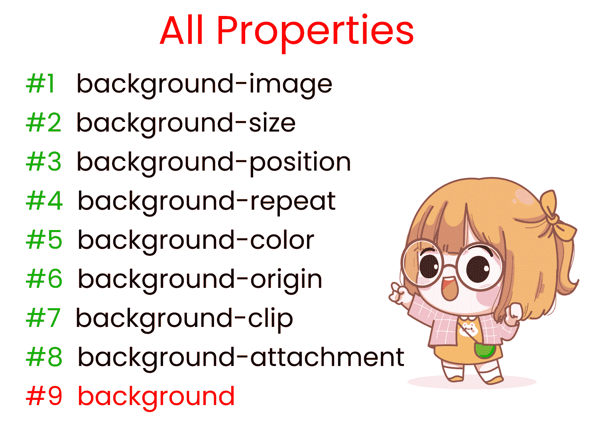

## 什么是 CSS 背景属性？

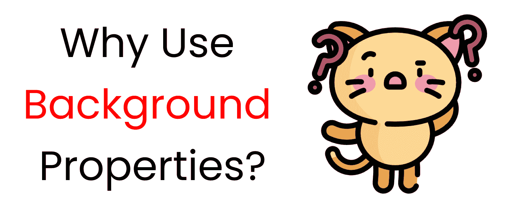

CSS 背景属性让我们控制图像的大小和属性，这样我们就可以为更小和更大的屏幕制作响应性图像。这反过来帮助我们创建响应性网站。

举个例子，

*   属性 **background-size** 允许我们根据屏幕大小重新设置图像的宽度和高度。
*   **背景位置**允许我们告诉浏览器把图像放在屏幕的什么地方。

还有更多！

## 如何设置项目

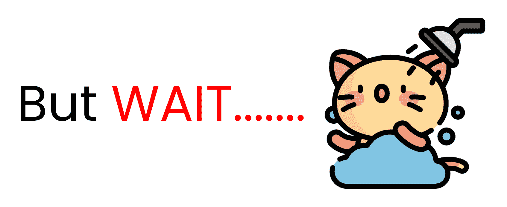

在编码之前，你需要了解一点 HTML，CSS，以及如何使用 VS 代码。

要测试属性及其值，请按照下列步骤操作👇

1.  创建一个名为“背景-项目”的新文件夹。用 VS 代码打开。
2.  创建`index.html`和`style.css`文件。
3.  在 VS 代码上安装“live server”。
4.  启动 live 服务器。

## 超文本标记语言

在 HTML 文件的 **body 标签**中创建一个类名为“container”的 div。

```
 <div class="container"></div> 
```

## 半铸钢ˌ钢性铸铁(Cast Semi-Steel)

在 CSS 中，你**必须**包含容器的高度，否则我们将看不到图像。在我们的例子中，我们将它设置为 100vh，如下所示:

```
.container{
  height : 100vh;
} 
```

## 下载项目的图像。

图片在我的 **[GitHub 库](https://github.com/JoyShaheb/Project-image-repo/tree/main/Background-property-images)** 上。下面是获取它们的方法:

1.  访问并复制☝️上面的链接
2.  转到 [downgit](https://minhaskamal.github.io/DownGit/#/home) 并粘贴你复制的链接
3.  遵循本视频中的步骤👇

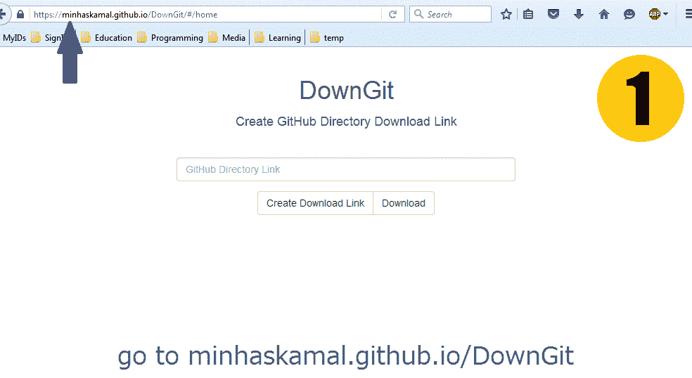

和.....我们都准备好了！

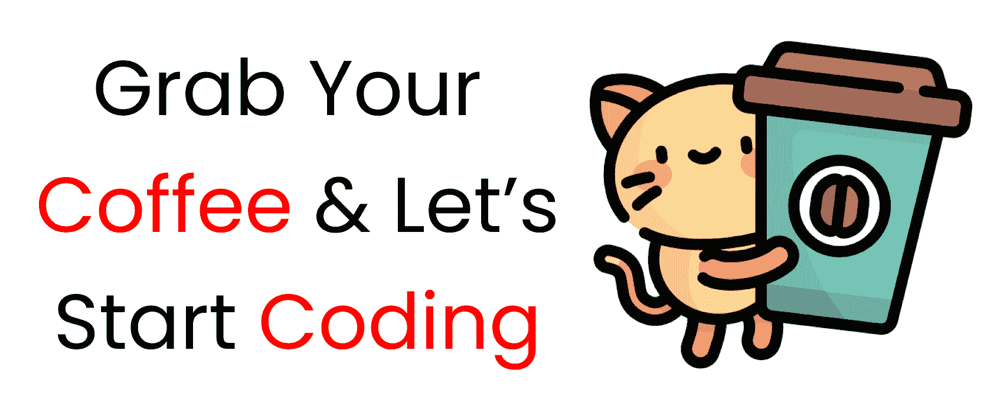

让我们开始编码吧😊

# CSS 背景图像属性

使用这个属性，我们可以在整个样式表中添加图像**。**

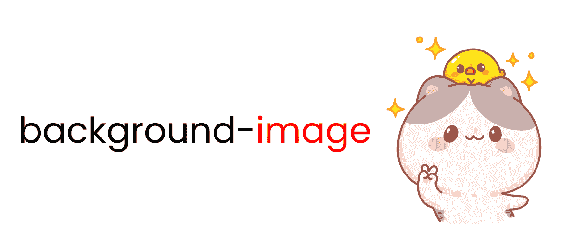

我们在编写选择器名称后编写语法，如下所示:👇

```
.container{
// We'll put image path/URL 👇 inside quotes
   background-image  :  url(' ');
}
```

我们可以通过两种方式使用背景图像:**:**

*   通过在目录中定位**图像路径**
*   通过指定**图像 URL**

### 如何通过目录路径使用`background-image`

下面是使用目录路径时背景图像的语法👇

```
.container{
//  Put  image  path  👇 inside quotes
  background-image: url(' ');
}
```


在三种情况下，您会想要在我们的 CSS 中指定图像路径:

1.  当`image`和`style.css`在同一个文件夹时
2.  当`image`在下一个文件夹中时
3.  当`image`在前一个文件夹中时

当`image`和`style.css`在**同一个文件夹**时，看起来如下图。👇

注意 **`kitty.png`** 和 **`style.css`** 在同一个父文件夹中，名为**背景-项目**:

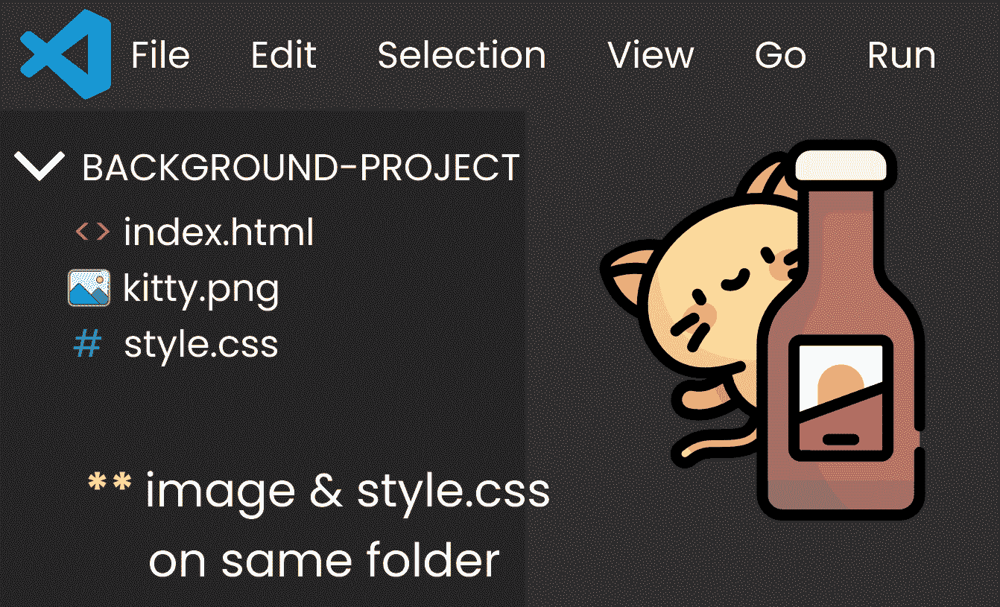

为了定位`kitty.png`的文件路径，在`style.css`中写入以下代码:

```
 .container{
   background-image : url("kitty.png");

   height: 100vh;
// set size & stop image repetition 
   background-repeat : no-repeat;
   background-size : contain;
 } 
```

当图像在**下一个文件夹**中时，`style.css`在前一个文件夹中。注意下图中的`kitty.png`在资产文件夹中，而`style.css`在前一个文件夹中。

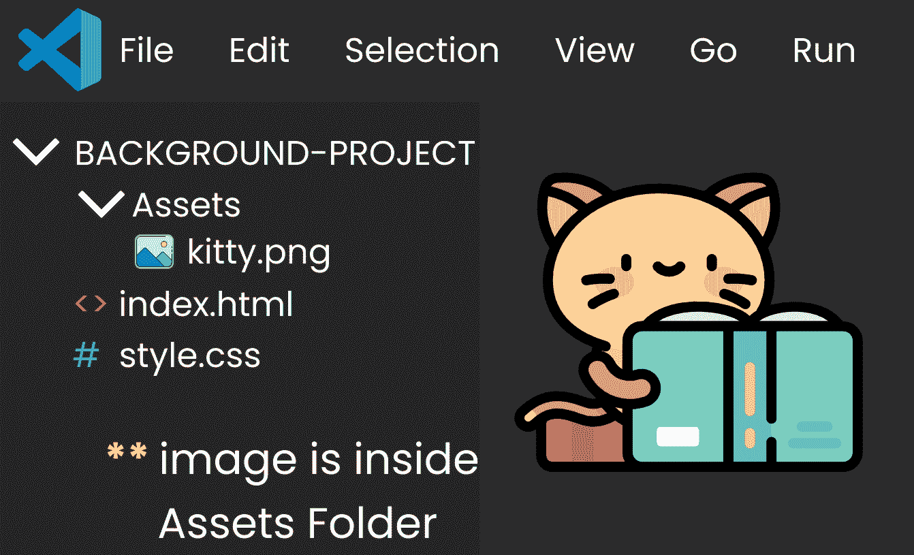

为了前进并定位`kitty.png`的文件路径，我们像这样写一个点和斜线(。/)在`style.css`中的引号后。然后我们写下文件夹的名称，然后是斜杠(/)，最后我们写下图像的名称，就像这样:👇

```
 .container{
   background-image : url("./Assets/kitty.png");

   height: 100vh;
// set size & stop image repetition 
   background-repeat : no-repeat;
   background-size : contain;
 } 
```

如果图像在**以前的文件夹**中，那么我们需要返回。请注意下图👇那个`style.css`在 **src** 文件夹中，`kitty.png`在 src 文件夹外**。**

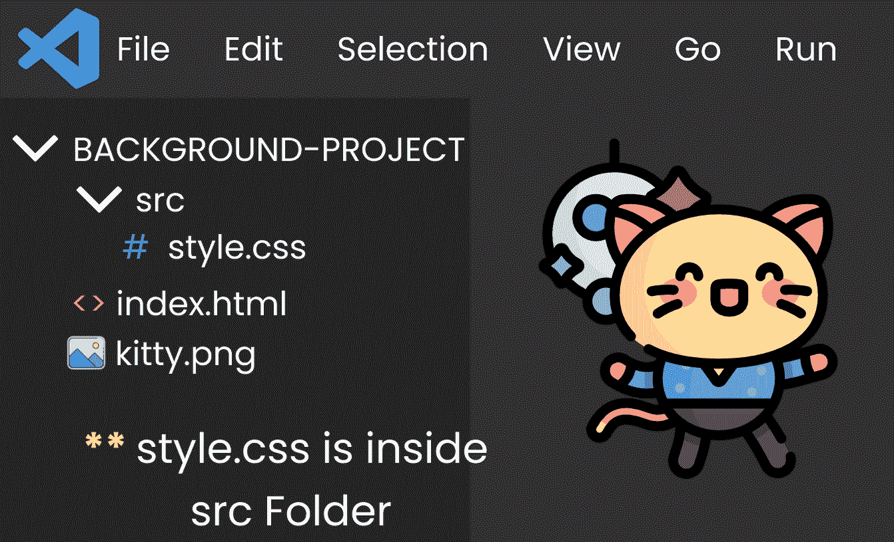

为了返回并定位`kitty.png`的文件路径，我们写了两个点和一条斜线(../)在`style.cs`中的引号后。然后我们写下图像的名称，像这样:👇

```
 .container{
   background-image : url("../kitty.png");

   height: 100vh;
// set size & stop image repetition 
   background-repeat : no-repeat;
   background-size : contain;
 } 
```

### 如何通过直接链接使用`background-image`

这很简单。编写属性并在`url()`中插入链接。

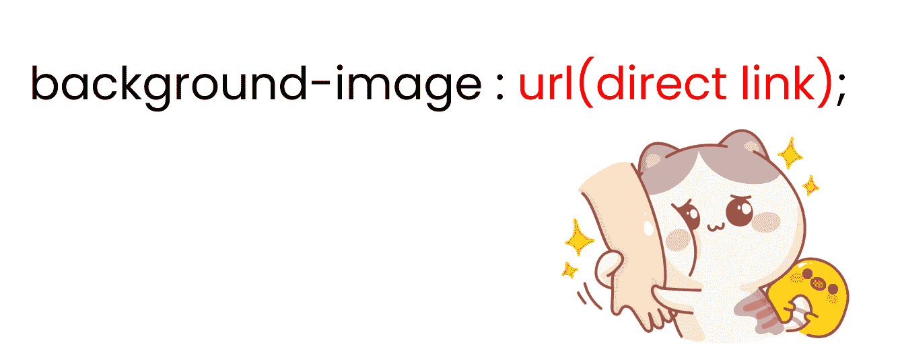

为了处理一个作为**直接链接的图像，**我们需要编写以下代码:

```
//example ->
 .container{
    background-image : url("https://dev-to-uploads.s3.amazonaws.com/uploads/articles/szxp3jqyjyksrep1ep82.png");

  height: 100vh;
// set size & stop image repetition 
   background-repeat : no-repeat;
   background-size : contain;
 } 
```

### 休息一会儿

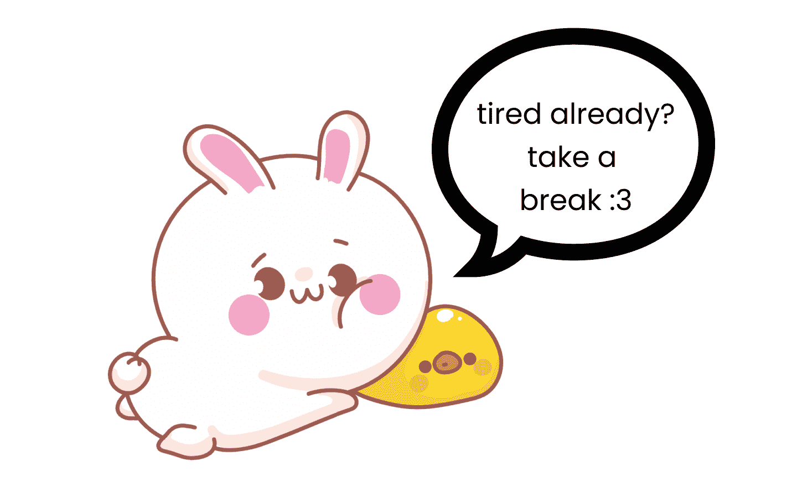

# CSS 背景大小属性

我们可以使用`background-size`属性来调整图像的大小。

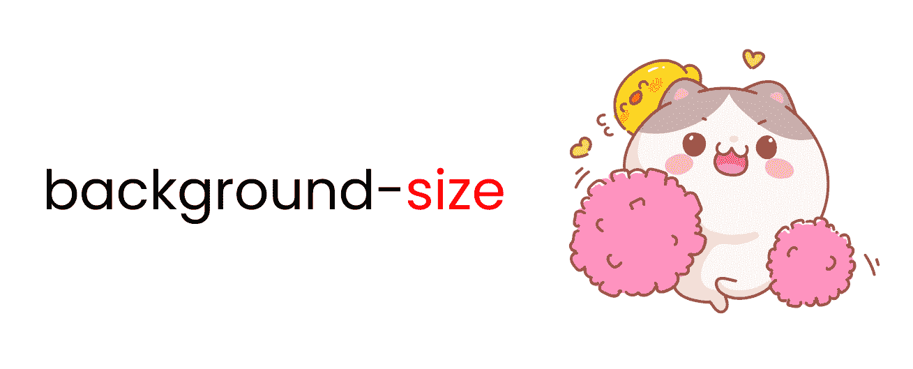

我们在编写选择器名称之后编写语法，就像这样👇

```
.container{
// We'll write values 👇 here
  background-size  : cover;
}
```

您可以通过三种方式使用背景尺寸**:**

*   **使用覆盖/包含值**
*   **设置图像的宽度和高度**
*   **使用自动**

**让我们从讨论**覆盖&包含值**开始。
熊尺寸:[718px X 614px]**

**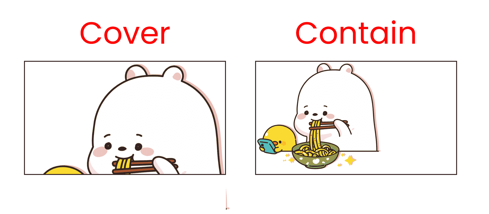**

### **覆盖值**

**为此，我们必须包含一个图像，设置高度，并停止图像重复。我们在 CSS 中是这样做的:👇**

```
`.container{
  background-image : url('cute-bear.png');
  background-repeat: no-repeat;
  background-size : cover;

// Must include the height
  height : 100vh;
}` 
```

**当我们使用这个属性时，即使我们调整窗口的大小，它也会将图像拉伸到整个屏幕。观看下面的视频，看看它是什么样子的:👇**

**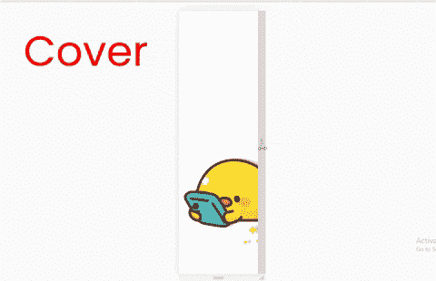**

### **容器值**

**这里的步骤是相同的——我们必须包含一个图像，设置它的高度，并像这样停止图像重复:👇**

```
`.container{
  background-image : url('cute-bear.png');
  background-repeat: no-repeat;
  background-size : contain;

// Must include the height
  height : 100vh;
}` 
```

**即使当我们调整窗口大小时，该值也将保持图像大小[响应图像]。看看下面的视频，看看它是如何工作的:👇**

**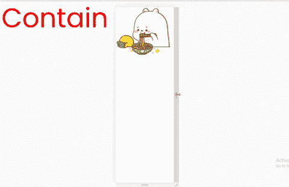**

### **图像宽度和高度**

**我们可以使用 background-size 属性设置图像的宽度和高度。**

**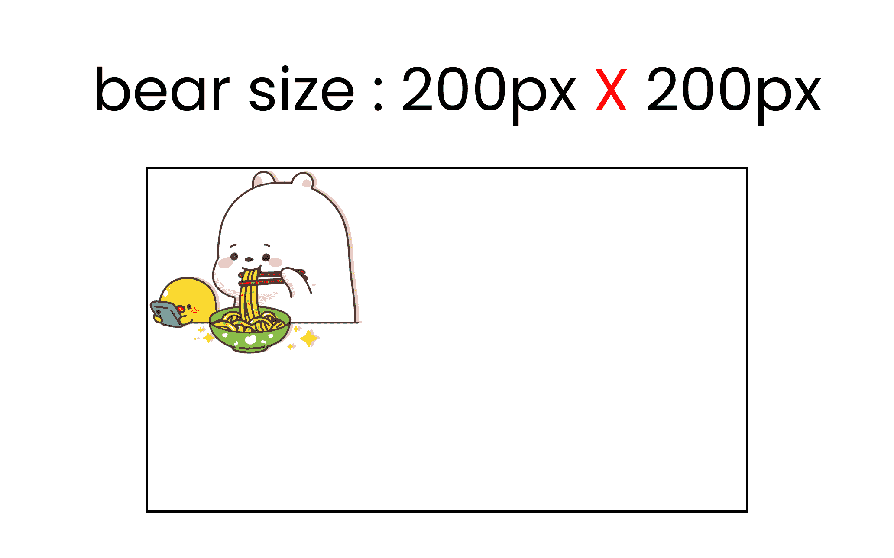**

**CSS 中的语法如下:👇**

```
`.container{
// here, we see  width👇  &  👇 height
  background-size : 200px   200px;
}` 
```

**此外，不要忘记插入图像，设置其高度，并停止图像重复。代码片段如下所示:**

```
`.container{
  background-image : url('cute-bear.png');
  background-repeat: no-repeat;

// here, we see  width👇 &  👇 height
  background-size : 200px  200px;

// Must include the height
  height : 100vh;
}` 
```

### **自动调整大小**

**使用该值时，图像将保持其原始大小。当我们调整窗口大小时，它不会改变。看起来是这样的:**

**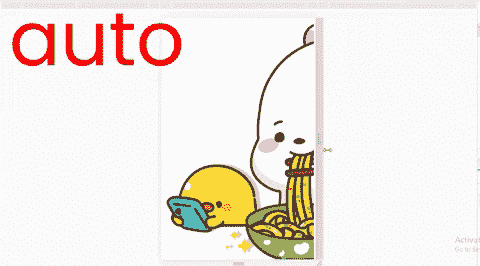**

# **CSS 背景重复属性**

**这个属性允许我们多次重复相同的图像。**

****

**我们在编写选择器名称之后编写语法，就像这样👇**

```
`.container{
// we'll change values 👇 here
  background-repeat : repeat;
}`
```

**该属性有六个值:**

*   **重复**
*   **重复-x**
*   **重复-y**
*   **不重复**
*   **空间**
*   **轮次**

**以下是这六个数值的结果一览。请注意，这些示例中的 kitty 大小为[200px X 200px]。**

**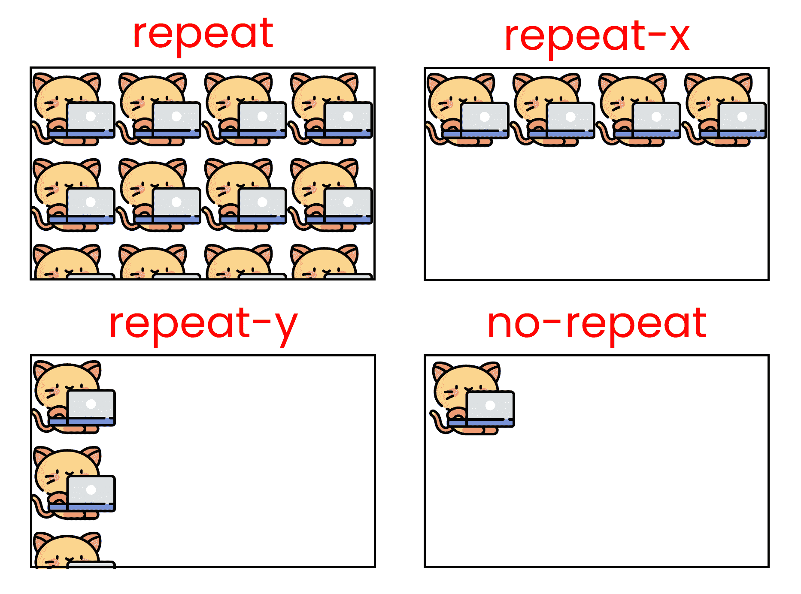****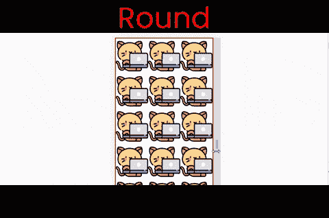****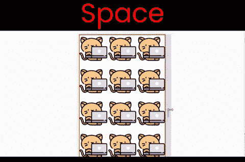**

**现在，让我们研究一下每个值发生了什么。但是，在此之前，请注意我们需要使用`background-image`属性插入一个图像，如下所示:**

```
`.container{
   background-image : url('kitty.png');
   background-size : 200px 200px;
   background-repeat :  ; //we will play with values here 

   height : 100vh;
}` 
```

### **重复值**

**通过使用这个值，我们可以沿着 X 轴和 Y 轴多次重复相同的图像，只要屏幕空间没有结束。这里，小猫的大小是 200 像素×200 像素。**

**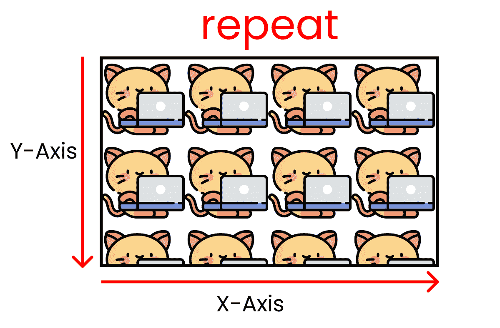**

**为了复制这个结果，我们写->**

```
`.container{
   background-image : url('kitty.png');
   background-size : 200px 200px;
   background-repeat : repeat;

   height : 100vh;
}`
```

### **重复 x 值**

**只要屏幕空间没有结束，这个值允许我们沿着 X 轴**多次重复相同的图像。Kitty 尺寸:200px X 200px。****

**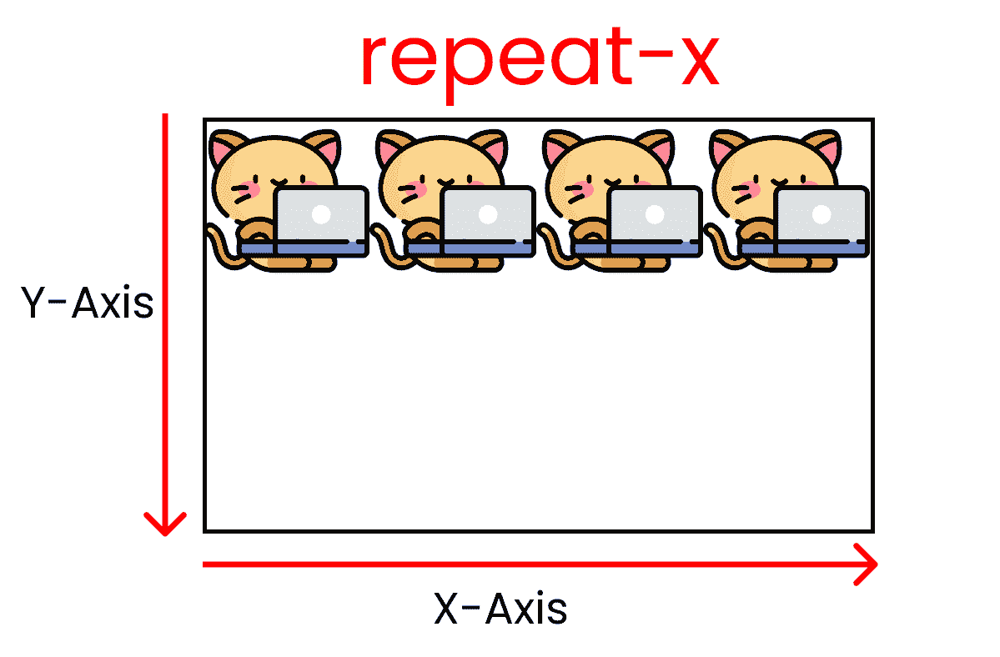**

**为了实现这一点，我们写->**

```
`.container{
   background-image : url('kitty.png');
   background-size : 200px 200px;
   background-repeat : repeat-x;

   height : 100vh;
}`
```

### **重复 y 值**

**这一个与“重复-x”的工作方式相同，但是沿着 **Y 轴**工作，只要屏幕空间没有结束。Kitty 尺寸:200px X 200px。**

**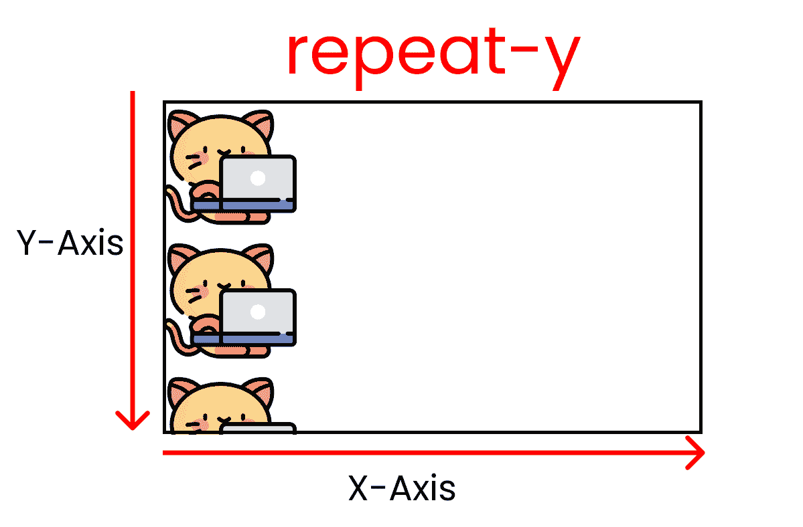**

**对于这个结果，我们写->**

```
`.container{
   background-image : url('kitty.png');
   background-size : 200px 200px;
   background-repeat : repeat-y ;

   height : 100vh;
}`
```

### **不重复值**

**使用这个值，我们可以拥有原始图像，而不会重复。Kitty 尺寸:200px X 200px。**

**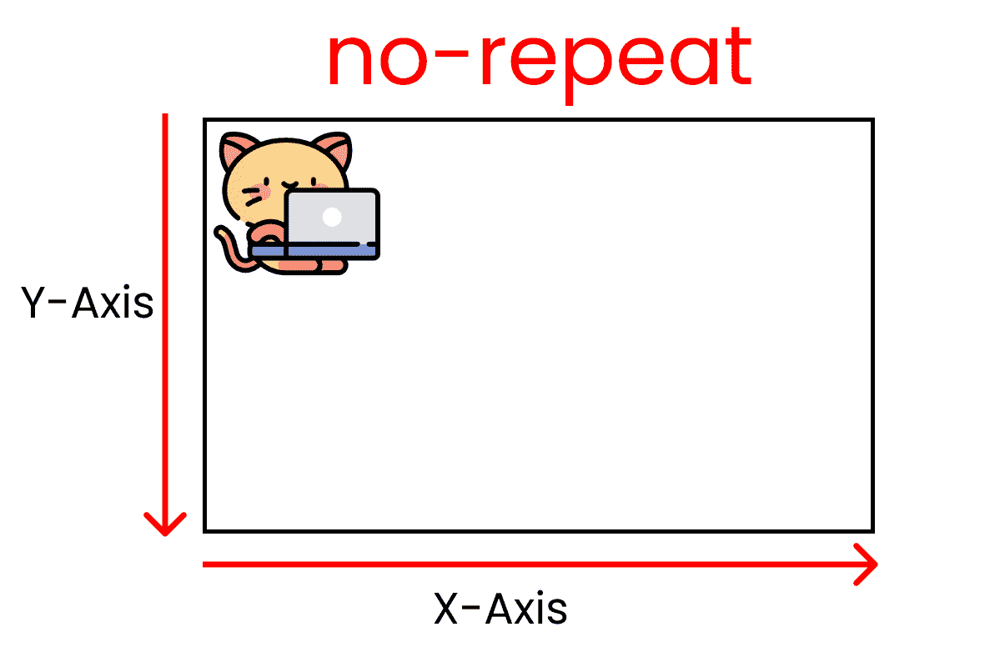**

**对于这个结果，我们写->**

```
`.container{
   background-image : url('kitty.png');
   background-size : 200px 200px;
   background-repeat : no-repeat ; 

   height : 100vh;
}`
```

### **空间值**

**这在 X 轴和 Y 轴上都有效。当我们调整窗口大小时，我们可以看到值 **space 和 round** 之间的主要区别。注意，当我们调整窗口大小时，我们有了**空白空间**:**

****

**要试验这个值，请编写->**

```
`.container{
   background-image : url('kitty.png');
   background-size : 200px 200px;
   background-repeat : space ;

   height : 100vh;
}`
```

### **舍入值**

**这在 X 轴和 Y 轴上都有效。请注意，当我们调整窗口大小时，图像正在拉伸。**

****

**跟随并写->**

```
`.container{
   background-image : url('kitty.png');
   background-size : 200px 200px;
   background-repeat : round ; 

   height : 100vh;
}`
```

# **CSS 背景位置属性**

**该属性用于改变图像在屏幕上的位置。**

**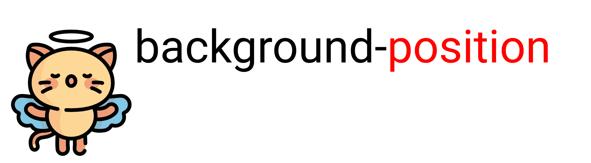**

**下面是语法:👇**

```
`.container{
// This is       X-Axis👇  &  👇 Y-Axis
background-position : 300px  200px;
}` 
```

**此外，不要忘记插入图像，设置其高度，并停止图像重复。我们已经使用`background-size`属性将 kitty 的大小设置为 200px X 200px:**

```
`.container{
  background-image: url("kitty-idea.png");
  background-size: 200px 200px;
  background-repeat: no-repeat;

// This is         X-Axis👇  & 👇 Y-Axis
  background-position : 300px 200px;
  height: 100vh;
}` 
```

**这是结果:**

**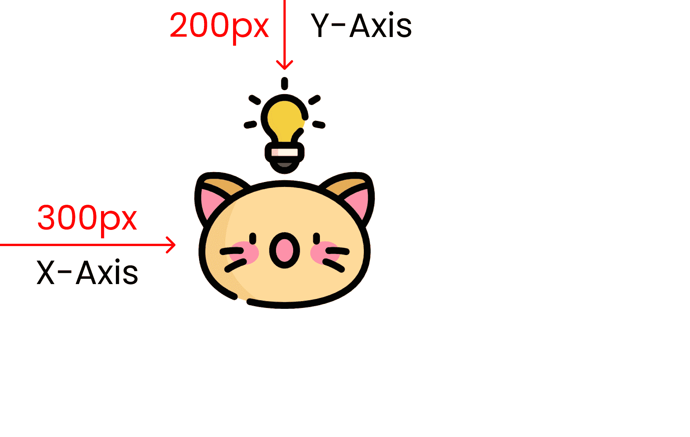**

**您也可以使用这些值的组合:**

*   **顶端**
*   **左边的**
*   **正确**
*   **底部**
*   **百分比值**

**举个例子，让我们把小猫放在右下角。下面是它的代码片段:**

```
`.container{
  background-image: url("kitty-idea.png");
  background-size: 200px 200px;
  background-repeat: no-repeat;

// This is         X-Axis👇  & 👇 Y-Axis
  background-position : bottom right;
  height: 100vh;
}` 
```

**这是结果:**

**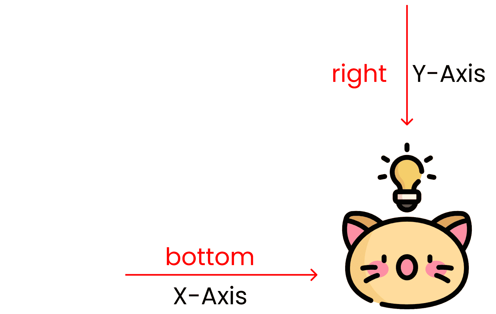**

**计算屏幕的可用空间时，百分比值决定了图像的位置。下面是它在代码中的样子:**

```
`.container{
  background-image: url("kitty-idea.png");
  background-size: 200px 200px;
  background-repeat: no-repeat;

// This is         X-Axis👇  & 👇 Y-Axis
  background-position : 25% 15%;
  height: 100vh;
}` 
```

**这是结果:**

**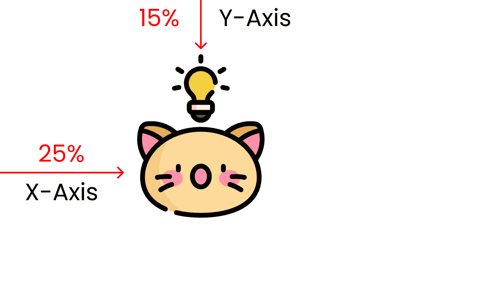**

# **CSS 背景来源属性**

**这个属性允许我们在 CSS 盒子模型中设置图像的原点。**

**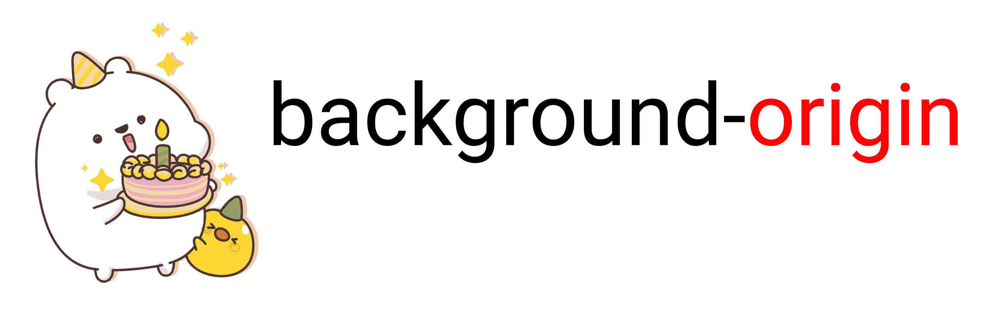**

**我们在编写选择器名称之后编写语法，就像这样👇**

```
`.container{
// We'll write values   👇 here
  background-origin: border-box;
}`
```

**它的四个值是:**

*   **边框**
*   **填充盒**
*   **内容盒**
*   **继承**

**在标准的 CSS 盒子模型中，最外面的部分是边框。然后是填充，最后是内容本身。**

**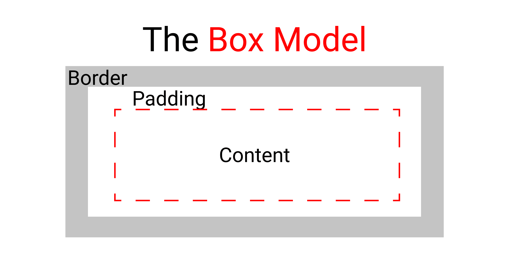**

**以下是每个属性的结果一览:**

**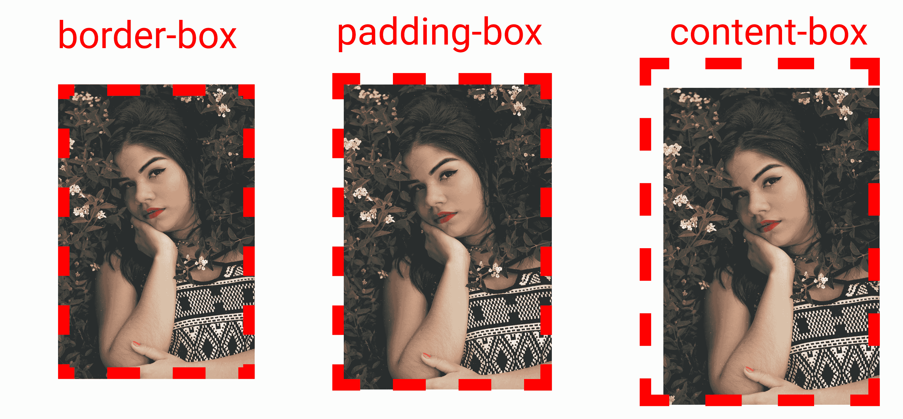**

**要重现这些结果:**

*   **首先我们需要一个图像，我们需要停止图像重复，并设置容器和图像的高度和宽度。**
*   **一旦完成，我们将插入 40px 的填充，否则我们看不到填充框和内容框的区别。**
*   **然后，插入一个 25px 的红色边框。将边框样式设置为虚线，在屏幕上得到一个**虚线边框**。**
*   **将背景尺寸设置为 400 像素和 400 像素**

**代码看起来是这样的:**

```
`.container{
  background-image: url('cute-girl.png');
  background-repeat: no-repeat;
  background-size: 400px 400px;

// Change  values here  👇  to see difference 
  background-origin: border-box;
  padding: 40px;
  border: 25px solid red;
  border-style: dashed;

// Width & height for container 👇
  width : 400px;
  height : 400px;
}` 
```

### **休息一下**

**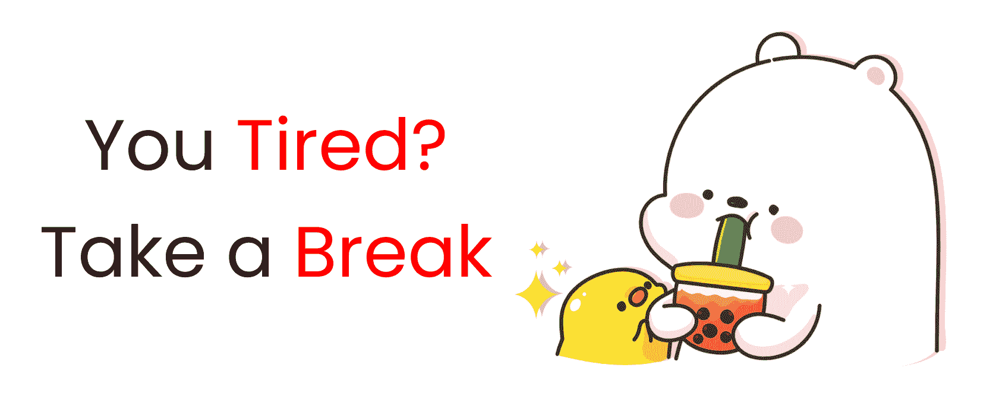**

# **CSS 背景剪辑属性**

**这与`background-origin`属性相同。主要区别在于，`background-clip` **切割**图像以适合框内，而`background-origin` **推动**框内内容以适合框内。**

**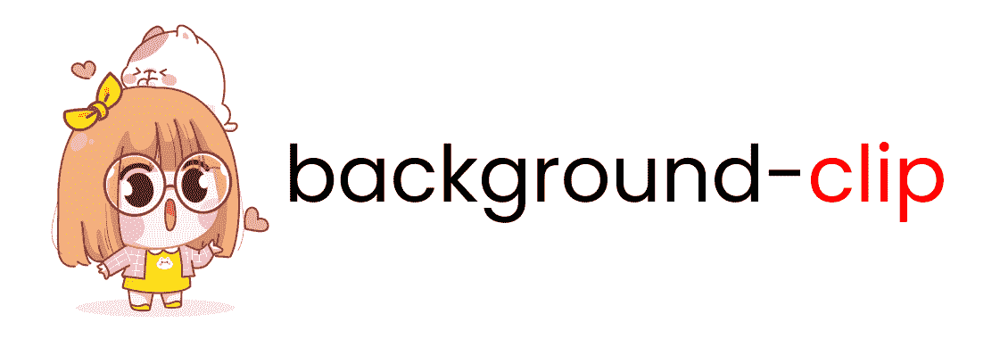**

**我们在编写选择器名称之后编写语法，就像这样👇**

```
`.container{
// We'll write values   👇 here
  background-clip  : border-box;
}`
```

**它的四个值是:**

*   **边框**
*   **填充盒**
*   **内容盒**
*   **继承**

**以下是每个属性的结果一览:**

**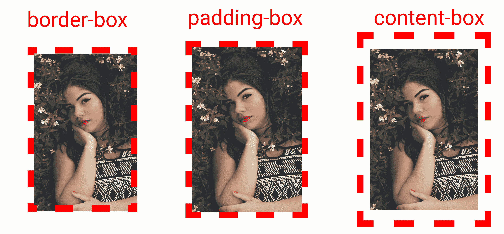**

**要重现这些结果:**

*   **首先我们需要一个图像，我们需要停止图像重复，我们需要设置容器和图像的高度和宽度。**
*   **一旦完成，我们将插入 40px 的填充，否则我们将无法看到填充框和内容框之间的**差异**。**
*   **然后，插入一个 25px 的红色边框。将边框样式设置为虚线，以便在屏幕上看到**虚线边框**。**
*   **将背景尺寸设置为 400 像素和 400 像素**

**代码如下所示:**

```
`.container{
  background-image: url('cute-girl.png');
  background-repeat: no-repeat;
  background-size: 400px 400px;

// Change  values here  👇  to see difference 
  background-clip: border-box;
  padding: 40px;
  border: 25px solid red;
  border-style: dashed;

// Width & height for container 👇
  width : 400px;
  height : 400px;
}` 
```

# **CSS 背景附件属性**

**这个属性允许我们在滚动时控制内容和图像的行为。**

**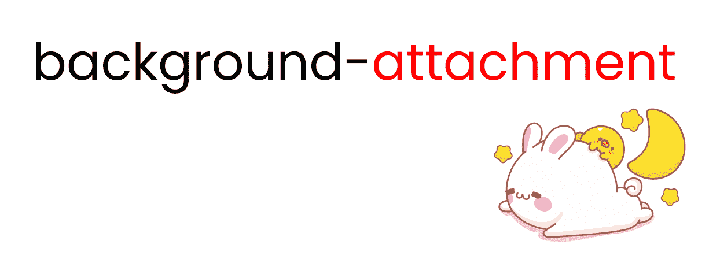**

**我们在编写选择器名称之后编写语法，就像这样👇**

```
`.container{
// We'll  change  values 👇  here
background-attachment: scroll;
}`
```

**它的三个价值是:**

*   **卷起**
*   **固定的；不变的**
*   **当地的**

**当我们使用**滚动**时，图像是固定的，我们可以自由滚动我们的内容。**固定的**值给了我们鼠标滚动的视差效果，只要我们的内容没有结束，**本地**就会产生多个图像。**

**你可以在这里看到直播结果👇**

 **[https://codepen.io/ematte/embed/preview/GRjJjro?height=300&slug-hash=GRjJjro&default-tabs=html,result&host=https://codepen.io](https://codepen.io/ematte/embed/preview/GRjJjro?height=300&slug-hash=GRjJjro&default-tabs=html,result&host=https://codepen.io)** 

**这里是我得到这支笔的地方。**

# **CSS 背景色属性**

**您可以使用该属性用颜色填充背景。**

**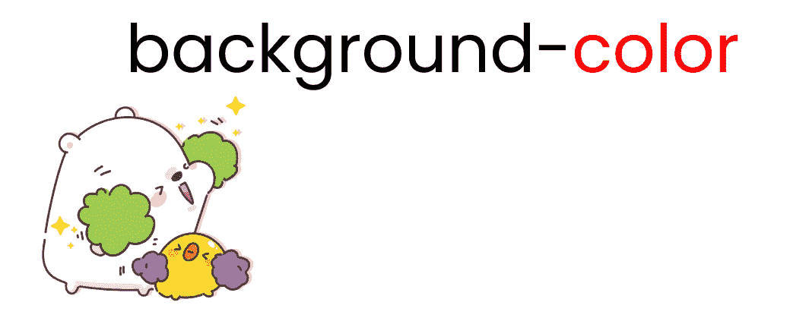**

**我们在编写选择器名称之后编写语法，就像这样👇**

```
`.container{
// we'll change values 👇  here
   background-color :  red;
}`
```

**在众多选项中，最受欢迎的是:**

*   **按名称或十六进制值显示纯色**
*   **使用`RGB()`颜色功能**
*   **使用`linear-gradient()`功能**

### **如何通过名称或十六进制值获得纯色背景**

**您可以使用颜色名称来设定背景颜色，如下所示:**

```
`.container{
   background-color : red;

   height : 100vh;
}` 
```

**或者，您可以使用十六进制颜色代码，如下所示:**

```
`.container{
   background-color : #ff0000; //red color

   height : 100vh;
}` 
```

**您可以查看这些资源以了解更多颜色:**

*   **[coolors.co](https://coolors.co/)**
*   **[flatuicolors.com](https://flatuicolors.com/)**

### **如何使用 RBG()颜色函数来设置背景颜色**

**您可以使用`RGB()`颜色功能来设置背景颜色，如下所示:**

```
`.container{
// color name is "American River"
   background-color : rgb(99, 110, 114);

   height : 100vh;
}` 
```

**或者，您可以使用`RGBA()`来设置颜色和不透明度，如下所示:**

```
`.container{
// The 0.5 at last represents        50% 👇 opacity 
   background-color :  rgba(99, 110, 114, 0.5);

   height : 100vh;
}` 
```

**这是一个名为“伊顿蓝”的颜色的实验，具有不同的不透明度:👇**

**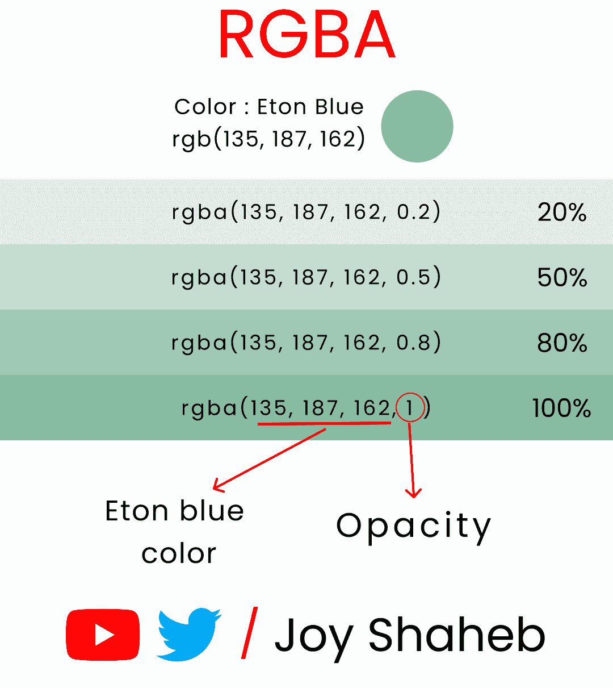**

### **如何用 linear-gradient()函数设置背景色**

**您可以使用此功能创建不止一种颜色的渐变颜色。以下是渐变颜色的一些示例:**

**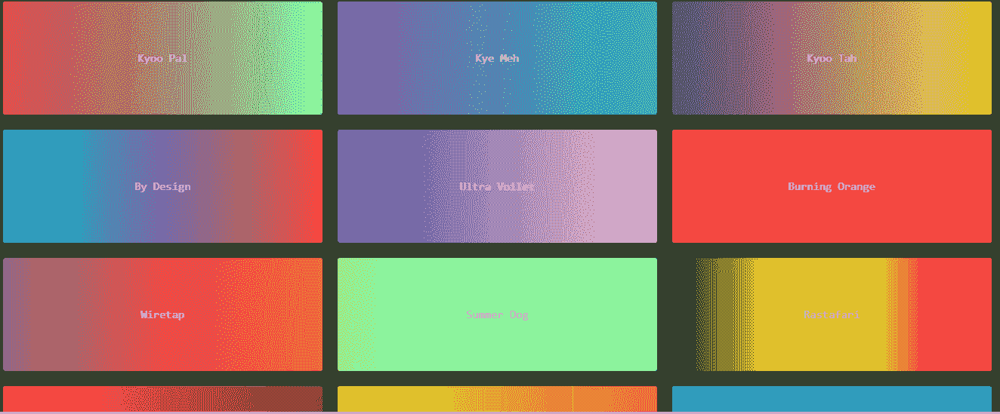**

**你可以访问[这个网站](https://uigradients.com/#Summer)来获得更多带有 CSS 代码片段的颜色资源。**

**让我们重新创建这个背景色:**

**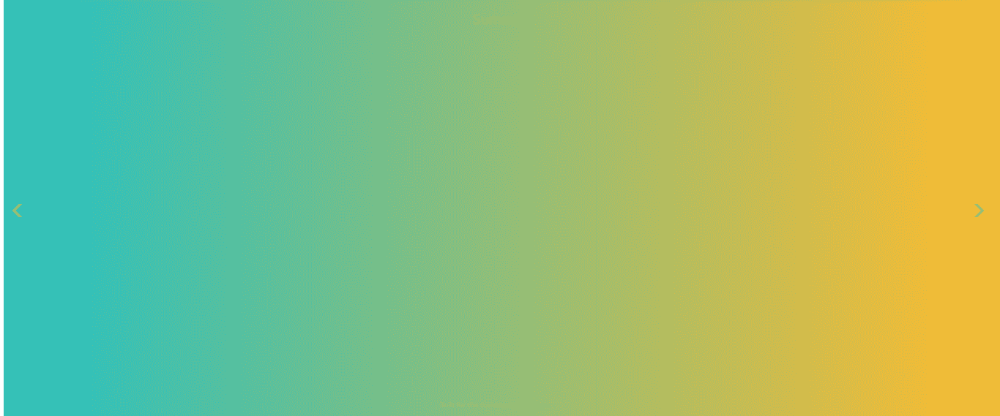**

**“#22c1c3”代表左边的颜色，“#fdbb2d”代表右边的颜色。“90 度”告诉我们这两种颜色如何形成渐变。**

**代码片段如下所示:**

```
`.container{

   background: linear-gradient(90deg, #22c1c3, #fdbb2d);  

   height : 100vh;
}` 
```

# **这些 CSS 属性的缩写**

**背景属性的简写顺序如下:**

**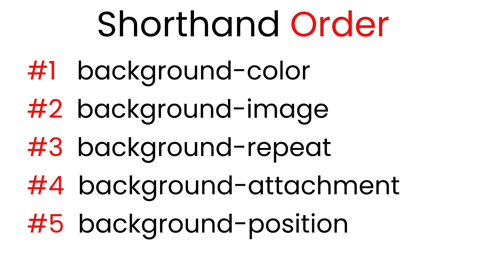**

**对于这个实验，让我们将`kitty.png`放在浏览器中，蓝色背景在 X 轴 200px，Y 轴 200px。代码片段如下所示:**

```
`.container{

   background-color : skyblue;
   background-image : url('kitty.png);
   background-repeat: no-repeat;
   background-attachment: fixed;
   background-position: 200px 200px;

   height : 100vh;
}` 
```

**下面是使用简写的代码片段:**

```
`.container{

   background: skyblue url('kitty.png) no-repeat fixed 200px 200px;

   height : 100vh;
}` 
```

**这种速记法真的节省了我们的时间。如果想跳过一个值，只要保持这些属性的顺序，就可以这样做。**

# **结论**

**这是你的奖章，奖励你坚持阅读到底，❤️**

**建议和批评得到了❤️的高度赞赏**

****

### **信用**

*   **[可爱的女孩我暗恋🥰](https://www.pexels.com/photo/woman-lying-on-plants-2125610/)**
*   **[kitty 头像](https://www.flaticon.com/packs/kitty-avatars-3)**
*   **[可爱的熊猫](https://www.freepik.com/free-vector/cute-bear-is-happy-cartoon-illustration_12341167.htm#position=4)**
*   **[可爱的猫和鸭子](https://www.freepik.com/free-vector/set-happy-cute-cats-cartoon-illustration_12566295.htm#position=11)**
*   **[可爱少女插画](https://www.freepik.com/free-vector/young-girl-different-gestures-cartoon-illustration_12566309.htm#page=1&position=22)**
*   **[兔子和鸭子](https://www.freepik.com/free-vector/set-cute-rabbit-with-duck-feel-happy-sad-cartoon-illustration_12573654.htm#position=7)**
*   **[CSS-招数](https://css-tricks.com/almanac/properties/b/background/)**

****YouTube[/Joy Shaheb](https://youtube.com/c/joyshaheb)****

****推特[/JoyShaheb](https://twitter.com/JoyShaheb)****

****insta gram[/JoyShaheb](https://www.instagram.com/joyshaheb/)****