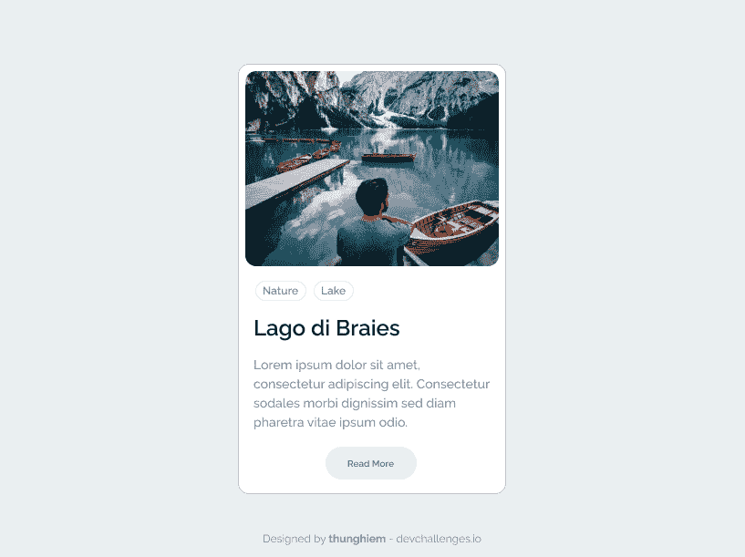
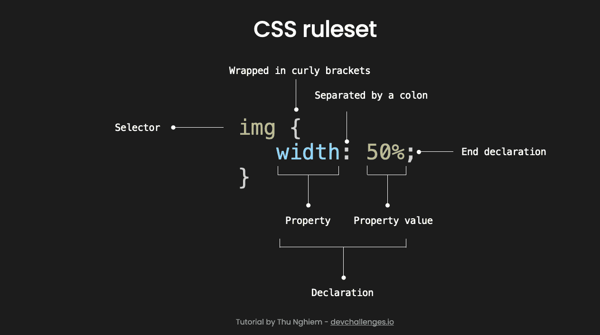
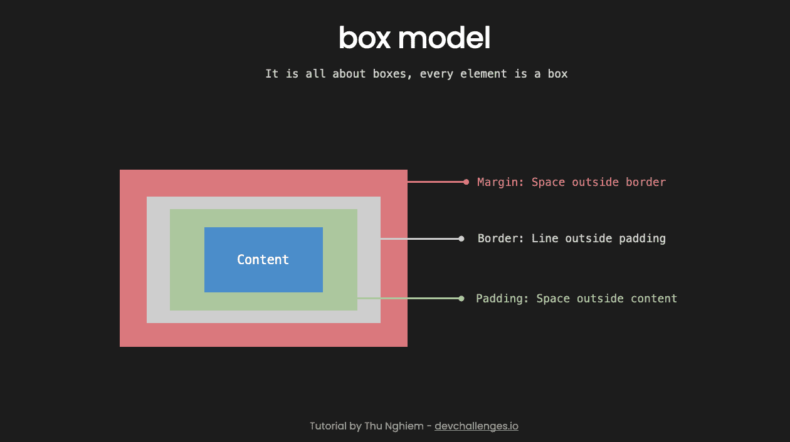
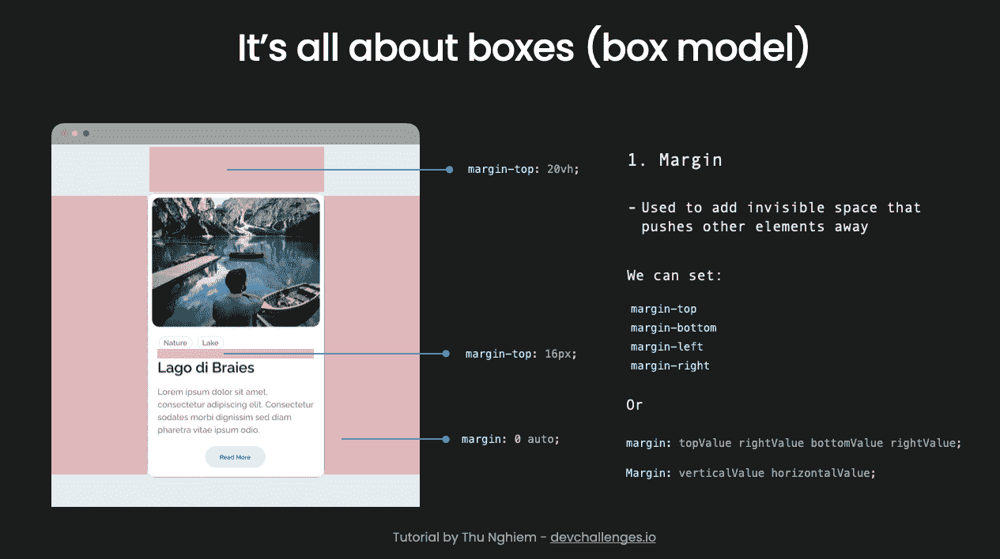
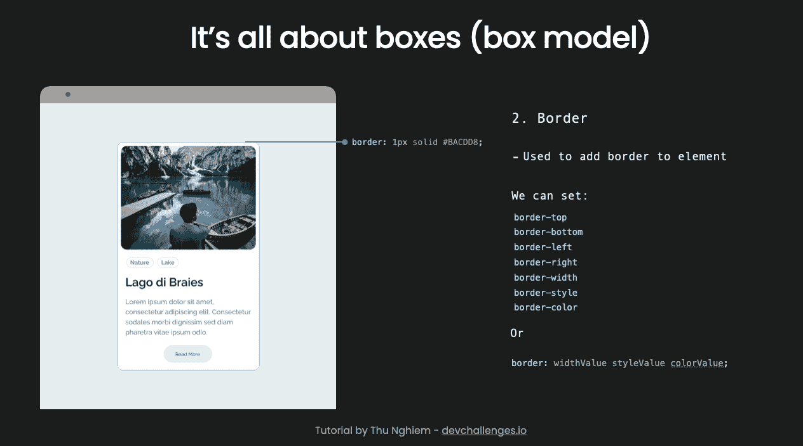
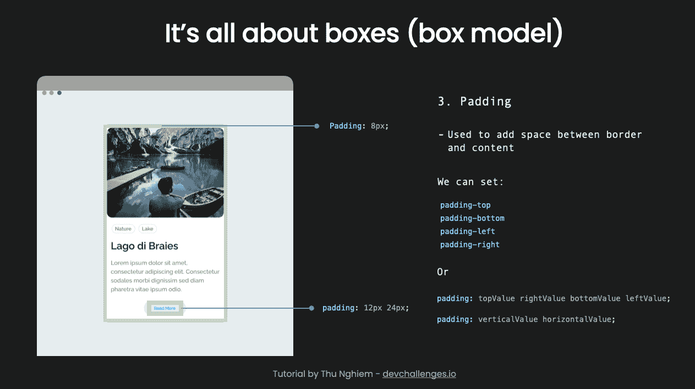

# 通过构建卡片组件学习 CSS 基础知识

> 原文：<https://www.freecodecamp.org/news/learn-css-basics-by-building-a-card-component/>

如果你想让你的网站看起来有吸引力，你需要知道 CSS。

CSS 或级联样式表是一种样式表语言，用于设计 web 内容的样式。

在本教程中，我们将从零开始构建一个卡片组件来学习 CSS 基础知识。

如果你想继续下去，请务必在这里查看设计。

如果你想补充这篇文章，你可以看一个视频:

[https://www.youtube.com/embed/yU-euUrE3Bg?feature=oembed](https://www.youtube.com/embed/yU-euUrE3Bg?feature=oembed)

如果你准备好了，让我们开始吧。

## 如何用 HTML 构建框架

在我们开始使用 CSS 之前，我们需要一些内容。在这一节中，我们将快速用 HTML 构建一个框架。如果你是 HTML 新手，你可以在这里查看教程。

好吧，打开 VS 代码。然后在您选择的文件夹中，创建一个新文件，并将其命名为`index.html`。

在文件中，键入`!`并按回车键。然后您将得到这个 HTML 模板:

```
<!DOCTYPE html>
<html lang="en">
<head>
  <meta charset="UTF-8">
  <meta name="viewport" content="width=device-width, initial-scale=1.0">
  <title>Document</title>
</head>
<body>

</body>
</html> 
```

我们的工作是构建一个包含图像、标签、名称、描述和按钮的卡片组件，如下所示:



在`index.html`中，首先将标题内容从`Document`改为`CSS Basics`。在`<body>`元素中，添加我们需要的所有元素:

```
...
<body>

  <!-- A div with container id to hold the card -->
  <div id="container">

    <!-- A div with card class for the card  -->
    <div class="card">
      

      <!-- A div with card__details class to hold the details in the card  -->
      <div class="card__details">

        <!-- Span with tag class for the tag -->
        <span class="tag">Nature</span>

        <span class="tag">Lake</span>

        <!-- A div with name class for the name of the card -->
        <div class="name">Lago di Braies</div>

        <p>Lorem ipsum dolor sit amet, consectetur adipiscing elit. Consectetur sodales morbi dignissim sed diam
          pharetra
          vitae ipsum odio.</p>

        <button>Read more</button>
      </div>

    </div>
  </div>

</body>

... 
```

好了，现在我们有了组件的框架。如果你想在浏览器中看到这些变化，你可以使用 [Live Server](https://marketplace.visualstudio.com/items?itemName=ritwickdey.LiveServer) 扩展。

## 使用 CSS 设置样式

接下来，我们需要设计组件的样式。这是教程的主要部分。在构建卡组件的同时，我还将在这一部分解释不同的概念。

### 如何将 CSS 应用于 HTML

首先，让我们看看将 CSS 应用于 HTML 的 3 种方式:

1.  **外部样式表**

外部样式表是最常见和最有用的方式。它在一个单独的文件中包含 CSS，该文件有一个`.css`扩展名。

您可以通过在与`index.html`相同的文件夹中创建一个新文件`style.css`来添加外部样式表。在`<head>`元素中，您可以导入包含以下内容的样式表:

```
<link rel="stylesheet" href="style.css"> 
```

通过这种方法，可以使用同一个样式表将 CSS 应用于多个页面。

**2。内部样式表**

您可以通过将 CSS 放在`<head>`元素内的`<style>`元素内来添加内部样式表。例如:

```
<head>
  <style>
    /* your style */
  </style>
</head> 
```

当您必须使用阻止您编辑外部样式表的系统时，此方法非常有用。

这种方法的一个缺点是样式不能应用于多个页面。

**3。内嵌样式(避免使用)**

还可以使用`style`属性直接给元素添加样式。例如，如果您想要将段落文本的颜色更改为红色:

```
<p style="color:red;">paragraph</p> 
```

当您必须使用非常严格的系统，并且不能编辑外部或内部样式表时，这种方法很常见。

给你的文档添加内联样式是**而不是**一个好习惯——很难阅读和理解，因此，你应该尽可能避免。

## 如何向卡组件添加外部样式表

好了，现在你知道如何将 CSS 应用到 HTML 中了。在这个练习中，让我们使用一个外部样式表。

创建一个名为`style.css`的新文件，并将`<link rel="stylesheet" href="style.css">`添加到`<head>`元素中。

### CSS 规则集

如果你想给图像一个 50%的宽度，你可以这样做:

```
img {
  width: 50%;
} 
```

若要选择元素并设置其样式，您需要有一个选择器、要设置样式的属性以及属性的值。

属性应该在花括号内，应该用冒号分隔，以分号结束，整个结构称为 ruleset:



### 设计我们的元素

1.  **元素`body`元素**

对于`body`元素，我们想要改变背景颜色和字体系列:

```
body {
  background-color: #eaeff1;
  font-family: "Raleway", sans-serif;
} 
```

但是，为了让 Raleway 字体工作，我们需要导入字体。我们可以把它放在样式表的第一行。

```
@import url("https://fonts.googleapis.com/css2?family=Raleway:wght@500;600&display=swap"); 
```

要了解更多关于谷歌字体的信息，你可以访问 fonts.google.com。

好了，如果主体背景颜色和字体已经改变，恭喜你，你刚刚添加了你的第一个 CSS🎉

**2。`img`元素**

目前，图像是其原始宽度，但我们希望它适合屏幕。我们可以给它一个 100%的宽度:

```
img {
  width: 100%;
} 
```

我们还想给它一个圆形的边框，并给它一个比原来更小的高度:

```
img {
  ...
  border-radius: 12px;
  height: 214px;
} 
```

现在你可能会看到图像是扭曲的。我们可以通过添加`object-fit: cover;`来修复它:

```
img {
  ...
  object-fit: cover;
} 
```

好了，现在你应该有一个高度为 214 像素的响应图像了。所以我们继续吧。

**3。设计容器的样式**

接下来，我们需要样式化具有`container`的`id`属性的`div`元素。这将是决定卡片宽度的元素，并将它放在视图的中间。

要选择容器，请添加:

```
#container {
  max-width: 300px;

  /* Center the container in middle on horizontal axis */
  margin: 0 auto;

  /* Add empty space above the container (20% of the view height) */
  margin-top: 20vh;
} 
```

您可以看到，我们使用`margin: 0 auto;`将`div`元素居中，该元素的`max-width`为`300px`。

现在，你只需要记住这一招。在未来的教程中，我们将更深入地研究边距如何工作以及如何将元素居中。

**4。卡片样式**

为了设计卡片的样式，我们需要选择具有`card`类的`div`元素。我们还想给它一个白色的背景色，一个边框，以及内容和边框之间的一些空间:

```
.card {
  /* Change background color */
  background-color: white;

  /* Add border */
  border: 1px solid #bacdd8;

  /* Add space between the border and the content */
  padding: 8px;

  border-radius: 12px;
} 
```

好了，现在我们已经完成了整个组件的设计。让我们快速设计其余元素的样式:

```
 /* Style div elements that have class equal to tag */
.tag {
  padding: 4px 8px;
  border: 1px solid #e5eaed;

  border-radius: 50px;
  font-size: 12px;
  font-weight: 600;
  color: #788697;
}

/* Style div elements that have class equal to name */
.name {
  font-size: 24px;
  font-weight: 600;

  margin-top: 16px;
}

/* Style p element */
p {
  font-size: 14px;
  color: #7f8c9b;
  line-height: 150%;
}

/* Style button element */
button {
  border: none;
  padding: 12px 24px;
  border-radius: 50px;

  font-weight: 600;
  color: #0077ff;
  background-color: #e0efff;

  /* Button is inline-block element by default, it need to have block display for margin: 0 auto; to work */
  margin: 0 auto;
  display: block;

  /* Button is a clickable element, therefore it should have a pointer cursor */
  cursor: pointer;
}

.card__details {
  /* Add space around the details */
  padding: 16px 8px 8px 8px;
} 
```

**5。聚焦或悬停时的按钮样式**

当按钮被聚焦或悬停时，有一些可用性的指示是好的。您可以通过切换按钮的文本和背景颜色来实现:

```
/* Add style when button is focused or hovered */
button:focus,
button:hover {
  background-color: #0077ff;
  color: #e0efff;
} 
```

好了，现在我们完成了组件的样式化。让我们在下一节中快速了解一下边距、填充和边框是如何工作的。

## CSS 盒子模型

在 CSS 中，每个元素都是一个盒子。每个盒子具有以下属性:

*   **填充**:内容外的空格
*   **边框**:填充外的线条
*   **边距**:边框外的空间



### 边缘

我们使用边距在一个元素之外添加不可见的空间，将其他元素推开。

对于我们的 card 组件，我们使用 margin 在容器上方添加空白空间，在名称和标记之间添加空间，并在水平轴上将卡片居中。

您可以单独设置`margin-top`、`margin-bottom`、`margin-left`和`margin-right`。或者你可以用这个简写:

```
margin: topValue rightValue bottomValue leftValue;
margin: verticalValue horizontalValue; 
```



### 边境

border 属性在元素周围添加边框。对于我们的卡组件，我们在卡和每个标签周围添加了一个边框。

您可以设置`border-top`、`border-bottom`、`border-left`、`border-right`、`border-width`、`border-style`和`border-color`。或者你也可以使用下面的简写:

```
border: widthValue styleValue colorValue; 
```



### 填料

填充用于在边框及其内容之间添加内部空间。在我们的卡组件中，我们在卡和按钮中使用了填充。

您可以设置`padding-top`、`padding-bottom`、`padding-left`和`padding-right`。或者你可以用这个简写:

```
padding: topValue rightValue bottomValue leftValue;
padding: verticalValue horizontalValue; 
```



## 结论

教程到此结束。

还有许多其他重要的 CSS 概念需要学习。但是有了这个教程，你应该准备好在你的下一个项目中使用 CSS 来使它看起来很棒。

你可以在 [Twitter](https://twitter.com/thunghiemdinh) 或 [YouTube](https://www.youtube.com/c/thunghiem) 上关注我，获取未来的视频和教程。但是现在，祝你编码愉快，在以后的帖子中再见。

__________ 👋**关于我**_ _ _ _ _ _ _ _ _ _ _ _ _

我是一名全栈开发人员、UX/UI 设计师和内容创作者。

我也是 d [evChallenges](https://devchallenges.io/) 的创始人。你可以在 devchallenges.io/learn 的[找到更多这些视频教程。](https://devchallenges.io/learn)