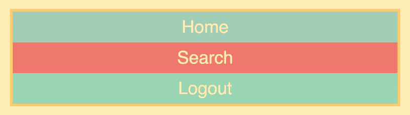
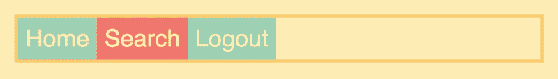
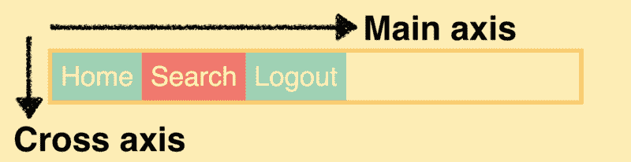
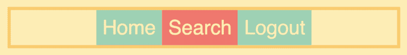
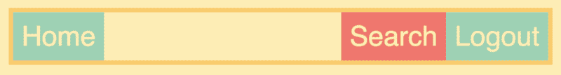
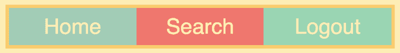

# 5 分钟学会 CSS Flexbox 初学者教程

> 原文：<https://www.freecodecamp.org/news/learn-css-flexbox-in-5-minutes-b941f0affc34/>

#### 流行布局模块的快速介绍

在这篇文章中，你将学习 CSS Flexbox 的基础知识，在过去的几年中，它已经成为 web 开发人员和设计人员的必备技能。

我们将以 navbar 为例，因为这是 Flexbox 的一个非常典型的用例。这将向您介绍该模块最常用的属性，而忽略那些不太重要的属性。

我还在 Flexbox 上创建了一个 12 节的免费课程。如果你感兴趣，请点击这里！

现在让我们开始吧！

### 您的第一个 Flexbox 布局

Flexbox 布局的两个主要组件是**容器**和**项目**。

以下是我们示例的 HTML，它包含一个包含三个项目的容器:

```
<nav class="container">  
  <div>Home</div>  
  <div>Search</div>  
  <div>Logout</div>  
</nav> 
```

在我们将其转换为 Flexbox 布局之前，这些元素将像这样堆叠在一起:



我添加了一些样式，但这与 Flexbox 无关。

为了将它转换成 Flexbox 布局，我们只需给**容器**以下 CSS 属性:

```
.container {  
    display: flex;  
} 
```

这将自动沿着水平轴很好地定位项目。



如果你想看看实际的代码，你可以去这个 Scrimba 游乐场。

现在让我们把这些物品稍微移动一下。

### 对齐内容并对齐项目

**Justify-content** 和 **align-items** 是两个 CSS 属性，帮助我们分发容器中的项目。它们控制物品如何沿着**主轴**和**横轴**定位。

在我们的例子中(但不总是)，主轴是水平的，横轴是垂直的:



在本文中，我们将只看一下`justify-content`，因为我发现这个比`align-items`用得多。然而，在[我的 Flexbox 课程](https://scrimba.com/g/gflexboxhttps://scrimba.com/c/c3zpnuB?utm_source=freecodecamp.org&utm_medium=referral&utm_campaign=gflexbox_5_minute_article)中，我详细解释了这两个属性。

让我们使用`justify-content`将所有项目沿**主轴**居中:

```
.container {  
    display: flex;  
    justify-content: center;  
} 
```



或者我们可以将它设置为`space-between`，这将在项目之间增加空间，就像这样:

```
.container {  
    display: flex;  
    justify-content: space-between;  
} 
```


以下是您可以为`justify-content:`设置的值

*   灵活启动(**默认**)
*   挠性端
*   中心
*   间距
*   周围空间
*   等间距

我建议你试试这些，看看它们在页面上的表现如何。这应该会让你对这个概念有一个正确的理解。

### 控制单个项目

我们还可以控制单个**项目**。比方说，我们希望将前两项保留在左侧，但将`logout`按钮移到右侧。

为此，我们将使用将边距设置为`auto`的老方法。

```
.logout {  
    margin-left: auto;  
} 
```


如果我们希望将`search`项和`logout`项都推到右边，我们只需将`margin-left`添加到`search`项即可。

```
.search {  
    margin-left: auto;  
} 
```

它会将搜索项尽可能推至右侧，这又会将注销项推至右侧:



### flex 属性

到目前为止，我们只有固定宽度的项目。但是如果我们想让他们有所反应呢？为了实现这一点，我们有一个名为`flex`的属性。这比使用百分比的老方法简单多了。

我们将简单地将所有项目作为目标，并给它们一个`1`的`flex`值。

```
.container > div {  
    flex: 1;  
} 
```



如您所见，它拉伸项目以填充整个容器。

在许多情况下，您可能希望其中一个项目占用额外的宽度，因此只将其中一个项目设置为具有灵活的宽度。例如，我们可以让`search`项占据所有额外的空间:

```
.search {  
    flex: 1;  
} 
```


在结束本文之前，我想提一下，flex 属性实际上是三个属性的简写: **flex-grow** 、 **flex-shrink** 和 **flex-basis** 。然而，学习这些需要五分钟以上的时间，因此超出了本教程的范围。

如果你对学习它们感兴趣，我会在我的免费 Flexbox 课程中详细解释这三个属性。

现在你已经学会了基础知识，你一定可以参加我的全程课程，成为 Flexbox 大师！

* * *

感谢阅读！我的名字叫 Per Borgen，我是最简单的学习编码方法——Scrimba 的联合创始人。如果你想学习建立专业水平的现代网站，你应该看看我们的[响应式网页设计训练营](https://scrimba.com/g/gresponsive?utm_source=freecodecamp.org&utm_medium=referral&utm_campaign=gflexbox_5_minute_article)。


[Click here to get to the advanced bootcamp.](https://scrimba.com/g/gresponsive?utm_source=freecodecamp.org&utm_medium=referral&utm_campaign=gflexbox_5_minute_article)