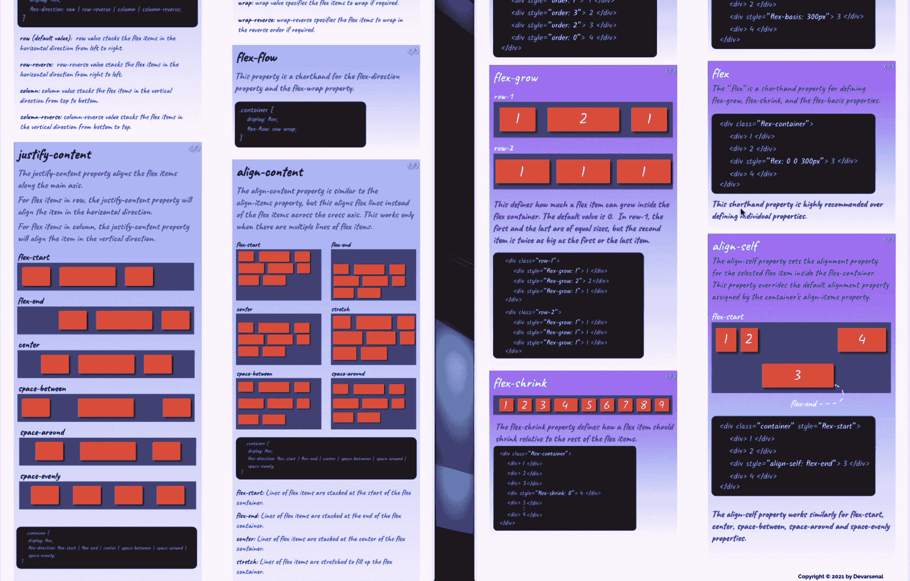

# 在本速成课程中学习 CSS Flexbox

> 原文：<https://www.freecodecamp.org/news/learn-css-flexbox/>

如果你想让你的网站反应灵敏，理解 CSS Flexbox 是非常有用的。

Flexbox 是一个强大的响应式 web 设计工具，内置于 CSS 本身。

我们刚刚在 freeCodeCamp.org YouTube 频道上发布了一个 CSS Flexbox 速成班。

詹姆斯·麦克斯韦创立了这门课程。他不仅创建了课程，而且还创建了一些令人惊叹的 PDF 备忘单。

Flexbox Cheat Sheets

flex 布局模型允许根据屏幕大小自动排列容器中的响应元素。

您将了解显示、伸缩方向、伸缩环绕、伸缩流动、内容对齐、项目对齐、内容对齐等属性。

你可以在下面或者 freeCodeCamp.org YouTube 频道 (35 分钟的观看)上观看完整的课程。

[https://www.youtube.com/embed/tXIhdp5R7sc?feature=oembed](https://www.youtube.com/embed/tXIhdp5R7sc?feature=oembed)

## 副本

(自动生成)

如果你想创建一个有响应的网站，理解 CSS Flexbox 是很重要的，James Maxwell 创建了这个课程，还有一些令人惊讶的 PDF 备忘单。

Flexbox 将会改变你对网页设计的看法。

再一次，当然是为了权力，我已经创建了两个漂亮的 PDF 备忘单，你可以下载。

这些小抄包含了我们现在将要学习的每一个属性。

一个专用于父容器属性，另一个专用于子属性。

你可以使用这个备忘单作为你未来的参考，我强烈建议大家现在就跟随视频，然后以后再使用这些备忘单。

因此，让我们深入了解 Flexbox 的概念。

没有任何进一步的延迟，我们将为此学习目的创建一个单独的文件，以便您将来可以参考该文件以及备忘单。

让我们使用 Emmet 函数快速建立一个头部相扑文件。

现在，我要教你们另一个嵌入函数来创建一个容器和里面的孩子。

所以我们需要一个带有类容器的 div 标签。

然后在一个大于号内创建几个子容器。

让我们给子元素一个名为 items 的类。

因此，我们将不得不再次输入一个 dart 并输入条目。

我们还希望每个子元素都有一个唯一的编号。

所以插入一个连字符，然后插入$1 符号乘以 5。

这个 Emmet 函数将创建一个容器，其中有五个编号的项目。

我们还希望这些项目有一个统一的别名。

我们称之为物品。

因此，再次插入一个省道，只需输入项目。

现在按回车键。

有多简单？这可能一开始看起来有点吓人。

但是一旦你习惯了，没有这些漂亮的图像函数，你将无法创建头部相扑容器。

要了解这些 mn 函数的更多信息，可以访问 Doc 的 dot me.io。

现在，在移动到我们的 CSS 文件之前，我们必须在一个 div 标签中填充数字。

让我们快速创建一个 CSS 文件并链接到 HTML 文件。

让我们从使用通用选择器的基本复位开始。

因此，我们将设置空白为零填充到零，框大小边框框。

接下来，我们将设计容器和子元素的样式来实现 Flexbox 属性。

所以我们现在要瞄准集装箱。

并给它一个背景色哈希 Ca Ca NCAA，这是一个浅灰色。

然后给它填充 10 个像素。

然后是 50 像素的空白。

接下来，我们将讨论项目选择器。

我们要给他们一个哈希的背景色，ff 0037，这是一个很好的红色。

然后对于字体和项目，他们会给他们一个白色。

字体大小为 35 像素，填充为 20 像素，边距为 10 像素。

如果你看到这里，我们还没有实现任何 Flexbox，但我们有一个灰色的容器和容器内的红色项目。

这些项目可以是真实网站中的任何东西。

它可以是网站的导航条，或者几个主要的段落或者其他什么。

这个视频是关于 Flexbox 容器属性的。

要启用 Flexbox，我们必须将显示属性设置为容器内部的 flex。

因此，让我们将显示属性设置为容器内的 flex。

你可以看到 magic Flexbox 已经完成了很多工作。你可以看到，使用 float 属性 position 属性和 margin 属性创建这种布局，这将是一个繁琐的过程，我个人绝不会冒这个风险，只是通过在父容器中将 display 属性设置为 flex，子元素就变成了 flex 项目。

现在，让我们来谈谈“弯曲方向”属性。

flex direction 属性用于查找容器内 flex 项目的方向。

默认情况下，伸缩方向设置为一行。

当伸缩方向设置为一行时，您会看到什么也没有发生。

除了 row 之外，还有一些其他的方向值会改变容器内的子元素的方向。

让我们一个一个来看。

当我们更改“伸缩方向”列时，您可以看到子项在一列中垂直排列。

那就是超能力 Flexbox。

通过将方向设置为列，我们已经改变了轴本身。

根据 Flexbox 有两种不同的轴，主轴和横轴，不同方向的轴不同。

对于伸缩方向集行，主轴将是 x 轴。

对于列的伸缩方向设置，主轴将是 y 轴。

这个概念与 Flexbox 无关，我们的 web 开发，这个基本的数学，要反转列或行中 flex 项目的方向，我们可以使用列反转或行声音值。

当方向被设定时，列反转。

您可以看到项目的方向在 y 轴上颠倒了。

所以主轴从底部到顶部，然后从顶部到底部。

当然，数字的顺序是相反的，一个在顶部，一个不在底部。

同样的规则也适用于反过来，你可以选择一个正确的词。

所以当我说反屈时。完全正确，它以相反的顺序堆叠项目。

在这里，主轴线大部分从右向左。

而且数字也是逆序的，你要时刻注意主轴。

那真的很重要。

因为我们已经试验了所有可能的 flex 反应属性值，所以让我们将它设置回默认值 row。

我们还没有深入了解 Flexbox，但我相信你能理解 Flexbox 对我们设计响应式设计的帮助有多大。

可能当设计一个较小的屏幕时，我们可以简单地将伸缩方向设置为 column，这将把项目一个接一个地堆叠起来。

这就是弯曲方向。

接下来，我想讨论一下调整内容属性。

所以请记住，调整内容正确地定义了伸缩项应该如何沿着主轴堆叠。

让我们从这里的中心值开始。

现在，所有 flex 项目都自动堆叠在中间。

让我放大一点，这样你可以看得更清楚。

是的，你总是可以使用开发工具来检查元素。

浏览器已经知道这个 div 标签正在使用 Flexbox。

当您将鼠标悬停在“调整内容”属性上时，您可以看到 Flexbox 计算距离并将项目居中对齐的方式是多么的完美。

想象一下，如果我们没有 Flexbox。

来创建这个非常简单的布局。

嗯，我们应该使用一个浮动属性，这对我们来说是一个真正的噩梦。

因此，中心值将 flex 项对齐到容器的中心。

但是它不会对项目之间的空间做任何事情。

项目之间的空间是因为我们给项目选择器的边距值。

因此，如果注释是 value，您可以看到 flex 项目被紧密打包。

让我们快速取消注释此边距，并试验下一个值“间距”,让我们更改“两端对齐内容间距”,然后我们说“两端对齐内容间距”,您可以看到我们的 flex 项目之间的间距是均匀分布的。

我们不必在这里指定任何数字，但 Flexbox 会自动计算距离，并根据可用空间分配物品。

这里最好的部分是另一边。

有了浏览器，物品之间的间距也随之调整。

这使得创建响应式布局非常方便。

现在，让我们再次讨论项目选择器中的 margin 属性，因为我们将探索另一个值，该值类似于称为“周围空间”的间距。更改“周围内容空间”可以看到“周围空间”值在 flex 项目的左侧和右侧创建了等量的空间。

这两项之间的间距是该项左侧间距的两倍。

接下来，我们将看到空间平均价值。

所以均匀地改变船的图标或空间。

当我开始使用 flex box 时，我最初不明白这些值之间的区别，这完全正常。

一旦你开始在你的项目中使用它们，你就会开始理解这些价值。

因此，将该值设置为“均匀间隔”,可以看到伸缩项之间的间隔均匀分布在两侧。

弹性项 1 和弹性项 2 之间的间距与其余部分相同。

因此，虽然空间 II 将确保项目之间的空间在两侧总是相同的，但自然周围的空间即每个项目周围的空间在左侧和右侧都是相同的。

差别肯定不大，但是用法完全不一样。

“对齐内容”属性还有两个值，即“伸缩开始”和“伸缩结束”值，以及它们为“伸缩开始”提供的“对齐内容”。

这是默认值。

让我们取消对 margin 值的注释，以确保它是默认值。

现在，如果他说调整内容，一个灵活的结束。

这里有一个非常完整的注意。

人们经常混淆原始反转和价值弹性。

反转将反转弹性项目的顺序。

但是当您将 flex 项目移动到容器末尾时，flex in 值会保持边距(如果提供的话)。

好了，我们将在本视频中讨论的最后一个属性是对齐项目。

“对齐内容”属性将伸缩项沿主轴对齐，但“对齐项”属性将伸缩项沿横轴对齐。

为了使 Align items 属性起作用，我们现在将使其中一个 flex 项比其余的大。

因为每个 flex 项目都有一个统一的隐藏。

所以很难演示 Align items 属性来选择第三个项目并将其高度设置为 150 像素。

我们还可以更改“调整资源中心”。

这就是了。

我只是注意到我的命名有错误。

我已经包括项目的数字，这应该是四个项目，这完全没问题。

在这里，您可以看到所有 flex 项现在都有 150 像素的高度，而不仅仅是 flex 项三。

这不是一个错误，但它发生是因为我们的行项目的默认值是 scratch。

当要拉伸行项目时，会发生以下情况。

因此，让我们也添加对齐项目到中心。

好了，我们可以看到对齐项目属性如何沿横轴对齐或伸缩项目。

这里我们有一个比其他项目都大的 flex 项目。

通过对齐项目属性服务中心，我们以垂直方式将较小的 flex 项目相对于较大的项目居中。

如果我们现在将对齐项目设置为 flex start，所有项目将从顶部开始，沿着较大的 flex 项目的顶部。

如果我们说将项目对齐到弯曲端，则会发生相反的情况。

因此伸缩项在底部相等地对齐。

到目前为止，我们看到了“中心伸缩”开始伸缩以及“对齐项目”属性的拉伸值。

拉伸值价格拉伸所有弹性项目的高度，以匹配最高弹性项目的高度。

对齐项目属性还有最后一个值，称为基线。

它在于基线值首先要增加其中一个项目的字体大小。

所以让我们选择第四项，并将其字体大小增加到声音像素。

如果我们现在将 Align items 设置为 baseline，您可以看到，它将所有 flex 项沿着第四项内的文本对齐到一个假想的行上。

我不会重置一个行项目中心，并删除第四项和第项。

这里是三号选择器。

好了，我们就要结束这段视频了。

因此，伸缩方向、对齐内容和对齐项是最重要和最常用的属性。

当然，还有一些其他属性，但我们将在另一个视频中看到。

在我们结束这个视频之前，我想回答一个评分最高的问题，如何调整内容和对齐项目属性以及伸缩方向而不是列？好吧，我们去看看。

太好了。

如果你注意到，主轴现在已经变了。

它不再是从左向右了。

但它是从上到下的。

一切都很好。

但是为什么这些项目还没有对齐到中心呢？嗯，那是由于对齐项目，他们说中心和伸缩方向的一组列。

当弯曲方向设置为列时，主轴将为 y 轴，横轴将为 x 轴。

我们知道对齐项目属性会影响横轴。

这就是为什么我们的项目在中心垂直排列。

因此，如果我们现在将对齐项设置为 flex end，您可以看到这些项在容器的末端垂直对齐。

如果我们说将项目对齐到 flex start，则会发生相反的情况。

是的，这些项目被堆叠在容器的开始处。

因此，我要再次强调，你们要始终跟踪主轴和横轴，以便以正确的方式调整内容和对齐项目。

现在为了让你更好的理解。

当屈肌动作是一个调用时，我还将试验 justify 内容。

为此，我们应该首先为容器设置一个高度值。

所以也许我们把它设置为 1400 像素。

然后我会缩小我的视窗。

现在，如果我将鼠标悬停在我的开发工具上的“调整内容”上，您可以看到项目之间的空间分布就像我们之前看到的一样，但是是在垂直方向上。

好了，视频到此结束。

我知道我会带着怀疑的态度离开你们大多数人。

但这对任何初学者来说都是正常的。

我第一次学 Flexbox 的时候也是这种感觉。

这就是为什么我做了那些漂亮的小抄作为参考。

我觉得如果有人在我开始学习 Flexbox 时给我这些备忘单会更好。现在，您可以随备忘单一起重新观看此视频，以便更清楚地了解这些概念。

让我们快速设置伸缩方向行，删除高度，并在对齐项目中心设置对齐内容，并结束此视频。

太好了。

让我们在下一次讲座中再次见面，了解更多关于 Flexbox 的概念。

上一讲，我们学习了 Flexbox 容器的三个重要属性。

还有一些，但我们稍后会看到。

现在，在本视频中，让我们了解一下 Flexbox 的子属性。

这就是我们上次视频离开的地方。

这堂课我们要学的第一个属性是 Align self 属性。

“镜头”属性类似于“对齐项目”属性。

在 align items 属性的帮助下，我们能够共同更改 flex 项沿横轴的对齐方式，但是 Allen self 属性将沿横轴对齐一个 flex 项。

它还可以覆盖对齐项目属性。

我知道这听起来像天书，让我们看看他们的行动，了解它是如何工作的。

为了试验属性的轮廓，让我们再次创建第三项选择器，并将其高度设为 150 像素。

你要用第三项作为参考点。

所以让我们试着把镜头切换到第四项。

在第三项之后，您将创建第四项选择器，并在这里创建一个属性镜头。

让我们将其设置为弹性启动。

您可以看到，当第四个项目在 flex 容器的开头对齐，并且所有 flex 项目都沿横轴与第三个项目的中心对齐时，align self 属性接受 align items 属性接受的每个值。

但是正如我之前告诉你的，我们只使用属性镜头来对齐单个项目。

现在，让我们把它改成 flex，看看会发生什么。

因此，该项目已经移动到 flex 容器的底部。

当艾伦的办公室说。

嗯，这个项目延伸到最高的项目的高度，在我们的例子中是第三个项目。

现在，我把这个留给你们。

继续试验其他可能的值，如中心间距、周围均匀间距，并尝试分析用例。

接下来，我们将讨论 flex 项目的顺序。

auto 属性用于更改容器中 flex 项的部分，以试验该属性为所有 flex 项创建选择器，并更改 order 的初始值 order zero。

因此，根据 Flexbox，flex 项目 1 位于零部分。

让我们为每个 flex 项目设置 order 属性，并更改药剂。

所以我们要把第一项移到第三项。

然后第二项，对第三项提问，对第一项提问。

问题二的第五项。

因此，在保存文件后，您可以看到我们的项目被重新定位。

我想让你们明白，这里给出的这些值只是实验值。

你可以按照你的意愿继续安排这些项目。

但是，我再次鼓励每个人遵守我在这里给出的命令，这样我们就能继续在同一条轨道上前进。

如果你看到这里，1 是第三个问题，第三个问题是在第四个问题上加 0，这是第一个问题，phi 是第二部分。

当涉及到响应式设计时，auto 属性将方便我们重新定位部分元素。

你可以看到有些人用负值来改变顺序。

但是我从来不鼓励任何人使用负值，这会让我们在将来查看代码时感到困惑。

这是所有关于汽车的属性。

我们现在将看到与 flex box 子项关联的最后三个属性。

flex 增加 flex 环和 flex 基础，并从所有 flex 项目中移除自动属性。

第一个看到 flex grow 属性的人。

flex 组属性使 flex 项目能够增长。

增大伸缩项。

我们所做的就是指定一个整数，就像我们分配给 auto 属性的那样。

来试验这种特性。

让我们在项目选择器中应用一般。

因此，我将创建一个 flex 组属性，并将其设置为 1。

嗯，所有 flex 项目的尺寸都变大了。

因此，这里所有的 flex 项目都占据了可以放入容器的空间。

换句话说，如果我们再次使用 margin 属性，那么占据容器内最大可用空间的效果会更好。

您可以看到，它们现在相互接触，占据了所有可能的空间，这就是我们现在揭示的这一利润属性的 flex grow 属性。

所以即使你把这个改变 200，它们也不会比这个大。

这是因为价值只与其他部分相关。

让我们将这个值重置为 1，并尝试理解这个值有什么关系。

与其他弹性增长值相关。

让我们为第四项添加一个 flex 组属性，并赋予它三个属性。

所以在这里，第四项比 flex 的其他项大三倍。

至此，我相信您可以理解 flex 组属性是如何相对工作的。

当我把这个 3 改成 5 时，它将会比其他 flex 项目大 5 倍。

这就是关于 flex 组属性的全部内容。

让我们从第四项中删除弹性组属性，并讨论短端属性。

因此，我们学习的最后几个属性有一个缩写属性，我们可以使用 flex 关键字直接调用它们。

因此，使用 flex 关键字，我们可以声明三个不同的值。

第一个值将用于 flex grow 属性，第二个值将用于 flex ring。

最后一个是 flex basis，那么我们只需给第一个值一个，它就会自动理解我们声明的是 flex grow 值。

因此，如果记住这里的 grow 关键字，每个 flex 项仍然占用最大空间。

当涉及到现实世界的项目时，这种方法将会非常方便。

在大多数情况下，我们会在项目中使用速记属性。

也许我们希望我们的一个 flex 项目比其他项目增长得更大。

例如，让我们尝试种植最后一个项目。

现在将 flex five 设置为 item number five，您可以看到它占用了最大的空间，其余的占用了相对可用的空间。

这都是关于 flex grow 属性的。

接下来，我们将看到灵活基础属性。

Flex basis 属性将设置 Flex 项目的宽度。

除了使用 width 属性，我们还可以使用 flex basis 属性或 width 属性来表示 flex basis。

那总是个人的选择。

但在我看来，我认为使用弹性基础属性总是好的，这样我们就能够区分弹性项目和名义项目。

现在，对于我们的示例，我将把它改为弹性基准，并说这是 75%。

当我们使用 flex basis 属性时，我们应该声明基于百分比的值或基于像素的值。

现在，第五项占据了容器的 75 %,通过在后台将 flex basis 设置为 auto，其余项被修改为占据剩余的 25%的空间。

如果您不能理解这些属性之间的区别，请不要担心。

在我们的课程中，你会经常用到它们。

所以你最终会在实践中理解它们。

我们将在本视频中看到的最后一个属性是 flex shrink。

为了向你们展示断裂属性的作用，让我将这个百分比值改为基于像素的值。

也许让我把这个改成 700 像素。

没错。

让我也最小化我的浏览器窗口来演示这个属性。

现在，如果我增加视窗宽度，看看会发生什么。

所以你可以看到我们的第五项在某个断点收缩了。

尽管将其伸缩基准设置为 700 像素，但它会在某一点收缩。

为了避免这种情况，我们声明了 flex string 属性并将其设置为零。

flex 字符串属性仅有的两个值一和零。

所以它是一个二进制属性。

默认情况下，它被设置为 1，这意味着它将在某一点收缩弹性项目。

让我们试着将 flex string 属性设置为零，看看会发生什么。

但在此之前，让我扩大我的浏览器窗口大小去我的文本编辑器。

我将为第五项设置一个平面字符串属性，并将其设置为零。

现在，如果我尝试减小浏览器窗口的大小，您可以看到，在将“屈曲”设置为零后，无论我们从视窗中取出多少大小，第五项都不会缩小。

但是其余的项目溢出了视口。

在大多数情况下，人们忽略了理解他们使用的伸缩环属性。

在实时环境中，我们使用一个 flex 关键字，在这里我们可以连续声明所有三个属性 flex grow flex ring，以及我们希望作为 flex basis 目标的 flex basis，也就是用来设置 flex 项的 width 属性。

这也是我们在课程中实施的方式。

看完这个视频，我非常鼓励大家打开小抄，练到这一步。

在下一个视频中，我们将学习 flex 容器属性的其余部分。

在我们结束这一节之前，我想教你们如何将大量的 flex 项目处理到 flex 容器中。

所以现在我们有五个弹性项目。

让我们简单地将另外五个 flex 项添加到我们的容器中，并接收类名。

因此，您可以看到，所有这些 flex 项目都被紧密打包以适合容器，有些项目在将浏览器缩放至 150%时溢出了 flex 容器，这是为了进行演示。

如果你没有发现这些项目溢出，只要像我说的那样缩放你的浏览器窗口。

现在回到正题，我们有这部分的最后一个视频。

因为他们有一个解决方案，如果你发现一个灵活的项目变得像这样局促。

所以我们可以使用 flex wrap 属性来解决这个问题。

“柔性环绕”的默认值是“无环绕”。

这就是为什么我们的 flex 产品会溢出容器。

但是如果我们在容器选择器中创建一个 flex wrap 属性并将其设置为 wrap。

然后这将创建一个像这样的新行，以适应容器中的所有 flex 项目。

假设我们是第 10 项的选择器，并将 flex 设为 1。

你可以看到 10 号商品占据了生产线上最大的空间。

现在，如果缩小浏览器大小，flex wrap 属性将越来越多地包装 flex 项目，以确保所有 flex 项目都适合容器。

再一次，这对于响应式设计非常有用，这样我们在屏幕上的空间就少了。

现在让我增加容器的高度，给你们看看会发生什么。

我们把它设为 600 像素，看看会发生什么。

所以这里我们还有两行。

但是为什么我们在中间有这么一片空白？

这是因为我们还没有讨论过对齐内容属性。

这又是一个 flex 容器属性。

因此，让我们在容器选择器中创建它的 align content 属性，并将其设置为 flex start。

现在你可以看到，flex 容器中的每一行都在容器的顶部。

因此，对齐内容属性将横轴中的行与容器对齐。

同样，我们可以对属性中的 alencon 使用与岛屿项目和岛屿属性相同的值。

在这里，我希望大家暂停视频，并分析 LM 内容属性中的对齐项目自对齐之间的差异。

现在让我们设置 LM 资源中心。

如你所见，a 行在容器的中心对齐。

我们也可以改变弯曲端。

是的，这些行在容器的末尾。

然后让我们看看空间之间的周围空间，最后是均匀的空间。

所以老路走在同一个逻辑上，如你所见，这些性质需要你花一些时间去记忆。

但是你不必真的担心，因为从现在开始，在我们的主要项目中唯一要使用的就是 Flexbox。

向所有人致敬。

我们已经掌握了 Flexbox 的概念。

我们不要再浪费时间了。

我们有一个美丽的应用程序将在我们的网站内构建。

因此，在下一部分，我们将重建导航栏和英雄部分，然后我们将继续我们的应用程序。