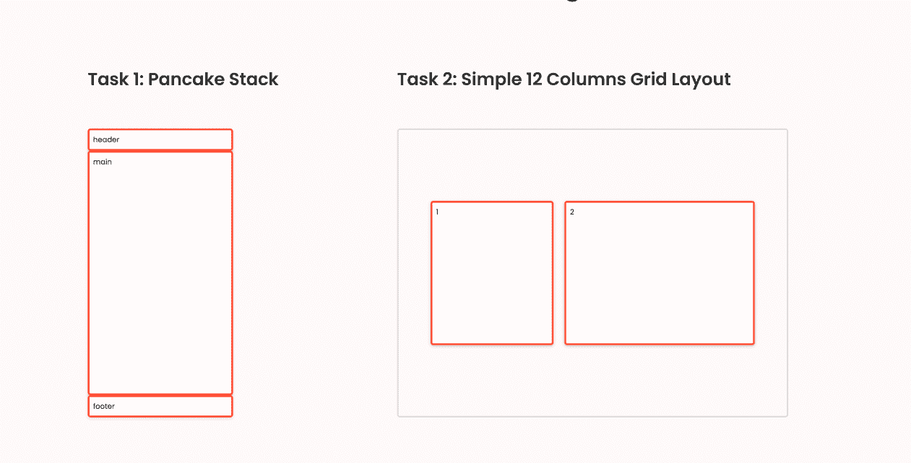
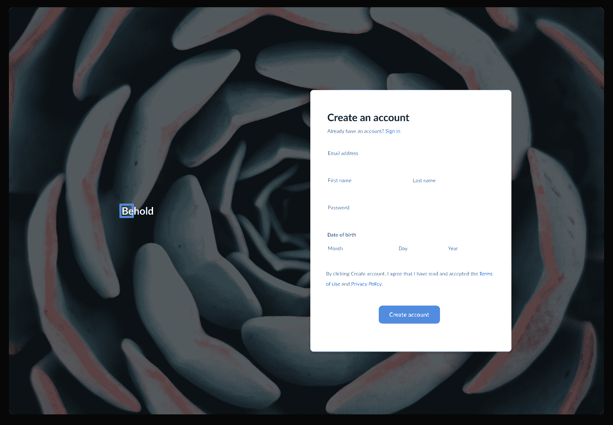
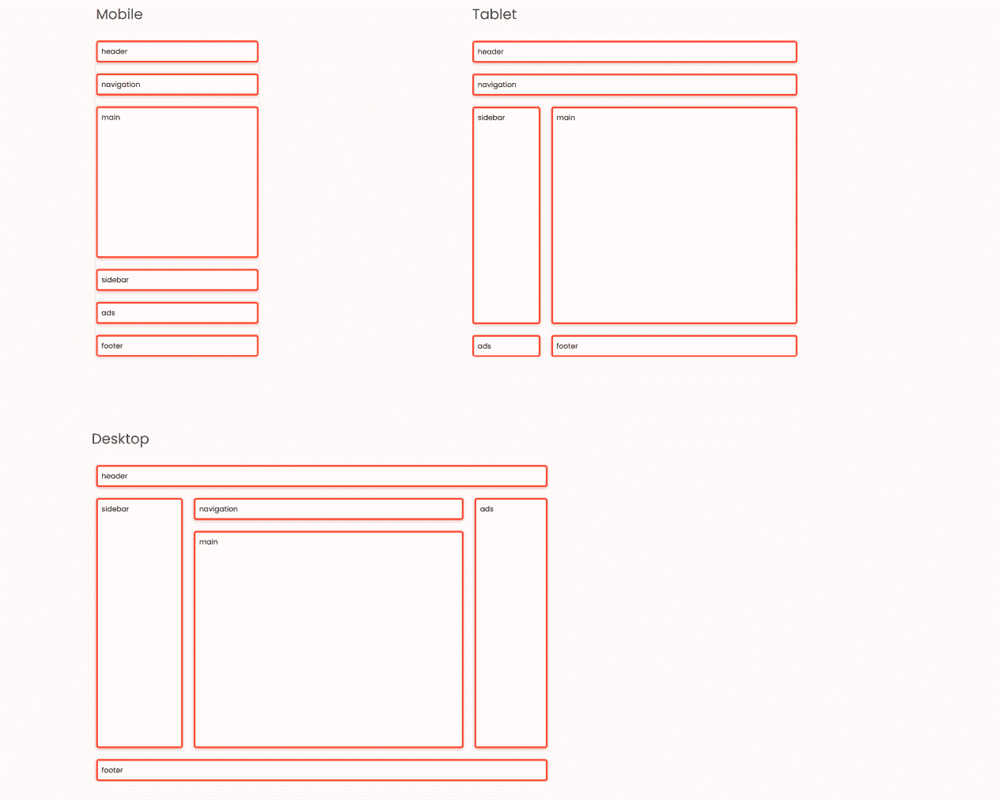
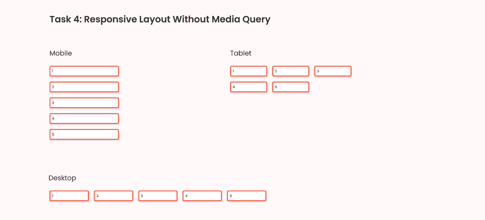
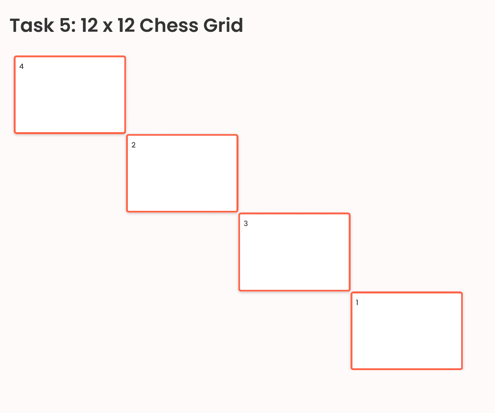

# 通过在 17 分钟内构建 5 个布局来学习 CSS 网格

> 原文：<https://www.freecodecamp.org/news/learn-css-grid-by-building-5-layouts/>

CSS Grid 是一个工具，你可以用它来帮助你的网站创建布局。如果您需要考虑不同元素的位置、层或大小，这将非常有用。

CSS 网格比较复杂，要学的东西很多。但是好消息是你不需要一下子知道所有的事情。

在本教程中，我们将使用 CSS Grid 构建 5 种不同的布局(在下面解释为 5 个独立的任务)。在本教程结束时，您将准备好在您的下一个项目中使用 CSS Grid。

如果您想继续编写代码，请务必下载参考资料:

*   [任务-设计](https://bit.ly/38TbZum)
*   [CSS-Grid-Starter](https://bit.ly/38MyQYy)

如果你想补充这篇文章，你可以看一个视频:

[https://www.youtube.com/embed/CC2HkBZuReY?feature=oembed](https://www.youtube.com/embed/CC2HkBZuReY?feature=oembed)

CSS Grid

以下是我们将构建的前两个布局:



Task 1 and task 2

## 1:如何用 CSS 网格构建煎饼堆栈

对于第一项任务，我们需要创建一个煎饼堆栈布局。为了创建这个布局，我们可以使用`grid-template-rows: auto 1fr auto`创建三行。值为`1fr`的第二行将尽可能地扩展，而另外两行只有足够的空间来包装它们的内容。

因此，要实现这种布局，我们所要做的就是给容器提供以下参数:

```
.task-1.container {
  display: grid;
  height: 100vh;

  grid-template-rows: auto 1fr auto;
} 
```

你可以在任何地方看到这种布局，例如，在我的一个教程中:


如果你想观看并编码，这里是 YouTube 的链接。

## 2:如何用 CSS 网格构建一个简单的 12 列网格布局

基本的 12 列网格布局由来已久。有了 CSS Grid，就更容易使用了。在这个简单的任务中，我们需要给`item-1`四列和`items-2`六列。

首先，我们需要创建 12 列。我们可以用 `grid-template-columns: repeat(12, 1fr);`做到这一点:

```
.task-2.container {
  display: grid;
  height: 100vh;

  grid-template-columns: repeat(12, 1fr);
  column-gap: 12px;

  align-items: center;
} 
```

注意这里我们在每一列之间也有`12px`间隙。类似于 Flex，我们也可以使用`align-items`和`justify-content`。

我们需要做的下一件事是告诉项目应该占据哪一列:

对于第 1 项，我们希望它从第 2 列开始，到第 6 列结束。所以我们有:

```
.task-2 .item-1 {
  grid-column-start: 2;
  grid-column-end: 6;
} 
```

请注意，该项目将不包括第 6 列，只包括第 2、3、4 和 5 列。

我们也可以通过写作产生同样的影响:

```
.task-2 .item-1 {
  grid-column-start: 2;
  grid-column-end: span 4;
} 
```

或者

```
.task-2 .item-1 {
  grid-column: 2 / span 4;
} 
```

按照同样的逻辑，我们将得到项目 2 的以下内容:

```
.task-2 .item-2 {
  grid-column: 6 / span 6;
} 
```

你可以看到 12 列布局无处不在——这是一个我使用这种技术的教程。



如果你想观看并编码，这里是 YouTube 的链接。

## 3:如何在有和没有`grid-template-areas`的情况下构建响应式布局

在这里，我将向您展示两个选项。对于第一个选项，我们将使用在第二个任务中学到的 12 列网格。

对于第二个选项，我们将使用一个名为`grid-template-areas`的属性。



### 第一个选项:如何使用 12 列网格

#### 移动的

这很简单。我们可以利用从第一项任务中学到的知识，扩展主要部分。我们也可以像在桌面中一样给网格一个`gap: 24px`。将会有列，而不仅仅是行:

```
.task-3-1.container {
  display: grid;
  height: 100vh;

  grid-template-rows: auto auto 1fr auto auto auto;
  gap: 24px;
} 
```

#### 药片

在屏幕比`720px`宽的平板电脑上，我们想要 12 列 4 行。第三行将尽可能地扩展:

```
@media (min-width: 720px) {
  .task-3-1.container {
    grid-template-columns: repeat(12, 1fr);
    grid-template-rows: auto auto 1fr auto;
  }
} 
```

现在我们有 12 列，我们需要告诉每一项应该占多少列:

```
@media (min-width: 720px) {

  // The header section takes 12 columns
  .task-3-1 .header {
    grid-column: 1 / span 12;
  }

  // The navigation section also takes 12 columns
  .task-3-1 .navigation {
    grid-column: 1 / span 12;
  }

  // The main section takes 10 columns start from column 3
  .task-3-1 .main {
    grid-column: 3 / span 10;
  }

  // The sidebar takes 2 columns start from column 1
  .task-3-1 .sidebar {
    grid-column: 1 / span 2;
    grid-row: 3;
  }

  // The ads section takes 2 columns start from column 1
  .task-3-1 .ads {
    grid-column: 1 / span 2;
  }

  // The footer section takes 10 columns start from column 3
  .task-3-1 .footer {
    grid-column: 3 / span 10;
  }
} 
```

注意这里我们需要给出`.task-3-1 .sidebar` `grid-row: 3;`，因为侧栏在 DOM 中的`main`部分之后。

#### 桌面

对于桌面视图，我们将使用比`1020px`更大的屏幕。因为我们已经有 12 列，现在我们只需要告诉它应该使用多少列:

```
@media (min-width: 1020px) {

  // The navigation takes 8 columns starting from column 3
  .task-3-1 .navigation {
    grid-column: 3 / span 8;
  }

  // The main section takes 8 columns starting from column 3
  .task-3-1 .main {
    grid-column: 3 / span 8;
  }

  // The sidebar starts from row 2 and ends at row 4
  .task-3-1 .sidebar {
    grid-row: 2 / 4
  }

  // The ads section takes 2 columns starting from column 11
  // it also takes 2 rows starting from row 2 and ending at row 4
  .task-3-1 .ads {
    grid-column: 11 / span 2;
    grid-row: 2 / 4;
  }

  // The footer section takes 12 columns start from column 1
  .task-3-1 .footer {
    grid-column: 1 / span 12;
  }
} 
```

### 现实生活中的例子

你可以在 Dev.to 的主页上找到类似的布局:


### 第二个选项:如何使用`grid-template-areas`

在使用`grid-template-areas`之前，我们需要使用`grid-area`定义项目的面积:

```
.task-3-2 .header {
  grid-area: header;
}

.task-3-2 .navigation {
  grid-area: nav;
}

.task-3-2 .ads {
  grid-area: ads;
}

.task-3-2 .sidebar {
  grid-area: sidebar;
}

.task-3-2 .main {
  grid-area: main;
}

.task-3-2 .footer {
  grid-area: footer;
} 
```

在定义了项目区域之后，我们所要做的就是使用`grid-template-areas`给容器指定位置:

#### 移动的

```
.task-3-2.container {
  display: grid;
  height: 100vh;

  gap: 24px;

  // Creating 6 rows and 3rd row expands as much as it can  
  grid-template-rows: auto auto 1fr auto auto auto;

  // Defining the template
  grid-template-areas:
    "header"
    "nav"
    "main"
    "sidebar"
    "ads"
    "footer";
} 
```

所以在 mobile 上，我们创建 1 列 6 行。第 3 行，也就是主行，应该尽可能地扩展。

如果以后您想更改项目的顺序/位置，这也很容易。例如，如果我们希望在标题前有导航，我们可以这样做:

```
...
 grid-template-areas:
    "nav"
    "header"
    "main"
    "sidebar"
    "ads"
    "footer";
... 
```

#### 药片

```
@media (min-width: 720px) {
  .task-3-2.container {
    // Creating 4 rows and the 3rd row expands as much as it can
    grid-template-rows: auto auto 1fr auto;

    // Defining the template (3 columns)
    grid-template-areas:
      "header header header"
      "nav nav nav "
      "sidebar main main"
      "ads footer footer";
  }
} 
```

使用上面的代码，如果屏幕宽于 720 像素，我们想要创建 3 列 4 行。标题和导航都占了 3 列。

在第三和第四行，侧边栏和广告占 1 列，而主页面和页脚占 2 列。

#### 桌面

```
@media (min-width: 1020px) {
  .task-3-2.container {
    // Creating 4 rows and the 3rd row expands as much as it can
    grid-template-rows: auto auto 1fr auto;

    // Defining the template (4 columns)
    grid-template-areas:
      "header header header header"
      "sidebar nav nav ads"
      "sidebar main main ads"
      "footer footer footer footer";
  }
} 
```

这里我们发现了与平板电脑视图相似的逻辑。对于桌面，我们根据`grid-template-areas`的值创建 4 列 4 行和位置。

### 你应该选择哪个？

**使用******12 列网格**:**

**➕易于快速启动
➕易于维护以列为中心的布局
➖难以在复杂布局中排列项目**

 **对于不太复杂的布局，您应该使用 12 列网格，主要关注列的排列。

**使用** `**grid-template-areas**`:

➕灵活应对复杂布局
➕易于可视化
➖需要更多时间来实施

对于需要关注许多元素的位置或大小的更复杂的布局，应该使用`grid-template-areas`。

这两种选择都有优点和缺点，但是您应该选择对您来说更容易并且在您的特定场景中有意义的一种。

## 4:如何在 CSS 网格中构建一个没有媒体查询的响应式布局



做到这一点非常简单。我们可以用一行代码实现它:`grid-template-columns: repeat(auto-fill, minmax(150px, 1fr));`，就像这样:

```
.task-4.container {
  display: grid;
  gap: 24px;

  grid-template-columns: repeat(auto-fill, minmax(150px, 1fr));
} 
```

我们刚刚创建了一个灵活的列布局，并指定该列不能小于 150 像素，并且应该均匀地共享空间。

## 5:如何用 CSS 网格构建一个 12 x 12 的象棋网格

对于最后一项任务，我想向您展示，我们不仅可以定义列数，还可以使用 CSS Grid 定义行数。

```
.task-5.container {
  display: grid;
  height: 100vh;

  grid-template-columns: repeat(12, 1fr);
  grid-template-rows: repeat(12, 1fr);
} 
```

现在，我们可以将项目放在任何我们想要的地方。所以要创建这个布局:



我们可以这样做:

```
...
// First item starts from column 1 and expand 3 columns
// and from row 1 and expand 3 columns
.task-5 .item-1 {
    grid-row: 1 / span 3;
    grid-column: 1 / span 3;
}

// Second item starts from column 4 and expand 3 columns
// and from row 4 and expand 3 columns
.task-5 .item-2 {
    grid-row: 4 / span 3;
    grid-column: 4 / span 3;
}

// First item starts from column 7 and expand 3 columns
// and from row 7 and expand 3 columns
.task-5 .item-3 {
    grid-row: 7 / span 3;
    grid-column: 7 / span 3;
}

// First item starts from column 10 and expand 3 columns
// and from row 10 and expand 3 columns
.task-5 .item-4 {
    grid-row: 10 / span 3;
    grid-column: 10 / span 3;
} 
```

## 结论

感谢阅读这篇文章。这个话题属于我将在 [Learn 上更新的系列视频。DevChallenges.io](https://learn.devchallenges.io/) 。所以说更新，在社交媒体上关注我或者订阅我的 [Youtube 频道](https://www.youtube.com/channel/UCmSmLukBF--YrKZ2g4akYAQ?sub_confirmation=1)。否则，祝编码愉快，在下一个视频和文章中再见👋。

## __________ 🐣关于我 _ _ _ _ _ _ _ _ _ _ _ _

我是一名全栈开发人员、UX/UI 设计师和内容创作者。你可以在这个短视频中更多地了解我:

[https://www.youtube.com/embed/qCkmFd-72JY?feature=oembed](https://www.youtube.com/embed/qCkmFd-72JY?feature=oembed)

*   我是[发展挑战](https://devchallenges.io/)的创始人
*   订阅我的 [Youtube 频道](https://www.youtube.com/channel/UCmSmLukBF--YrKZ2g4akYAQ?sub_confirmation=1)
*   关注我的[推特](https://twitter.com/thunghiemdinh)
*   加入[不和](https://discord.com/invite/3R6vFeM)**