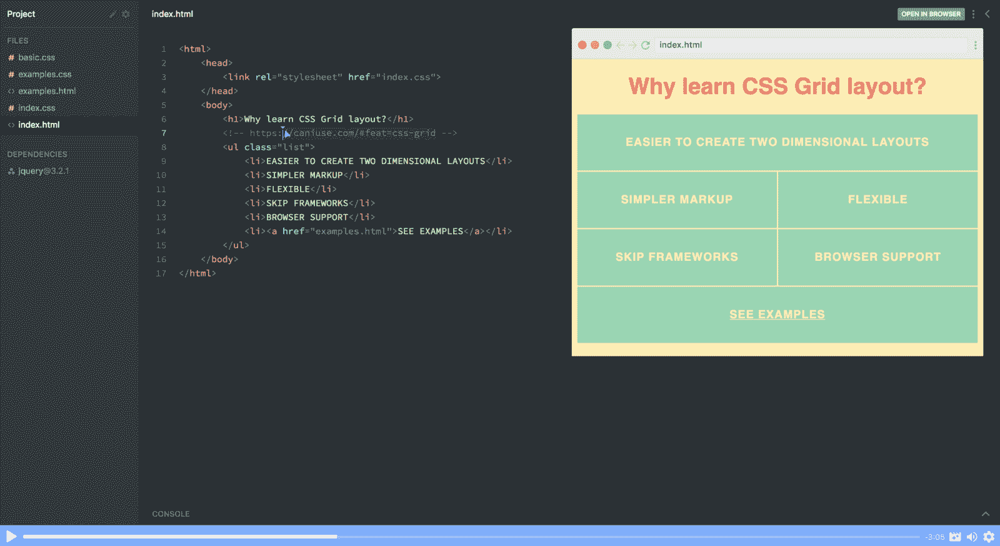
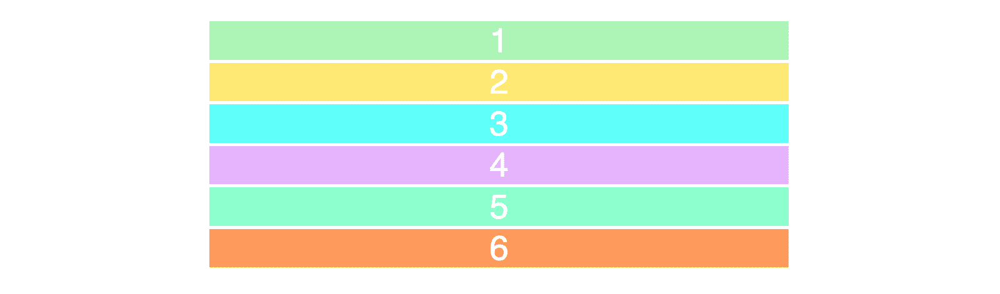
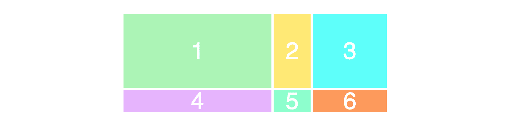
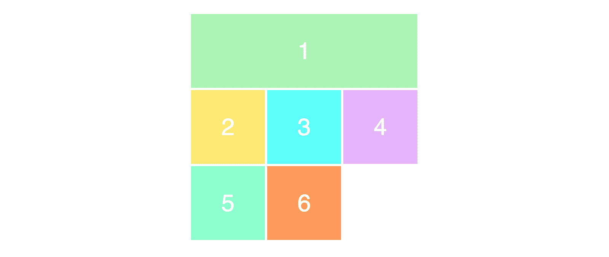
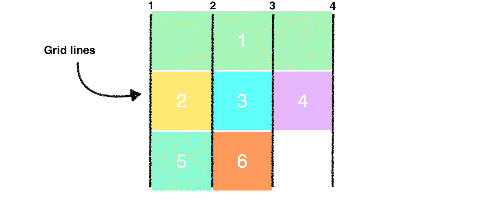
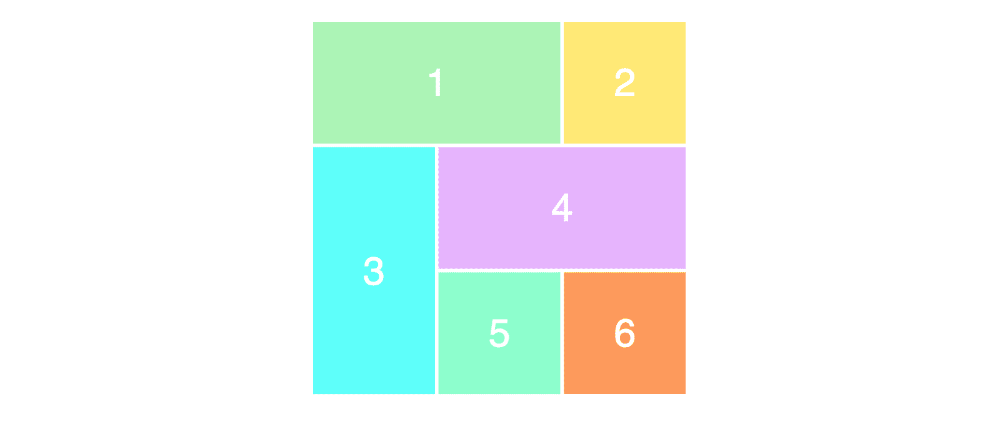

# 5 分钟学会 CSS 网格——初学者教程

> 原文：<https://www.freecodecamp.org/news/learn-css-grid-in-5-minutes-f582e87b1228/>

网格布局是网站设计的基础，CSS 网格模块是创建它的最强大和最简单的工具。我个人认为它比 Bootstrap 好得多(在这里阅读为什么)。

该模块还得到了[主流浏览器](https://caniuse.com/#feat=css-grid) (Safari、Chrome、Firefox、Edge)的原生支持，所以我相信在*不久的将来*所有前端开发者都将不得不学习这项技术。

在本文中，我将尽快带您了解 CSS 网格的基础知识。在你理解基础知识之前，我会把你不应该关心的东西都删掉。

我还创建了一个免费的 CSS 网格课程。[点击此处全面了解
it。](https://scrimba.com/g/gR8PTE?utm_source=freecodecamp.org&utm_medium=referral&utm_campaign=gR8PTE_5_minute_article)



或者，看看这篇文章，它解释了你将在整个课程中学到的东西:

现在让我们开始吧！

### 您的第一个网格布局

CSS 网格的两个核心成分是**包装器**(父)和
**项目**(子)。包装器是实际的网格，项目是网格中的内容。

以下是包含六项内容的包装器的标记:

```
<div class="wrapper">
  <div>1</div>
  <div>2</div>
  <div>3</div>
  <div>4</div>
  <div>5</div>
  <div>6</div>
</div> 
```

为了将我们的包装器`div`变成一个**网格**，我们简单地给它一个
T1 的显示:

但是，这还没有做任何事情，因为我们还没有定义我们想要我们的网格看起来像什么。它会简单地将 6 个`div's`堆叠在一起。



我添加了一些样式，但这与 CSS grid 没有任何关系。

### 列和行

为了使它二维，我们需要定义列和行。让我们创建三列两行。我们将使用`grid-template-row`和`grid-template-column`属性。

因为我们已经为`grid-template-columns`写了三个值，所以我们将得到三列。我们将得到两行，因为我们已经为`grid-template-rows`指定了两个值。

这些值决定了我们希望的列宽(100 像素)和行高(50 像素)。结果如下:


为了确保您正确理解了值之间的关系以及网格的外观，也看一下这个例子。

```
.wrapper {
    display: grid;
    grid-template-columns: 200px 50px 100px;
    grid-template-rows: 50px 50px;
} 
```

尽量抓住代码和布局之间的联系。

事情是这样的:



### 放置物品

接下来您需要学习的是如何在网格上放置项目。这是你获得超能力的地方，因为它使创建布局变得非常简单。

让我们创建一个 3x3 的网格，使用和以前一样的标记。

```
.wrapper {
    display: grid;
    grid-template-columns: 100px 100px 100px;
    grid-template-rows: 100px 100px 100px;
} 
```

这将导致以下布局:


注意，我们在页面上只看到一个 3x2 的网格，而我们将其定义为 3x3 的网格。这是因为我们只有六个项目来填充网格。如果我们还有三个，那么最低的一行也会被填满。

为了定位和调整项目的大小，我们将它们作为目标，并使用`grid-column`和`grid-row`属性:

```
.item1 {
    grid-column-start: 1;
    grid-column-end: 4;
} 
```

我们在这里说的是，我们希望 item1 从第一个网格线开始，在第四个列线结束。换句话说，它会占据整行。

这就是它在屏幕上的表现:



你是否对我们只有 3 列却有 4 列线感到困惑？看看这张图片，我用黑色画了列线:



请注意，我们现在使用了网格中的所有行。当我们让第一个项目占据整个第一行时，它会将其余的项目向下推。

最后，我想展示一种更简单的方法来编写上面的语法:

为了确保您已经正确理解了这个概念，让我们稍微重新排列一下项目。

```
.item1 {
    grid-column-start: 1;
    grid-column-end: 3;
}

.item3 {
    grid-row-start: 2;
    grid-row-end: 4;
}

.item4 {
    grid-column-start: 2;
    grid-column-end: 4;
} 
```

这是它在页面上的样子。试着想想为什么会这样。应该不会太难。



就这样了！

* * *

感谢阅读！我的名字叫 Per Borgen，我是最简单的学习编码方法——Scrimba 的联合创始人。如果你想学习建立专业水平的现代网站，你应该看看我们的[响应式网页设计训练营](https://scrimba.com/g/gresponsive?utm_source=freecodecamp.org&utm_medium=referral&utm_campaign=gR8PTE_5_minute_article)。


[Click here to get to the advanced bootcamp.](https://scrimba.com/g/gresponsive?utm_source=freecodecamp.org&utm_medium=referral&utm_campaign=gR8PTE_5_minute_article)