# 通过构建三个项目学习 CSS 媒体查询

> 原文：<https://www.freecodecamp.org/news/learn-css-media-queries-by-building-projects/>

今天我们将学习如何使用 CSS 媒体查询来构建响应性网站。我们将通过完成三个项目来实践我们所学的内容。我们走吧🏅

# 目录

要讨论的主题一览:

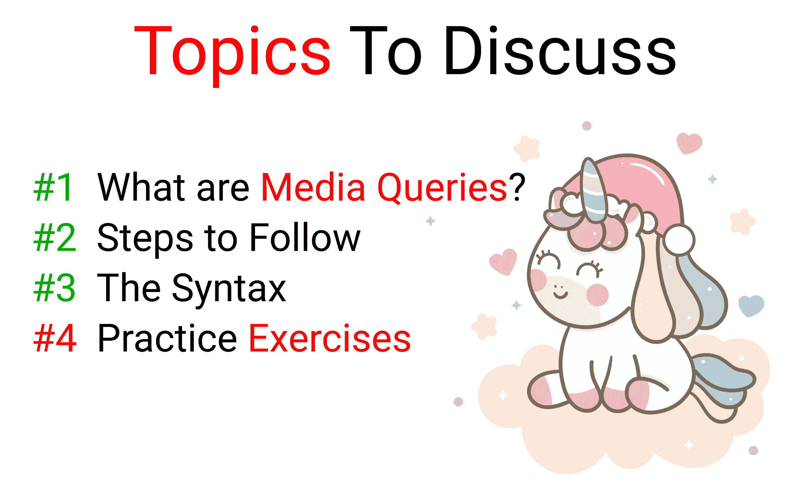

## 如果你喜欢，你也可以在 YouTube 上观看这个教程:

[https://www.youtube.com/embed/HY8q4TD3KGM?feature=oembed](https://www.youtube.com/embed/HY8q4TD3KGM?feature=oembed)

# 什么是 CSS 媒体查询？

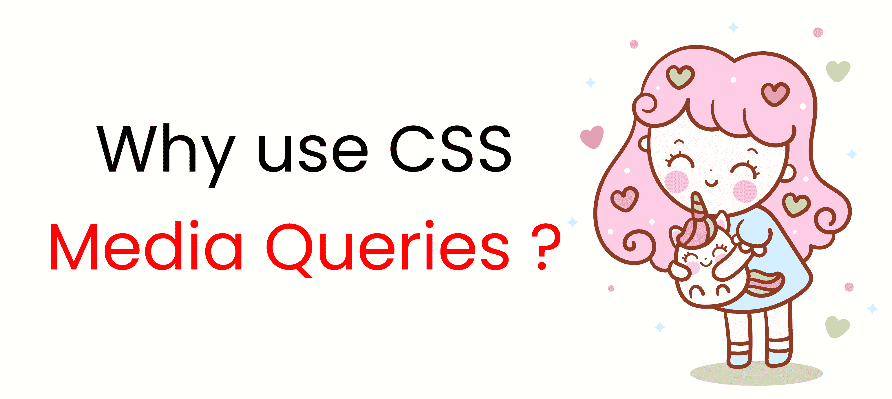

CSS 媒体查询允许你创建各种屏幕尺寸的响应网站，从桌面到手机。所以你可以看到为什么学习这个话题很重要。

这是一个演示媒体提问的魔术👇

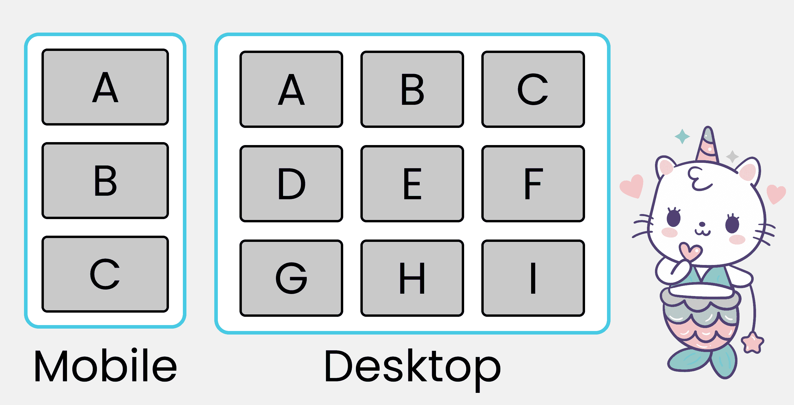

我们将在下面的项目 2 中构建它。这种布局被称为**卡片布局**。你可以在这里看到更多的布局例子[！](https://csslayout.io/patterns/)

# 如何设置项目

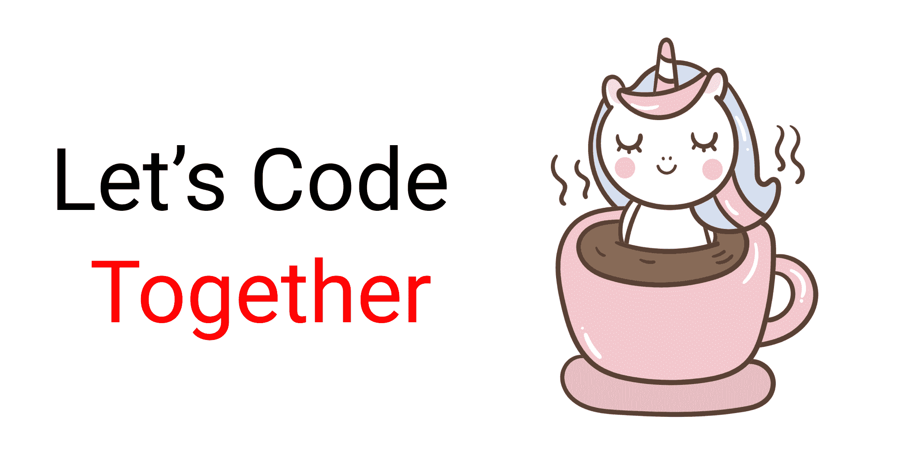

对于这个项目，你需要知道一点点的 HTML，CSS，以及如何与 VS 代码。跟我一起走->

1.  创建名为“项目-1”的文件夹
2.  开放 VS 代码
3.  创建**index.html、style.scss、**和 **main.js** 文件
4.  安装实时服务器和 SASS 编译器
5.  运行实时服务器和 SASS 编译器

## 超文本标记语言

在 HTML 中，在 body 标记内编写以下代码👇

```
 <div class = "container"></div> 
```

我们还需要看到我们的窗口的确切大小。下面是我的意思的演示:

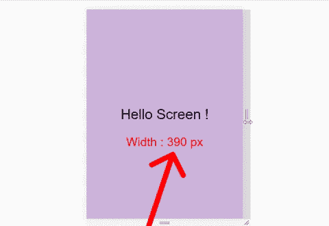

因此，在 html 文件中写下这一行:

```
 <div id="size"></div> 
```

## 什么是 SCSS？

我们将使用 SCSS，而不是 CSS。但是.....什么是 SCSS？

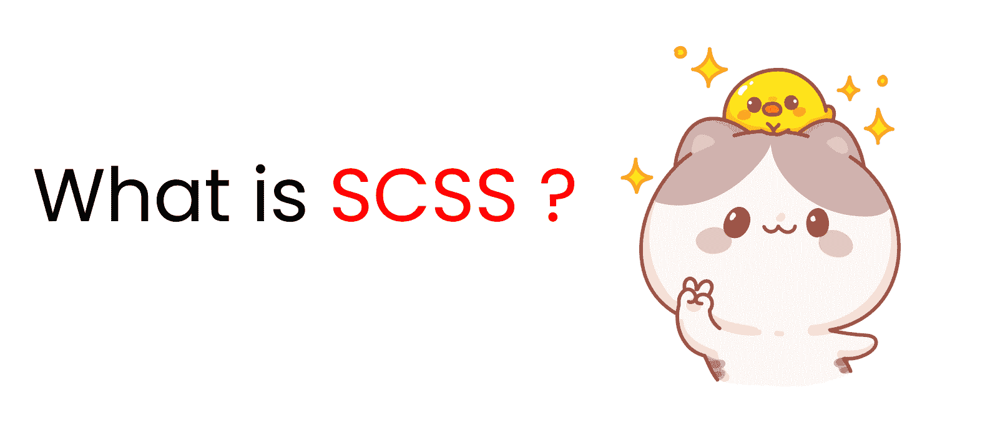

SCSS 是一个比普通 CSS 更强大的 CSS 预处理程序。利用 SCSS 我们可以->

1.  像树枝一样嵌套我们的选择器，更好地管理我们的代码。
2.  将各种值存储到变量中
3.  使用 Mixins 来停止代码重复并节省时间

还有更多！

在我们的 SCSS 中，我们将删除默认的浏览器设置，并像这样更改框大小、字体大小和字体系列:👇

```
*{
  margin : 0px;
  padding : 0px;
  box-sizing : border-box; 

  body{
    font-size : 35px;
    font-family : sans-serif;
  }
} 
```

**不要忘记**来设置**的**高度**。容器类。**否则，我们将无法达到预期的效果:

```
.container{
  height : 100vh;
} 
```

还记得我们用 HTML 写的附加 id 吗？我们将对其进行样式设计，并将其放置在浏览器中，如下所示:

```
#size {
  position: absolute;

// positioning screen size below our main text
  top : 60%;
  left: 50%;

  transform: translateX(-50%);

  color : red;
  font-size : 35px;
} 
```

## Java Script 语言

每次调整窗口大小时，我们都需要更新 id 中的屏幕大小。因此，将这段代码写入您的`main.js`文件:

```
 // 'screen' is name 👇 of a function
window.onresize = screen;
window.onload = screen;

// Function named 'screen' 👇

function screen() {
  Width = window.innerWidth;
  document.getElementById("size").innerHTML 
   = "Width : " + Width + " px" 
} 
```

## 下载项目的图像


响应式网站也指**响应式图片**。因此，我们也将在这个项目中使我们的图像具有响应性。图片在我的 **[GitHub 资源库](https://github.com/JoyShaheb/Project-image-repo/tree/main/Media-Query-Project)** 上。以下是获得它们的方法:

1.  访问并复制☝️上面的链接
2.  转到 **[downgit](https://minhaskamal.github.io/DownGit/#/home)** 粘贴你复制的链接
3.  遵循本视频中的步骤👇


和....我们都准备好了！开始编码吧。😊

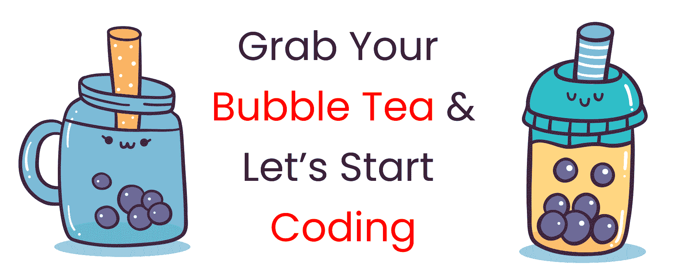

# CSS 媒体查询语法

以下是媒体查询的语法:

```
@media screen and (max-width: 768px){
  .container{
   //Your code's here
  }
} 
```

这里有一个插图说明->

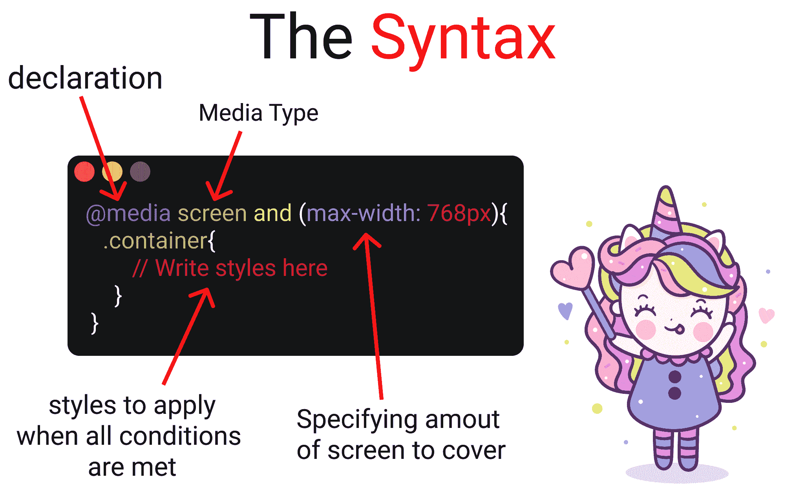

让我们将语法分为四个部分:

1.  媒体查询声明
2.  媒体类型
3.  最小宽度和最大宽度功能
4.  代码本身

### 为了理解语法的所有 4 个部分，让我们开始我们的第一个项目:

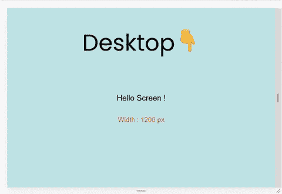

我们会建造这个。☝️这是一个小项目，通过一次一小步来改变窗口的背景颜色。开始吧！

### HTML

将以下代码放入 HTML 中，如下所示:

```
<div class = "container">

   <div class = "text">
      Hello Screen !
   </div>

</div> 
```

### SCSS

现在，我们将在变量中存储四种颜色代码，如下所示:👇

```
$color-1 : #cdb4db ; // Mobile
$color-2 : #fff1e6 ; // Tablet
$color-3 : #52b788 ; // Laptop
$color-4 : #bee1e6 ; // Desktop 
```

如果你想选择自己喜欢的颜色，你可以在 coolors.co 找到更多的颜色。

现在，在底部，瞄准`.container`和`.text`类。我们也将文本这样居中👇

```
.container{
//To place text at center

  display : grid;
  place-items : center;

  background-color : $color-1;
  height : 100vh;
}

.text{
 // keep it blank for now
} 
```

到目前为止一切顺利！

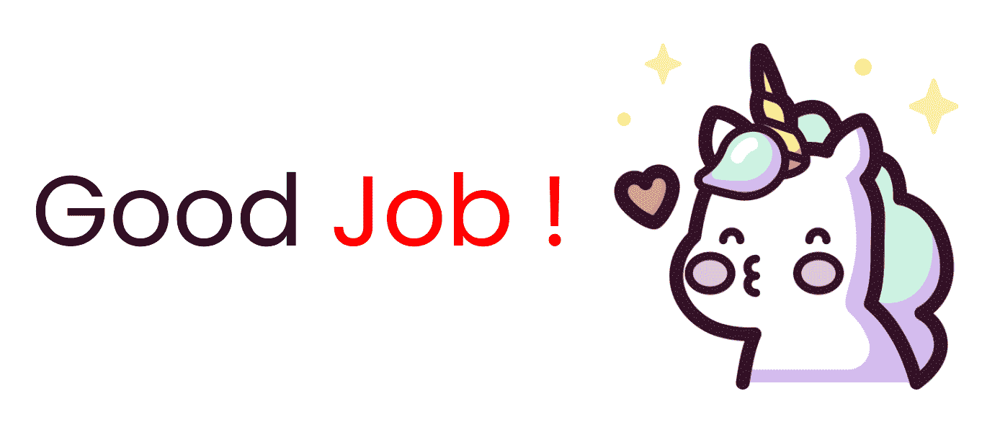

## 1.如何声明媒体查询

媒体查询以`@media`声明开始。写这个的主要目的是**告诉浏览器**我们已经指定了一个媒体查询。在你的 CSS 中，这样写:👇

```
@media 
```

## 2.如何设置媒体类型

这用于指定我们正在使用的设备的性质。这四个值是:

*   全部
*   打印
*   屏幕
*   演讲

下面是每个值的用途👇

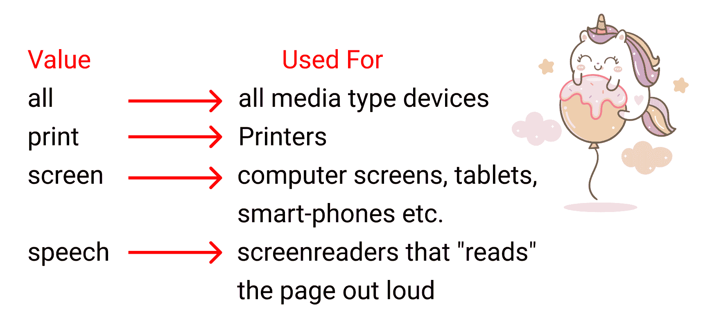

我们在`@media`声明之后声明**媒体类型**，就像这样:

```
@media screen 
```

## 我们为什么要写“与”运算符？

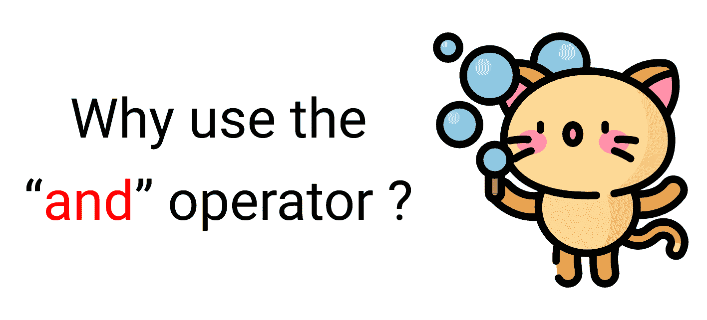

假设我们在餐馆下订单，“一个汉堡**和**一个披萨”。请注意，这两个订单由**【和】**分隔。

同样，媒体类型、最小宽度和最大宽度功能基本上是我们给浏览器的条件。如果有一个条件，我们就不写**和**运算符。像这样——>

```
@media screen {
  .container{
     // Your code here 
  }
} 
```

如果我们有两个条件，我们写**和**操作符，像这样:

```
@media screen and (max-width : 768px) {
  .container{
     // Your code here 
  }
} 
```

您也可以跳过媒体类型，只使用最小宽度和最大宽度，如下所示:

```
//Targeting screen sizes between 480px & 768px 

@media (min-width : 480px) and (max-width : 768px) {
  .container{
     // Your code here 
  }
} 
```

如果你有三个或更多的条件，你可以用一个**逗号**，就像这样:

```
//Targeting screen sizes between 480px & 768px 

@media screen, (min-width : 480px) and (max-width : 768px) {
  .container{
     // Your code here 
  }
} 
```

## 3.如何使用最小宽度和最大宽度功能

让我们讨论媒体查询最重要的组成部分，屏幕断点。

老实说，没有标准的屏幕断点指南，因为市场上有太多的屏幕尺寸。但是，对于我们的项目，我们将遵循[官方自举 5](https://getbootstrap.com/docs/5.0/layout/breakpoints/) 屏幕断点值。他们在这里:

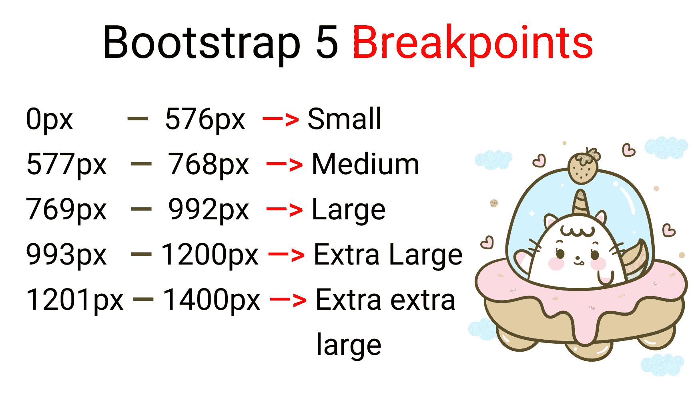

这里有一个 CSS-Tricks 上每个设备屏幕分辨率的列表。

### 最大宽度函数:

使用此功能，我们正在创建一个边界。只要我们在边界内，这就会起作用。这是一个样本👇

我们的边界是 500 像素:

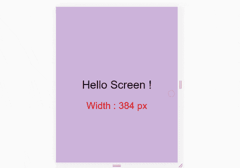

注意当我们达到 500 像素以上时，浅紫色是如何被禁用的。

要重新创建它，请在 SCSS 编写以下代码:

```
.container{
  background-color: white ;
  height: 100vh;
  display: grid;
  place-items: center;
} 
```

在底部，像这样插入媒体查询👇

```
@media screen and (max-width : 500px){
  .container{
    background-color: $color-1;
  }
} 
```

### 最小宽度函数:

我们也在这里创造了一个边界。但是如果我们去边界外的话，这是可行的。这里有一个例子:👇

我们的边界是 500 像素:

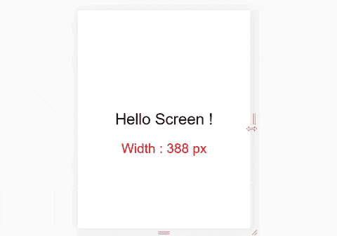

请注意，当我们达到 500 像素以上的宽度时，浅紫色是如何被激活的。

要重新创建它，请在 SCSS 编写以下代码:

```
.container{
  background-color: white ;
  height: 100vh;
  display: grid;
  place-items: center;
} 
```

在底部，插入如下媒体查询:👇

```
@media screen and (min-width : 500px){
  .container{
    background-color: $color-1;
  }
} 
```

总而言之，请记住:

*   **最大宽度**在设定的边界内设定样式

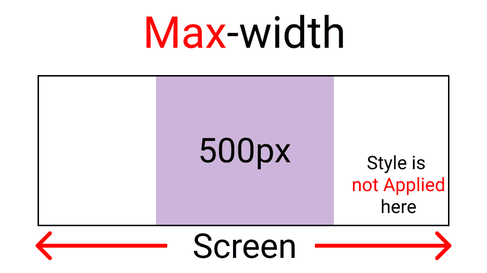

*   **最小宽度**在设定边界外设置样式

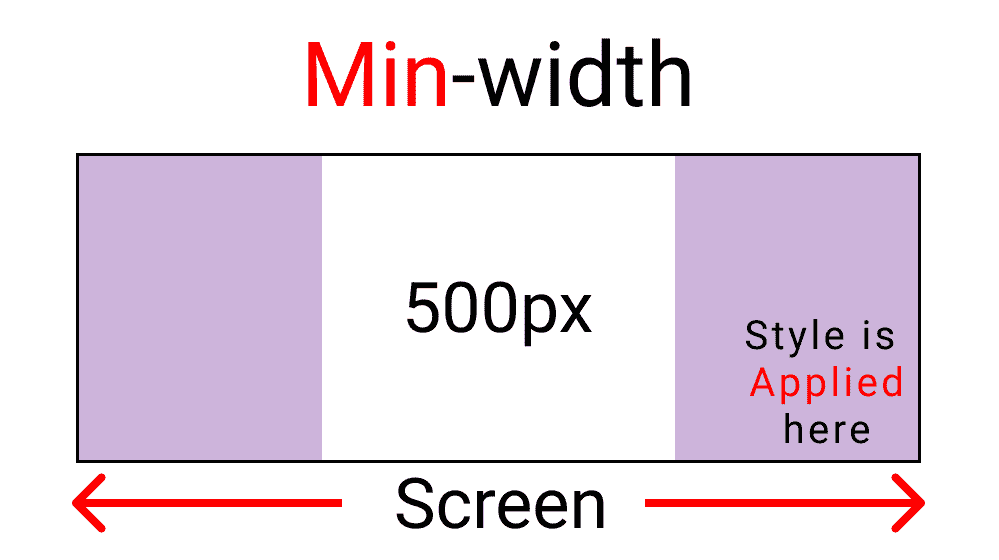

## 代码本身

让我们把我们的第一个项目放在一起！

我们将有四个屏幕断点:

*   移动-> 576 像素
*   平板电脑-> 768 像素
*   笔记本电脑-> 992px
*   桌面-> 1200 像素

没错，我们是跟着官方[自举 5](https://getbootstrap.com/docs/5.0/layout/breakpoints/) 屏幕断点走的。每个断点都会有这些颜色:

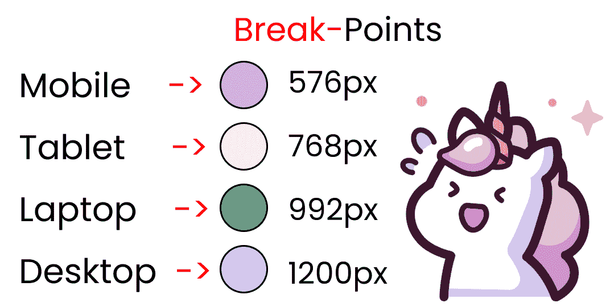

对于四种设备类型，我们将有四个媒体查询。在讨论媒体查询之前，首先让我们将断点值存储在变量中，如下所示:

**注意:**别忘了加上 **$** 标志:

```
$mobile  : 576px;
$tablet  : 768px;
$laptop  : 992px; 
$desktop : 1200px; 
```

我们的`.container`类应该是这样的:

```
.container{
  background-color: white ;
  height: 100vh;
  display: grid;
  place-items: center;
} 
```

我们都完成了 50%!现在让我们设置四个媒体查询。

## 但是等等...

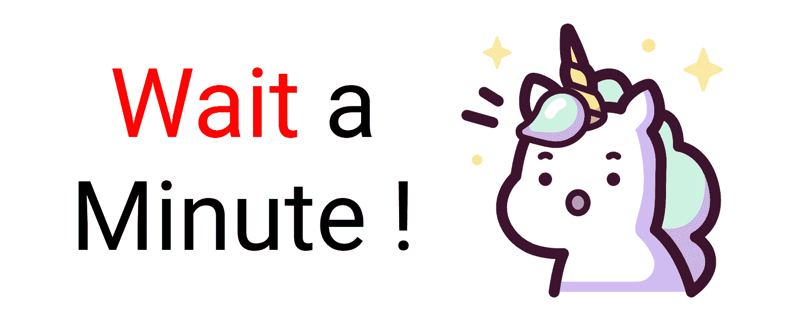

编写媒体查询时，您需要遵循正确的顺序。从**最大显示开始向最小显示写入。**

### 桌面的第一个断点–1200 像素

对于桌面屏幕，用 SCSS 语编写以下代码:👇

```
// using variable here which is  👇 1200px
@media screen and (max-width: $desktop){
  .container{
    background-color: $color-4;
  }
} 
```

这是结果:

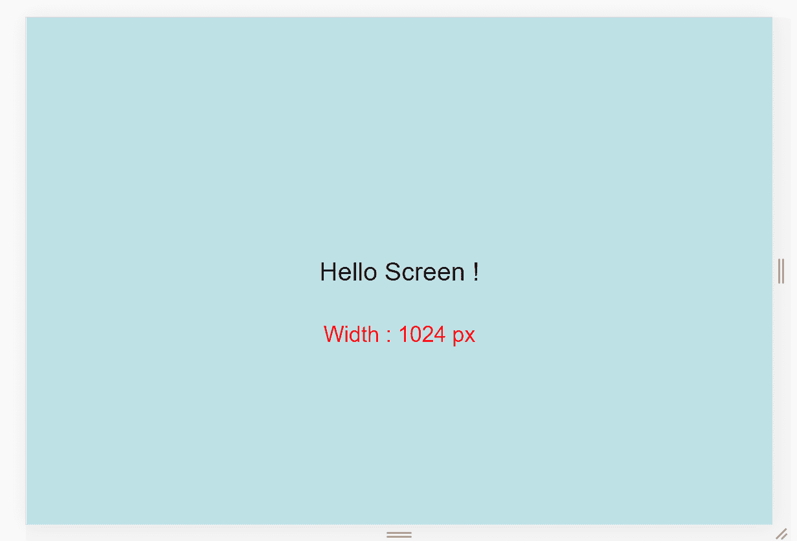

### 笔记本电脑的第二个断点–992 px

对于笔记本电脑屏幕，请在 SCSS 编写以下代码:👇

```
// using variable here which is  👇 992px
@media screen and (max-width: $laptop){
  .container{
    background-color: $color-3;
  }
} 
```

这是结果:

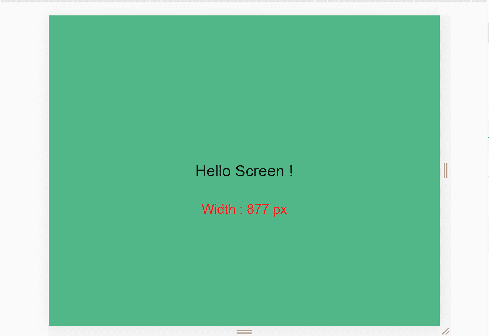

### 平板电脑的第三个断点–768 px

对于平板电脑屏幕，请在 SCSS 编写以下代码:👇

```
// using variable here which is  👇 768px
@media screen and (max-width: $tablet){
  .container{
    background-color: $color-2;
  }
} 
```

这是结果:

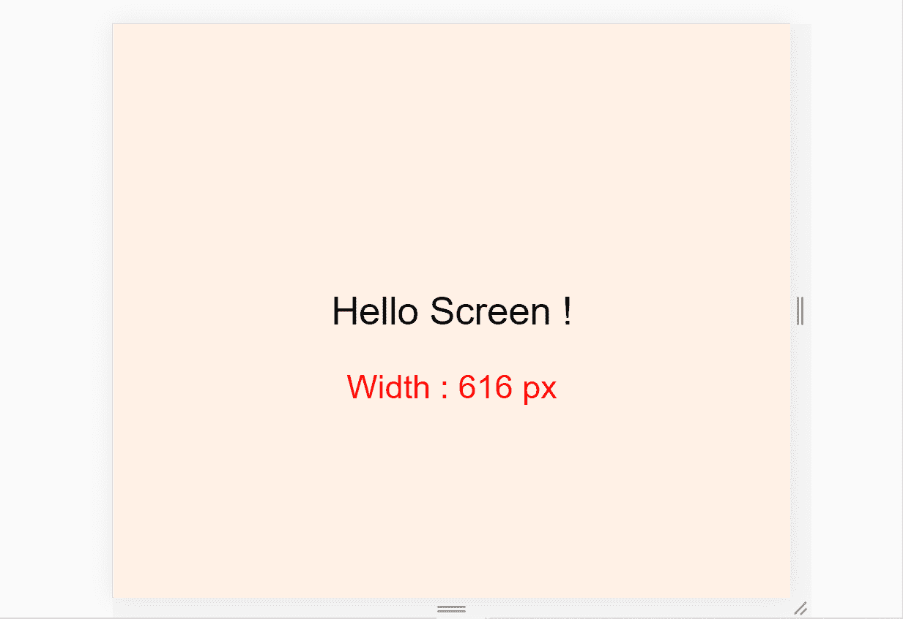

### 移动设备的第四个断点–576 像素

对于移动屏幕，请在 SCSS 编写以下代码:👇

```
// using variable here which is  👇 576px
@media screen and (max-width : $mobile){
  .container{
    background-color: $color-1;
  }
} 
```

这是结果:

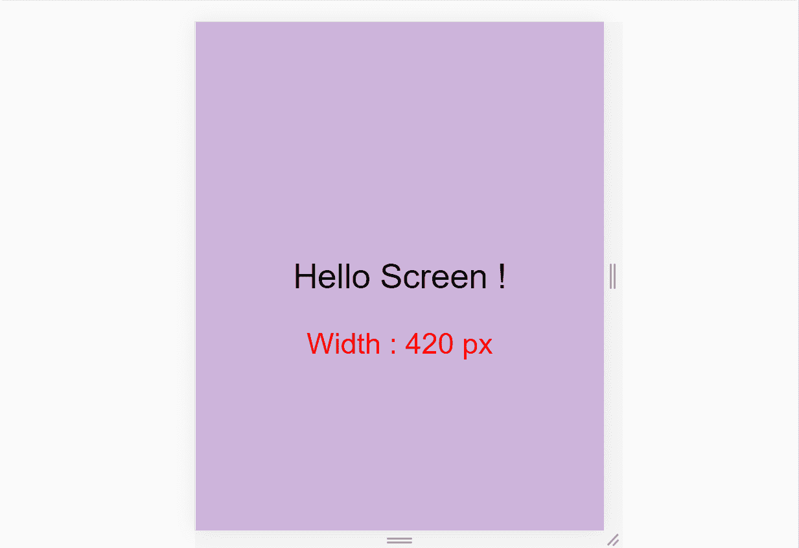

## 休息一会儿

祝贺您完成项目 1！现在休息一下。你应得的。

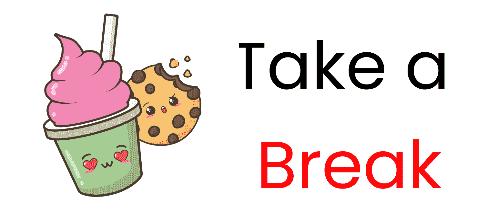

# 让我们使用 CSS 媒体查询构建一些项目

## 如何构建一个响应式投资组合

我们将为我们的第二个项目建立一个小型的响应网站。

### 这是桌面视图的样子:

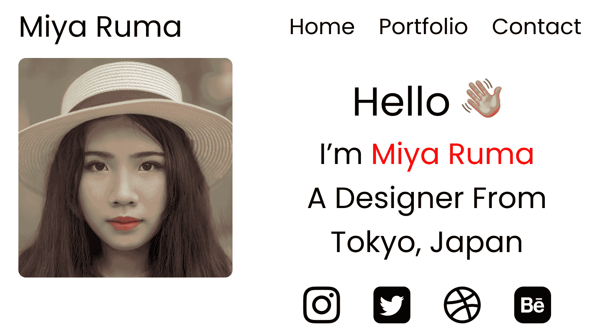

### 这是移动视图:

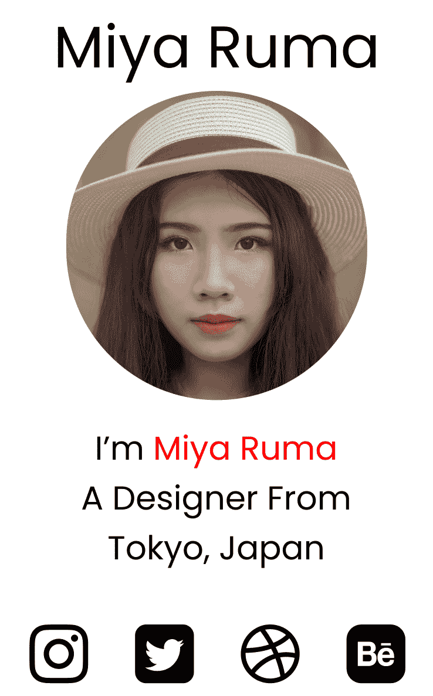

好吧，那么，让我们开始编码！首先，让我们通过一小步一小步地使用桌面视图。

### 开始之前

在我们的 Project-1 文件夹中创建一个名为“images”的文件夹。将你从我的 [GitHub 库](https://github.com/JoyShaheb/Project-image-repo/tree/main/Media-Query-Project)下载的所有图片放入图片文件夹。

## HTML

### 步骤 1–创建部分

我们将为我们的网站创建三个部分。在您的 HTML 中编写以下代码:

```
<div class="container"> 

    <div class="header"></div>

    <div class="main"></div>

    <div class="footer"></div>

</div> 
```

### 第 2 步–徽标和菜单项

我们将把徽标和菜单项放在。标题 div，像这样:

```
<div class="header">

      <div class="header__logo">Miya Ruma</div>

      <div class="header__menu">
          <div class="header__menu-1"> Home </div>
          <div class="header__menu-2"> Portfolio </div>
          <div class="header__menu-3"> Contacts </div>
      </div>

  </div> 
```

### 步骤 3–图像和文本

我们将图像和文本放在。主 div，像这样:

```
<div class="main">

     <div class="main__image"></div>

     <div class="main__text">

       <div class="main__text-1">Hello 👋</div>

       <div class="main__text-2">I'm <span>Miya Ruma</span></div>

       <div class="main__text-3">A Designer From</div>

       <div class="main__text-4">Tokyo, Japan</div>

     </div>

</div> 
```

### 第 4 步–社交媒体图标

我们将社交媒体图标放在。页脚 div，像这样:

```
<div class="footer">

   <div class="footer__instagram">
      
   </div>

   <div class="footer__twitter">
      
   </div>

    <div class="footer__dribbble">
       
    </div>

    <div class="footer__behance">
       
    </div>

</div> 
```

## SCSS

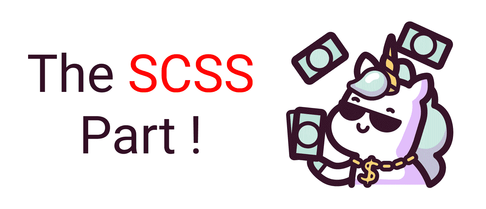

### 步骤 1–更新 SCSS

删除 SCSS 中的所有内容，改为编写以下代码:

```
* {
  // placing Margin to left & right
  margin: 0px 5px;

  padding: 0px;
  box-sizing: border-box;

  body {
    font-family: sans-serif;
  }
} 
```

这是我们目前掌握的情况:

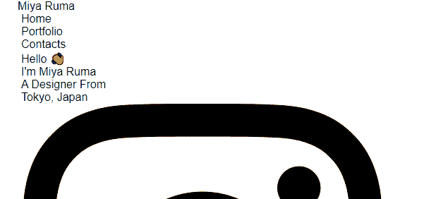

### 步骤 2–选择 HTML 中的所有类

在样式表中选择我们用 HTML 创建的所有类。

```
.container{}

.header{}

.main{}

.footer{} 
```

### 步骤 3–选择所有孩子

现在选择父类的所有子类。

```
.header{

  &__logo{}

  &__menu{}
}

.main{

  &__image{}

  &__text{}
}

.footer{

  [class ^="footer__"]{}

} 
```

**注意**嵌套在`.header`里面的`&__logo`是`.header__logo`的快捷方式。

### 步骤 4–定义。容器

为桌面布局定义`.container`，如下所示:

```
.container{

// Defining height
  height: 100vh;

  display: flex;

  flex-direction: column;
} 
```

将`display: flex;`应用到`.header`和菜单项，使其行为像一行，而不是一列:

```
.header{
  display: flex;
  flex-direction: row;

  &__logo{}

  &__menu{
    display: flex;
    flex-direction: row;
  }
} 
```

划分每个部分并创建边界，看看我们在做什么:

```
.header{
  display: flex;

// The border & height
  border: 2px solid red;
  height: 10%;

// Other selectors are here

}

.main{

//The border & height
  border: 2px solid black;
  height: 80%;

// Other selectors are here

}

.footer{

// Border & height
  border: 2px solid green;
  height: 10%;

// Other selectors are here
} 
```

这是结果:

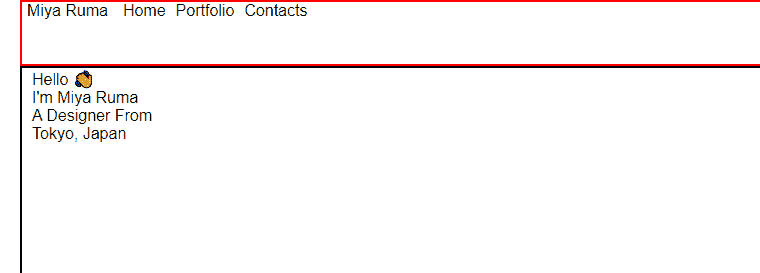

### 第 5 步–完成。页眉样式

让我们使用 flex-box 属性和适当的字体大小来完成`.header`部分的样式:

```
.header {
// height
  height: 10%;

  display: flex;
// Aligning logo & menu at center
  align-items: center;

// space between logo & menu
  justify-content: space-between;

  &__logo {
    font-size: 4vw;
  }

  &__menu {
    display: flex;
    font-size: 2.5vw;

// to put gap between menu items
    gap: 15px;
  }
} 
```

这是结果:

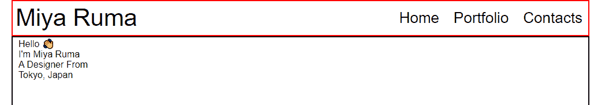

### 步骤 6–添加图像

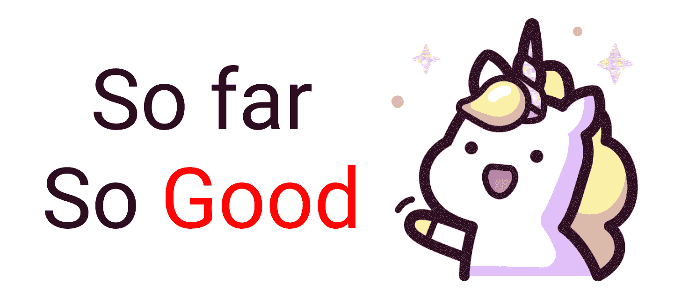

让我们将图像添加到`.main`部分，并为图像和文本创建一个分区。

```
.main {
  // image & text will act like a row
  display: flex;
  flex-direction: row;

  //The border & height
  border: 2px solid black;
  height: 80%;

  &__image {
    //Adding the image
    background-image: url("./images/Portrait.png");
    // will cover half of screen width
    width: 50%;
  }

  &__text {
    // will cover half of screen width
    width: 50%;
  }
} 
```

目前结果有点难看，但是不要失去希望~

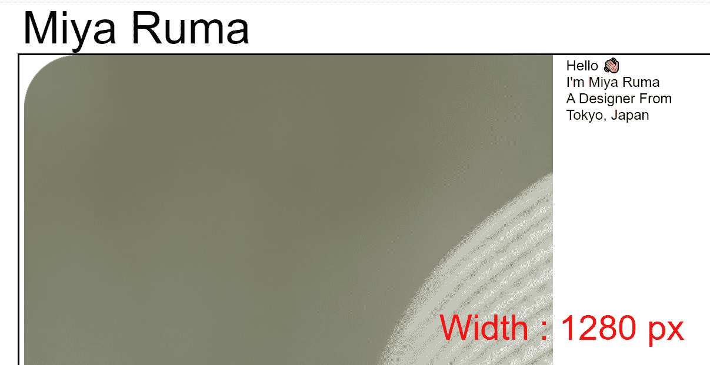

### 第七步——让图像有反应

将图像设计成具有响应性，如下所示:

```
.main{
  &__image{
  //make image fluid
    background-size: contain;

  // stop image repetition
    background-repeat: no-repeat;

  // position the image
    background-position: left center;
  }
} 
```

这是我们目前掌握的情况:

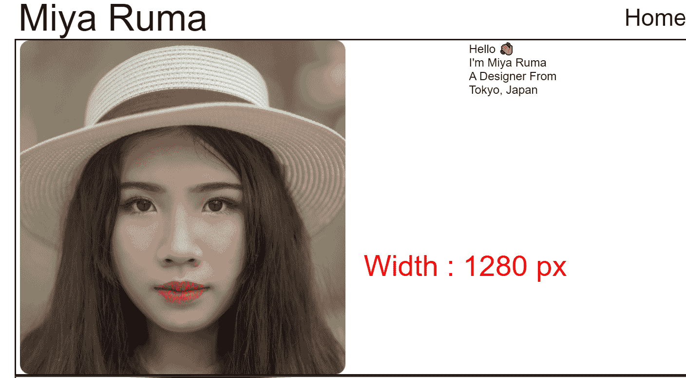

从 **4k** 到你的**智能手表屏幕**，图像一路响应。不相信我？打开 chrome 开发者工具，自己测试看看。

如果您想为响应式网站制作响应式图片，您可以在此了解更多关于[背景属性的信息。](https://www.freecodecamp.org/news/learn-css-background-properties/)

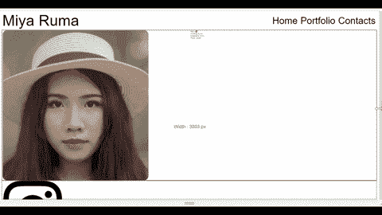

### 第 8 步–设置文本样式

现在让我们来设计我们的文本。首先，我们用下面的代码把它带到正中心:

```
.main{

  &__text {
    // will cover half of screen width
    width: 50%;
    display: flex;
    flex-direction: column;

// To bring it at the center 
    justify-content: center;
    align-items: center;
  }

// To color The name 
  span{
    color: red;
  }

} 
```

现在，让我们设置文本的字体大小:

```
.main{

  &__text{

// To add gaps between texts vertically
    gap: 15px;

// font size for "hello"
    &-1{
      font-size: 10vw;
    }

// font size for other texts
    &-2,&-3,&-4{
      font-size: 5vw;

    }

  }
} 
```

结果看起来像这样:

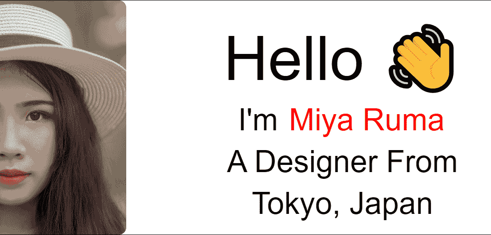

此时，您可以删除我们在 header、main 和 footer 类中放置的所有边框。

### 步骤 9–页脚部分

首先，像这样调整图像的大小:

```
.footer{
  [class^="footer__"] {
    img {
      width: 5.3vw;
    }
  }
} 
```

然后，将图像放置在我们想要的位置，图标之间有一个小间隙，如下所示:

```
.footer{
  display: flex;
  flex-direction: row;

// To align icons along x-axis
  align-items: center;
// placing image to the right side
  justify-content: flex-end;
// Gap between icons
  gap: 20px;

// margin to right side of icons 
  margin-right: 10%;
} 
```

这是没有向导的结果:


### 步骤 10–移动布局

我们快到了...

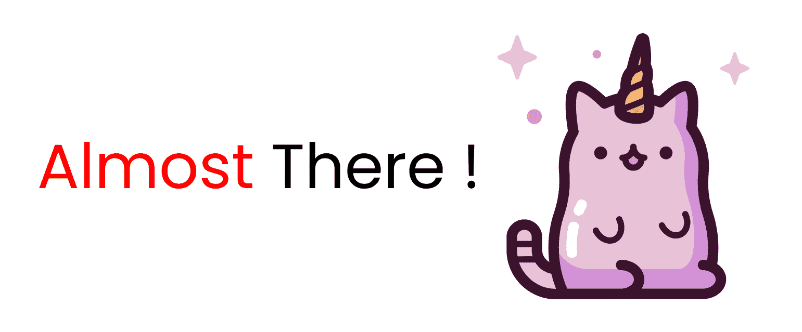

在 650px 标记处创建一个媒体查询，并将`.header`类的样式如下:

```
@media (max-width: 650px) {

  .header {

// To place logo at center
    justify-content: center;

    &__logo {
      font-size: 40px;
    }
//hiding the menu on mobile device
    &__menu {
      display: none;
    }
  }
} 
```

### 第 11 步-居中。主要的

现在把。主要部分位于代码的正中央:

```
@media (max-width: 650px){
// styles of header section of step-10...

// main section here 
  .main {
    flex-direction: column;
    justify-content: center;
    align-items: center;
} 
```

### 第 12 步–为手机设计图片和文本的样式

为移动布局设计图像和文本的样式，如下所示:

```
@media (max-width: 650px){

 .main {
   &__image {
// Image size 
      height: 200px;
      width: 200px;
      background-size: 100%;

// To have rounded image 
      border-radius: 100%;
      background-position: center;
    }

// Styles for the text ->
    &__text {
      width: 100%;

      &-1 {
        display: none;
      }
      &-2, &-3, &-4 {
        font-size: 30px;
      }
    }
} 
```

### 步骤 13–为移动设备设置页脚样式

最后一步是为移动布局的页脚部分设置样式:

```
@media (max-width: 650px){
  .footer {
// placing icons along the X-axis
    justify-content: center;
    margin: 0px;

    [class^="footer__"] {

// Resizing images for mobile layout
      img {
        width: 45px;
        height: 45px;
      }
    }
  }
} 
```

这是我们的结果:


## 休息一会儿

到目前为止干得不错！在进入下一个项目之前休息一下。😊

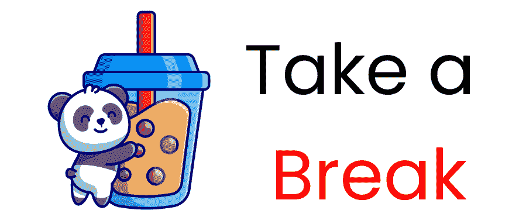

## 项目 3-如何构建卡片布局

在项目 3 中，我们将构建:


那我们开始吧。

## SCSS

在样式表上，删除除了`#size`样式之外的所有内容。然后在那里添加以下代码:

```
* {
  margin: 0px;
  padding: 0px 10px;
  box-sizing: border-box;

  body {
    font-family: sans-serif;
    font-size: 55px;
  }
}

#size{
  position: absolute;
// Positioning the text
  top: 60%;
  left: 50%;
  transform: translateX(-50%);
// color & size of text
  color: red;
  font-size: 40px;
} 
```

## HTML

您的 HTML 在 body 标记中应该是这样的:👇

```
<div class="container"> 
   // We'll place code here
</div>

// This will show our window width Live 
<div id="size"></div> 
```

现在，创建三个类名为`.row-*`的类，如下所示👇内部`.container`:

```
<div class="container"> 

   <div class="row-1">
   </div>

   <div class="row-2">
   </div>

   <div class="row-3">
   </div>
</div> 
```

每行将有三个盒子，它们的类名是这样的`.box-*`。👇是的，你要在盒子里插入字母:

```
<div class="container"> 

   <div class="row-1">
       <div class="box-1">A</div>
       <div class="box-2">B</div>
       <div class="box-3">C</div>
   </div>

   <div class="row-2">
       <div class="box-4">D</div>
       <div class="box-5">E</div>
       <div class="box-6">F</div>
   </div>

   <div class="row-3">
       <div class="box-7">G</div>
       <div class="box-8">H</div>
       <div class="box-9">I</div>
   </div>
</div> 
```

我们完成了 HTML 部分，结果应该是这样的:👇

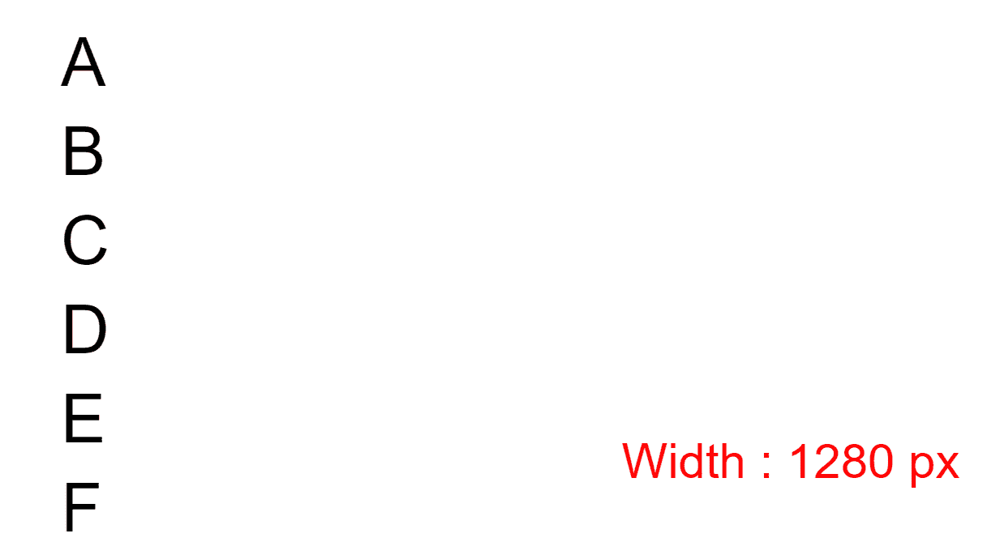

## SCSS

按照这些小步骤一步一步来设计项目。

### 步骤 1-添加一些 SCSS 代码

为了一起选择和样式化所有的框和行，这是我们在 CSS 中写的:👇

```
.container{
  // styles here 
}

[class ^="row-"]{
  // Styles applied on all rows
}

[class ^="box-"]{
  // Styles applied on all boxes
} 
```

### 第二步——让盒子表现得像行一样

盒子的行为应该像一行。这段代码将实现这一点:

```
[class ^="row-"]{
  display: flex;
  flex-direction: row;
} 
```

这是结果:👇

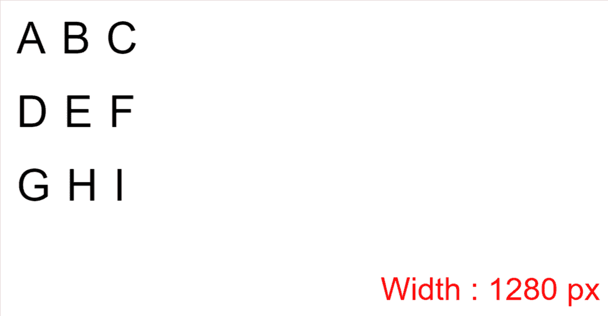

### 步骤 3–定义盒子

在宽度和高度上展开方框，将字母放在中间。

```
[class ^="box-"]{

  background-color: #c4c4c4;
  border: 2px solid black;

// Defining the size of the boxes 
  width : (100%)/3;
  height: (100vh)/3;

// Place letter at the center
  display: grid;
  place-items: center;
} 
```

结果如下:

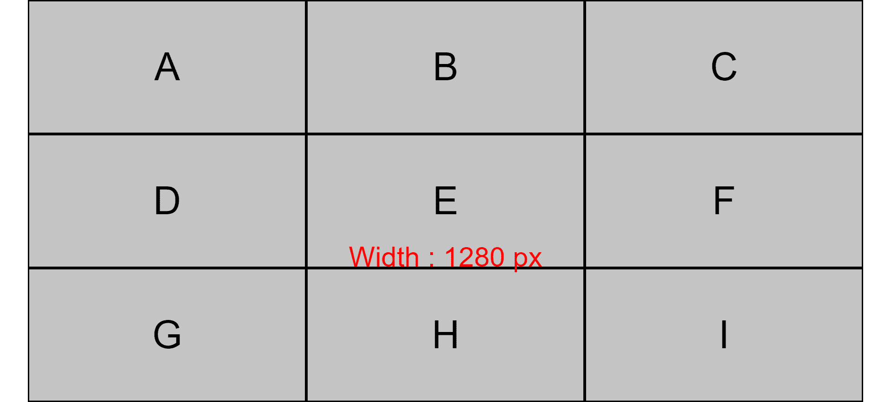

### 步骤 4–在各行之间创建间隙

接下来，我们将在行之间创建一个间隙，如下所示:

```
.container{
  display: flex;
  flex-direction: column;
  height: 100vh;

// Creating gap between rows 
  gap: 30px;
} 
```

现在让我们在盒子之间创建一个间隙:

```
[class ^="row-"]{
  display: flex;
  flex-direction: row;

// Creating gap between boxes
  gap : 30px;
} 
```

这是它的样子:

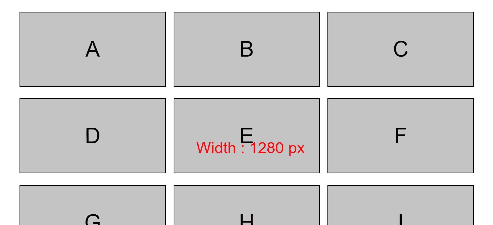

### 步骤 5–设置移动布局

创建将在 650px 标记处应用的媒体查询:

```
@media (max-width: 650px){
  // We'll write code here
} 
```

将移动屏幕上的框的方向从行更改为列，并使用以下代码将框拉伸到 100%的宽度:

```
@media (max-width: 650px){

//Change orientation
  [class ^="row-"]{
    flex-direction: column;
  }

// Change width of boxes
  [class ^="box-"]{
    width: 100%;
  }
} 
```

这是最终的移动结果:

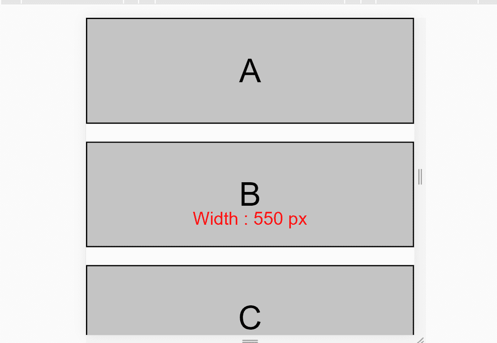

顺便说一下，项目 2 是我的这篇文章的一部分。如果您有兴趣了解更多并练习您的 Flexbox 和媒体查询技能，那就去吧！

# 结论

这是你的奖章，奖励你一直读到最后，❤️

### 建议和批评得到了❤️的高度赞赏


**YouTube[/Joy Shaheb](https://youtube.com/c/joyshaheb)**

**推特[/JoyShaheb](https://twitter.com/JoyShaheb)**

**insta gram[/JoyShaheb](https://www.instagram.com/joyshaheb/)**

## 信用

*   [CSS 招数](https://css-tricks.com/a-complete-guide-to-css-media-queries/)
*   用于示例项目的[肖像](https://www.pexels.com/photo/woman-wearing-brown-bucket-cap-732425/)
*   [来自 Vecteesy 的图片](https://www.vecteezy.com/members/joyshaheb/collections/blog-idea-1)
*   [熊猫](https://www.freepik.com/free-vector/cute-panda-hug-boba-milk-tea-cartoon-icon-illustration-animal-drink-icon-concept-premium-flat-cartoon-style_12571361.htm#position=0)，[冰淇淋](https://www.freepik.com/free-vector/kawaii-fast-food-cute-ice-cream-cookie-illustration_5769154.htm#position=1) & [可爱的猫咪](https://www.freepik.com/free-vector/cute-cats-set-funny-character-cartoon-illustration_12566246.htm)
*   [独角兽装](https://www.flaticon.com/packs/unicorn-4) & [Kitty 头像](https://www.flaticon.com/packs/kitty-avatars-3)
*   [instagram](https://www.flaticon.com/free-icon/instagram_1384031) 、 [Twitter](https://www.flaticon.com/free-icon/twitter-sign_25347) 、 [Behance](https://www.flaticon.com/free-icon/behance_254383) 和 [Dribbble icons](https://www.flaticon.com/free-icon/dribbble-logo_87400)
*   [泡好茶](https://www.freepik.com/free-vector/collection-kawaii-bubble-tea_10048123.htm#position=6)