# 学习 CSS 单位——em，Rem，VH 和 VW 代码示例✨✨

> 原文：<https://www.freecodecamp.org/news/learn-css-units-em-rem-vh-vw-with-code-examples/>

今天我们将通过一些实际例子来学习如何使用CSS 单位EM、REM、VW 和 VH。我们也将看到如何用这些单元制作响应性网站。

我们开始吧。💖

# 目录

*   [为什么学相对单位？](#why-learn-css-relative-units)
*   什么是雷姆单位？
*   [如何用 REM 单位制作响应式网站](#how-to-make-responsive-websites-with-rem-units)
*   什么是 EM 单位？
*   [什么是大众单位？](#what-are-vw-units)
*   [什么是 VH 单位？](#what-are-vh-units)
*   [附加资源](#additional-resources)

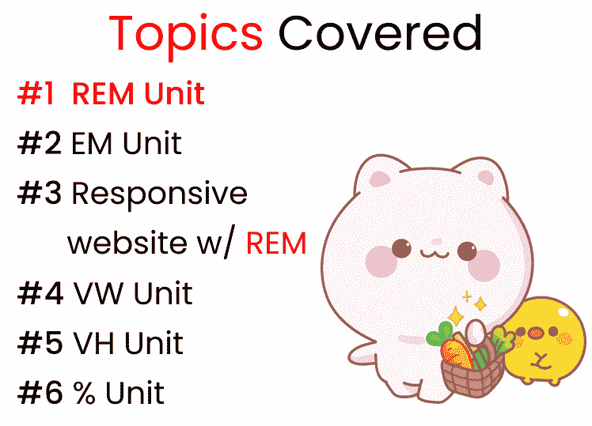

**Topics covered**

## ******喜欢的话也可以在 YouTube 上看这个教程:******

[https://www.youtube.com/embed/6uJPTM0AaFc?feature=oembed](https://www.youtube.com/embed/6uJPTM0AaFc?feature=oembed)

# 为什么要学习 CSS 相对单位？


如果你想非常容易、快速、高效地制作**响应式网站**，那么你一定要学习 CSS 的相关单元。

**REM，EM，VW，VH 是相对单位**。如果您将这些与媒体查询结合起来，那么您就可以创建完美的可伸缩布局。看看这张 GIF👇文本在桌面、平板电脑和移动屏幕上都有响应！


**Font using the REM unit**

请记住**像素是绝对单位。**当您调整窗口大小时，它们不会改变。看看这张 GIF👇请注意，当我们调整窗口大小时， **50px 的字体大小没有变化。**

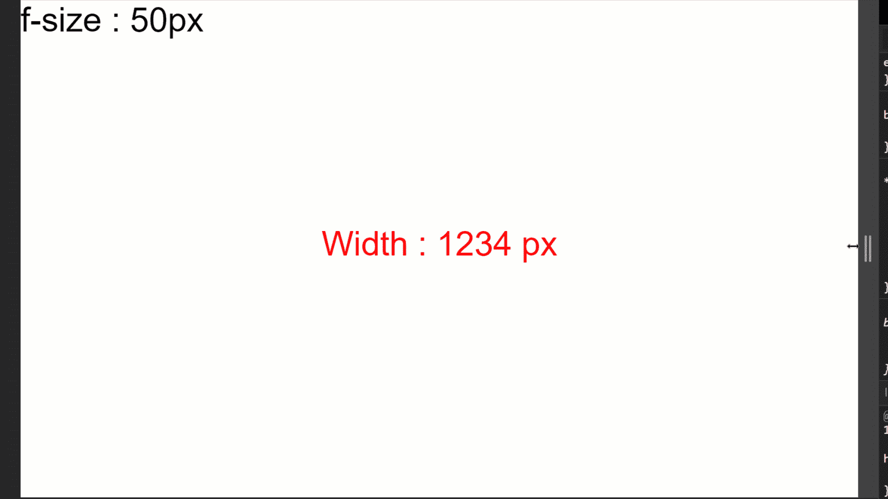

**Font using the Pixel unit**

提示:在开始教程之前，我建议你不要把 EM 和 REM 当成单位。把它们想象成基数的乘数。

# 项目设置


首先， [c](https://codepen.io/joyshaheb/pen/XWMqEdV) [从这个代码笔链接](https://codepen.io/joyshaheb/pen/XWMqEdV)中复制代码，并将其粘贴到 VS 代码或您选择的代码编辑器中。然后按照以下步骤操作:👇

*   创建一个名为 **project-1** 的文件夹
*   创建 HTML、CSS、JS 文件并将它们链接在一起
*   安装我们需要的插件-**px to rem**和 **Live server**
*   运行实时服务器

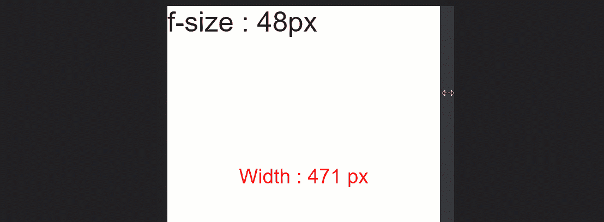

**Testing starter files**

正如你在上面的 gif 中看到的，👆JavaScript 在做所有的计算，所以我们只需要关注教程。我们将改变 CSS，用不同的值进行实验。

开始编码吧！


# 什么是雷姆单位？


REM 单元依赖于**根元素****HTML**元素。下面的图片向您展示了它是如何工作的:👇

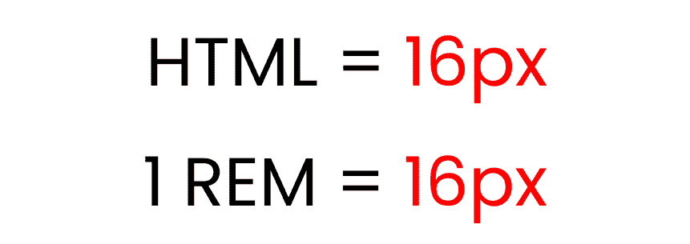

**Default font size of root element**

根元素的默认字体大小是 16px。所以，1 雷姆= 16px。

如果我们写 3 rem，它会给我们显示**【3 * 16px = 48px】**。所以可以看到，的工作原理就像是一个法器。

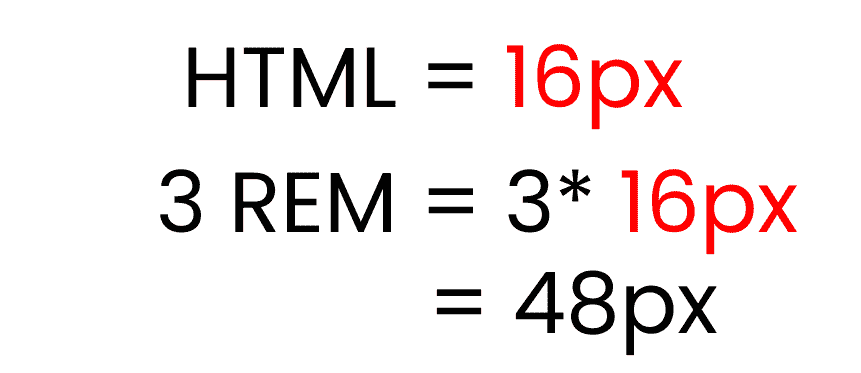

**experimenting with 3 rem**

但是，如果我们改变根元素的字体大小，REM 单位也会改变——就像这样:👇

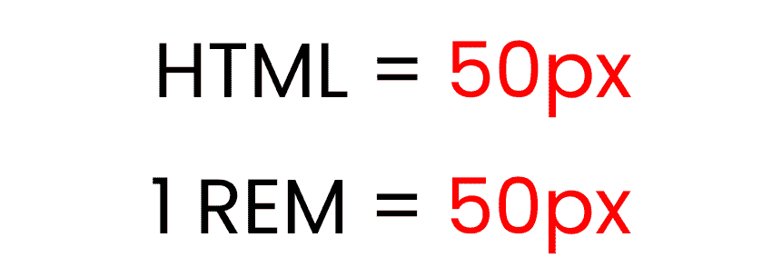

**changed font size of root element**

我们将 HTML 字体大小设置为 50px。

现在，如果我们写 3 rem，它会像这样向我们显示 **[ 3*50px = 150px ]** :👇

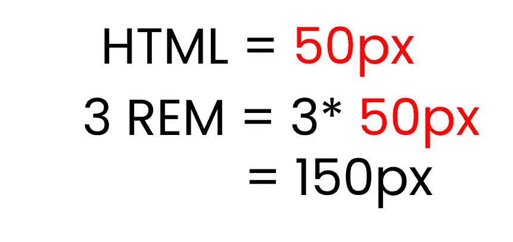

**experimenting with 3 rem**

让我们用代码重现结果，看看它们在实践中的用例。👇

首先，让我们试验一下每个网站的默认字体大小，16 像素。我们将`.text`类的字体大小设置为 1 雷姆。

```
html {
  font-size: 16px;
}

.text {
  font-size: 1rem;
}

/** Calculations 
 1 rem * 16px = 16px
**/ 
```

结果是这样的:👇


**Font-size is 1rem, root is 16px**

现在，让我们把`.text`的字体大小增加到 2 雷姆:

```
html {
  font-size: 16px;
}

.text {
  font-size: 2rem;
}

/** Calculations
 2 rem * 16px = 32px
**/
```

这是结果:👇

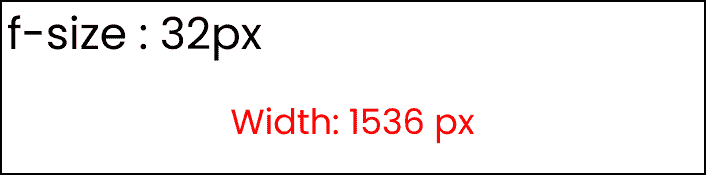

**Font-size is 2 rem, root is 16px**

正如你所看到的，字体变大了，但宽度保持不变(1536 像素)。

### 如何改变根字体大小

现在，让我们通过改变 html 内部的根字体大小来进行实验。首先编写以下代码以获得默认结果:👇

```
html {
  font-size: 16px;
}

.text {
  font-size: 1rem;
}

/** Calculations
 1 rem * 16px = 16px
**/
```

看起来是这样的:👇

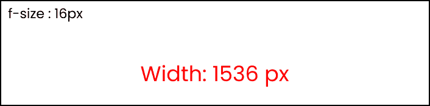

**Default setting **

现在，将根字体大小改为 40px，如下所示:

```
html {
  font-size: 40px;
}

.text {
  font-size: 1rem;
}

/** Calculations
 1 rem * 40px = 40px
**/
```

结果如下:👇

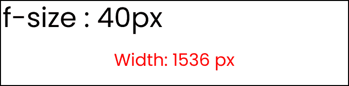

**root element is 40px**

现在，将`.text`字体大小改为 2 雷姆:👇

```
html {
  font-size: 40px;
}

.text {
  font-size: 2rem;
}

/** Calculations
 2 rem * 40px = 80px
**/
```

你可以看到结果:👇

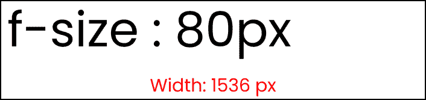

**The result**

因为我们将根字体大小更改为 40px，所以当我们更改。文本字体大小为 2 雷姆，我们得到 2*40 = 80px。

# 如何用 REM 单位制作响应式网站

用 REM 单元制作响应性网站非常容易。只需用 **rem 单位**而不是像素来写你的风格，并使用媒体查询在不同的断点处改变根元素。

这里有一个演示向你展示它是如何做到的👇以及如何添加媒体查询:

```
// large screen 

@media (max-width: 1400px) {
  html {
    font-size: 25px;
  }
}

// Tablet screen 

@media (max-width: 768px) {
  html {
    font-size: 18px;
  }
}

// Mobile screen 

@media (max-width: 450px) {
  html {
    font-size: 12px;
  }
}
```

现在，设置**。正文**类为 3 雷姆单位，这样:

```
.text{
	font-size : 3rem;
}
```

这是结果:👇

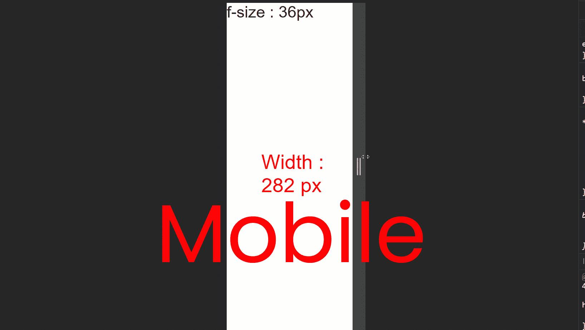

#### 以下是计算结果:

*   对于大屏幕-> 3 雷姆* 25px = 75px
*   对于平板电脑屏幕-> 3 雷姆* 18px = 54px
*   对于手机屏幕-> 3 雷姆* 12px = 36px
*   默认设置-> 3rem * 16px = 48px

# 什么是 EM 单位？


EM 单位与 REM 单位相同，但它取决于**母字体大小**。这里有一个演示。👇

**注意**:确保解除所有媒体询问。

```
html {
  font-size: 16px;
}

.text {
  font-size: 3em;
}

/** Calculations
  font-size should be 
  3 em * 16px = 48px
**/ 
```

结果如下:👇

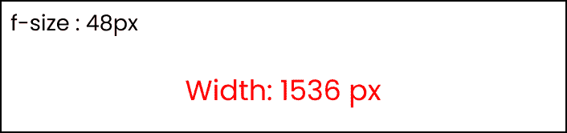

现在，让我们尝试添加 **3em 填充**到。文本类。

```
html {
  font-size: 16px;
}

.text {
  font-size: 3em;
  padding: 3em;
}

/** Calculations
text    => 3em * 16px = 48px
padding => 3em * 3em * 16px = 144px
**/
```

我们得到的不是 48px 的填充，**而是 144px 的填充。正如你所看到的，它得到了**乘以**前一个数字。**

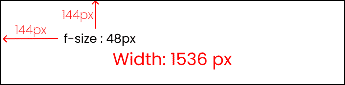

**result of 3em padding**

这是从开发人员控制台计算出来的部分:👇

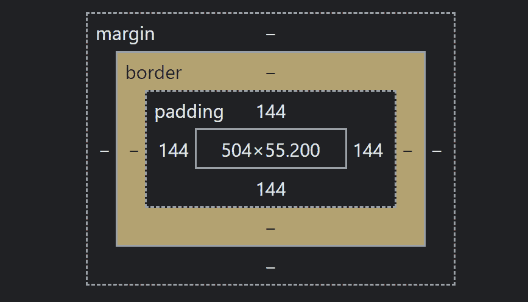

**3em padding to our text**

### 不要使用 EM 单元😵❌

使用 EM 单元**不值得花费精力**,因为:

*   你很有可能犯计算错误
*   你必须在媒体查询中编写大量代码，同时努力让网站在所有屏幕尺寸下都能做出响应
*   太费时间了。

# 什么是大众单位？


VW 的完整形式是**视口宽度**。它的工作原理类似于**百分比单位。**指定 **10vw** 相当于占据整个可视屏幕宽度的 10%。

要试验结果，请在您的 CSS 中进行这些更改👇

**注意:**注释。盒子类。

```
.text {
  display: none;
}

.box {
  width: 50vw;

  height: 300px;
  /* display: none; */
}
```

仔细看的话可以看到 **50vw 表示 50%，**会覆盖整个屏幕宽度的一半。

在 JavaScript 部分，取消最后一行的注释:👇

```
 // Box Width & height

  box.innerHTML = "Width : " + Box_width;

  // box.innerHTML = "Height : " + Box_height;
```

结果看起来像这样:👇

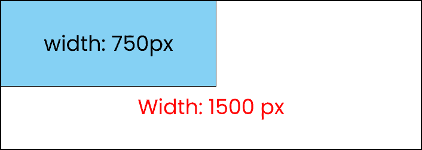

**50vw occupies 50% of screen width**

如您所见，即使我们调整了窗口的大小，该元素也将总是覆盖那么多的空间


**resizing box which is 50vw in size **

# 什么是 VH 单位？


VH 的完整形式是**视口高度**。它也像**百分比单位**一样工作。指定 **10vh** 相当于占据整个可视屏幕高度的 10%。

请看这个演示，了解它是如何工作的:👇

```
.text {
  display: none;
}

.box {
  width: 300px;

  height: 50vh;
   /* display: none; */
}
```

仔细看可以看到， **50vh 表示 50%，**会覆盖整个屏幕高度的一半。

在 JavaScript 部分，在最后取消对这行的注释:👇

```
 // Box Width & height

  // box.innerHTML = "Width : " + Box_width;

  box.innerHTML = "Height : " + Box_height;
```

此外，进行以下更改:👇

```
 // Screen Size (Width & height)

  // size.innerHTML = "Width : " + Width + " px";
  size.innerHTML = "Height : " + Height + " px";
```

这是结果:👇

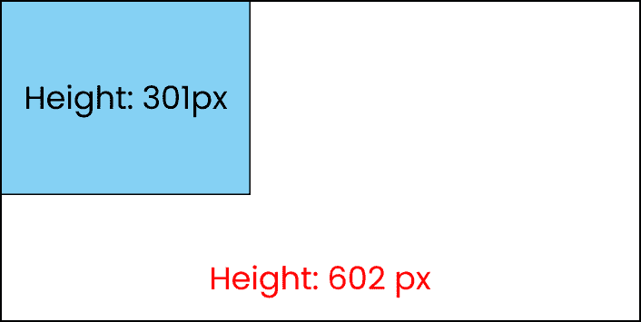

**50vh occupies 50% of screen Height**

如你所见，即使我们调整窗口大小，它也总是会占据那么多空间。

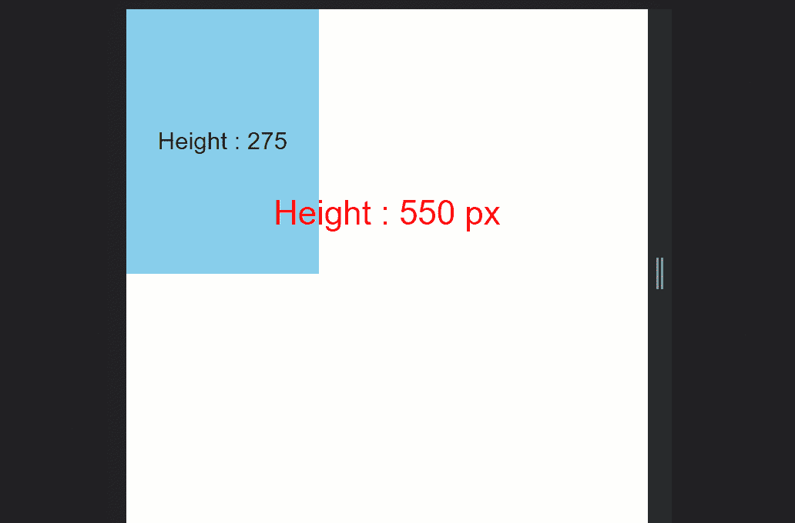

**resizing box which is 50vh in size**

就是这样！

# 结论

恭喜你！现在，可以自信地使用 REM、EM、VW 和 VH 单元来制作**完美响应的网站。**

这是你的奖章，🎖️，奖励你成功阅读到最后。❤️


# 额外资源

*   [完成媒体查询教程](https://www.freecodecamp.org/news/learn-css-media-queries-by-building-projects/)

[https://www.youtube.com/embed/HY8q4TD3KGM?feature=oembed](https://www.youtube.com/embed/HY8q4TD3KGM?feature=oembed)

# 信用

*   图片来自 [Freepik](https://www.freepik.com/user/collections/rem/2273142)

### 建议和批评是高度赞赏❤️️

*   [**YouTube**/JoyShaheb](https://www.youtube.com/c/joyshaheb)
*   [**LinkedIn**/JoyShaheb](https://www.linkedin.com/in/joyshaheb/)
*   [**推特** / JoyShaheb](https://twitter.com/JoyShaheb)
*   [insta gram/JoyShaheb](https://www.instagram.com/joyshaheb/)