# 学习 CSS–响应式网页设计学习指南

> 原文：<https://www.freecodecamp.org/news/learn-css/>

级联样式表(CSS)代表网页的设计。但是当你第一次学习这些信息时，很难记住所有不同的 CSS 属性。

在这篇文章中，我为 freeCodeCamp 课程的整个[创建了一个学习指南，通过构建一个咖啡馆菜单实践项目](https://www.freecodecamp.org/learn/2022/responsive-web-design/#learn-basic-css-by-building-a-cafe-menu)来学习基本的 CSS。本学习指南包含更多信息、文章和视频，有助于您更好地理解这些概念。

在进行认证时，请随意参考本指南。项目的第一部分回顾 HTML 元素，然后转移到 CSS。

以下是涵盖主题的完整列表。单击下面的任何链接，了解有关该主题的更多信息。

## 目录

*   [文档类型和 HTML 元素](#doctype-and-html-elements) -步骤 1
*   [标题和标题元素](#head-and-title-elements) -步骤 2
*   [元字符集属性](#meta-charset-attribute) -步骤 3，17
*   [Body 元素](#body-element) -步骤 4
*   [标题元素](#heading-elements) -步骤 6、9、10、47
*   [段落元素](#paragraph-element) -步骤 7、30、31、49、65
*   [标题元素](#header-element) -步骤 7
*   [主要元素](#main-element) -步骤 5
*   [截面元素](#section-elements) -步骤 8、9、46
*   [样式元素](#style-element) -步骤 10
*   [CSS 中的文本对齐属性](#text-align-property-in-css) -步骤 11、12、33、35
*   [分组 CSS 选择器](#grouping-css-selectors) -步骤 13、51
*   [链接外部样式表](#linking-external-stylesheets) -步骤 16
*   [视口元标签](#viewport-meta-tag) -步骤 18
*   [背景颜色属性](#background-color-property) -步骤 18、19、23、68
*   [Div 元素](#div-element) -步骤 20
*   [CSS `width`属性](#css-width-property) -步骤 21、24、38、39、41、45
*   [CSS 注释](#css-comments) -步骤 22、77
*   [保证金属性](#margin-property) -步骤 25、73、75、84、85、86、91
*   [等级选择器](#class-selectors) -步骤 26、27、32、34、36、42、44、50、61、76、87
*   [`background-image`属性](#background-image-property) -步骤 28
*   [文章元素](#article-element) -步骤 29、31、48、52
*   [块、内联和内联块值](#block-inline-and-inline-block-values) -步骤 37、89
*   [填充](#padding) -步骤 53 - 55，72
*   [`max-width`属性](#max-width-property) -步骤 56
*   [font-family](#font-family-property) -步骤 57 - 59
*   [`font-style`属性](#font-style-property) -步骤 60
*   [`font-size`属性](#font-size-property) -步骤 62、74、78
*   [页脚元素](#footer-elements) -步骤 63
*   [锚元素](#anchor-elements) -步骤 64
*   [hr 元素](#hr-element) -步骤 66、71
*   [高度属性](#height-property) -步骤 67、70
*   [`border-color`属性](#border-color-property) -步骤 69
*   [颜色属性](#color-property) -步骤 79、83
*   [伪类](#pseudo-classes) -步骤 80、81、82
*   [图像元素](#image-elements) -步骤 88、90
*   【HTML 和 CSS 的附加资源

## DOCTYPE 和 HTML 元素

HTML 代码的第一行应该是`DOCTYPE`声明。一个`DOCTYPE`告诉浏览器页面是用什么版本的 HTML 编写的。

这是 HTML 5 的`DOCTYPE`声明:

```
<!DOCTYPE html>
```

如果您忘记在文件中包含这一行代码，那么浏览器可能不支持一些 HTML 5 标签，如`<article>`、`<footer>`和`<header>`。

`html`元素是根元素，所有其他元素都在其中。

```
<!DOCTYPE html>
<html lang="en">
  <!--All other elements go inside here-->
</html>
```

开始标记`<html>`中的`lang`属性设置页面的语言。出于可访问性的原因，包含它也是很好的，因为屏幕阅读器将知道如何正确地发音。

```
<html lang="en">
```

## 标题和标题元素

标签包含由机器处理的信息。在`<head>`标签中，您将嵌套元数据，元数据是向机器描述文档的数据。

```
<head>
  <!--important meta data goes inside here-->
  <!--title element also goes inside here-->
</head>
```

标签是网页的标题。该文本显示在浏览器的标题栏中。

```
 <title>HTML 5 Boilerplate</title> 
```

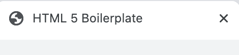

这是一个真实网页上的`head`的例子。这些信息都不会显示在网页上。

```
 <head>
    <meta charset="UTF-8">
    <meta name="viewport" content="width=device-width, initial-scale=1.0">
    <meta http-equiv="X-UA-Compatible" content="ie=edge">
    <title>HTML 5 Boilerplate</title>
    <link rel="stylesheet" href="style.css">
  </head>
```

对于列出的每个 meta 标签的详细描述，您可以在 HTML5 样板文件上通读[这篇文章。](https://www.freecodecamp.org/news/basic-html5-template-boilerplate-code-example/)

## 元字符集属性

UTF-8 是你应该在你的网页中使用的标准字符编码。这通常是在`<head>`元素中显示的第一个`<meta>`标签。

```
 <meta charset="UTF-8">
```

据[环球网财团](https://www.w3.org/International/questions/qa-choosing-encodings)，

> 基于 Unicode 的编码(如 UTF 8)可以支持多种语言，并且可以容纳这些语言混合使用的页面和表单。它的使用还消除了服务器端逻辑为提供的每个页面或每个输入表单提交单独确定字符编码的需要。

## 主体元素

body 元素包含网页的所有内容。这包括标题、段落、图像、链接等等。

```
<html>
  <head>
    <title>Let's learn about the body element</title>
  </head>
  <body>
    <!--web page content goes inside here-->
  </body>
</html> 
```

## 标题元素

HTML 标题元素表示网页的主标题和副标题。

元素代表最重要的标题，在每个网页上应该只使用一次。

```
<h1>I represent the main heading of a web page</h1>
```

`h2`元素代表页面上第二重要的标题。

```
<h2>I am the second most important heading element</h2>
```

共有六个部分标题元素:

```
<h1>I am the most important heading element</h1>
<h2>I am the second most important heading element</h2>
<h3>I am the third most important heading element</h3>
<h4>I am the fourth most important heading element</h4>
<h5>I am the fifth most important heading element</h5>
<h6>I am the least important heading element</h6>
```

这是呈现在页面上的样子。

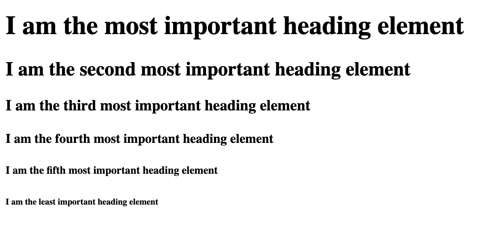

要了解更多关于标题元素的信息，你可以通读这个 [DevDocs 详细的标题元素解释](https://devdocs.io/html/element/heading_elements)。

## 段落元素

段落元素代表网页上的段落。

```
<p>I love learning with freeCodeCamp. They have thousands of free articles and videos to help me learn how to code.</p>
```

这是页面呈现的外观:

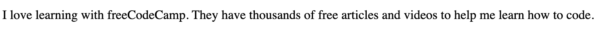

要了解更多关于段落元素的内容，你可以通读这个 [DevDocs `p`元素的详细解释](https://devdocs.io/html/element/p)。

## 标题元素

`header`元素包含网页的介绍性内容。这可以包括像`nav`、`h1`或网站标志这样的元素。

```
<header>
  
  <nav>
    <ul>
      <li><a href="/">Home</a></li>
      <li><a href="#bio">Bio</a></li>
      <li><a href="#projects">Projects</a></li>
    </ul>
  </nav>
</header>
```

## 主要元素

`main`元素用于对网页的所有主要内容进行分组。

```
<h1>What freeCodeCamp has to offer</h1>
<main>
  <p>The core freeCodeCamp curriculum teaches full stack JavaScript and Python. There are hundreds of lessons to go through to get you ready for an entry level developer job.</p>

  <p>freeCodeCamp has thousands of free articles on their news publication. They also have hundreds of videos on their YouTube channel.</p>
</main>
```

这是代码呈现给页面的样子。

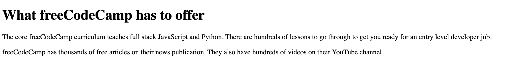

要了解更多关于`main`元素的信息，你可以通读这个 [DevDocs 详细的`main`元素解释](https://devdocs.io/html/element/main)。

## 截面元素

元素用于对 HTML 文档中的内容进行分组。

下面是一个`section`元素的例子:

```
<h1>Let's learn about section elements</h1>
<section>
  <h2>Defintion</h2>
  <p>The section element is used to group sections of content in the HTML document.</p>
</section>
```

这是页面呈现的结果。

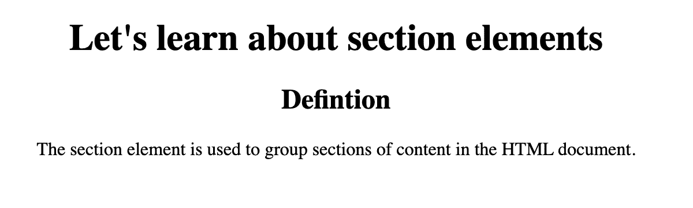

要了解更多关于`section`元素的内容，你可以通读这篇 [DevDocs `section`元素详细解释](https://devdocs.io/html/element/section)。

## 样式元素

元素包含了网页的样式。这就是所谓的内部 CSS。

`style`元素放在`head`标签中。

```
<!DOCTYPE html>
<html lang="en">

<head>
  <style>
    /*Styles will go inside here*/
  </style>
</head>

<body>
  <!--website content goes inside here-->
</body>

</html>
```

要了解更多信息，你可以通读这个关于`style`元素的 [DevDocs 解释。](https://devdocs.io/html/element/style)

## `text-align`CSS 中的属性

当您使用标题或段落标签时，HTML 中的默认样式会将文本放置在页面的左侧。

在这个例子中，我们有一个`<h1>`放在页面的左上角。

```
<h1>Let's learn about centering text</h1>
```

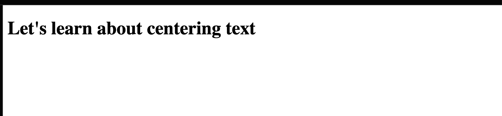

如果我们希望文本在页面上水平居中，那么我们可以使用`text-align`属性。

```
h1 {
  text-align: center;
}
```

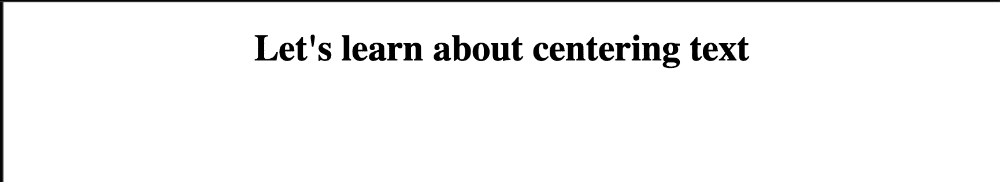

要了解更多，你可以通读这篇关于居中文本的有用文章:[文本在 CSS 中对齐——如何将文本与 HTML 居中对齐](https://www.freecodecamp.org/news/text-align-in-css-how-to-align-text-in-center-with-html/)。

## 分组 CSS 选择器

如果您有多个样式相同的 CSS 选择器，那么您可以像这样将它们组合在一起:

```
h1, h2, h3 {
    text-align: center;
} 
```

注意`h1`、`h2`和`h3`是如何被逗号分隔的。将多个 CSS 选择器组合在一起可以清理 CSS 并消除重复。

你可以在这里阅读更多关于 CSS 组合子的内容。

## 链接外部样式表

`link`元素在大多数情况下用于将外部样式表链接到 HTML 文档。在大多数情况下，使用外部 CSS 有助于将 HTML 和 CSS 保存在不同的文档中，以提高可读性。

```
<!DOCTYPE html>
<html lang="en">
  <head>
    <link rel="stylesheet" href="style.css">
  </head>
  <body>
  </body>
</html>
```

`rel="stylesheet"`定义 HTML 文件和外部样式表之间的关系。

要了解更多，你可以阅读这个关于`link`元素的 [DevDocs 示例。](https://devdocs.io/html/element/link)

## Viewport meta tag

该标签将页面的宽度呈现为设备屏幕尺寸的宽度。如果您的移动设备是 600 像素宽，那么浏览器窗口也将是 600 像素宽。

初始比例控制缩放级别。初始比例值为 1 会阻止浏览器的默认缩放。

```
 <meta name="viewport" content="width=device-width, initial-scale=1.0">
```

## `background-color`属性

您可以使用 CSS `background-color`属性来更改 HTML 元素的背景颜色。

假设我们有这个 HTML 标记。

```
<h1>Let's learn about the background-color property</h1>
<p>We are learning about background colors</p>
```

我想将背景色从默认的白色改为粉红色。我们可以瞄准`body`选择器并使用`background-color: pink;`

```
body {
  background-color: pink;
}
```

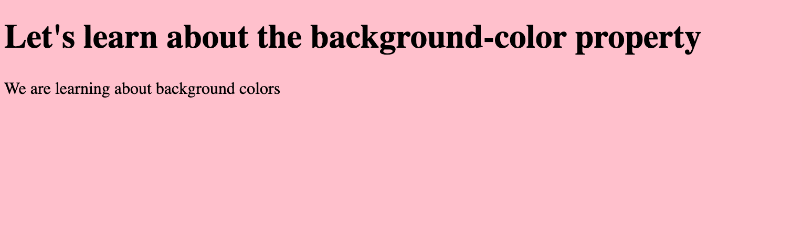

要了解更多，你可以通读这篇有帮助的文章: [CSS 背景色——如何在 HTML 中改变背景色](https://www.freecodecamp.org/news/css-background-color-how-to-change-the-background-color-in-html/)。

## Div 元素

HTML 元素用于将多个 HTML 元素分组，并代表一个通用容器。该元素没有语义意义，主要用于样式目的。

```
<div>
  <h1>Let's learn about divs</h1>
  <p>div elements are generic containers to group elements</p>
</div>
```

要了解更多，你可以通读这篇有用的文章:[HTML Div——什么是 Div 标签，以及如何用 CSS](https://www.freecodecamp.org/news/html-div-what-is-a-div-tag-and-how-to-style-it-with-css/) 对其进行样式化。

## CSS 宽度属性

属性将设置 HTML 元素的宽度。

在这个例子中，我想将这个`div`的宽度设置为 200px。

```
div {
  width: 200px;
}
```

要了解更多，您可以通读这个关于 width 属性的有帮助的 [DevDocs 解释](https://devdocs.io/css/width)。

## CSS 注释

如果您需要注释掉代码或给自己或其他开发人员留言，您可以使用注释。

下面是 CSS 中注释的基本语法:

```
/* this is a comment in CSS */
```

注释标签中的任何内容都不会呈现在网页上。

在这个例子中，我们有一些 HTML 标记。

```
<h1>CSS comments</h1>
<p class="red-text">This is some demo text</p>
```

对于 CSS，我将文本颜色改为红色，并增加了字体大小。

```
.red-text {
  font-size: 1.2rem;
  color: red;
} 
```

以下是当前的结果:

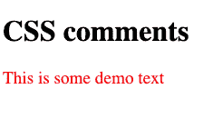

如果我注释掉红色文本，那么文本将返回黑色。

```
.red-text {
  font-size: 1.2rem;
  /* color: red; */
} 
```

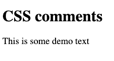

## 保证金财产

属性代表 HTML 元素周围的空间。有四种不同的边距属性:

*   `margin-left`
*   `margin-right`
*   `margin-top`
*   `margin-bottom`

在第一个例子中，我们有两个代表蓝色和红色盒子的`div`元素。

```
<div class="blue-box"></div>
<div class="red-box"></div>
```

```
.blue-box,
.red-box {
  width: 200px;
  height: 200px;
}

.blue-box {
  background-color: blue;
}

.red-box {
  background-color: red;
}
```

以下是页面呈现的结果:

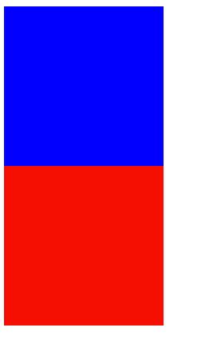

如果我们想在红框和蓝框之间创造一些空间，我们可以使用`margin`属性。我将在蓝框中添加一个`margin-bottom: 20px;`来创造空间。

```
.blue-box {
  background-color: blue;
  margin-bottom: 20px;
}
```

结果是这样的:

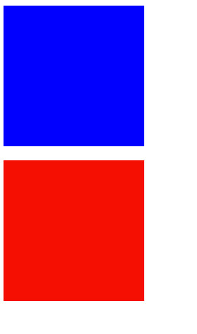

我们也可以通过将`margin-left`和`margin-right`属性设置为`auto`来使两个框居中。

```
.blue-box,
.red-box {
  width: 200px;
  height: 200px;
  margin-left: auto;
  margin-right: auto;
}
```

结果如下:

[https://codepen.io/jessica-wilkins/embed/preview/yLKJyjV?default-tabs=css%2Cresult&height=300&host=https%3A%2F%2Fcodepen.io&slug-hash=yLKJyjV](https://codepen.io/jessica-wilkins/embed/preview/yLKJyjV?default-tabs=css%2Cresult&height=300&host=https%3A%2F%2Fcodepen.io&slug-hash=yLKJyjV)

在下一个例子中，我们在页面上有一个绿框、一个蓝框和一些文本。我们可以使用`margin-left`、`margin-right`、`margin-top`和`margin-bottom`属性在文本和文本框之间创建空格。

```
<h1 class="text">Margin shorthand property</h1>
<div class="green-box"></div>
<p class="text">Margins create space around HTML elements</p>
<div class="blue-box"></div>
<p class="text">CSS is fun</p>
```

```
.text {
  text-align: center;
}
.blue-box,
.green-box {
  width: 200px;
  height: 200px;
  margin-left: auto;
  margin-right: auto;
  margin-top: 20px;
  margin-bottom: 20px;
}

.blue-box {
  background-color: blue;
}

.green-box {
  background-color: green;
} 
```

结果如下:

[https://codepen.io/jessica-wilkins/embed/preview/gOeMbjN?default-tabs=css%2Cresult&height=300&host=https%3A%2F%2Fcodepen.io&slug-hash=gOeMbjN](https://codepen.io/jessica-wilkins/embed/preview/gOeMbjN?default-tabs=css%2Cresult&height=300&host=https%3A%2F%2Fcodepen.io&slug-hash=gOeMbjN)

对于蓝色和绿色的框，我们可以在这里清理我们的代码，并将所有这些`margin`样式都放在一行中。

```
 margin-left: auto;
  margin-right: auto;
  margin-top: 20px;
  margin-bottom: 20px;
```

`margin`速记属性用于设置元素所有边的边距。如果存在两个值，那么第一个值代表顶部&底部页边距，而第二个值代表左侧&右侧页边距。

```
 margin: 20px auto;
```

要了解更多关于`margin`速记属性的信息，你可以通读[这个有用的 DevDocs 解释](https://devdocs.io/css/margin)。

## 类别选择器

如果您希望一组 HTML 元素共享相同的样式，那么您可以使用`class`属性。

下面是一个如何将类应用到 HTML 元素的例子。

```
<h1 class="title">Jessica Wilkins blog</h1>
```

然后在你的 CSS 中，你可以把这个类作为目标，给它添加一些样式。

这是一个使用 CSS 将文本变成红色的例子。注意，你需要在类名前面加上一个`.`，告诉计算机你想使用一个类选择器。

```
.title {
  color: red;
} 
```

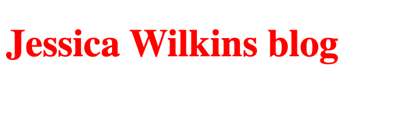

## 背景图像属性

属性用来设置一个 HTML 元素的背景图片。

在这个例子中，我们将把千层面的背景图像应用到`body`元素。

```
body {
  background-image: url("https://cdn.freecodecamp.org/curriculum/cat-photo-app/lasagna.jpg");
} 
```

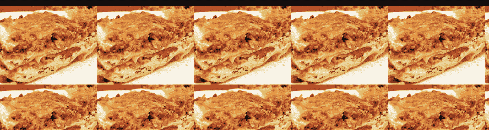

这个图像在屏幕上重复出现的原因是因为这是`background-image`属性的默认行为。您可以使用`background-repeat: no-repeat;`来改变默认行为。

## 文章元素

`article`元素是一个语义 HTML 元素，用于独立的自包含内容。

```
<article>
  <h2>Blog entry #3</h2>
  content goes here...
</article>
```

## 块、内联和内联块值

`display`属性用于将块或内联特征应用于元素。块级元素占用页面上的全部水平空间，而行内元素只占用该元素的水平空间。

内联元素不能使用宽度和高度属性。`margin`左值和右值适用于行内元素，但不适用于顶值和底值。

一行中可以显示多个行内元素，但每行只能有一个块级元素。以下是一行中多个行内元素的示例:

```
<a href="">this is link 1</a>
<a href="">this is link 2</a>
<a href="">this is link 3</a>
```

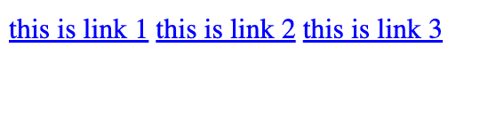

您可以使用这些锚元素上的`display:block;`值来改变它们的默认行为并将其设置为块特征。

```
a {
  display: block;
} 
```

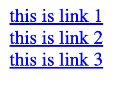

下一个例子是针对多个块级元素的。请注意这些`divs`是如何占据页面上的整个水平空间的，并且它们没有彼此相邻显示。

```
<div class="box red"></div>
<div class="box green"></div>
<div class="box blue"></div>
```

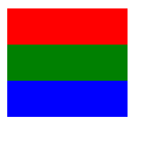

这个最后的值叫做`inline-block`，它将把元素视为内联的，但是也具有块级元素的特征。

下面是两个段落元素的示例，默认情况下它们是块级元素。

```
<p>This is paragraph 1.</p>
<p>This is paragraph 2.</p>
```

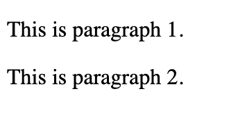

我可以为这些`p`元素设置宽度、边距、填充和`background-color`。

```
p {
  background-color: #89cff0;
  width: 100px;
  margin: 20px;
  padding: 15px;
} 
```

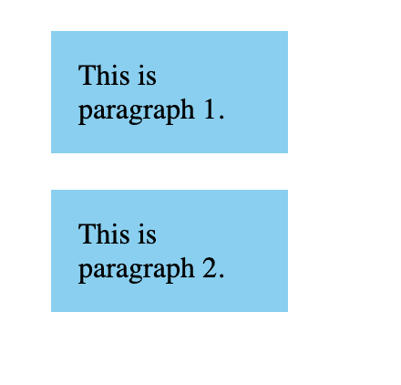

我们可以添加`display: inline-block;`将段落元素放在一起。

```
p {
  background-color: #89cff0;
  width: 100px;
  margin: 20px;
  padding: 15px;
  display: inline-block;
} 
```

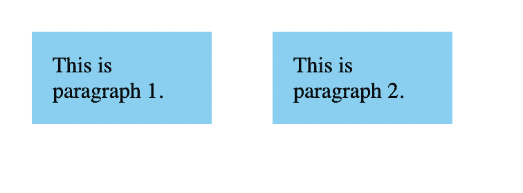

## 填料

在 CSS 中，您可以添加填充以在元素内容周围创建空间。

在这个例子中，我们有一个没有填充的粉红色背景的段落元素。

```
<p>This is an example without padding</p>
```

```
p {
  background-color: pink;
  width: 100px;
} 
```


注意文本是如何紧靠着`p`元素的边框的。那是因为我们没有添加任何填充。

如果我们想在文本周围创造空间，那么我们可以使用填充。让我们在文本的所有边上添加 10px 的填充。

```
p {
  background-color: pink;
  width: 100px;
  padding: 10px;
}
```

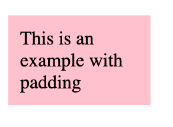

如果我们只想在左侧和右侧添加填充，那么我们可以使用`padding-left`和`padding-right`属性。

```
p {
  background-color: pink;
  width: 100px;
  padding-left: 10px;
  padding-right: 10px;
}
```

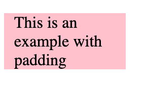

我们也可以修改它，这样就只有文本顶部和底部的空间了。

```
p {
  background-color: pink;
  width: 100px;
  padding-top: 10px;
  padding-bottom: 10px;
} 
```

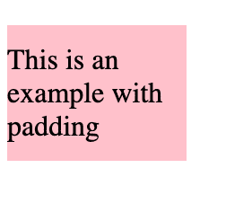

类似于`margin`属性，您可以使用简写符号将不同类型的填充应用于顶部、左侧、右侧和底部。

在本例中，我们将在文本的顶部和底部添加 10px 的填充，在文本的左侧和右侧添加 15px 的填充。

如果没有速记属性，代码将如下所示:

```
p {
  background-color: pink;
  width: 100px;
  padding-left: 15px;
  padding-right: 15px;
  padding-top: 10px;
  padding-bottom: 10px;
} 
```

但是我们可以使用简写符号来达到同样的结果。padding 属性中的第一个数字表示顶部和底部，而第二个数字表示左侧和右侧。

```
p {
  background-color: pink;
  width: 100px;
  padding: 10px 15px;
} 
```

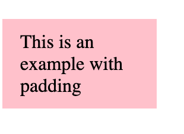

要了解关于填充速记符号的更多信息，您可以通读这个有用的 [DevDocs 解释](https://devdocs.io/css/padding)。

## `max-width`属性

当你想设置一个元素的最大宽度时,`max-width`属性很有用。

在这个例子中，我们有一个红色的容器，它的`width`设置为视窗宽度的 70%。

```
<div class="red-container"></div>
```

```
.red-container {
  width: 70%;
  height: 40px;
  background-color: red;
} 
```


我们可以使用`max-width`属性将这个红色容器的最大宽度设置为 1000px。

```
.red-container {
  width: 70%;
  max-width: 1000px;
  height: 40px;
  background-color: red;
} 
```

现在，当视窗大于 1000 像素时，宽度将不再设置为视窗的 70%。相反，它将保持在 1000 像素的最大宽度。

## `font-family`属性

在设计中，`font-family`代表一组具有相似设计特征的字体。以下是一些字体系列的示例:

```
Times, Times New Roman, serif	
Comic Sans MS, Comic Sans, cursive 
```

在 CSS 中，可以使用`font-family`属性将一组字体应用于给定的元素。

```
<h1>Let's learn about font families</h1>
<p>This is an example on how to use the font-family CSS property</p>
```

```
body {
  font-family: Comic Sans MS, Comic Sans, cursive;
}
```

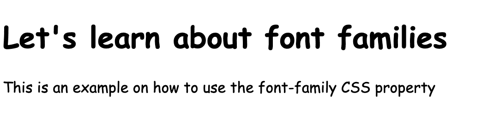

浏览器将选择列表中的第一种字体，并显示它是否可用。如果该字体不可用，那么它将移动到列表中的下一个字体。

如果列表中的其他字体对浏览器不可用，最好提供备用字体。在我们的示例中，如果漫画 Sans MS 和漫画 San 不可用，`cursive`将考虑回退。

## `font-style`属性

`font-style`属性用于设置正常、斜体或倾斜字体样式的文本。

下面是一个将文本设置为斜体`font-style`的例子。

```
<h1>This example is about the font-style property</h1>
```

```
h1 {
  font-style: italic;
} 
```

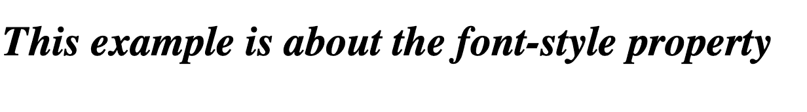

重要的是不要使用 [HTML `i`(惯用文本)元素](https://www.freecodecamp.org/news/html-italics-tutorial-how-to-make-text-italic-with-the-i-tag/)来设计斜体文本。在设计文本样式时，应该总是使用`font-style`属性。

## `font-size`属性

属性用来改变 HTML 元素的字体大小，比如标题和段落。以下是一些可以与`font-size`属性一起使用的常见值:

*   xx-小号，x-小号，小号，中号，大号，x-大号，xx-大号，XXX-大号
*   更小，更大
*   像素、em、rem
*   百分比(例如，字体大小:60%；)

在这个例子中，我们将这个段落元素的`font-size`设置为 20px。

```
<p>This example is about the font-size property</p>
```

```
p {
  font-size: 20px;
} 
```

## **页脚元素**

`footer`元素位于 HTML 文档的底部，包含版权等信息，或者指向页面其他相关信息的链接。

下面是一个基本的例子:

```
<footer>
  <p>© 2022 Jessica Wilkins</p>
</footer>
```

要了解更多关于`footer`元素的信息，你可以通读[这篇 DevDocs 对`footer`元素](https://devdocs.io/html/element/footer)的解释。

## **锚元素**

锚元素代表网页上的链接。

下面是基本语法:

```
<a href="link-where-you-want-to-go">anchor text goes here</a>
```

这是页面呈现的外观:

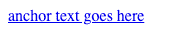

您使用`href`属性来告诉超链接去哪里。

```
href="link-where-you-want-to-go"
```

锚文本是在屏幕上显示给用户的内容。

以下是链接到 freeCodeCamp 的锚标记的示例:

```
<a href="https://www.freecodecamp.org/">freeCodeCamp</a>
```

这是呈现在页面上的样子。

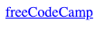

要了解更多关于 HTML 锚元素的信息，我建议通读这些有用的文章:

*   [HTML<标签>锚标签示例代码](https://www.freecodecamp.org/news/the-html-a-tag-anchor-tag-example-code/)
*   [HTML < a >标签–锚链接 HREF 示例](https://www.freecodecamp.org/news/html-a-tag-anchor-link-href-example/)

## `hr`元素

`hr`(水平线)元素用于在段落元素之间创建分隔符。

下面是一个如何在两个段落元素之间使用`hr`元素的例子。`hr`元素是自我封闭的。

```
<p>This is paragraph 1</p>
<hr>
<p>This is paragraph 2</p>
```

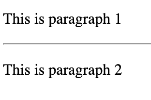

您可以通过改变`hr`元素的边框和颜色来设置其样式。

```
hr {
  border: 5px solid red;
} 
```

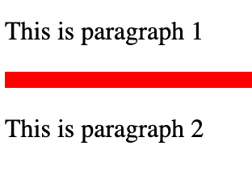

## 高度属性

CSS 中的`height`属性用于设置 HTML 元素的高度。这里有一个例子，我们有一个高度为 50px 的蓝色容器。

```
<div class="blue-container"></div>
```

```
.blue-container {
  background-color: blue;
  width: 30px;
  height: 50px;
} 
```

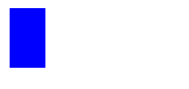

要了解更多关于`height`属性的信息，你可以通读这个有用的 [DevDocs 解释](https://devdocs.io/css/height)。

## `border-color`属性

属性用来设置元素边框的颜色。

在这个例子中，我们将创建两个具有不同边框颜色的段落元素。第一步是设置边框宽度和样式。

```
<p class="para1">This is paragraph one with a green border</p>
<p class="para2">This is paragraph two with a blue border</p>
```

```
p {
  border-style: solid;
  border-width: 3px;
} 
```

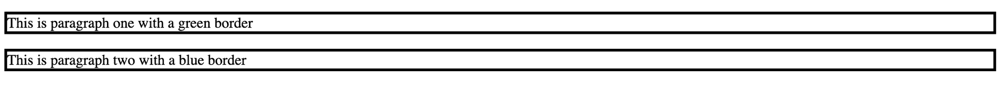

然后我们可以设置第一段的边框颜色为绿色，第二段的边框颜色为蓝色。

```
.para1 {
  border-color: green;
}

.para2 {
  border-color: blue;
}
```

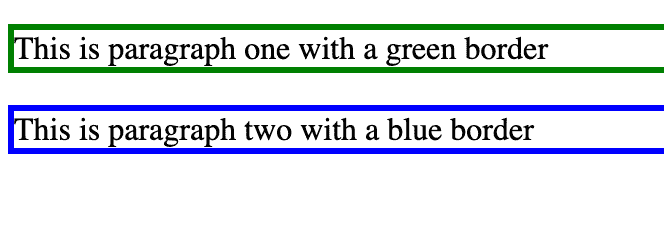

我们可以重写我们的例子，使用边框速记符号来同时应用边框宽度、颜色和样式。

```
.para1 {
  border: 3px solid green;
}

.para2 {
  border: 3px solid blue;
} 
```

## 颜色属性

您可以使用`color`属性更改文本的颜色。以下是将段落文本更改为蓝色的示例:

```
<p>This is an example for the color property</p>
```

```
p {
  color:blue;
}
```

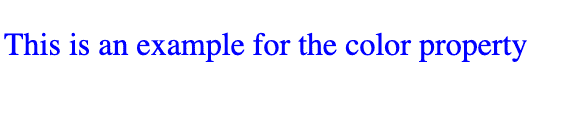

## 伪类

伪类是特殊的关键字，可以添加到 CSS 选择器中以显示 HTML 元素的特定状态。

在第一个例子中，我们将创建一个蓝色按钮，当用户将鼠标悬停在它上面时，它会变成较暗的蓝色。我们可以使用`:hover`伪类来实现这个结果。

```
<button>Login</button>
```

```
button {
  border: none;
  padding: 10px;
  font-size: 20px;
  color: white;
  background-color: #0e3386;
  cursor: pointer;
}

button:hover {
  background-color: #041e42;
} 
```

[https://codepen.io/jessica-wilkins/embed/preview/ExRgXod?default-tabs=css%2Cresult&height=300&host=https%3A%2F%2Fcodepen.io&slug-hash=ExRgXod](https://codepen.io/jessica-wilkins/embed/preview/ExRgXod?default-tabs=css%2Cresult&height=300&host=https%3A%2F%2Fcodepen.io&slug-hash=ExRgXod)

在下一个例子中，我们将使用 CSS 伪类来设计链接的不同状态。

`:link`伪类用于显示链接的初始状态。

```
a:link {
  color: #0066b2;
}
```

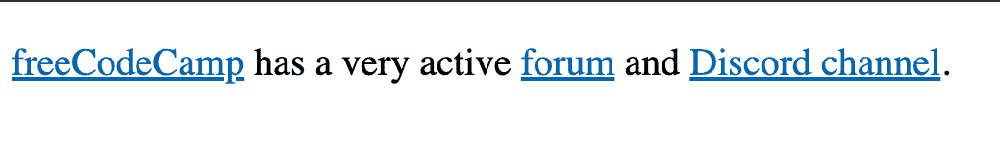

`:hover`伪类用于显示用户何时悬停在链接上。

```
a:hover {
  color: #13274f;
}
```

`:visited`伪类用于显示用户点击链接并访问站点的时间。

```
a:visited {
  color: #5a4fcf;
}
```

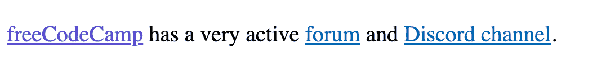

您可以使用这个 CodePen 示例来查看不同的链接状态。

[https://codepen.io/jessica-wilkins/embed/preview/RwJGgyP?default-tabs=html%2Cresult&height=300&host=https%3A%2F%2Fcodepen.io&slug-hash=RwJGgyP](https://codepen.io/jessica-wilkins/embed/preview/RwJGgyP?default-tabs=html%2Cresult&height=300&host=https%3A%2F%2Fcodepen.io&slug-hash=RwJGgyP)

如果你想了解更多关于伪类的知识，那么你可以通读这篇[有用的文章](https://www.freecodecamp.org/news/explained-css-pseudo-classes-cef3c3177361/)。

## **图像元素**

`img`元素用来给网页添加图片。

`src`属性表示图像的位置，而`alt`属性是图像的描述性文本。

```

```

这是呈现在页面上的代码:

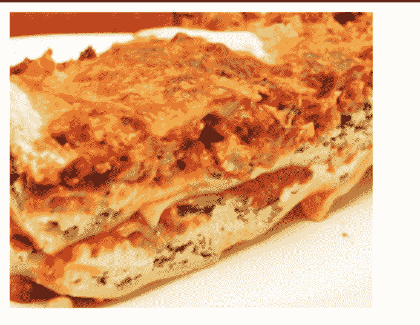

要了解更多关于`img`元素的信息，你可以通读这个有用的 [`img`元素教程](https://www.freecodecamp.org/news/img-html-image-tag-tutorial/)。

## HTML 和 CSS 的附加资源

感谢阅读！这里有一些更有用的资源，可以帮助你熟悉 CSS:

*   [CSS 教程-初学者的完整课程](https://www.youtube.com/watch?v=OXGznpKZ_sA)
*   [CSS 教程-零到英雄(完整教程)](https://www.youtube.com/watch?v=1Rs2ND1ryYc)
*   [学习 HTML&CSS——初学者完全教程](https://www.youtube.com/watch?v=a_iQb1lnAEQ)
*   [响应式网页设计入门- HTML & CSS 教程](https://www.youtube.com/watch?v=srvUrASNj0s)
*   [HTML 和 CSS 教程-为初学者创建网站](https://www.youtube.com/watch?v=kMT54MPz9oE)