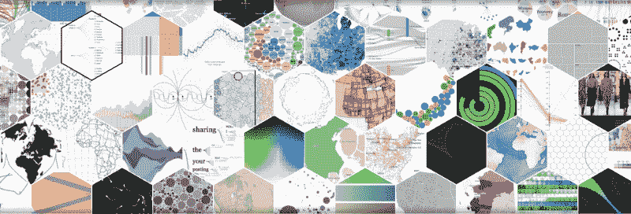
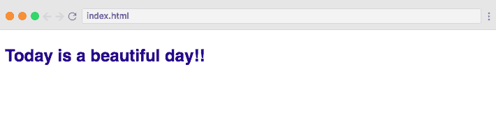
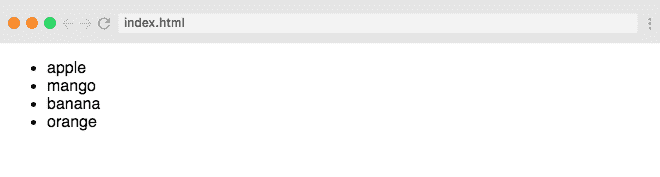
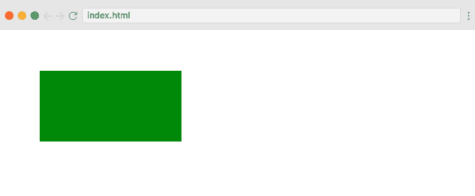
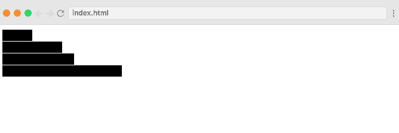
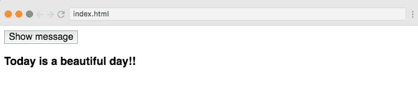

# 5 分钟学会 D3.js

> 原文：<https://www.freecodecamp.org/news/learn-d3-js-in-5-minutes-c5ec29fb0725/>

作者 Sohaib Nehal

# 5 分钟内学习 D3.js

#### 创建数据可视化表示的介绍



D3.js 是一个 JavaScript 库，用于基于数据操作文档。它使用 HTML、CSS 和 SVG 来创建可以在任何现代浏览器上查看的数据的可视化表示。

它还为交互和动画提供了一些很棒的功能。

在本教程中，我们将探索 D3.js 的基本概念和特性。我们将借助几个例子来学习如何使用它，如渲染条形图、渲染 HTML 和 SVG 元素，以及对它们应用转换和事件。

我们还在 Scrimba 的 D3.js 上创建了一个免费的 10 节课程。[点击这里查看。](https://scrimba.com/g/gd3js)

### D3 入门

由于 D3.js 是一个 JavaScript 库，您可以简单地将它包含在 HTML 文件的脚本标记中。

```
<script src='https://d3js.org/d3.v4.min.js'></script>
```

完整的源代码和测试也可以从 GitHub 的[下载](https://github.com/d3/d3/zipball/master)。

### DOM 选择

使用 D3.js，我们可以操作文档对象模型(DOM ),这意味着我们可以选择元素并对它们应用各种转换。

让我们从一个简单的例子开始，我们将使用 D3 来选择和改变标题标签的颜色和字体大小。

```
<html>
<head>
    <title>Learn D3 in 5 minutes</title>
</head>
<body>

<h3>Today is a beautiful day!!</h3>

<script src='https://d3js.org/d3.v4.min.js'></script>

<script>
    d3.select('h3').style('color', 'darkblue');
    d3.select('h3').style('font-size', '24px');
</script>
</body>
</html>
```

所以我们简单地将`select()`方法链接到`d3`对象上，然后用`style()`跟进。第一个参数决定了我们想要改变什么，第二个参数给出了值。结果如下:



Example 1: DOM Selection

### 数据绑定

你需要学习的下一个概念是数据绑定，因为这是 D3 最酷的特性之一。使用它，我们可以实时填充或操作 DOM 元素。

在我们的 HTML 中，我们有一个简单的无序列表`<ul>`:

```
<ul> </ul>
```

我们希望使用数据对象来创建列表元素。下面是实现这一点的代码:

```
<script>
    var fruits = ['apple', 'mango', 'banana', 'orange'];
    d3.select('ul')
        .selectAll('li')
        .data(fruits)
        .enter()
        .append('li')
        .text(function(d) { return d; });
</script>
```

在上面的 JavaScript 代码中，D3 首先使用`select()`和`selectAll()`方法选择`<ul>`和其中的任何`<li>`元素。在创建之前选择所有的`li`元素看起来有点奇怪，但是这就是 D3 的工作方式。

然后我们用`data()`方法传入数据，并添加`enter()`，这有点像一个循环。从这一点以后的所有操作都将在`fruits`数组中的每一项上执行一次。

换句话说，它会为数据中的每一项追加一个`<li>`。对于每一个`<li>`标签，它也使用`text()`方法在里面附加文本。`text()`回调函数中的参数`d`是指数组中给定迭代处的元素( **苹果、芒果，以此类推** )。

这是我们的最终结果:



Example 2: Data Binding

### 创建 SVG 元素

可缩放矢量图形(SVG)是一种在 DOM 中呈现图形元素和图像的方法。因为 SVG 是基于向量的，所以它是轻量级的，可伸缩的。D3 使用 SVG 来创建所有的视觉效果，因此它是这个库的核心构建块。

在下面的例子中，使用 D3 在 SVG 容器中绘制了一个矩形。

```
//Select SVG element
var svg = d3.select('svg');

//Create rectangle element inside SVG
svg.append('rect')
   .attr('x', 50)
   .attr('y', 50)
   .attr('width', 200)
   .attr('height', 100)
   .attr('fill', 'green');
```

在这段代码中，D3 在 DOM 中呈现了一个矩形元素。它首先选择 SVG 元素，然后在其中呈现一个矩形元素。它还使用`attr()`方法设置矩形的 x 和 y 坐标及其宽度、高度和填充属性。



Example 3: Creating SVG Element

### 创建条形图

D3 还允许我们创建许多不同类型的图表和图形，以高效的方式表示数据。在下面的例子中，我们使用 D3 创建了一个简单的条形图。

让我们从直接在 HTML 中创建一个 SVG 标签开始。

```
<svg width='200' height='500'></svg>
```

然后，我们将编写所需的 JavaScript，以便在我们的`<svg>`标签中呈现条形图:

```
var data = [80, 120, 60, 150, 200];

var barHeight = 20;

var bar = d3.select('svg')
          .selectAll('rect')
          .data(data)
          .enter()
          .append('rect')
          .attr('width', function(d) {  return d; })
          .attr('height', barHeight - 1)
          .attr('transform', function(d, i) {
            return "translate(0," + i * barHeight + ")";
          });
```

在这段代码中，我们有一个数字数组，我们将使用它来呈现我们的条形图。数组中的每一项都代表一个条形。我们利用了这样一个事实:条形只是宽度或高度可变的矩形。

选择 SVG 和 rectangle 元素后，我们使用`data()`方法传递数据集，并调用`enter()`开始循环数据。

对于每个数据项，我们呈现一个矩形，并设置其宽度等于其值。然后我们设置每个条的高度，为了避免重叠，我们通过从`barHeight`中减去 1 来提供一些填充。

然后，我们使用 translate 属性转换我们的条形，该属性将一个接一个地定位每个矩形，而不是从同一点开始。`transform()`接受一个回调函数，该函数在其参数中获取数据和索引。我们在 y 轴上平移矩形，将 index 乘以条形的高度。

结果如下:



Example 4: Creating Bar Chart

### 事件处理

最后，让我们看看事件处理。D3 还支持内置和自定义事件，我们可以用它的监听器将这些事件绑定到任何 DOM 元素。在下面的例子中，我们将 click 事件绑定到按钮，并在其事件处理程序中将 heading 标签附加到 body。

```
d3.select('#btn')
        .on('click', function () {
            d3.select('body')
               .append('h3')
               .text('Today is a beautiful day!!');
        });
```

因此，当我们单击该按钮时，会出现下面的文本:



Example 5: Event Handling

### 结论

D3.js 是一个非常强大而简单的 JavaScript 库，它允许您使用 HTML、CSS 和 SVG 来处理基于数据的文档，并赋予文档生命力。

网上有很多学习 D3.js. ****的好资源，我们在 Scrimba 上创建了一个关于 D3.js 的免费课程，在这里可以免费获得**** [****。****](https://scrimba.com/g/gd3js)

谢谢:)

**我是 Sohaib Nehal。我是一名全栈 Web 应用程序开发人员。你可以在 sohaib.nehal@ymail.com 或推特@Sohaib_Nehal 上找到我。*谢谢:-)*