# 通过构建和部署一个作品集网站来学习 11 个静态站点生成器

> 原文：<https://www.freecodecamp.org/news/learn-eleventy/>

## 什么是十一？

Eleventy(也称为 11ty)是一个简单而强大的静态站点生成器。它使用 JavaScript 将数据和模板转换成 HTML 页面。

它对初学者友好，构建速度快，默认情况下可以快速生成网站。它也有一个非常活跃和友好的社区。

Eleventy 擅长于内容驱动的网站，被[谷歌](https://web.dev/)、 [Netlify](https://www.netlify.com/) 、[麻省理工](https://digitalhumanities.mit.edu/)、 [CERN](https://worldwideweb.cern.ch/) 、[A11y 项目](https://www.a11yproject.com/)、 [ESLint、](https://eslint.org/)等等使用。

由于页面是提前生成的，因此可以通过内容交付网络(CDN)尽可能快地提供。Eleventy 也不生成客户端 JavaScript，这有助于您的网站加载更快。

在本教程中，我们将构建一个简单的开发者作品集网站来展示 Eleventy 的一些主要特性。

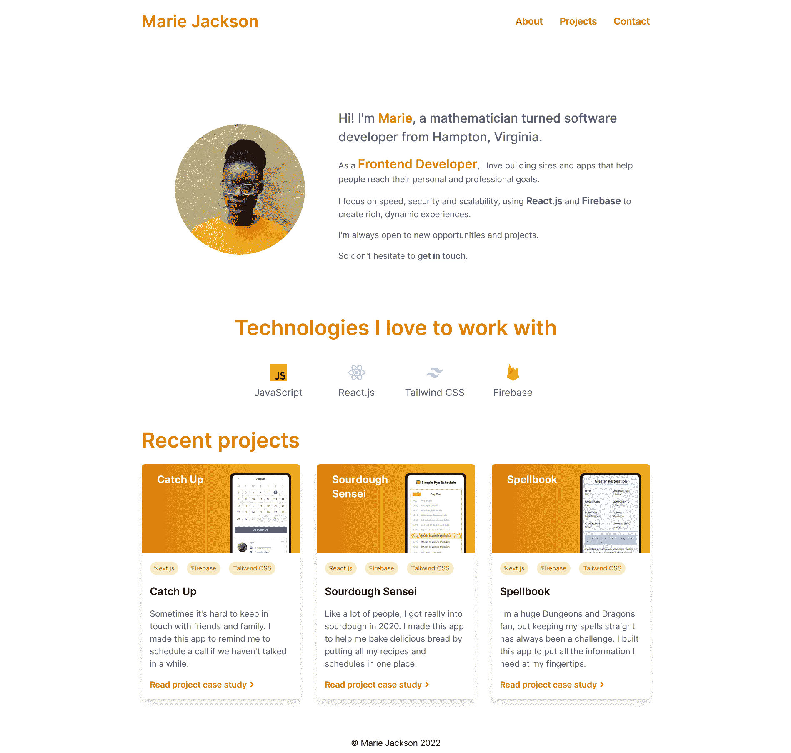

Eleventy portfolio homepage

我们将了解:

1.  设置和配置 Eleventy 项目
2.  模板和布局
3.  处理 CSS 和图像
4.  使用集合和数据文件
5.  短代码和十一插件
6.  将站点部署到网络

投资组合网站将包含:

*   主页
*   关于页面
*   联系页面(带有联系表单)
*   项目页面
*   每个项目一页(有案例研究)

Eleventy 可以从 API、内容管理系统(CMS)或本地文件中获取数据。为了简单起见，我们将把项目数据存储在 Markdown 文件中。

GitHub 上有完整的代码[。如果你在任何阶段遇到困难，请对照已完成的网站检查你的代码。](https://github.com/gerhynes/eleventy-portfolio)

## 目录:

1.  [先决条件-安装 Node.js](#prerequisite-install-node-js)
2.  [初始项目设置](#initial-project-setup)
3.  [如何配置项目](#how-to-configure-the-project)
4.  [如何添加模板](#how-to-add-a-template)
5.  [如何使用十一中的模板](#how-to-use-templates-in-eleventy)
6.  [如何使用十一中的布局](#how-to-use-layouts-in-eleventy)
7.  [如何配置 CSS 和图片](#how-to-configure-the-css-and-images)
8.  [如何在第十一节中使用偏旁音](#how-to-use-partials-in-eleventy)
9.  [如何在十一中使用收藏](#how-to-use-collections-in-eleventy)
10.  [如何使用目录数据文件](#how-to-use-directory-data-files)
11.  [如何在模板中使用集合](#how-to-use-collections-in-templates)
12.  [如何使用短代码](#how-to-use-shortcodes)
13.  [如何使用十一张图片插件](#how-to-use-the-eleventy-image-plugin)
14.  [如何用网络表单建立联系人表单](#how-to-a-build-contact-form-with-netlify-forms)
15.  [如何部署到网络生活](#how-to-deploy-to-netlify)
16.  [何去何从](#where-to-take-it-from-here)

### 先决条件-安装 Node.js

如果你还没有安装 Node.js，请转到[nodejs.org](https://nodejs.org/en/)，按照你的操作系统的说明进行操作。

打开一个终端，使用`node --version`确认它已经安装。只要它是版本 12 或更新的，你就可以开始了。

## 初始项目设置

首先，为你的作品集创建一个目录。你可以叫它`eleventy-portfolio`或者任何你想叫的名字。

在终端中打开这个目录，运行`npm init -y`创建一个默认设置的`package.json`文件。

接下来，使用`npm install --save-dev @11ty/eleventy`安装 Eleventy。

在项目的根目录中，创建一个包含以下内容的`.gitignore`文件，这样 Git 就不会跟踪任何不需要的文件:

```
node_modules
/public 
```

.gitignore

## 如何配置项目

默认情况下，Eleventy 是“零配置”。如果您不做任何更改，Eleventy 将获取您根目录中的所有文件，运行一个构建过程，并将结果文件输出到一个`_site`目录。

但是 Eleventy 也有灵活的配置选项，允许您定制构建过程，观察某些文件类型的变化，并使用过滤器和短代码操作内容。

您的第十一项配置放在项目根目录下的一个`.eleventy.js`文件中。

例如，默认的输入目录是你的项目的根目录，而默认的输出目录是`_site`。有些人喜欢改变这一点，常见的选择是`src`和`public`。

如果你喜欢这种结构，在项目的根目录下创建`src`和`public`目录，然后在`.eleventy.js`中将它们设置为输入和输出目录。

```
module.exports = function (eleventyConfig) {
  return {
    dir: {
      input: "src",
      output: "public"
    }
  };
};
```

.eleventy.js

如果您想知道，传递给函数的`eleventyConfig`参数是 Eleventy 提供的默认配置对象。很快我们将使用这个对象来定制我们的第 11 个构建过程。

## 如何添加模板

让我们添加第一个模板。我们将通过使用降价文件使事情尽可能简单。

在`src`目录中，创建一个以`# Hello World from Eleventy`为内容的`index.md`。这是你的第一个十一模板。

要构建和查看站点，我们可以使用 Eleventy 附带的开发服务器。

在您的终端中，确保您在项目的根目录中并运行`eleventy --serve`。这将启动开发服务器，它将监视您的`src`目录，并在您更改代码时自动重新加载您的站点。

过一会儿你会看到:

```
[Browsersync] Access URLs:
 ----------------------------------
    Local: http://localhost:8080
 External: http://your_ip_address:8080
 ----------------------------------
[Browsersync] Serving files from: public
```

Terminal output

打开网页浏览器，进入 [`http://localhost:8080`](http://localhost:8080) 。祝贺你，你已经创建了一个(非常简单的)第十一个站点！🥳🎉

在此阶段，您的项目将具有以下结构:

```
node_modules/
public/
src/
.eleventy.js
.gitignore
package.lock.json
package.json
```

Project structure

大多数网站需要不止一个页面，所以我们需要学习更多关于**模板**的知识。

在此之前，我们可以根据需要定制我们的构建命令。这一步完全是可选的。

### 可选步骤–如何创建自定义构建命令

运行开发服务器的默认命令是`eleventy --serve`，而构建站点的默认命令是`eleventy`。

如果您想用不同的命令替换它们，如`start`和`build`，打开`package.json`，在`scripts`下用您喜欢的命令替换“测试”命令:

```
"scripts": {
    "start": "eleventy --serve",
    "build": "eleventy"
  },
```

package.json

现在我们可以在终端中使用`npm start`来启动开发服务器，使用`npm run build`来生成我们站点的构建。

您可以在任何需要的时候使用`ctrl/cmd` + `c`来停止开发服务器。

## 如何在 Eleventy 中使用模板

将 Markdown 文件转换成 HTML 很简洁，但是到目前为止，仅仅用普通的 HTML 编写你的站点并没有得到多少好处。这就是**模板**发挥作用的地方。

首先，我们需要澄清一些术语:

*   **模板–**Eleventy 将在构建的站点中转换为一个或多个页面的内容文件
*   **布局–**一个模板包装另一个模板，通常提供一个结构来呈现内容
*   **Partial—**构成另一个模板一部分的模板

模板允许你结合内容和数据来生成你的站点需要的 HTML。

布局允许您为多个模板提供相同的基本结构。

Partials 允许您构建小的可重用组件，这些组件可以在更大的模板中使用。

Eleventy 支持十种不同的模板语言，包括:HTML、Markdown、JavaScript、Liquid、Nunjucks、Handlebars、Mustache、EJS、Haml 和 Pug。(在 1.0 版本中，Eleventy 增加了对使用任意文件扩展名的自定义模板的支持，但这可能更适合于更多自定义/高级用例)。

如果愿意，您甚至可以在同一个文件中混合使用不同的模板语言，比如 Markdown 和 Nunjucks。

在这个项目中，我们将使用[双截棍](https://mozilla.github.io/nunjucks/)。它是一种由 Mozilla 创建的 JavaScript 模板语言，在 Eleventy 社区中非常流行。

在`src`目录中，删除`index.md`并创建一个`index.njk`文件。如果你使用 VS 代码，输入`!` + `tab`为页面生成基本的 HTML 结构。将标题更改为“11 个项目组合”，并在`<body>`元素中添加`<h1>Home Page</h1>`。

您的页面应该是这样的:

```
<!DOCTYPE html>
<html lang="en">
<head>
  <meta charset="UTF-8">
  <meta http-equiv="X-UA-Compatible" content="IE=edge">
  <meta name="viewport" content="width=device-width, initial-scale=1.0">
  <title>Eleventy Portfolio</title>
</head>
<body>
  <h1>Home Page</h1>
</body>
</html>
```

index.njk

接下来，仍然在`src`中，创建`about.njk`和`contact.njk`文件。您可以将`index.njk`的内容复制到其中，并将`<h1>`分别替换为`<h1>About Page</h1>`和`<h1>Contact Page</h1>`。

启动您的开发服务器。如果它还没有运行。进入 [`http://localhost:8080`](http://localhost:8080) 查看首页，`http://localhost:8080/about`进入关于页面，`http://localhost:8080/contact`进入联系页面。

在我们的作品集网站中，每个页面都有相同的基本布局。因此，我们将使用 11 个**布局**，而不是在每个页面模板中编写相同的代码。

## 如何在 Eleventy 中使用布局

布局是围绕其他模板的模板，以一致的方式呈现内容。

在`src`目录中，创建一个`_includes`目录。这将包含我们所有的布局和部分。

在`_includes`中，创建一个`base.njk`文件。这将为我们网站的每个页面提供一个标准的布局。

将以下代码复制到`base.njk`:

```
<!DOCTYPE html>
<html lang="en">
<head>
  <meta charset="UTF-8">
  <meta http-equiv="X-UA-Compatible" content="IE=edge">
  <meta name="viewport" content="width=device-width, initial-scale=1.0">
  <meta name="description" content="I'm a Frontend software developer who builds sites and apps that help people reach their personal and professional goals."/>
  <title>{{ title }}</title>
</head>
<body>
  <div class="content">
    <header class="header container">
    <h1 class="header__title">
      <a href="/">Marie Jackson</a>
    </h1>
    <ul class="header__links">
      <li>
        <a class="header__link" href="/about">About</a>
      </li>
      <li>
        <a class="header__link" href="/projects">Projects</a>
      </li>
      <li>
        <a class="header__link" href="/contact">Contact</a>
      </li>
    </ul>
	</header>
    <main class="main container">
      {{ content | safe }}
    </main>
  </div>
  <footer class="footer">
  	<p>&copy; Marie Jackson 2022</p>
  </footer>
</body>
</html>
```

base.njk

`content`值将是我们使用的以`base.njk`为布局的模板的主要内容。`safe`是一个过滤器，防止此内容被转义(替换潜在的不安全字符)。

现在，将`index.njk`改为:

```
---
title: "Eleventy Portfolio"
layout: "base.njk"
---

<h1>{{ title }} Home Page</h1>
```

index.njk

注意模板如何在文件顶部有 frontmatter 数据。默认情况下，这是在 YAML 写的，但你也可以使用其他语言。

这个 frontmatter 允许您为模板设置值。在这种情况下，`layout`值告诉模板使用`base.njk`布局，而`title`值提供了一个我们在模板的`<h1>`标签中使用的标题。

接下来，删除`about.njk`中的所有内容，并粘贴以下内容:

```
---
title: "Eleventy Portfolio"
layout: "base.njk"
---

<section class="bio prose">
  <h2 class="heading--main">My story</h2>
  <p>Lorem ipsum dolor sit amet, consectetur adipiscing elit, sed do eiusmod tempor incididunt ut labore et dolore magna aliqua. Aliquet risus feugiat in ante metus dictum.</p>

  <p>Tellus pellentesque eu tincidunt tortor aliquam nulla facilisi cras fermentum. Turpis egestas integer eget aliquet. Vestibulum morbi blandit cursus risus at ultrices mi tempus. Ut lectus arcu bibendum at. Integer enim neque volutpat ac tincidunt.</p>

  <p>Commodo ullamcorper a lacus vestibulum sed arcu. Et tortor consequat id porta nibh venenatis cras sed. Nulla pharetra diam sit amet nisl. Ipsum nunc aliquet bibendum enim facilisis gravida neque convallis a. Nec sagittis aliquam malesuada bibendum.</p>

  <p>Tellus pellentesque eu tincidunt tortor aliquam nulla facilisi cras fermentum. Turpis egestas integer eget aliquet. Vestibulum morbi blandit cursus risus at ultrices mi tempus. Ut lectus arcu bibendum at. Integer enim neque volutpat ac tincidunt.</p>

  <p>Commodo ullamcorper a lacus vestibulum sed arcu. Et tortor consequat id porta nibh venenatis cras sed. Nulla pharetra diam sit amet nisl. Ipsum nunc aliquet bibendum enim facilisis gravida neque convallis a. Nec sagittis aliquam malesuada bibendum.</p>
</section>
```

about.njk

现在删除`contact.njk`中的所有内容，并粘贴以下内容:

```
---
title: "Eleventy Portfolio"
layout: "base.njk"
---

<h2 class="heading--main text-center">Want to get in touch?</h2>
<p class="contact__sub-heading text-center">I'm always open to new opportunities and projects. </p>

<form class="form" name="contact" action="/success" method="POST" data-netlify="true">
  <div class="form__section">
    <label class="form__label" for="yourName">Name</label>
    <input class="form__input" name="name" type="text" id="yourName" required="true">
  </div>
  <div class="form__section">
    <label class="form__label" for="yourEmail">Email</label>
    <input class="form__input" name="email" type="email"  id="yourEmail" required="true">
  </div>
  <div class="form__section">
    <label class="form__label" for="message">Message</label>
    <textarea class="form__input" name="message" id="message" rows="4" required="true"></textarea>
  </div>
    <button class="form__button" type="submit">Let's talk</button>
</form>
```

contact.njk

在本教程的后面部分，我们将了解这个联系表单是如何工作的。

我们的投资组合开始成形，尽管事情看起来仍然很简单。接下来让我们的 CSS 和图像工作。

## 如何配置 CSS 和图像

虽然 Eleventy 可以理解开箱即用的模板语言，但它需要进行配置以处理 CSS 和图像文件。幸运的是，这不需要太多的配置。在此过程中，我们还将向站点添加一个 favicon。

在`src`目录下，创建三个文件夹:`css`、`images`和`favicons`。

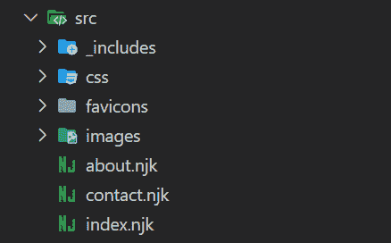

src directory structure

在`css`目录中，创建一个`style.css`文件。由于这不是一个 CSS 教程，我将在[的 GitHub repo 中为项目](https://github.com/gerhynes/eleventy-portfolio/tree/main/src)提供 CSS。您可以从那里复制并粘贴它，但是我不打算深入讨论 CSS。

这个组合的图片也可以在 GitHub repo 的`images`目录中找到。将这些图像复制到项目的`images`目录中。

最后，将文件从 GitHub repo 中的`favicons`目录复制到项目的`favicons`目录中。

在`base.njk`中，将这些行添加到`<head>`元素中:

```
<link rel="icon" href="/favicon.ico" sizes="any">
<link rel="apple-touch-icon" href="/apple-touch-icon.png">
<link rel="preconnect" href="https://fonts.googleapis.com">
<link rel="preconnect" href="https://fonts.gstatic.com" crossorigin>
<link href="https://fonts.googleapis.com/css2?family=Inter:wght@400;500;600&display=swap" rel="stylesheet">
<link rel="stylesheet" href="{{'/css/style.css' | url | safe}}">
```

base.njk

前两个链接包括 favicon，接下来的三个将从 Google fonts 获取 Inter 字体，最后一个将连接`style.css`和`base.njk`。

现在，如果我们重新加载我们的主页，我们会看到…绝对没有任何变化。

默认情况下，Eleventy 将只处理模板文件。要让它包含 CSS 文件和图像，我们需要添加几行配置。

将这些行添加到`.eleventy.js`中的配置功能:

```
module.exports = function (eleventyConfig) {
  eleventyConfig.addPassthroughCopy("./src/css/");
  eleventyConfig.addWatchTarget("./src/css/");
  eleventyConfig.addPassthroughCopy("./src/images/");
  eleventyConfig.addPassthroughCopy({ "./src/favicons": "/" });

  return {
    dir: {
      input: "src",
      output: "public"
    }
  };
}; 
```

.eleventy.js

告诉 Eleventy 将 CSS、favicons 和 image 文件传递到最终版本。

`addWatchTarget`告诉 Eleventy dev 服务器监视`css`目录，并在该目录中的文件发生变化时重新加载站点。

对于 favicons，我们还告诉 Eleventy 将这些文件输出到生成内容的根目录，以便`base.njk`中的链接能够工作。

重启服务器，你会看到 CSS 最终被应用，并且 favicon 出现了。我们将很快包括图像。

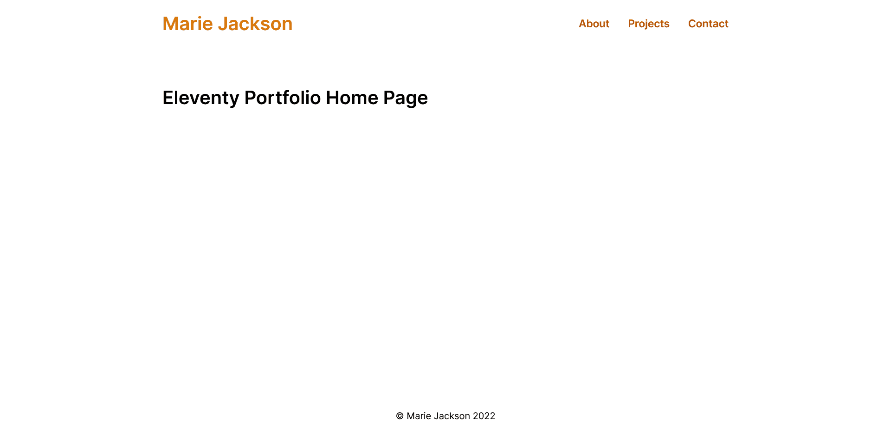

Homepage with styles applied

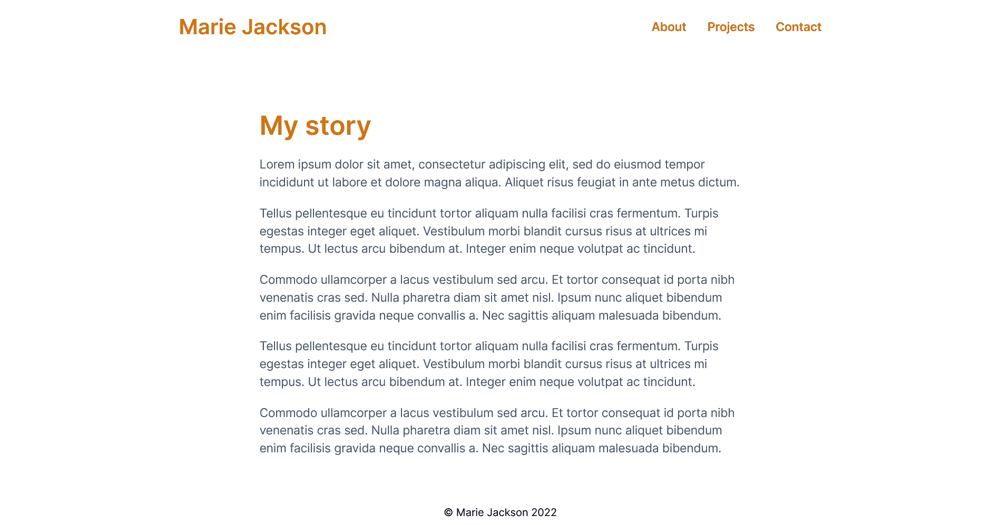

About page with styles applied

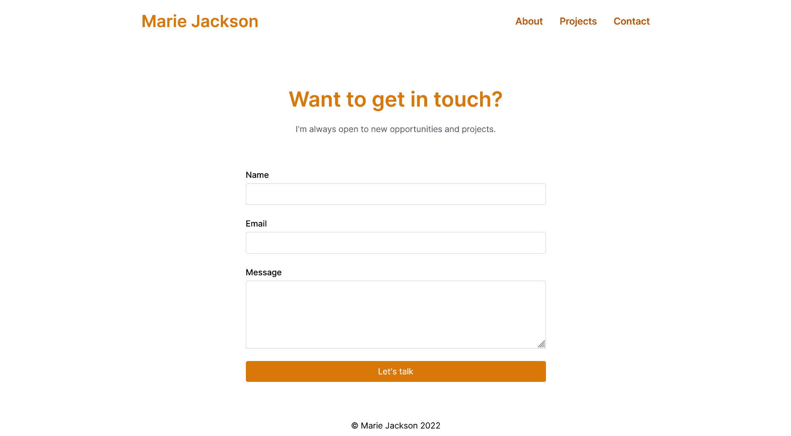

Contact page with styles applied

“关于”页面和“联系人”页面是相当独立的。但是我们网站的主页将会有几个部分。它将包括页眉和页脚，以及个人资料部分，技术部分和项目部分。这些部分中的每一个都将使用一个**分部**。

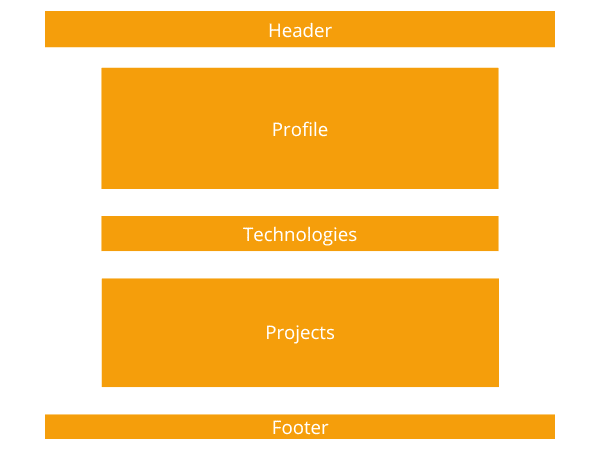

Layout of portfolio homepage

## 如何在十一中使用偏旁音

部分模板是构成另一个模板的一部分的模板。片段帮助我们从可重用组件的角度来考虑我们的站点，我们可以在任何需要的时候包含它们。

在`_includes`目录下，创建一个`header.njk`和`footer.njk`文件。

将标题元素从`base.njk`中剪下并粘贴到`header.njk`中。

从`base.njk`中剪切出页脚元素，并将其粘贴到`footer.njk`中。

回到`base.njk`中，在曾经是页眉元素的地方添加``,在曾经是页脚元素的地方添加``。

`base.njk`现在应该在它的`<body>`标签中包含这些内容:

```
<div class="content">
    
    <main class="main container">
      {{ content | safe }}
    </main>
</div>

```

base.njk

该网站不会看起来有任何不同，但我们的基本布局已经变得更加模块化。

接下来，仍然在`_includes`目录中，创建一个包含以下内容的`profile.njk`文件:

```
<section class="profile">
  <div class="profile__image-wrapper">
    
  </div>
  <div class="profile__card">
    <p class="profile__text">Hi! I'm <span class="profile__text--highlight">Marie</span>, a mathematician turned software developer from Hampton, Virginia.</p>
    <p class="profile__text">As a <span class="profile__text--highlight">Frontend Developer</span>, I love building sites and apps that help people reach their personal and professional goals.</p>
    <p class="profile__text">I focus on speed, security and scalability, using React.js and Firebase to create rich, dynamic experiences.</p>
    <p class="profile__text">I'm always open to new opportunities and projects. So don't hesitate to <a class="profile__link" href="/contact">get in touch</a>.<p>
  </div>
</section>
```

profile.njk

接下来，创建一个包含以下内容的`technologies.njk`文件:

```
<section class="technologies">
  <h2 class="technologies__heading">Technologies I love to work with</h2>
  <ul class="technologies__list">
    <li class="technologies__item">
      <div class="technologies__logo">
      
      </div>
      <h3 class="technologies__title">JavaScript</h3>
    </li>
    <li class="technologies__item">
      <div class="technologies__logo">
      
      </div>
      <h3 class="technologies__title">React.js</h3>
    </li>
    <li class="technologies__item">
      <div class="technologies__logo">
        
      </div>
      <h3 class="technologies__title">Tailwind CSS</h3>
    </li>
    <li class="technologies__item">
      <div class="technologies__logo">
        
      </div>
      <h3 class="technologies__title">Firebase</h3>
    </li>
  </ul>
</section>
```

technologies.njk

在`index.njk`中，将`<h1>`标签替换为:

```


```

index.njk

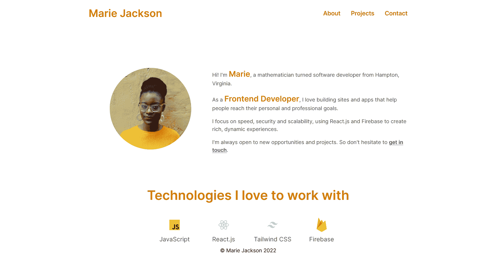

Portfolio homepage with profile and technologies sections

我们的主页开始成形，但网站仍然需要任何投资组合中最重要的部分:项目。

为了保持项目数据有组织，我们将使用**集合**。

## 如何在十一月使用收藏

收藏可让您将相关内容分组在一起。在我们的投资组合中，我们将使用 Markdown 文件创建一个`projects`集合来存储关于每个单独项目的信息。

在`src`目录中，创建一个`projects`目录。我们需要每个项目的降价文件。作为占位符，我们将使用我一直想要构建的三个项目。

Josh W Comeau 有一些关于[建立有效的开发人员组合](https://www.joshwcomeau.com/effective-portfolio/)的好建议，他强烈建议用详细的案例研究来描述你的个人项目。因此，对于我们的每个项目，我们都会有一个案例研究:

*   我们解决了什么问题
*   为什么我们选择这些特定的技术
*   我们面临什么样的挑战
*   我们学到了什么

将以下三个示例项目复制到`projects`目录中:

`catch-up.md`

```
---
title: "Catch Up"
summary: "Sometimes it's hard to keep in touch with friends and family. I made this app to remind me to schedule a call if we haven't talked in a while."
image: /images/catch-up.jpg
imageAlt: "Screenshots of catch up app"
tech:
  - "Next.js"
  - "Firebase"
  - "Tailwind CSS"
siteUrl: "#"
repoUrl: "#"
---

### Problem Solved

Lorem ipsum dolor sit amet, consectetur adipiscing elit, sed do eiusmod tempor incididunt ut labore et dolore magna aliqua. Tincidunt tortor aliquam nulla facilisi. Feugiat scelerisque varius morbi enim nunc faucibus a pellentesque sit. Condimentum lacinia quis vel eros donec ac odio tempor orci.

### Technologies Used

Scelerisque eleifend donec pretium vulputate sapien nec sagittis aliquam. Diam sit amet nisl suscipit adipiscing bibendum est ultricies. Consequat ac felis donec et odio pellentesque diam volutpat commodo.

### Challenges Faced

Eget mauris pharetra et ultrices. Molestie nunc non blandit massa enim nec. Ut tortor pretium viverra suspendisse potenti nullam ac tortor vitae. Nulla at volutpat diam ut venenatis. Volutpat ac tincidunt vitae semper quis lectus nulla at.

### Lessons Learned

Non blandit massa enim nec. Tempor commodo ullamcorper a lacus vestibulum sed. Et netus et malesuada fames ac turpis egestas integer eget. In ante metus dictum at tempor commodo. Eu scelerisque felis imperdiet proin fermentum leo.
```

catch-up.md

`sourdough-sensei.md`

```
---
title: "Sourdough Sensei"
summary: "Like a lot of people, I got really into sourdough in 2020\. I made this app to help me bake delicious bread by putting all my recipes and schedules in one place."
image: /images/sourdough-sensei.jpg
imageAlt: "Screenshots of sourdough bread app"
tech:
  - "React.js"
  - "Firebase"
  - "Tailwind CSS"
siteUrl: "#"
repoUrl: "#"
---

### Problem Solved

Lorem ipsum dolor sit amet, consectetur adipiscing elit, sed do eiusmod tempor incididunt ut labore et dolore magna aliqua. Tincidunt tortor aliquam nulla facilisi. Feugiat scelerisque varius morbi enim nunc faucibus a pellentesque sit. Condimentum lacinia quis vel eros donec ac odio tempor orci.

### Technologies Used

Scelerisque eleifend donec pretium vulputate sapien nec sagittis aliquam. Diam sit amet nisl suscipit adipiscing bibendum est ultricies. Consequat ac felis donec et odio pellentesque diam volutpat commodo.

### Challenges Faced

Eget mauris pharetra et ultrices. Molestie nunc non blandit massa enim nec. Ut tortor pretium viverra suspendisse potenti nullam ac tortor vitae. Nulla at volutpat diam ut venenatis. Volutpat ac tincidunt vitae semper quis lectus nulla at.

### Lessons Learned

Non blandit massa enim nec. Tempor commodo ullamcorper a lacus vestibulum sed. Et netus et malesuada fames ac turpis egestas integer eget. In ante metus dictum at tempor commodo. Eu scelerisque felis imperdiet proin fermentum leo.
```

sourdough-sensei.md

`spellbook.md`

```
---
title: "Spellbook"
summary: "I'm a huge Dungeons and Dragons fan, but keeping my spells straight has always been a challenge. I built this app to put all the information I need at my fingertips."
image: /images/spellbook.jpg
imageAlt: "Screenshots of DnD project"
tech:
  - "Next.js"
  - "Firebase"
  - "Tailwind CSS"
siteUrl: "#"
repoUrl: "#"
---

### Problem Solved

Yes, I could have just used DnD Beyond. But where's the fun in that? Lorem ipsum dolor sit amet, consectetur adipiscing elit, sed do eiusmod tempor incididunt ut labore et dolore magna aliqua. Tincidunt tortor aliquam nulla facilisi. Feugiat scelerisque varius morbi enim nunc faucibus a pellentesque sit. Condimentum lacinia quis vel eros donec ac odio tempor orci.

### Technologies Used

Scelerisque eleifend donec pretium vulputate sapien nec sagittis aliquam. Diam sit amet nisl suscipit adipiscing bibendum est ultricies. Consequat ac felis donec et odio pellentesque diam volutpat commodo.

### Challenges Faced

Eget mauris pharetra et ultrices. Molestie nunc non blandit massa enim nec. Ut tortor pretium viverra suspendisse potenti nullam ac tortor vitae. Nulla at volutpat diam ut venenatis. Volutpat ac tincidunt vitae semper quis lectus nulla at.

### Lessons Learned

Non blandit massa enim nec. Tempor commodo ullamcorper a lacus vestibulum sed. Et netus et malesuada fames ac turpis egestas integer eget. In ante metus dictum at tempor commodo. Eu scelerisque felis imperdiet proin fermentum leo.
```

spellbook.md

就像模板一样，这些文件顶部的 frontmatter 提供了可以注入到模板中的值。

由于这些 Markdown 文件最终位于`src`目录中，Eleventy 会将它们视为模板，并从每个文件创建一个 HTML 页面。他们的 URL 将采用`/subdirectory_name/filename`的格式，例如`/projects/sourdough-sensei`。

但是 Eleventy 不知道这些页面使用什么样的布局，因为它们的 frontmatter 中还没有`layout`值。

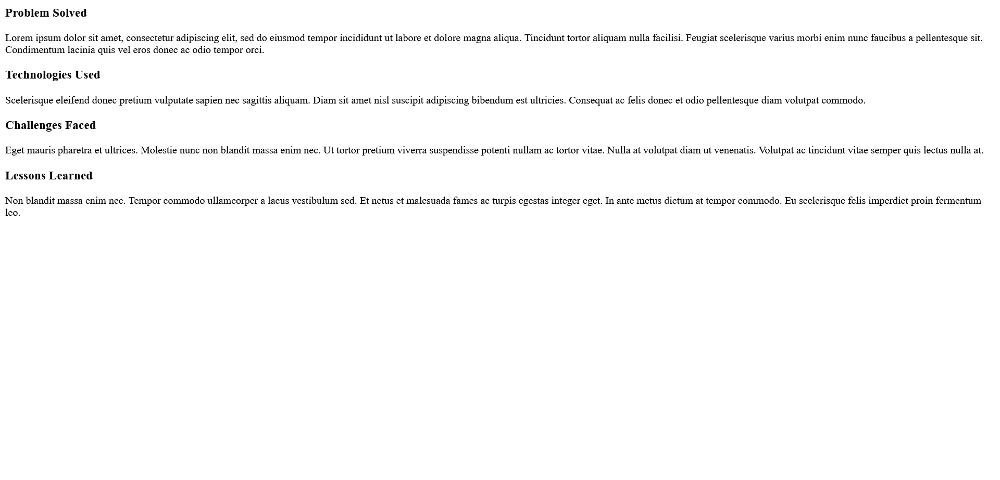

sourdough-sensei page without layout or frontmatter data

现在这些文件不是一个集合。集合通过共享一个`tags`值来定义，比如`“tags”: “projects”`。

每个带有`projects`标签的文件都将包含在`projects`集合中。

因为我们只有三个项目，所以我们可以在三个降价文件的开头包含一个`tags`值。

但是如果我们有一个有很多内容的网站——例如几十个博客帖子、录制的演讲和教程，它们之间都有几十个标签——这可能会变得难以管理。这就是目录数据文件有用的地方。

### 如何使用目录数据文件

如果文件夹中的每个文件共享某些值，可以将这些值放在目录数据文件中。

在`projects`目录中，创建一个`projects.json`文件。目录数据文件应该与其附加到的集合同名。

所有项目文件共享的任何 frontmatter 字段都应该放在`projects.json`目录数据文件中:

```
{
  "layout": "project.njk",
  "tags": "projects"
}
```

projects.json

`layout`值意味着每个项目都将使用相同的布局(我们稍后将创建这个`project.njk`文件)。`tags`值将它们转化为我们可以在模板中使用的`projects`集合。

## 如何在模板中使用集合

我们现在将使用`projects`集合来:

*   在我们的主页上添加一个项目部分
*   创建项目页面
*   为每个项目创建一个案例研究页面

要在站点的页面上包含集合中的数据，需要在模板中引用`collections`对象。

我们可以使用 Nunjucks 循环遍历集合并输出其内容。为了从`projects`集合中的`project`访问 frontmatter 值，我们使用了`project.data`。

例如:

```

{{ project.data.title }}
 
```

在`_includes`目录下，创建`project.njk`、`project-card.njk`和`project-grid.njk`文件。

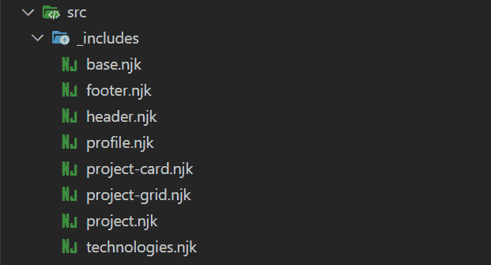

_includes directory structure

我们将使用`project.njk`为我们的每个项目创建一个页面。

由于这些页面是由模板生成的，所以我们可以直接访问它们的 frontmatter 值，比如 Markdown 文件主要内容的`title`、`image`、`imageAlt`和`content`。

```
---
layout: "base.njk"
---

<div class="project">
  <h2 class="project__heading">{{ title }}</h2>
  <div class="project__image-wrapper">
      
  </div>
  <div class="project__content prose">
    {{ content | safe }}
  </div>
</div>
```

project.njk

`project-grid.njk`和`project-card.njk`将在我们的投资组合主页和项目页面上形成项目列表。

`project-grid.njk`将遍历`projects`集合，并为集合中的每个项目插入一个`project-card`分部。

将以下内容添加到`project-grid.njk`:

```
<section class="projects">
  <h2 class="project__heading">Recent projects</h2>
  <div class="project-grid">
    
      
    
  </div>
</section>
```

project-grid.njk

将以下内容添加到`project-card.njk`:

```
<article class="project-card">
  <div class="project-card__image-wrapper">
    
  </div>
  <div class="project-card__body">
    <div class="project-card__tags">
      
        <span class="project-card__tag">{{ tag }}</span>
      
    </div>
    <h3 class="project-card__title">
      <a href="{{ project.url }}">{{ project.data.title }}</a>
    </h3>
    <p class="project-card__summary">{{ project.data.summary }}</p>
    <a class="project-card__link" href="{{ project.url }}">Read project case study 
      <svg  class="project-card__link-icon" viewBox="0 0 20 20" fill="currentColor">
        <path fill-rule="evenodd" d="M7.293 14.707a1 1 0 010-1.414L10.586 10 7.293 6.707a1 1 0 011.414-1.414l4 4a1 1 0 010 1.414l-4 4a1 1 0 01-1.414 0z" clip-rule="evenodd" />
      </svg>
    </a>
  </div>
</article>
```

project-card.njk

由于`project-card.njk`正在从一个集合的成员中访问 frontmatter 值，我们需要使用`project.data`来访问模板中的这些值。Eleventy 还生成一个`project.url`值，我们可以用它来链接到项目生成的页面。

在`index.njk`中，在个人资料和技术部分下面添加``。

```
---
title: "Eleventy Portfolio"
layout: "base.njk"
---




```

index.njk

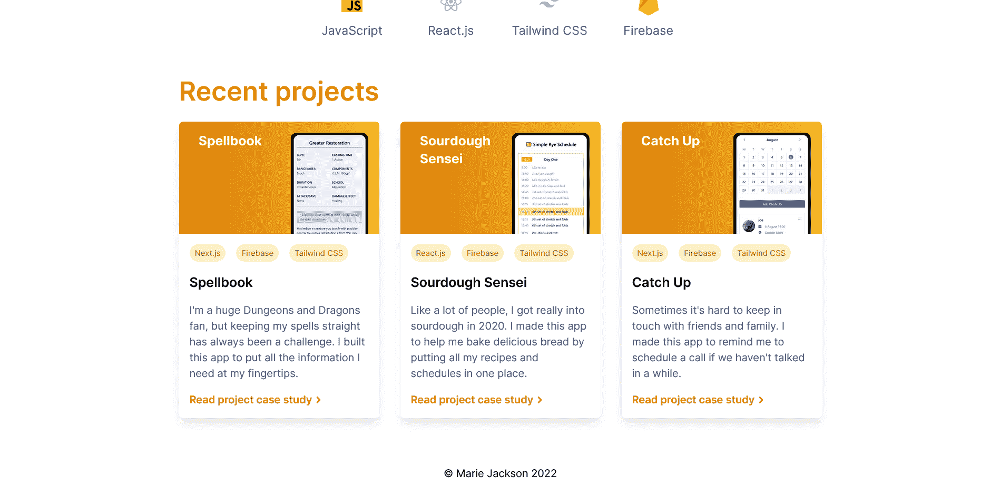

Grid of project cards on homepage

接下来，我们将创建一个项目页面。在`src`目录下，创建一个包含以下内容的`projects.njk`文件:

```
---
title: "Eleventy Portfolio"
layout: "base.njk"
---

<h2 class="projects__heading">Recent projects</h2>
<div class="project-list">
  
    
  
</div>
```

projects.njk

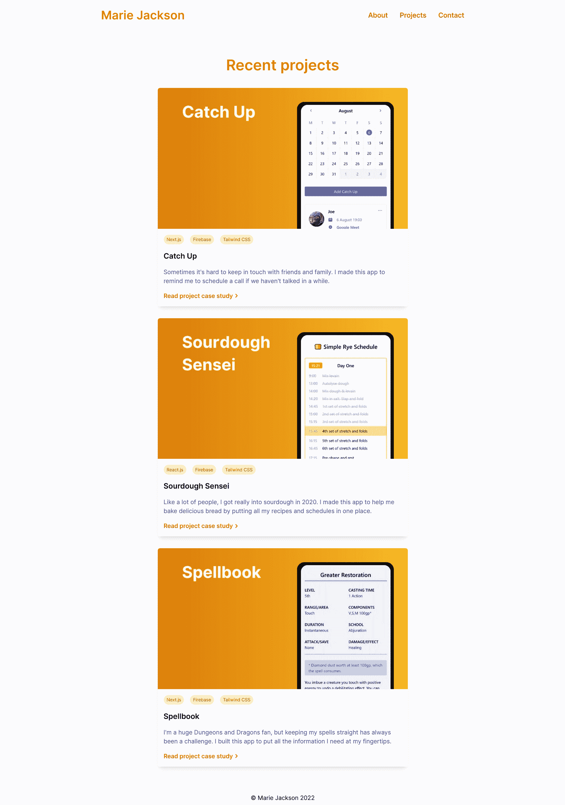

Projects page

这些项目现在显示在我们的主页和项目页面上，每个项目现在都有自己的案例研究页面。

我们可以就此打住，但是还有更多 11 个功能会让我们的投资组合网站变得更好，即**短代码**和**插件**。

### 如何使用短代码

简码是一种将可重用内容(通常是 JavaScript 字符串模板文字)注入模板的方式。

我们将创建一个简单的`year` shortcode 来输出当前年份，这样我们的 portfolio 站点中的页脚就总是最新的。

将下面一行添加到`.eleventy.js`中的配置功能。

```
eleventyConfig.addShortcode("year", () => `${new Date().getFullYear()}`);
```

当您在模板中使用短代码时，该函数将运行，并且`year`值将被注入到模板中。

在`footer.njk`中，使用``访问`year`短码。

```
<footer class="footer">
  <p>&copy; Marie Jackson </p>
</footer>
```

footer.njk

您可能需要重新启动开发服务器来识别短代码。

现在，无论何时你在未来启动你的网站建设，你的页脚都会显示正确的年份。

短码能做的远不止这些。接下来，我们将使用 Eleventy Image 插件，它使用短代码来优化我们网站的图像并提高页面加载速度。

### 如何使用十一图片插件

Eleventy 有许多官方插件，从检查你写的包容性语言到让你利用无服务器功能的其他插件。

图像插件特别有用，因为图像通常是你的网站加载的最大资源。它优化您的图像，使您的网站使用适合用户浏览器的大小和格式，为您的用户节省带宽，并使您的网站加载速度更快。

首先，我们需要从 npm 安装图像插件。在项目的根目录下，运行:

```
npm install @11ty/eleventy-img
```

在`.eleventy.js`的顶部，我们将导入图像插件并配置插件将用来优化我们的图像的短代码。

```
const Image = require("@11ty/eleventy-img");

async function imageShortcode(src, alt, sizes) {
  let metadata = await Image(`./src${src}`, {
    widths: [300, 800, null],
    formats: ["avif", "jpeg"],
    urlPath: "/images/",
    outputDir: "./public/images/"
  });

  let imageAttributes = {
    alt,
    sizes,
    loading: "lazy",
    decoding: "async"
  };

  return Image.generateHTML(metadata, imageAttributes);
}
```

.eleventy.js

图像短代码接受`src`、`alt`和`sizes`的参数。这些将是图像的 URL，图像的 alt 标签的文本，以及用于在不同屏幕尺寸上显示不同尺寸图像的尺寸。

属性指定插件将生成多大尺寸的图像。在这种情况下，300 像素、800 像素和图像的原始大小。

`formats`属性指定要生成的图像格式。在这里，我们使用 avif(以低文件大小生成高质量图像)和 jpeg 作为不支持 avif 的浏览器的后备。

`urlPath`和`outputDir`告诉插件从哪里获取图像，以及将优化后的图像输出到哪里。

该插件将`loading`和`decoding`属性添加到生成的 HTML 中，以延迟加载图像并异步解码，这两者都将有助于缩短页面加载时间。

接下来，我们将在配置函数中包含短代码。为了清楚起见，我们称它为`EleventyImage`。

```
eleventyConfig.addNunjucksAsyncShortcode("EleventyImage", imageShortcode);
```

.eleventy.js

注意，我们使用的是`addNunjucksAsyncShortcode`而不是`addShortcode`。这是因为图像生成过程是异步的。生成不同的图像大小和格式需要一些时间，我们希望我们的短代码等到这些都生成后，再将完成的 HTML 注入到模板中。

因为我们的短代码是异步的，所以在 Nunjucks for 循环中使用这个短代码会遇到一个问题。我们需要使用`asyncEach`，Nunjuck 的`for`的异步版本。

在`projects.njk`和`project-grid.njk`中，替换为:

```


 
```

projects.njk and project-grid.njk

有了这个:

```


 
```

projects.njk and project-grid.njk

现在，在`project.njk`中，我们可以替换它:

```

```

project.njk

有了这个:

```

```

project.njk

`image`、`imageAlt`和`"(min-width: 30em) 50vw, 100vw"`值是图像短码的`src`、`alt`和`sizes`参数。

接下来，在`project-card.njk`中，我们可以替换这个:

```

```

project-card.njk

有了这个:

```

```

project-card.njk

最后，在`profile.njk`中，我们可以替换它:

```

```

profile.njk

有了这个:

```

```

profile.njk

当我们的网站建立时，11 个图片插件将做几件事:

*   `public/images`中的每幅图像都有多种格式和尺寸
*   我们生成的 HTML 现在将使用`<picture>`元素
*   ``标签将具有`loading="lazy"`和`decode="async"`属性

现在，我们的网站将根据网站访问者的浏览器和屏幕大小提供最佳的图像格式和大小。并且当图像即将进入视口时，它们将被延迟加载。

如果我们在浏览器的开发工具中使用网络选项卡，我们可以测试这种差异。在 iPhone 12 上，我们的一个项目页面上未经优化的图像将是 30.37KB，而图像插件优化的图像只有 6.01KB，节省了 80%。


Unoptimized image on mobile - 30.37KB

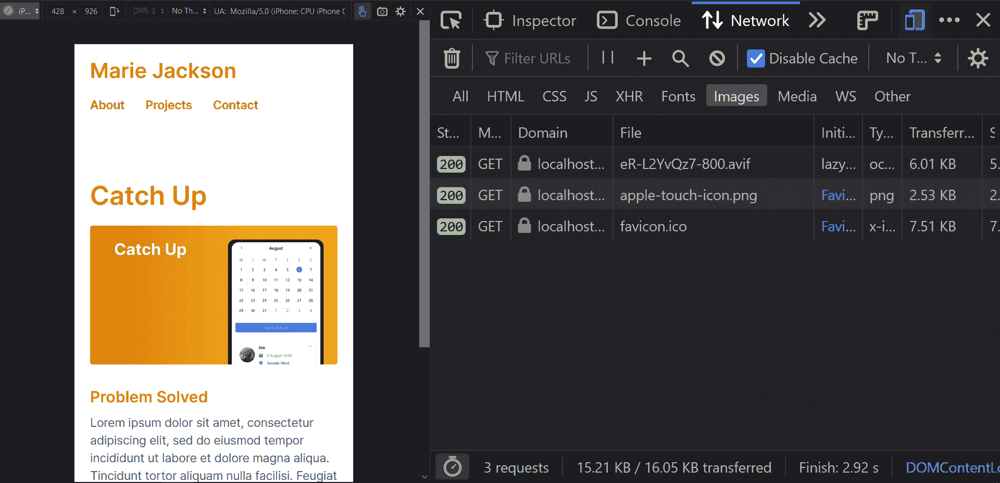

Optimized image on mobile 6.01KB

我们几乎准备好部署我们的网站。但在此之前，我们需要完成我们的联系表格。

## 如何用网络表单创建联系人表单


Contact page

Eleventy 是一个**静态**站点生成器。但是 Eleventy 与 Jamstack 体系结构配合得非常好，您可以预先静态地生成尽可能多的站点，并使用 API 和第三方服务来添加动态内容和功能。

在过去，如果你想在你的网站上有一个联系表单，你需要某种服务器，比如一个 PHP 应用程序，来处理表单提交。

我们将使用 Netlify 表单将联系人表单添加到我们的投资组合中，而无需管理服务器来处理提交的表单。

为了实现这一点，我们需要确保表单有两个属性。最重要的是`data-netlify="true"`。另一个是`action="/success"`。

```
<form class="form" name="contact" action="/success" method="POST" data-netlify="true">
  <div class="form__section">
    <label class="form__label" for="yourName">Name</label>
    <input class="form__input" name="name" type="text" id="yourName" required="true">
  </div>
  <div class="form__section">
    <label class="form__label" for="yourEmail">Email</label>
    <input class="form__input" name="email" type="email"  id="yourEmail" required="true">
  </div>
  <div class="form__section">
    <label class="form__label" for="message">Message</label>
    <textarea class="form__input" name="message" id="message" rows="4" required="true"></textarea>
  </div>
    <button class="form__button" type="submit">Let's talk</button>
</form>
```

contact.njk

通过在我们的联系表单上有一个`data-netlify="true"`属性，当站点被部署到 Netlify 时，Netlify 将识别这个属性并接管表单提交。

默认情况下，当某人完成一个 Netlify 表单时，他们将得到一个通用样式的成功消息，其中包含一个返回表单页面的链接。但是我们可以通过在表单中包含一个`action`属性来将它们定向到一个自定义页面。

`action="/success"`属性意味着当表单提交时，用户将被重定向到您站点上的一个“成功”页面(如果您愿意，您可以给这个页面取一个不同的名称)。所以我们最好现在就建立这个页面。

在`src`目录下，创建一个包含以下内容的`success.njk`文件:

```
---
title: "Eleventy Portfolio"
layout: "base.njk"
---

<div class="container text-center">
  <h2 class="heading--main">Thanks for getting in touch!</h2>
  <p>I'll respond as soon as I can.<p>
</div>
```

success.njk

一旦我们将网站部署到 Netlify，任何提交的表单都将显示在 Netlify 界面中。因此，让我们最后部署我们的投资组合网站。

## 如何部署到 Netlify

你可以在任何静态托管平台上部署一个 Eleventy 站点:Netlify，Vercel，GitHub Pages，甚至是 AWS S3 桶。

我将向您展示如何部署到 Netlify，因为我们使用 Netlify 表单作为联系人表单。在另一个托管平台上，您可以使用无服务器功能来处理提交表单和发送电子邮件。

如果您还没有 Netlify 帐户，请前往[netlify.com](https://www.netlify.com/)创建一个免费帐户。

Netlify 将为您提供以下选项:

1.  导入现有项目
2.  从模板开始
3.  手动部署

我们已经有我们的投资组合网站，所以我们不需要模板。

我将向您介绍另外两个选项。

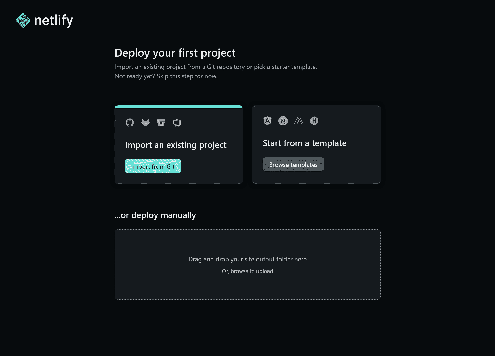

Netlify project start screen

### 选项 1–如何手动部署

如果你对 Git 和 GitHub 不太熟悉，Netlify 可以让你通过拖放将项目上传到它们的界面中。

在命令行上，运行`npm run build`或`eleventy`来构建你的站点。

现在把网站的`public`目录上传到 Netlify 的文件上传界面。过一会儿，Netlify 会把网站放到一个你可以访问的 URL 上。

如果您想对已部署的站点进行进一步的更改，请单击“部署”并向下滚动找到文件上传程序。

你可以在本地重建你的网站，并随时上传新版本的`public`文件夹到 Netlify。

### 选项 2——如何从 Git 导入项目

如果你熟悉 Git 和 GitHub，提交你的代码，推送到 GitHub。然后点击“从 Git 导入”按钮。

Netlify 会要求你连接一个 Git 提供者。选择 GitHub 并授权 Netlify 访问您的 GitHub 存储库。

选择存放您的投资组合站点的存储库。你可以搜索“十一”，或者你给它取的任何名字。

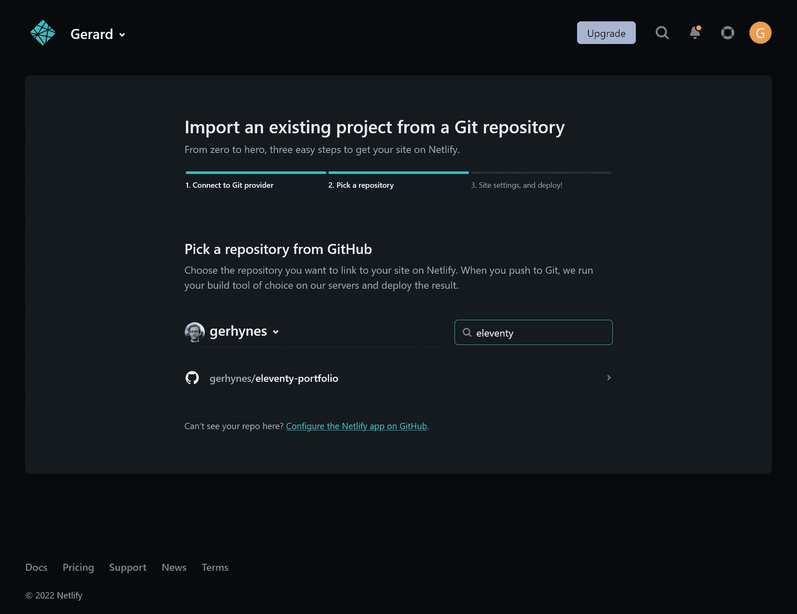

Netlify import project interface

Netlify 将检测到这是一个项目，并要求您确认基本的构建设置。

确保构建命令是`npm run build`或`eleventy`。

在“发布目录”下，输入`public`而不是`_site`。

现在单击“部署站点”按钮。

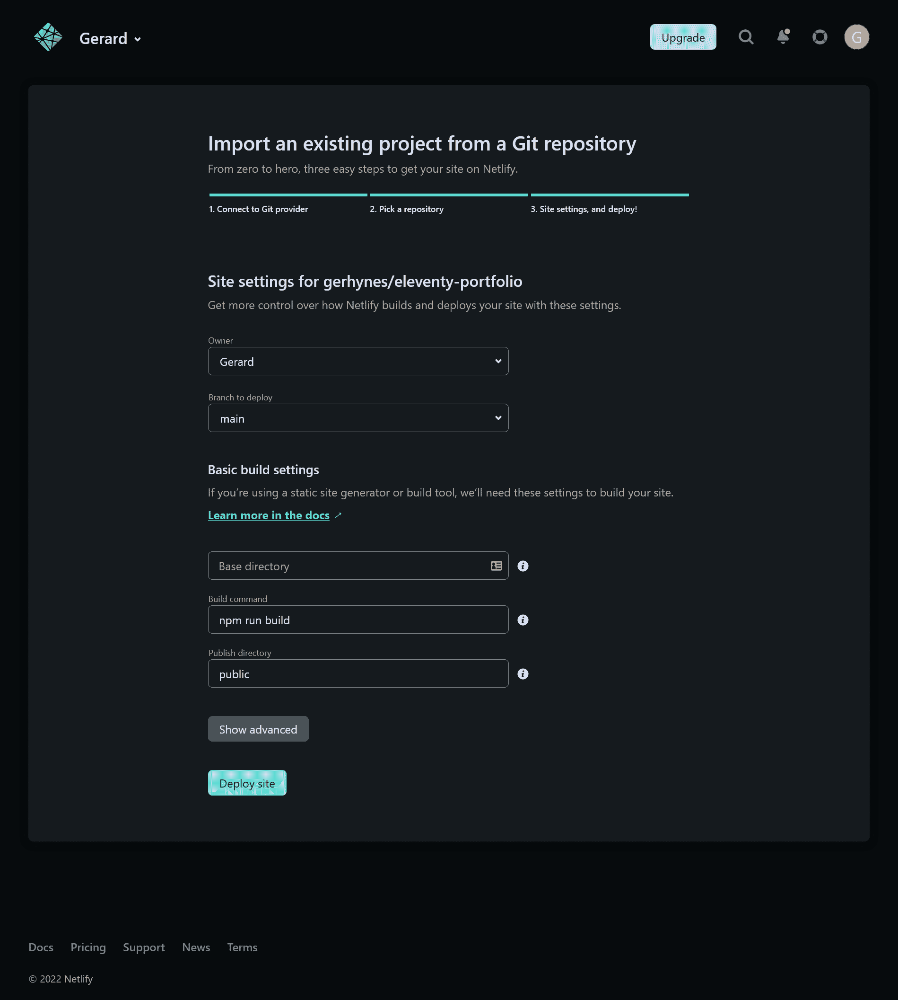

Netlify build settings page

过一会儿，Netlify 会告诉你你的网站已经上线，并给你一个网址。

一旦你的网站是活的，如果去联系页面，填写表格，并提交它。您将被重定向到您创建的自定义成功页面。

如果你点击 Netlify 界面中的“表单”,你将进入 Netlify 表单仪表板。

该表单将使用您在联系人表单的`name`属性中使用的任何名称，在本例中为“contact”。

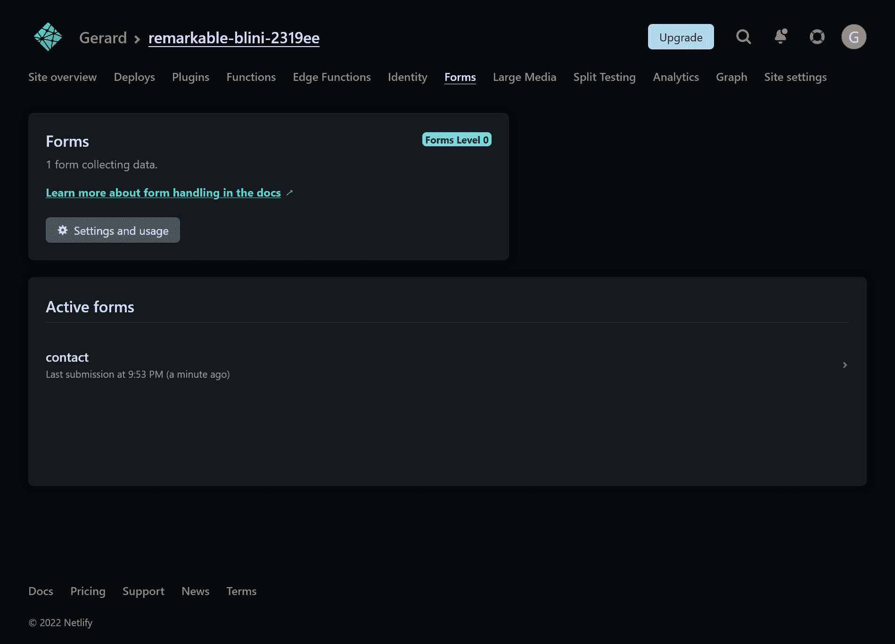

Netlify forms dashboard

恭喜你，你已经建立并部署了一个十一投资组合网站。🥳🎉🎉🎉

请随意使用这个项目作为您自己的投资组合的模板，并以您喜欢的任何方式定制它。如此多的投资组合看起来都很相似，所以当一个投资组合展示你的个性和激情总是好的。

## 从这里带它去哪里

本教程有望教会你 Eleventy 的基础知识，以及如何结合数据和模板来制作快速网站，而不需要大量的工具或配置。

如果你想继续你的十一月之旅，十一月文档非常好。关于操作数据，还有很多东西需要学习，更不用说添加个性化内容和使用无服务器和 Edge 功能的动态交互性了。

Stephanie Eckles 的《11ty . rocks》也是一个很好的资源，它提供了关于各种十一项功能的实用技巧和有用的教程。

我希望这篇指南对您有所帮助，并让您兴奋地学习更多关于 Eleventy、静态站点生成器和 Jamstack 的知识。