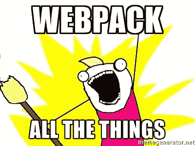

# 第五部分:类，传输 ES6 代码和更多资源！

> 原文：<https://www.freecodecamp.org/news/learn-es6-the-dope-way-part-v-classes-browser-compatibility-transpiling-es6-code-47f62267661/>

欢迎来到**学习 ES6 的第五部分**，这是一个帮助你轻松理解 ES6 (ECMAScript 6)的系列！

今天我们将探索 ES6 *类*，了解如何将我们的代码编译成 ES5 以实现浏览器兼容性，并了解一些有助于我们更深入了解 ES6 的优秀资源！冒险时间！❤


#### ES6 中的类别

**好处:**

*   一种更简单的处理 JavaScript 原型的方法——继承——它只是“语法糖”。
*   您仍然使用相同的面向对象继承模型。
*   类似于 Java、Python、Ruby、PHP 中的*类*语法。
*   省去了你很多打字的时间。

**小心:**

*   Use 只能通过 *new* 调用一个*类*，不能调用函数。
*   使用 *super()* 调用父类的*构造函数*。
*   一个*类*看起来像一个对象，但行为像一个函数——因为它是一个函数。
*   *类*声明不像函数声明那样被提升。
*   给一个*类*表达式起的名字只对*类*体是局部的。
*   如果类包含不止一次出现的*构造函数*方法，将抛出 *SyntaxError* 。
*   虽然对象文字的成员由逗号分隔，但逗号在*类*中是非法的——这强调了它们之间的区别。分号只允许用于将来的语法(可能是 ES7)，这可能包括用分号取消的属性。
*   在*的派生类*(稍后解释)中，必须先调用*【super()】*，然后才能使用*这个*关键字。否则会导致 *ReferenceError* 。
*   *静态*属性是*类*本身的属性。因此，虽然可以通过直接调用*类*的名称来继承和访问它们，但是如果您调用*类*(并将其存储在一个变量中)的实例，您将无法使用该变量来访问它。

#### 创建一个类

那么我们如何创建一个*类*？让我们首先回顾一下在 ES5 中如何在不使用*类*的情况下创建对象:

```
function Bunny(name, age, favoriteFood) {
  this.name = name;
  this.age = age;
  this.favoriteFood = favoriteFood;
}

Bunny.prototype.eatFavFood = function () {
  console.log('\"Mmmm! Those ' + this.favoriteFood + ' were delicious\", said ' + this.name + ', the ' + this.age + ' year old bunny.');
};

var newBunny = new Bunny('Brigadier Fluffkins', 3, 'Raspberry Leaves');
newBunny.eatFavFood();
// "Mmmm! Those Raspberry Leaves were delicious", said Brigadier Fluffkins, the 3 year old bunny. 
```

现在观察 ES6 *类*的相同情况:

```
class Bunny {
  constructor(name, age, favoriteFood){
    this.name = name;
    this.age = age;
    this.favoriteFood = favoriteFood;
  }

  eatFavFood() {
    console.log(`"Mmmm! Those ${this.favoriteFood} were delicious", said ${this.name} the ${this.age} year old bunny.`);
  };
}

let es6Bunny = new Bunny('Brigadier Fluffkins', 3, 'Raspberry Leaves');
es6Bunny.eatFavFood();
// "Mmmm! Those Raspberry Leaves were delicious", said Brigadier Fluffkins the 3 year old bunny. 
```

主要区别是什么？很明显，*类*语法看起来像一个对象，但是请记住，实际上它仍然是一个函数，并且行为也是如此。自己测试一下:

```
typeof Bunny
// function
```

另一个主要区别是你想存储的任何东西都必须在一个*构造函数*方法中。*类*的任何原型方法都应该在那个*类*之内，但在*构造函数*之外，不需要编写代码。*原型*’，和 ES6 中的函数语法一样。

#### 定义类的两种方式&原型继承

现在有两种定义*类*的主要方法——上面的例子是更常见的方法之一，一种*类*声明。虽然一个*类*确实是一个函数，并且函数声明被提升了——这意味着函数在声明之前无论是否被调用都可以被访问——但是你不能提升一个*类*声明。记住这一点很重要:

```
// Normal function declaration
// called before it is declared and it works.
callMe(); // Testing, Testing.

function callMe() {
  console.log("Testing, Testing.")
}

// This is called after, as we would do in a function expression,
// and it works too!
callMe() // Testing, Testing.

// But with classes...You can't create an instance of a class 
// before creating it:
let es6Bunny = new Bunny('Brigadier Fluffkins', 3, 'Raspberry Leaves');
es6Bunny.eatFavFood();

class Bunny {
  constructor(name, age, favoriteFood){
    this.name = name;
    this.age = age;
    this.favoriteFood = favoriteFood;
  }

  eatFavFood() {
    console.log(`"Mmmm! Those ${this.favoriteFood} were delicious", said ${this.name} the ${this.age} year old bunny.`);
  };
}

// Instead we get this: Uncaught ReferenceError: Bunny is not defined
```

这种限制的原因是*类*可以有一个*扩展*子句——用于继承——其值可以在以后指定，或者甚至可以取决于输入的值或计算。由于表达式有时可能需要另一次计算，因此在计算完所有值之前不提升该计算是有意义的。不这样做可能会导致代码出错。

尽管如此，在函数中创建一个*类*的实例以备后用，并在定义了*类*后对其求值，这是可能的:

```
function createNewBunny() { new Bunny(); }
createNewBunny(); // ReferenceError

class Bunny {...etc}
createNewBunny(); // Works!
```

定义类的第二种方式是一个*类*表达式。与函数表达式一样，类*表达式*可以是命名的，也可以是匿名的。请注意，这些名字只对*类*体是本地的，不能在它之外访问:

```
// anonymous:
const Bunny = class {
  etc...
};
const BunnyBurgerKins = new Bunny();

// named
const Bunny = class SurferBunny {
  whatIsMyName() {
    return SurferBunny.name;
  }
};
const BunnyBurgerKins = new Bunny();

console.log(BunnyBurgerKins.whatIsMyName()); // SurferBunny
console.log(SurferBunny.name); // ReferenceError: SurferBunny is not defined
```

有两种类型的*类*:基类*类—* 或父类—和派生类*类—* 继承的子类。这里 *Bunny* 是基类，而 *BelgianHare* 是派生类，因为它有*扩展*子句。注意原型继承的语法对于*类*是多么简单:

```
class Bunny {
  constructor(name, age, favoriteFood){
    this.name = name;
    this.age = age;
    this.favoriteFood = favoriteFood;
  }

  eatFavFood() {
    console.log(`"Mmmm! That ${this.favoriteFood} was delicious", said ${this.name} the ${this.age} year old bunny.`);
  };
}

class BelgianHare extends Bunny {
  constructor(favDrink, favoriteFood, name, age) {
    super(name, age, favoriteFood);
    this.favDrink = favDrink;
  }

  drinkFavDrink() {
    console.log(`\"Thank you for the ${this.favDrink} and ${this.favoriteFood}!\", said ${this.name} the happy ${this.age} year old Belgian Hare bunny.`)
  }
}

let newBelgHare = new BelgianHare('Water', 'Grass', 'Donald', 5);
newBelgHare.drinkFavDrink();
// "Thank you for the Water and Grass!", said Donald the happy 5 year old Belgian Hare bunny.
newBelgHare.eatFavFood();
// "Mmmm! That Grass was delicious", said Donald the 5 year old bunny.
```

派生的*类*、*比利时兔*内部的 *super()* 函数，让我们可以访问基类*类*、 *Bunny* 中的*构造函数*，所以当我们从两个*类* ( *drinkFavDrink()* 中调用原型方法时，从派生的*类*和 *eatFavFood()*

#### 浏览器兼容性

到目前为止，并非所有浏览器都完全支持 ES6 的所有特性。同时，请访问以下网站，了解最新动态:

*   查看兼容性图表:[https://kangax.github.io/compat-table/es6/](https://kangax.github.io/compat-table/es6/)
*   手动输入任意 ES6 特性:[http://caniuse.com/#search=const](http://caniuse.com/#search=const)

#### 传输 ES6 代码

因为不是所有的浏览器都支持所有的 ES6 特性，你需要将你的 ES6 代码转换成编译器，比如 *Babel* 或者模块捆绑器，比如 *Webpack* 。

传输简单地说就是取出 ES6 代码并将其转换成 ES5，这样它就可以被所有浏览器读取——就像一种安全预防措施！

有许多传输工具，最受欢迎的也是支持最多 ES6 特性的工具:

*   *Babel.js*
*   *关闭*
*   *Traceur*

你可以使用其中的任何一个，但是在列出的三个中，我会推荐 *Babel* 用于较小的项目。请按照他们的简单步骤，通过 https://babeljs.io/的:*节点将*巴别塔*安装到您的项目中*



对于更大的项目，我推荐使用 *Webpack* 。 *Webpack* 为你做了很多复杂的事情，包括:传输代码、SAS 转换、依赖管理，甚至替换工具如 *Grunt* 、 *Gulp* 和 *Browserify* 。在这里的[上方已经有一个写在 Webpack 上的内容丰富的教程。](https://medium.com/@dabit3/beginner-s-guide-to-webpack-b1f1a3638460#.mu2kgudga)

#### 资源

查看这些资源，更深入地学习和探索 ES6:


Mozilla Developer Network (MDN)是学习所有 ES6 概念的极好工具，实际上是任何 JavaScript。例如，让我们了解更多关于*类*:[https://developer . Mozilla . org/en-US/docs/Web/JavaScript/Reference/Classes](https://developer.mozilla.org/en-US/docs/Web/JavaScript/Reference/Classes)

Babel.js 有一篇超级有用的文章将我们所有的 ES6 要点总结成一条:[https://babeljs.io/docs/learn-es2015/](https://babeljs.io/docs/learn-es2015/)

看这个家伙总是很有趣:[https://www.youtube.com/playlist?list = pl 0 zvegevsaehjpparlrqjetpnch 6 VW-sm](https://www.youtube.com/playlist?list=PL0zVEGEvSaeHJppaRLrqjeTPnCH6vw-sm)

查看这份详尽的 ES6 学习资源列表:[https://github.com/ericdouglas/ES6-Learning](https://github.com/ericdouglas/ES6-Learning)

还有很多很多。前进吧，我的孩子，探索你的互联网。

记住，不管你有多有经验，谷歌都是你的朋友。

恭喜你。你已经通过**学习了 ES6 的 Dope 方式**第五部分，现在你已经通过 ES6 *类*学会了使用原型继承的聪明方法，明白了*总是*传输你的代码是很重要的，因为不是所有的浏览器都支持 ES6 的所有*特性——要么通过 *Babel.js* 用于较小的项目，要么通过 *Webpack* 用于较大的项目。*

通过喜欢和追随来保持你的智慧更新。这是 **Learn ES6 The Dope Way** 系列的最后一课！恭喜，你成功了！！自我表扬你做得很好！！我真为你骄傲！耶！！！


**感谢阅读❤** 敬请关注更多正在进行的 JavaScript 课程！

**第一部分:const、let &有**

**[第二部分:(箭头)= >功能和](https://www.freecodecamp.org/news/learn-es6-the-dope-way-part-ii-arrow-functions-and-the-this-keyword-381ac7a32881/)关键字**

**[第三部分:模板文字，传播操作符&生成器！](https://www.freecodecamp.org/news/learn-es6-the-dope-way-part-iii-template-literals-spread-operators-generators-592765337294/)**

第四部分:默认参数、析构赋值和一个新的 ES6 方法！

**[第五部分:类，翻译 ES6 代码&更多资源！](https://www.freecodecamp.org/news/learn-es6-the-dope-way-part-v-classes-browser-compatibility-transpiling-es6-code-47f62267661/)**

你也可以在 https://github.com/Mashadim 的 github ❤网站上找到我