# 通过构建 5 个响应式布局来学习 CSS Flexbox

> 原文：<https://www.freecodecamp.org/news/learn-flexbox-build-5-layouts/>

这里有一个实用的指南，通过构建 5 个响应式布局，帮助你在 2021 年学习 CSS Flexbox。让我们开始吧。🥇

## 目录

*   [柔性盒架构](#youtube)
*   [设置](#setup)
*   [一级](#level-1)
*   [二级](#level-2)
*   [三级](#level-3)
*   [四级](#level-4)
*   [5 级](#level-5)
*   [结论](#conclusion)

### 你可以在这里 查看 Figma 设计

### 你也可以在我的 YouTube 频道上观看这个教程:

[https://www.youtube.com/embed/m8BSEUUB5so?feature=oembed](https://www.youtube.com/embed/m8BSEUUB5so?feature=oembed)

## 什么是 Flexbox？

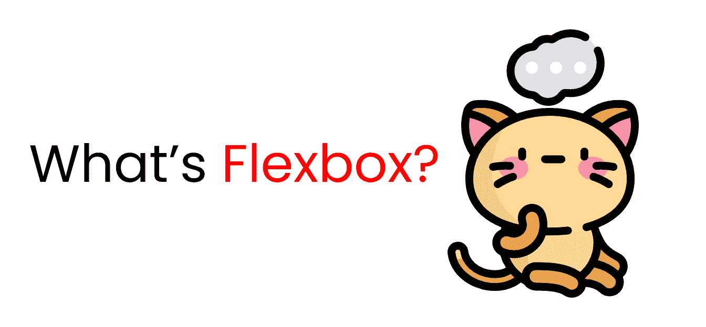

建造房子时，我们需要一份蓝图。同样，我们需要一个蓝图来在我们的浏览器中布局我们的 T2 内容。同时，我们需要为**各种屏幕尺寸制作**响应式布局**。**

这就是 **Flexbox** 帮助我们做的——创建响应性布局。

# Flexbox 架构

那么 Flexbox 架构是如何工作的呢？**伸缩项**【内容】沿**主轴**和**横轴分布。**并且，根据 **flex-direction** 属性，布局位置在行和列之间变化。

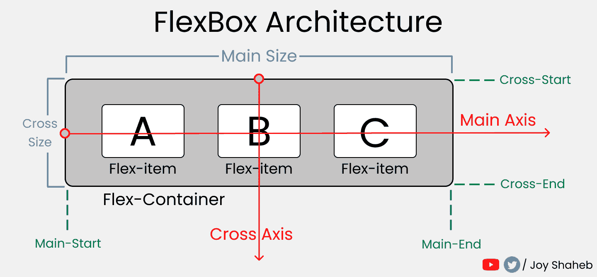

# Flexbox 图表

该图表包含使用 flexbox 时可以使用的所有可能的属性和值。你可以在做项目和尝试不同的值时参考它。

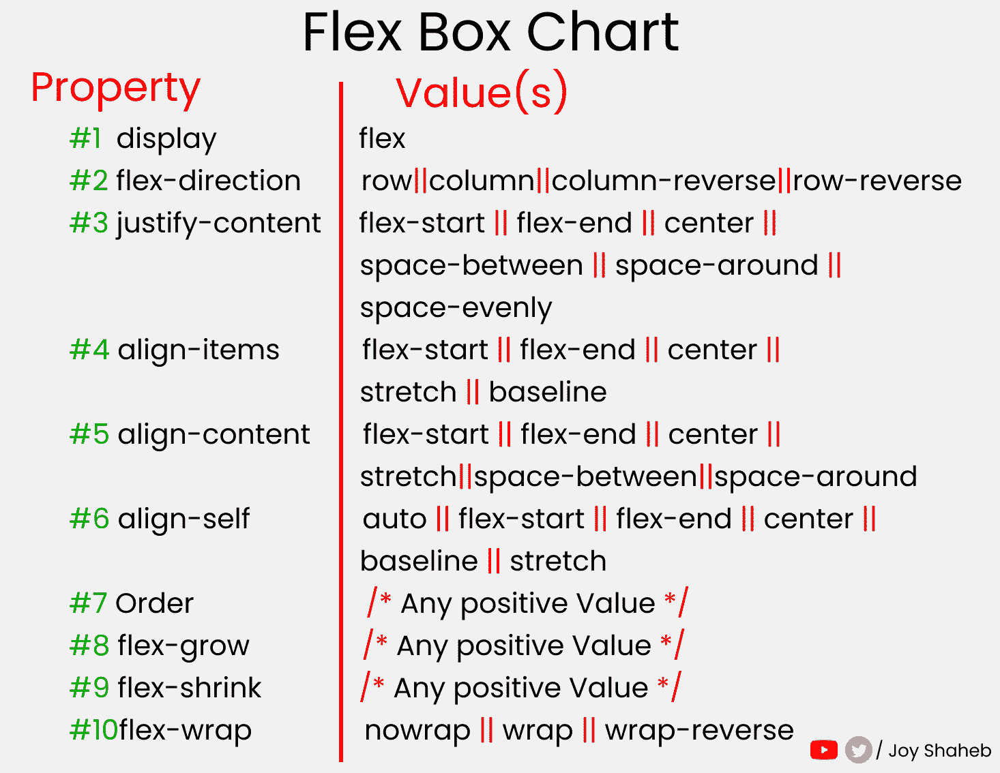

## 在开始之前...

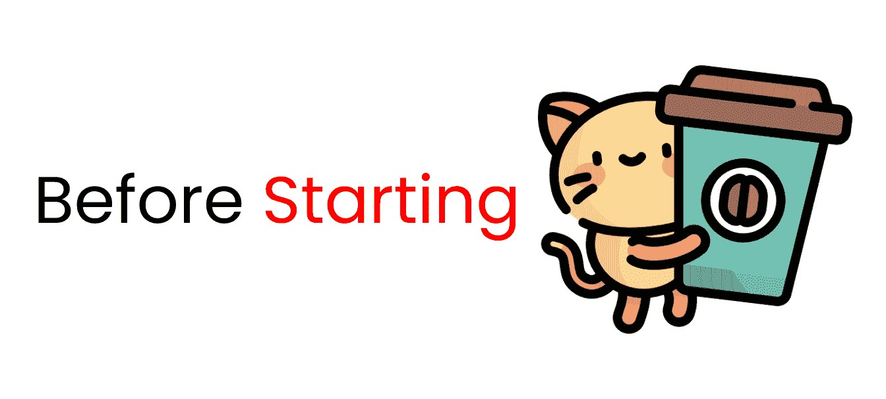

你需要了解一点 HTML 和 **CSS** 。在本教程中，您将了解 Flexbox 如何工作，它的各种属性和值如何工作，以及媒体查询如何工作(这有助于我们创建响应性网站)。

# 项目设置

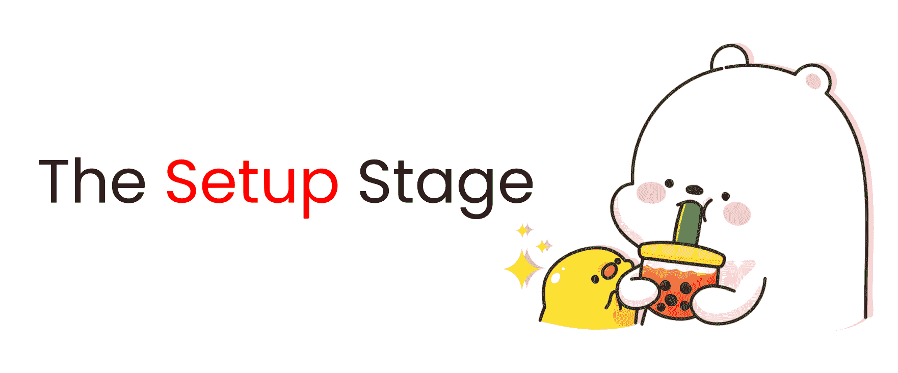

在编码之前，我们需要在变量中保存一些值，并清除默认的浏览器样式。与此同时，我们将定义一些媒体查询混合以节省时间并避免代码重复。

## SCSS

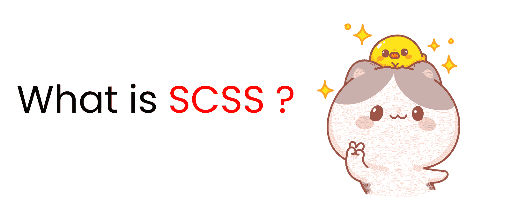

SCSS 是 CSS 的预处理器，它给了我们比普通 CSS 更多的功能。

例如，我们可以在父类中嵌套子类，在变量中存储值，等等。它真的帮助我们节省时间。

让我们开始和 SCSS 玩吧。打开  或任何代码编辑器，和我一起一步一步地完成这些。👇

### 如何在 Codepen 中启用 SCSS👇

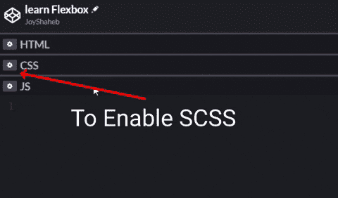

首先，在变量中定义边框颜色、间距和填充值。

```
$gap : 4vh;
$padding : 4vh;
$color : #48CAE4;
```

接下来，在 SCSS 地图中定义各种屏幕断点。**记住，**在我们的 SCSS 地图上，【手机、平板、桌面】是**键**，像素是**值**。

```
$bp : (
  mobile : 480px,
  tablet : 768px,
  desktop : 1440px,
);
```

为了节省时间和代码，在定义媒体查询时，我们将使用 **mixins 并循环**我们上面定义的断点。👆

```
@mixin query($display){
  @each $key, $value in $bp{

    //  defining max-width
    @if ($display == $key){
      @media (max-width: $value){@content;}
    }
  }
}
```

现在我们必须**改变我们浏览器**的默认样式。我们删除空白和填充，并将框的大小设置为 border-box。

```
//Changing The Default Settings..

*{
  margin:0px;
  padding: 0px;
  box-sizing: border-box;

// Changing the body here

  body{
    width: 100%;
    min-height: 100vh;
    font-family: sans-serif;
    font-size: 45px;
  }
} 
```

让我们来谈谈我们将要使用的 HTML 类之间的关系。永远记住 Flexbox 是在子类上工作的。

例如，定义在**容器类**上的 Flexbox 属性作用于**块**，定义在**块类**上的属性作用于**盒类**。下面是我的意思的图解解释:👇


现在让我们创建这些布局。我们将从较容易的难度开始，然后进入更高级的布局。

# 布局难度等级 1-如何构建卡片布局

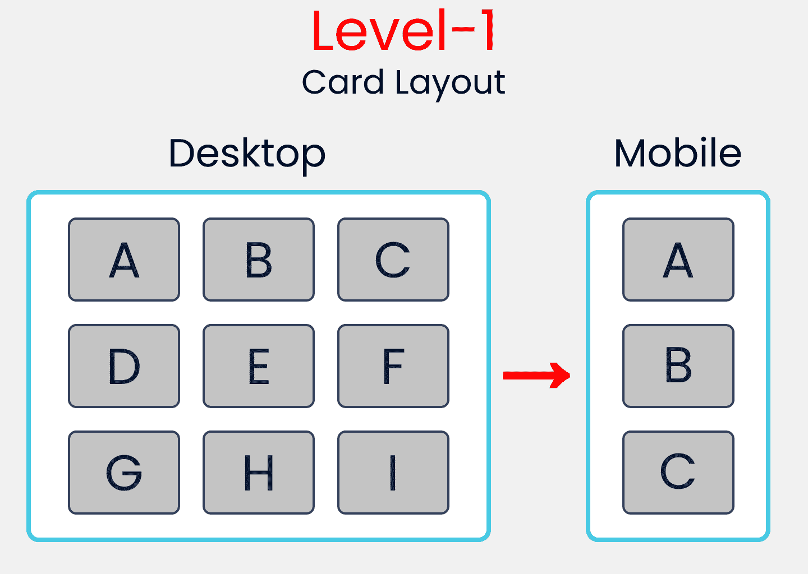

### 超文本标记语言

容器类将容纳 3 个子容器- > block-1、block-2 和 block-3。

**block-1** 级将携带 3 个箱子- >箱子-1、箱子-2 和箱子-3。

相同的规则适用于 **block-2 和 block-3** 类，但是值将会改变。

```
<div class="container">

<!--block-1 has 3 children, box-1,box-2,box-3 -->

  <div class="block-1">
    <div class="box-1"> A </div>
    <div class="box-2"> B </div>
    <div class="box-3"> C </div>
  </div>

<!--similar to block-1, values are changed -->

  <div class="block-2">
    <div class="box-4"> D </div>
    <div class="box-5"> E </div>
    <div class="box-6"> F </div>
  </div>

<!--similar to block-1, values are changed -->

  <div class="block-3">
    <div class="box-7"> G </div>
    <div class="box-8"> H </div>
    <div class="box-9"> I </div>
  </div>
</div> 
```

### SCSS

现在，我们要设计容器类的样式。记住，要触发 Flexbox 并访问它的所有能力，你需要这样写**`display: flex;`【T2:**

```
`// Style rules for container class

.container{
  display: flex;

//to lay .block-* classes in a column
  flex-direction: column;

//Setting gap between the .block-* classes
  gap: $gap;

// to set some padding & border inside
  padding: $padding;
  border: 1vh solid $color;
}`
```

**选择所有的 **`.block-*`** 类并将它们一起样式化。同时，在底部，我们将使用我们在设置阶段创建的 **mixin** 来定义我们的媒体查询。**

```
`[class ^="block-"]{

//To lay the boxes in a row.
  display: flex;
  flex-direction: row;

//Removing border(1vh+1vh), gap, & padding from the height
// And then equally distributing spaces between the 
// .block-* classes by dividing it by 3

  height: (100vh-2vh -$gap*2-$padding*2) / 3;

// putting gap between .box-* classes
  gap: $gap;

// Style rules for mobile display

  @include query (mobile){
    flex-direction: column;

// you can pick any value you wish.
    height: 500px;
  }

}`
```

**好吧，接下来选择所有的 **`.box-*`类**，并像这样将它们组合在一起:**

```
`[class ^="box-"]{

// To set the text at center of every box
  display: flex;
  justify-content: center;
  align-items: center;

// To divide spaces among the boxes
// try flex-gap:1; you can see the difference.
// flex-grow: 1; // 1+1+1 =3 => 1/3 X 100% => 33.33% each

  flex-basis: (100%)/3; // 33.33% each
  border : 2px solid black;
  border-radius: 10px;
  background-color: #c1c1c1;
}` 
```

# **布局难度等级 2–如何构建导航栏布局**

**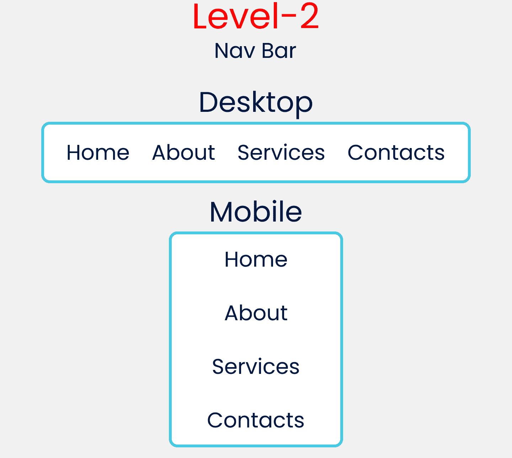**

### **超文本标记语言**

**移除级别 1 的 HTML 代码，并改为编写以下代码。基本上是 1 个父类和 4 个子类。**

```
`<div class="container">
  <div class="item-1"> Home </div>
  <div class="item-2"> About </div>
  <div class="item-3"> Services </div>
  <div class="item-4"> Contact </div>
</div>` 
```

### **SCSS**

**下面是第二级容器类的样式规则。在底部，我们将使用 mixin 设置一个媒体查询。**

```
`.container{
  font-size: 35px;
  display: flex;

//To set orientation of the items
  flex-direction: row;

// To distribute available space
  justify-content: space-evenly;
  padding: $padding;
  border : 1vh solid $color;

// style rules starts from Tablet Screens
  @include query(tablet){
    height : 100vh;
//Changing orientation of the items
    flex-direction: column;
    align-items: center;

//Setting gap for items Vertically
    gap: $gap 
  }
}` 
```

# **布局难度等级 3-如何构建侧边栏布局**

**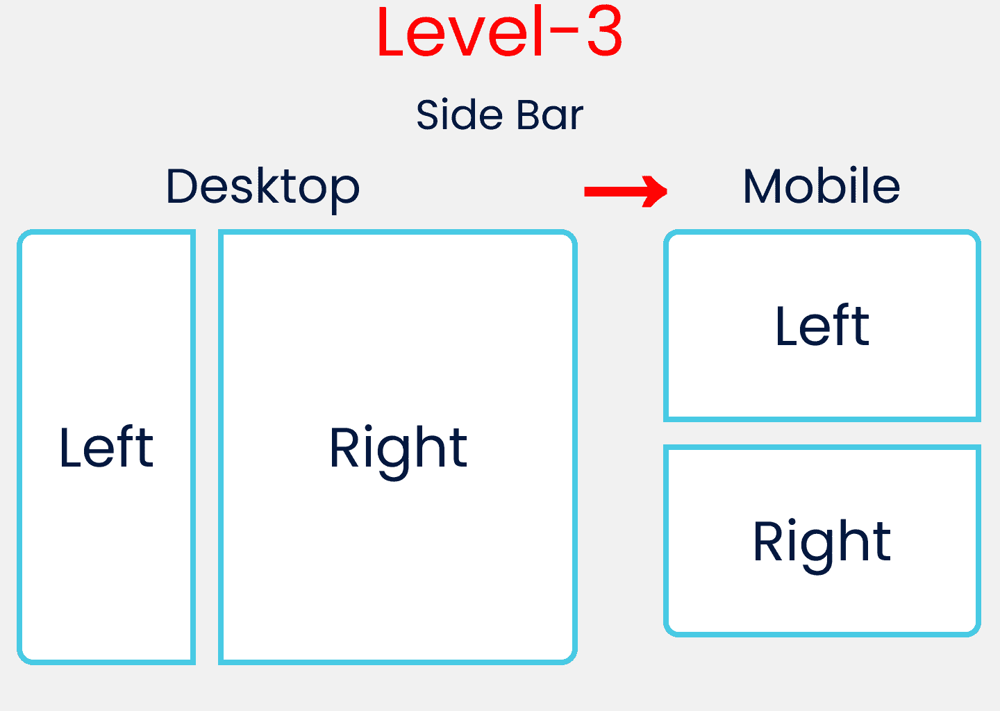**

### **超文本标记语言**

**现在，我们将使用这个代码块:**

```
`<div class="container">
  <div class="block-1"> Left </div>
  <div class="block-2"> Right </div>
</div>` 
```

### **SCSS**

**具有媒体查询 mixin 的**容器类**的样式规则包含在级别 3 的底部:**

```
`.container{
  display: flex;
  flex-direction: row;
  gap: $gap;
  padding: $padding;

// Style Rules for Mobile Display

  @include query(mobile){
    flex-direction: column;
  }
}`
```

**这里，我们选择并样式化所有的 **`.block-*`类**以及用于移动显示的媒体查询:**

```
`[class ^="block-"]{

//To put the left, right text at center
  display: flex;
  justify-content: center;
  align-items: center;

  border : 4px solid $color;
//Setting height of each block
  height: 100vh -$padding*2;

// Style Rules for Mobile Display
  @include query(mobile){
    height: 50vh -$padding*2;
  }
}`
```

**现在，我们分别针对 block-1 和 block-2 类。我们还更改了 flex-grow 值，以便分配屏幕空间。**

```
`// Style Rules Left Block

.block-1{
//will occupy 20% of the Available width
  flex-grow: 2;
}

// Style Rules Right Block

.block-2{
//will occupy 80% of the Available width
  flex-grow: 8;
}` 
```

### **休息一下:D**

**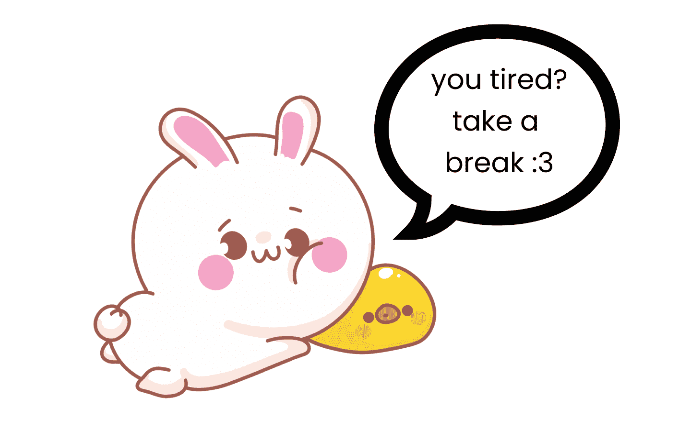**

# **布局难度级别-4–如何构建卡片布局#2**

**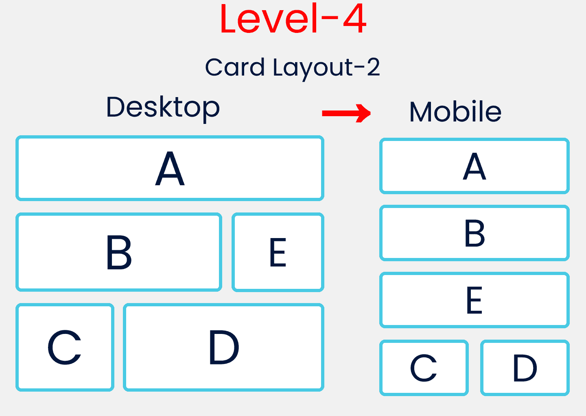**

### **超文本标记语言**

**这里的 HTML 规则类似于级别 1，但有一些变化:**

```
`<div class="container">

  <div class="block-1">
    <div class="box-1"> A </div>
  </div>

  <div class="block-2">
    <div class="box-2"> B </div>
    <div class="box-3"> E </div>
  </div>

  <div class="block-3">
    <div class="box-4"> C </div>
    <div class="box-5"> D </div>
  </div>

</div>
</div>` 
```

### **SCSS**

**如下所示设置容器类的样式:**

```
`.container {
  display: flex;
  flex-direction: column;
  padding: $padding;
  gap: $gap;
}`
```

**接下来，选择并样式化所有的 **`block-*`类**以及移动设备底部的媒体查询 mixin:**

```
`[class ^="block-"]{
  display: flex;
  flex-direction: row;
  gap: $gap;

// Removing Padding, Gap & divide by 3
  height: (100vh -$gap*2 -$padding*2)/3;

// Style Rules for Mobile Version  
  @include query(mobile){
    flex-direction: column;
  }
}`
```

**现在选择所有的 **`box-*`类**并一起设置样式:**

```
`[class ^="box-"]{

// To place the letter at center
  display: flex;
  justify-content: center;
  align-items: center;

// Border, Border-radius & background-color
  border : 1vh solid $color;
  border-radius: 10px;
  background-color: #c1c1c1;
}`
```

**现在，我们将分别定位盒子，并使用 flex-basis 来分配屏幕空间。**

```
`//A
.box-1{
  flex-basis: 100%;
}

//B & D
.box-2, .box-5{
  flex-basis: 70%;
}
//E  & C
.box-3,.box-4{
  flex-basis: 30%
}`
```

**最后，我们将包括移动版本的媒体查询 mixin。**

```
`// Style Rules for Mobile Version 

@include query(mobile){
  .block-2{
    height: (100vh*2)/3; // 66.66vh
  }
  .block-3{
    flex-direction: row;
  }

//   Selecting B, E, C, D
  .box-2,.box-3,.box-4,.box-5{
    flex-basis: 50%;
  }
}` 
```

### **你赢了吗？让我们打开暖气。🥵**

# **布局难度等级 5——布局中的圣杯**

**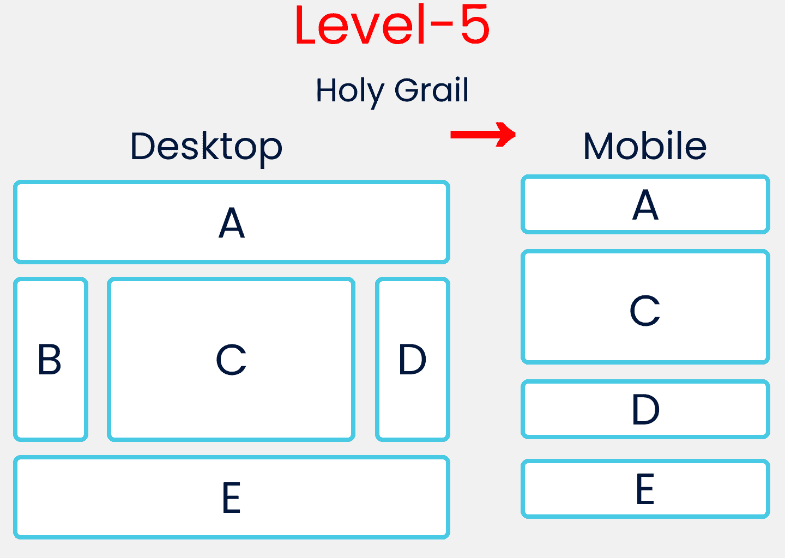**

### **超文本标记语言**

**这里的 HTML 规则类似于**1 级**和**4 级**，但有一些变化:**

```
`<div class="container">

  <div class="block-1">
    <div class="box-1"> A </div>
  </div>

  <div class="block-2">
    <div class="box-2"> B </div>
    <div class="box-3"> C </div>
    <div class="box-4"> D </div>
  </div>

  <div class="block-3">
    <div class="box-5"> E </div>
  </div>
</div>` 
```

### **SCSS**

**首先，像这样更改**容器类样式**:**

```
`.container{
  display: flex;
  flex-direction: column;
  gap: $gap;
  padding: $padding;
}`
```

**然后，目标和风格都 **`block-*`类**在一起。**

```
`// Style rules of all .block-*

[class ^="block-"]{
  display: flex;
  flex-direction: row;
  gap: $gap;
}`
```

**接下来，将目标和风格全部 **`box-*`类**放在一起。**

```
`// Style rules of all .box-*

[class ^="box-"]{
  display: flex;
  justify-content: center;
  align-items: center;
  border : 1vh solid $color;
  border-radius: 10px;
}`
```

**然后单独瞄准盒子，并使用 flex-basis 分配屏幕空间。**

```
`// Defining A & E Together
.box-1,.box-5{
  flex-basis: 100%;
  height: 20vh;
}

// Defining C here
.box-3{
  flex-basis: 60%;
//   Removing Gap & padding
  height: 60vh -$gap*2-$padding*2;
}

// Defining B & D Together
.box-2,.box-4{
  flex-basis: 20%;
}`
```

**最后，包括移动版本的媒体查询 mixin。请注意，我们为移动版本隐藏了 box-2。**

```
`// Media query for mobile Screen

@include query(mobile){
  .block-2{
    flex-direction: column;
    height: 60vh;
  }
// Hiding our B block
  .box-2{
    display: none;
  }
// Increasing Height of C  
  .box-3{
    flex-basis: 80%;
  }
}`
```

## **结论**

**感谢您的关注！希望现在你已经理解了 Flexbox 的基础知识。这是你阅读到最后的奖章。❤️**

**非常感谢您的建议和批评，❤️。如果您有任何问题，请通过下面的社交媒体链接与我联系。**

****

## **图像制作者名单**

**[Kitty 头像](https://www.flaticon.com/packs/kitty-avatars-3)
[Kitty 带鸭子](https://www.freepik.com/free-vector/cute-cats-set-funny-character-cartoon-illustration_12566246.htm#page=3&position=2)
[可爱兔子](https://www.freepik.com/free-vector/set-cute-rabbit-with-duck-cartoon-illustration_12573651.htm#page=3&position=41)
[可爱小熊](https://www.freepik.com/free-vector/cute-bear-character-cartoon-illustration_12341164.htm#page=1&position=40#&position=40)**

 **[更多版面设计在此](https://csslayout.io/patterns/)

**YouTube[/Joy Shaheb](https://www.youtube.com/c/joyshaheb)**

**推特[/JoyShaheb](https://twitter.com/JoyShaheb)**

**insta gram[/JoyShaheb](https://www.instagram.com/joyshaheb/)****