# 向圣诞老人和他的精灵学习谷歌分析

> 原文：<https://www.freecodecamp.org/news/learn-google-analytics-from-santa-and-his-elves-59ea82fbd99a/>

克里斯蒂安·彼得·汉姆巴赫

# 向圣诞老人和他的精灵学习谷歌分析

Santa studying data ([Image credit](http://www.pexels.com))

假期到了！是时候去喝点蛋奶酒，在火炉旁放松一下，为你塞进 2016 年的所有代码干杯了。

但是等等！在你陷入碳水化合物引起的冬眠之前，让我告诉你一个正在席卷北极的项目。

有传言说圣诞老人利用暑假阅读数据和分析。你不会认为他的全球分销帝国纯粹是靠魔法运作的吧？

一些精通技术的精灵们正在为圣诞老人设置谷歌分析，以满足这个重要夜晚的需要。

你看，圣诞老人，他的小精灵，和各地的孩子们都有一个秘密的共享网站，他们都用来注册和审查愿望。我发誓不透露实际的网址，所以我们就叫它 www.wish.io。

在该网站上，儿童可以:

1.  了解 wish.io 的优势
2.  有机会注册成为好孩子
3.  选择他们希望收到的礼物
4.  回顾他们的选择
5.  提交他们的愿望

正如你所想象的，圣诞老人和精灵们可以从谷歌分析中学到很多关于他们如何进一步改善 wish.io 的东西。下面是他们如何将它付诸实践。

### 为圣诞老人设置谷歌分析

为了跟踪圣诞老人的秘密页面，精灵们需要一个谷歌分析跟踪代码。这是一个 Javascript 代码片段(也经常被称为“像素”或“跟踪片段”)，你可以在[注册](https://www.google.com/analytics/analytics/)谷歌分析后获得。

您可以设置多达 100 个**账户**，这些账户都可以包含多个**属性**。这些属性又可以包含多个**视图**。起初这看起来很混乱(特别是如果你是一个精灵)，但是如果一步一步地解决，这并不是那么糟糕。

精灵将在谷歌分析的管理区完成这一任务。让我们来看看。

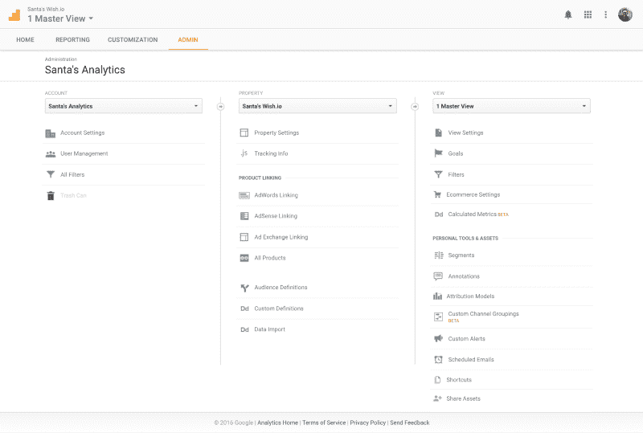

A screenshot of the Admin area of Google Analytics

帐户属性描述网站、移动应用程序或其他系统，每个都由一个跟踪代码和唯一的 ID(称为 UA 代码)表示。这里可以设置属性“圣诞老人的愿望. io”。如果圣诞老人后来决定建立子域或独立但相关的页面，如圣诞老人的 naughtylist.io，他可以在这里设置一个额外的属性，以避免混合好孩子和淘气孩子的数据。

您可以为每个级别定义您的用户管理，但权限是按细节继承的(帐户>属性>视图)。

精灵必须仔细考虑谁应该能够看到和修改什么。只需要一个不知道自己在做什么的绿色小用户就能弄乱设置和数据。

所以圣诞老人确保所有的精灵在添加用户之前阅读了谷歌分析许可指南。

Google Analytics 提供了几个视图，精灵们可以将它们用于各种目的。

首先，他们可以应用**过滤器**。这很有用，因为精灵产生了大量需要移除的内部流量，因此圣诞老人可以专注于来自访问该网站的儿童的会话数据。

其次，精灵可以在视图级别定义**目标**和**分段**，这样每个团队都可以访问他们最感兴趣的数据。毕竟，物流精灵想要的是不同于前端精灵的信息。

您可以在这里配置更多内容，例如自动报告和自定义计算指标。但那是明年夏天的工作。

### Elf 设置视图的最佳实践

接下来，小精灵们要设置三个标准视图:www wish.io (Master)、www wish.io (Test)、www wish.io (Raw)。

由于谷歌分析的运作方式，这三个视图是必不可少的:它在数据收集和数据处理的步骤之间应用过滤器。

这意味着如果精灵有一个错误的过滤器，他们的数据将会消失。因此，他们需要建立一个原始视图，并且永远不要接触它，以便在紧急情况下有一个后备方案。每个精灵都知道测试视图是用来测试的，主视图是用来日复一日地工作的。

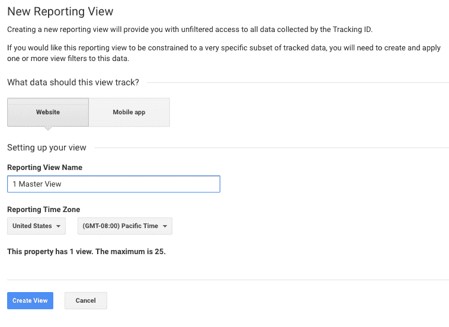

A screenshot of adding new view with Google Analytics

### 精灵是如何追踪孩子的

有了 Google Analytics 的后台，精灵们添加了 wish.io 的跟踪片段 e。

是的，这是对 [COPPA](https://en.wikipedia.org/wiki/Children's_Online_Privacy_Protection_Act) 的粗暴违反。但是圣诞老人不在乎我们的法律。见鬼，他甚至不关心物理定律。

他们在管理面板的属性部分找到跟踪代码，然后将其粘贴到他们网站的布局代码中。

精灵还采取了重要的一步，确保脚本正好位于`</he` ad >结束标签之前。通常，开发人员不希望这里有任何渲染阻塞脚本，但这是一个特殊的例外。谷歌分析脚本是异步的，最终小精灵们想要抓住所有的流量。他们不能冒险错过孩子的信息，他们可能会在所有脚本加载之前离开页面。

**跳出率**——追踪没有参与任何内容就退出页面的访问者比例——是一个重要的指标。它可能会向 QA 和前端精灵显示页面有问题。它还帮助营销精灵检查某个活动是否针对性很差。

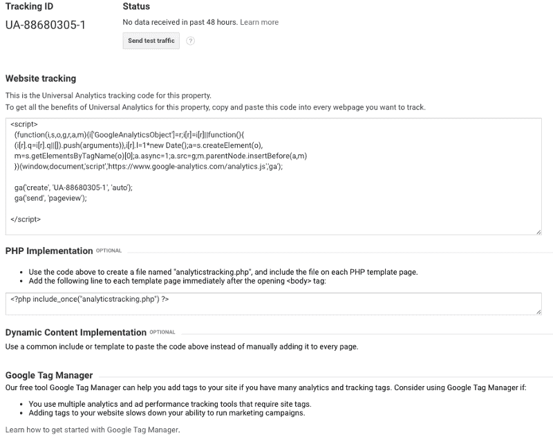

A screenshot of the Google Analytics tracking code section

### 导航谷歌分析

随着跟踪的集成，精灵们开始查看初始数据。尽管 Google Analytics 立即开始收集实时数据，但精灵们决定给它至少 24 小时的时间，以便它可以收集大量有意义的数据。

现在，精灵们必须熟悉谷歌分析，它的各种菜单和显示的数据。

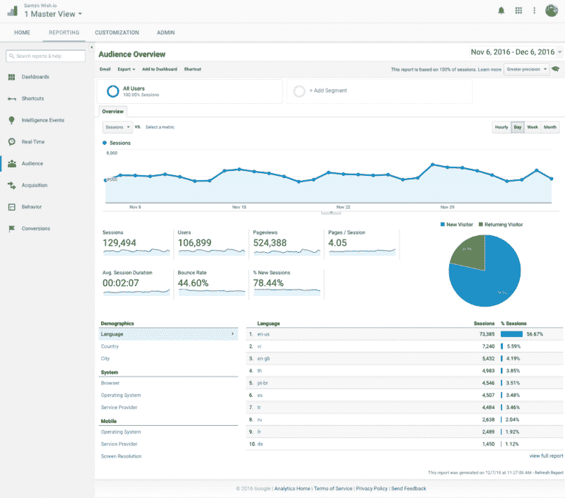

Screenshot: Google Analytics Reporting Overview (Wish.io renamed Demo Account)

左侧导航菜单显示了精灵可以用来查看网站数据的主要部分。最重要的元素是受众、获得、行为和转化。

此菜单也是实时和情报事件视图的主页。智能事件很快将不再存在于谷歌分析中，所以圣诞老人和精灵们决定不去打扰它。实时视图可以很好地显示在希望行动总部的平面屏幕上，并提高精灵们的士气。但有意义的决策需要更长远的眼光。

因此，精灵们回到谷歌分析的主要部分，看看它还提供什么工具。

### 受众概述

当精灵打开一个新的属性视图时，他们默认会看到观众概览。幸运的是，概览页面都是相似的，这使得精灵和人类的学习过程更加顺利。

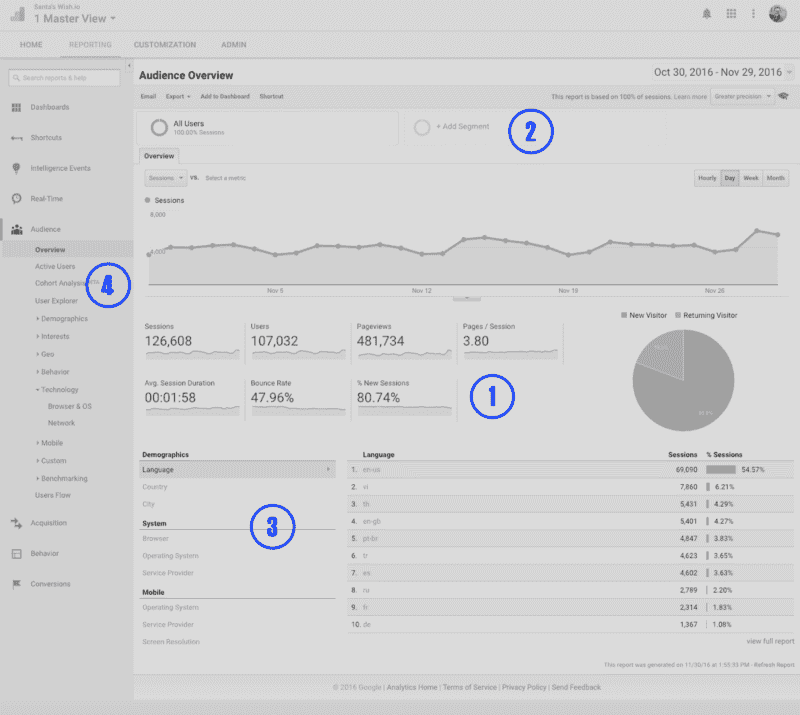

在标有“1”的区域(上图)，精灵们得到了关于他们的观众的最重要的信息。有多少用户访问了他们的页面，他们在页面上花了多长时间，以及每次会话他们看到的页面等等。所有这些都很好地呈现在图表中，所以精灵们可以发现峰值、低点和总体趋势。

查看注记(2)，您会发现可以分割这些概视图。这适用于分析中的所有主要部分。现在，圣诞老人可以看到孩子们在去年收到的手机上浏览 wish.io 的行为是否与其他用户不同。创建细分市场是一个高级的话题，但也是非常有益的。分段可以从数据中挖掘出上下文，否则这些数据只能以粗略的平均值表示。注意:您可以使用[谷歌的细分市场深度指南](https://support.google.com/analytics/topic/3123779?hl=en&ref_topic=6175347)或查看图库来导入流行的社区制作的细分市场。

在汇总值(3)下面，精灵可以快速访问每个类别提供的更详细的信息。例如，他们可以看到更多国家的人口统计数据，或者用户的技术背景。

左侧导航栏(4)的子类别中提供了更详细的信息。

详细的观众数据的一个方面加剧了精灵们整个夏天已经很热的辩论:互联网浏览器 wish.io 应该向后兼容哪个版本的大问题。

毫无疑问，你可以想象那次变得有多激烈。谢天谢地，谷歌分析已经用数据驱动的决策取代了争吵。只需使用左侧导航，查看:观众>技术>浏览器/操作系统，点击“Internet Explorer”查看版本详情。

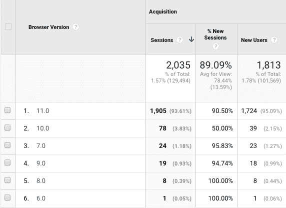

Screenshot: Internet Explorer Sessions and Visitors per Browser Version

幸运的是，谷歌分析记录了浏览器具体版本的细节。圣诞老人和小精灵们很高兴 95%的 Internet Explorer 访问者使用版本 11。他们还假设好孩子(当然是 wish.io 的主要受众)足够勤奋，要么定期更新 Internet Explorer，要么只是使用更好的浏览器。当然，对即将到来的 naughtylist.io 网站的访问者的浏览器份额需要单独评估。

精灵们可以在这里学到很多更好的东西。例如，谷歌可以显示孩子的性别和兴趣数据(在管理面板下的属性设置中激活——确保你遵守当地法律，不像圣诞老人)。它还允许他们更深入地研究采集数据，并根据访问者来自的不同渠道对观众行为进行基准测试。

### 获得物ˌ获得

要了解更多关于访问者从哪里来访问 wish.io 的信息，圣诞老人可以查看收购概述。

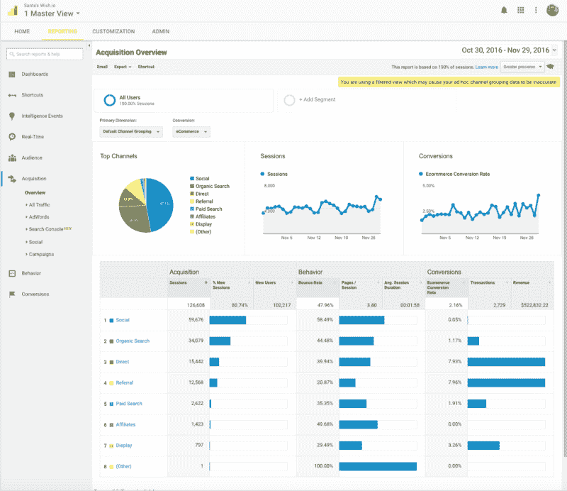

Screenshot: Acquisition View showing visitors by traffic source

这个观点关注的是流量的来源。

谷歌定义了九个主要渠道来收集这些信息:

**直接:**通常人们键入网址或使用书签。

**有机搜索:**人们使用谷歌或必应，点击一个有机搜索结果链接。

**推荐:**关注另一个网站或博客上的链接的人。

**社交:**访问者来自社交网站(点击“社交”链接查看列表)。

**电子邮件:**所有访问都直接来自电子邮件。

**付费搜索:**人们通过谷歌和合作伙伴网站上的付费链接访问页面。

**显示:**点击付费广告横幅的人。

**分支机构:**从推广 wish.io 的分支机构合作伙伴收到的流量

**其他:**分类为“特殊”的广告流量汇总例如，流量购买的成本每行动率。

理解这些分组是一组默认规则的结果是很重要的，这些规则规定了哪种媒体对哪种流量组起作用。

精灵可以出于社交或广告的目的编造链接——所谓的 UTM 链接——这些也在这些组中总结。这样他们可以判断一个广告或博客帖子有多成功。

为了方便起见，他们使用谷歌的链接构建工具。为了防止错误计数，他们需要了解[分组规则](https://support.google.com/analytics/answer/3297892?hl=en&ref_topic=3125765)，并正确设置‘UTM _ medium’。

一旦一切都启动并运行，精灵们可以发现许多关于他们频道的有趣细节。他们可以看到哪些社交渠道对 wish.io 贡献最大，或者哪些活动最成功。他们甚至可以优化他们的 AdWords 投资，并查看孩子们通常从各种来源到达的登录页面。

对圣诞老人来说，合乎逻辑的下一步是获得——并采取行动——更深入地了解访问者对他的网站的行为。

### 在 wish.io 上追踪孩子的行为

对于圣诞老人和他的精灵们来说，总是很难满足孩子们可能提出的数百万不同的愿望。因此，对他们来说，理解趋势、流行选择、常青树以及他们数百万页中的潜在错误是很重要的。

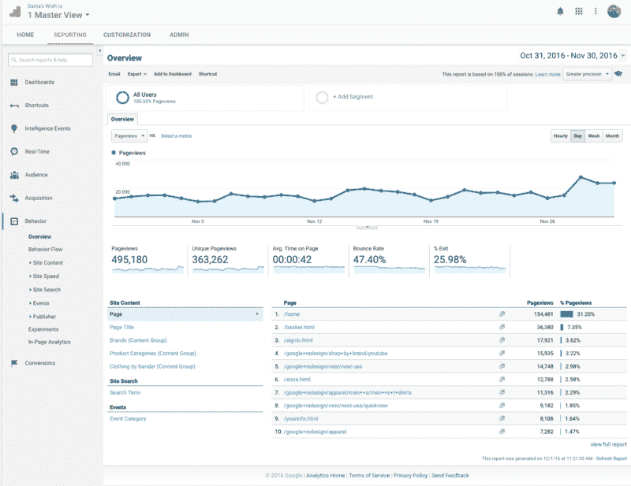

Screenshot: Behavior View showing visitors by page

每个 elf 部门都有自己感兴趣的信息。

前端和 QA 小精灵应该一直密切关注跳出率，页面平均停留时间，以及他们最重要页面的速度评分。

每个前端精灵都讨厌 wish.io 加载次数失控引发的冗长 SEO 会议。因此，探索网站速度子类别对他们很有帮助。谷歌提供了关于浏览器、国家和页面的深刻见解，以及如何改进的建议。

UX 精灵可以深入了解行为部分的优先页面。他们还可以查看人们进入圣诞老人页面的流程，他们的旅程，以及他们离开的地方。

但对他们来说，最令人兴奋的话题是构建内容实验。基本上，他们可以要求前端精灵构建同一页面的替代版本，然后根据可测量的目标自动测试这些版本。

例如，找到一个页面变体，让孩子们停留更长时间或以更快的速度提交愿望，这可能会很有趣。他们可以使用分析工具进行初步实验，该工具有一个简单的指南。对于高级用例，精灵可以通过[有据可查的 analytics.js API](https://developers.google.com/analytics/devguides/collection/analyticsjs/experiments) 进行内容实验。

最后，行为选项卡还提供事件跟踪，这是营销精灵*喜欢的*。每当孩子们发起一个不会触发新浏览量的重要动作时，事件可以被发送回谷歌分析。

例如，当孩子们点击下载按钮，提交他们的“我是个好孩子”表格，修改愿望，等等。事件是对分析 API 的直接函数调用。Elves 将它们添加到控制页面交互性的 Javascript 事件监听器和回调中。所有这些都在[谷歌的事件跟踪指南](https://developers.google.com/analytics/devguides/collection/analyticsjs/events)中有描述。

营销精灵喜欢事件跟踪，因为这让他们能够更好地配置谷歌分析中非常重要的转化元素。

### 转换策略

在管理面板中设置转换部分花费了圣诞老人和他的团队一些努力，但这是值得的。转换将有助于精灵理解所有以前被观察的洞察力的“商业”效果。这闭合了拥有大量数据和理解它如何导致最终目标:快乐的孩子之间的循环。

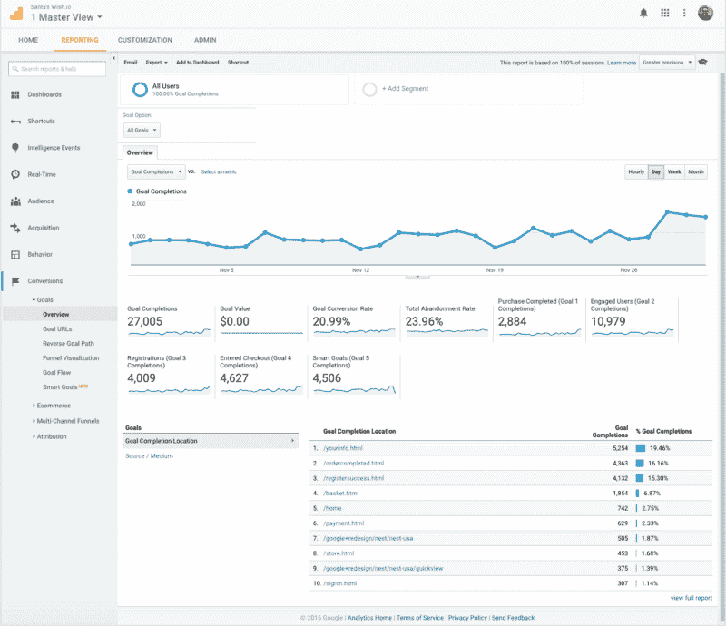

Screenshot: Conversions showing goal completion by location

在谷歌分析中，目标不是默认设定的。用户需要在管理面板中定义它们。目标是由潜在的交互类型定义的。这可以是查看某个页面(例如 thankyou.html)、行为(网站的最短持续时间、每次会话的页面数量)，或者是记录事件的时间。你甚至可以定义一系列的目的地作为一个单一的目标。

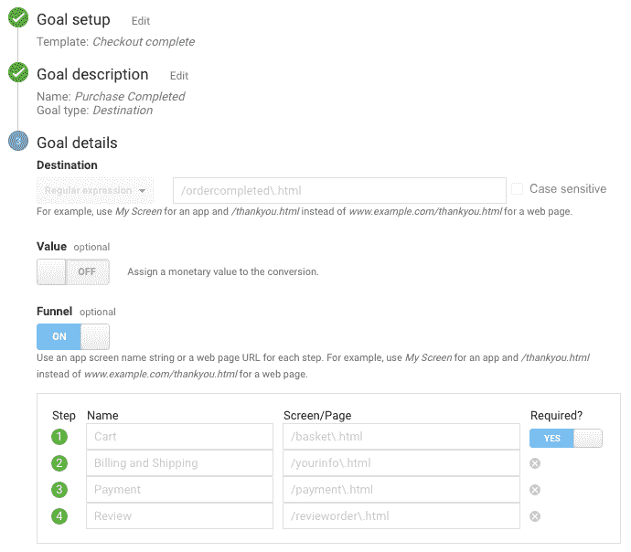

当你想追踪有多少孩子经历了整个转换“漏斗”时，这是很重要的例如，他们进入注册儿童区，浏览愿望选项，并成功提交愿望。

通过跟踪这一漏斗目标，可视化显示了儿童如何完成每一步。它还揭示了他们退出的程度(和时间)，以及他们从那里去了哪里。

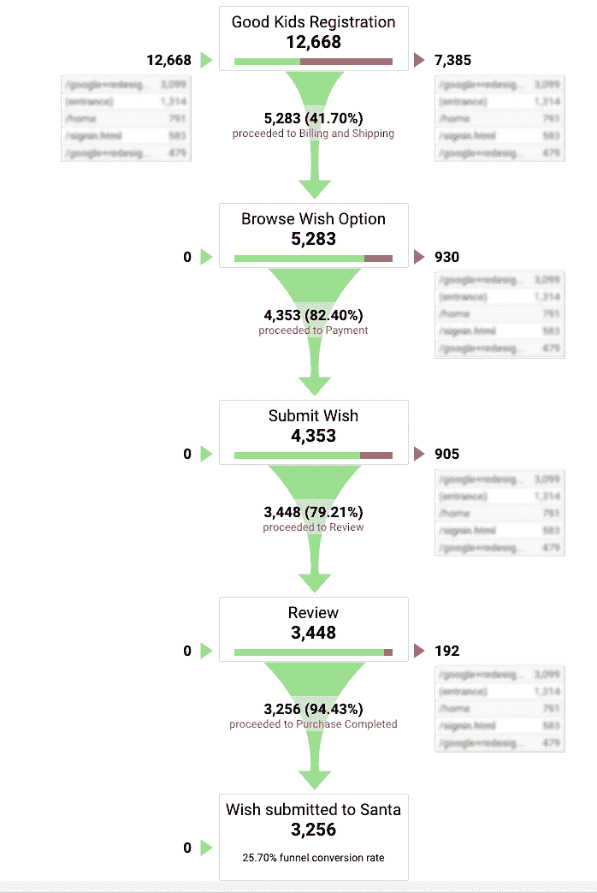

需要注意的是，目标应该以不相互重叠的方式定义。如果一个事件产生两个目标的计数，你的转换率可能太高。

除了使用 Goals，还可以将整个圣诞老人电子商务系统连接到 Google Analytics。但那是新一年的工作。一旦这种深度整合启动并运行，Santa & Co .将深入了解每个愿望的“订单”水平，甚至能够跟踪愿望的回报。

另一个有用的谷歌分析视图是多渠道漏斗子类别。在谷歌分析之前，营销精灵经常争论预算分配，以及谁贡献了提交的最整体的愿望。

品牌广告精灵抱怨说，他们的工作不仅影响了直接流量，也影响了搜索和社交。他们发现一些孩子最初是通过他们的社交媒体帖子来的，但后来又通过键入 wish.io URL 来提交愿望。

那么为什么最后一个被牵扯进来的精灵要独享所有的荣誉呢？他们不应该。这就是为什么现在在北极的每一次营销会议都包括对辅助转化和顶级转化途径的考察。在这里，精灵不仅可以看到他们的直接转化价值，还可以看到他们帮助完成的转化价值。

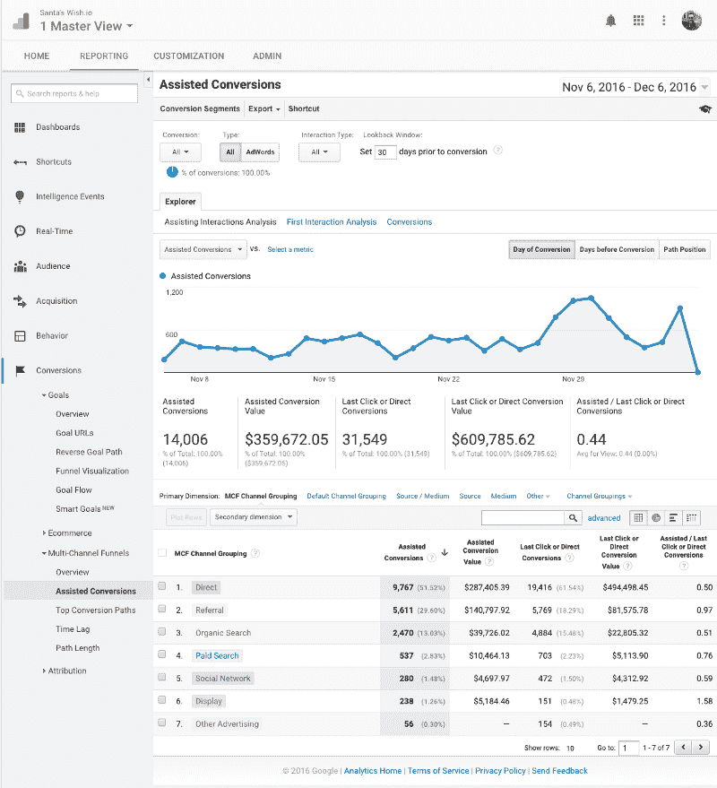

Screenshot: Assisted Conversions per traffic source

### 干得好

由于他的谷歌分析项目，圣诞老人将 2016 年称为“数据驱动决策年”。他很高兴他的精灵们已经将一度激烈的讨论变成了数据竞赛和实验。

从现在开始，他将利用数据的力量来鼓励他的团队的科学精神——并寻找不断优化的提高幸福感的过程。

现在剩下的就是我祝你和你所爱的人节日快乐。我希望这个来自北极的小故事能激励你，让你的 2017 年更加成功，并以数据为导向。

现在，让我们都穿上难看的节日毛衣，拥抱节日气氛。

特别感谢[选秀朋克](https://www.draft-punk.com)的 Craig Rennie 和[自由代码营](https://www.freecodecamp.com/)的 Quincy，感谢他们所有的编辑工作。愿你的假期格外快乐！

**免责声明:** *这个故事是以节日为主题写的，仅供娱乐之用。尽管上面的报道是关于圣诞老人、精灵和儿童的，但重要的是要注意，谷歌分析不会跟踪或分享任何 18 岁以下的观众信息。*

所有数据和图片均由谷歌提供。通过访问[谷歌分析模拟账户](https://support.google.com/analytics/answer/6367342?hl=en) ，此处显示的数据可用于每个分析账户