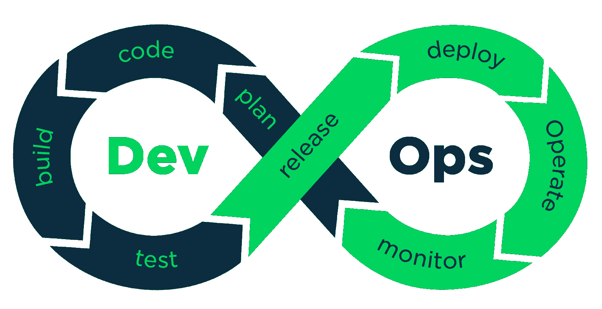
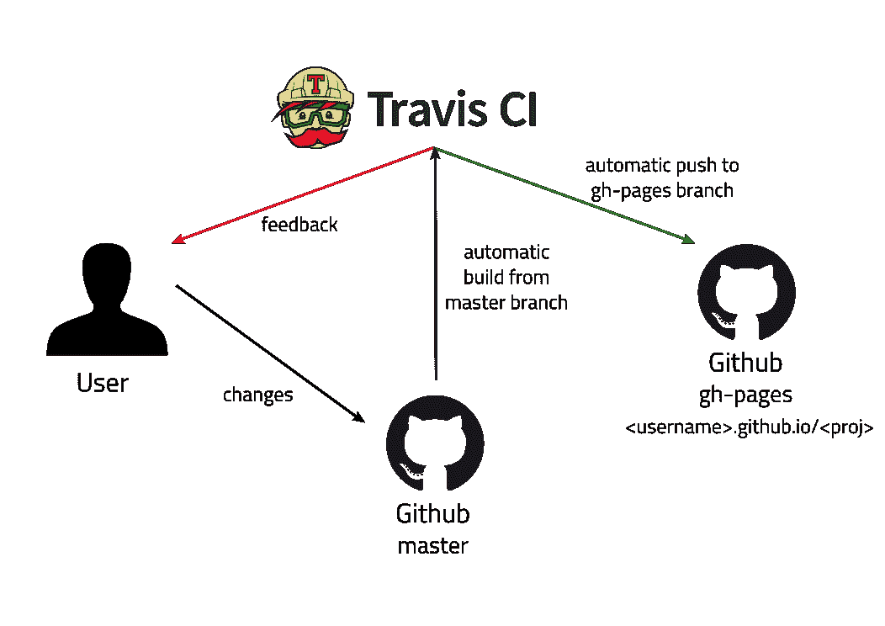
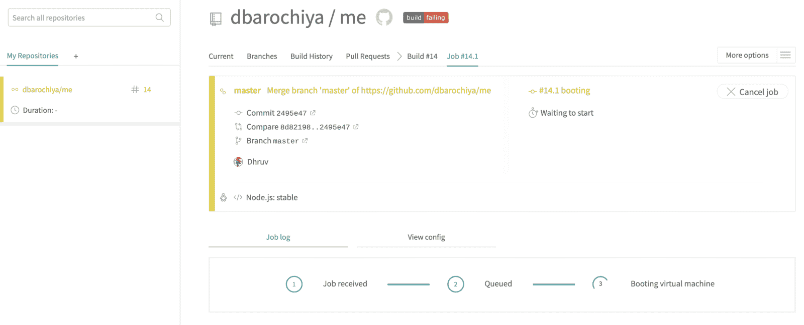
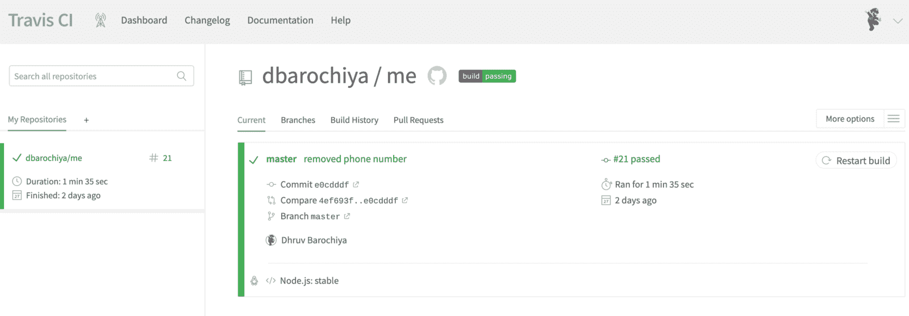
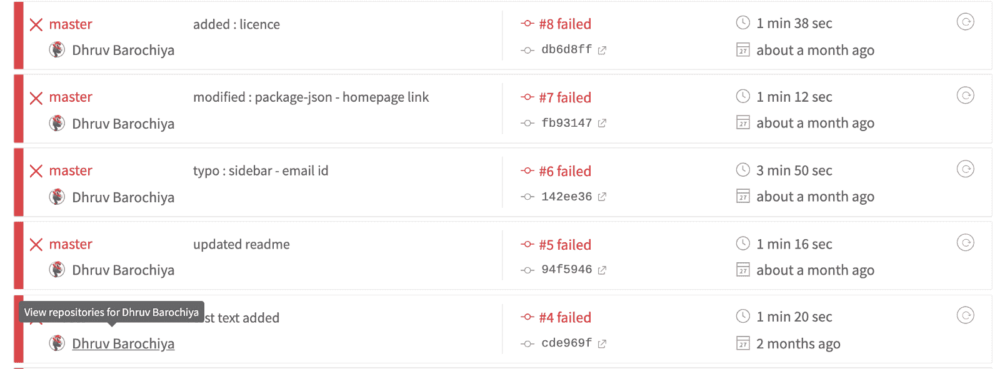
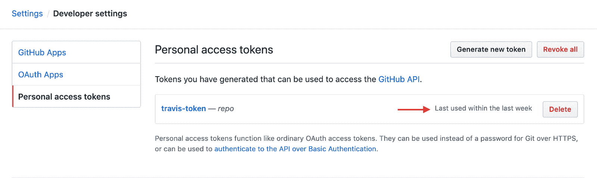
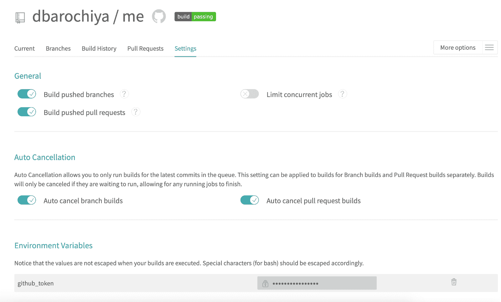

# 如何使用 Travis CI 在 GitHub-pages 上实现自动化部署

> 原文：<https://www.freecodecamp.org/news/learn-how-to-automate-deployment-on-github-pages-with-travis-ci/>

> 声明:这篇文章不是由文章中描述的任何工具赞助的(Travis-CI、Github、Github-Pages)

您已经在 React.js 中创建了一个项目，并将其部署在 GitHub-pages 上(还没有？？— [在 React.js](https://medium.com/free-code-camp/portfolio-app-using-react-618814e35843) 中创建您的第一个项目，但是如果您频繁地更改代码库，并且还希望将部署的版本更新到最新，该怎么办？…您会发现自己处于一次又一次运行部署脚本的繁琐过程中！！！

> 如果部署过程可以自动化会怎样？？

在一些快速的 google 搜索会话之后，我发现这是可能的，并且可以通过 Travis CI 实现——一个开源工具可以用来自动部署各种类型的项目。

## 您将学到什么>

在本文中，您将能够学习如何实现系统，该系统将使用 TRAVIS-CI 触发 react 部署脚本，以便在代码存储库的主分支中发现任何变更时将项目部署到 GitHub-pages 上。

*   设置自动部署**'**[**react-portfolio '**](https://medium.com/free-code-camp/portfolio-app-using-react-618814e35843)项目
*   了解在此过程中遇到的一些常见错误
*   了解与'**持续部署'**相关的一些概念

## 让我们学习一些基础知识

> 如果你知道你不是那种类型，跳过这一节！！

### 持续集成(CI)和持续交付(CD)>

> “在[软件工程](https://en.wikipedia.org/wiki/Software_engineering)中，持续集成(CI)是将所有开发人员的工作副本合并到一个共享的[主线](https://en.wikipedia.org/wiki/Trunk_%28software%29)中的实践，一天几次”——[维基百科](https://en.wikipedia.org/wiki/Continuous_integration)

换句话说，开发人员会尽可能频繁地将他们的功能代码合并到主分支中。遵循这一实践可以使开发人员和产品经理更频繁地发布产品。

CI 管道有一些扩展版本，在这些版本中，这些更改也会被自动测试，这使得代码可以随时部署，这被称为**“连续交付**”。这个管道的进一步扩展被称为**‘连续部署’**管道，在这里这些经过测试的代码变更被自动推送到生产服务器。(在我们的案例中，我们将实现持续部署管道)

### 特拉维斯 CI >

Travis CI 是一个托管的持续集成服务，用于构建和测试 GitHub 托管的软件项目。开源项目可以免费测试！！

可以通过向存储库添加一个`.travis.yml`文件来配置 Travis CI。当 Travis CI 为给定的存储库激活时，GitHub 会在新的提交被推送到存储库或任何拉请求被提交时发出通知，然后根据`.travis.yml`文件中定义的规则，Travis CI 将执行任何步骤—从运行测试、构建应用程序或部署脚本。Travis CI 为构建软件提供了广泛的选择，当然，我们敬爱的❤️ `javascript`就是其中之一。

> **注 *:*** *Github 有* [***学生开发者包***](https://education.github.com/pack) *可从不同平台(Travis CI 是其中之一)免费获得一系列高级功能，供希望学习新事物的学生使用——现在就获取您的学生包吧！！*

### DevOps >

**DevOps** 是一套软件开发实践，结合了[软件开发](https://en.wikipedia.org/wiki/Software_development) ( *Dev* )和[信息技术运营](https://en.wikipedia.org/wiki/Information_technology_operations) ( *Ops* )来缩短[系统开发生命周期](https://en.wikipedia.org/wiki/Systems_development_life_cycle)，同时[频繁地交付特性、修复和更新](https://en.wikipedia.org/wiki/Continuous_delivery)。DevOps 的概念是建立在团队间的合作文化之上的。

> “DevOps 不仅仅是实践，它还关乎文化”

持续集成、持续交付、持续部署是 DevOps 的一些关键实践。除此之外，DevOps 工程师还大量使用云基础设施的力量来实现无缝部署流程。



* * *

## 说够了！！！让我们做些动作

因为您已经使用`gh-pages`节点模块部署到 Github 页面上，所以在存储库上将有一个名为`gh-pages`的分支，它保存部署到 GitHub 页面服务器上的文件。在集成了 Travis CI 之后，我们将能够实现这样一个系统，其中用户在`master`分支上所做的任何更改都将自动触发构建。如果构建成功，那么构建脚本将被触发，这将更新`gh-pages`分支。Travis CI 将通过电子邮件通知向用户通知构建状态



### 在 Travis-CI >上创建帐户

*   前往[Travis-ci.com](https://travis-ci.com/)和[向 GitHub报名。](https://travis-ci.com/signin)
*   接受 Travis CI 的条款和条件。你会被重定向到 GitHub。
*   单击 *Activate* 按钮，并选择要与 Travis CI 一起使用的存储库。
*   添加授权令牌(这将在您使用 GitHub 登录时自动完成)

### 将 travis.yml 文件添加到存储库中>

这份文件包含了告诉特拉维斯-CI-什么？..怎么会？..什么时候？

> **注意**:当您在 Travis-CI 中触发一个作业时，它将启动一个虚拟机，并在`*.travis.yml*`中配置适当的部署环境

让我们来分解代码—

```
language: node_js
node_js:
  - "stable"
cache:
  directories:
  - node_modules
script:
  - npm run build
deploy:
  provider: pages
  skip_cleanup: true
  github_token: $github_token
  local_dir: build
  on:
    branch: master
```

.travis.yml file

`on` : Travis-CI 将在该字段指定的分支发生变化时自动触发一个任务。

`deploy`:在这个字段中，我们已经声明我们将使用由 Travis-CI 提供的 GitHub 页面的部署[提供者，它只不过是设置部署环境的配置指令。](https://docs.travis-ci.com/user/deployment/pages/)

`script`:该字段包含运行作业时将执行的构建脚本。对于构建脚本这种情况，您还可以添加测试脚本(代码覆盖、融合测试等。)在构建之前。

Travis-CI 提供了一个缓存库文件和模块的选项，这些文件和模块在所有构建中都是不变的。缓存的文件可以被后面的构建作业再次使用，这减少了作业的端到端运行时间。

## 所有设置>

好了，一切就绪，现在如果你在主分支上提交任何东西，就会触发一个 Travis-CI 构建任务，看起来就像下面的截图一样。您还可以从 Travis-CI 仪表板本身手动触发构建。



Travis-CI job(Running)



Travis-CI job (successful)

## 但是…(总有但是！！哼！！)

我很确定你的构建面板不会像上面的一样，因为生活并不顺利，我们被告知会是这样的？。您的 Travis-CI 仪表盘充满了失败的构建，原因有很多(我知道..我经历过这个)



这是你最有价值的“谷歌搜索”技能派上用场的时候。我将解释我在尝试创建管道时遇到的所有错误。

*   安全错误
*   令牌错误
*   只是随机错误(你必须弄脏&找到解决方案！！)

### 令牌错误>

如果您的构建由于权限错误而失败，那么令牌很有可能存在一些[问题。你需要去 https://github.com/settings/tokens 的令牌网址](https://docs.travis-ci.com/user/deployment/pages/#setting-the-github-token)[查看它最近被使用的时间，如果它显示 ***从不*** 那么你就找到了你的罪魁祸首。](https://github.com/settings/tokens)



遵循以下步骤，

*   删除并创建新令牌
*   将其添加到 Travis 环境变量中(转到作业设置)
*   重试构建



### 安全错误>

在编写和构建 web 应用程序时，我们忽略了大量的安全实践。当我们在本地运行时，这些安全错误不会得到太多重视，通常会作为警告消息被丢弃，但是当我们试图使用 Travis-CI 部署服务时，这些警告会导致构建失败。

我将提及我在项目中遇到的错误(我鼓励你提及你遇到的错误),最棒的是，他们中的大多数都有自己的专用网页，解释潜在的问题并提供解决方案/变通办法(变通办法——我们都喜欢它，即使知道我们不应该这样做！！)

*   **在 HTML 中使用 target = _ blank<href>标签:**这是比看起来更严重的安全漏洞。你可以在这里了解更多关于[的信息。](https://mathiasbynens.github.io/rel-noopener/)
*   HTML 代码中的冗余:有许多冗余的标签/类名，使得代码看起来像垃圾。

防止这些错误的最好方法是在您正在使用的文本编辑器中安装`es-lint`插件。

* * *

## 建了一些项目？—分享它

我试图建立一个开发者社区，在那里人们可以分享他们的想法，知识，与他人合作，并找到其他具有类似意识形态的人来一起构建东西。因此，如果你建立了一些项目，并希望分享它，张贴在频道上。

*   吉特频道:[https://gitter.im/weekend-devs/community](https://gitter.im/weekend-devs/community)
*   Github 组织:[https://github.com/weekend-developers](https://github.com/weekend-developers)

* * *

## 包扎

我想花点时间感谢那些给我灵感和知识来完成这篇文章的人。

*   **Travis CI 社区:**免费提供牛逼工具。
*   ***我最亲爱的朋友:*** 帮助我改正错误的人。
*   你:留下来，我希望你过得很愉快。不断探索和建造令人惊叹的东西！

* * *


Photo by [Clemens van Lay](https://unsplash.com/@clemensvanlay?utm_source=medium&utm_medium=referral) on [Unsplash](https://unsplash.com?utm_source=medium&utm_medium=referral)