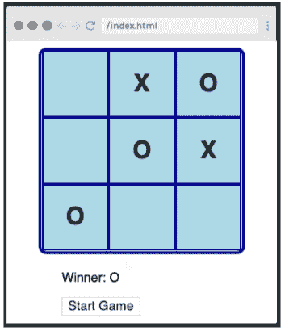
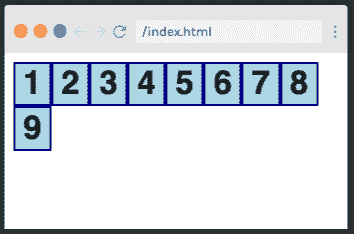
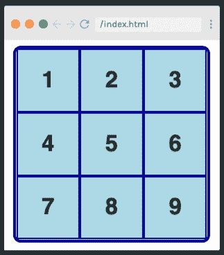
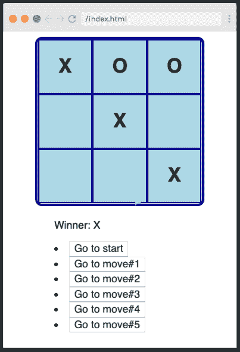

# 学习如何用 React 钩子构建井字游戏

> 原文：<https://www.freecodecamp.org/news/learn-how-to-build-tic-tac-toe-with-react-hooks/>

如果你对 HTML、CSS、JavaScript 和 React 有很好的理解，你可能想知道在你的学习之旅中下一步去哪里。那么，为什么不看看 [Scrimba 的全新免费教程](https://scrimba.com/course/greactgame?utm_source=dev.to&utm_medium=referral&utm_campaign=greactgame_launch_article)关于如何在 React 中构建经典井字游戏呢？

[](https://scrimba.com/course/greactgame?utm_source=dev.to&utm_medium=referral&utm_campaign=greactgame_launch_article) 
*点击上方进入教程。*

示例游戏来自 React 的官方教程，但使用 React hooks 进行了更新——React 世界的最新热门话题。

本文为您提供了教程的概述，并允许您随时点击屏幕截图并使用代码。

如果你的 HTML、CSS、JavaScript 或 React 技能感到不稳定，不要害怕——Scrimba 提供了大量的教程来帮助你提高速度。我们推荐以下课程，帮助您为井字游戏教程做好准备:

*   凯文·鲍威尔的 CSS 速成班
*   Dylan C. Israel 的 Javascript 简介
*   [与鲍勃·齐罗尔一起免费学习 React】](https://scrimba.com/course/glearnreact?utm_source=dev.to&utm_medium=referral&utm_campaign=greactgame_launch_article)

在真正的 Scrimba 风格中，使用 React Hooks 构建井字游戏教程包含了大量的交互式挑战，因此您将嵌入您的学习内容，并在结束时感觉像一个 Hooks 向导。

该课程由 Thomas Weibenfalk 主讲，他是一位来自瑞典的热情的开发人员、设计人员和编码讲师。Thomas 喜欢教人们关于前端开发的知识，尤其是 React，这使他成为带您度过这一学习经历的理想老师。

假设你已经准备好了井字游戏，那就让我们开始吧！

## 介绍

[](https://scrimba.com/p/pgGEGtW/cPkGD8Sm?utm_source=dev.to&utm_medium=referral&utm_campaign=greactgame_launch_article)

在第一个稀松布中，Thomas 告诉了我们他对教程的计划，并分享了[官方 React 文档](https://reactjs.org/tutorial/tutorial.html)，我们可以参考它来获得对用于构建游戏的功能的更详细的解释。

除了向我们介绍他为应用程序实现的文件结构，托马斯还让我们第一次看到了成品。点击上面的图片参观演员阵容。

## 脚手架组件

[接下来](https://scrimba.com/p/pgGEGtW/cV8eB8fp?utm_source=dev.to&utm_medium=referral&utm_campaign=greactgame_launch_article)，Thomas 向我们介绍了创建游戏所需的 Board.js、Game.js 和 Square.js 文件。我们还将了解如何将 Game.js 导入 App.js 文件。

```
import React from "react";
import Game from "./components/Game";

const App = () => <Game />;

export default App; 
```

## 方形构件和解构道具

在[的下一个稀松布](https://scrimba.com/p/pgGEGtW/cKp4eRfq?utm_source=dev.to&utm_medium=referral&utm_campaign=greactgame_launch_article)中，我们使用 JSX 添加一个按钮来创建正方形组件:

```
const Square = (props) => (
	<button onClick={props.onClick}>{props.value}</button>
); 
```

在我们的第一个挑战中，Thomas 鼓励我们销毁组件中的道具。[点击](https://scrimba.com/p/pgGEGtW/cKp4eRfq?utm_source=dev.to&utm_medium=referral&utm_campaign=greactgame_launch_article)进入演员表，尝试挑战。

## 电路板组件和脚手架功能

现在是时候通过导入 square 组件并向电路板添加它的九个实例来创建电路板组件了(注意，我们稍后将使用一个循环来重构它以改进代码):

```
<div>
	<Square value="1" onClick={() => onClick("dummy value")} />
	<Square value="2" onClick={() => onClick("dummy value")} />
	<Square value="3" onClick={() => onClick("dummy value")} />
	<Square value="4" onClick={() => onClick("dummy value")} />
	<Square value="5" onClick={() => onClick("dummy value")} />
	<Square value="6" onClick={() => onClick("dummy value")} />
	<Square value="7" onClick={() => onClick("dummy value")} />
	<Square value="8" onClick={() => onClick("dummy value")} />
	<Square value="9" onClick={() => onClick("dummy value")} />
</div> 
```

Thomas 还在 Game.js 中搭建了我们需要的功能，我们将在后面完成。

## 方形造型

[](https://scrimba.com/p/pgGEGtW/ceMPzwhB?utm_source=dev.to&utm_medium=referral&utm_campaign=greactgame_launch_article) 
*点击图片进入演员表。*

[接下来](https://scrimba.com/p/pgGEGtW/ceMPzwhB?utm_source=dev.to&utm_medium=referral&utm_campaign=greactgame_launch_article)，我们使用`style`默认道具来设计我们的方块:

```
const style = {
	background: "lightblue",
	border: "2px solid darkblue",
	fontSize: "30px",
	fontWeight: "800",
	cursor: "pointer",
	outline: "none",
};

const Square = ({ value, onClick }) => (
	<button style={style} onClick={onClick}>
		{value}
	</button>
); 
```

## 纸板造型

[](https://scrimba.com/p/pgGEGtW/c8rJyKcD?utm_source=dev.to&utm_medium=referral&utm_campaign=greactgame_launch_article) 
*点击图像进入稀松布。*

现在我们的方格已经准备好了，是时候给棋盘设计[样式了。Thomas 再次创建了一个样式对象，这一次是用 CSS grid:](https://scrimba.com/p/pgGEGtW/c8rJyKcD?utm_source=dev.to&utm_medium=referral&utm_campaign=greactgame_launch_article)

```
const style = {
	border: "4px solid darkblue",
	borderRadius: "10px",
	width: "250px",
	height: "250px",
	margin: "0 auto",
	display: "grid",
	gridTemplate: "repeat(3, 1fr) / repeat(3, 1fr)",
}; 
```

我们现在的挑战是将样式对象应用到棋盘上。前往纱布试一试。

不要忘了，虽然托马斯提供了一些很棒的造型选项，Scrimba 是完全互动的，所以你可以自由定制你的游戏，让你的想象驰骋吧！

## calculateWinner 函数解释

```
export function calculateWinner(squares) {
	const lines = [
		[0, 1, 2],
		[3, 4, 5],
		[6, 7, 8],
		[0, 3, 6],
		[1, 4, 7],
		[2, 5, 8],
		[0, 4, 8],
		[2, 4, 6],
	];
	for (let i = 0; i < lines.length; i++) {
		const [a, b, c] = lines[i];
		if (squares[a] && squares[a] === squares[b] && squares[a] === squares[c]) {
			return squares[a];
		}
	}
	return null;
} 
```

[接下来是](https://scrimba.com/p/pgGEGtW/cBLrMvS2?utm_source=dev.to&utm_medium=referral&utm_campaign=greactgame_launch_article)，托马斯解释至关重要的`calculateWinner()`函数，该函数摘自[reactjs.org](https://reactjs.org/tutorial/tutorial.html)的原始教程。前往[演员表](https://scrimba.com/p/pgGEGtW/cBLrMvS2?utm_source=dev.to&utm_medium=referral&utm_campaign=greactgame_launch_article)探索其功能并聆听其工作原理。

## 创建状态并用初始数据填充

在下一部[剧本](https://scrimba.com/p/pgGEGtW/c4Pw97tV?utm_source=dev.to&utm_medium=referral&utm_campaign=greactgame_launch_article)中，我们开始为游戏创建逻辑。

我们首先在 Game.js 中添加一个名为`usedState`的钩子，并创建状态来设置一个空棋盘并指定下一个玩家。最后，我们添加了`const winner`，它告诉我们最近的一步棋是否是赢棋:

```
const [board, setBoard] = useState(Array(9).fill(null));
const [xIsNext, setXisNext] = useState(true);
const winner = calculateWinner(board); 
```

在 Board.js 中，我们删除了手动绘制的方块，用之前承诺的映射方块来代替它们。[点击](https://scrimba.com/p/pgGEGtW/c4Pw97tV?utm_source=dev.to&utm_medium=referral&utm_campaign=greactgame_launch_article)查看详情:

```
const Board = ({ squares, onClick }) => (
	<div style={style}>
		{squares.map((square, i) => (
			<Square key={i} value={square} onClick={() => onClick(i)} />
		))}
	</div>
); 
```

## 创建 handleClick 函数

[接下来是](https://scrimba.com/p/pgGEGtW/c67knwTy?utm_source=dev.to&utm_medium=referral&utm_campaign=greactgame_launch_article)，我们创建了`handleClick()`函数，它在我们移动时执行计算:

```
const handleClick = (i) => {
	const boardCopy = [...board];
	// If user click an occupied square or if game is won, return
	if (winner || boardCopy[i]) return;
	// Put an X or an O in the clicked square
	boardCopy[i] = xIsNext ? "X" : "O";
	setBoard(boardCopy);
	setXisNext(!xIsNext);
}; 
```

## renderMoves 函数和最后一个 JSX

[](https://scrimba.com/p/pgGEGtW/cNq2EQAL?utm_source=dev.to&utm_medium=referral&utm_campaign=greactgame_launch_article) 
*点击上方进入教程。*

在这个稀松布中，我们创建了使游戏可玩的 JSX。

```
<>
  <Board squares={board} onClick={handleClick} />
  <div style={styles}>
    <p>
      {winner ? "Winner: " + winner : "Next Player: " + (xIsNext ? "X" : "O")}
    </p>
  </div>
</> 
```

我们现在已经掌握了用 React hooks 创建一个完整的井字游戏所需的所有知识！

## 奖励:实现时间旅行

[](https://scrimba.com/p/pgGEGtW/cBLr6Df6?utm_source=dev.to&utm_medium=referral&utm_campaign=greactgame_launch_article) 
*点击图片进入奖金教程。*

[在奖金稀松布](https://scrimba.com/p/pgGEGtW/cBLr6Df6?utm_source=dev.to&utm_medium=referral&utm_campaign=greactgame_launch_article)中，我们通过实现时间旅行来回顾整个游戏中的移动，从而将我们的游戏带到一个新的水平。点击通过获得这个奖金教程的好东西。

所以我们有了它——一个使用 React 钩子的完整的井字游戏！我希望这篇教程对你有所帮助。别忘了，你可以在任何时候回顾它，以刷新你对所涉及主题的记忆，或者在交互式截屏中使用代码。

接下来，为什么不看看 Scrimba 上的其他教程呢？话题范围广泛，每个人都有适合自己的东西。

快乐学习:)

[https://www.youtube.com/embed/Z5RbPrK4VqM?feature=oembed](https://www.youtube.com/embed/Z5RbPrK4VqM?feature=oembed)