# 了解如何在 20 分钟内创建您的第一个 Angular 应用程序

> 原文：<https://www.freecodecamp.org/news/learn-how-to-create-your-first-angular-app-in-20-min-146201d9b5a7/>

Angular 是一个 JavaScript 框架，由 Google 创建和维护。这是一个 MVC(模型视图控制器)。你可以[访问官方页面](https://angular.io/)了解更多信息。

眼下，Angular 的最新版本是 **5.2.10。**有[第一代 1。](https://angularjs.org/) x 和[二代 2.x](https://angular.io/) ，两代在结构和方法上完全不同。如果您对版本感到困惑，不要担心，因为在本文中，我们将使用第二代 2.x

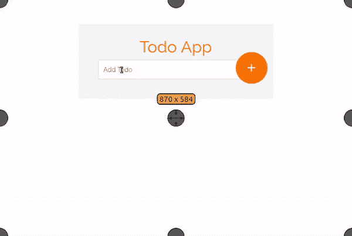

#### **目录**

*   添加项目(了解如何在 Angular 中提交表单)
*   移除项目(了解如何在 Angular 中添加事件)
*   角度动画(了解如何制作组件动画)

### 先决条件:

*   **Node.js**

检查您的计算机中是否安装了 node.js。[了解有关安装的更多信息](https://nodejs.org/en/download/package-manager/)。

*   **npm**

**npm** (节点包管理器)随 Node.js 一起安装

查看 **node.js** 版本:

```
node -v
```

**npm:**

```
npm -v
```

**角度坐标**

您应该拥有最新版本的 Angular-CLI。点击**了解更多关于 Angular CLI [**的信息，并找到安装说明。**](https://angular.io/guide/quickstart)**

**安装角度命令行界面:**

```
`npm install -g @angular/cli`
```

**最后，您应该具备:**

*   **JavaScript 的基础知识**
*   **HTML 和 CSS 基础**

**你不需要有任何角度的知识。**

**现在我们已经有了运行 Angular 应用程序的环境，让我们开始吧！**

### **创建我们的第一个应用程序**

**我们将使用 angular-cli 来创建和生成我们的组件。它将生成服务、路由器、组件和指令。**

**要使用 Angular-cli 创建新的 Angular 项目，只需运行:**

```
`ng new my-app`
```

**该项目将自动生成。让我们创建我们的待办事项应用程序！**

```
`ng new todo-app`
```

**然后，在文本编辑器中打开这些文件。我使用崇高的文字，但你可以选择任何编辑器。**

**下面是应用程序的结构:**

**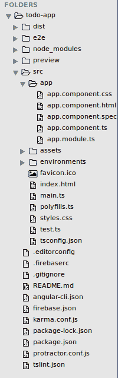**

**如果您对文件感到困惑，请不要担心。我们所有的工作都会在 **app** 文件夹里。它包含五个文件:**

**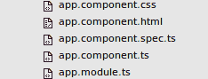**

> **注:Angular 2 使用 [**打字稿**](https://www.typescriptlang.org/) ，其中文件以**结尾。ts"** 分机。**

**为了给我们的应用程序制作一个漂亮的界面，我们将使用 [Bootstrap 4](http://getbootstrap.com/) 框架。**

**在 index.html**的**中包含自举 **cdn** :**

```
`<link rel="stylesheet" href="https://maxcdn.bootstrapcdn.com/bootstrap/4.0.0/css/bootstrap.min.css" integrity="sha384-Gn5384xqQ1aoWXA+058RXPxPg6fy4IWvTNh0E263XmFcJlSAwiGgFAW/dAiS6JXm" crossorigin="anonymous">`
```

**在您的终端中运行应用程序:**

```
`ng serve`
```

**该应用将在 [http://localhost:4200/](http://localhost:4200/) 中运行**

**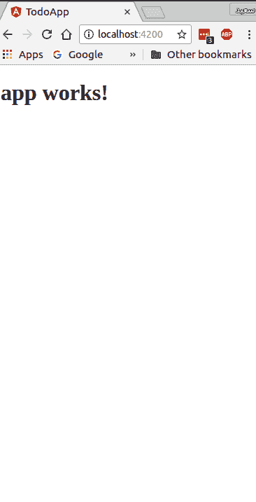**

**一切都好吗？！**

**现在让我们做一些 HTML 结构化。我们将使用引导类来创建一个简单的表单。**

**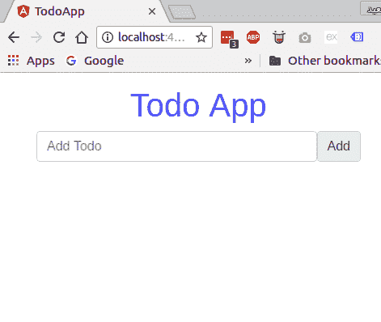**

****app.component.html**:**

```
`<div class="container"> <form>  <div class="form-group">  <h1 class="text-center text-primary">Todo App</h1>   <div class="input-group-prepend">       <input type="text" class="form-control" placeholder="Add Todo" name="todo">    <span class="input-group-text">Add</span>   </div>  </div> </form></div>`
```

**在 **app.component.css** 中:**

```
`body{ padding: 0; margin: 0;`
```

```
`}form{ max-width: 25em; margin: 1em auto;}`
```

**为了捕获 Angular 2 中的输入值，我们可以使用 **ngModel** 指令。您可以在 input 元素中插入一个变量作为属性。**

**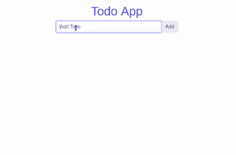**

```
`<input type="text" #todo class="form-control" placeholder="Add Todo" name="todo" ngModel>`
```

**要创建一个变量作为属性，使用 **#** 后跟变量名。**

```
`<input #myVariable type="text" name="text" ngModel>`
```

```
`// get the value of the Variable<p>{{myVariable.value}}</p>`
```

**现在获取“todo”变量值:**

```
`<p>{{todo.value}}</p>`
```

**一切都好吗？！**

**现在我们必须存储从输入中捕获的值。我们可以在 AppComponent 类的 **app.component.ts** 中创建一个空数组:**

```
`export class AppComponent {  todoArray=[] }`
```

**然后，我们必须向按钮添加一个点击事件，将捕获的值推送到“ **todoArray** ”中。**

**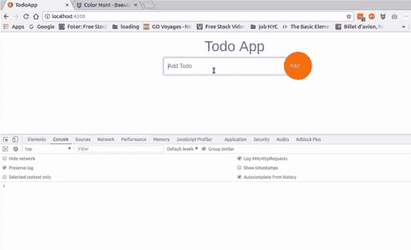**

****app.component.html**:**

```
`<span class="input-group-text" (click)="addTodo(todo.value)">Add</span>`
```

**在 **app.component.ts** 中:**

```
`export class AppComponent { todoArray=[]`
```

```
`addTodo(value){    this.todoArray.push(value)    console.log(this.todos)  } }`
```

> **使用 console.log(this.todoArray)查看数组值**

#### **从“todoArray”获取数据**

**现在我们必须获取存储在“todosArray”中的数据我们将使用* [**ngFor 指令**](https://angular.io/guide/structural-directives) 遍历数组并提取数据。**

**app.component.html:**

```
`<div class="data">  <ul class="list-instyled">   <li *ngFor="let todo of todoArray">{{todo}}</li>  </ul>  </div>`
```

**获取数据后:**

**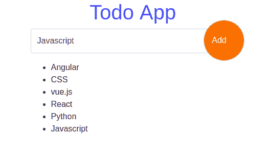**

**现在，当我们单击“添加”按钮时，将自动获取数据。**

**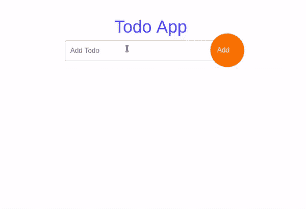**

#### **设计应用程序**

**我喜欢用[谷歌字体](https://fonts.google.com)和[材质图标](https://material.io/icons/)，这些都是免费使用的。**

**在 **app.component.css** 中包含 Google 字体:**

```
`/*Google fonts*/@import url('https://fonts.googleapis.com/css?family=Raleway');`
```

**以及**index.html**内部的材质图标:**

```
`<link href="https://fonts.googleapis.com/icon?family=Material+Icons" rel="stylesheet">`
```

**在我们的应用程序中添加一些样式后，它看起来会像这样:**

**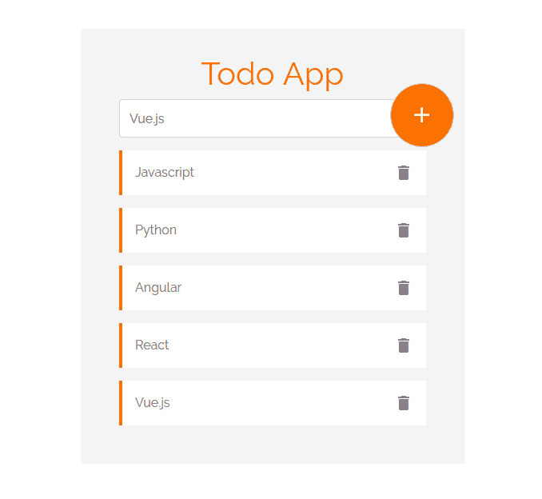**

**要使用材质图标:**

```
`<i class="material-icons>iconName</i>`
```

**在**app.component.html**中添加“删除”和“添加”图标:**

```
`// put add icon inside "input-group-text" div`
```

```
`<span class="input-group-text" (click)="addTodo(todo.value)"><i class="material-icons">add</i></span>`
```

```
`// and delete icon inside list item <li *ngFor="let todo of todoArray">{{todo}}<i class="material-icons">delete</i></li>`
```

**对于 **app.component.css** 中的样式:**

```
`/*Google fonts*/@import url('https://fonts.googleapis.com/css?family=Raleway');`
```

```
`body{ padding: 0; margin: 0;`
```

```
`}form{ max-width: 30em; margin: 4em auto; position: relative; background: #f4f4f4; padding: 2em 3em;}form h1{    font-family: "Raleway";    color:#F97300; }form input[type=text]::placeholder{   font-family: "Raleway";   color:#666; }form .data{    margin-top: 1em;}form .data li{ background: #fff; border-left: 4px solid #F97300; padding: 1em; margin: 1em auto; color: #666; font-family: "Raleway";}form .data li i{    float: right;    color: #888;    cursor: pointer;}form .input-group-text{    background: #F97300;    border-radius: 50%;    width: 5em;    height: 5em;    padding: 1em 23px;    color: #fff;    position: absolute;    right: 13px;    top: 68px;    cursor: pointer;}form .input-group-text i{    font-size: 2em;}form .form-control{ height: 3em;    font-family: "Raleway";}form .form-control:focus{ box-shadow: 0;}`
```

**我们的应用程序快完成了，但我们需要添加一些功能。删除功能应该允许用户点击删除图标并删除项目。如果可以选择用 return 键输入一个新条目，而不是点击 add 按钮，那就太好了。**

****删除项目****

**为了添加删除功能，我们将使用“拼接”数组方法和 for 循环。我们将遍历“todoarray”并提取我们想要删除的项目。**

**添加一个(单击)事件来删除图标，并给它“todo”作为参数:**

```
`<li *ngFor="let todo of todoArray">{{todo}} <i (click)="deleteItem(todo)" class="material-icons">delete</i></li>`
```

**在 **app.component.ts** 中:**

```
`/*delete item*/  deleteItem(){   console.log("delete item")  }`
```

**当您单击“删除”时，这应该会显示在控制台中:**

**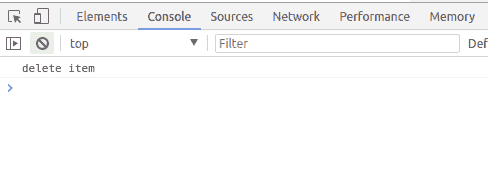**

**现在我们必须遍历“todoArray”并拼接我们单击的项目。**

**在 **app.component.ts** 中:**

```
`/*delete item*/  deleteItem(todo){   for(let i=0 ;i<= this.todoArray.length ;i++){    if(todo== this.todoArray[i]){     this.todoArray.splice(i,1)    }   }  }`
```

**结果是:**

**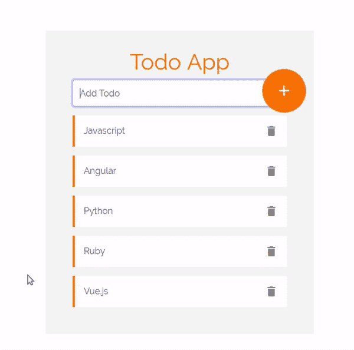**

**牛逼？！！**

#### ****进入添加项目****

**我们可以在表单中添加一个提交事件:**

```
`(ngSubmit)="TodoSubmit()"`
```

**我们需要将变量“#todoForm”添加到表单中，并给它“ngForm”作为值。在这种情况下，我们只有一个字段，所以我们将只获得一个值。如果我们有多个字段，提交事件将返回表单中所有字段的值。**

****app.component.html****

```
`<form #todoForm= "ngForm" (ngSubmit)="todoSubmit(todoForm.value)"></form>`
```

**在 **app.component.ts****

```
`// submit Form  todoSubmit(value:any){ console.log(value)  }`
```

**检查控制台。它将返回一个值对象:**

**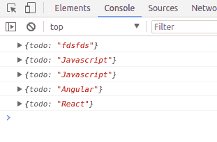**

**所以现在我们必须将返回值推送到“todoArray”:**

```
`// submit Form  todoSubmit(value:any){     if(value!==""){    this.todoArray.push(value.todo)     //this.todoForm.reset()    }else{      alert('Field required **')    }      }`
```

**我们到了。。无需单击 add 按钮，只需单击“enter”即可插入值:**

**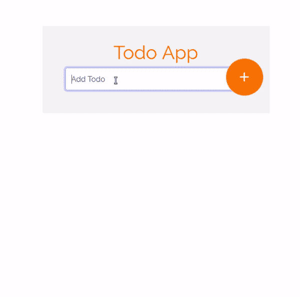**

**还有一件事。要在提交后重置表单，请添加“resetForm()”内置方法来提交事件。**

```
`<form #todoForm= "ngForm" (ngSubmit)="todoSubmit(todoForm.value); todoForm.resetForm()" ></form>`
```

**每次立即提交后，表单将重置:**

**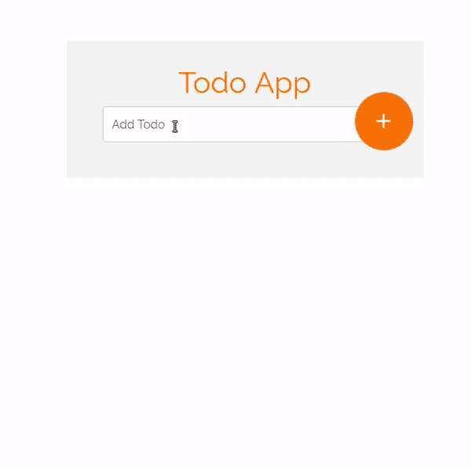**

#### **添加动画**

**我喜欢添加一点动画。要添加动画，请在您的 **app.component.ts** 中导入动画组件:**

```
`import { Component,trigger,animate,style,transition,keyframes } from '@angular/core';`
```

**然后将动画属性添加到“@component”装饰器:**

```
`@Component({  selector: 'app-root',  templateUrl: './app.component.html',  styleUrls: ['./app.component.css'],  animations:[   trigger("moveInLeft",[      transition("void=> *",[style({transform:"translateX(300px)"}),        animate(200,keyframes([         style({transform:"translateX(300px)"}),         style({transform:"translateX(0)"})           ]))]),`
```

```
`transition("*=>void",[style({transform:"translateX(0px)"}),        animate(100,keyframes([         style({transform:"translateX(0px)"}),         style({transform:"translateX(300px)"})           ]))])             ])`
```

```
`]})`
```

**现在，条目在被输入和删除时会有很好的效果。**

**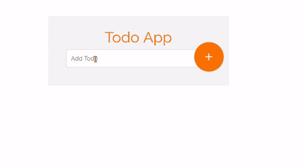**

### **所有的代码**

****app.component.ts****

```
`import { Component,trigger,animate,style,transition,keyframes } from '@angular/core';`
```

```
`@Component({  selector: 'app-root',  templateUrl: './app.component.html',  styleUrls: ['./app.component.css'],  animations:[   trigger("moveInLeft",[      transition("void=> *",[style({transform:"translateX(300px)"}),        animate(200,keyframes([         style({transform:"translateX(300px)"}),         style({transform:"translateX(0)"})           ]))]),`
```

```
`transition("*=>void",[style({transform:"translateX(0px)"}),        animate(100,keyframes([         style({transform:"translateX(0px)"}),         style({transform:"translateX(300px)"})           ]))])             ])`
```

```
`]})export class AppComponent {  todoArray=[];  todo;  //todoForm: new FormGroup()`
```

```
`addTodo(value){    if(value!==""){     this.todoArray.push(value)    //console.log(this.todos)   }else{    alert('Field required **')  }      }`
```

```
`/*delete item*/  deleteItem(todo){   for(let i=0 ;i<= this.todoArray.length ;i++){    if(todo== this.todoArray[i]){     this.todoArray.splice(i,1)    }   }  }`
```

```
`// submit Form  todoSubmit(value:any){     if(value!==""){    this.todoArray.push(value.todo)     //this.todoForm.reset()    }else{      alert('Field required **')    }      } }`
```

****app.component.html****

```
`<div class="container"> <form #todoForm= "ngForm"(submit)="todoSubmit(todoForm.value); todoForm.resetForm()" >  <div class="form-group">  <h1 class="text-center ">Todo App</h1>   <div class="input-group-prepend">       <input type="text" #todo  class="form-control" placeholder="Add Todo" name="todo" ngModel>    <span class="input-group-text" (click)="addTodo(todo.value)">    <i class="material-icons">add</i></span>   </div>  </div>  <div class="data">  <ul class="list-unstyled">   <li [@moveInLeft]  *ngFor="let todo of todoArray">{{todo}} <i (click)="deleteItem(todo)" class="material-icons">delete</i></li>  </ul> </div> </form></div>`
```

****app.component.css****

```
`/*Google fonts*/@import url('https://fonts.googleapis.com/css?family=Raleway');`
```

```
`body{ padding: 0; margin: 0;`
```

```
`}form{ max-width: 30em; margin: 4em auto; position: relative;    background: #f4f4f4;    padding: 2em 3em;    overflow: hidden;}form h1{    font-family: "Raleway";    color:#F97300; }form input[type=text]::placeholder{   font-family: "Raleway";   color:#666; }form .data{    margin-top: 1em;}form .data li{ background: #fff; border-left: 4px solid #F97300; padding: 1em; margin: 1em auto; color: #666; font-family: "Raleway";}form .data li i{    float: right;    color: #888;    cursor: pointer;}form .input-group-text{    background: #F97300;    border-radius: 50%;    width: 5em;    height: 5em;    padding: 1em 23px;    color: #fff;    position: absolute;    right: 13px;    top: 68px;    cursor: pointer;}form .input-group-text i{    font-size: 2em;}form .form-control{ height: 3em;    font-family: "Raleway";}form .form-control:focus{ box-shadow: 0;}`
```

**我们完了吗？。你可以在 [Github 上找到文件和代码。](https://github.com/hayanisaid/Todo-app-in-Angular)**

#### **[参见演示](https://stackblitz.com/edit/todo-app-in-angular?file=index.html)**

### **结论**

**有棱角比你想象的要容易。Angular 是最好的 JavaScript 库之一，它有很好的支持和社区。它还有一些工具可以让 Angular 的工作变得快速简单，比如 Angular-cli。**

**订阅此[邮件列表](http://eepurl.com/dk9OJL)以了解更多关于 Angular 的信息。**

**[**【SaidHayani @(@ hayani said 1995)|推特**](https://twitter.com/hayanisaid1995)
[*【SaidHayani @(@ hayani said 1995)最新推文。# Web _ Developer/# Frontend/# Back _ end(# PHP&……*twitter.com](https://twitter.com/hayanisaid1995)**

**以下是免费学习 Angular 的一些最佳在线课程:**

****角度 1.x****

*   **S [具有角度](https://www.codeschool.com/courses/shaping-up-with-angularjs)**
*   **[学角](http://www.learn-angular.org/)**

****棱角分明 2.x** *(推荐)***

*   **[学习 Angular2 (coursetro](https://coursetro.com/courses/8/Learn-Angular-2-Development-with-our-Free-Course)**
*   **[YouTube 播放列表](https://www.youtube.com/playlist?list=PLC3y8-rFHvwg5gEu2KF4sbGvpUqMRSBSW)**