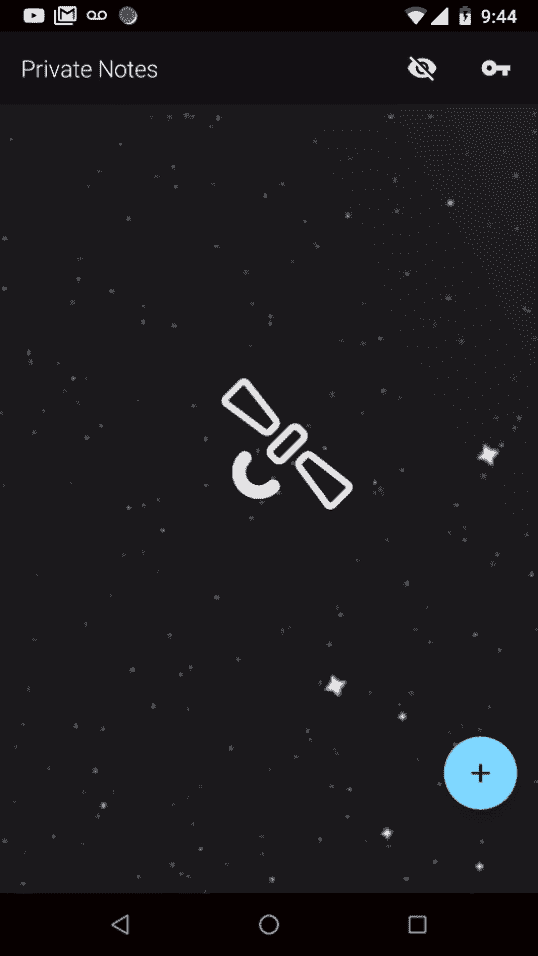

# 了解如何使用 Kotlin 开发原生 Android 应用程序-完整课程

> 原文：<https://www.freecodecamp.org/news/learn-how-to-develop-native-android-apps-with-kotlin-full-tutorial/>

Android 是世界上最流行的操作系统。它在比 Windows、iOS 和 MacOS 加起来还要多的设备和电脑上运行。在 Ryan Kay 的完整视频课程中，您将学习如何使用 Kotlin 为 Android 构建原生应用。

这个完整的课程解释了如何使用最佳实践构建一个完整的 Android 应用程序。您将学习如何使用 Android Jetpack、Firebase、Room、MVVM、导航、LiveData 和 Kotlin 协同程序。

Android Jetpack 是一个 Android 软件组件的集合，可以帮助您轻松构建优秀的 Android 应用程序。本课程展示了如何使用这些组件来简化开发过程。

Firebase 是 Google 开发的一个移动和 web 应用程序开发平台，可以帮助您构建、改进和发展您的应用程序。它有助于数据存储、托管、认证、分析等。在本课程中，了解如何使用 Firebase 为您的 Android 应用提供支持。

## 你会建造什么？

在本课程中，您将学习如何通过创建名为 SpaceNotes 的应用程序来构建原生应用程序。这是一个基于 Kotlin 的 Android 应用程序。该应用程序使用协同例程进行并发和跨模块/边界通信，一个干净的域层允许应用程序跨多个平台正常工作，以及一些来自 Android Architecture Component 和 Firebase 的 API。

Part of the app you will build.

Ryan 称这个应用的架构风格为“模型-视图-无论什么”。它是一种软件架构，没有特定的风格，但是可以适应所有的情况。他根据他正在创建的任何特性，使用了所有常见风格的架构(MVP、MVC 或 MVVM)的一部分。这允许你获得许多不同概念的经验。

观看以下全部课程或在 freeCodeCamp.org YouTube 频道观看(3.5 小时)。

[https://www.youtube.com/embed/Iz08OTTjR04?feature=oembed](https://www.youtube.com/embed/Iz08OTTjR04?feature=oembed)