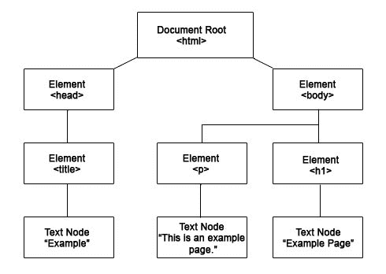
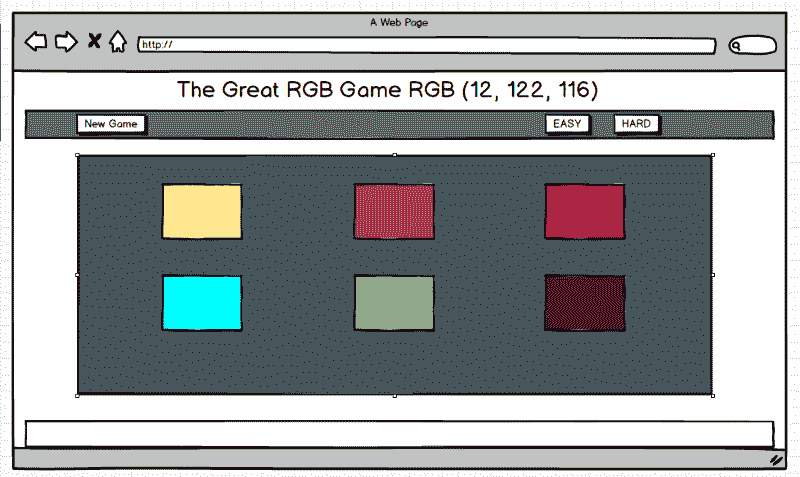
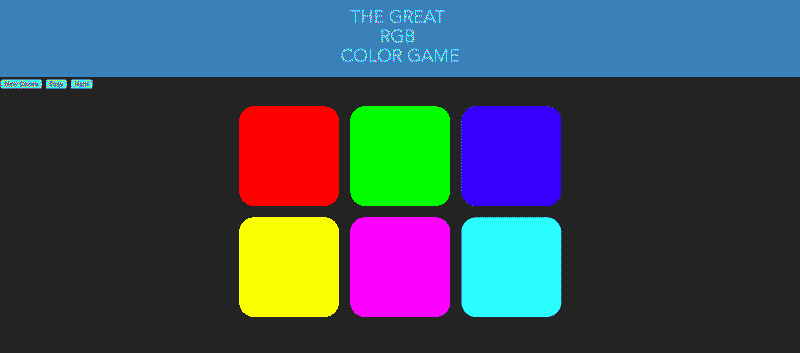

# 通过构建一个简单的 JavaScript 颜色游戏来学习如何操作 DOM

> 原文：<https://www.freecodecamp.org/news/learn-how-to-manipulate-the-dom-by-building-a-simple-javascript-color-game-1a3aec1d109a/>

阿什什·南丹·辛格

### 这只狗是什么

DOM 代表文档对象模型。它只不过是浏览器加载网页时，页面上加载的所有 HTML 元素的块级图。它以 HTML 元素的对象树的形式呈现。看看下面的图片，你可能会有更好的想法。



DOM representation of a simple .html file

一个漂亮干净的方块图。html 文件——是不是很棒！但现在你在想，这对我有什么帮助？用例是什么？为什么我需要知道这些？

简单地说，DOM 使您能够为静态网站带来动态效果。使用 DOM，你可以在网页上做很多有用的事情，比如:

*   添加和删除 HTML 元素和属性
*   在用户触发的事件上添加和删除 CSS 规则
*   为合成用户事件创建新事件

这正是你在这篇文章中所学到的东西。

为了让你对本文结束时我们将实现的目标有所了解，请查看[这个链接](https://colorgame-f0a09.firebaseapp.com/)。

### **入门**

我们将构建一个简单的颜色猜测游戏。每次游戏开始，都会随机选择一个 RGB 色码。根据游戏的模式，我们将在屏幕上有三个(简单)或六个(困难)选项或色块可供选择。每次选择不正确的色块时，色块就会消失，直到用户选择了正确的颜色(或者是剩下的最后一个选项)。

这是我们将要建造的东西的草图:

这是我在参加柯尔特·斯蒂尔的课程时学到的，他是教授基本概念的杰出教练。你们都应该看看他在 Udemy 的 YouTube 频道上的视频。



Mockup diagram

#### 第一部分

我们将首先创建一个简单的 web boiler plate，它由 index.html、app.css 和 app.js 文件组成。让我们看看这些文件在我们开始时是什么样子的。

但是首先，请注意:只是为了让没有任何开发经验的人简单地阅读本文，每当我们改变一些主要的东西时，我将继续显示源代码。

*   **index.html**

```
<!DOCTYPE html><html>
```

```
<head><title>Color Game</title><link rel="stylesheet" type="text/css" href="app.css"></head>
```

```
<body>
```

```
<h1>The Great<br><span id="colorDisplay">RGB</span><br>Color Game</h1>
```

```
<div id="stripe">
```

```
<button id="reset">New Colors</button><span id="message"></span><button class="mode">Easy</button><button class="mode selected">Hard</button>
```

```
</div>
```

```
<div id="container">
```

```
<div class="square"></div><div class="square"></div><div class="square"></div><div class="square"></div><div class="square"></div><div class="square"></div>
```

```
</div>
```

```
<script type="text/javascript" src="app.js"></script></body></html>
```

这再简单不过了。我们可以简单地将整个网页分成三个主要部分。

首先，我们有标题部分，它有文本，如果您想在其中添加内容，还可能包含一些其他信息。

接下来是控制面板，它有重置游戏和在游戏模式之间切换的按钮。

第三，也是最有趣的部分，是主游戏区，有六个分区。这些 div 充当每个随机 RGB 颜色代码的选项，可以通过一些奇特的逻辑进行选择(我们稍后将会看到)。

*   **app.css**

```
body {
```

```
background-color: #232323;margin: 0;font-family: "Montserrat", "Avenir";}
```

```
h1 {
```

```
text-align: center;line-height: 1.1;font-weight: normal;color: white;background: steelblue;margin: 0;text-transform: uppercase;padding: 20px 0;}
```

```
#container {
```

```
margin: 20px auto;max-width: 600px;}
```

```
.square {
```

```
width: 30%;background: purple;padding-bottom: 30%;float: left;margin: 1.66%;border-radius: 15%;transition: background 0.6s;-webkit-transition: background 0.6s;-moz-transition: background 0.6s;}
```

为作为游戏选项的主体、文本和方块添加了一些基本样式。

*   **app.js**

```
var numSquares = 6;var colors = [];var pickedColor;var squares = document.querySelectorAll(".square");var resetButton = document.querySelector("#reset");var modeButtons = document.querySelectorAll(".mode");
```

我们以变量的形式存储了所有的 HTML 元素。这将有助于我们通过向这些变量中的每一个添加事件来执行一些操作，并在本文中我们将创建的各种逻辑函数中调用它们。

事实上，让我们将这些变量逐一分解，看看它们的意义是什么:

*   变量 **numSquares** 根据模式存储游戏中可用的方块数。为了简单起见，我将该值硬编码为 6——我们可以回到这里，添加一些逻辑来保持它的变化。
*   **colors** 是一个空数组，包含每次游戏重置或模式改变时随机生成的六个或三个 RGB 颜色代码。
*   **pickedColor** 是用户每次点击选择的颜色/选项块。
*   **方块**是页面上所有可作为选项的方块的数组。这个数组可能有三个或六个元素，这取决于游戏的模式。
*   **复位**变量是控制面板中的“新游戏”按钮。
*   **modeButtons** 也是一个数组，其中有简单和困难模式按钮。

如果你已经了解了这一点，你应该已经有了这个游戏的基本版本。您可以在任何浏览器中打开 index.html 文件并将其签出。好了，现在我们有了基础，让我们进入正题。

#### 第二部分

在这一节中，我们将主要使用 JavaScript 文件，偶尔使用 CSS 文件。

**生成随机颜色**

我们的第一个目标是在每次游戏开始或重启或模式改变时产生随机的颜色。让我们看看如何做到这一点。

为了理解随机生成任何东西的基本原理，我们应该从六个 RGB 颜色代码的硬编码数组开始。让我们尝试将这些颜色设置为网页上可用的六个方块/选项的背景色。

```
var colors = [
```

```
 "rgb(255, 0, 0)",    "rgb(255, 0, 255)",    "rgb(255, 225, 0)",    "rgb(255, 0, 255)",    "rgb(0, 255, 255)",    "rgb(0, 255, 0)"
```

```
];
```

```
var squares = document.querySelectorAll(.squares);
```

```
for (i=0; i<squares.length; i++) {squares.style.backgroundColor = colors[i]}
```

*   我在颜色数组中添加了六个静态 RGB 颜色代码
*   我使用已经创建的正方形数组运行一个循环，遍历数组中的所有正方形。
*   我将每个方块的背景色与其在 colors 数组中对应的索引相匹配。

如果将它添加到 app.js 文件中并刷新浏览器，您会看到每个方块现在都有一种独特的颜色。



*screenshot form the browser

您可能会注意到按钮还没有样式化，但是现在先不要做。我们以后会谈到这一部分。

#### 启用点击功能

所以我们所需要的就是在每个选项/色块上启用**事件监听器**来监听点击事件。最简单的方法是——你又猜对了——遍历正方形数组。这个循环看起来类似于用来设计色块背景的循环。让我们看一下代码:

```
for(i=0; i<= squares.length; i++) {  squares[i].addeventListeners('click', function() {    alert('option was clicked');  });}
```

现在，每次你点击任何一个模块，你都会从浏览器中得到这个提示信息。那很容易！现在，我们的选择是可以接受的，它们对用户的输入做出反应。我们现在需要做的就是定义一个逻辑，告诉我们如果游戏选择的颜色和用户选择的颜色相同会发生什么。

如果你仔细注意了上面的部分，现在你可能已经有了解决方案。所以让我们看看我们能做什么。

#### **检查颜色是否正确**

让我们探索一下我们的选项/彩盒是否有接受和回应的可能性。我们可以进行一个小测试，看看这两种颜色是否匹配。很快我们就会在每次刷新页面或者重置游戏或者改变游戏模式时随机生成颜色。但是现在，我们将使用文件中指定的六个 RGB 颜色代码进行练习。

让我们看一些代码，然后我会为你分解它。

```
for(i=0; i<= squares.length; i++) {  squares[i].addeventListeners('click', function() {    //if correct block is clicked do something....    //if wrong block is clicked do something....  });}
```

您可能已经知道，我们将使用一个简单的 **if-else** 块。

```
pickedColor = colors[3];for (i=0; i <= squares.length; i++) { //apply background colour to all the squares... squares[i].style.backgroundColor = colors[i]   //enable click event on each square.....     squares[i].addEventListener('click', function() {
```

```
 //if the user selected the right colour....         var clickedColor = this.style.backgroundColor;
```

```
 //check if the selected colour matches the default colour...
```

```
 if(pickedColor === clickedColor) {             changeColors(pickedColor);           }         //if the user user selected wrong colour....         else {           this.style.backgroundColor = "#232323";           messageDisplay.text = "Wrong Choice!";         }    })};
```

我知道—代码太多了。但是让我们看看它真正的含义:

*   我们首先用变量**picked color 定义游戏选择的默认颜色。**
*   然后我们运行循环的**,让我们遍历色块/选项的数组。**
*   然后，我们启用每个颜色块/选项上的**点击事件**。我们使用一个**回调函数来做这件事。**该功能只选择所选色块/选项的背景色，只需将其分配给名为 **clickedColour 的变量。**
*   现在我们有两种颜色:一种是由游戏选择的，另一种是由用户选择的。剩下的就是匹配，看看选择是否正确。
*   我们可以使用 **if else** 块轻松地做到这一点。如果选择是正确的，那就这样做，否则就做别的
*   如果选择了正确的颜色，我们在页面上添加一些文本来确认正确的选择，并添加一些视觉效果来再次确认。否则，我们匹配特定颜色选项/块的颜色，以匹配页面的背景颜色。这会产生一种效果，就好像颜色块/选项消失了一样。
*   现在您已经看到，如果选择了相同的颜色，那么就会执行一个函数。让我们看看这个函数是由什么组成的:

```
function changeColors(color) { for (i=0; i <= squares.length; i++) {  squares[i].style.backgroundColor = color;  messageDisplay.text = "You are good at guessing!"; }}
```

该函数遍历颜色块/选项的数组，并将背景色重置为所选颜色或默认颜色。

如果颜色不同，我们只需将当前选择的背景颜色设置为网页的背景颜色。

```
else {  this.style.backgroundColor = "#232323";  messageDisplay.text = "Wrong Choice!";}
```

好了，现在我们有了主游戏集，我们只需要担心最小的设计问题，并把功能添加到控制面板中。

但是，首先让我们看看如果您正确地遵循了所有步骤，此时代码文件夹是什么样子的:

**index.html**

**app.css**

**app.js**

#### 第三步

一切都好。但是现在我们需要在我们的游戏中创建新的随机生成的 RGB 颜色代码，这些颜色代码与色块/选项中指定的颜色不同。

如果这让你想到函数，那么这是正确的选择。我们将创建一个带有完全随机(新)颜色代码的新函数，并将它们分配给颜色数组。然后我们将在色块/选项数组中获取它们。

让我们看看代码是什么样子的，然后我们将一行一行地检查它。

JavaScript 中的一个内置方法帮助我们生成一个介于 0 和 1 之间的随机数。然后，我们进行一些操作，以确保该随机数的范围保持在数字 0 和 255 之间。

*   首先我们实现 **Math.random，**选择 0 到 1 之间的任意随机数，然后将该数乘以 256，因为我们不希望该数大于 255。一旦我们有了一个随机数，我们使用 **Math.floor** 并确保我们只有十进制数值之前的数字(一个整数)。
*   我们将生成的这些随机数分配给称为 r、g 和 b 的变量。每个变量都代表其各自的颜色代码 RGB 数。
*   最后，我们将所有这些数字或变量相加，形成一个字符串。我们返回字符串，它看起来像这样: **rgb(23，45，112)。**
*   剩下要做的就是根据游戏的模式运行这个函数，并生成三个或六个随机的 RGB 颜色代码，并将它们分配到 colors 数组中。

但是这只会返回一个看起来像 RGB 代码的字符串。这将如何添加到我们的颜色阵列？每次游戏开始或重置时如何随机选择颜色？

为了完成这两件事，我们将创建更多的函数，看看它们如何帮助我们解决这个问题。

**从数组中随机选择一种颜色**

为此，我们将创建一个名为 **pickColor()的新函数。**先看看函数会是什么样子，然后再分解。

```
function pickColor() {  var random = Math.floor(Math.random() * colors.length);  return colors[random];}
```

简单得不能再简单了，让我们看看这两条强大的线为我们做了什么。

*   正如我们已经看到的 **Math.random** 和 **Math.floor** 的魔力一样，我们使用相同的函数得到一个在 0 和数组长度之间生成的随机数。
*   接下来，我们通过使用索引中的随机数获得颜色数组中相应的 RGB 代码

**在颜色数组中添加六个(或三个)随机 RGB 码**

为此，我们使用了上面的两个函数，分别是 **randomColors()** 和 **pickColors()** 。randomColors()函数的特别之处在于，它运行 randomColors()函数六次或三次(取决于游戏的模式),并将相应数量的 RGB 颜色代码添加到颜色数组中。我们将这个函数命名为 generateRandomColor(num*)。让我们看看代码是怎样的，并逐行分解。

**num 将根据游戏的模式来决定。*

*   首先我们将创建一个简单的空数组
*   接下来，我们按照游戏的模式运行一个循环
*   每次执行这个循环时，都会有一个新的 RGB 代码被推入到创建的数组中
*   最后我们返回这个数组

现在，在所有这些新功能和所有这些代码操作之后，我们的 **app.js** 的代码基础发生了很大的变化。让我们看看它现在是什么样子:

### 重置游戏

在几乎建立了主要逻辑之后，这可能看起来像是小菜一碟。这一切都是关于创建一个函数，并让该函数针对任何给定的用户输入完成它的工作(在这种情况下，单击 **reset** 按钮)。

我们想要的重置按钮是

*   生成一组六种随机颜色
*   从新创建的颜色数组中随机选择一种颜色。

让我们看看伪代码是什么样子的:

```
function reset() {  //create a new array of 6 random colors  //pick new random color  //fill the squares with new set of generated colors}
```

我强烈推荐在解决复杂问题的同时写伪代码。每当我陷入复杂的算法挑战时，这种写伪代码的习惯帮我节省了很多时间。

好了，回到我们的重置按钮:让我们看看实际的功能是什么样子的:

让我们一行一行地分解它:

*   我们首先为重置按钮添加事件侦听器。然后，我们触发一个回调函数，当 click 事件被触发时，该函数执行一系列操作。
*   当它被激发时，我们开始生成一个由六种随机颜色组成的新数组。
*   然后我们随机选择一种颜色。
*   最后，我们重置所有色块的背景色。

这是更新后的 **app.js** 在我们做了所有编辑后的样子:

现在看起来很不错！我不会在本文中添加设置模式的功能，因为它已经变得很大了，我不想让你们都感到厌烦:)。但是，如果你喜欢所有这些，我会很乐意写另一篇文章涵盖其余部分。

这里是 GitHub 库的[链接](https://github.com/ashishcodes4/DOM-manipulation)，在这里可以找到最终优化的代码。

我希望这篇文章能启发你们中的一些人学习更多关于 DOM 操作和 JavaScript 这种美丽语言的知识。直到下一次！