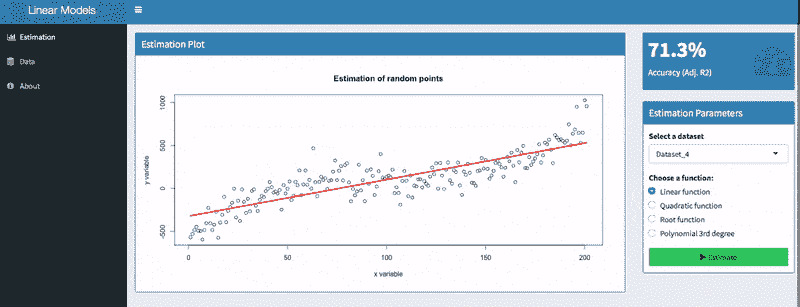
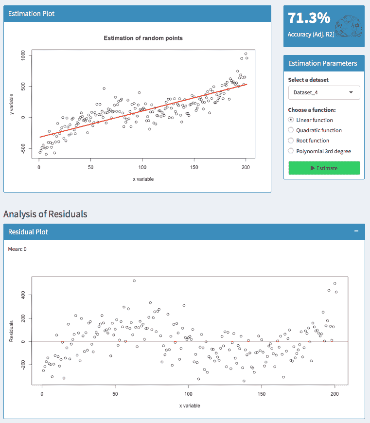
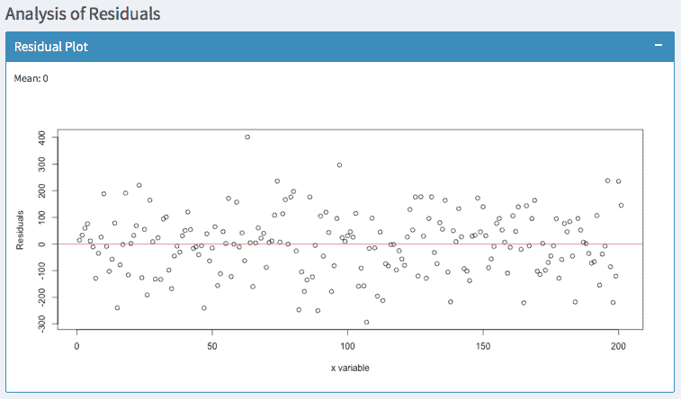
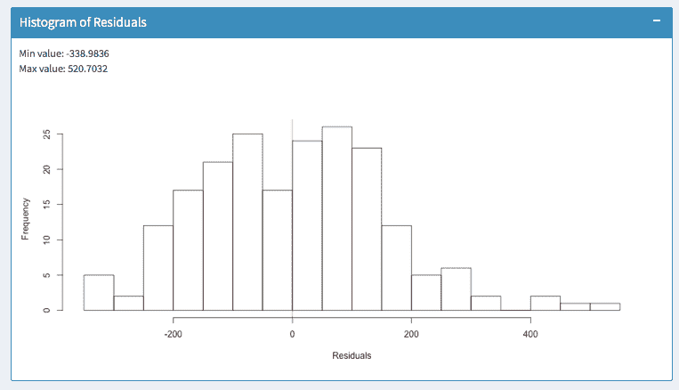
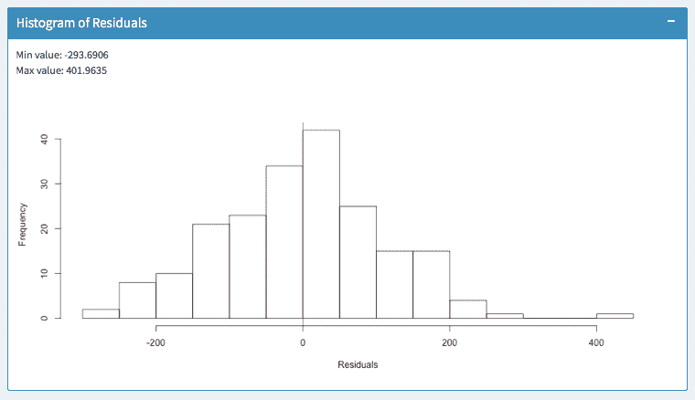
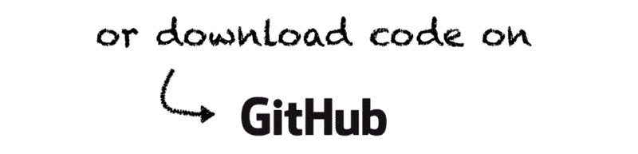

# 了解如何为单变量模型选择性能最佳的线性回归

> 原文：<https://www.freecodecamp.org/news/learn-how-to-select-the-best-performing-linear-regression-for-univariate-models-e9d429c40581/>

比约恩·哈特曼

#### 找出最适合您的数据的线性回归模型

受我上一篇文章后的一个问题的启发，我想解决一个在尝试不同的线性模型后经常出现的问题:你需要选择你想要使用的模型。更确切地说，[哈利法·阿迪西迪](https://www.freecodecamp.org/news/learn-how-to-select-the-best-performing-linear-regression-for-univariate-models-e9d429c40581/undefined)问道:

> “如何确定哪个模型最适合我的数据？我是不是只看 R 广场，SSE 等。？

> 作为那个模型的解释(二次，根等。)将会非常不同，这难道不是一个问题吗？"

问题的第二部分很容易回答。首先，找到最适合您的数据的模型，然后解释其结果。如果你知道如何解释你的数据，这很好。但是，解读最好的模型，只有。

本文的其余部分将回答他问题的第一部分。请注意，我将分享**我的方法** 关于如何选择型号。有多种方法，其他人可能会有不同的做法。但是我会描述最适合我的方法。

另外，**这种方法只适用于单变量模型**。单变量模型只有一个输入变量。我正在计划一篇进一步的文章，在那里我将向你展示如何用更多的输入变量来评估多变量模型。然而，今天，让我们把重点放在基础和单变量模型上。

为了练习和感受这一点，我写了一个小的 ShinyApp。使用它并尝试不同的数据集和模型。注意参数是如何变化的，并对评估简单的线性模型更有信心。最后，您还可以将应用程序用作数据的框架。只需[从 Github](https://github.com/bjoernhartmann/linear_model_selection) 复制即可。

Click on the image for an interactive version

### 对单变量模型使用调整后的 R2

如果您只使用一个输入变量，`adjusted R2`值可以很好地表明您的模型执行得有多好。它说明了你的模型解释了多少变化。

与简单的`R2`相比，`adjusted R2`考虑了输入因素的数量。它惩罚了太多的投入因素，并支持节俭的模型。

在上面的截图中，可以看到两个型号，数值分别为 71.3 %和 84.32%。显然，第二个模型比第一个好。然而，具有低值的模型仍然有用，因为`adjusted R2`对数据中的噪声量很敏感。因此，只比较同一个数据集的**模型的这一指标，而不是在不同数据集之间进行比较。**

#### 通常情况下，上交所的需求很小

在你继续阅读之前，让我们确保我们谈论的是同一个 SSE。在[维基百科](https://en.wikipedia.org/wiki/Residual_sum_of_squares)上，SSE 指的是误差平方和。然而在一些[统计教材](https://www.amazon.de/Introductory-Econometrics-International-Jeffrey-Wooldridge/dp/111153439X/ref=sr_1_1?ie=UTF8&qid=1510003022&sr=8-1&keywords=wooldridge+econometrics&dpID=51mK3jyvZ6L&preST=_SX198_BO1,204,203,200_QL40_&dpSrc=srch)中，SSE 可以参考解释的平方和(正好相反)。所以现在，假设 SSE 指的是误差平方和。

因此，`adjusted R2`约为`1` — SSE /SST。SST 指的是平方和。

我不想深究这背后的数学。我想给你们展示的是**`adjusted R2`是用上证指数**计算出来的。所以**上交所通常不会给你任何额外的信息**。

此外，`adjusted R2`被归一化，使得它总是在零和一之间。因此，对你和其他人来说，用 75%的`adjusted R2`来解释一个不熟悉的模型比用 394 的上证综指来解释更容易——尽管这两个数字可能解释了同一个模型。

### 看看残差或者误差项！

经常被忽略的是误差项或所谓的残差。他们告诉你的往往比你想象的要多。

#### 残差是预测值和实际值之间的差值。

它们的好处是可以向你展示错误的大小和方向。让我们来看一个**的例子**:

We do not want residuals to vary like this around zero

在这里，我尝试用线性函数预测多项式数据集。分析残差显示，模型存在向上或向下偏移的区域。

对于`50 &l*t*; x &l`t；100，残差大于零。所以在这个区域，实际值高于预测值——我们的模型有向下的偏差。

对于`100 < x &l`t；150，但是，残差在零以下。因此，实际值低于预测值—模型有向上的偏差。

知道你的模型建议的值是太高还是太低总是好的。但是你通常不希望有这样的模式。

残差应该平均为零(如平均值所示)，并且应该平均分布。用多项式函数`3 degrees`预测相同的数据集会得到更好的拟合:

Here the residuals are equally distributed around zero. Suggesting a much better fit

此外，您可以观察误差的方差是否增加。在统计学中，这被称为[异方差](https://en.wikipedia.org/wiki/Heteroscedasticity)。你可以用[鲁棒标准误差](https://en.wikipedia.org/wiki/Heteroscedasticity-consistent_standard_errors)轻松解决这个问题。否则，你的假设检验很可能是错误的。

### 残差直方图

最后，直方图总结了误差项的大小。它提供了有关错误带宽的信息，并指出错误发生的频率。

The right histogram indicates a smaller bandwidth of errors than the left one. So it seems to be a better fit.

上面的截图显示了同一个数据集的两个模型。在**左侧**直方图中，误差出现在`-338`和`520`的范围内。

在**右侧**直方图中，误差出现在`-293`和`401`内。所以异常值要低得多。此外，右侧直方图模型中的大多数误差更接近于零。所以我倾向于正确的模式。

### 摘要

选择线性模型时，需要记住以下因素:

*   仅比较同一数据集的线性模型。
*   找一个高调节 R2 的模型
*   确保该模型在零附近具有均匀分布的残差
*   确保该模型的误差在小的带宽内

Click on the image to open the app

如果您有任何问题，请在下方写下评论或[联系我](https://bjoern-hartmann.de)。感谢您的反馈。