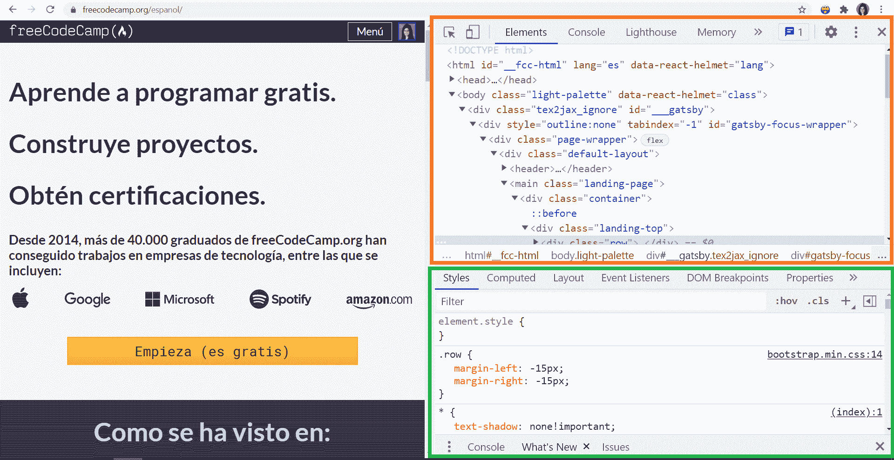
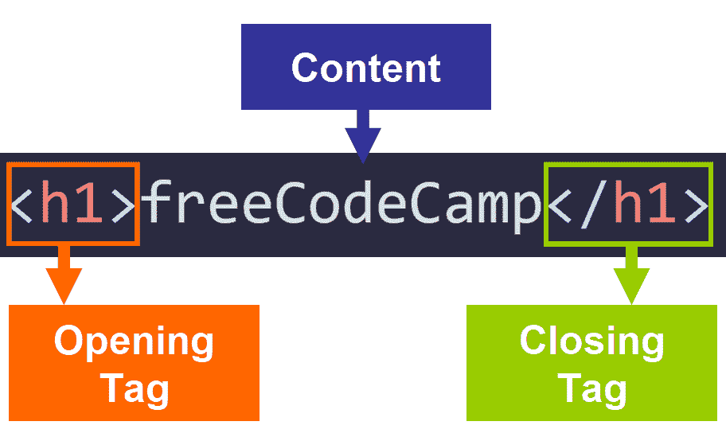
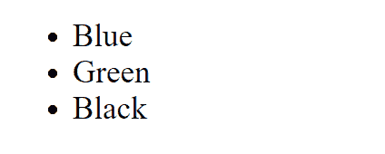

# 学习西班牙语的 HTML 和 CSS 初学者课程

> 原文：<https://www.freecodecamp.org/news/learn-html-and-css-in-spanish-course-for-beginners/>

嗨！如果你会说西班牙语，并且想学习 HTML 和 CSS，那么你来对地方了。

在这篇文章中，你会发现对 HTML 和 CSS 基础知识的简要介绍。然后你会在我们的西班牙语 YouTube 频道上找到一个关于 HTML 和 CSS 的 5 小时免费课程[，在那里你可以通过实际例子更深入地学习内容。](https://www.youtube.com/watch?v=XqFR2lqBYPs&feature=youtu.be)

这篇文章将使用英语来总结你将从这门课程中学到的一切。如果有懂西班牙语的朋友，可以分享一下[这篇文章的西班牙语版](https://www.freecodecamp.org/espanol/news/aprende-html-y-css-curso-desde-cero/)。

我们开始吧！✨

## 🔹HTML 和 CSS:描述和目的

让我们看看什么是 HTML 和 CSS，它们的用途是什么:

*   HTML(超文本标记语言)对于网络开发来说是必不可少的，因为我们用它来定义网页的 T2 结构，即显示在浏览器上的内容。
*   CSS(层叠样式表)是一种基于规则的语言，我们用它来定义和分配网页元素的样式。

HTML 和 CSS 一起创建我们每天在浏览器上使用的网页。有些网页也使用 JavaScript。

**💡提示:** HTML 文件的扩展名为`**.html**`，CSS 文件的扩展名为`**.css**` 。

想一想这个问题。你现在看到的网站是由 HTML 和 CSS 组成的。太棒了，对吧？

现在让我们来谈谈 Chrome 开发者工具。

## 🔸Chrome 开发者工具

只需在页面上点击右键，选择“Inspect”，就可以在 Google Chrome 上看到任何网页的 HTML 和 CSS 代码。

这将打开 Chrome 开发者工具，你会看到两个主要部分:

*   顶部显示网页的 HTML 代码。在下图中，该零件被一个橙色矩形包围。
*   底部显示了应用于 HTML 部分中当前所选元素的 CSS 样式。在下图中，该零件被绿色矩形包围。



Chrome Developer Tools

## 🔹HTML 简介

现在让我们开始深入 HTML 的基础知识。这里有一个非常简单的网页示例:

```
<!DOCTYPE html>
<html lang="en">
  <head>
    <title>freeCodeCamp</title>
  </head>
  <body>
    <h1>freeCodeCamp</h1>
    <p>I'm learning HTML and CSS.</p>
  </body>
</html>
```

💡**提示:**在 HTML 中，缩进(行前可以看到的空间)不是强制的，因为它对最终结果没有影响。尽管如此，我们还是强烈推荐它，因为它有助于我们编写易于阅读、维护和理解的 HTML 文件。我们通常在 HTML 中每级缩进使用 2 个空格。

让我们看看 HTML 的主要组成部分。

### HTML 元素

HTML 文件由 HTML 元素组成。这些元素是我们用来创建网页结构的独立组件。

这是一个元素的示例:

```
<h1>freeCodeCamp</h1>
```

💡提示:某些元素可以作为其他元素的容器，帮助我们创建更复杂的结构。你应该缩进这些嵌套的元素来反映网站的结构，就像我们前面的例子一样。

### **HTML 标签**

每个元素都有一个关联的标签。我们可以通过在 HTML 文件中包含元素的标签来创建元素。

这些是最常用的标签示例:

*   `****<html>****`–网站的所有内容都应该包含在这些标签中。
*   `****<head>****`**–该元素包含您在浏览器标签上看到的网页标题，还包含网页的元数据。**
*   **`****<body>****`–该元素包含网页的所有可见元素。网页的结构必须包含在这些标签中。**
*   ******`<h1>`**** ， ****`<h2>`**** ， ****`<h3>`**** ， ****`<h4>`**** ， ****`<h5>`**** ，****`<h6>`****——这些元素按照重要性从 1 到 6 的顺序构成标题。**
*   **`****<p>****`–一个段落。**
*   **`****<a>****`–链接到另一个网站、网页或当前网页的内部部分。**
*   **`****<strong>****`**–这个标签让我们强调重要的文本。它显示为粗体文本。****
*   ****`****<em>****`**–**这个标签让我们强调重要的文本。它显示为斜体文本。********
*   ******`****<form>****`**–**这个元素代表一个表单。**********
*   ******`****<hr>****`**–可用于分隔网页段落或部分的水平标尺。********
*   ****`****<input>****`**–**让我们创建表单组件的元素。它可以是文本输入字段，也可以是单选按钮或复选框。********
*   ******`****<footer>****`**–**一个页脚。**********

******💡**提示:**我们网页的第一个元素应该是`**<!DOCTYPE html>**`。它告诉浏览器该文件是一个 HTML 文件，以及使用什么版本的 HTML。******

****大多数 HTML 元素需要一个开始标签和一个结束标签。我们将元素的内容写在标签中。****

****在前面的例子中，我们创建了一个类型为`****<h1>****`的元素:****

```
`<h1>freeCodeCamp</h1>`
```

**这个元素有一个开始标签和一个结束标签来包围它的内容。**

*   **开始标签是`****<h1>****`。**
*   **结束标签是`****</h1>****`。**

**您可以在下图中看到这一点:**

****

**💡**提示**:开始标签和结束标签的区别在于，结束标签在元素的类型前有一个正斜杠(`**/**`)。**

**然而，有些元素不需要结束标签，因为它们不充当容器。这类元素的一个例子是`****`元素(图片):**

**`********`**

### ****HTML 属性****

**HTML 元素可以有属性。这些属性让我们定义关于元素的附加信息。它们包括`****class****`、`****id****`、`****style****`、`****lang****`、`****src****`和`****href****`。**

**这里我们有一个带有`****class****` 属性的 HTML 元素的例子:**

```
`<h1 class="main-title">freeCodeCamp</h1>`
```

**正如您在本例中看到的:**

*   **属性必须写在开始标签中，在结束尖括号`**>**`之前。**
*   **属性及其值由等号分隔。在左边，我们写属性的名称，在右边，我们写它的值。在本例中，该值为`**main-title**`。**
*   **属性的值必须用引号括起来。**

**💡 ****提示:**** 每种类型的元素都有一组特定的属性，我们可以给它们赋值，每个属性都有一组可能的值。您可以在网络文档 [MDN 网络文档](https://developer.mozilla.org/es/)中查看这些。**

### ****HTML 语言****

**您可以使用`****lang****` 属性和语言代码指定网页的语言和 HTML 结构中任何元素的语言:**

```
`<html lang="en">`
```

**在这个例子中，我们指定网页的语言是英语。**

### **HTML 链接**

**在 HTML 中，您可以使用`****<a>****`(锚点)元素和`****href****` 属性创建指向其他网页的链接和指向当前网页内部部分的链接。**

**例如，该元素会将您带到西班牙语的 freeCodeCamp 网站:**

```
`<a href="https://www.freecodecamp.org/espanol/">freeCodeCamp</a>`
```

*   **利用`****href****` 属性，我们指定链接将把用户带到哪里。**
*   **我们写在`****<a></a>****` 标签之间的文本就是用户将会看到的文本。在这种情况下，文本是`****freeCodeCamp****`。**

**我们还可以通过选择 HTML 文件作为目的地，将用户带到同一网站的另一个页面:**

```
`<a href="about.html">About Me</a>`
```

**如果我们将`****id****` 属性分配给一个 HTML 元素，我们还可以创建一个链接，将用户带到同一页面上的该元素。我们只需要写一个 hashtag，后跟`**id**` 的名称作为属性`**href**`的值:**

```
`<a href="#main-title">freeCodeCamp</a>` 
```

**在这个例子中，链接会把用户带到带有`****id****` **`main-title`的元素。****

**💡**提示**:****`**<a>**`元素不同于`**<link>**`元素。元素的作用是:指定 HTML 文件和外部资源(比如 CSS 文件)之间的关系。一会儿我们会看到一个例子。**

### ****HTML 注释****

**我们也可以用 HTML 写评论。注释对于添加我们和其他开发人员在打开文件时可以阅读的注释非常有帮助。它们帮助我们解释和理解网页的结构:**

```
`<!-- Add a link to freeCodeCamp -->`
```

****💡提示:**评论不是最终结果的一部分。它们只能在您打开 HTML 文件时读取，并且对使用该文件的开发人员很有帮助。**

### **HTML 列表**

**在 HTML 中，你可以用标签`**<ol>**`和`**<ul>**`分别创建有序列表和无序列表。**

**以下是每种列表类型的示例:**

*   **有序列表**

```
`<ol>
  <li>Blue</li>
  <li>Green</li>
  <li>Black</li>
</ol>`
```

****

*   **无序列表**

```
`<ul>
  <li>Blue</li>
  <li>Green</li>
  <li>Black</li>
</ul>`
```

****

****💡提示:**两种类型列表的区别在于有序列表的元素是有编号的，而无序列表的元素则没有。**

### **HTML 图像**

**为了在 HTML 中创建一个图像，我们使用了`********` 标签。这个元素不需要结束标签，只需要开始标签。**

**例如:**

```
``
```

*   **我们用`********` 标签中的`****src****`属性指定图像的位置。**

**你还应该给你网页上的所有图片分配一个`****alt****`属性，以便在图片下载不正确或者用户需要使用屏幕阅读器的情况下有一个替换文本。**

**例如:**

```
``
```

**太好了！现在你知道了 HTML 的基础知识。**

**先说 CSS。**

## ****🔸CSS 简介****

**一旦我们有了网页的 HTML 结构，我们就可以开始用 CSS 对 HTML 元素应用样式了。**

**CSS 是一种基于规则的语言。这些规则让我们根据 CSS 选择器、属性和值来指定元素在网页上的显示方式。**

### **如何将样式应用于 HTML 元素**

**将 CSS 样式应用到 HTML 元素有三个选项:**

#### **嵌入式样式:**

**您可以直接在要自定义的元素的开始标记中指定样式。你只需要分配样式属性。**

**例如:**

```
`<h1 style="color: blue">freeCodeCamp</h1>`
```

**在本例中， **`style`** 属性的值是 **`color`** 属性及其对应的值(`**blue**`)。它们用引号括起来。**

******💡**提示**:**属性及其值必须用冒号和空格隔开。****

#### **元素**

**如果你想对多个元素应用相同的样式，你可以在`****<style>****` 元素中实现，在这里你可以使用 CSS 选择器编写你的 CSS 规则。**

**例如:**

```
`<head>
  <title>freeCodeCamp</title>
  <style>
    h1 {
      color: blue;
    }
  </style>
</head>`
```

****💡提示:****`**<style>**`元素应该在`**<head>**`元素里面。****

#### ****CSS 文件:****

****然而，我们通常做的是在一个 CSS 文件中编写 CSS 规则，然后将这个文件链接到 HTML 文件。****

****为此，我们在`**<head>**`元素中包含了一个`****<link>****` 元素，并将文件位置指定为`**href**`属性的值。****

```
`<link href="style.css" rel="stylesheet">`
```

**这样，我们在 CSS 文件中定义的样式将被应用到相应的 HTML 元素中。**

**💡 ****提示:**** 如果 CSS 文件和 HTML 文件在同一个文件夹中，我们只需写下 CSS 文件的名称即可。但是如果它在一个文件夹中，我们必须指定它相对于 HTML 文件的位置。**

### **CSS 规则**

**这是一个 CSS 规则的示例:**

```
`h1 {
  color: blue;
  font-size: 15px;
  font-weight: bold;
}`
```

**让我们分析一下它的语法:**

*   **首先，我们编写一个选择器(在本例中为`****h1****`)。选择器让我们选择要应用样式的元素。**
*   **然后，在花括号内，我们写下我们想要分配给所选元素的属性。**
*   **属性和它们的值之间必须用冒号和冒号后的空格隔开。**
*   **和...我们用分号结束每一行。**

**💡 ****提示:**** 建议使用 2 个空格缩进 CSS 规则的内容。**

### **CSS 选择器**

**有各种类型的 CSS 选择器，让我们根据特定的标准选择不同类型的元素。**

**最常用的选择器有:**

*   **类型选择器:它们让我们选择特定类型的所有元素。**

**示例:**

```
`h1 {
  color: blue;
  font-size: 15px;
  font-weight: bold;
}`
```

**使用这个选择器，我们选择了所有类型为`**h1**`的元素。**

*   ****类选择器 **:**** 它们让我们选择一个特定类的所有元素。我们可以将同一个类分配给多个元素。在这种情况下，我们在 CSS 规则中的类名前写一个点。**

```
`.green-text {
  color: green;
}`
```

**使用这个选择器，我们选择了类 **`green-text`** 的所有元素。**

*   ****Id 选择器**:**它们让我们选择具有特定 Id 的元素。每个 id 必须是唯一的，并且只能应用于每页的一个元素。在这种情况下，我们在 CSS 规则中的`**id**`名称前写一个标签`****#****` 。****

```
#main-title {
  color: red;
  font-size: 20px;
  font-weight: bold;
}
```

使用这个选择器，我们用`**id**` `**main-title**`选择所有的元素。

## **📌YouTube 课程**

太棒了。既然你已经了解了 HTML 和 CSS 的基础知识，那么就来看看这个用**西班牙语**编写的 5 小时免费课程吧，里面有更多的内容、细节、技巧和分步示例:

[https://www.youtube.com/embed/XqFR2lqBYPs?feature=oembed](https://www.youtube.com/embed/XqFR2lqBYPs?feature=oembed)

estefan ia cassingena navone([@ estefan iacassn](https://twitter.com/EstefaniaCassN))创立的✍️球场。

### **课程内容**

课程主题分为具体的概念，但在下面的列表中，我将它们分为主要类别，以便让您对内容有一个大致的了解:

### ******HTML******

*   HTML 和 CSS 介绍。
*   Chrome 开发者工具。
*   代码编辑器。
*   创建一个 HTML 文件并声明 DOCTYPE。
*   元素和标签。
*   标题和段落。
*   Web 文档。
*   缩进。
*   图像。
*   链接。
*   有序列表和无序列表。
*   文本格式。
*   表格。
*   单选按钮和复选框。
*   `**<div>**`元素。
*   页脚。
*   `**<head>**`元素。

### ******CSS******

*   CSS 简介。
*   内嵌样式、`**<style>**`块和 CSS 文件。
*   班级和 id。
*   文本格式(大小、字体大小、字体系列和备用字体)。
*   谷歌字体。
*   图像。
*   填充和边距。
*   属性选择器。
*   绝对和相对单位。
*   类型选择器、类、id 和内嵌样式的优先级。
*   CSS 中的十六进制和 RGB 颜色代码。
*   CSS 变量。

我真的希望你喜欢这个课程，并且你会发现它对你迈出进入 web 开发世界的第一步很有帮助。

也欢迎您继续学习我们的**西班牙语**课程:

[https://www.youtube.com/embed/ivdTnPl1ND0?feature=oembed](https://www.youtube.com/embed/ivdTnPl1ND0?feature=oembed)

[https://www.youtube.com/embed/DLikpfc64cA?feature=oembed](https://www.youtube.com/embed/DLikpfc64cA?feature=oembed)

[https://www.youtube.com/embed/tWnyBD2src0?feature=oembed](https://www.youtube.com/embed/tWnyBD2src0?feature=oembed)