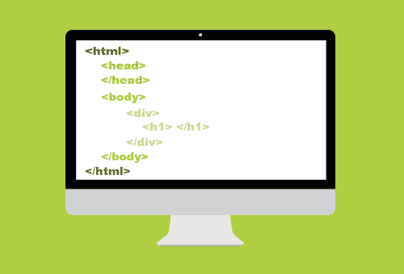

# 学习 HTML 初学者课程

> 原文：<https://www.freecodecamp.org/news/learn-html-beginners-course/>

HTML 是互联网上每个网站的支柱。如果你想从事 web 开发，学习 HTML 是开始的地方。

我们刚刚在 freeCodeCamp.org YouTube 频道上发布了一个初学者的 HTML 视频课程。(我们仍然提供免费的交互式 HTML 课程。)

戴夫·格雷创立了这门课程。Dave 是一名大学讲师、课程创建者和优秀教师。

这个完整的 HTML5 课程是开始学习 web 开发之旅的好地方。把这门课想象成一个视频教材，有 10 个明确定义的章节。

HTML creates the structure of a website.

以下是本课程涵盖的部分:

*   入门指南
*   头部元件
*   文本基础
*   列表类型
*   添加链接
*   添加图像
*   语义标签
*   创建表格
*   表单和输入
*   HTML 项目

观看以下全部课程或在 freeCodeCamp.org YouTube 频道观看[(4 小时观看)。](https://youtu.be/kUMe1FH4CHE)

[https://www.youtube.com/embed/kUMe1FH4CHE?feature=oembed](https://www.youtube.com/embed/kUMe1FH4CHE?feature=oembed)