# 通过在 AWS 中构建定制的机器映像，将基础设施作为代码来学习

> 原文：<https://www.freecodecamp.org/news/learn-instructure-as-a-code-by-building-custom-machine-image-in-aws/>

嘿大家好！如果您想知道“基础设施即代码”是什么意思，那么您来对地方了。

在本文中，我将从较高的层面解释基础设施即代码( **IaC** )背后的概念，并深入到一个被称为**服务器模板**的 IaC 类别中。

出于本文的目的，我们将使用一个名为 **Packer** 的服务器模板工具来创建一个定制的 Amazon 机器映像(AMI ),并使用它来启动一个 AWS EC2 实例。

# 什么是基础设施即代码？

‌‌Infrastructure-As-Code 是指使用代码而不是手工方法来管理和提供基础设施的过程。

核心概念是通过编写和执行代码来定义、部署、更新和销毁基础设施(服务器、数据库、网络、配置等)。

# 基础设施的类型

## 什么是可变基础设施？

您可以根据自己的需要更改和配置可变的基础设施。您可以登录服务器、应用修复、更新配置等等。

‌‌Let's 说，我们有一个 web 应用程序，我们希望部署到云或现场服务器上。

我们对该程序进行配置，以便在部署后安装所有必要的说明和配置，从而为生产做好准备。每当需要对应用程序进行新的升级/配置时，我们都会手动或自动更改服务器。

这对于一些服务器来说很棒，但是对于许多服务器来说，这可能会导致应用程序不匹配，除非您使用像 Ansible 这样的配置工具。这被称为可变基础设施。它遵循**构建、部署、配置**模式。

### 可变基础设施的优势

*   更快地解决问题。IT 人员不必从头开始构建新的服务器，而是在“个人”层面上了解每台服务器，使他们能够更快地诊断问题。
*   更新通常更快，并且可以针对每台服务器单独定制。
*   基础设施可以根据服务器端应用程序的确切需求进行定制。

### 可变基础设施的挑战

*   因为每台服务器都有独特的配置，这就是所谓的配置漂移，所以很难诊断或重现技术难题。
*   因为您必须手动配置服务器，所以配置服务器通常是一个漫长的过程。
*   服务器更改并不总是被记录，这使得版本跟踪更加复杂。
*   由于一系列无法预料的因素，如网络连接、无响应的存储库、DNS 停机时间等，更新失败会更频繁地发生。
*   如果更新应用不正确，生产工作负载的危险性和复杂性就会更高。由于这些意想不到的情况，调试是艰难的。

幸运的是，您可以使用**不可变的基础设施**来避免可变基础设施可能导致的问题。

## 什么是不可变的基础设施？

在不可变的基础设施中，组件在形成后被重新创建和替换，而不是更新。这使得你的产品更加一致和可靠。

‌‌Making 你的基础设施不可变是确保 IaC 领域可伸缩性的最佳方式。‌‌

现在，从可变基础设施中的用例来看，不是**在部署**之后配置服务器，而是**在部署**之前配置它，就像上面的可变基础设施一样，怎么样？

不可变基础设施就是基于这个概念，你可以借助 Packer 这样的技术来实现它。‌‌

### 不变基础设施的优势

*   不存在配置漂移，因为不需要进行调整。
*   使用离散版本控制，跟踪和回滚要容易得多。IT 部门可以在部署每个新服务器或虚拟机时对其进行跟踪。
*   跨几台服务器的统一设置使测试变得更加容易。
*   可预测的状态，因为基础架构从不改变，这降低了复杂性。
*   在多线程环境中，安全线程代码意味着变异几乎不存在。

### 不可变基础设施的挑战

*   基础设施已经就位，不能更改。例如，如果发现了零日漏洞，则必须更新具有相同配置的所有服务器。
*   不可变基础设施不断增加的灵活性和动态性有时会与标准 IT 安全措施相冲突。
*   将阵列数据从一个位置复制到另一个位置会产生开销。不是将数据写入本地磁盘，而是将数据外部化。

# 基础设施即代码工具的类型

IAC 工具有五大类:

*   **临时脚本**
*   **配置管理工具**
*   **编排工具**
*   **供应工具**
*   **服务器模板工具**

## 什么是即席脚本？

‌‌An 特别技术是当你用你喜欢的编程语言(如 Bash 或 Python)构建一个脚本来自动化一个任务，配置一个工具，并在服务器上运行它。

## 什么是配置管理工具？

使用现有服务器上的配置工具安装和管理‌‌Large 数量的软件。

当集群计算机时，尽可能保持硬件和软件的同质性是理想的。这有助于确保性能的一致性，以及各个节点之间的和谐相处。

配置管理工具简化了集群软件方面的管理。这些工具包括:

*   **厨师**
*   **木偶**
*   **可回答的**
*   **盐堆**

## 什么是编排工具？

‌‌How:虚拟机和容器创建后，您会对它们进行管理吗？您需要推出更新，监控虚拟机的运行状况，并在现实世界中的虚拟机和容器之间分配流量。甚至可以通过互联网相互通信(服务器发现)。

编排工具就是为处理这些问题而设计的。‌‌Orchestration 是同时自动化的许多业务，以减少生产难度和上市时间。

这些工具包括:

*   **Kubernetes**
*   **Marathon/Mesos**
*   **亚马逊弹性容器服务**
*   **码头工人群**
*   **正常值**

## 什么是配置工具？

运行在每个服务器上的代码由配置管理工具、服务器模板工具和编排工具定义。

另一方面，供应工具负责创建服务器、数据库、负载平衡器、监控、安全套接字层(SSL)证书以及基础设施的许多其他方面。

预配工具 are‌‌:示例

*   **地形**
*   **云的形成**
*   **OpenStack Heat**

## 什么是服务器模板工具？

‌‌Server 模板是配置管理的一种流行替代方案，最近受到了广泛关注。

服务器模板工具的目标是构建一个服务器映像，该映像获取操作系统(OS)、软件、文件和所有其他基本特征的完全自包含的“快照”，而不是启动多个服务器并通过在每个服务器上运行相同的代码来配置它们。

然后，您可以使用另一个 IaC 程序在所有服务器上安装该映像。

服务器模板工具的例子有:

*   **打包机**
*   **码头工人**
*   **流浪汉。**

在本文中，我将介绍如何使用 Packer 服务器模板工具生成定制映像，您将看到如何在 AWS 实例上部署定制映像。

# 打包程序和自定义图像

## 什么是 Packer？

‌‌Packer 帮助您创建和定制已经安装了特定应用程序的映像，以便复制您的程序，等等。

这些映像被称为机器映像，每个平台都有自己的映像格式名称，并预装了应用程序。

例如，以下是一些平台如何识别这些图像:

*   **亚马逊**(阿米)
*   **VMWare** (VMDK/VMX)
*   VirtualBox (OVF)

Packer 允许您生成自己的定制机器映像，并在将它部署到服务器之前将您的代码和配置放入其中。结束了。没有必要修改配置，因为它已经被嵌入到映像中了。

对于任何后续的更新，您销毁服务器并启动一个带有负载平衡器的新服务器，以帮助维持一个服务器的销毁和另一个服务器的启动。

## 岩心封隔器构造块

封隔器配置文件中有三个主要的构造块:

*   建设者
*   供给商
*   后处理器

**构建者**创建机器并生成跨平台的图像。这是非常重要的组成部分。构建器块可以接受来自不同平台的一系列不同的构建器。‌‌

**置备程序**通过第三方软件或内置软件帮助您安装、定制和配置机器映像。‌‌

并且**后处理器**在映像被构建和定制之后运行。

### 理论说够了...

现在，是我们用 Packer 建立一些不变系统的时候了，好吗？

## 先决条件和安装

*   [创建一个 AWS 账户](https://aws.amazon.com/console/)
*   [创建一个 IAM 用户](https://docs.aws.amazon.com/IAM/latest/UserGuide/id_users_create.html#id_users_create_console)
*   [创建并下载您的用户密码和访问密钥](https://docs.aws.amazon.com/IAM/latest/UserGuide/id_credentials_access-keys.html#Using_CreateAccessKey)
*   [下载并安装打包器](https://www.packer.io)

## 如何用 Packer 建立你的第一个形象

首先，创建一个名为 **packer_custom_image** 的文件夹。

打开文件夹，创建以下文件: **packer.json，variable.json，setup.sh，**和**。gitignore** 。

*   packer.json 包含了创建自定义 i=machine 映像所需的所有代码
*   **variable.json** 包含我们希望永远不对公众公开的敏感信息
*   setup.sh 包含 shell 脚本，我们将需要这些脚本来运行我们的映像
*   **。gitignore** 包含对 Git 远程服务器隐藏的文件/文件夹

注意，打包文件使用了。json 扩展，并具有类似 JavaScript JSON 脚本的格式。

### **文件夹/文件结构**

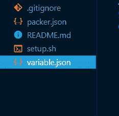

**我们开始吧！**

首先，让我们像这样在 variable.json 中定义变量和打包器构建器:

```
 { 
 	"description" : "myWebServer", 
    "access_key" : "enter-aws-your-key", 
    "secret_key" : "enter-aws-your-secret" 
    "source_ami" : "enter-yours" 
   }
```

好吧，这是怎么回事？

*   **描述**:该变量检测我们正在创建的机器映像的名称
*   **access_key** 和 **secret_key** :您创建并下载的 IAM 用户凭证。这些是包装商认证和授权所需要的。
*   **source_ami** :源 ami 是您希望用作自定义 AMI 基础的 AMI。AWS 有亚马逊 Linux，Ubuntu，Windows，Redhat 等等众多的 ami。您可以从这些图像中选择一个作为基础图像。在我们的例子中，我们将使用**亚马逊 Linux AMI。**

现在，登录到 AWS 控制台。单击服务并搜索 EC2。

单击**启动实例**按钮(我们没有启动任何实例，我们只是想复制我们的基本映像)。

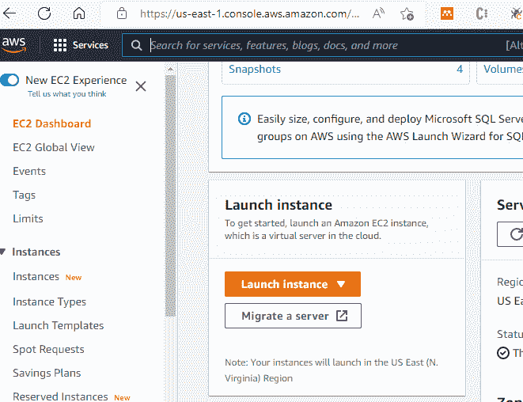

接下来，滚动到**应用和操作系统映像(亚马逊机器映像)**。点击选择亚马逊图片，然后复制你最近的 AMI。

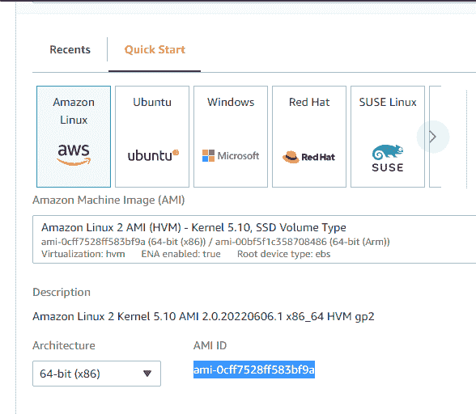

然后关闭实例**(不创建/启动)**。

接下来，让我们像这样更新 **packer.json** 文件:

```
{ 
	"builders": [ 
    	{ 
        	"type": "amazon-ebs", 
            "access_key": "{{user `access_key` }}", 
            "secret_key": "{{user `secret_key` }}", 
            "region" : "us-east-1", 
            "ami_name" : "myfirstami", 
            "source_ami" : "{{user `source_ami` }}", 
            "instance_type" : "t2.micro", 
            "ssh_username" : "ec2-user" 
         } 
    ] 
 } 
```

让我们看看这里发生了什么:

*   **构建器**:如前所述，构建器创建机器映像，并可以跨多个平台(如 AWS 和 Azure)生成相同的映像，从而生成数组。它需要建造者。
*   **类型** : 建造者类型名称
*   **访问和密钥** : 为了认证，它从我们为了安全而创建的 variable.json 文件中取数据，因此有了**“{ { user ` variable-name `} }”**格式。
*   **variable-name** :我们在 variable.json 文件中给定的名称(对于不打算公开的变量，应该使用类似的格式)
*   **区域** : 标识 AMI 区域。
*   **ami_name** :我们自定义机器镜像名称的自定义名称。
*   **源 ami** :对于我们想要从 AWS AMI 定制的机器映像。
*   **实例类型**:Packer 创建我们的图像所需的临时实例。
*   **ssh 用户名**:用于创建与构建器平台相关的临时实例的凭证。 **AWS** 是我们想到的词。

接下来，我们将使用置备程序定制映像。我们将使用 Jenkins 实例定制源 AMI。

更新 packer.json，并在构建器数组块后添加以下内容:

```
 {  ... 
 		"provisioners": 
        	[ 
            	{ 
                	"type": "shell", 
                    "script": "setup.sh" 
                 } 
             ] 
} 
```

‌‌The 的粮食供应者跟着建筑者，也拿走了一个阵列。我们可以为一个或多个构建者使用多个置备程序，这给了我们更多的灵活性。

*   **型** : 壳型是最基本也是应用最广泛的补给器。它可以接受一个脚本属性(运行我们代码的外部文件)，在命令行上运行的内联属性，或者上传文件、代码和其他图像的文件属性。
*   **脚本** : 采用外部脚本属性来运行我们的配置。

让我们设置前面创建的脚本文件。

**setup.sh**

```
sleep 30
sudo yum update –y
sudo wget -O /etc/yum.repos.d/jenkins.repo \
    https://pkg.jenkins.io/redhat-stable/jenkins.repo
sudo rpm --import https://pkg.jenkins.io/redhat-stable/jenkins.io.key
sudo yum upgrade
sudo amazon-linux-extras install java-openjdk11 -y
sudo yum install jenkins -y
sudo systemctl enable jenkins
sudo systemctl start jenkins
sudo systemctl status jenkins
```

该脚本将 Jenkins 及其依赖项安装到我们的映像中，并启动 Jenkins 实例。

可选地，我们可以传递后处理器和敏感变量。在建立和修改图像后，您可以使用许多后处理器。

‌‌ **packer.json**

```
{  ... 
		"post-processors": 
        	[ 
            	{ 
                	"type": "manifest", 
                    "output": "out.json" 
                  } 
             ] 
 } 
```

*   **type** :获取后处理器实例的类型， **manifest** type 定义了我们希望图像架构在创建后打印的方式。
*   **输出**:烘焙后图像工件的打印文件名
*   **敏感变量** ‌: **让我们添加我们的密钥和访问密钥:**

```
{...
	"sensitive-variables": 
    	[     
        	"secret_key",    "access_key"  
         ]
 }
```

## 如何运行和测试代码

‌‌In 你的终端，在根目录下，运行代码。您应该看到在您的应用程序的根目录下创建的 **out.json** 和 **out.json.lock** 。(这些文件包含您的构建和工件。)

‌‌ `packer build -var-file="variable.json" packer.json` ‌‌

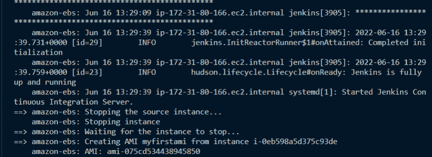

### AWS 控制台中的 AMI

现在，让我们登录 AWS 控制台，查看刚刚创建的自定义图像。我们还需要启动一个 EC2 实例来验证我们的映像是否包含了 Jenkins 实例的正确配置。

*   转到您的 AWS 控制台
*   单击服务，搜索 EC2 并滚动至图像
*   在那里单击 AMI 并找到您新创建的自定义图像

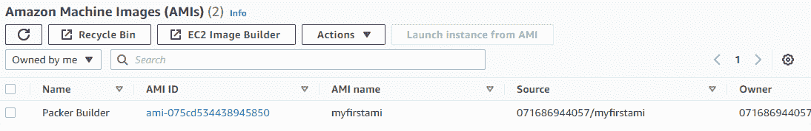

耶！我们的形象塑造成功。现在是时候从它启动一个实例了。

*   从 AMI 页面中，选择最近创建的 AMI，并单击右上角的 AMI 中的 **Launch 实例。这会将您带到实例页面。**
*   **名称和标签**–**给实例一个名称。说“我的詹金斯服务器”**
*   ****应用程序和操作系统映像(Amazon 机器映像)**应该保持不变(即我们的映像)**
*   ****实例类型**–保留默认“T2-微”。这允许我们使用 AWS 的免费层**
*   ****密钥对**–我们将需要创建一个新的密钥对，以允许我们从计算机终端登录(SSH)到实例。点击**创建新密钥**按钮，应显示以下窗口:**

**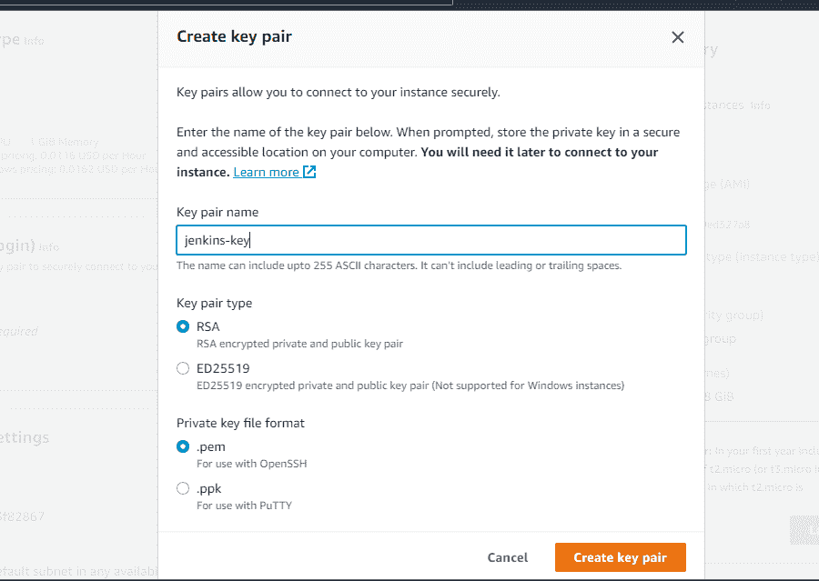

create new keypair** 

*   **给密钥对一个名称和类型。如果您使用的是 Windows，可以选择。pem 私钥文件格式，并使用您的 Windows powershell 通过 SSH 连接到服务器。或者你可以用。ppk，你还需要下载 PuTTy，这是一个帮助你对远程服务器进行 SSH 的应用程序。**
*   **单击一次创建密钥对，密钥对会自动下载到您的本地系统上(**记下文件下载位置****
*   ****网络设置**–我们需要设置一些网络，以允许访问我们的 Jenkins 实例，并允许 SSH、HTTP 和 HTTPS。因此，单击编辑并滚动到**入站安全组规则**以添加以下规则(在端口 8080 的自定义 TCP)并允许访问任何地方。为了更安全，你可以添加访问只有你的 IP 或定制你的愿望。**

**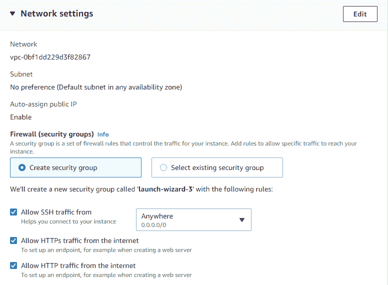****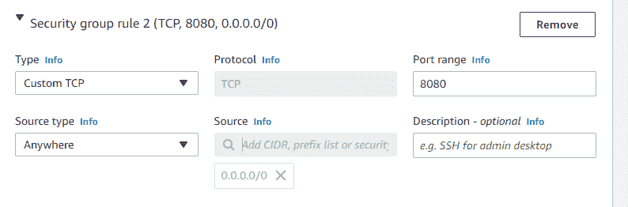**

**端口范围内的自定义 TCP 将允许我们在通过公共 IP 或 DNS 登录到 Jenkins 实例后，从浏览器中查看它。**

**将**配置存储和高级细节**保留为默认。**

**然后单击 launch，等待实例完全启动。启动后，单击该实例即可找到您的所有配置(DNS、IPs 等)**

**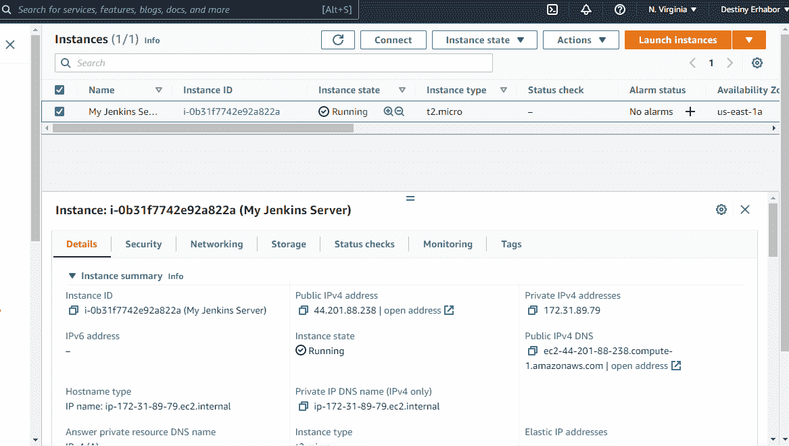**

**现在，对于最后一步，还记得下载到我们本地系统的密钥对吗？我们现在需要 SSH 到这个拥有我们的 Jenkins 服务器的实例。**

**打开您的终端(适用于 Windows 用户的 PowerShell ),输入以下正确的公共 dns or(替换为公共 ip)和密钥对路径:**

```
`ssh -i /path/key-pair-name.pem ec2-user@instance-public-dns-name`
```

**SSH to EC2-instance**

**遵循并接受提示，以成功登录。**

**输入 **`sudo systemctl status jenkins`** 来检查 Jenkins 实例的状态。如果它没有运行，在终端上输入 **`sudo systemctl start jenkins`** 启动它。**

**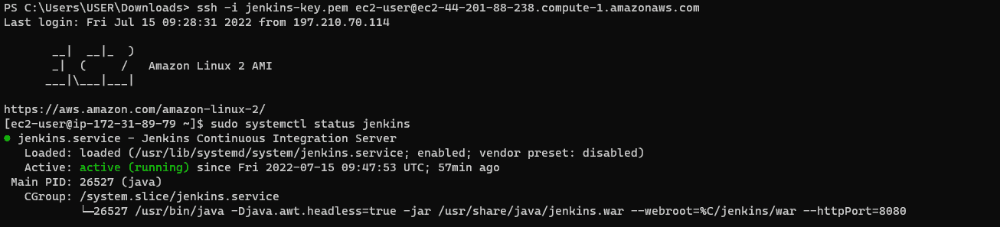

Start jenkins instance** 

**现在，让我们从浏览器启动我们的实例。打开你最喜欢的浏览器，输入“**http://44.201.88.238:8080**”查看詹金斯实例:**

**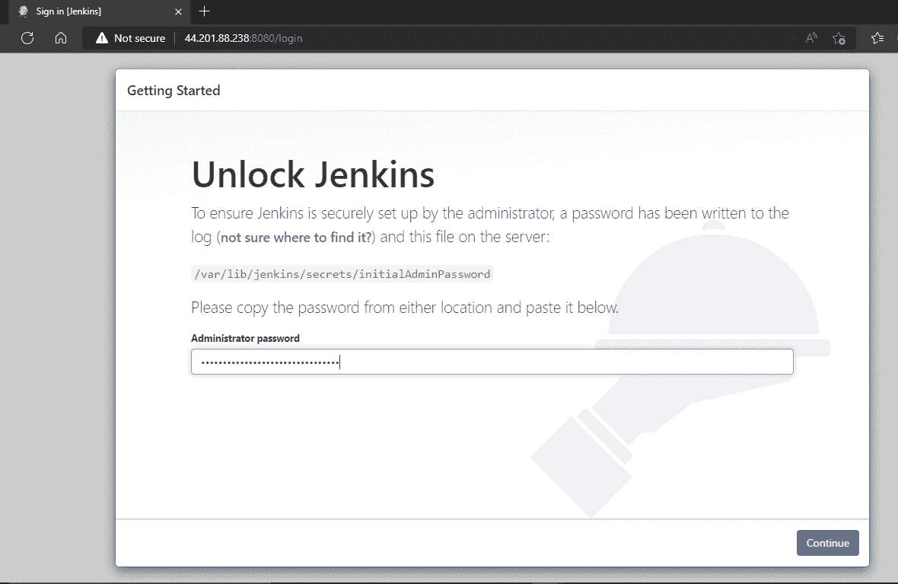**

**在 EC2 实例终端中输入以下内容，查看密码并登录。**

```
`sudo cat /var/lib/jenkins/secrets/initialAdminPassword`
```

**然后解锁并享受新创建的 Jenkins 实例的所有功能。**

**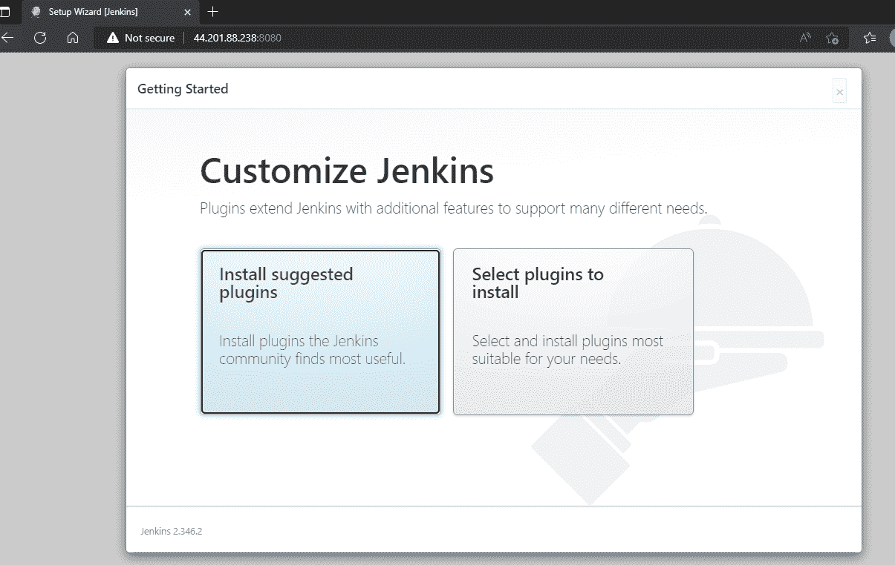**

## **恭喜你，你成功了！**

**你可以在这里看到本教程的完整代码:**

*   **[packer.json](https://gist.github.com/Caesarsage/acd419178acec18010a2f5bc51996cec)**
*   **[setup.sh](https://gist.github.com/Caesarsage/5da51fff02bb945c932029c4ba48d064)**

## **打扫**

**如果您想避免来自 AWS 的不必要的费用(基于资源使用),并且因为我们在生产中不使用它，我们应该清理我们的资源。**

**最后，您可以登录到您的 AWS console‌‌，终止带有自定义映像的 EC2 实例启动，如果您不使用它，就删除它。**

## **摘要**

**在本教程中，您已经学习了什么是高级代码基础结构，以及它如何应用于可变/不可变实践。**

**您还学习了如何使用功能强大的 Hashicorp Packer 创建自定义图像。对于我们的例子，我们在映像中定制了一个 Jenkins 服务器，但是您可以使用任何定制配置来扩展它。**

**最后，我们通过启动一个 EC2 实例来测试我们的映像。**

**我希望这篇文章能帮助你理解什么是代码基础设施，以及如何在你的应用程序中使用 it 工具。快乐学习！**