# 通过构建一个简单的食谱应用程序来学习 iOS 最佳实践

> 原文：<https://www.freecodecamp.org/news/learn-ios-best-practices-by-building-a-simple-recipes-app-9bcbce4d10d/>

作者 Khoa Pham

# 通过构建一个简单的食谱应用程序来学习 iOS 最佳实践


Source: ChefStep

我在 iOS 7 已经公布的时候就开始了 iOS 开发。通过工作，我从同事和 iOS 社区那里学到了一些建议。

在这篇文章中，我想通过一个简单的食谱应用程序的例子来分享许多好的做法。源代码在 GitHub [Recipes](https://github.com/onmyway133/recipes) 上。

该应用程序是一个传统的 master detail 应用程序，显示一系列食谱及其详细信息。

解决问题的方法有千万种，解决问题的方式也取决于个人品味。希望通过这篇文章你能学到一些有用的东西——我做这个项目的时候确实学到了很多。

我添加了一些关键词的链接，我觉得进一步阅读会有好处。所以一定要去看看。欢迎任何反馈。

所以让我们开始吧…

这是您将要构建的内容的高级概述。

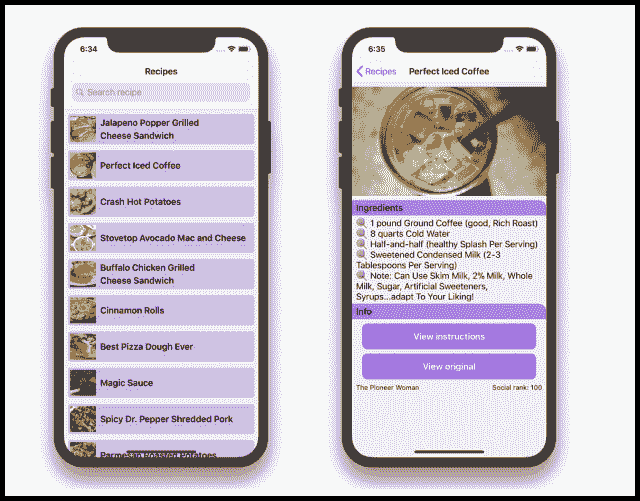

### 入门指南

让我们决定我们使用的工具和项目设置。

#### Xcode 和 Swift 版本

在 [WWDC 2018](https://developer.apple.com/videos/wwdc2018/) 大会上，苹果推出了搭载 Swift 4.2 的 Xcode 10。然而，在撰写本文时，Xcode 10 仍处于 beta 5 阶段。所以还是坚持稳定的 Xcode 9 和 Swift 4.1 吧。Xcode 4.2 有一些很酷的功能——你可以通过这个令人敬畏的[游乐场](https://github.com/ole/whats-new-in-swift-4-2)玩它。它没有**而不是**从 Swift 4.1 引入巨大的变化，因此如果需要，我们可以在不久的将来轻松更新我们的应用程序。

您应该在项目设置中设置 Swift 版本，而不是目标设置。这意味着项目中的所有目标共享相同的 Swift 版本(4.1)。

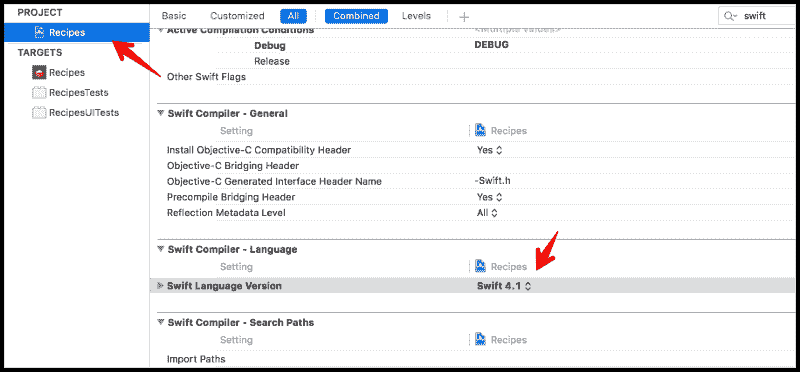

#### 支持的最低 iOS 版本

截至 2018 年夏天，iOS 12 处于公开测试版 5，我们无法在没有 Xcode 10 的情况下针对 iOS 12。在本帖中，我们使用 Xcode 9，基础 SDK 是 iOS 11。根据需求和用户群，一些应用程序需要支持旧的 iOS 版本。尽管 iOS 用户倾向于比使用 Android 的用户更快地采用新的 iOS 版本，但仍有一些用户会继续使用旧版本。按照苹果的建议，我们需要支持**两个最新版本**，分别是 iOS 10 和 iOS 11。正如[在 2018 年 5 月 31 日通过 App Store](https://developer.apple.com/support/app-store/) 测得的，只有 5%的用户使用 iOS 9 及更早版本。

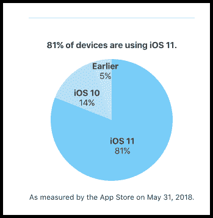

瞄准新的 iOS 版本意味着我们可以利用新的 SDK，苹果工程师每年都在改进这些 SDK。苹果开发者网站改进了变更日志视图。现在更容易看到添加或修改了什么。

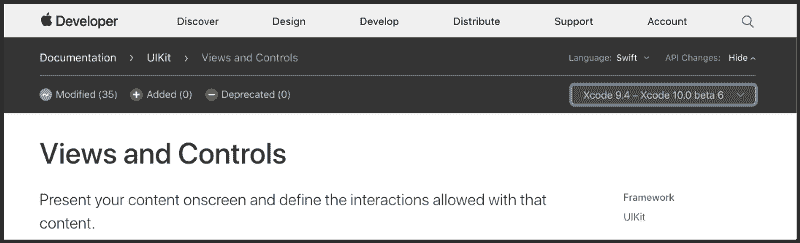

理想情况下，为了确定何时停止对旧 iOS 版本的支持，我们需要分析用户如何使用我们的应用程序。

#### 组织 Xcode 项目

当我们创建新项目时，选择“包含单元测试”和“包含 UI 测试”,因为建议尽早编写测试。最近对 XCTest 框架的修改，尤其是在 UI 测试中，使得测试变得轻而易举，并且非常稳定。

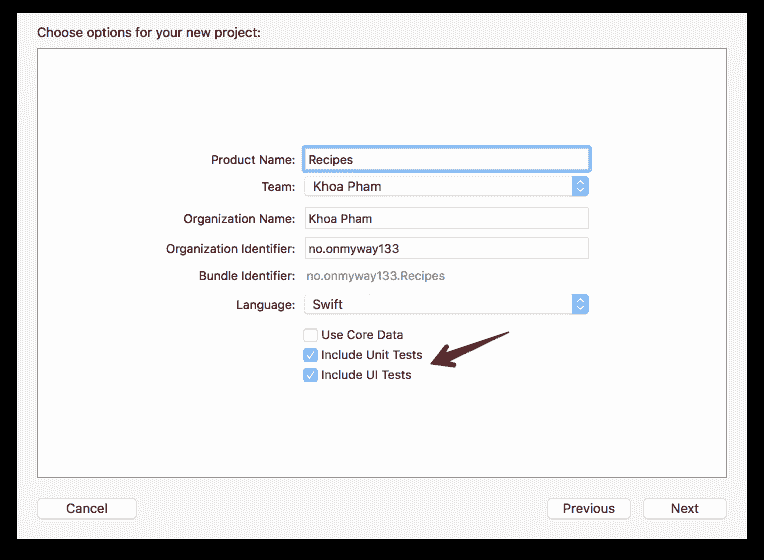

在向项目添加新文件之前，暂停一下，思考一下你的应用程序的结构。我们希望如何组织这些文件？我们有几个选择。我们可以按特性/模块或角色/类型来组织文件。每一种都有其优点和缺点，我将在下面讨论它们。

**按角色/类型:**

*   **优点**:很少考虑把文件放在哪里。应用脚本或过滤器也更容易。
*   **缺点**:如果我们想要找到与同一个特性相关的多个文件，这是很难关联的。如果我们想在将来把文件变成可重用的组件，那么重新组织文件也需要时间。

**按特征/模块**

*   优点:它让一切都模块化，鼓励构图。
*   反对意见:当许多不同类型的文件捆绑在一起时，可能会变得混乱。

#### **保持模块化**

就我个人而言，我尽量按照特性/组件来组织我的代码。这使得确定要修复的相关代码变得更容易，并且在将来更容易添加新特性。它回答了这个问题“这个应用程序是做什么的？”而不是“这是什么文件？”[这里有一篇关于这个](http://merowing.info/2014/03/subjective-guide-to-writing-ios-apps-part-1-introduction/)的好文章。

一个好的经验法则是保持一致，不管你选择哪种结构。？

### 食谱应用程序结构

以下是我们的 recipe 应用程序使用的应用程序结构:

#### **来源**

包含源代码文件，分为以下组件:

*   **功能:**app 中的主要功能
*   首页:首页屏幕，显示食谱列表和开放搜索
*   **列表:**显示配方列表，包括重新加载配方和当配方不存在时显示空视图
*   **搜索:**处理搜索和去抖
*   **详细:**显示详细信息

#### **图书馆**

包含我们应用程序的核心组件:

*   **流量:**包含流量控制器来管理流量
*   **适配器:**`UICollectionView`的通用数据源
*   **扩展:**常用操作的便捷扩展
*   **模型:**app 中的模型，解析自 JSON

#### **资源**

包含 plist、资源和情节提要文件。

### 代码约定

我同意[raywenderlich/swift-style-guide](https://github.com/raywenderlich/swift-style-guide)和 [github/swift-style-guide](https://github.com/github/swift-style-guide) 中的大部分风格指南。这些在 Swift 项目中使用起来既简单又合理。此外，查看苹果 Swift 团队制定的官方 [API 设计指南](https://swift.org/documentation/api-design-guidelines/)，了解如何编写更好的 Swift 代码。

无论你选择遵循哪种风格指南，**代码清晰**一定是你最重要的目标。

缩进和制表符-空格之战是一个敏感的话题，但同样，这取决于个人喜好。我在 Android 项目中使用四个空格缩进，在 iOS 和 React 中使用两个空格。在这个食谱应用程序中，我遵循一致且容易理解的缩进，我已经写了这里的和这里的。

#### 证明文件

好的代码应该清楚地解释自己，所以你不需要写注释。如果一段代码很难理解，最好停下来，用描述性的名称重构一些方法，这样这段代码就更容易理解了。然而，我发现记录类和方法对你的同事和未来的自己也有好处。根据 [Swift API 设计指南](https://swift.org/documentation/api-design-guidelines/)，

**为每个声明写一个文档注释**。通过编写文档获得的见解会对你的设计产生深远的影响，所以不要推迟。

用`Cmd+Alt+/`在 Xcode 中生成注释模板`///`非常容易。如果你计划将你的代码重构为一个框架，以便将来与他人分享，像 [jazzy](https://github.com/realm/jazzy) 这样的工具可以生成文档，这样其他人就可以跟着做了。

#### 标记代码段

使用`MARK`有助于分离代码段。它还在导航栏中很好地对功能进行了分组。还可以使用`extension`组、相关属性和方法。

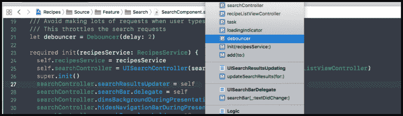

对于一个简单的`UIViewController`,我们可以定义以下标记:

```
// MARK: - Init// MARK: - View life cycle// MARK: - Setup// MARK: - Action// MARK: - Data
```

#### 源代码控制

Git 是目前流行的源代码控制系统。我们可以使用来自[gitignore.io/api/swift](https://www.gitignore.io/api/swift)的模板`.gitignore`文件。在[中签入依赖](https://guides.cocoapods.org/using/using-cocoapods#should-i-check-the-pods-directory-into-source-control)文件(CocoaPods 和 Carthage)有利也有弊。这取决于您的项目，但我倾向于不在源代码控制中提交依赖项(node_modules、Carthage、Pods ),以免弄乱代码库。这也使得查看拉取请求变得更加容易。

无论您是否签入 Pods 目录，Podfile 和 Podfile.lock 应该**始终**处于版本控制之下。

我使用 iTerm2 来执行命令，使用 [Source Tree](https://www.sourcetreeapp.com/) 来查看分支和阶段。

#### 属国

我使用过第三方框架，也为[开源](https://github.com/onmyway133/blog/issues/5)做了很多贡献。使用一个[框架](https://github.com/onmyway133/blog/issues/105)会在开始时给你一个[提升](https://github.com/onmyway133/blog/issues/85)，但是它也会在将来限制你很多。可能会有一些很难解决的细微变化。使用[SDK](https://medium.com/fantageek/dear-sdk-developers-d8e1434fb702)时也会发生同样的事情。我倾向于选择活跃的开源框架。仔细阅读源代码并检查框架，如果您打算使用它们，请咨询您的团队。多一点小心没有坏处。

在这个应用中，我尽量少用依赖。仅仅足以演示如何管理依赖关系。一些有经验的开发人员可能更喜欢依赖管理器 [Carthage](https://github.com/Carthage/Carthage) ，因为它给了你完全的控制权。这里我选择了 [CocoaPods](https://github.com/CocoaPods/CocoaPods) ，因为它很容易使用，而且到目前为止效果很好。

项目的根目录下有一个名为`.swift-version`的文件，值为`4.1`，告诉 CocoaPods 这个项目使用的是 Swift 4.1。这看起来很简单，但我花了很长时间才弄明白。☹️

### 进入项目

让我们制作一些启动图像和图标，给这个项目一个漂亮的外观。

#### 应用程序接口

学习 iOS 网络的简单方法是通过公共的免费 API 服务。这里我用 food2fork。您可以在[http://food2fork.com/about/api](http://food2fork.com/about/api)注册账户。在这个 [public-api](https://github.com/toddmotto/public-apis) 库中还有许多其他令人敬畏的 api。

最好将您的凭据保存在安全的地方。我使用 [1Password](https://1password.com/) 来生成和存储我的密码。

在我们开始编码之前，让我们先玩玩 API，看看它们需要什么类型的请求以及它们返回什么类型的响应。我使用[失眠症](https://github.com/getinsomnia/insomnia)工具来测试和分析 API 响应。它是开源的，免费的，而且非常好用。？

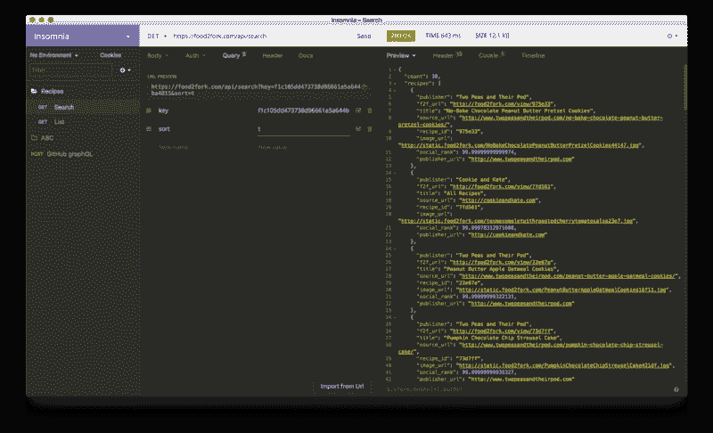

#### 启动屏幕

第一印象很重要，启动画面也很重要。首选的方法是使用`LaunchScreen.storyboard`而不是静态启动图像。

要给`Asset Catalog`添加发射图像，打开`LaunchScreen.storyboard`，添加`UIImageView`，并将其固定在`UIView`的边缘。我们不应该将图像固定在安全区域，因为我们希望图像全屏显示。此外，取消选择自动布局约束中的任何边距。将`UIImageView`的`contentMode`设置为`Aspect Fill`，使其以正确的纵横比拉伸。

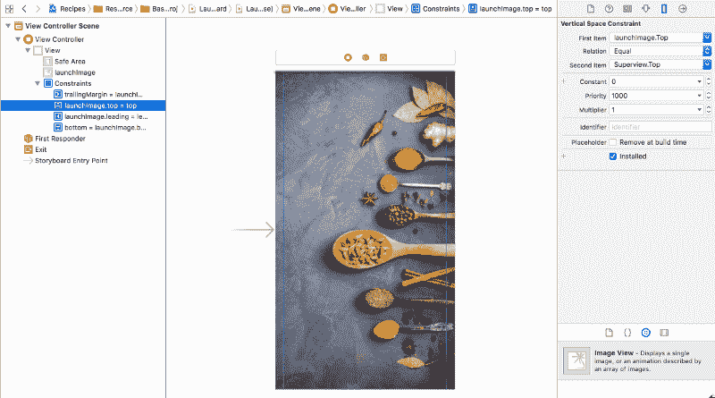

Configure layout in LaunchScreen.

#### 应用程序图标

一个好的做法是为你支持的每个设备提供所有必要的应用程序图标，以及通知、设置和跳板等地方。确保每个图像没有透明像素，否则会导致黑色背景。这个提示来自[人机界面指南-应用图标](https://developer.apple.com/ios/human-interface-guidelines/icons-and-images/app-icon/)。

**保持背景简单，避免透明**。确保你的图标是不透明的，不要弄乱背景。给它一个简单的背景，这样它就不会压倒附近的其他应用程序图标。你不需要用内容填满整个图标。

我们需要设计尺寸大于 1024 x 1024 的正方形图像，这样每个图像都可以缩小到更小的图像。你可以用手，脚本，或者使用我做的这个小的[图标生成器](https://github.com/onmyway133/IconGenerator)应用程序来完成。

IconGenerator 应用程序可以在 iPhone、iPad、macOS 和 watchOS 应用程序中为 iOS 生成图标。结果是我们可以直接拖到资产目录中的`AppIcon.appiconset`。资产目录是现代 Xcode 项目的必由之路。

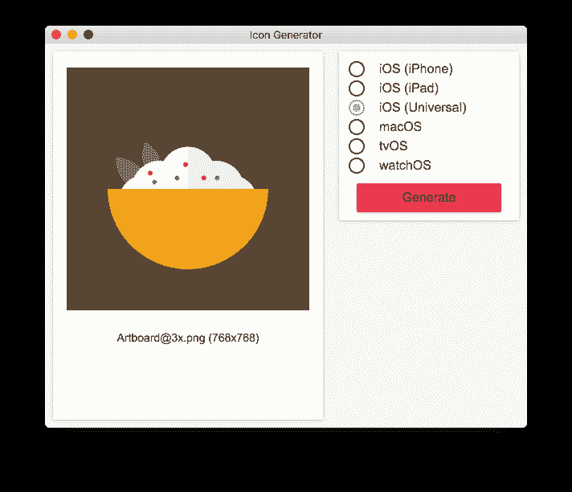

#### 使用 SwiftLint 的林挺代码

不管我们在什么平台上开发，有一个 linter 来执行一致的约定是很好的。Swift 项目最受欢迎的工具是 [SwiftLint](https://github.com/realm/SwiftLint) ，由[领域](https://realm.io/)的优秀人员开发。

要安装它，将`pod 'SwiftLint', '~> 0.`25’添加到 t `he Podf`文件中。这也是一个很好的实践，指定[他的版本](https://guides.cocoapods.org/syntax/podfile.html#pod)依赖`so pod inst`都不会意外更新到一个可能会破坏你的应用程序的主要版本。然后用您喜欢的配置添加 `a .swiftlint.` yml。这里可以找到一个示例配置。

最后，添加一个新的运行脚本短语，在编译后执行`swiftlint`。

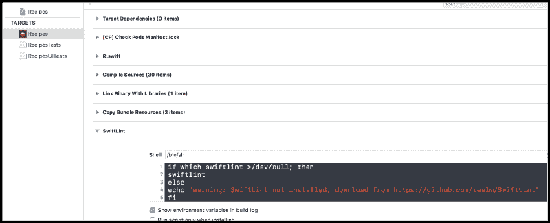

#### 类型安全资源

我使用 [R.swift](https://github.com/mac-cain13/R.swift) 安全地管理资源。它可以生成类型安全的类来访问字体、可本地化的字符串和颜色。每当我们改变资源文件名时，我们得到的是编译错误，而不是隐含的崩溃。这阻止了我们对正在使用的资源进行推断。

```
imageView.image = R.image.notFound()
```

### 给我看看代码

让我们深入代码，从模型、流控制器和服务类开始。

#### 设计模型

这听起来可能很无聊，但是客户端只是表示 API 响应的一种更好的方式。模型可能是最基本的东西，我们在应用程序中经常使用它。它扮演着如此重要的角色，但是可能会有一些明显的错误，这些错误与畸形的模型和关于应该如何解析模型的假设有关，需要加以考虑。

我们应该测试每个型号的应用程序。理想情况下，我们需要从 API 响应中自动测试模型，以防模型从后端发生变化。

从 Swift 4.0 开始，我们可以让我们的模型符合 [Codable](https://developer.apple.com/documentation/swift/codable) 来轻松地序列化 JSON。我们的模型应该是不可变的:

```
struct Recipe: Codable {  let publisher: String  let url: URL  let sourceUrl: String  let id: String  let title: String  let imageUrl: String  let socialRank: Double  let publisherUrl: URL
```

```
enum CodingKeys: String, CodingKey {    case publisher    case url = "f2f_url"    case sourceUrl = "source_url"    case id = "recipe_id"    case title    case imageUrl = "image_url"    case socialRank = "social_rank"    case publisherUrl = "publisher_url"  }}
```

如果您喜欢花哨的语法或 RSpec 风格，我们可以使用一些测试框架。一些第三方测试框架可能会有问题。我觉得`XCTest`足够好了。

```
import XCTest@testable import Recipes
```

```
class RecipesTests: XCTestCase {  func testParsing() throws {    let json: [String: Any] = [      "publisher": "Two Peas and Their Pod",      "f2f_url": "http://food2fork.com/view/975e33",      "title": "No-Bake Chocolate Peanut Butter Pretzel Cookies",      "source_url": "http://www.twopeasandtheirpod.com/no-bake-chocolate-peanut-butter-pretzel-cookies/",      "recipe_id": "975e33",      "image_url": "http://static.food2fork.com/NoBakeChocolatePeanutButterPretzelCookies44147.jpg",      "social_rank": 99.99999999999974,      "publisher_url": "http://www.twopeasandtheirpod.com"    ]
```

```
let data = try JSONSerialization.data(withJSONObject: json, options: [])    let decoder = JSONDecoder()    let recipe = try decoder.decode(Recipe.self, from: data)
```

```
XCTAssertEqual(recipe.title, "No-Bake Chocolate Peanut Butter Pretzel Cookies")    XCTAssertEqual(recipe.id, "975e33")    XCTAssertEqual(recipe.url, URL(string: "http://food2fork.com/view/975e33")!)  }}
```

#### 利用流量控制器实现更好的导航

之前，我在我的项目中使用 [Compass](https://github.com/hyperoslo/Compass) 作为[路由引擎](https://medium.com/flawless-app-stories/url-routing-with-compass-d59c0061e7e2)，但是随着时间的推移，我发现编写简单的路由代码也可以工作。

流量控制器用于将许多`UIViewController`相关组件管理成一个公共特性。你可能想阅读[流量控制器和协调器](https://github.com/onmyway133/blog/issues/106)的其他用例，以获得更好的理解。

有管理变化的`rootViewController`的`AppFlowController`。现在，它开始了`RecipeFlowController`。

```
window = UIWindow(frame: UIScreen.main.bounds)window?.rootViewController = appFlowControllerwindow?.makeKeyAndVisible()appFlowController.start()
```

`RecipeFlowController`管理`UINavigationController`(事实上是 T1)，T1 处理推送`HomeViewController, RecipesDetailViewController, SafariViewController`。

```
final class RecipeFlowController: UINavigationController {  /// Start the flow  func start() {    let service = RecipesService(networking: NetworkService())    let controller = HomeViewController(recipesService: service)    viewControllers = [controller]    controller.select = { [weak self] recipe in      self?.startDetail(recipe: recipe)    }  }
```

```
private func startDetail(recipe: Recipe) {}  private func startWeb(url: URL) {}}
```

`UIViewController`可以使用`delegate`或`closure`通知`FlowController`流程中的变更或下一个屏幕。对于`delegate`,当同一个类有两个**实例时，可能需要检查。为了简单起见，这里我们使用`closure`。**

#### 自动布局

自动布局从 iOS 5 开始就有了，一年比一年好。虽然有些人仍然有问题，主要是因为混淆打破限制和性能，但我个人认为自动布局已经足够好了。

我尽可能多地使用自动布局来制作一个自适应的 UI。我们可以使用像 [Anchors](https://github.com/onmyway133/Anchors) 这样的库来做声明性的快速自动布局。然而，在这个应用程序中，我们将只使用`NSLayoutAnchor`，因为它来自 iOS 9。下面的代码受[约束](https://github.com/hyperoslo/Sugar/blob/master/Sources/iOS/Constraint.swift) t 的启发。记住，自动布局最简单的形式包括切换`translatesAutoresizingMaskIntoConstraints`和激活`isActive`约束。

```
extension NSLayoutConstraint {  static func activate(_ constraints: [NSLayoutConstraint]) {    constraints.forEach {      ($0.firstItem as? UIView)?.translatesAutoresizingMaskIntoConstraints = false      $0.isActive = true    }  }}
```

GitHub 上其实还有很多其他的布局引擎。要了解哪一个适合使用，请查看 [LayoutFrameworkBenchmark](https://github.com/layoutBox/LayoutFrameworkBenchmark) 。

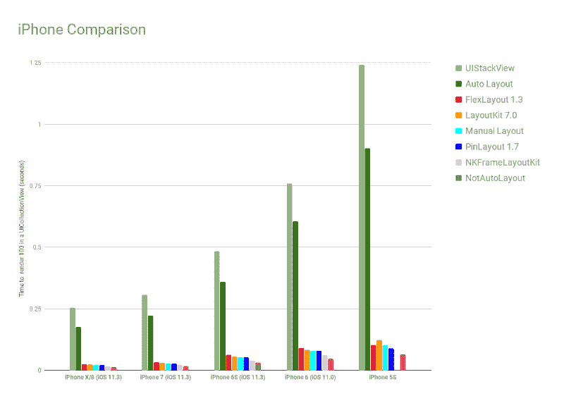

#### 体系结构

建筑可能是被炒作和讨论最多的话题。我是一个探索架构的爱好者，你可以在这里查看更多关于不同架构的帖子和框架。

对我来说，所有的架构和模式都定义了每个对象的角色以及如何连接它们。请记住您选择架构的这些指导原则:

*   封装变化的内容
*   偏爱合成而非遗传
*   程序到接口，而不是实现

在尝试了许多不同的架构之后，不管有没有 Rx，我发现简单的 MVC 已经足够好了。在这个简单的项目中，只有封装在 helper `Service`类中的逻辑`UIViewController`，

#### 海量视图控制器

你可能听过有人开玩笑说`UIViewController`有多巨大，但事实上，没有巨大的视图控制器。只是我们写了糟糕的代码。然而有办法将[苗条](http://khanlou.com/2014/09/8-patterns-to-help-you-destroy-massive-view-controller/)的身材降下来。

在我使用的食谱应用程序中，

*   `Service`注入到视图控制器中执行单个任务
*   `Generic View`将视图和控件声明移动到`View`层
*   `Child view controller`合成子视图控制器以构建更多功能

这里的是一篇非常好的文章，有 8 个给大控制器瘦身的技巧。

#### 访问控制

SWIFT [文档](https://developer.apple.com/library/content/documentation/Swift/Conceptual/Swift_Programming_Language/AccessControl.html)提到“访问控制限制从其他源文件和模块中的代码访问您的部分代码。此功能使您能够隐藏代码的实现细节，并指定可以通过其访问和使用代码的首选接口。

一切默认应该是`private`和`final`。这也有助于[编译器](https://developer.apple.com/swift/blog/?id=27)。当看到一个公共属性时，我们需要在项目中搜索它，然后再对它做进一步的操作。如果该属性只在一个`class`中使用，那么将它设为`private`意味着我们不需要关心它是否会在其他地方中断。

尽可能将属性声明为`final`。

```
final class HomeViewController: UIViewController {}
```

将属性声明为`private`或至少为`private(set)`。

```
final class RecipeDetailView: UIView {  private let scrollableView = ScrollableView()  private(set) lazy var imageView: UIImageView = self.makeImageView()}
```

#### 惰性属性

对于可以在以后访问的属性，我们可以将它们声明为`lazy`，并使用`closure`进行快速构造。

```
final class RecipeCell: UICollectionViewCell {  private(set) lazy var containerView: UIView = {    let view = UIView()    view.clipsToBounds = true    view.layer.cornerRadius = 5    view.backgroundColor = Color.main.withAlphaComponent(0.4)
```

```
return view  }()}
```

如果我们计划为多个属性重用同一个函数，我们也可以使用`make`函数。

```
final class RecipeDetailView: UIView {  private(set) lazy var imageView: UIImageView = self.makeImageView()
```

```
private func makeImageView() -> UIImageView {    let imageView = UIImageView()    imageView.contentMode = .scaleAspectFill    imageView.clipsToBounds = true    return imageView  }}
```

这也符合来自[争取流畅使用](https://swift.org/documentation/api-design-guidelines/)的建议。

工厂方法的名称以“make”开头，例如，`x.makeIterator()`。

#### 代码片段

有些代码语法很难记住。考虑使用代码片段来自动生成代码。这是 Xcode 支持的，也是 Apple 工程师演示时的首选方式。

```
if #available(iOS 11, *) {  viewController.navigationItem.searchController = searchController  viewController.navigationItem.hidesSearchBarWhenScrolling = false} else {  viewController.navigationItem.titleView = searchController.searchBar}
```

我制作了一个 [repo](https://github.com/hyperoslo/SwiftSnippets) ，里面有一些很多人喜欢使用的有用的 Swift 片段。

#### 建立工作关系网

Swift 的联网是一个已经解决的问题。有些繁琐且容易出错的任务，比如解析 HTTP 响应、处理请求队列、处理参数查询。我见过关于补丁请求的 bug，[小写 HTTP 方法](https://github.com/onmyway133/blog/issues/115)，…我们可以只使用 [Alamofire](https://github.com/Alamofire/Alamofire) 。没必要在这里浪费时间。

对于这个应用程序，因为它很简单，以避免不必要的依赖。我们直接用`URLSession`就可以了。资源通常包含 URL、路径、参数和 HTTP 方法。

```
struct Resource {  let url: URL  let path: String?  let httpMethod: String  let parameters: [String: String]}
```

一个简单的网络服务可以解析`Resource`到`URLRequest`，并告诉`URLSession`执行

```
final class NetworkService: Networking {  @discardableResult func fetch(resource: Resource, completion: @escaping (Data?) -> Void) -> URLSessionTask? {    guard let request = makeRequest(resource: resource) else {      completion(nil)      return nil    }
```

```
let task = session.dataTask(with: request, completionHandler: { data, _, error in      guard let data = data, error == nil else {        completion(nil)        return      }
```

```
completion(data)    })
```

```
task.resume()    return task  }}
```

使用依赖注入。允许呼叫者指定`URLSessionConfiguration`。这里我们利用 Swift 默认参数来提供最常见的选项。

```
init(configuration: URLSessionConfiguration = URLSessionConfiguration.default) {  self.session = URLSession(configuration: configuration)}
```

我也使用 iOS 8 的 URLQueryItem。它使得解析查询项的参数变得更好，也不那么繁琐。

#### 如何测试网络代码

我们可以使用 [URLProtocol](https://developer.apple.com/documentation/foundation/urlprotocol) 和 [URLCache](https://developer.apple.com/documentation/foundation/urlcache) 为网络响应添加一个存根，或者我们可以使用像 [Mockingjay](https://github.com/kylef/Mockingjay) 这样的框架来搅拌`URLSessionConfiguration`。

我自己更喜欢使用协议来测试。通过使用该协议，测试可以创建一个模拟请求来提供存根响应。

```
protocol Networking {  @discardableResult func fetch(resource: Resource, completion: @escaping (Data?) -> Void) -> URLSessionTask?}
```

```
final class MockNetworkService: Networking {  let data: Data  init(fileName: String) {    let bundle = Bundle(for: MockNetworkService.self)    let url = bundle.url(forResource: fileName, withExtension: "json")!    self.data = try! Data(contentsOf: url)  }
```

```
func fetch(resource: Resource, completion: @escaping (Data?) -> Void) -> URLSessionTask? {    completion(data)    return nil  }}
```

#### 为离线支持实现缓存

我过去经常贡献和使用一个叫做 [Cache](https://github.com/hyperoslo/Cache) 的库。我们从一个好的缓存库中需要的是内存和磁盘缓存，内存用于快速访问，磁盘用于持久性。当我们保存时，我们保存到内存和磁盘。当我们加载时，如果内存缓存失败，我们从磁盘加载，然后再次更新内存。有许多关于缓存的高级主题，如清除、到期、访问频率。这里有一个关于他们的。

在这个简单的应用程序中，一个自己开发的缓存服务类就足够了，这是了解缓存如何工作的好方法。Swift 中的所有内容都可以转换成`Data`，所以我们只需将`Data`保存到缓存中。Swift 4 `Codable`可以将对象序列化到`Data`。

下面的代码向我们展示了如何使用`FileManager`进行磁盘缓存。

```
/// Save and load data to memory and disk cachefinal class CacheService {
```

```
/// For get or load data in memory  private let memory = NSCache<NSString, NSData>()
```

```
/// The path url that contain cached files (mp3 files and image files)  private let diskPath: URL
```

```
/// For checking file or directory exists in a specified path  private let fileManager: FileManager
```

```
/// Make sure all operation are executed serially  private let serialQueue = DispatchQueue(label: "Recipes")
```

```
init(fileManager: FileManager = FileManager.default) {    self.fileManager = fileManager    do {      let documentDirectory = try fileManager.url(        for: .documentDirectory,        in: .userDomainMask,        appropriateFor: nil,        create: true      )      diskPath = documentDirectory.appendingPathComponent("Recipes")      try createDirectoryIfNeeded()    } catch {      fatalError()    }  }
```

```
func save(data: Data, key: String, completion: (() -> Void)? = nil) {    let key = MD5(key)
```

```
serialQueue.async {      self.memory.setObject(data as NSData, forKey: key as NSString)      do {        try data.write(to: self.filePath(key: key))        completion?()      } catch {        print(error)      }    }  }}
```

为了避免格式错误和很长的文件名，我们可以散列它们。我使用来自 [SwiftHash](https://github.com/onmyway133/SwiftHash) 的 MD5，它给出了非常简单的用法`let key = MD5(key)`。

#### 如何测试缓存

因为我将`Cache`操作设计成异步的，所以我们需要使用`test expectation`。请记住在每次测试前重置状态，以便先前的测试状态不会干扰当前的测试。`XCTestCase`中的`expectation`使得测试异步代码比以往更加容易。？

```
class CacheServiceTests: XCTestCase {  let service = CacheService()
```

```
override func setUp() {    super.setUp()
```

```
try? service.clear()  }
```

```
func testClear() {    let expectation = self.expectation(description: #function)    let string = "Hello world"    let data = string.data(using: .utf8)!
```

```
service.save(data: data, key: "key", completion: {      try? self.service.clear()      self.service.load(key: "key", completion: {        XCTAssertNil($0)        expectation.fulfill()      })    })
```

```
wait(for: [expectation], timeout: 1)  }}
```

#### 加载远程图像

我也参与了[虚拟](https://github.com/hyperoslo/Imaginary)的工作，所以我对它的工作原理有所了解。对于远程图像，我们需要下载并缓存它，缓存键通常是远程图像的 URL。

在我们的 recipese 应用程序中，让我们基于我们的`NetworkService`和`CacheService`构建一个简单的 ImageService。基本上，图像只是我们下载并缓存的网络资源。我们更喜欢组合，所以我们将把`NetworkService`和`CacheService`包含到`ImageService`中。

```
/// Check local cache and fetch remote imagefinal class ImageService {
```

```
private let networkService: Networking  private let cacheService: CacheService  private var task: URLSessionTask?
```

```
init(networkService: Networking, cacheService: CacheService) {    self.networkService = networkService    self.cacheService = cacheService  }}
```

我们通常有带`UIImageView`的`UICollectionView`和`UITableView`细胞。由于单元被重用，我们需要在发出新请求之前取消任何现有的`request task`。

```
func fetch(url: URL, completion: @escaping (UIImage?) -> Void) {  // Cancel existing task if any  task?.cancel()
```

```
// Try load from cache  cacheService.load(key: url.absoluteString, completion: { [weak self] cachedData in    if let data = cachedData, let image = UIImage(data: data) {      DispatchQueue.main.async {        completion(image)      }    } else {      // Try to request from network      let resource = Resource(url: url)      self?.task = self?.networkService.fetch(resource: resource, completion: { networkData in        if let data = networkData, let image = UIImage(data: data) {          // Save to cache          self?.cacheService.save(data: data, key: url.absoluteString)          DispatchQueue.main.async {            completion(image)          }        } else {          print("Error loading image at \(url)")        }      })
```

```
self?.task?.resume()    }  })}
```

#### 使 UIImageView 的图像加载更加方便

让我们给`UIImageView`添加一个扩展来从 URL 设置远程图像。我使用`associated object`来保留这个`ImageService`并取消旧的请求。我们很好的利用了`associated object`将`ImageService`附加到`UIImageView`。重点是当请求再次被触发时取消当前请求。当图像视图在滚动列表中呈现时，这很方便。

```
extension UIImageView {  func setImage(url: URL, placeholder: UIImage? = nil) {    if imageService == nil {      imageService = ImageService(networkService: NetworkService(), cacheService: CacheService())    }
```

```
self.image = placeholder    self.imageService?.fetch(url: url, completion: { [weak self] image in      self?.image = image    })  }
```

```
private var imageService: ImageService? {    get {      return objc_getAssociatedObject(self, &AssociateKey.imageService) as? ImageService    }    set {      objc_setAssociatedObject(        self,        &AssociateKey.imageService,        newValue,        objc_AssociationPolicy.OBJC_ASSOCIATION_RETAIN_NONATOMIC      )    }  }}
```

#### UITableView 和 UICollectionView 的一般数据源

我们几乎在每个应用程序中都使用`UITableView`和`UICollectionView`，并且几乎重复执行相同的事情。

*   加载时显示刷新控件
*   如果有数据，重新加载列表
*   失败时显示错误。

围绕`UITableView`和`UICollection`有很多包装器。每一个都增加了另一层抽象，这给了我们更多的能力，但同时也施加了限制。

在这个应用程序中，我使用`Adapter`来获取一个通用数据源，以创建一个类型安全的集合。因为，最终，我们需要的只是从模型到细胞的映射。

我也是基于这个想法利用[上游](https://github.com/hyperoslo/Upstream)。很难包装`UITableView`和`UICollectionView`，因为很多时候，它是特定于应用程序的，所以像`Adapter`这样的薄包装就足够了。

```
final class Adapter<T, Cell: UICollectionViewCell>: NSObject,UICollectionViewDataSource, UICollectionViewDelegateFlowLayout {  var items: [T] = []  var configure: ((T, Cell) -> Void)?  var select: ((T) -> Void)?  var cellHeight: CGFloat = 60}
```

#### 控制器和视图

因为很多限制和问题，我放弃了故事板。相反，我使用代码来创建视图和定义约束。这并不难理解。`UIViewController`中的大部分样板代码用于创建视图和配置布局。让我们把这些移到视图中。你可以在这里阅读更多关于那个[的内容。](https://github.com/onmyway133/blog/issues/37)

```
/// Used to separate between controller and viewclass BaseController<T: UIView>: UIViewController {  let root = T()
```

```
override func loadView() {    view = root  }}
```

```
final class RecipeDetailViewController: BaseController<RecipeDetailView> {}
```

#### 用子视图控制器处理责任

视图控制器容器是一个强大的概念。每个视图控制器都有一个独立的关注点，可以组合在一起创建高级特性。我已经使用了`RecipeListViewController`来管理`UICollectionView`并显示食谱列表。

```
final class RecipeListViewController: UIViewController {  private(set) var collectionView: UICollectionView!  let adapter = Adapter<Recipe, RecipeCell>()  private let emptyView = EmptyView(text: "No recipes found!")}
```

还有嵌入这个`RecipeListViewController`的`HomeViewController`

```
/// Show a list of recipesfinal class HomeViewController: UIViewController {
```

```
/// When a recipe get select  var select: ((Recipe) -> Void)?
```

```
private var refreshControl = UIRefreshControl()  private let recipesService: RecipesService  private let searchComponent: SearchComponent  private let recipeListViewController = RecipeListViewController()}
```

#### 组合和依赖注入

我尽可能尝试构建组件和编写代码。我们看到`ImageService`利用了`NetworkService`和`CacheService`，而`RecipeDetailViewController`利用了`Recipe`和`RecipesService`

理想情况下，对象不应该自己创建依赖关系。依赖关系应该在外部创建，并从[根](http://blog.ploeh.dk/2011/07/28/CompositionRoot/)传递下来。在我们的应用程序中，根是`AppDelegate`和`AppFlowController`，因此依赖关系应该从这里开始。

#### App 传输安全性


从 iOS 9 开始，所有 App 都要采用 [App 传输安全](https://developer.apple.com/library/content/releasenotes/General/WhatsNewIniOS/Articles/iOS9.html)

> *应用传输安全(ATS)在应用与其后端之间的安全连接中实施最佳实践。ATS 防止意外泄露，提供安全的默认行为，易于采用；在 iOS 9 和 OS X v10.11 中，它也是默认打开的。无论你是创建一个新的应用程序还是更新现有的应用程序，你都应该尽快采用 ATS。*

在我们的应用程序中，一些图像是通过`HTTP`连接获得的。我们需要将其从安全规则中排除，但仅限于该域。

```
<key>NSAppTransportSecurity</key><dict>  <key>NSExceptionDomains</key>  <dict>    <key>food2fork.com</key>    <dict>      <key>NSIncludesSubdomains</key>      <true/>      <key>NSExceptionAllowsInsecureHTTPLoads</key>      <true/>    </dict>  </dict></dict>
```

#### 自定义可滚动视图

对于细节屏幕，我们可以将`UITableView`和`UICollectionView`用于不同的单元格类型。在这里，视图应该是静态的。我们可以使用`UIStackView`进行堆叠。为了更加灵活，我们可以使用`UIScrollView`。

```
/// Vertically layout view using Auto Layout in UIScrollViewfinal class ScrollableView: UIView {  private let scrollView = UIScrollView()  private let contentView = UIView()
```

```
override init(frame: CGRect) {    super.init(frame: frame)
```

```
scrollView.showsHorizontalScrollIndicator = false    scrollView.alwaysBounceHorizontal = false    addSubview(scrollView)
```

```
scrollView.addSubview(contentView)
```

```
NSLayoutConstraint.activate([      scrollView.topAnchor.constraint(equalTo: topAnchor),      scrollView.bottomAnchor.constraint(equalTo: bottomAnchor),      scrollView.leftAnchor.constraint(equalTo: leftAnchor),      scrollView.rightAnchor.constraint(equalTo: rightAnchor),
```

```
contentView.topAnchor.constraint(equalTo: scrollView.topAnchor),      contentView.bottomAnchor.constraint(equalTo: scrollView.bottomAnchor),      contentView.leftAnchor.constraint(equalTo: leftAnchor),      contentView.rightAnchor.constraint(equalTo: rightAnchor)    ])  }}
```

我们把`UIScrollView`钉在边缘上。我们将`contentView`左右锚钉在`self`上，同时将`contentView`上下锚钉在`UIScrollView`上。

`contentView`中的视图有顶部和底部约束，所以当它们扩展时，它们也会扩展`contentView`。`UIScrollView`使用来自此`contentView`的自动布局信息来确定其`contentSize`。下面是`ScrollableView`在`RecipeDetailView`中的使用方法。

```
scrollableView.setup(pairs: [  ScrollableView.Pair(view: imageView, inset: UIEdgeInsets(top: 8, left: 0, bottom: 0, right: 0)),  ScrollableView.Pair(view: ingredientHeaderView, inset: UIEdgeInsets(top: 8, left: 0, bottom: 0, right: 0)),  ScrollableView.Pair(view: ingredientLabel, inset: UIEdgeInsets(top: 4, left: 8, bottom: 0, right: 0)),  ScrollableView.Pair(view: infoHeaderView, inset: UIEdgeInsets(top: 4, left: 0, bottom: 0, right: 0)),  ScrollableView.Pair(view: instructionButton, inset: UIEdgeInsets(top: 8, left: 20, bottom: 0, right: 20)),  ScrollableView.Pair(view: originalButton, inset: UIEdgeInsets(top: 8, left: 20, bottom: 0, right: 20)),  ScrollableView.Pair(view: infoView, inset: UIEdgeInsets(top: 16, left: 0, bottom: 20, right: 0))])
```

#### 添加搜索功能

从 iOS 8 开始，我们可以使用 [UISearchController](https://developer.apple.com/documentation/uikit/uisearchcontroller) 来获得搜索栏和结果控制器的默认搜索体验。我们将把搜索功能封装到`SearchComponent`中，这样它就可以是可插拔的。

```
final class SearchComponent: NSObject, UISearchResultsUpdating, UISearchBarDelegate {  let recipesService: RecipesService  let searchController: UISearchController  let recipeListViewController = RecipeListViewController()}
```

从 [iOS 11](https://www.hackingwithswift.com/articles/5/how-to-adopt-ios-11-user-interface-changes-in-your-app) 开始，`UINavigationItem`上有一个名为`searchController`的属性，使得在导航栏上显示搜索栏变得很容易。

```
func add(to viewController: UIViewController) {  if #available(iOS 11, *) {    viewController.navigationItem.searchController = searchController    viewController.navigationItem.hidesSearchBarWhenScrolling = false  } else {    viewController.navigationItem.titleView = searchController.searchBar  }
```

```
viewController.definesPresentationContext = true}
```

在这个应用程序中，我们现在需要禁用`hidesNavigationBarDuringPresentation`，因为它有很多问题。希望它能在未来的 iOS 更新中得到解决。

#### 理解演示上下文

理解表示上下文对于视图控制器的表示至关重要。在搜索中，我们使用`searchResultsController`。

```
self.searchController = UISearchController(searchResultsController: recipeListViewController)
```

我们需要在源视图控制器(我们添加搜索栏的视图控制器)上使用[definepresentationcontext](https://developer.apple.com/documentation/uikit/uiviewcontroller/1621456-definespresentationcontext)。如果没有这个，我们会得到全屏显示的`searchResultsController`！！！

> *当使用 currentContext 或 overCurrentContext 样式来呈现视图控制器时，该属性控制新内容实际上覆盖了视图控制器层次结构中的哪个现有视图控制器。当基于上下文的呈现发生时，UIKit 从呈现视图控制器开始，沿着视图控制器层次结构向上移动。如果它找到一个视图控制器，其属性值为 true，它会要求该视图控制器显示新的视图控制器。如果没有视图控制器定义表示上下文，UIKit 会要求窗口的根视图控制器处理表示。*

> *该属性的默认值为 false。一些系统提供的视图控制器，如 UINavigationController，将默认值更改为 true。*

#### 去抖搜索动作

我们不应该对用户在搜索栏中输入的每一个按键都执行搜索请求。因此，需要某种节流。我们可以使用`DispatchWorkItem`封装动作，并将其发送到队列。稍后我们可以取消它。

```
final class Debouncer {  private let delay: TimeInterval  private var workItem: DispatchWorkItem?
```

```
init(delay: TimeInterval) {    self.delay = delay  }
```

```
/// Trigger the action after some delay  func schedule(action: @escaping () -> Void) {    workItem?.cancel()    workItem = DispatchWorkItem(block: action)    DispatchQueue.main.asyncAfter(deadline: .now() + delay, execute: workItem!)  }}
```

#### 用反向期望测试去抖动

为了测试`Debouncer`，我们可以在[反转](https://developer.apple.com/documentation/xctest/xctestexpectation/2806573-isinverted)模式下使用`XCTest`预期。在[单元测试异步 Swift 代码](https://www.swiftbysundell.com/posts/unit-testing-asynchronous-swift-code)中了解更多信息。

> *为了检查在测试过程中不会发生某种情况，创建一个在意外情况发生时实现的期望，并将其 isInverted 属性设置为 true。如果相反的期望实现了，你的测试将会立即失败。*

```
class DebouncerTests: XCTestCase {  func testDebouncing() {    let cancelExpectation = self.expectation(description: "cancel")    cancelExpectation.isInverted = true
```

```
let completeExpectation = self.expectation(description: "complete")    let debouncer = Debouncer(delay: 0.3)
```

```
debouncer.schedule {      cancelExpectation.fulfill()    }
```

```
debouncer.schedule {      completeExpectation.fulfill()    }
```

```
wait(for: [cancelExpectation, completeExpectation], timeout: 1)  }}
```

#### 用 UITests 测试用户界面

有时候小的重构会产生大的影响。禁用的按钮会导致以后屏幕不可用。UITest 有助于确保应用程序的完整性和功能性。测试应该是声明性的。我们可以使用[机器人模式](https://github.com/hyperoslo/tine-handel-ios/pull/318)。

```
class RecipesUITests: XCTestCase {  var app: XCUIApplication!
```

```
 override func setUp() {    super.setUp()    continueAfterFailure = false
```

```
 app = XCUIApplication()  }
```

```
 func testScrolling() {    app.launch()
```

```
 let collectionView = app.collectionViews.element(boundBy: 0)    collectionView.swipeUp()    collectionView.swipeUp()  }
```

```
 func testGoToDetail() {    app.launch()
```

```
 let collectionView = app.collectionViews.element(boundBy: 0)    let firstCell = collectionView.cells.element(boundBy: 0)    firstCell.tap()  }}
```

这里是我的一些关于测试的文章。

*   [在 iOS 中使用脸书登录运行 ui tests](https://hackernoon.com/running-uitests-with-facebook-login-in-ios-4ac998940c42)
*   [使用给定的 When Then 模式在 Swift 中进行测试](https://medium.com/fantageek/testing-in-swift-with-given-when-then-pattern-cd1a4e1737f9)

#### 主线程保护

从后台队列访问 UI 可能会导致潜在的问题。早些时候，我需要使用 [MainThreadGuard](https://github.com/onmyway133/MainThreadGuard) ，现在 Xcode 9 有了[主线程检查器](https://developer.apple.com/documentation/code_diagnostics/main_thread_checker)，我只是在 Xcode 中启用了它。

> 主线程检查器是一个用于 Swift 和 C 语言的独立工具，可检测后台线程上 AppKit、UIKit 和其他 API 的无效使用。在主线程之外的线程上更新 UI 是一个常见的错误，可能会导致 UI 更新丢失、视觉缺陷、数据损坏和崩溃。

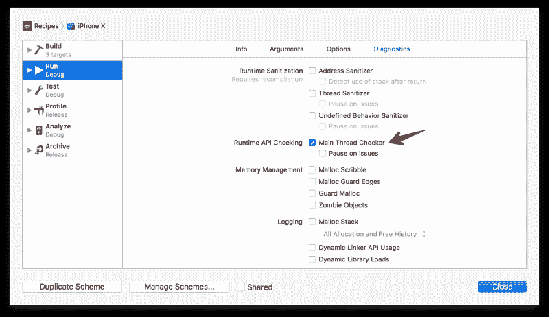

#### 衡量绩效和问题

我们可以使用[仪器](https://developer.apple.com/library/content/documentation/DeveloperTools/Conceptual/InstrumentsUserGuide/index.html)彻底剖析应用程序。为了快速测量，我们可以转到`Debug Navigator`选项卡，查看 CPU、内存和网络使用情况。查看[这篇很酷的文章](https://medium.com/@kazmiekr/what-every-ios-developer-should-be-doing-with-instruments-d1661eeaf64f)，了解更多关于乐器的知识。

#### 操场原型

Playground 是开发原型和构建应用程序的推荐方式。在 WWDC 2018 上，苹果推出了支持操场训练模型的 [Create ML](https://developer.apple.com/documentation/createml) 。查看[这篇很酷的文章](https://medium.com/flawless-app-stories/playground-driven-development-in-swift-cf167489fe7b)，了解更多关于 Swift 操场驱动开发的信息。

### 从这里去哪里

谢谢你能走到这一步。我希望你学到了有用的东西。学习的最好方法就是去做。如果你碰巧一遍又一遍地写同样的代码，那就把它做成一个组件。如果一个问题让你为难，那就写下来。与世界分享你的经验，你会学到很多。

我推荐阅读文章[学习 iOS 开发的最佳地点](https://medium.com/hyperoslo/best-places-to-learn-ios-development-85ebebe890cf)来了解更多关于 iOS 开发的知识。

如果您有任何问题、意见或反馈，不要忘记在评论中添加它们。如果你觉得这篇文章有用，别忘了鼓掌。？

如果你喜欢这个帖子，可以考虑访问[我的其他文章](https://github.com/onmyway133/blog/issues/165)和[应用](https://onmyway133.github.io/)？